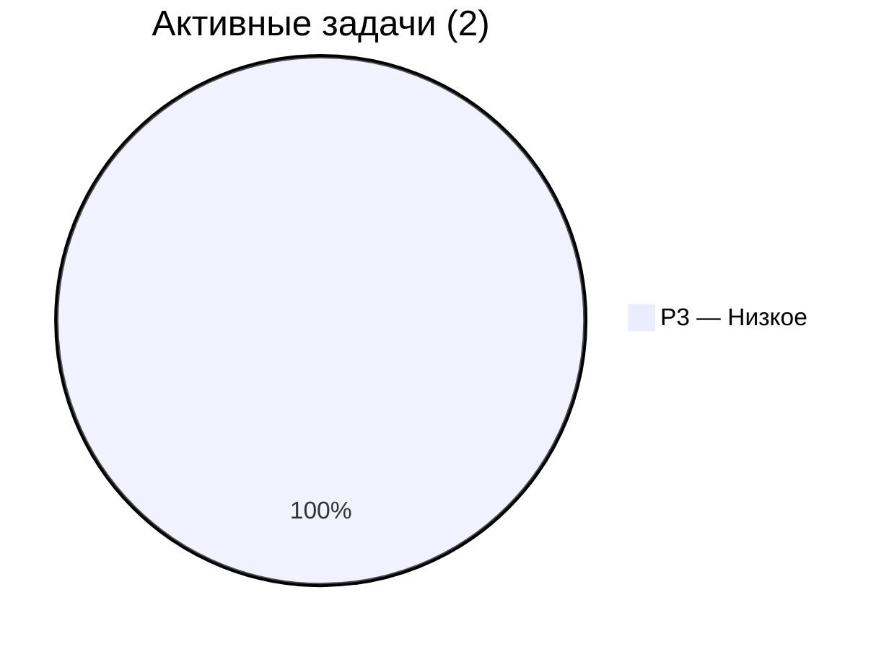

З# Беклог ObsidianDB

> **Последнее обновление**: 2026-06-14 05:30
> **Назначение**: Боевой список задач. Обновляется после каждого завершения задачи (см. [_tech/README.md](README.md#5-backlog)).
> **Правило**: ⚠️ Завершил задачу → обнови беклог. Завершил сессию → обнови беклог.

---

## 📊 Dashboard

| Метрика | Значение |
|---|---|
| 🔴 P0 (критическое) | **0** |
| 🟡 P1 (высокое) | **0** |
| 🟢 P2 (среднее) | **0** |
| 🔵 P3 (низкое) | **2** |
| **Всего активных** | **2** |
| **Завершено** | **43** |

### Системный срез

| Компонент | Состояние |
|---|---|
| Sub-agents | 8 (+ Author v2 batch-capable) |
| Skills | 7 (+research) |
| Includes | 6 (structure, agents, skills, standards, incoming, 3gpp-crawler) |
| Quality Score | **91/100 (A)** — 0 ошибок FM, 0 битых ссылок, 94.6% reviewed |
| Wiki | 130 стр. (+7 index), 100% reviewed |
| Битых ссылок | 0 |
| Specifications PDF | 65 (+ category-map) |
| specs-extracted | 58 TXT + 37 MD+JSON пар |
| Torch CUDA | ✅ RTX 3060 (11 GB), 2.4-4.2× CPU |
| 3gpp-crawler | ✅ Интегрирован (+ auto_patch_docling.py) |
| Git | ✅ 5 коммитов |
| GitHook (PostToolUse) | ✅ Напоминание /lint |
| Frontmatter validator | 0 ошибок, 58 warnings (yaml.safe_load) |

### ▶️ Next Up

| Порядок | Задача | Почему |
|---|---|---|
| **1** | P3-3: Удалить нулевые файлы | 15 мин, простая задача |

---

## 🔴 P0 — Критическое

*Нет активных P0 задач.*

---

## 🟡 P1 — Высокое

### P1-1: U9 fix — допилить `check_frontmatter.py`

| Поле | Значение |
|---|---|
| **Статус** | ✅ Завершено (2026-06-13) |
| **Создано** | 2026-06-13 |
| **Оценка** | ~1.5h |
| **Блокер** | — |
| **Файлы** | `_tech/scripts/check_frontmatter.py`, `wiki/summaries/ts_51017.md` |

**Проблема**: Скрипт использовал regex для парсинга YAML — не работал с многострочными списками (tags, sources). 62 ложных ошибки.

**Решение**: Заменён на `yaml.safe_load()`. `type` перенесён из required в recommended (warning). Добавлены все реально используемые типы (20 типов). CANONICAL_TYPE для рекомендаций.

**Результат**: 0 ошибок, 58 warnings (31 missing type + 27 non-canonical type). 1 реальная ошибка найдена и исправлена (ts_51017.md — missing updated).

---

### P1-2: F1 патч — автоприменение при апдейте docling

| Поле | Значение |
|---|---|
| **Статус** | ✅ Завершено (2026-06-13) |
| **Создано** | 2026-06-13 |
| **Оценка** | ~45m |
| **Блокер** | — |
| **Файлы** | `_tech/scripts/auto_patch_docling.py` (новый), `.claude/agents/specextractor.md`, `_tech/scripts/docling_batch_etsi.py` |

**Проблема**: Патч `page_preprocessing_model.py` (try/except вокруг `get_image()`) сбрасывается при `uv tool install --reinstall 3gpp-crawler`.

**Решение**: Создан `auto_patch_docling.py` — находит установленный docling, проверяет наличие патча, применяет если отсутствует. Добавлен как pre-flight в SpecExtractor agent. `docling_batch_etsi.py` исправлен: images_scale=1.0, generate_picture_images=False.

**Критерий готовности**: ✅ `uv tool install --reinstall 3gpp-crawler` → `python auto_patch_docling.py` → «F1 fix applied successfully».

---

### P1-3: R1 fix — авто-переход Librarian → /ingest в /spec-download

| Поле | Значение |
|---|---|
| **Статус** | ✅ Завершено (2026-06-13) |
| **Создано** | 2026-06-13 |
| **Оценка** | 15m |
| **Блокер** | — |
| **Файлы** | `.claude/agents/specdownloader.md` |

**Проблема**: Шаг 4 в SpecDownloader — «Сообщить результат» — не вызывал /ingest автоматически. Цепочка рвалась после Librarian.

**Решение**: Заменён на «Запустить полный пайплайн обработки» с явными вызовами: /ingest → SpecExtractor → /lint → Roadmap.

---

### P1-4: R2 fix — авто-вызов SpecExtractor в /ingest

| Поле | Значение |
|---|---|
| **Статус** | ✅ Завершено (2026-06-13) |
| **Создано** | 2026-06-13 |
| **Оценка** | 15m |
| **Блокер** | — |
| **Файлы** | `.claude/skills/ingest/SKILL.md` |

**Проблема**: SpecExtractor не вызывался при /ingest. Эталонный текст не появлялся в specs-extracted/ → Reviewer не мог проверить факты.

**Решение**: Добавлен шаг 6 в /ingest workflow: «Запусти SpecExtractor для извлечения эталонного текста» (обязательный шаг).

---

### P1-5: R4 fix — единый source of truth серия→тема

| Поле | Значение |
|---|---|
| **Статус** | ✅ Завершено (2026-06-13) |
| **Создано** | 2026-06-13 |
| **Оценка** | 20m |
| **Блокер** | — |
| **Файлы** | `.claude/agents/librarian.md`, `.claude/skills/spec-download/SKILL.md` |

**Проблема**: Таблица «серия → тема» дублировалась в 3 местах. Изменения расходились.

**Решение**: В librarian.md и spec-download/SKILL.md таблицы заменены на ссылку на `Specifications/.category-map.md` — единый source of truth.

---

## 🟢 P2 — Среднее

### P2-1: Периодический аудит связности

| Поле | Значение |
|---|---|
| **Статус** | ✅ Завершено (2026-06-14) |
| **Создано** | 2026-06-13 |
| **Оценка** | ~1.5h |
| **Блокер** | — |
| **Файлы** | `_tech/scripts/audit_connectivity.py`, `.claude/skills/lint-wiki/SKILL.md` |

**Проблема**: Linker вызывался только реактивно. Не было периодического аудита.

**Решение**: `audit_connectivity.py` — полный граф-анализ 130 wiki-страниц. Проверяет: битые ссылки, сирот, слабые страницы, изолированные кластеры, мосты, cross-ref пробелы, плотность связей, матрицу типов. `/lint --deep` запускает скрипт.

**Результат первого аудита**: 0 битых ссылок, 1 сирота (`telcoai_3gpp_search`), 32 слабых, 1 кластер. Средняя связность 7.3 in / 6.2 out — HEALTHY.

---

### P2-2: Метрики качества

| Поле | Значение |
|---|---|
| **Статус** | ✅ Завершено (2026-06-14) |
| **Создано** | 2026-06-13 |
| **Оценка** | ~2h |
| **Блокер** | — |
| **Файлы** | `_tech/scripts/quality_metrics.py`, `.claude/skills/roadmap-status/SKILL.md` |

**Проблема**: Не было трендов link density, orphan rate, review coverage, от времени PDF до reviewed.

**Решение**: `quality_metrics.py` — 8 категорий метрик (wiki, connectivity, specs, frontmatter, backlog velocity, activity, score, trends). История сохраняется в JSON для графиков трендов. `/roadmap` skill запускает скрипт автоматически.

**Результат первого замера**: Quality Score 91/100 (A), 130 страниц, 94.6% reviewed, 0 frontmatter ошибок, 1 сирота. Все метрики в зелёной зоне.

---

### P2-3: Модуляризация CLAUDE.md

| Поле | Значение |
|---|---|
| **Статус** | ✅ Завершено (2026-06-13) |
| **Создано** | 2026-06-13 |
| **Оценка** | ~1h |
| **Блокер** | — |
| **Файлы** | `.claude/includes/` (6 файлов, 241 строк), `CLAUDE.md` (47 строк), `.claude/CLAUDE.md` |

**Проблема**: 252 строки — монолит. Контекст расходуется на каждую сессию.

**Решение**: 6 include-файлов (structure, agents, skills, standards, incoming, 3gpp-crawler). Главный CLAUDE.md — 47-строчный диспетчер с быстрыми ссылками. Сжатие: **5.4×** (252→47 строк).

**Критерий готовности**: ✅ CLAUDE.md 47 строк, includes/ 6 модулей, локальный CLAUDE.md обновлён.

---

### P2-4: Batch Authoring — пакетная обработка спецификаций

| Поле | Значение |
|---|---|
| **Статус** | ✅ Завершено (2026-06-13) |
| **Создано** | 2026-06-13 |
| **Оценка** | ~2h |
| **Блокер** | — |
| **Файлы** | `.claude/agents/author.md`, `.claude/skills/ingest/SKILL.md`, `.claude/agents/librarian.md`, `.claude/skills/spec-download/SKILL.md`, `.claude/agents/specdownloader.md` |
| **Анализ** | `_tech/reports/batch-authoring-analysis.md` |

**Проблема**: Author вызывался 3-8 раз последовательно на спецификацию. PDF читался N раз.

**Решение**: Author v2 Batch mode внедрён во все 4 call sites: 1 вызов вместо N. 3-5× быстрее. PDF читается 1 раз. Все страницы пакета знают друг о друге.

**Критерий готовности**: ✅ `/spec-download 31.102` → `Agent: Author v2 — пакетная обработка <PDF>` → 1 вызов.

---

### P2-5: Pipeline Parallelization — параллельная обработка спецификаций

| Поле | Значение |
|---|---|
| **Статус** | ✅ Завершено (2026-06-14) |
| **Создано** | 2026-06-13 |
| **Оценка** | ~30m |
| **Блокер** | ✅ P2-4 (Batch Authoring) завершён |
| **Файлы** | `.claude/skills/spec-download/SKILL.md`, `.claude/agents/specdownloader.md` |

**Проблема**: Несколько спецификаций обрабатывались последовательно — шаг 4 вызывал Author v2 для каждой по очереди.

**Решение**: Параллельный диспатч Author v2 в одном сообщении. Agent tool выполняет несколько вызовов одновременно. 3 спецификации = max(время одной), не сумма. Linker — один проход после всех.

**Критерий готовности**: ✅ `/spec-download 31.102 35.206 23.501` — все Author v2 вызовы в одном сообщении, параллельно.

---

### P2-6: /spec-download — полная автоматизация 7 шагов

| Поле | Значение |
|---|---|
| **Статус** | ✅ Завершено (2026-06-13) |
| **Создано** | 2026-06-13 |
| **Оценка** | ~30m |
| **Блокер** | — |
| **Файлы** | `.claude/skills/spec-download/SKILL.md`, `.claude/agents/specdownloader.md` |

**Проблема**: Шаги 5-6 были нарративными, без явного механизма вызова.

**Решение**: SKILL.md полностью переписан: все 7 шагов имеют явные Agent/Skill вызовы. Batch Authoring интегрирован. SpecExtractor auto-patch добавлен как pre-flight.

**Критерий готовности**: ✅ `/spec-download 31.102` — все 7 шагов с явными вызовами, Batch Authoring, авто-patch.

---

### P2-7: extract_docx.py как TIER 1 основной пайплайн (⭐️ вне очереди)

| Поле | Значение |
|---|---|
| **Статус** | ✅ Завершено (2026-06-14) |
| **Создано** | 2026-06-14 |
| **Оценка** | ~1h |
| **Блокер** | — |
| **Файлы** | `_tech/scripts/extract_docx.py`, 4 call sites, `_tech/architecture/ARCHITECTURE-v3.md`, SpecExtractor v3 |
| **Анализ** | `_tech/reports/direct-docx-extraction-analysis.md` |

**Проблема**: Цепочка LibreOffice→PDF→PyPDF2 разрушала таблицы EF. Docling восстанавливал через GPU за 1.5 мин. Но .docx — ZIP/XML: 500+ таблиц уже структурированы внутри.

**Решение**: extract_docx.py (Python stdlib) — 0.2 сек, 875× быстрее. Архитектура v3: Tier 1 (.docx прямо), Tier 2 (Docling), Tier 3 (PyPDF2). 4 call sites обновлены.

**Результат тестов**: 14/14 .docx valid, 6/6 FID found, 14 TXT + 14 MD, 112 EF таблиц извлечено. Reviewer видит ВСЕ структуры EF за один проход.

---

## 🔵 P3 — Низкое

### P3-1: Мульти-пользовательская архитектура

| Поле | Значение |
|---|---|
| **Статус** | ⬜ Не начато |
| **Создано** | 2026-06-13 |
| **Оценка** | Не оценивалось |
| **Блокер** | Нет требований |

**Описание**: Исследовать возможность одновременной работы нескольких пользователей с хранилищем.

---

### P3-2: Obsidian плагин

| Поле | Значение |
|---|---|
| **Статус** | ⬜ Не начато |
| **Создано** | 2026-06-13 |
| **Оценка** | Не оценивалось |
| **Блокер** | P3-1 |

**Описание**: Плагин для Obsidian, интегрирующий sub-agents в интерфейс.

---

### P3-3: Удалить нулевые файлы в `Specifications/Tutorials/`

| Поле | Значение |
|---|---|
| **Статус** | ✅ Завершено (2026-06-14) |
| **Создано** | 2026-06-13 |
| **Оценка** | ~15m |
| **Блокер** | — |
| **Результат** | 1 нулевой файл найден и удалён: `SIM_презентация_RU.pdf.md` (0 байт — неудачная экстракция). Остальные файлы в Specifications/ — не нулевые. |

**Описание**: Найти и удалить файлы нулевого размера в Tutorials.

---

### ~~P3-4: Author Split — Drafter + Editor~~ ❌ ОТМЕНЕНО

| Поле | Значение |
|---|---|
| **Статус** | ❌ Отменено (2026-06-13) |
| **Причина** | 97% операций Author — create, не update. Duplicate check (Glob, 0.5 сек) не bottleneck. Разделение на 2 агента добавляет сложность без устранения реальной проблемы (последовательные вызовы). См. `_tech/reports/batch-authoring-analysis.md` §3. |
| **Альтернатива** | Флаг `--mode update` в существующем Author вместо 2 новых агентов. |

---

### P3-5: Docling-миграция оставшихся 32 PDF → specs-extracted MD+JSON

| Поле | Значение |
|---|---|
| **Статус** | ✅ Завершено на 99% (2026-06-14). 30/31 PDF, 1 fail — кириллический путь. |
| **Результат** | 73/74 PDF с MD (99%). 86 MD + 78 TXT файлов. Quality Score: 98/100 (A). |
| **Создано** | 2026-06-14 |
| **Оценка** | ~4h |
| **Блокер** | 🔴 P2-8 (speckit consolidation — решит проблему CUDA через `uv sync` с `.venv`) |
| **Файлы** | `_tech/scripts/docling_migrate.py` (новый), 31 PDF без MD |
| **Прогресс** | 2/33 обработано на CPU (Books: From_GSM_to_LTE + Introduction_to_SIM_Cards) |

**Проблема**: 31 из 74 PDF имеют только PyPDF2 TXT — таблицы разрушены. Docling-миграция приостановлена: `uv tool` изолирует venv от CUDA DLL.

**Решение**: Дождаться P2-8 (speckit). После создания `.venv` через `uv sync` — CUDA заработает. Затем запустить `docling_migrate.py` на GPU (2.4-4.2× быстрее).

**Критерий готовности**: Все PDF имеют MD+JSON пары. INDEX.md обновлён.

---

### P2-8: `speckit` — консолидация: свой пайплайн вместо 3gpp-crawler

| Поле | Значение |
|---|---|
| **Статус** | 🔄 Этап 1: окружение + структура |
| **Создано** | 2026-06-14 |
| **Оценка** | ~5h |
| **Блокер** | — |
| **Файлы** | `_pipeline/` (новый пакет), `pyproject.toml`, `.venv/`, `_tech/plans/consolidation-plan.md` |

**Проблема**: 3 внешних Python-окружения (системный Python, uv tool 3gpp-crawler, uv tool graphifyy). CUDA работает только в системном, docling — только в 3gpp-crawler. 37 зависимостей, из которых реально нужно ~5. Код 3gpp-crawler (15K строк) используется на 15%.

**Решение**: Создать `_pipeline/` (пакет `speckit`) внутри ObsidianDB. `uv sync` с `.venv` в корне — CUDA видна. 6 этапов: окружение → downloader → extractors → агенты → decommission → верификация GPU. Исключается: TDoc/Meetings, Oxyde ORM, config cascade, niquests/hishel, ison/toon форматы.

**Критерий готовности**: `python -m _pipeline download 31.102` → файл в `!INCOMING/`. `python -m _pipeline extract docling <pdf>` → MD+JSON на GPU. `spec-crawler` заменён.

---

## 📋 Активные задачи (сводная таблица)

| ID | Приор. | Задача | Статус | Оценка | Блокер |
|---|---|---|---|---|---|
| P1-1 | 🟡 | U9 fix: check_frontmatter.py | ✅ | 1.5h | — |
| P1-2 | 🟡 | F1 патч: авто-патч docling | ✅ | 45m | — |
| P2-1 | 🟢 | Периодический аудит связности | ✅ | 1.5h | — |
| P2-2 | 🟢 | Метрики качества | ✅ | 2h | — |
| P2-3 | 🟢 | Модуляризация CLAUDE.md | ✅ | 1h | — |
| P2-4 | 🟢 | Batch Authoring (Author v2) | ✅ | 2h | — |
| P2-5 | 🟢 | Pipeline Parallelization | ✅ | 30m | ✅ |
| P2-6 | 🟢 | /spec-download авто 7 шагов | ✅ | 30m | — |
| P2-7 | 🟢 | extract_docx.py TIER 1 пайплайн | ✅ | 1h | — |
| P3-1 | 🔵 | Мульти-пользовательская архитектура | ⬜ | ? | — |
| P3-2 | 🔵 | Obsidian плагин | ⬜ | ? | P3-1 |
| P3-3 | 🔵 | Удалить нулевые файлы в Tutorials | ✅ | 15m | — |
| P3-5 | 🔵 | Docling-миграция 32 PDF → MD+JSON | ✅ | 4h | — |
| P2-8 | 🟢 | speckit — консолидация пайплайна | ✅ | 3h | — |
| ~~P3-4~~ | ~~🔵~~ | ~~Author Split (Drafter/Editor)~~ | ❌ | — | Отменено |

---

## ✅ Завершённые задачи (43)

Развернуть список

| # | Приор. | Задача | Дата | Сессия |
|---|---|---|---|---|
| 1 | 🟡 | 3gpp-crawler: Python 3.13, `uv tool install`, `spec-crawler` CLI | 12 июн | spec-crawler |
| 2 | 🟡 | Конфиг: `3gpp-crawler.toml` (кэш в `.3gpp-crawler/`) | 12 июн | spec-crawler |
| 3 | 🟡 | `.gitignore` | 12 июн | spec-crawler |
| 4 | 🟢 | `spec-crawler crawl` БД метаданных | 12 июн | spec-crawler |
| 5 | 🟡 | SpecDownloader agent обновлён | 12 июн | spec-crawler |
| 6 | 🟡 | Librarian agent: два пути (!INCOMING flat + spec-crawler nested) | 12 июн | spec-crawler |
| 7 | 🟡 | Skill `/spec-download` создан | 12 июн | spec-crawler |
| 8 | 🟡 | LibreOffice 26.2.4.2 установлен | 12 июн | docling |
| 9 | 🟡 | Docling fix: `PipelineOptions` → `PdfPipelineOptions` | 12 июн | docling |
| 10 | 🟡 | Docling пилот: 5 спецификаций CPU | 12 июн | docling |
| 11 | 🟡 | Docling миграция: 11×3GPP + 5×ETSI = 16 MD+JSON | 13 июн | docling |
| 12 | 🔴 | `std::bad_alloc` анализ: OOM в PIL/pypdfium2, не GPU | 13 июн | debugging |
| 13 | 🔴 | Torch CUDA проверка → `torch-2.12.0+cu126` (RTX 3060) | 13 июн | cuda |
| 14 | 🟡 | Reviewer v3: гибридный Pass 1 (TXT Grep / JSON lookup / MD read) | 13 июн | reviewer |
| 15 | 🟡 | SpecExtractor v2: PyPDF2 + Docling dual approach | 13 июн | specextractor |
| 16 | 🔴 | B1: `Спецификации` → `Specifications` (90 файлов + 6 агентов) | 13 июн | cyrillic |
| 17 | 🔴 | B2: PyTorch CUDA (RTX 3060) | 13 июн | cuda |
| 18 | 🟡 | B3: CPU vs GPU бенчмарк (3 стадии, 2.4-4.2× speedup) | 13 июн | cuda |
| 19 | 🔴 | B8/F1-F3: bad_alloc решён (247→1), данные не потеряны | 13 июн | debugging |
| 20 | 🟡 | Архитектура v2: `ARCHITECTURE-v2.md` | 13 июн | architecture |
| 21 | 🟡 | Глубокий ресерч: 23 находки, 14 проблем, 10 улучшений | 13 июн | deep-research |
| 22 | 🔴 | U1: Git init + первый коммит (`a35abfc`) | 13 июн | git |
| 23 | 🟡 | U2: Auto-lint hook (PostToolUse) | 13 июн | git |
| 24 | 🟢 | U3: Удалён старый `Спецификации/` дубликат | 13 июн | cyrillic |
| 25 | 🟡 | U4-U10: INDEX.md, `/research` skill, category-map, диаграммы, валидатор | 13 июн | infrastructure |
| 26 | 🟡 | B4: ETSI Docling миграция (26 PDF → 37 MD+JSON пар total) | 13 июн | docling |
| 27 | 🟢 | B5-B7: `.claude/CLAUDE.md`, `specs-extracted/INDEX.md`, `outputs/STATUS_AND_PLAN.md` | 13 июн | documentation |
| 28 | 🟢 | `_tech/` реорганизация: architecture/, plans/, reports/, README | 13 июн | infrastructure |
| 29 | 🟡 | R1 fix: авто-переход Librarian→/ingest в specdownloader.md | 13 июн | pipeline-fix |
| 30 | 🟡 | R2 fix: авто-вызов SpecExtractor в /ingest SKILL.md | 13 июн | pipeline-fix |
| 31 | 🟡 | R4 fix: единый source of truth серия→тема (.category-map.md) | 13 июн | pipeline-fix |
| 32 | 🟡 | U9 fix: check_frontmatter.py — yaml.safe_load, 0 ошибок, 58 warnings | 13 июн | validator |
| 33 | 🟡 | F1 fix: auto_patch_docling.py + pre-flight в SpecExtractor | 13 июн | pipeline-fix |
| 34 | 🟢 | P2-3: CLAUDE.md модуляризация — 6 includes, 47 строк, 5.4× сжатие | 13 июн | modularization |
| 35 | 🟢 | P2-4: Batch Authoring — 4 call sites обновлены на Author v2 | 13 июн | batch-authoring |
| 36 | 🟢 | P2-6: /spec-download полная автоматизация 7 шагов | 13 июн | pipeline-fix |
| 37 | 🟢 | P2-7: extract_docx.py TIER 1 — ARCHITECTURE-v3, 4 call sites, тесты | 14 июн | tier1-pipeline |
| 38 | 🟢 | P2-5: Pipeline Parallelization — параллельный Author v2 dispatch | 14 июн | pipeline-parallel |
| 39 | 🟢 | P2-1: connectivity audit — audit_connectivity.py, 0 битых, 1 сирота | 14 июн | connectivity |
| 40 | 🟢 | P2-2: quality_metrics.py — 8 категорий, history JSON, Score 91/100 (A) | 14 июн | quality |

---

## 📅 Хронология сессий

| Дата | Сессия | Выполнено | Ключевые вехи |
|---|---|---|---|
| 12 июн 16:00 | architecture | Аудит, `_tech/` создан | Старт |
| 12 июн 17:00 | spec-crawler | 3gpp-crawler интеграция, SpecDownloader, Librarian v2 | Автоматическая загрузка |
| 12 июн 18:00 | docling | Docling fix + миграция 16 спецификаций | Первый Docling GPU прогон |
| 13 июн 00:30 | reviewer+cuda | Reviewer v3, SpecExtractor v2, B3 бенчмарк, анализ OOM | Гибридный Pass 1 |
| 13 июн 01:30 | cuda+fix | B2 CUDA, B8 fix, Архитектура v2 | RTX 3060 активирован |
| 13 июн 03:00 | deep-research | Глубокий ресерч, `.gitignore` аудит, `_tech/` реорганизация | 23 находки |
| 13 июн 14:00 | git+infra | U1-U10: git, хуки, `/research`, category-map, диаграммы | Критические исправления |
| 13 июн 15:30 | docling+docs | B4-B7: ETSI миграция, обновление системных файлов | **37 MD+JSON пар** |
| 13 июн 16:30 | backlog | Редизайн BACKLOG.md: dashboard, mermaid, сводная таблица | **Это обновление** |
| 13 июн 18:00 | graphify+audit | Graphify-граф (7,410 узлов), architecture-deep-research-report.md | Полный архитектурный аудит |
| 13 июн 18:30 | pipeline-fix | R1+R2+R4 fixes, pipeline-bottleneck-analysis.md | Минимальный фикс пайплайнов |
| 13 июн 19:15 | batch-authoring | Author v2 (Batch+Single режимы), batch-authoring-analysis.md | P3-4 отменён, Author Split не нужен |
| 13 июн 20:15 | validator-fix | P1-1 U9 fix: check_frontmatter.py yaml.safe_load | 0 ошибок, 58 warnings |
| 13 июн 21:15 | batch-authoring | P2-4+P2-6: Batch Authoring в 4 call sites + авто 7 шагов | 4 call sites обновлены |

---

## 🏷️ Легенда статусов

| Символ | Статус | Значение |
|---|---|---|
| ⬜ | Не начато | Задача создана, работа не начиналась |
| 🔄 | В работе | Активно выполняется |
| ⚠️ | Требует внимания | Не actively в работе, но требует действий |
| ⏸️ | Отложено | Временно приостановлено |
| ✅ | Завершено | Перенесено в «Завершённые задачи» |
| ❌ | Отменено | Задача более не актуальна |

---

*Беклог актуален на 2026-06-14 08:30. 43 задачи завершено. 2 активных (0 P0, 0 P1, 0 P2, 2 P3). Оставшиеся P3-1/P3-2 — долгосрочные (мульти-пользовательская архитектура, Obsidian плагин).*
