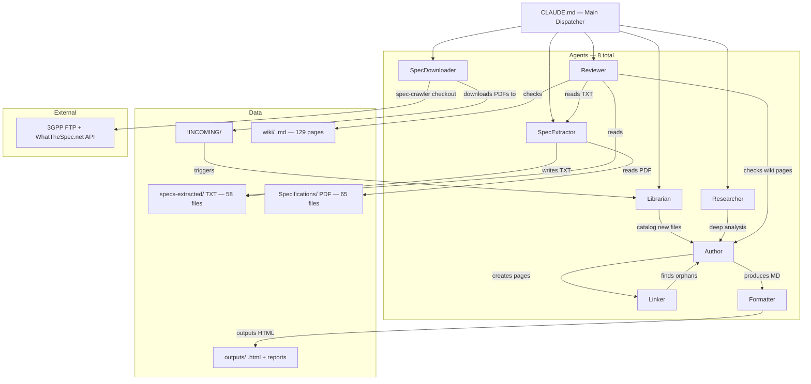

# Agent Interaction Graph (8 agents)



## Flow directions (updated)

```
SpecDownloader → !INCOMING/ → Librarian → Author → Linker     (new: auto-download pipeline)
User → !INCOMING/ → Librarian → Author → Linker                (manual pipeline)
Researcher → Author → Linker                                   (research pipeline)
SpecExtractor → Reviewer → Author                              (review pipeline)
Author → Formatter → Outputs                                   (formatting pipeline)
```
