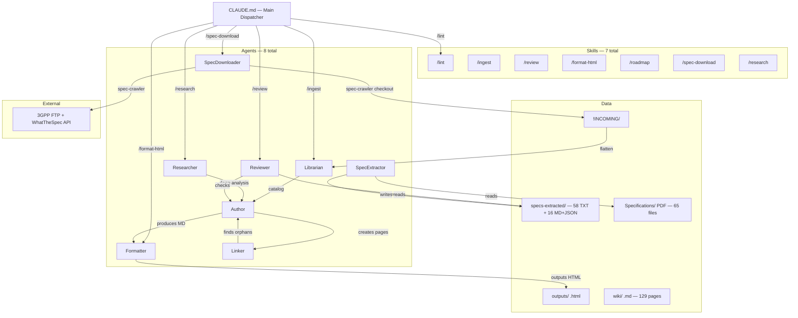

# Agent Interaction Graph (8 agents + 6 skills)

```mermaid
graph TD
    CLAUDE["CLAUDE.md — Main Dispatcher"]

    CLAUDE -->|/spec-download| SpecDownloader
    CLAUDE -->|/ingest| Librarian
    CLAUDE -->|/research| Researcher
    CLAUDE -->|/review| Reviewer
    CLAUDE -->|/format-html| Formatter
    CLAUDE -->|/lint| LintTool

    SpecDownloader -->|"spec-crawler checkout"| IncomingDir
    IncomingDir["!INCOMING/"] -->|"flatten"| Librarian

    Librarian -->|"catalog"| Author
    Researcher -->|"deep analysis"| Author

    Reviewer -->|"reads"| SpecsExtracted
    Reviewer -->|"checks"| Author
    SpecExtractor -->|"writes"| SpecsExtracted
    SpecExtractor -->|"reads"| SpecsDir

    Author -->|"creates pages"| Linker
    Linker -->|"finds orphans"| Author

    Author -->|"produces MD"| Formatter
    Formatter -->|"outputs HTML"| Outputs

    SpecDownloader -->|"spec-crawler"| SpecSource
    SpecSource["3GPP FTP + WhatTheSpec API"]

    subgraph "Skills — 7 total"
        LintTool["/lint"]
        IngestSkill["/ingest"]
        ReviewSkill["/review"]
        FormatSkill["/format-html"]
        RoadmapSkill["/roadmap"]
        DownloadSkill["/spec-download"]
        ResearchSkill["/research"]
    end

    subgraph "Agents — 8 total"
        Author
        Reviewer
        Linker
        Librarian
        Researcher
        Formatter
        SpecExtractor
        SpecDownloader
    end

    subgraph "Data"
        SpecsDir["Specifications/ PDF — 65 files"]
        SpecsExtracted["specs-extracted/ — 58 TXT + 16 MD+JSON"]
        Wiki["wiki/ .md — 129 pages"]
        Outputs["outputs/ .html"]
        IncomingDir
    end

    subgraph "External"
        SpecSource
    end
```
