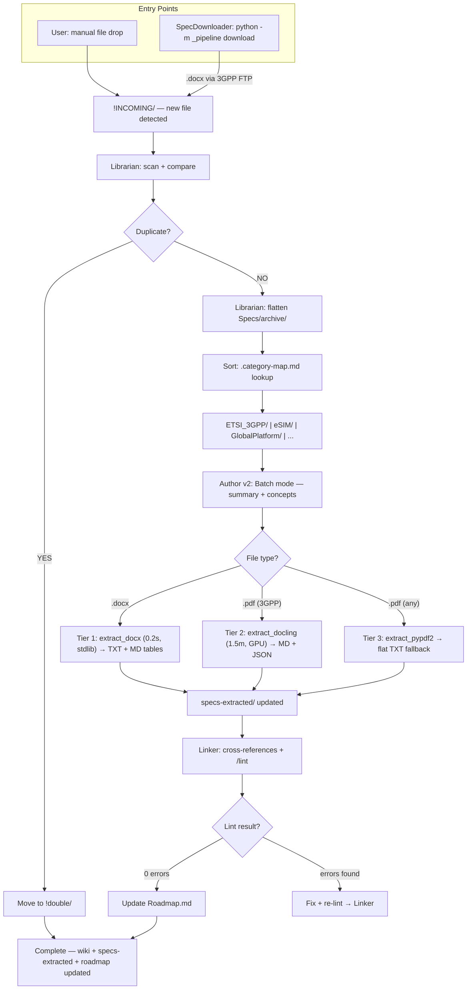

# INCOMING Pipeline (v4 — speckit + 3-Tier Extraction)

> **Обновлён**: 2026-06-14. spec-crawler → speckit, Tier 1/2/3, Linker consolidation

**Что изменилось с v3:**

| Аспект | v3 | v4 |
|---|---|---|
| Download | `spec-crawler checkout` | `python -m _pipeline download` |
| Extraction | Docling GPU + PyPDF2 | Tier 1 (.docx) / Tier 2 (Docling) / Tier 3 (PyPDF2) |
| Линковка | После Author, отдельно | Linker — единая точка (R3) |
| /lint | 5 вызовов | 1 вызов через Linker |
| Время .docx | 2.5 мин (PDF цепочка) | 0.2 сек (Tier 1 прямой) |
