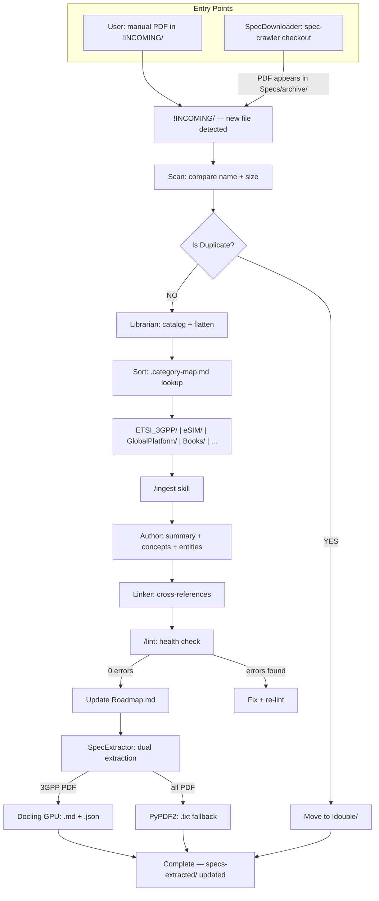

# INCOMING Pipeline (v3 — SpecDownloader + Docling)

```mermaid
flowchart TD
    subgraph "Entry Points"
        USER["User: manual PDF in !INCOMING/"]
        SD["SpecDownloader: spec-crawler checkout"]
    end

    USER --> INCOMING["!INCOMING/ — new file detected"]
    SD -->|"PDF appears in Specs/archive/"| INCOMING

    INCOMING --> SCAN["Scan: compare name + size"]

    SCAN --> DUP{"Is Duplicate?"}

    DUP -->|"YES"| DOUBLE["Move to !double/"]
    DUP -->|"NO"| LIBRARIAN["Librarian: catalog + flatten"]

    LIBRARIAN --> SORT["Sort: .category-map.md lookup"]

    SORT --> CATEGORIES["ETSI_3GPP/ | eSIM/ | GlobalPlatform/ | Books/ | ..."]

    CATEGORIES --> INGEST["/ingest skill"]
    INGEST --> AUTHOR["Author: summary + concepts + entities"]
    AUTHOR --> LINKER["Linker: cross-references"]
    LINKER --> LINT["/lint: health check"]
    LINT -->|"0 errors"| ROADMAP["Update Roadmap.md"]
    LINT -->|"errors found"| FIX["Fix + re-lint"]

    ROADMAP --> EXTRACT["SpecExtractor: dual extraction"]
    EXTRACT -->|"3GPP PDF"| DOCLING["Docling GPU: .md + .json"]
    EXTRACT -->|"all PDF"| PYPDF2["PyPDF2: .txt fallback"]
    DOCLING --> DONE["Complete — specs-extracted/ updated"]
    PYPDF2 --> DONE
    DOUBLE --> DONE
```
