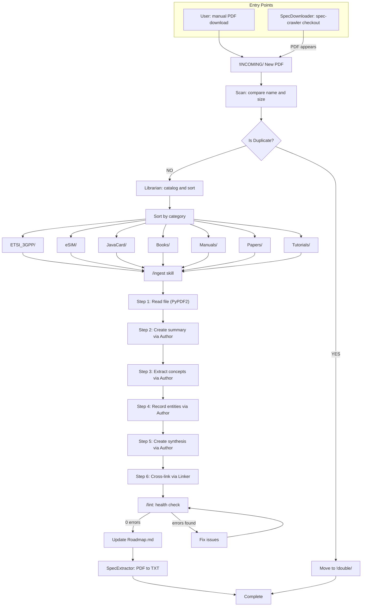

# INCOMING Pipeline (v2 — with SpecDownloader)

## What changed from v1

| Change | Detail |
|---|---|
| New entry: SpecDownloader | `spec-crawler checkout` → PDF in `!INCOMING/` automatically |
| 3GPP FTP + WhatTheSpec API | No manual download from portal needed |
| Same pipeline after `!INCOMING/` | Librarian → /ingest → /lint unchanged |
