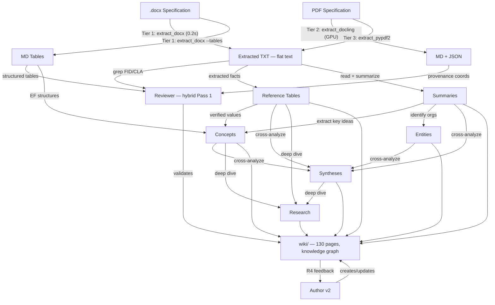

# Knowledge Types and Their Relationships

**3 источника эталонного текста (для Reviewer Pass 1):**

| Источник | Инструмент | Формат | Скорость |
|---|---|---|---|
| .docx прямой | Tier 1: extract_docx | TXT + MD tables | 0.2 сек |
| PDF (3GPP) | Tier 2: extract_docling | MD + JSON (GPU) | 1.5 мин |
| PDF (любой) | Tier 3: extract_pypdf2 | TXT плоский | 15-60 сек |
