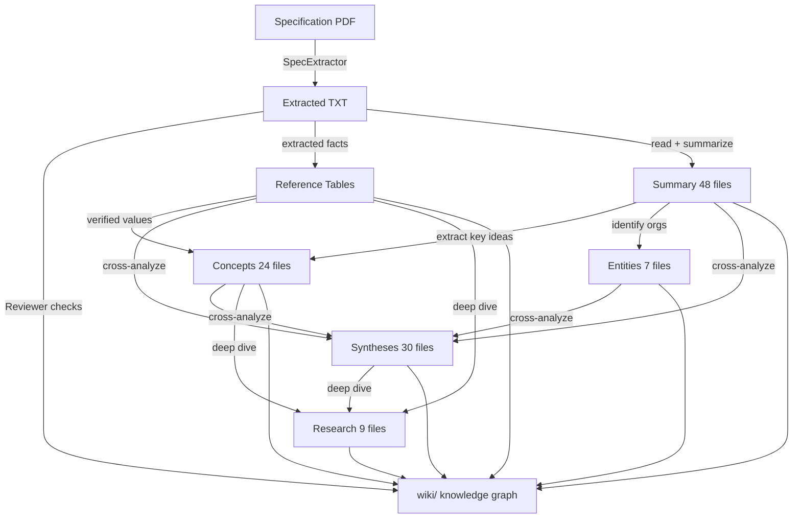

# Knowledge Types and Their Relationships



## Volume / Depth matrix

```
                    Volume (KB)
                    1-3    5-10    10-15    15-50+
Depth               -----------------------------
  extracted         Summary
  foundation                 Entity
  intermediate               Concept
  advanced                         Synthesis
  expert                                  Research
  reference               Reference
```
