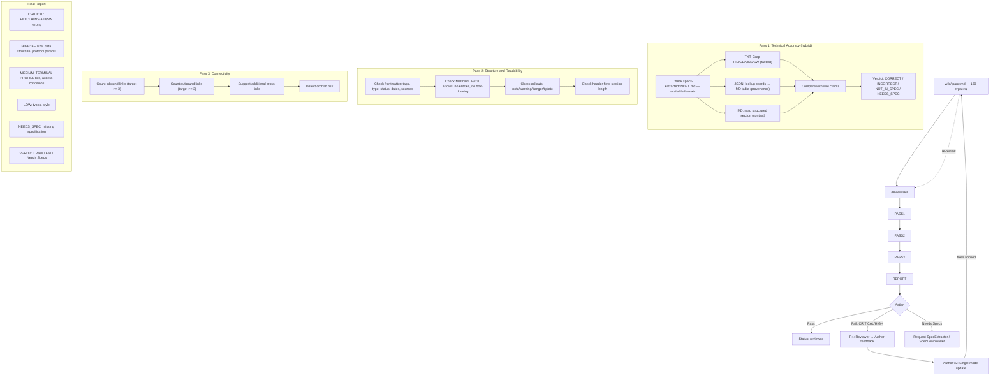

# Review Pipeline (3-pass + R4 feedback loop)

> **Обновлён**: 2026-06-14. Гибридный Pass 1 (3 формата), R4: Reviewer → Author



**3 источника для гибридного Pass 1:**

| Инструмент | Тип утверждения | Формат |
|---|---|---|
| TXT Grep | FID, CLA, SW, размеры | PyPDF2 / Tier 3 |
| JSON lookup | Координаты таблиц, provenance | Docling / Tier 2 |
| MD read | Контекст, структуры EF | Docling / Tier 1-2 |

**R4 Feedback Loop (NEW):**
```
Reviewer → Author v2 (Single mode update) → wiki page → re-review
```
