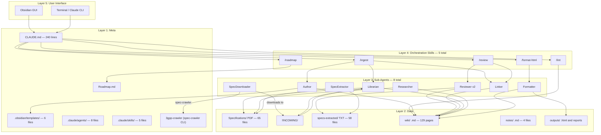

# System Architecture Layers (5 layers, 8 agents)

## Notes

- `SpecDownloader` is the newest agent (added 2026-06-12) — bridges 3gpp-crawler ↔ `!INCOMING/`
- `3gpp-crawler` is an external CLI tool installed globally via `uv tool install`, not part of the ObsidianDB repo
- Cache: `D:\ObsidianDB\.3gpp-crawler\` (in `.gitignore`)
