# System Architecture Layers (5 layers, 8 agents, 7 skills, speckit)

> **Обновлён**: 2026-06-14 из графа (7,642 узла, 19,799 рёбер, 396 сообществ)
> **Верифицировано**: 102 EXTRACTED оркестрационных ребра speckit↔агенты

```mermaid
graph TD
    subgraph "Layer 5: Management — 19 граф-узлов"
        CLAUDE_MD["CLAUDE.md — 47 строк"]
        ROADMAP_FILE["Roadmap.md"]
        BACKLOG["_tech/BACKLOG.md"]
        TECH_README["_tech/README.md"]
    end

    subgraph "Layer 4: AI Intelligence — 43 граф-узла"
        AUTHOR["Author v2 — Batch + Single"]
        REVIEWER["Reviewer v3 — гибридный Pass 1"]
        LINKER["Linker — граф-связность"]
        LIBRARIAN["Librarian v2 — flatten + sort"]
        RESEARCHER["Researcher — deep investigations"]
        FORMATTER["Formatter — MD → HTML"]
        SPECEXTRACTOR["SpecExtractor v3 — 3-tier extraction"]
        SPECDOWNLOADER["SpecDownloader — speckit"]
    end

    subgraph "Layer 3: Processing Engine — 165 граф-узлов"
        PIPELINE["_pipeline/ — 10 модулей"]
        SCRIPTS["_tech/scripts/ — 13 скриптов"]
        TIER1["Tier 1: extract_docx (0.2s, stdlib)"]
        TIER2["Tier 2: extract_docling (1.5m, GPU)"]
        TIER3["Tier 3: extract_pypdf2 (fallback)"]
    end

    subgraph "Layer 2: Engineering Docs — 228 граф-узлов"
        ARCH["ARCHITECTURE-v3.md"]
        PLANS["plans/ — 1 активный + 6 архив"]
        REPORTS["reports/ — 16 отчётов"]
        DIAGRAMS["diagrams/ — 5 Mermaid-диаграмм"]
    end

    subgraph "Layer 1: Data — 237 файлов"
        SPECS["Specifications/ — 74 PDF + 20 DOCX"]
        INCOMING["!INCOMING/"]
        EXTRACTED["specs-extracted/ — 78 TXT + 86 MD + 73 JSON"]
        WIKI["wiki/ — 130 страниц + 7 индексов"]
        NOTES["notes/ — 5 файлов"]
        OUTPUTS["outputs/ — HTML"]
        CACHE[".speckit/ — metadata DB"]
    end

    %% Layer 5 → Layer 4
    CLAUDE_MD --> AUTHOR
    CLAUDE_MD --> REVIEWER
    CLAUDE_MD --> LINKER
    CLAUDE_MD --> LIBRARIAN
    CLAUDE_MD --> RESEARCHER
    CLAUDE_MD --> FORMATTER
    CLAUDE_MD --> SPECEXTRACTOR
    CLAUDE_MD --> SPECDOWNLOADER

    %% Layer 4 → Layer 3 (102 EXTRACTED ребра)
    SPECDOWNLOADER -->|"download"| PIPELINE
    SPECDOWNLOADER -->|"metadata fetch"| PIPELINE
    SPECEXTRACTOR -->|"extract docx"| TIER1
    SPECEXTRACTOR -->|"extract docling"| TIER2
    SPECEXTRACTOR -->|"extract pypdf2"| TIER3
    LIBRARIAN --> SCRIPTS
    AUTHOR --> SCRIPTS

    %% Layer 4 internal (R1-R4)
    LINKER -->|"/lint"| WIKI
    SPECEXTRACTOR -->|"R1"| LINKER
    RESEARCHER -->|"R2"| LINKER
    SPECDOWNLOADER -->|"R3"| LINKER
    LIBRARIAN -->|"R3"| LINKER
    AUTHOR -->|"R3"| LINKER
    REVIEWER -->|"R4"| AUTHOR

    %% Layer 3 → Layer 1
    PIPELINE --> INCOMING
    TIER1 --> EXTRACTED
    TIER2 --> EXTRACTED
    TIER3 --> EXTRACTED

    %% Layer 4 → Layer 1
    AUTHOR --> WIKI
    REVIEWER --> EXTRACTED
    REVIEWER --> WIKI
    LINKER --> WIKI
    LIBRARIAN --> SPECS
    LIBRARIAN --> INCOMING
    RESEARCHER --> WIKI
    FORMATTER --> WIKI
    FORMATTER --> OUTPUTS
    SPECEXTRACTOR --> SPECS
    SPECEXTRACTOR --> EXTRACTED

    %% Layer 1 internal
    INCOMING --> LIBRARIAN
```

**5 слоёв (из графа):**

| Слой | Узлов | Состав |
|---|---|---|
| L5 Management | 19 | CLAUDE.md, Roadmap, BACKLOG, README |
| L4 AI Intelligence | 43 | 8 agents + 7 skills + 6 includes |
| L3 Processing Engine | 165 | _pipeline/ (78) + scripts/ (87) |
| L2 Engineering Docs | 228 | architecture, plans, reports, diagrams |
| L1 Data | — | wiki, Specifications, specs-extracted, notes |

**Мосты между слоями (из графа):**
- L4↔L3: 102 EXTRACTED ребра (speckit — был 0 до миграции!)
- L4↔L1: Author→wiki, Reviewer→specs-extracted, Linker→wiki
- L3→L1: _pipeline→!INCOMING, Tier1/2/3→specs-extracted
