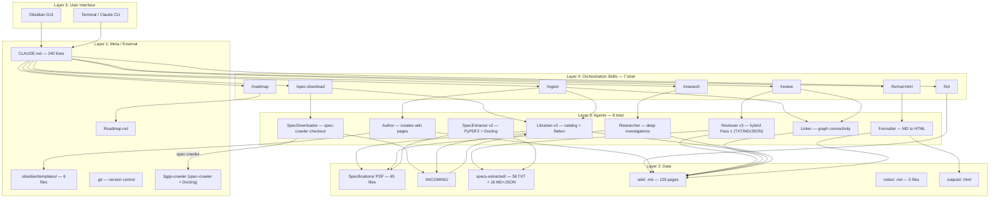

# System Architecture Layers (5 layers, 8 agents, 7 skills)

```mermaid
graph TD
    subgraph "Layer 5: User Interface"
        OBSIDIAN["Obsidian GUI"]
        TERMINAL["Terminal / Claude CLI"]
    end

    subgraph "Layer 4: Orchestration Skills — 7 total"
        INGEST["/ingest"]
        REVIEW["/review"]
        LINT["/lint"]
        FORMAT["/format-html"]
        ROADMAP["/roadmap"]
        DOWNLOAD["/spec-download"]
        RESEARCH["/research"]
    end

    subgraph "Layer 3: Agents — 8 total"
        AUTHOR["Author — creates wiki pages"]
        REVIEWER["Reviewer v3 — hybrid Pass 1 (TXT/MD/JSON)"]
        LINKER["Linker — graph connectivity"]
        LIBRARIAN["Librarian v2 — catalog + flatten"]
        RESEARCHER["Researcher — deep investigations"]
        FORMATTER["Formatter — MD to HTML"]
        SPECEXTRACTOR["SpecExtractor v2 — PyPDF2 + Docling"]
        SPECDOWNLOADER["SpecDownloader — spec-crawler checkout"]
    end

    subgraph "Layer 2: Data"
        SPECS["Specifications/ PDF — 65 files"]
        INCOMING["!INCOMING/"]
        EXTRACTED["specs-extracted/ — 58 TXT + 16 MD+JSON"]
        WIKI["wiki/ .md — 129 pages"]
        NOTES["notes/ .md — 5 files"]
        OUTPUTS["outputs/ .html"]
    end

    subgraph "Layer 1: Meta / External"
        CLAUDE_MD["CLAUDE.md — 240 lines"]
        ROADMAP_FILE["Roadmap.md"]
        TEMPLATES[".obsidian/templates/ — 6 files"]
        GIT[".git — version control"]
        EXTERNAL["3gpp-crawler (spec-crawler + Docling)"]
    end

    OBSIDIAN --> CLAUDE_MD
    TERMINAL --> CLAUDE_MD

    CLAUDE_MD --> INGEST
    CLAUDE_MD --> REVIEW
    CLAUDE_MD --> LINT
    CLAUDE_MD --> FORMAT
    CLAUDE_MD --> ROADMAP
    CLAUDE_MD --> DOWNLOAD
    CLAUDE_MD --> RESEARCH

    DOWNLOAD --> SPECDOWNLOADER
    DOWNLOAD --> LIBRARIAN
    INGEST --> AUTHOR
    INGEST --> LINKER
    INGEST --> LIBRARIAN
    REVIEW --> REVIEWER
    REVIEW --> LINKER
    LINT --> WIKI
    FORMAT --> FORMATTER
    ROADMAP --> ROADMAP_FILE
    RESEARCH --> RESEARCHER

    SPECDOWNLOADER -->|spec-crawler| EXTERNAL
    SPECDOWNLOADER --> INCOMING

    AUTHOR --> WIKI
    AUTHOR --> TEMPLATES
    REVIEWER --> EXTRACTED
    REVIEWER --> WIKI
    LINKER --> WIKI
    LIBRARIAN --> SPECS
    LIBRARIAN --> INCOMING
    LIBRARIAN --> WIKI
    RESEARCHER --> WIKI
    RESEARCHER --> SPECS
    FORMATTER --> WIKI
    FORMATTER --> OUTPUTS
    SPECEXTRACTOR --> SPECS
    SPECEXTRACTOR --> EXTRACTED

    INCOMING --> LIBRARIAN
```
