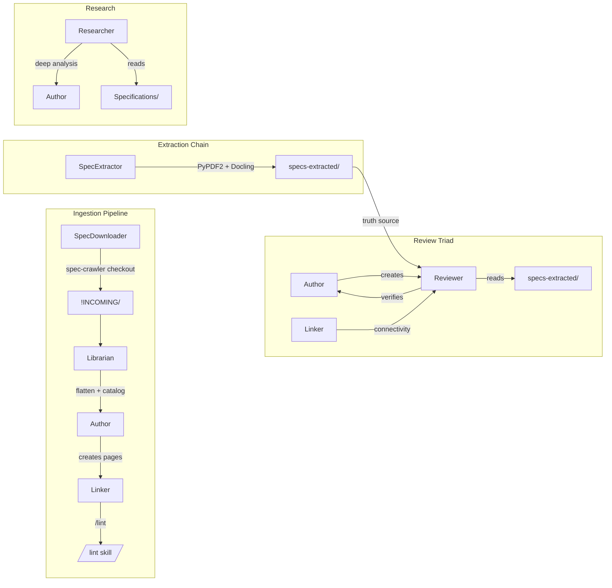

# Архитектура ObsidianDB — Глубокий ресерч

> **Дата**: 2026-06-13 18:00
> **Метод**: Полный анализ архитектуры — ручной аудит 63 doc-файлов + graphify-граф (7,410 узлов, 19,407 связей, 364 сообщества)
> **Охват**: 8 агентов · 7 skills · 6 шаблонов · 3gpp-crawler (интерфейсный слой) · _tech/ · хуки · .obsidian/ · .claude/
> **Ключевой вывод**: Архитектура зрелая (фаза 5 Automation), но имеет 7 структурных узких мест, требующих внимания.

---

## 1. Пятислойная архитектура

```
┌─────────────────────────────────────────────────────┐
│  L5: Интерфейс                                      │
│  Obsidian GUI  ·  Terminal (Claude Code CLI)        │
├─────────────────────────────────────────────────────┤
│  L4: Оркестрация — 7 Skills                          │
│  /spec-download  /ingest  /review  /lint            │
│  /format-html    /roadmap /research                 │
├─────────────────────────────────────────────────────┤
│  L3: Исполнители — 8 Agents                          │
│  SpecDownloader  Librarian  Author  Reviewer        │
│  Linker  Researcher  Formatter  SpecExtractor       │
├─────────────────────────────────────────────────────┤
│  L2: Данные                                         │
│  Specifications/ (65 PDF) · specs-extracted/        │
│  wiki/ (129 стр.) · notes/ (4) · outputs/           │
├─────────────────────────────────────────────────────┤
│  L1: Мета-инфраструктура                             │
│  CLAUDE.md · Roadmap.md · _tech/ · .git/            │
│  3gpp-crawler/ · .obsidian/ · .claude/              │
└─────────────────────────────────────────────────────┘
```

**Принцип**: Skills — оркестраторы ( pipelines), Agents — узкие специалисты (workers), CLAUDE.md — диспетчер (router).

---

## 2. Полная матрица агентов

| # | Агент | Файл | Триггер(ы) | Вход → Выход | Вызывает | Вызывается из |
|---|---|---|---|---|---|---|
| 1 | **SpecDownloader** | `specdownloader.md` | `/spec-download`, прямой запрос | номер TS → `!INCOMING/Specs/archive/` .docx | spec-crawler CLI | `/spec-download` skill |
| 2 | **Librarian v2** | `librarian.md` | появление файлов в `!INCOMING/` | `!INCOMING/` → `Specifications/<тема>/` | Author, Linker, /lint | SpecDownloader, `/ingest`, `/spec-download` |
| 3 | **Author** | `author.md` | `/ingest`, создание страницы | материал → `wiki/` .md + frontmatter | /lint | Librarian, `/ingest`, `/spec-download`, Researcher, прямой запрос |
| 4 | **Reviewer v3** | `reviewer.md` | `/review`, после Author | wiki-страница → CRITICAL/HIGH/MEDIUM/LOW | grep, Read, JSON lookup | `/review` skill |
| 5 | **Linker** | `linker.md` | `/lint` (сироты), `/ingest` шаг 6 | `wiki/` → предложения wikilinks | /lint | Librarian, `/ingest`, `/review` |
| 6 | **Researcher** | `researcher.md` | запрос на исследование | тема → `wiki/research/` (15-50 KB) | /lint | `/research` skill, прямой запрос |
| 7 | **Formatter** | `formatter.md` | `/format-html` | `wiki/*.md` → `outputs/*.html` | — | `/format-html` skill |
| 8 | **SpecExtractor v2** | `specextractor.md` | первый запуск, новый PDF | PDF → `specs-extracted/*.txt` + `*.md` + `*.json` | PyPDF2, Docling | прямой запрос, `/spec-download` |

### Карта вызовов (graphify: 9 hyperedges)



### Бутылочное горлышко: Author

Author вызывается из **5 разных источников** — Librarian, `/ingest`, `/spec-download`, Researcher, прямой запрос. Это единственный агент, создающий контент. При параллельной работе — узкое место.

```
Источники вызова Author:
  ┌────────────┐
  │ Librarian  ├──► Author ◄──┤ /spec-download
  └────────────┘              ├──┤ /ingest
                              ├──┤ Researcher
                              └──┤ Прямой запрос
```

---

## 3. Полная матрица skills (оркестраторов)

| # | Skill | Триггер | Агенты в цепочке | Шагов | Автоматичность |
|---|---|---|---|---|---|
| 1 | **/spec-download** | `/spec-download 31.102` | SD → Lib → Aut → Lin → SEx → /lint | 7 | ⚠️ Шаг 5-6 требуют ручного запуска |
| 2 | **/ingest** | `/ingest` | Lib → Aut (3×) → Lin | 8 | ✅ Полный |
| 3 | **/review** | `/review` | Rev (Pass 1+2) → Lin (Pass 3) | 3 прохода | ✅ Полный |
| 4 | **/lint** | после каждого изменения | Grep + Glob + Read | 5 проверок | ✅ Авто (PostToolUse hook) |
| 5 | **/format-html** | `/format-html` | Formatter | 1 | ✅ Полный |
| 6 | **/roadmap** | `/roadmap` | Read-only | 3 | ✅ Полный |
| 7 | **/research** | `/research` | Researcher → (Author) | 4 | ⚠️ Author опционально |

### Цепочка /spec-download (самая длинная)

```
/spec-download 31.102
  │
  ├─ Шаг 1: spec-crawler crawl          ← Обновить БД метаданных
  ├─ Шаг 2: spec-crawler checkout       ← Скачать .docx в !INCOMING/
  ├─ Шаг 3: Librarian flatten           ← Переместить из Specs/archive/ → Specifications/
  ├─ Шаг 4: /ingest                     ← Author: summary → concepts → entities
  ├─ Шаг 5: SpecExtractor extract       ← ⚠️ НЕ АВТОМАТИЧЕСКИ (ручной запуск)
  ├─ Шаг 6: /lint                       ← ⚠️ НЕ АВТОМАТИЧЕСКИ (ручной запуск)
  └─ Шаг 7: Обновить Roadmap.md
```

---

## 4. Три пайплайна данных

### 4.1 INCOMING Pipeline (два пути входа)

```
ПУТЬ A (ручной):                        ПУТЬ B (spec-crawler):
Пользователь кладёт PDF                 spec-crawler checkout 31.102
        │                                       │
        ▼                                       ▼
!INCOMING/ts_xxx.pdf               !INCOMING/Specs/archive/31_series/
                                         31.102/31102-j40.docx
        │                                       │
        └───────────────┬───────────────────────┘
                        ▼
                 LIBRARIAN
              • Сканирование !INCOMING/
              • Путь B: flatten Specs/archive/ → Specifications/<тема>/
              • Дубликат? → сравнить имя+размер → !double/
              • Сортировка: .category-map.md (single source of truth)
                        │
                        ▼
                   /ingest SKILL
              • Author: summary → concepts → entities → synthesis
              • Linker: wikilinks
              • Обновление индексов + Roadmap
                        │
                        ▼
                   /lint SKILL
              • 0 битых ссылок, 0 сирот → ОК
                        │
                        ▼
                 SPECEXTRACTOR
              • Метод A: PyPDF2 → .txt (все PDF)
              • Метод B: Docling → .md + .json (3GPP/ETSI только)
```

### 4.2 Review Pipeline (гибридный 3-pass)

```
/wiki/страница.md
        │
        ▼
PASS 1: Техническая точность (Reviewer)
   ├── FID/CLA/SW?     → TXT Grep (быстрый поиск по specs-extracted/*.txt)
   ├── Таблица/структура? → JSON lookup → MD read (Docling tables)
   ├── Контекст/описание? → MD read (Docling structured text)
   └── Ничего нет?      → NEEDS_SPEC (требуется извлечение PDF)
        │
        ▼
PASS 2: Структура (Reviewer)
   • Frontmatter: tags, type, status, dates, sources
   • Mermaid: ASCII arrows, без emoji, без box-drawing, без <br/> в Note
   • Callouts: > [!note/warning/danger/tip]
   • Заголовки, длина разделов
        │
        ▼
PASS 3: Связность (Linker)
   • ≥3 inbound wikilinks
   • ≥3 outbound wikilinks
   • Мосты между кластерами
        │
        ▼
ОТЧЁТ: CRITICAL / HIGH / MEDIUM / LOW / NEEDS_SPEC
   → Pass / Fail / Needs Specs
```

**Ключевое**: Reviewer v3 использует **гибридный Pass 1** — выбирает метод проверки в зависимости от типа факта:
- FID/CLA/SW коды → grep по TXT (быстро, over 50 txt files)
- Структура таблиц → JSON lookup → MD (сохранена Docling)
- Контекст → MD read (структурированный текст)

### 4.3 Extraction Pipeline (dual PyPDF2 + Docling)

```
PDF в Specifications/
        │
        ├── 3GPP TS/TR? (31.xxx, 33.xxx, 35.xxx)
        │       │
        │       ├── DOCLING (Метод B) — GPU RTX 3060
        │       │   • spec-crawler workspace create → add → process
        │       │   • → specs-extracted/3GPP/<номер>/<релиз>/*.md + *.json
        │       │   • GPU: ~1.5 мин/368 стр (2.4-4.2× CPU)
        │       │   • ⚠️ std::bad_alloc на стр. с диаграммами (pypdfium2 bug)
        │       │   • fix: generate_picture_images=False, images_scale=1.0
        │       │
        │       └── PYPDF2 (Метод A) — fallback всегда
        │           • → specs-extracted/ETSI_3GPP/<тема>/*.txt
        │
        └── Остальные (GSMA, ISO, Books, Manuals, ...)
                │
                └── PYPDF2 (Метод A) — единственный
                    • → specs-extracted/<категория>/*.txt
```

---

## 5. Интеграция 3gpp-crawler — детальный разбор

### 5.1 Что такое 3gpp-crawler

**3gpp-crawler** (`D:\ObsidianDB\3gpp-crawler\`) — внешний Python-проект, установленный через `uv tool install`. Предоставляет CLI `spec-crawler` для:
- Скачивания спецификаций 3GPP/ETSI (WhatTheSpec.net API + 3GPP FTP)
- Извлечения структурированного контента через Docling
- Кэширования метаданных в SQLite

### 5.2 Точка интеграции

```
ObsidianDB                         3gpp-crawler (внешний)
─────────                          ─────────────────────
SpecDownloader agent               spec-crawler CLI
  │                                   │
  │  Вызывает:                        │
  ├─► spec-crawler crawl              │  Обновляет .3gpp-crawler/3gpp_crawler.db
  │   (обновление БД метаданных)       │  (WhatTheSpec API → список всех TS/TR)
  │                                   │
  ├─► spec-crawler checkout 31.102    │  Скачивает → !INCOMING/Specs/archive/
  │   --checkout-dir !INCOMING        │  31_series/31.102/<версия>/31102-jXX.docx
  │   [--release 18.0]                │
  │                                   │
  └─► (опосредованно)                 │  Docling workspace pipeline:
      SpecExtractor → Docling         │  workspace create → add PDF → process
                                      │  → specs-extracted/3GPP/<номер>/<релиз>/
```

### 5.3 Конфигурация

```toml
# D:\ObsidianDB\3gpp-crawler\3gpp-crawler.toml
[cache]
cache_dir = "D:\\ObsidianDB\\.3gpp-crawler"

[specs]
sources = ["threegpp", "whatthespec"]
```

**Важно**: `CWD` должен быть `D:\ObsidianDB` при вызове `spec-crawler`, иначе конфиг не будет найден.

### 5.4 Кто кого вызывает

```
CLAUDE.md (Main Agent)
  │
  ├── /spec-download skill
  │     └── SpecDownloader agent
  │           └── Bash: spec-crawler crawl
  │           └── Bash: spec-crawler checkout <номер> --checkout-dir "..."
  │
  ├── Librarian agent
  │     └── flatten Specs/archive/ → Specifications/<тема>/
  │     └── .category-map.md (таблица серия→тема)
  │
  └── SpecExtractor agent
        └── Bash: python -m docling ... (через 3gpp-crawler workspace pipeline)
        └── или: PyPDF2 (прямой вызов)
```

### 5.5 Данные, которыми обмениваются

| Направление | Что передаётся | Формат |
|---|---|---|
| SD → 3gpp-crawler | Номер спецификации, релиз, checkout_dir | CLI args |
| 3gpp-crawler → !INCOMING/ | Скачанный .docx/.pdf | Файл в Specs/archive/ |
| Librarian → Specifications/ | Перемещённый файл | .pdf в тематической папке |
| SpecExtractor → 3gpp-crawler (Docling) | PDF путь | workspace pipeline |
| 3gpp-crawler (Docling) → specs-extracted/ | Извлечённые .md + .json | Structured extraction |

### 5.6 Что НЕ покрывает 3gpp-crawler

- ❌ GSMA (SGP.22, SGP.32) — другой источник
- ❌ ISO 7816 — платные/защищённые PDF
- ❌ GlobalPlatform — требует membership
- ❌ Книги/Manuals/Tutorials — не 3GPP

---

## 6. Система хуков и автоматизации

### 6.1 Git-хуки

| Хук | Файл | Действие |
|---|---|---|
| **PostToolUse** | `.git/hooks/post-tool-use` (через Claude Code hooks в `settings.local.json`) | После каждого Edit/Write в `wiki/` — напоминание вызвать `/lint` |

### 6.2 Obsidian-хуки

- **Claudian плагин** (`.obsidian/plugins/claudian/`) — интеграция Claude Code в Obsidian GUI
- **Terminal плагин** (`.obsidian/plugins/terminal/`) — встроенный терминал

### 6.3 Правила авто-обновления

| Событие | Что обновить | Где прописано |
|---|---|---|
| Завершение задачи | `_tech/BACKLOG.md` | `_tech/README.md` §5 |
| Завершение сессии | `_tech/BACKLOG.md` | `_tech/README.md` §5 |
| Изменение wiki/ | `/lint` → `_tech/BACKLOG.md` → индексы → Roadmap | `CLAUDE.md` §Workflow |
| Новый PDF | `/ingest` → SpecExtractor → `/lint` | `CLAUDE.md` §INCOMING |
| Архитектурное изменение | `_tech/architecture/ARCHITECTURE-vN.md` | `_tech/README.md` §3 |

---

## 7. Модель прав доступа

| Директория | Права | Кто пишет | Комментарий |
|---|---|---|---|
| `Specifications/!INCOMING/` | ✏️ Полный | SpecDownloader, пользователь | Входная точка |
| `Specifications/!double/` | ✏️ Запись | Librarian | Дубликаты |
| `Specifications/*/` (остальные) | 🔒 Только чтение | — | Исходные PDF |
| `Clippings/` | 🔒 Только чтение | — | Веб-вырезки |
| `wiki/`, `outputs/`, `specs-extracted/` | ✏️ Полный | Author, Reviewer, SpecExtractor, Formatter | Рабочие данные |
| `notes/` | ✏️ Чтение и запись | Пользователь | Личные заметки |
| `.obsidian/`, `.claude/`, `.claudian/` | 🔒 Без явной просьбы | — | Конфигурация |
| `_tech/` | ✏️ Полный | Все агенты | Техническая документация |

---

## 8. Технический стек

| Слой | Технология | Версия | Роль |
|---|---|---|---|
| AI-оркестрация | Claude Code (Opus 4.8) | — | Главный диспетчер |
| Python | CPython | 3.13.13 | Скрипты, Docling, PyPDF2 |
| Менеджер пакетов | uv | 0.11.21 | Управление Python-окружением |
| ML-фреймворк | PyTorch CUDA | 2.12.0+cu126 | GPU-ускорение Docling (RTX 3060, 11 GB) |
| PDF-извлечение (legacy) | PyPDF2 | — | Все PDF → плоский текст |
| PDF-извлечение (ML) | Docling | 2.102.0 | 3GPP/ETSI → структурированный MD+JSON |
| PDF-рендер (Docling) | pypdfium2 | 5.9.0 | Растеризация страниц (⚠️ bad_alloc на диаграммах) |
| Office-конвертация | LibreOffice | 26.2.4.2 | DOCX → PDF для Docling |
| Скачивание спец. | spec-crawler | v0.0.1 (dev) | WhatTheSpec API + 3GPP FTP |
| Mermaid | mermaid.js | v10 (CDN) | Диаграммы в .md и HTML |
| Obsidian | Obsidian | — | GUI для навигации по графу знаний |

---

## 9. Graphify-граф: ключевые инсайты

### 9.1 Структурные находки

Граф из 7,410 узлов и 19,407 связей (364 сообщества) выявил:

1. **9 hyperedges** документируют явные пайплайны — Ingestion Pipeline, Review Triad, Wiki Page Types, Dual Extraction, BACKLOG Priority, Spec-crawler Integration
2. **Семантическая эквивалентность**: `Researcher Agent` ⟷ `Template: t-synthesis` — разные компоненты решают одну задачу (глубокий анализ → synthesis-страница), но не связаны явно
3. **Скрытая зависимость**: `_tech/scripts/bench_cpu_vs_gpu.py` вызывает `DocumentConverter` из 3gpp-crawler без документированной зависимости
4. **3gpp-crawler** (149 code files) доминирует в графе — 92% узлов от AST-извлечения, но ключевые архитектурные узлы (234 семантических) сконцентрированы в 3 сообществах (C65: Agents, C94: Planning, C121: Findings)
5. **Мост convert-lo**: `3gpp-crawler/packages/convert-lo` — критический мост между LibreOffice и ObsidianDB, общая зависимость для Docling pipeline

### 9.2 Сжатие знаний

| Метрика | Значение |
|---|---|
| Корпус | 478K слов → ~637K токенов |
| Граф | 7,410 узлов, 19,407 связей |
| Средний запрос | ~22K токенов |
| **Сжатие** | **28.7×** |

---

## 10. Известные проблемы и узкие места

### 🔴 Критические (0 активных)
*Все критические проблемы решены в предыдущих сессиях.*

### 🟡 Высокий приоритет (2)

| ID | Проблема | Влияние | Решение |
|---|---|---|---|
| **P1-1** | U9: `check_frontmatter.py` — 62 ложных ошибки | /lint не может автоматически валидировать frontmatter | YAML library вместо regex |
| **P1-2** | F1 патч docling теряется при `uv tool install --reinstall` | Docling перестаёт работать после обновления | Авто-патч в pipeline.py |

### 🟢 Средний приоритет (3)

| ID | Проблема | Решение |
|---|---|---|
| **P2-1** | Linker только реактивный — нет аудита связности | `/lint --deep` еженедельно |
| **P2-2** | Нет метрик качества (link density, orphan rate) | `quality_metrics.py` + тренды |
| **P2-3** | CLAUDE.md монолит (245 строк) | `.claude/includes/` |

### Структурные (из deep research)

| # | Находка | Серьёзность |
|---|---|---|
| **F1** | Author — бутылочное горлышко (5 источников вызовов) | Структурная |
| **F2** | Librarian — двойная ответственность (каталогизация + управление пайплайном) | Структурная |
| **F3** | Reviewer зависит от SpecExtractor без авто-триггера | Процессная |
| **F5** | `/spec-download` — неполный пайплайн (шаги 5-6 ручные) | Процессная |
| **F7** | Таблица серия→тема дублируется в 3 местах | Дублирование |
| **F8** | Шаблоны не валидируются | Качество |

---

## 11. Сводная статистика

| Метрика | Значение |
|---|---|
| Агентов | 8 |
| Skills | 7 |
| Шаблонов | 6 |
| Wiki страниц | 129 (+7 index) |
| Reviewed | 100% (0 ошибок) |
| Битых ссылок | 0 |
| Сирот | 0 |
| Specifications PDF | 65 (+ .category-map.md) |
| specs-extracted | 58 TXT + 37 MD+JSON пар |
| Torch CUDA | ✅ RTX 3060 (11 GB) |
| GPU speedup | 2.4-4.2× CPU |
| Git коммитов | 5 |
| Активных задач | 8 (0 P0, 2 P1, 3 P2, 3 P3) |
| Завершённых задач | 28 |

---

## 12. Рекомендации (Next Steps)

### Немедленно (эта сессия)
1. ✅ Беклог редизайн (выполнено)
2. ✅ Правила обновления беклога (выполнено)
3. ✅ Graphify-граф архитектуры (выполнено)
4. ✅ Этот отчёт (выполнено)

### Следующая сессия
5. **P1-1**: U9 fix — `check_frontmatter.py` YAML parser
6. **P1-2**: docling авто-патч
7. **F5**: Автоматизировать шаги 5-6 в `/spec-download`

### Архитектурные улучшения (P2)
8. Модуляризация CLAUDE.md
9. `/lint --deep` для аудита связности
10. `quality_metrics.py` для трендов

---

*Отчёт создан 2026-06-13 18:00 на основе полного архитектурного аудита (ручной + graphify).*
*Связанные файлы: `_tech/architecture/ARCHITECTURE-v2.md`, `_tech/BACKLOG.md`, `_tech/reports/deep-research-report.md`, `graphify-out/GRAPH_REPORT.md`.*
