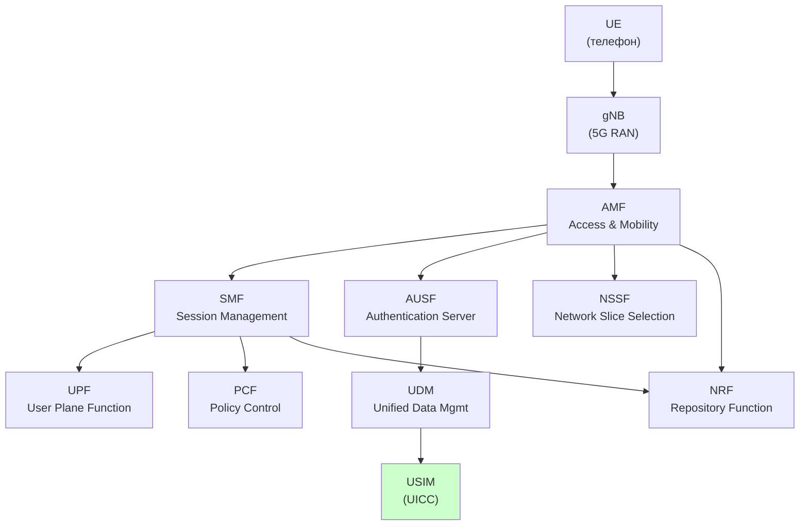

# 5G Core (5GC) — Архитектура опорной сети 5G

## Определение

> [!abstract] Определение
> **5G Core (5GC)** — опорная сеть 5G, определённая в 3GPP TS 23.501/23.502. Построена на **Service-Based Architecture (SBA)**: сетевые функции — микросервисы, общающиеся через HTTP/2 REST API. ^[inferred]

## Service-Based Architecture (SBA)



## Ключевые сетевые функции (NF)

| NF | Роль | Аналог в 4G |
|---|---|---|
| **AMF** | Access and Mobility — регистрация, mobility management | MME |
| **SMF** | Session Management — PDU-сессии, IP-адресация | S-GW/P-GW (control) |
| **UPF** | User Plane Function — маршрутизация пакетов | S-GW/P-GW (data) |
| **AUSF** | Authentication Server Function — аутентификация | HSS (частично) |
| **UDM** | Unified Data Management — профиль абонента | HSS |
| **PCF** | Policy Control — QoS, charging правила | PCRF |
| **NRF** | Network Repository — реестр NF (service discovery) | ❌ (новое) |
| **NSSF** | Network Slice Selection — выбор сетевого слайса | ❌ (новое) |
| **NEF** | Network Exposure — API для внешних приложений | SCEF |

## UICC в 5GC

Роль UICC остаётся центральной для аутентификации:

```
UE ── Registration ──→ AMF
AMF ── Auth Request ──→ AUSF
AUSF ── Auth Vector ──→ UDM ←── K (из USIM)
AUSF ── 5G AKA ──→ UE → USIM
USIM: RAND + K → RES, CK, IK
ME: CK + IK → KDF → K_AUSF
```

USIM в 5G содержит специфичные EF в DF_5GS (см. [[wiki/concepts/USIM]]):
- `EF_5GAUTHKEYS` (4F05) — 5G authentication keys
- `EF_SUCI_Calc_Info` (4F07) — Subscription Concealed Identifier
- `EF_URSP` (4F0B) — UE Route Selection Policy

> [!note] Где вычисляется K_AUSF
> В 5G AKA USIM вычисляет RES, CK, IK стандартным UMTS AKA. **K_AUSF вычисляется в ME (телефоне)**, а не в USIM: K_AUSF = KDF(CK \|\| IK, "AUSF" \|\| Serving Network Name). USIM не имеет команды "compute K_AUSF".

## 5G vs 4G: Ключевые отличия

| Свойство | 4G (EPC) | 5G (5GC) |
|---|---|---|
| **Архитектура** | Point-to-point (фиксированные интерфейсы) | Service-Based (HTTP/2 API) |
| **Control/User plane** | Разделены (S-GW + P-GW) | Полностью разделены (SMF + UPF) |
| **Аутентификация** | EPS AKA | 5G AKA / EAP-AKA' |
| **Идентификатор** | IMSI (открыто!) | SUCI (зашифрован!) |
| **Slicing** | ❌ | ✅ Network Slicing |
| **Cloud-native** | Частично | ✅ Полностью виртуализирован |
| **NRF** | ❌ | ✅ Service Discovery |
| **eSIM** | Опционально | Обязательная поддержка |

## Связи

- USIM: [[wiki/concepts/USIM]]
- Аутентификация: [[wiki/syntheses/auth_evolution|Auth Evolution]]
- UICC: [[wiki/concepts/UICC]]
- eSIM: [[wiki/concepts/eSIM]]
- IMS: [[wiki/concepts/IMS_VoLTE|IMS/VoLTE/VoNR]]
