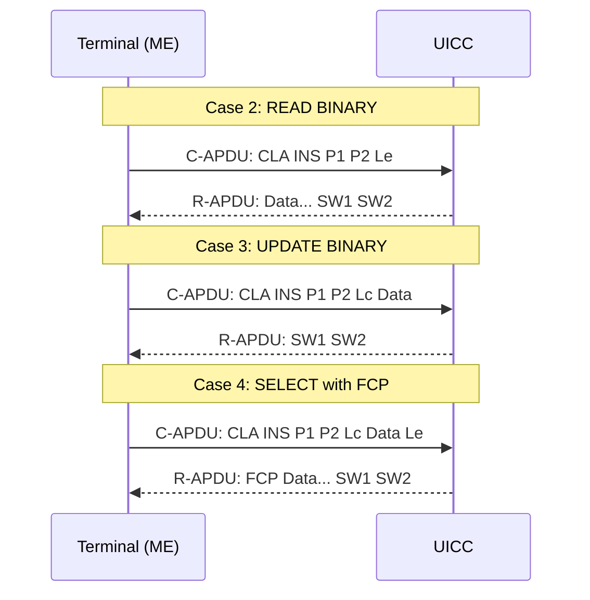

# APDU — Application Protocol Data Unit

## Определение

**APDU** (Application Protocol Data Unit) — это **единица обмена данными** между терминалом (ME) и UICC на прикладном уровне. APDU-интерфейс определён в ISO/IEC 7816-4 и адаптирован в ETSI TS 102 221. ^[extracted]

Обмен всегда происходит по схеме **Command APDU (C-APDU)** → **Response APDU (R-APDU)**.

## Command APDU (C-APDU)



```
┌────────┬────────┬────────┬──────────┬──────────┬──────────┐
│ CLA    │ INS    │ P1     │ P2       │ Lc       │ Data     │ Le       │
│ Class  │ Instr  │ Param1 │ Param2   │ Cmd Len  │ (Lc bytes│ Exp Len  │
│ 1 byte │ 1 byte │ 1 byte │ 1 byte   │ 0/1/3 B  │ if Lc>0) │ 0/1/3 B  │
└────────┴────────┴────────┴──────────┴──────────┴──────────┴──────────┘
│←──────────────── Header (4 bytes) ──────────→│←── Body (variable) ──→│
```

### CLA (Class Byte)

| CLA | Назначение |
|---|---|
| `00` | 3GPP application (USIM, ISIM) ^[extracted] |
| `80` | ETSI/SCP commands |
| `A0` | GSM application (SIM) — исключает USIM-сессию ^[extracted] |
| `0X` | Базовый ISO 7816 (нет secure messaging) |
| `1X`-`3X` | Зарезервировано |
| `4X`-`7X` | RFU |
| `8X`, `9X`, `AX` | Специфичные (ETSI, GSM) |
| `BX`-`FX` | Проприетарные |

Битовая структура CLA:
```
b8 b7 b6 b5 b4 b3 b2 b1
│  │  └─────┴─────┘  └──┘
│  │   Command         Channel
│  │   chaining +      (0-3)
│  │   secure msg
│  └── 0=ISO, 1=proprietary
└──── 0=no SM, 1=Secure Messaging
```

### INS (Instruction Byte)

Основные команды:

| INS | Команда | Описание |
|---|---|---|
| `A4` | SELECT | Выбрать файл/приложение |
| `B0` | READ BINARY | Чтение Transparent/BER-TLV EF |
| `D6` | UPDATE BINARY | Запись Transparent/BER-TLV EF |
| `B2` | READ RECORD | Чтение записи Linear/Cyclic EF |
| `DC` | UPDATE RECORD | Запись записи Linear/Cyclic EF |
| `A2` | SEARCH RECORD | Поиск в записях |
| `32` | INCREASE | Инкремент счётчика |
| `20` | VERIFY PIN | Проверка PIN |
| `24` | CHANGE PIN | Смена PIN |
| `26` | DISABLE PIN | Отключение PIN |
| `28` | ENABLE PIN | Включение PIN |
| `2C` | UNBLOCK PIN | Разблокировка PIN |
| `88` | AUTHENTICATE | Аутентификация (GSM/UMTS/LTE/5G) |
| `70` | MANAGE CHANNEL | Управление логическими каналами |
| `F2` | STATUS | Статус (проактивный поллинг) |

### Четыре случая APDU (ISO 7816-3)

| Сase | C-APDU data | R-APDU data | Пример |
|---|---|---|---|
| **Case 1** | Нет (Lc=0) | Нет (Le=0) | STATUS, DEACTIVATE FILE |
| **Case 2** | Нет (Lc=0) | Есть (Le>0) | READ BINARY |
| **Case 3** | Есть (Lc>0) | Нет (Le=0) | UPDATE BINARY |
| **Case 4** | Есть (Lc>0) | Есть (Le>0) | SELECT с FCP, AUTHENTICATE |

## Response APDU (R-APDU)

```
┌─────────────────────────┬──────────┐
│ Данные (optional)       │ SW1  SW2 │
│ 0..Le bytes             │ 1 B  1 B │
└─────────────────────────┴──────────┘
```

### Status Words (SW1 SW2)

| SW1 SW2 | Значение |
|---|---|
| `90 00` | ✅ Нормальное завершение |
| `91 XX` | 🔔 Proactive command pending (CAT) |
| `61 XX` | ⏳ Normal processing, XX bytes available (T=0: GET RESPONSE) |
| `6C XX` | 📏 Wrong Le; XX = correct length (T=0: повторить с Le=XX) |
| `62 00` | ⚠️ Warning: no information |
| `63 CX` | ⚠️ Warning: X tries left (PIN verification) |
| `64 00` | ❌ Execution error |
| `65 81` | ❌ Memory failure |
| `67 00` | ❌ Wrong length |
| `69 00` | ❌ Command not allowed |
| `69 82` | ❌ Security status not satisfied |
| `69 84` | ❌ File invalidated (deactivated) |
| `6A 80` | ❌ Wrong data in command |
| `6A 82` | ❌ File not found |
| `6A 86` | ❌ Wrong P1-P2 |
| `6A 88` | ❌ Referenced data not found |
| `6E 00` | ❌ Class not supported |
| `6F 00` | ❌ No precise diagnosis |

## Транспортировка APDU

APDU инкапсулируются в транспортные протоколы: T=0 или T=1. Детали маппинга — в [[wiki/concepts/Transmission_Protocols]].

### Case 2/T=0 проблема и GET RESPONSE

В T=0 для Case 2 команд: UICC не может сразу вернуть данные. Вместо этого:
1. UICC → `61 XX` (XX байт доступно)
2. Терминал → GET RESPONSE (INS=`C0`) с Le=XX
3. UICC → Данные

## Логические каналы

- До 20 каналов (0-19), канал 0 — базовый (открыт после ATR)
- Команда MANAGE CHANNEL (`70`): открыть (`00`) / закрыть (`80`) канал
- CLA биты b1-b2: номер канала (для каналов 0-3)
- Для каналов 4-19: CLA биты b1-b2='00', канал — через MANAGE CHANNEL

## Связи

- Транспортировка: [[wiki/concepts/Transmission_Protocols]]
- Команда SELECT и FCP: [[wiki/concepts/FCP]]
- Безопасность команд: [[wiki/concepts/UICC_Security]]
- Статусные слова: [[wiki/reference/Status_Words]]
- CLA/INS/SFI справочник: [[wiki/reference/CLA_INS_SFI]]
- Практические примеры: [[wiki/summaries/sim_apdu_examples|SIM APDU Examples]]
