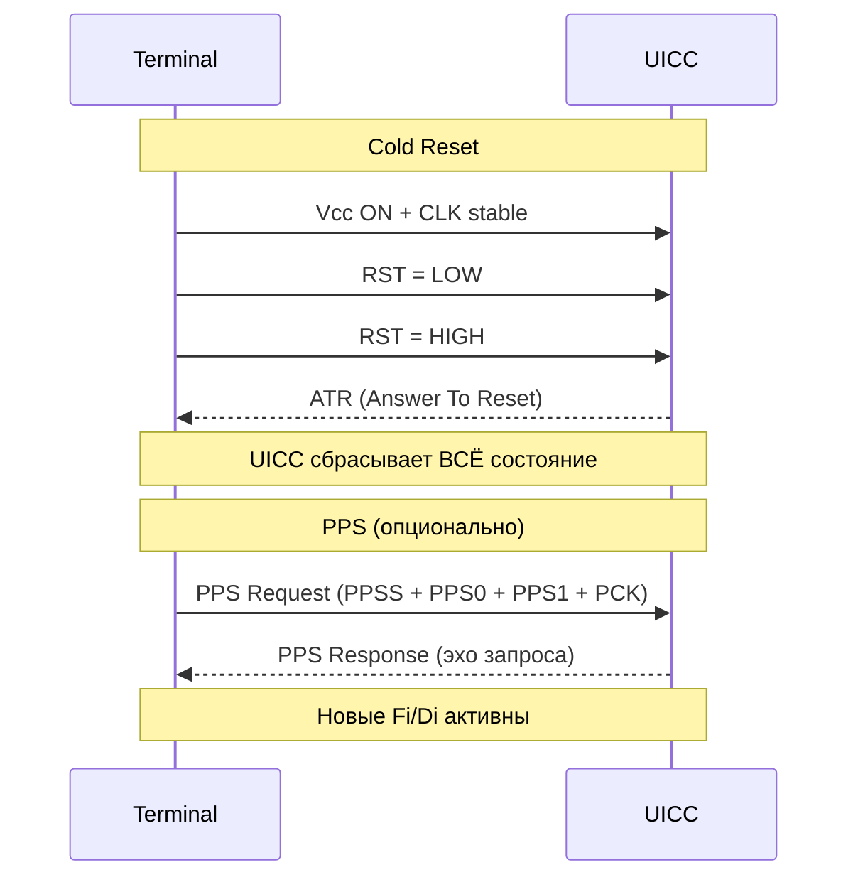

# ATR и PPS — Инициализация связи с UICC

## ATR (Answer To Reset)

**ATR** — это ответ UICC на сброс (reset). Это последовательность байт (макс. 33), в которой UICC сообщает терминалу о своих возможностях: поддерживаемые протоколы, скорости, напряжение. ^[extracted]

### Структура ATR

```
┌──────────┬─────────────┬────────────┬─────────────┬───────────┬─────────┐
│ TS       │ T0          │ TAi..TCi   │ Historical  │ TCK       │         │
│ (1 byte) │ (1 byte)    │ (optional) │ Bytes (T1..TK│ (optional)│         │
│          │             │            │ max 15)     │           │         │
└──────────┴─────────────┴────────────┴─────────────┴───────────┴─────────┘
│← Initial Character ─→│← Format ──→│← Interface Bytes ──→│← Historical ──→│
```

- **TS**: Initial character — определяет соглашение по битам (прямое/инверсное)
  - `0x3B` — прямое соглашение (direct convention, LSB first)
  - `0x03F` — инверсное соглашение (inverse convention, MSB first)
- **T0**: Format byte — битовая маска: какие TAi/TBi/TCi/TDi присутствуют + количество historical bytes (K)
- **TAi, TBi, TCi, TDi**: Interface bytes — параметры протокола
- **Historical bytes**: Информация о производителе, типе карты
- **TCK**: Check byte (XOR всех байт от T0 до TCK-1)

### Ключевые Interface Bytes

| Byte | Назначение |
|---|---|
| **TA1** | Clock rate conversion factor (Fi), baud rate adjustment (Di) |
| **TB1** | Extra guard time, programming voltage |
| **TC1** | Extra guard time (для 3GPP: только 0 или 255 разрешены) ^[extracted] |
| **TD1** | Индикатор протокола (T=0, T=1...) и последующих TA2/TB2/TC2/TD2 |

### Скоростные параметры (Fi/Di)

Fi (clock rate conversion) и Di (baud rate adjustment):

| Fi/Di | F=(512,32) → 1 etu = 16 CLK cycles → скорость = clock/16 |
|---|---|
| Стандарт | Fi=512, Di=32 (по умолчанию после ATR без PPS) |
| 3GPP | **F=(512,32) обязателен** + рекомендован F=(512,64) ^[extracted] |

## PPS (Protocol and Parameter Selection)

**PPS** — процедура согласования параметров передачи после ATR. Если UICC хочет другую скорость (не default), она указывает это в ATR → терминал предлагает новые Fi/Di через PPS → UICC подтверждает.

### Процедура PPS

```
Терминал:              UICC:
  │                       │
  │── PPS Request ──────→│  (PPSS + PPS0 + PPS1..3 + PCK)
  │                       │
  │←── PPS Response ─────│  (подтверждение = эхо запроса)
  │                       │
  │ Новые Fi/Di активны  │
```

- **PPSS**: `0xFF` (PPS identifier)
- **PPS0**: Индикатор параметров (битовая маска: PPS1/PPS2/PPS3 present?)
- **PPS1**: Новые Fi/Di (если отличаются от TA1)
- **PPS2**: Spare (зарезервировано)
- **PCK**: Check byte

## Виды сброса (Reset)



> [!warning] Внимание
> При **Cold Reset** UICC теряет ВСЁ: PIN-верификацию, выбранный файл, логические каналы, сессии. При **Warm Reset** UICC может сохранить состояние (Type 2).

## Примечания для 3GPP

- TC1 в ATR: терминал может отвергнуть UICC, если TC1 != 0 или 255 (extra guard time не требуется) ^[extracted]
- Поддержка (F,D)=(512,32) обязательна для всех 3GPP UICC ^[extracted]
- (F,D)=(512,64) рекомендован для высокоскоростных функций (MMS) ^[extracted]
- ATR должен содержать global interface bytes для индикации поддерживаемых протоколов

## Связи

- Протоколы передачи после ATR/PPS: [[wiki/concepts/Transmission_Protocols]]
- Родительский концепт: [[wiki/concepts/UICC]]
- После ATR: UICC в состоянии MF=selected, переходит к [[wiki/concepts/UICC_File_System|файловой системе]]
- Углублённый анализ ISO 7816: [[wiki/summaries/iso7816_analysis|ISO 7816 In-Depth (!recheck)]]
