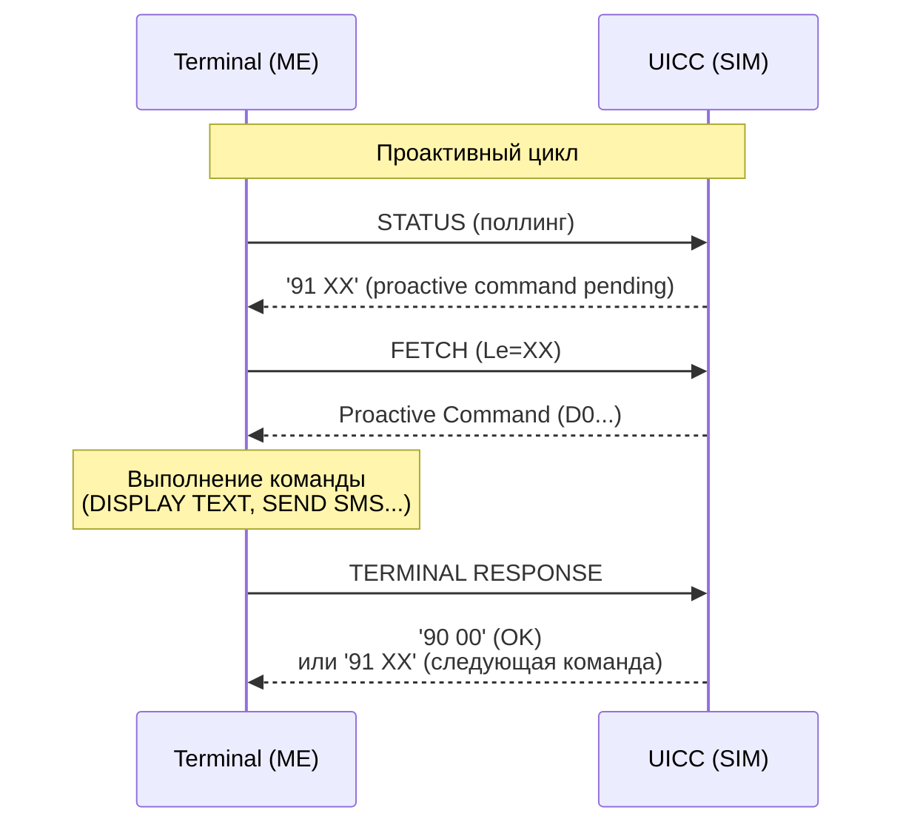

# CAT/STK — Card Application Toolkit / SIM Toolkit

## Определение

**Card Application Toolkit (CAT)** — это механизм в UICC, позволяющий карте **проактивно** инициировать действия в терминале и взаимодействовать с сетью, а не только отвечать на команды. Определён в ETSI TS 102 223. ^[extracted]

В разных контекстах известен как:
- **STK** (SIM Toolkit) — в GSM (TS 51.014)
- **USAT** (USIM Application Toolkit) — в 3GPP (TS 31.111)
- **CAT** — общий термин ETSI (TS 102 223)

## Архитектура взаимодействия

```
Обычный режим:                    CAT режим:
  Terminal ──CMD──→ UICC            Terminal ──STATUS──→ UICC
  Terminal ←──RSP── UICC            Terminal ←──'91 XX'─ UICC (proactive pending)
                                    Terminal ──FETCH──→ UICC
                                    Terminal ←──Proactive Cmd─ UICC
                                    Terminal ──TERMINAL RESPONSE──→ UICC
                                    Terminal ←──'90 00'─ UICC (OK)
```

## Четыре механизма CAT

### 1. Profile Download
Терминал → UICC: **TERMINAL PROFILE** — битовая маска возможностей терминала (что он поддерживает из CAT).

Примеры бит: display text, get inkey, setup menu, SMS, call control, BIP, MMS, eCAT...

### 2. Proactive Commands
UICC → Терминал: UICC выдаёт команды терминалу через proactive session.

### 3. Event Download
UICC подписывается на события → терминал уведомляет когда событие происходит (через ENVELOPE).

### 4. ENVELOPE
Терминал → UICC: передаёт данные или уведомления (menu selection, call control, event download, timer expiration).

## Ключевые Proactive Commands

### Пользовательский интерфейс

| Команда | Описание | Пример |
|---|---|---|
| **DISPLAY TEXT** | Показать текст на экране терминала | Приветствие оператора |
| **GET INKEY** | Запросить 1 символ | "Нажмите 1 для продолжения" |
| **GET INPUT** | Запросить строку ввода | Ввод пароля, поискового запроса |
| **PLAY TONE** | Воспроизвести аудио-сигнал | Beep, dial tone, busy |
| **SET UP MENU** | Создать иерархическое меню | Главное меню SIM-карты |
| **SELECT ITEM** | Показать список для выбора | Выбор услуги |
| **SET UP IDLE MODE TEXT** | Текст на idle-экране | "Vodafone" в статус-баре |

### Коммуникация

| Команда | Описание |
|---|---|
| **SEND SHORT MESSAGE** | Отправить SMS (MO-SMS через UICC) |
| **SEND DTMF** | Отправить DTMF-тоны |
| **SET UP CALL** | Установить голосовой вызов |

### Данные и сеть (BIP)

| Команда | Описание |
|---|---|
| **OPEN CHANNEL** | Открыть TCP/UDP соединение |
| **CLOSE CHANNEL** | Закрыть соединение |
| **SEND DATA** | Отправить данные через канал |
| **RECEIVE DATA** | Получить данные из канала |
| **GET CHANNEL STATUS** | Проверить состояние канала |

### Управление UICC

| Команда | Описание |
|---|---|
| **REFRESH** | Уведомить терминал об изменении файлов |
| **MORE TIME** | Запросить дополнительное время обработки |
| **POLL INTERVAL** | Установить интервал проактивного опроса |
| **POLLING OFF** | Отключить проактивный опрос |
| **TIMER MANAGEMENT** | Управлять таймерами UICC |

### Мультимедиа и расширенные

| Команда | Описание |
|---|---|
| **LAUNCH BROWSER** | Открыть браузер терминала по URL |
| **RETRIEVE MULTIMEDIA MESSAGE** | Получить MMS |
| **SUBMIT MULTIMEDIA MESSAGE** | Отправить MMS |
| **DISPLAY MULTIMEDIA MESSAGE** | Показать MMS |
| **ACTIVATE** | Активировать UICC-приложение |
| **COMMAND CONTAINER** | Контейнер для команды другому приложению |

## События (Events)

UICC подписывается на события через **SET UP EVENT LIST**, терминал уведомляет через **ENVELOPE (EVENT DOWNLOAD)**:

| Событие | Когда срабатывает |
|---|---|
| **MT call** | Входящий звонок |
| **Call connected** | Звонок установлен |
| **Call disconnected** | Звонок завершён |
| **Location status** | Изменение LAC/TAC |
| **User activity** | Пользователь взаимодействует с терминалом |
| **Idle screen available** | Экран ожидания свободен |
| **Access Technology Change** | Смена RAT (2G↔3G↔4G↔5G) |
| **Data available** | Данные получены через BIP канал |
| **Channel status** | Изменение состояния канала |
| **Browser termination** | Браузер закрыт |
| **Language selection** | Смена языка терминала |

## BIP (Bearer Independent Protocol)

BIP позволяет UICC открывать сокеты в интернет **через терминал**:
- UICC не имеет собственного IP-стека — он использует модем терминала
- **UICC Server Mode**: UICC слушает порт (веб-сервер)
- **Terminal Server Mode**: UICC соединяется к внешнему серверу
- Типы bearer'ов: CS (CSD), GPRS/EDGE, UMTS PS, LTE, 5G, Local Bearer

## Call Control by UICC

UICC может **модифицировать или блокировать** исходящие вызовы:
1. Пользователь набирает номер → терминал запрашивает разрешение у UICC через ENVELOPE (CALL CONTROL)
2. UICC отвечает: **Allowed** (OK), **Modified** (другой номер/сервис), **Disallowed** (заблокировано)
3. Используется для FDN, BDN, роуминговых политик

## Проактивная сессия (жизненный цикл)



> [!tip] Практический совет
> UICC **всегда вторична** (secondary role). Даже в проактивном режиме терминал инициирует обмен через STATUS и FETCH. UICC лишь сигнализирует о наличии команды через `91 XX`.

## Ключевые принципы

1. **UICC всегда secondary role**: даже в proactive mode, терминал инициирует обмен (STATUS, FETCH)
2. **Одна proactive сессия за раз**: UICC не может иметь две параллельные proactive сессии на одном логическом канале
3. **Терминал решает**: терминал может отвергнуть proactive command, если она не поддерживается (terminal profile)
4. **Независимость приложений**: разные приложения USIM/ISIM/SIM имеют независимые CAT-сессии

## Связи

- Базовый стандарт: [[wiki/summaries/ts_102223|ETSI TS 102 223]]
- Протокол обмена: [[wiki/concepts/APDU]] (STATUS, FETCH, TERMINAL RESPONSE)
- Платформа: [[wiki/concepts/UICC]]
- USIM-специфичный CAT: 3GPP TS 31.111 (USAT)
- Безопасность: CAT commands могут быть secured (secured packets по TS 102 225/226)
- Conformance тесты: [[wiki/summaries/ts_31124|TS 31.124 (USAT Conformance)]]
- Практический MITM-анализ: [[wiki/summaries/sjors_gielen_stk|SIM Toolkit in Practice (2012)]]
- Нумерация TLV-тегов: [[wiki/summaries/ts_101_220|TS 101 220 (ETSI Numbering)]]
- SIM Toolkit API: [[wiki/summaries/ts_101476|TS 101 476]]
- Cell Broadcast апплет: [[wiki/syntheses/cell_broadcast_pws_applet|PWS/CMAS Applet]]
- SCWS + BIP: [[wiki/research/sim_scws_webserver|SIM как веб-сервер — SCWS + BIP]]
- NFC/Contactless интеграция (SWP, HCI, CLF): [[wiki/research/sim_nfc_contactless|SIM и NFC — SWP, HCI, CLF]]
- Location Services через STK (PROVIDE LOCAL INFO, GAD Shapes, JavaCard-код): [[wiki/research/sim_gps_lcs|SIM и GPS/LCS]]
