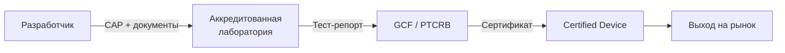

# GCF / PTCRB — Сертификация устройств

## Определение

> [!abstract] Определение
> **GCF** (Global Certification Forum) и **PTCRB** (PCS Type Certification Review Board) — организации, сертифицирующие мобильные устройства на соответствие 3GPP-стандартам. GCF — глобальная, PTCRB — североамериканская. Тесты охватывают UICC, USAT, протоколы и RF. ^[inferred]

## GCF vs PTCRB

| | GCF | PTCRB |
|---|---|---|
| **Рынок** | Глобальный (Европа, Азия) | Северная Америка |
| **Стандарты** | 3GPP (ETSI) | 3GPP (ATIS/TIA) |
| **Тестовые спецификации** | TS 31.121 (UICC), TS 31.124 (USAT) | Те же + NAPRD03 |
| **Лаборатории** | RTO (Recognised Test Organisations) | PTCRB-аккредитованные |
| **Certification DB** | GCF CC (Certification Criteria) | PTCRB Database |

## Для UICC

### Что тестируется
- **Физические характеристики** (ISO 7816-1/2)
- **Электрический интерфейс** (ISO 7816-3, TS 102 221)
- **Протоколы** (T=0, T=1, USB)
- **Файловая система** (MF/DF/ADF/EF, TS 31.101)
- **Команды** (SELECT, READ, UPDATE, AUTHENTICATE)
- **USAT** (TS 31.124 — все proactive commands + events)
- **Безопасность** (PIN, AUTH, Secure Channel)

### Ключевые спецификации

| Спецификация | Что тестирует |
|---|---|
| **TS 31.121** | UICC Conformance (базовая UICC, без toolkit) |
| **TS 31.124** | USAT Conformance (toolkit: proactive commands, events, BIP) |
| **TS 31.122** | USIM Conformance |
| **TS 31.123** | ISIM Conformance |

## Для STK-апплетов

При сертификации устройства с STK-апплетами проверяется:
- TERMINAL PROFILE (все заявленные биты)
- Каждая proactive команда (DISPLAY TEXT, SET UP MENU, SEND SMS...)
- Каждый event (MT call, location status, idle screen...)
- ENVELOPE команды (menu selection, call control, timer)
- Корректное поведение при ошибках (неверный формат, неизвестный тег)

## Процесс сертификации

## Связь с другими темами

- UICC Testing: [[wiki/syntheses/uicc_testing_pipeline|Testing Pipeline]]
- USAT Conformance: [[wiki/summaries/ts_31124|TS 31.124]]
- CAT/STK: [[wiki/concepts/CAT_STK]]
