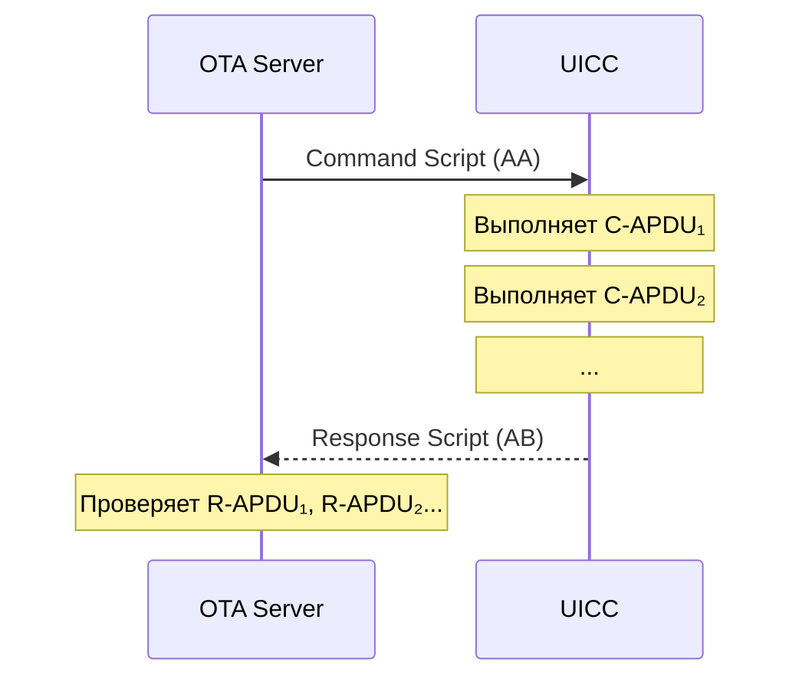

# Command Scripting — Удалённое выполнение APDU через скрипты

## Определение

> [!abstract] Определение
> **Command Scripting** — механизм удалённого выполнения последовательности APDU-команд на UICC через скрипты. Скрипт — это BER-TLV структура, содержащая C-APDU команды и управляющие теги. Определён в TS 102 226. ^[extracted]

Используется в RAM (Remote Application Management) и RFM (Remote File Management).

## Структура Scripting Template

TS 101 220 определяет четыре шаблона:

| Tag | Назначение | Кодирование длины |
|---|---|---|
| `AA` | Command Scripting Template | Definite length |
| `AB` | Response Scripting Template | Definite length |
| `AE` | Command Scripting Template | Indefinite length |
| `AF` | Response Scripting Template | Indefinite length |

### Command Scripting Template (Tag `AA` или `AE`)

```
AA <len>                         ← Command Scripting Template
  22 <len> <C-APDU>             ← C-APDU tag (одна команда)
  22 <len> <C-APDU>             ← C-APDU tag (следующая команда)
  ...
  81 <len> <action>             ← Immediate Action tag
  82 <len> <action>             ← Error Action tag
  83 <len> <chain>              ← Script Chaining tag
```

### Response Scripting Template (Tag `AB` или `AF`)

```
AB <len>                         ← Response Scripting Template
  23 <len> <R-APDU>             ← R-APDU tag (ответ на команду)
  23 <len> <R-APDU>             ← R-APDU tag (следующий ответ)
  ...
  80 <len> <count>              ← Number of executed C-APDUs
  81 <len> <action>             ← Immediate Action Response
  90 <len> <error>              ← Bad format tag
```

## Порядок выполнения



## Управляющие теги внутри скрипта

| Tag | Описание |
|---|---|
| **Immediate Action** (`81`) | Действие после успешного выполнения: продолжать / остановить |
| **Error Action** (`82`) | Действие при ошибке: остановить / продолжить / откатить |
| **Script Chaining** (`83`) | Индикатор что скрипт будет продолжен в следующем Command Packet |

## Применение

| Сценарий | Тип скрипта |
|---|---|
| **Установка апплета** через OTA | Command Scripting (LOAD → INSTALL) |
| **Обновление нескольких EF** | Command Scripting (UPDATE BINARY × N) |
| **Массовая персонализация** | Command Scripting (WRITE × 100+) |
| **Проверка результата** | Response Scripting |

## Отличие от одиночного Command Packet

| | Одиночный Command Packet | Command Scripting |
|---|---|---|
| **C-APDU** | 1 команда | N команд |
| **Атомарность** | 1 операция | Может быть групповая |
| **Обработка ошибок** | SW в R-APDU | Error Action tag |
| **Размер** | Ограничен SMS | Может быть цепочкой (chaining) |

## Связи

- OTA Remote APDU: [[wiki/summaries/ts_102_226|TS 102 226]]
- OTA: [[wiki/concepts/OTA_Remote_Management]]
- TLV-теги: [[wiki/summaries/ts_101_220|TS 101 220]]
- Глобальная платформа: [[wiki/concepts/GlobalPlatform_Card]]
