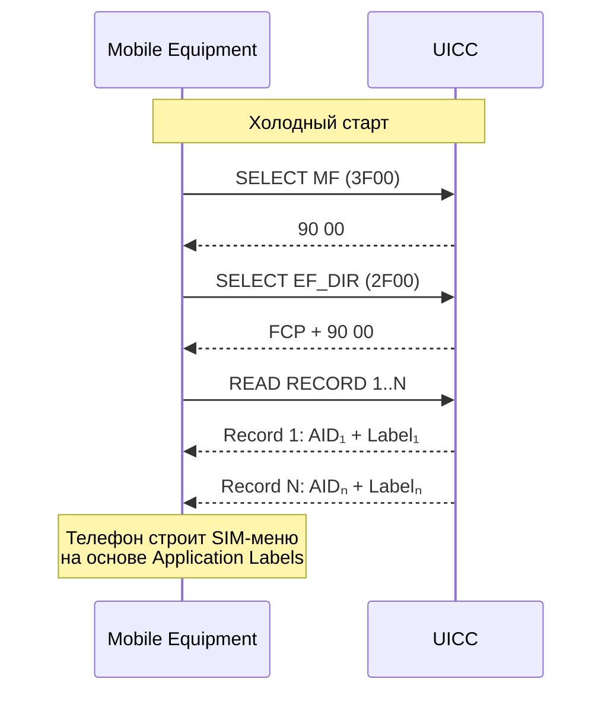

# EF_DIR — Application Directory

## Определение

> [!abstract] Определение
> **EF_DIR** (Elementary File — Application Directory, FID `0x2F00`) — это линейно-фиксированный элементарный файл на уровне MF, содержащий **список AID всех приложений** на UICC. Телефон читает EF_DIR при старте и строит SIM-меню. ^[extracted]

## Местоположение в файловой системе

```
MF (0x3F00)
├── EF_DIR (0x2F00)  ← Каталог приложений
├── EF_ICCID (0x2FE2)
├── EF_PL (0x2F05)
├── EF_ARR (0x2F06)
├── ADF.USIM (AID: A0..87.10.02...)
├── ADF.ISIM (AID: A0..87.10.04...)
└── ADF.Custom (AID: F0.70.02.CA.44...)
```

## Структура записи в EF_DIR

Каждая запись — BER-TLV Application Template (Tag `61`):

```
61 <len>                         ← Application Template
  4F <len> <AID>                ← Application Identifier (5-16 байт)
  50 <len> <Application Label>  ← Человеко-читаемое имя
  51 <len> <Path>               ← Путь к приложению (опционально)
  73 <len> <Discretionary Data> ← Доп. данные (EAP, M2M, oneM2M)
```

### Пример записи USIM

```
61 1C                    ← Application Template (28 байт)
  4F 0A                  ← AID tag (10 байт)
    A0 00 00 00 87 10 02 FF FF FF FF  ← USIM AID
  50 0A                  ← Label tag (10 байт)
    55 53 49 4D 20 41 70 70 6C 65    ← "USIM Apple" (ASCII)
  73 06                  ← Discretionary template
    80 04 ...            ← Доп. параметры
```

## Как телефон использует EF_DIR



> [!tip] Практический совет
> Когда STK-апплет вызывает `ToolkitRegistry.initMenuEntry()`, JCRE автоматически добавляет его AID в EF_DIR. Ручное редактирование EF_DIR не требуется — JCRE управляет записями.

## Отличия от ADF

| | EF_DIR | ADF |
|---|---|---|
| **Роль** | Каталог (список) | Точка входа в приложение |
| **FID** | 0x2F00 | Определяется AID |
| **SELECT** | По FID (`00 A4 00 00 02 2F 00`) | По AID (`00 A4 04 00 0A <AID>`) |
| **Содержит** | Записи с AID + Label | Файловую систему приложения |
| **Расположение** | Всегда на уровне MF | Внутри MF |

## Связь с OTA

При установке апплета через OTA (RAM — Remote Application Management), JCRE автоматически добавляет новую запись в EF_DIR. При удалении — удаляет. Телефону может потребоваться REFRESH для перечитывания EF_DIR.

## Связи

- AID: [[wiki/concepts/AID]]
- Файловая система: [[wiki/concepts/UICC_File_System]]
- Выбор приложения: [[wiki/concepts/UICC_File_System#Методы выбора файла]]
- STK-апплеты: [[wiki/concepts/STK_Applet]]
- TS 102 221 §13.2: [[wiki/summaries/ts_102221]]
