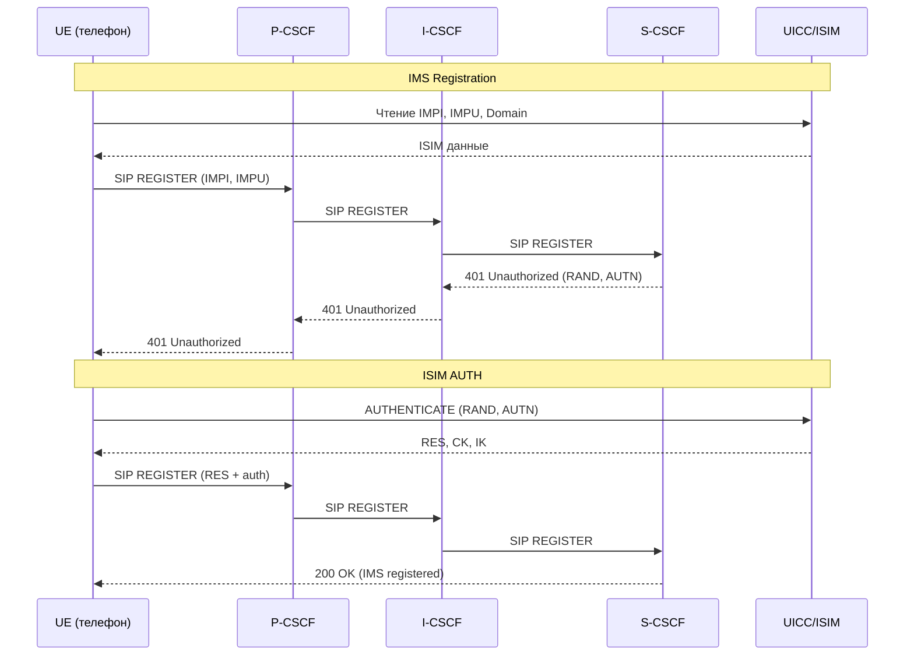

# IMS, VoLTE, VoNR — Голос и мультимедиа поверх IP

## Определение

> [!abstract] Определение
> **IMS (IP Multimedia Subsystem)** — архитектурный фреймворк для предоставления голосовых и мультимедийных услуг поверх IP-сетей. **VoLTE** (Voice over LTE) и **VoNR** (Voice over New Radio) — реализации голоса через IMS в 4G и 5G. ^[inferred]

## Архитектура IMS

```
┌─────────────────────────────────────────────────────┐
│                   IMS Core                           │
│  ┌──────────┐  ┌──────────┐  ┌──────────────────┐  │
│  │ P-CSCF   │  │ I-CSCF   │  │ S-CSCF           │  │
│  │ (Proxy)  │→│ (Interrog)│→│ (Serving)         │  │
│  └──────────┘  └──────────┘  └────────┬─────────┘  │
│                                       │             │
│  ┌──────────────────────────────┐     │             │
│  │ HSS (Home Subscriber Server) │←────┘             │
│  └──────────────────────────────┘                   │
│                                                     │
│  ┌──────────┐  ┌──────────┐                         │
│  │ TAS      │  │ MGCF     │ ← Telephony Application │
│  │ (MMTel)  │  │ (Gateway)│   Servers              │
│  └──────────┘  └──────────┘                         │
└─────────────────────────────────────────────────────┘
```

## CSCF — Call Session Control Functions

| Функция | Роль |
|---|---|
| **P-CSCF** (Proxy) | Точка входа в IMS для UE. Проверяет запросы, направляет дальше |
| **I-CSCF** (Interrogating) | Находит S-CSCF для абонента через HSS |
| **S-CSCF** (Serving) | Центральный узел: регистрация, маршрутизация сессий, применение фильтров |

## HSS и ISIM

**HSS** (Home Subscriber Server) — база данных абонентов IMS. Аналог HLR для CS-сети.

**ISIM** (IMS Subscriber Identity Module) — приложение на UICC для IMS.

```
ADF.ISIM (AID: A0 00 00 00 87 10 04 ...)
├── EF_IMPI        ← IMS Private Identity
├── EF_IMPU        ← IMS Public Identity (SIP URI)
├── EF_DOMAIN       ← Home Network Domain
└── EF_P-CSCF       ← P-CSCF Address
```

## VoLTE → VoNR: эволюция

| | VoLTE (4G) | VoNR (5G) |
|---|---|---|
| **Радио** | E-UTRAN (LTE) | NR (New Radio) |
| **Core** | EPC + IMS | 5GC + IMS |
| **Кодек** | AMR-WB (HD Voice) | EVS (Enhanced Voice Services) |
| **Качество** | HD Voice | Ultra HD / Fullband |
| **Slicing** | ❌ | ✅ (отдельный slice для голоса) |
| **Latency** | ~10ms (RAN) | <1ms (URLLC) |
| **Emergency** | eCall | IMS Emergency over 5G |

## SIP-регистрация IMS с ISIM



## UICC и IMS: роль ISIM

ISIM-приложение на UICC предоставляет:
- **IMPI** — приватный идентификатор (аналог IMSI для IMS)
- **IMPU** — публичный идентификатор (SIP URI: `sip:user@ims.mnc.mcc.3gppnetwork.org`)
- **Домен** — домашний домен IMS
- **P-CSCF** — адрес первого узла IMS
- **Аутентификация**: UMTS AKA через ISIM (так же как USIM)

## 5G и IMS

В 5G IMS остаётся отдельной overlay-сетью поверх 5GC:
- Голос: EPS fallback (4G) → VoNR (5G native) — переходный период
- Emergency services: IMS Emergency over 5G (TS 23.501)
- SMS over IP: SMS over NAS, SMS over IP (IMS)

## Связи

- USIM: [[wiki/concepts/USIM]]
- 5G Core: [[wiki/concepts/5G_Core|5G Core]]
- UICC: [[wiki/concepts/UICC]]
- Аутентификация: [[wiki/syntheses/auth_evolution|Auth Evolution]]
- ISIM API: [[wiki/summaries/ts_143019|TS 143 019 (SIM API)]]
