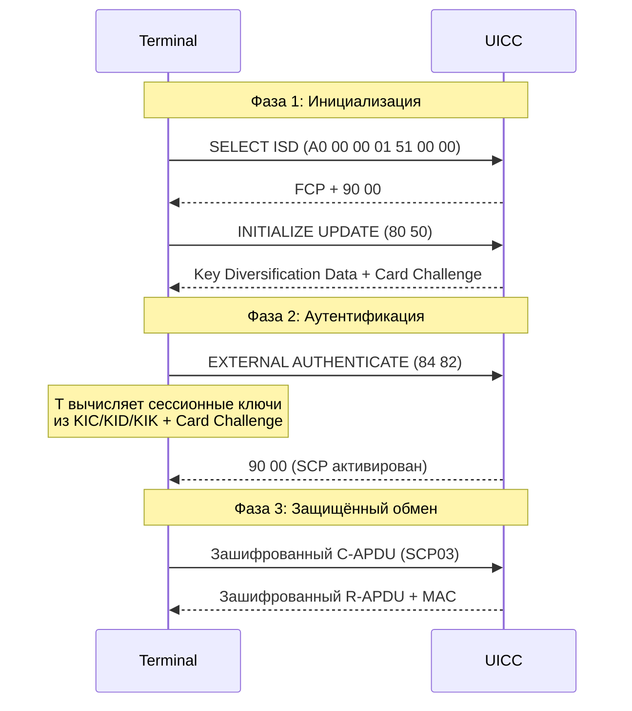

# SCP — Secure Channel Protocol

## Определение

> [!abstract] Определение
> **SCP (Secure Channel Protocol)** — семейство протоколов защищённого канала между терминалом и смарт-картой, стандартизированных GlobalPlatform. Обеспечивает шифрование, целостность и взаимную аутентификацию APDU-команд. ^[extracted]

## Семейство SCP

| Протокол | Криптография | Применение | Статус |
|---|---|---|---|
| **SCP02** | 3DES-CBC, DES-MAC | Локальное управление картой | Legacy |
| **SCP03** | AES-128/256, AES-CMAC | Современное локальное управление | ✅ Актуальный |
| **SCP80** | По TS 102 225 (Secured APDU) | OTA (SMS-PP, CAT_TP) | ✅ Актуальный |
| **SCP81** | TLS/PSK | Удалённый доступ (интернет) | Редкий |
| **SCP10** | RSA | Асимметричная криптография | Специфичный |
| **SCP11** | ECC | Эллиптическая криптография | Новый |

## Как работает SCP (на примере SCP03)



## Ключи SCP

| Ключ | Назначение | SCP02 | SCP03 |
|---|---|---|---|
| **KIC** (Key Encryption) | Шифрование C-APDU | 16B | 16/32B |
| **KID** (Key MAC) | Integrity / CMAC | 16B | 16/32B |
| **KIK** (Key DEK) | Data Encryption | 16B | 16/32B |
| **KVN** | Key Version Number | 1B | 1B |

## SCP80 — OTA-защита

SCP80 — особый случай: защищённый канал через **непостоянное соединение** (SMS):

```
1. OTA Server создаёт Secured Packet (TS 102 225)
   └── C-APDU шифруется KIC, MAC считается через KID
2. Secured Packet → Command Packet (TS 102 226) с TAR
3. Command Packet → SMS-DELIVER → телефон → UICC
4. UICC проверяет MAC → расшифровывает → выполняет C-APDU
5. UICC → Response Packet → SMS-SUBMIT → OTA Server
```

> [!warning] Внимание
> **SCP02 считается устаревшим** из-за использования 3DES. Для новых проектов используйте **SCP03** (AES). Для OTA используйте **SCP80**.

## Уровни безопасности SCP

| Уровень | Что защищает |
|---|---|
| **Аутентификация** | Взаимная (терминал ↔ карта) |
| **Конфиденциальность** | Шифрование C-APDU и R-APDU |
| **Целостность** | MAC/CMAC на каждом сообщении |
| **Anti-replay** | Счётчики + случайные числа |
| **Связывание** | Ключи привязаны к сессии (session keys) |

## Применение на SIM-картах

| Операция | SCP |
|---|---|
| **Установка апплета** (GP) | SCP03 |
| **OTA-обновление** (SMS) | SCP80 |
| **OTA-обновление** (BIP) | SCP80 или SCP81 |
| **eSIM Profile Download** | SCP03 (внутри ES8+) |
| **Локальное управление** | SCP03 |

## Связи

- GlobalPlatform: [[wiki/concepts/GlobalPlatform_Card]]
- Безопасность UICC: [[wiki/concepts/UICC_Security]]
- OTA: [[wiki/concepts/OTA_Remote_Management]]
- GPC 2.3.1: [[wiki/summaries/gpc_card_spec_2_3_1]]
- Secured Packet: [[wiki/summaries/ts_102225|TS 102 225]]
