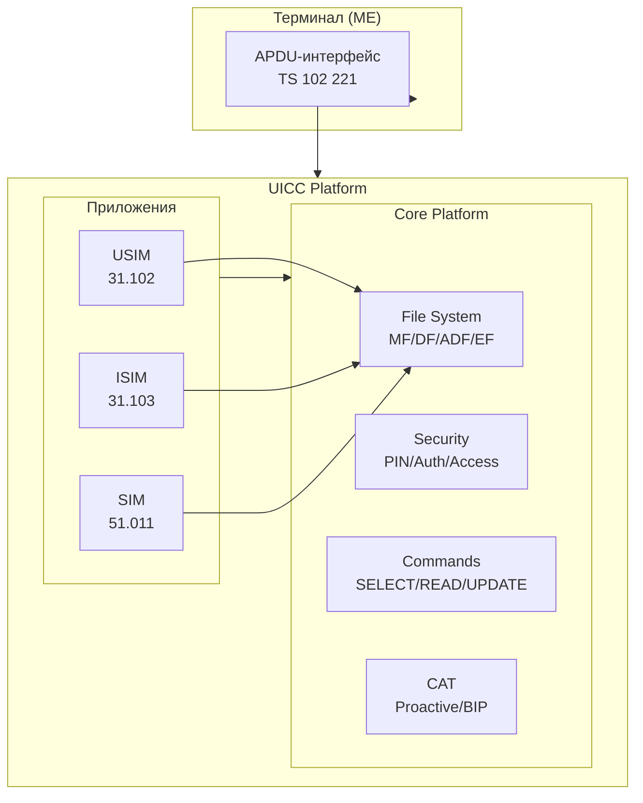

# UICC — Universal Integrated Circuit Card

## Определение

**UICC** (Universal Integrated Circuit Card) — это универсальная смарт-карта, используемая в мобильных устройствах. Это **платформа**, на которой работают телеком-приложения: USIM (3G/4G/5G), SIM (GSM), ISIM (IMS). ^[extracted]

Физически UICC — это смарт-карта, соответствующая ISO/IEC 7816, с дополнительными требованиями ETSI/3GPP для телеком-среды.

## Эволюция

```
SIM (GSM only, GSM 11.11)
  │  Одно приложение (GSM), фиксированный AID
  │
  ▼
UICC (3G+, TS 102 221)
  │  Множественные приложения, выбор по AID
  │  Файловая система: MF/DF/ADF/EF
  │  Множественные логические каналы
  │
  ▼
eUICC (embedded UICC)
  │  Встроенная (паяная), M2M, удалённое управление профилями
  │  SGP.02 (M2M), SGP.22 (Consumer)
```

## Архитектура платформы



> [!info] Ключевая идея
> UICC — это **платформа**, а не приложение. USIM, ISIM и SIM — приложения, работающие на этой платформе. Платформа предоставляет файловую систему, безопасность и команды; приложения добавляют свою логику.

## Ключевые характеристики

### Физические
- **Form factor'ы**: ID-1, Plug-in (2FF), Mini-UICC (3FF), 4FF (nano-SIM) ^[extracted]
- **Контакты**: C1=Vcc, C2=RST, C3=CLK, C5=GND, C6=Vpp (опц.), C7=I/O
- **Напряжение**: Классы A (5V), B (3V), C (1.8V), D (1.2V)
- UICC должна поддерживать минимум 2 последовательных класса ^[extracted]

### Логические
- **Файловая система**: иерархическая (MF → DF → EF), детали в [[wiki/concepts/UICC_File_System]]
- **APDU-интерфейс**: команды и ответы, детали в [[wiki/concepts/APDU]]
- **Протоколы передачи**: T=0 и T=1, детали в [[wiki/concepts/Transmission_Protocols]]
- **Множественные приложения**: выбор по AID, независимые сессии, до 20 логических каналов
- **Безопасность**: PIN, аутентификация, secure channel, детали в [[wiki/concepts/UICC_Security]]

### Приложения
- **USIM** (Universal Subscriber Identity Module) — 3G/4G/5G аутентификация
- **SIM** (Subscriber Identity Module) — Legacy GSM
- **ISIM** (IMS Subscriber Identity Module) — VoLTE/VoNR
- **CAT/USAT** — Toolkit-приложения (STK-меню, proactive commands)

## Жизненный цикл UICC-сессии

```
Деактивация → [Питание OFF]
     ↓
Активация (подача питания + CLK)
     ↓
Cold Reset / Warm Reset
     ↓
ATR (Answer To Reset) — [[wiki/concepts/ATR|Детали]]
     ↓
PPS (опционально) — согласование скорости
     ↓
Выбор приложения (SELECT по AID)
     ↓
Аутентификация (AUTHENTICATE, VERIFY PIN)
     ↓
Рабочие операции (READ, UPDATE, ...)
     ↓
Деактивация сессии / сброс
```

## Ключевые отличия: UICC vs SIM

| Свойство | SIM (Legacy) | UICC |
|---|---|---|
| Стандарт | GSM 11.11 | TS 102 221 |
| Приложений | Только 1 (GSM) | Множественные |
| Выбор приложения | Фиксировано | По AID |
| Логические каналы | 1 | До 20 |
| Файловая система | MF/DF/EF | MF/DF/ADF/EF |
| Протоколы | T=0 | T=0, T=1, USB |

## Связи

- Базовые спецификации: [[wiki/summaries/ts_102221]], [[wiki/summaries/ts_131101]]
- Файловая система: [[wiki/concepts/UICC_File_System]]
- Протоколы: [[wiki/concepts/Transmission_Protocols]], [[wiki/concepts/ATR]]
- Команды: [[wiki/concepts/APDU]]
- Безопасность: [[wiki/concepts/UICC_Security]]
- Стандарты: [[wiki/entities/ETSI]], [[wiki/entities/3GPP]], [[wiki/entities/ISO7816]]
- Учебные материалы: [[wiki/summaries/intro_to_sim_cards|Intro to SIM Cards]], [[wiki/summaries/smart_card_tutorial|Smart Card Tutorial]]
- Технический отчёт: [[wiki/summaries/tr_311919|TR 31.919 (UICC Report)]]
