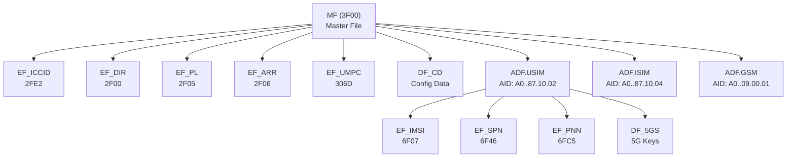

# UICC File System — Файловая система UICC

## Определение

Файловая система UICC — это **иерархическая структура хранения данных** на смарт-карте, основанная на ISO/IEC 7816-4 и расширенная ETSI TS 102 221. ^[extracted]

## Структура

> [!tip] Практический совет
> FID многих файлов (EF_ICCID=2FE2, EF_IMSI=6F07, EF_SPN=6F46) **сохранены одинаковыми** между GSM SIM, USIM и 5G SIM для обратной совместимости. Телефон может читать файлы не зная поколения карты.

## Типы файлов

### 1. MF (Master File)
- **Единственный**, обязательный, FID = `0x3F00`
- Содержит EF уровня MF и DF/ADF приложений
- Выбирается автоматически после ATR

### 2. DF (Dedicated File)
- **Директория**, может содержать EF и другие DF
- Имеет собственные security attributes
- Выбирается по FID, по пути, или по SFI

### 3. ADF (Application Dedicated File)
- Точка входа в приложение (USIM, ISIM, SIM)
- Выбирается по **AID** (Application Identifier) — имя DF длиной 5-16 байт
- Может быть first-level (есть в EF_DIR) или second-level application
- Активация ADF-сессии: SELECT по AID → FCP в ответе

### 4. EF (Elementary File)
Содержит данные. Типы EF описаны в [[wiki/concepts/EF_Types|Elementary File Types]].

## Методы выбора файла

| Метод | Что передаётся | Пример |
|---|---|---|
| **FID** | 2-байтовый идентификатор файла | `SELECT 0x2FE2` (EF_ICCID) |
| **Path** | Конкатенация FID от MF | `SELECT 0x3F00.0x7F20.0x6F07` |
| **SFI** | Short File Identifier (5 бит) | Быстрый доступ к EF без полного SELECT |
| **AID** | Application Identifier (5-16 байт) | `SELECT A0 00 00 00 87 10 02...` (USIM) |
| **Partial AID** | Частичный AID | Выбор первого совпадающего приложения |

## File Control Parameters (FCP)

При выборе файла UICC возвращает **FCP** — BER-TLV структуру с метаданными файла. Подробнее в [[wiki/concepts/FCP]].

## Зарезервированные File ID

| FID | Файл | Назначение |
|---|---|---|
| `0x3F00` | MF | Корень |
| `0x2F00` | EF_DIR | Application Directory |
| `0x2FE2` | EF_ICCID | ICC Identification |
| `0x2F05` | EF_PL | Preferred Languages |
| `0x2F06` | EF_ARR | Access Rule Reference |
| `0x2FFF` | — | Зарезервирован (выбор родительского DF) |
| `0x3FFF` | — | Зарезервирован (пустой PIN) |

## Ключевые принципы

1. **Текущий DF/EF**: В любой момент активен один current DF и (опционально) один current EF
2. **После ATR**: selected file = MF, current EF = none
3. **Логические каналы**: Каждый канал имеет независимый selected DF/EF
4. **Shareable vs not-shareable**: Файл может быть доступен нескольким приложениям (shareable) или только одному

## Связи

- Родительский концепт: [[wiki/concepts/UICC]]
- Типы EF: [[wiki/concepts/EF_Types]]
- FCP: [[wiki/concepts/FCP]]
- Безопасность файлов: [[wiki/concepts/UICC_Security]]
- Базовый стандарт: ISO/IEC 7816-4 (через [[wiki/entities/ISO7816]])
- Эволюция файловой системы: [[wiki/syntheses/gsm_vs_usim_filesystem|GSM SIM vs 3G USIM]]
