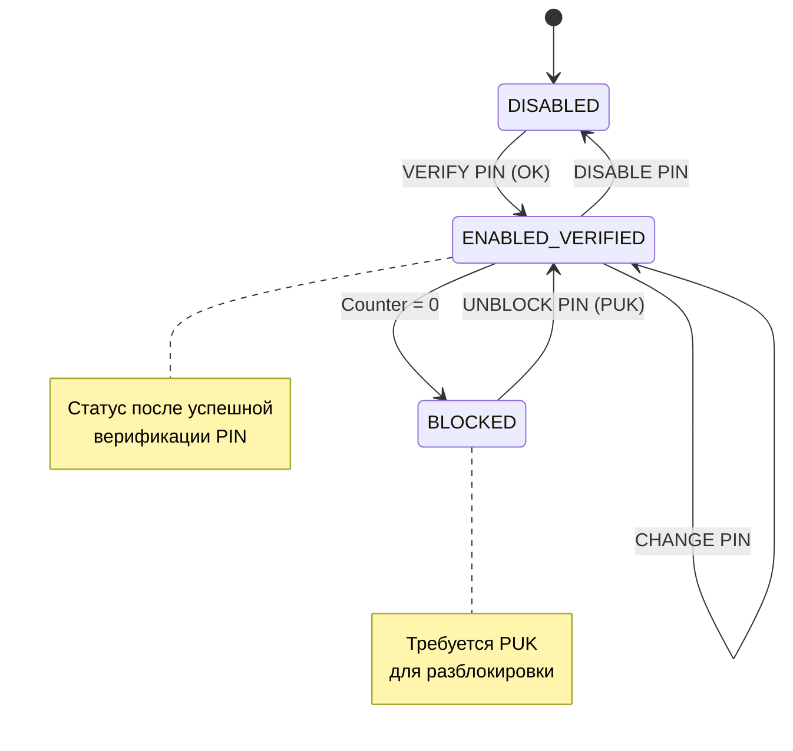

# UICC Security — Архитектура безопасности UICC

## Определение

Архитектура безопасности UICC определяет: кто и при каких условиях может читать/писать файлы, выполнять команды, и как аутентифицируется пользователь и сеть. ^[extracted]

Основана на ISO/IEC 7816-4, расширена в ETSI TS 102 221, адаптирована в 3GPP TS 31.101.

## Уровни безопасности

```
┌──────────────────────────────────────┐
│ 1. User Verification (PIN)           │  ← Пользователь знает PIN
├──────────────────────────────────────┤
│ 2. Entity Authentication             │  ← UICC ↔ Сеть (AUTHENTICATE)
├──────────────────────────────────────┤
│ 3. File Access Control               │  ← Кто может читать/писать EF
├──────────────────────────────────────┤
│ 4. Secure Messaging                  │  ← Шифрование + MAC APDU
├──────────────────────────────────────┤
│ 5. Secure Channel (SCP)              │  ← Защищённый канал с терминалом
└──────────────────────────────────────┘
```

## 1. PIN Management

### Типы PIN

| PIN | Key Reference | Назначение |
|---|---|---|
| **Universal PIN** | `11` | Общий для всех приложений (3GPP multi-verification) ^[extracted] |
| **Application PIN** | `01` (USIM PIN1), `02` (PIN2) | PIN конкретного приложения |
| **Local PIN** | Переменный | PIN для конкретного DF |

### 3GPP специфика: PIN и PIN2

- **PIN** (key ref `01`): верификация пользователя, доступ к USIM
- **PIN2** (key ref `02`): доступ к restricted функциям (FDN, dialling control)
- Кодируются на **8 байт**, минимум 4 цифры, ITU-T T.50 [5] ^[extracted]
- UNBLOCK PIN: всегда ровно 8 цифр ^[extracted]

### Состояния PIN



> [!danger] Критическая проблема
> При исчерпании попыток PIN (обычно 3) карта блокируется. Разблокировка **только через PUK** (8 цифр). При исчерпании PUK (обычно 10 попыток) карта **терминируется навсегда**.

### PIN Status (PS_DO, Tag `8B`/`8C` в FCP)

Возвращается при SELECT DF/ADF. Содержит:
- Key reference → PIN status (enabled/disabled/blocked)
- Remaining attempts
- Usage qualifier (какие команды требуют этот PIN)

## 2. File Access Control

### Модель

Каждый EF/DF имеет **security attributes**, определяющие:
- **Access Mode (AM)**: какие операции защищены (READ, UPDATE, ACTIVATE, DEACTIVATE, INCREASE и др.)
- **Security Condition (SC)**: что нужно выполнить для доступа (ALWays, PIN, ADM, NEVer)

### Access Modes (AM)

| Бит | Операция |
|---|---|
| b8 | DELETE FILE |
| b7 | TERMINATE DF |
| b6 | ACTIVATE FILE |
| b5 | DEACTIVATE FILE |
| b4 | READ (SEARCH) |
| b3 | UPDATE |
| b2 | INCREASE |
| b1 | REHABILITATE |
| b0 | INVALIDATE |

### Security Conditions (SC)

| Код | Условие |
|---|---|
| `0` | **ALWays** — без ограничений |
| `1` | **PIN1** — требуется VERIFY PIN (key ref `01`) |
| `2` | **PIN2** — требуется VERIFY PIN (key ref `02`) |
| `3` | **RFU** |
| `4` | **ADM1** — административный доступ |
| `5`-`A` | **ADM2-ADM9** |
| `B`-`D` | **RFU** |
| `E` | **AUTH** — требуется внешняя аутентификация |
| `F` | **NEVer** — доступ запрещён |

### Форматы security attributes

#### Compact Format
```
AM byte + SC byte  (2 байта)
или AM_DO + SC_DO (для нескольких условий)
```
Пример: `AM=04 (READ) + SC=01 (PIN1)` → "Чтение требует PIN1"

#### Expanded Format (BER-TLV)
```
AM_DO (Tag '80'):
  └─ AM byte(s)
SC_DO (Tag '90'):
  └─ SC byte(s) + параметры
+ Access Rule Referencing (Tag '8B')
```

### Access Rule Referencing (ARR)

Вместо встраивания security attributes в каждый файл, можно сослаться на запись в **EF_ARR** (`0x2F06`):

```
FCP содержит:
Tag '8B' → {
    File ID = 0x2F06 (EF_ARR)
    Record number = N
    [SEID = X (для multi-verification)]
}
```

EF_ARR запись N содержит: AM_DO + SC_DO → готовые security attributes.

## 3. Authentication (AUTHENTICATE)

Команда AUTHENTICATE (INS=`88`) используется для:
- **GSM AUTH**: A3/A8 алгоритмы (COMP128)
- **UMTS AKA**: mutual authentication
- **LTE/EPS AKA**: enhanced AKA
- **5G AKA / EAP-AKA'**: primary authentication
- **GBA** (Generic Bootstrapping Architecture)
- **Local authentication** (между терминалом и UICC)

## 4. Secure Channel (SCP)

MANAGE SECURE CHANNEL (INS=`73`):
- Установление защищённого канала между UICC и конечным терминалом
- SCP03 (GlobalPlatform) поддерживается для eUICC
- Разные security association (SA): Master SA, Connection SA

## Multi-verification UICC

3GPP multi-verification capable UICC:
- Каждое **первое приложение** может иметь свой Application PIN
- Universal PIN (`11`) может **заменить** Application PIN ^[extracted]
- Каждый логический канал имеет независимый статус PIN-верификации ^[extracted]
- SEID (Security Environment ID) для изоляции контекстов безопасности

## Связи

- Команды безопасности: [[wiki/concepts/APDU#INS]]
- FCP security attributes: [[wiki/concepts/FCP]]
- EF_ARR: [[wiki/concepts/UICC_File_System]]
- Secure Channel: [[wiki/summaries/ts_102221|TS 102 221 clause 11.1.20]]
- Безопасность смарт-карт (PhD): [[wiki/summaries/outsmarting_smart_cards|Outsmarting Smart Cards]]
- Security landscape: [[wiki/syntheses/security_landscape|Угрозы и защита]]
- SCP: [[wiki/concepts/SCP|Secure Channel Protocol]]
- GBA: [[wiki/summaries/ts_133220|TS 33.220 (GBA)]]
