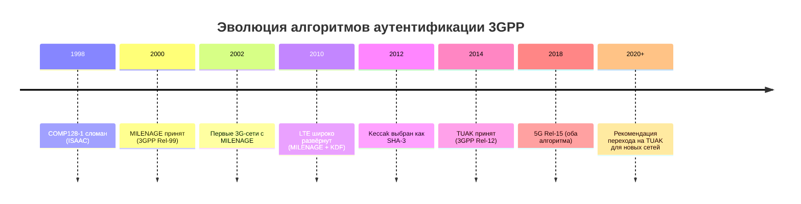
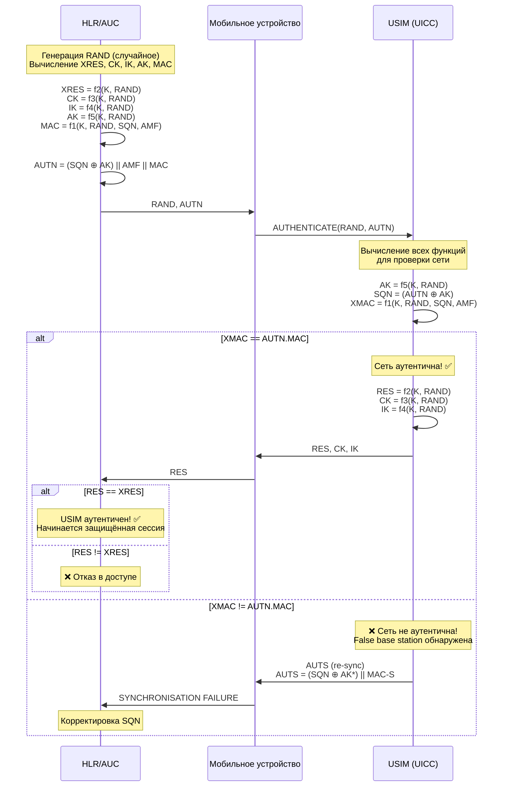

# MILENAGE vs TUAK: Сравнительный анализ алгоритмов аутентификации UICC

> **Research** — глубокий криптографический разбор двух алгоритмов аутентификации 3GPP: MILENAGE (AES-based, 2000) и TUAK (Keccak/SHA-3-based, 2014). Псевдокод всех функций, сравнительные таблицы, квантовая стойкость, практические рекомендации.

---

## 1. Обзор: почему это важно

Алгоритм аутентификации — это сердце безопасности мобильной сети. Он определяет, как USIM на UICC доказывает сети, что абонент — тот, за кого себя выдаёт, и как сеть доказывает USIM, что она — настоящий оператор, а не false base station.

Стандарт 3GPP определяет **два** алгоритма аутентификации:

| Алгоритм | Год принятия | Криптографический примитив | Статус |
|---|---|---|---|
| **MILENAGE** | 2000 (Rel-99) | AES-128 (Rijndael) | Основной, повсеместно поддерживается |
| **TUAK** | 2014 (Rel-12) | Keccak-256 (SHA-3) | Альтернативный, рекомендуется для новых развёртываний |

Оба алгоритма реализуют один и тот же набор функций `f1`, `f1*`, `f2`, `f3`, `f4`, `f5`, `f5*`, но на разных криптографических примитивах. Выбор алгоритма — это компромисс между совместимостью, стойкостью и вычислительной эффективностью.

> [!important] Ключевой факт
> В одной USIM может быть сконфигурирован **только один** алгоритм аутентификации — либо MILENAGE, либо TUAK. Выбор определяется при персонализации карты и не может быть изменён в поле (хотя переключение через OTA теоретически возможно).

---

## 2. Исторический контекст

### MILENAGE: рождение стандарта (2000)

MILENAGE был разработан группой SAGE (Security Algorithms Group of Experts) ETSI в рамках 3GPP Release 99. На момент проектирования:

- **AES (Rijndael)** был только что выбран NIST как новый стандарт шифрования США (октябрь 2000)
- GSM использовал COMP128 — скомпрометированный проприетарный алгоритм
- Требовался алгоритм с **публичной спецификацией** (в отличие от секретного COMP128)
- Нужна была **взаимная аутентификация** (сеть проверяет USIM, USIM проверяет сеть)
- Необходима была поддержка **integrity protection** (новинка для 3G)

MILENAGE был опубликован как 3GPP TS 35.205 (спецификация) и TS 35.206 (тестовые векторы). Его сила в том, что он основан на AES — самом изученном блочном шифре в мире.

### TUAK: эволюция (2014)

К 2014 году ландшафт изменился:

- **NIST выбрал Keccak как SHA-3** (октябрь 2012) — новый стандарт хеширования
- Появились опасения по поводу **related-key атак** на AES (хотя практических атак на MILENAGE нет)
- Сообщество хотело **альтернативу** на случай, если в AES найдут уязвимость
- Keccak предлагает принципиально иную **sponge-конструкцию** — crypto diversity
- **5G** требовал 256-битных ключей и квантовой стойкости

TUAK был опубликован как 3GPP TS 35.231 (спецификация) и TS 35.232 (тестовые векторы).



---

## 3. Математические основы

### MILENAGE: AES-128

MILENAGE построен на **AES-128** (Advanced Encryption Standard) — блочном шифре с параметрами:

| Параметр | Значение |
|---|---|
| **Размер блока** | 128 бит (16 байт) |
| **Размер ключа** | 128 бит |
| **Количество раундов** | 10 |
| **Тип** | Substitution-Permutation Network (SPN) |
| **S-box** | 8-битный (аффинное преобразование над GF(2^8)) |
| **Состояние** | 4x4 байтовая матрица |
| **Операции** | SubBytes, ShiftRows, MixColumns, AddRoundKey |

В MILENAGE AES используется в специальном **режиме** (не стандартный ECB/CBC). Операция определяется как:

$$\text{MILENAGE}_K(x) = \text{AES}_K(x) \oplus x$$

Где $K$ — 128-битный ключ, $x$ — 128-битный входной блок. Эта конструкция $\text{AES}_K(x) \oplus x$ делает функцию **необратимой** (one-way), так как прямой AES без XOR был бы обратимым.

### TUAK: Keccak-256

TUAK построен на **Keccak** — sponge-функции, лежащей в основе SHA-3:

| Параметр | Значение |
|---|---|
| **Тип** | Sponge construction |
| **Размер состояния** | 1600 бит (5x5x64) |
| **Размер блока (rate, r)** | 1088 бит (для Keccak-f[1600] при capacity 512) |
| **Capacity (c)** | 512 бит |
| **Количество раундов** | 24 |
| **Выходная длина** | Переменная (32/64/128/256 бит для RES и MAC) |
| **Операции** | $\theta, \rho, \pi, \chi, \iota$ (пять шагов на раунд) |

Keccak использует **sponge-конструкцию**: данные "впитываются" (absorb) в состояние, затем "выжимаются" (squeeze) для получения выхода. Это принципиально иная парадигма по сравнению с SPN у AES.

$$\text{TUAK}_K(x) = \text{Keccak}(K \parallel x \parallel \text{Instance} \parallel \text{Function})$$

Где:
- $K$ — 128/256-битный ключ
- $x$ — входные данные (RAND, SQN, AMF, ...)
- $\text{Instance}$ — байт конфигурации (например, `0x01` для 128-битного RES)
- $\text{Function}$ — идентификатор функции (f1=0x00, f2=0x01, ...)

> [!info] Криптографическое разнообразие
> Использование Keccak (sponge) вместо AES (SPN) — это не просто замена примитива. Это **crypto diversity**: если в AES когда-либо найдут структурную уязвимость, TUAK не будет затронут, так как основан на совершенно иной математике.

---

## 4. Сравнительная таблица: MILENAGE vs TUAK

| Параметр | MILENAGE | TUAK | Комментарий |
|---|---|---|---|
| **Базовый примитив** | AES-128 (Rijndael) | Keccak-f[1600] | Разные поколения криптографии |
| **Конструкция** | Substitution-Permutation Network (SPN) | Sponge construction | Принципиально разная архитектура |
| **Размер ключа K** | 128 бит (фикс.) | 128 или **256 бит** | TUAK поддерживает 256-бит для 5G |
| **Размер блока/состояния** | 128 бит | 1600 бит | TUAK имеет гораздо большее внутреннее состояние |
| **Раундов** | 10 | 24 | Keccak использует больше раундов |
| **Размер RES (f2)** | 32-128 бит | **32/64/128/256 бит** (настраивается) | TUAK гибче — переменный размер ответа |
| **Размер CK (f3)** | 128 бит | 128 или **256 бит** | TUAK: 256-бит для 5G |
| **Размер IK (f4)** | 128 бит | 128 или **256 бит** | TUAK: 256-бит для 5G |
| **Размер AK (f5)** | 48 бит | 48 или **64 бит** | TUAK поддерживает 64-бит для увеличенного SQN |
| **Размер MAC (f1)** | 64 бит | 64/128/160/**256 бит** (настраивается) | TUAK обеспечивает более длинный MAC |
| **Внутренние константы** | c1-c5, r1-r5 (ротации) | Нет констант | TUAK проще — меньше "магических" чисел |
| **OP / OPc** | OPc = OP XOR Ek(OP) | TOPc = Keccak(TOP || K || ...) | Разные методы деривации операторского варианта ключа |
| **Год принятия** | 2000 (3GPP Rel-99) | 2014 (3GPP Rel-12) | TUAK на 14 лет новее |
| **Квантовая стойкость** | Условная (128-бит против Grover = 64-бит) | **Высокая** (256-бит против Grover = 128-бит) | TUAK-256 защищён от квантовых атак |
| **Side-channel resistance** | Зависит от имплементации AES | Потенциально лучше (нет S-box lookup) | Keccak использует битовые операции, меньше таблиц поиска |
| **Аппаратная поддержка** | AES-NI (x86), ARMv8 Crypto | Не везде (Keccak HW — редкость) | MILENAGE быстрее на CPU с AES-NI |
| **Производительность (SW)** | ~250 циклов/байт (AES) | ~500 циклов/байт (Keccak) | MILENAGE быстрее в программной реализации |
| **Стандартизация** | TS 35.205, TS 35.206 | TS 35.231, TS 35.232 | Оба открыто стандартизованы ETSI/3GPP |
| **Выбор на UICC** | EF_AD (Administrative Data) | EF_AD + EF_UST service 98 | Разные механизмы индикации |
| **Совместимость** | Все сети 3G/4G/5G | 3GPP Rel-12+ сети | MILENAGE шире поддерживается |
| **Рекомендация** | Для существующих развёртываний | **Для новых развёртываний (5G SA)** | 3GPP рекомендует TUAK для 5G |

---

## 5. Функции MILENAGE: детальный разбор

MILENAGE определяет **семь** функций, основанных на единственном криптографическом ядре — AES-128. Все функции вычисляются через общую процедуру.

### 5.1 Общая структура MILENAGE

Базовое ядро:

$$\text{MILENAGE}_K(x) = \text{AES}_K(x) \oplus x$$

Вычисление всех функций происходит в два этапа:

**Этап 1: Вычисление промежуточных значений**

```
TEMP1 = AES_K(RAND ⊕ OPc)
  (если OP используется вместо OPc: OPc = OP ⊕ AES_K(OP))

TEMP2 = ROTATE(TEMP1, r1) ⊕ c1
TEMP3 = ROTATE(TEMP1, r2) ⊕ c2
TEMP4 = ROTATE(TEMP1, r3) ⊕ c3
TEMP5 = ROTATE(TEMP1, r4) ⊕ c4
TEMP6 = ROTATE(TEMP1, r5) ⊕ c5
```

Где константы определены в TS 35.206:
- `r1=64, c1=0x00000000000000000000000000000001`
- `r2=0,  c2=0x00000000000000000000000000000002`
- `r3=96, c3=0x00000000000000000000000000000004`
- `r4=32, c4=0x00000000000000000000000000000008`
- `r5=64, c5=0x00000000000000000000000000000010`

**Этап 2: Вычисление выходных функций**

```
OUT1 = AES_K(TEMP2 ⊕ ROTATE(IN1, r1) ⊕ c1)
OUT2 = AES_K(TEMP3 ⊕ ROTATE(IN2, r2) ⊕ c2)
OUT3 = AES_K(TEMP4 ⊕ ROTATE(IN3, r3) ⊕ c3)
OUT4 = AES_K(TEMP5 ⊕ ROTATE(IN4, r4) ⊕ c4)
OUT5 = AES_K(TEMP6 ⊕ ROTATE(IN5, r5) ⊕ c5)
```

### 5.2 f1 — MAC (Network Authentication)

**Назначение**: Аутентификация сети перед USIM. USIM вычисляет XMAC и сравнивает с MAC из AUTN.

**Входные параметры**:

| Параметр | Размер | Описание |
|---|---|---|
| K | 128 бит | Долговременный секретный ключ |
| RAND | 128 бит | Случайное число от сети |
| SQN | 48 бит | Sequence Number |
| AMF | 16 бит | Authentication Management Field |
| OPc | 128 бит | Operator Code (производный от OP) |

**Псевдокод**:
```
function f1(K, RAND, SQN, AMF, OPc):
    // Шаг 1: Подготовка входных данных для OUT1
    IN1[127:0] = SQN[47:0] || AMF[15:0] || SQN[47:0] || AMF[15:0]

    // Шаг 2: Вычисление TEMP (используя общее ядро)
    TEMP1 = AES_K(RAND ⊕ OPc)
    TEMP2 = ROTATE(TEMP1, r1) ⊕ c1

    // Шаг 3: Вычисление OUT1
    block1 = TEMP2 ⊕ ROTATE(IN1, r1) ⊕ c1
    OUT1 = AES_K(block1)

    // Шаг 4: MAC — первые 64 бита OUT1
    MAC = OUT1[127:64]    // старшие 64 бита

    return MAC
```

**Выход**: MAC (64 бит) — Message Authentication Code

> В AUTN массив MAC-значение сравнивается с XMAC, вычисленным USIM. Если равны — сеть аутентична.

### 5.3 f1* — MAC-S (Re-synchronisation)

**Назначение**: Аутентификация сообщения re-synchronisation. Используется, когда SQN в USIM и сети расходятся.

**Псевдокод**:
```
function f1_star(K, RAND, SQN, AMF, OPc):
    // Отличие от f1: IN1 формируется иначе
    IN1[127:0] = SQN[47:0] || AMF[15:0] || SQN[47:0] || AMF[15:0]

    TEMP1 = AES_K(RAND ⊕ OPc)
    TEMP2 = ROTATE(TEMP1, r1) ⊕ c1

    block1 = TEMP2 ⊕ ROTATE(IN1, r1) ⊕ c1
    OUT1 = AES_K(block1)

    MAC_S = OUT1[63:0]     // младшие 64 бита (отличие от f1!)
    return MAC_S
```

> [!warning] f1 vs f1*
> Разница в том, какие 64 бита из OUT1 берутся: **f1** — старшие (OUT1[127:64]), **f1\*** — младшие (OUT1[63:0]). Это гарантирует, что MAC для re-sync отличается от обычного MAC.

### 5.4 f2 — RES (User Response)

**Назначение**: Ответ USIM на вызов сети. Сеть сверяет RES с ожидаемым XRES.

**Псевдокод**:
```
function f2(K, RAND, OPc):
    IN2[127:0] = ROTATE(TEMP1, r2) ⊕ c2

    TEMP1 = AES_K(RAND ⊕ OPc)
    TEMP3 = ROTATE(TEMP1, r3) ⊕ c3

    block2 = TEMP3 ⊕ ROTATE(IN2, r3) ⊕ c3
    OUT2 = AES_K(block2)

    RES = OUT2[127:64]    // разрядность RES: 32-128 бит,
                           // старшие биты OUT2
    return RES
```

**Выход**: RES (32-128 бит) — Response

### 5.5 f3 — CK (Cipher Key)

**Назначение**: Генерация ключа шифрования (Cipher Key).

**Псевдокод**:
```
function f3(K, RAND, OPc):
    IN3[127:0] = TEMP2          // для f3 вход — TEMP2

    TEMP1 = AES_K(RAND ⊕ OPc)
    TEMP4 = ROTATE(TEMP1, r4) ⊕ c4

    block3 = TEMP4 ⊕ ROTATE(IN3, r4) ⊕ c4
    OUT3 = AES_K(block3)

    CK = OUT3 XOR TEMP2         // отличие: XOR с TEMP2
    return CK
```

**Выход**: CK (128 бит) — Cipher Key

### 5.6 f4 — IK (Integrity Key)

**Назначение**: Генерация ключа integrity protection.

**Псевдокод**:
```
function f4(K, RAND, OPc):
    IN4[127:0] = TEMP2          // для f4 вход — TEMP2

    TEMP1 = AES_K(RAND ⊕ OPc)
    TEMP5 = ROTATE(TEMP1, r5) ⊕ c5

    block4 = TEMP5 ⊕ ROTATE(IN4, r5) ⊕ c5
    OUT4 = AES_K(block4)

    IK = OUT4 XOR TEMP2         // отличие: XOR с TEMP2
    return IK
```

**Выход**: IK (128 бит) — Integrity Key

### 5.7 f5 — AK (Anonymity Key)

**Назначение**: Скрытие SQN в AUTN. AK маскирует SQN при передаче по радиоэфиру.

**Псевдокод**:
```
function f5(K, RAND, OPc):
    IN5[127:0] = ROTATE(TEMP2, r1) ⊕ c1

    TEMP1 = AES_K(RAND ⊕ OPc)
    // f5 использует TEMP2 как дополнительный вход
    TEMP2 = ROTATE(TEMP1, r1) ⊕ c1

    block5 = TEMP2 ⊕ ROTATE(IN5, r1) ⊕ c1
    OUT5 = AES_K(block5)

    AK = OUT5[47:0]             // младшие 48 бит
    return AK
```

**Выход**: AK (48 бит) — Anonymity Key

### 5.8 f5* — AK* (Anonymity Key for Re-synch)

Аналогична f5, но берутся старшие 48 бит OUT5[127:80] вместо младших.

### 5.9 Как функции используются вместе: полный процесс UMTS AKA



> [!tip] Ключевое свойство MILENAGE
> Все 7 функций вычисляются из **одного вызова AES_K(RAND)**. Это эффективно: один дорогой вызов AES порождает весь набор ключей. Константы r1-r5 и c1-c5 гарантируют, что выходы функций криптографически независимы.

---

## 6. Функции TUAK: детальный разбор

TUAK использует Keccak вместо AES. Это даёт большую гибкость в размерах выхода, но требует другой структуры вычислений.

### 6.1 Общая структура TUAK

В отличие от MILENAGE, TUAK **не** вычисляет все функции из одного общего значения. Каждая функция вычисляется независимо через Keccak:

$$\text{TUAK}_{K,\text{Instance},\text{Function}}(x) = \text{Keccak}[c=512](K \parallel x \parallel \text{Instance} \parallel \text{Function})$$

Где параметры:
- $K$ — 128 или 256 бит (долговременный ключ)
- $x$ — конкатенация входных параметров (RAND, и если нужно — SQN, AMF)
- $\text{Instance}$ — 8 бит, определяет конфигурацию алгоритма
- $\text{Function}$ — 8 бит, определяет номер функции (f1=0x01, f2=0x02, ...)
- $\text{Keccak}[c=512]$ — Keccak sponge с capacity 512 бит, выход переменной длины

### 6.2 Конфигурация TUAK (Instance byte)

| Бит | Значение | Описание |
|---|---|---|
| b1..b3 | TOPc/TK деривация | Метод получения ключа из TOP |
| b4 | MAC-A включён | MAC-A для AKA (f1) |
| b5 | MAC-S включён | MAC-S для re-sync (f1*) |
| b6 | Размер ключа | 0=128 бит, 1=256 бит |
| b7..b8 | Размер RES | 00=32, 01=64, 10=128, 11=256 бит |

### 6.3 f1 — MAC (Network Authentication)

**Входные параметры**:

| Параметр | Размер | Описание |
|---|---|---|
| K | 128/256 бит | Долговременный секретный ключ |
| RAND | 128 бит | Случайное число |
| SQN | 48 бит | Sequence Number |
| AMF | 16 бит | Authentication Management Field |
| Instance | 8 бит | Конфигурация |
| Function | 8 бит | 0x01 для f1 |

**Псевдокод**:
```
function TUAK_f1(K, RAND, SQN, AMF, Instance, Function=0x01):
    // Шаг 1: Формирование входного сообщения
    // Порядок: RAND || K || SQN || AMF || Instance || Function
    INPUT = RAND[127:0] || K[127:0] || SQN[47:0] || AMF[15:0]
            || Instance[7:0] || Function[7:0]

    // Шаг 2: Keccak absorb + squeeze
    // Keccak[c=512]: rate=1088, capacity=512
    output = Keccak_f1600(INPUT, output_length=MAC_len)

    // Шаг 3: Выход — первые MAC_len бит
    MAC = output[0:MAC_len-1]

    return MAC
```

**Размер MAC** (определяется конфигурацией): 64 бит (по умолчанию), до 256 бит.

### 6.4 f1* — MAC-S (Re-synchronisation)

```
function TUAK_f1_star(K, RAND, SQN, AMF, Instance, Function=0x06):
    // Аналогична f1, но с другим Function байтом (0x06)
    INPUT = RAND || K || SQN || AMF || Instance || 0x06
    output = Keccak_f1600(INPUT, output_length=MAC_len)
    MAC_S = output[0:MAC_len-1]
    return MAC_S
```

### 6.5 f2 — RES (User Response)

```
function TUAK_f2(K, RAND, Instance, Function=0x02):
    // Шаг 1: Входное сообщение БЕЗ SQN и AMF!
    INPUT = RAND[127:0] || K[127:0] || Instance[7:0] || Function[7:0]

    // Шаг 2: Keccak
    output = Keccak_f1600(INPUT, output_length=RES_len)

    // Шаг 3: Выход — RES_len бит
    RES = output[0:RES_len-1]

    return RES
```

**Размер RES** (определяется конфигурацией):
- `00` = 32 бита (минимальная совместимость)
- `01` = 64 бита (стандарт)
- `10` = 128 бит
- `11` = 256 бит (максимальная стойкость)

> [!important] Важное отличие от MILENAGE
> В TUAK функция f2 **не зависит от SQN и AMF** (в отличие от MILENAGE, где f2 использует TEMP1 через цепочку констант). Это делает RES в TUAK криптографически более чистым: он зависит только от K и RAND.

### 6.6 f3 — CK (Cipher Key)

```
function TUAK_f3(K, RAND, Instance, Function=0x03):
    INPUT = RAND || K || Instance || 0x03
    output = Keccak_f1600(INPUT, output_length=KeyLen)

    CK = output[0:KeyLen-1]
    return CK
```

**Размер CK**: 128 бит или 256 бит (определяется конфигурацией).

### 6.7 f4 — IK (Integrity Key)

```
function TUAK_f4(K, RAND, Instance, Function=0x04):
    INPUT = RAND || K || Instance || 0x04
    output = Keccak_f1600(INPUT, output_length=KeyLen)

    IK = output[0:KeyLen-1]
    return IK
```

**Размер IK**: 128 бит или 256 бит.

### 6.8 f5 — AK (Anonymity Key)

```
function TUAK_f5(K, RAND, Instance, Function=0x05):
    INPUT = RAND || K || Instance || 0x05
    output = Keccak_f1600(INPUT, output_length=AK_len)

    AK = output[0:AK_len-1]
    return AK
```

**Размер AK**: 48 бит (стандарт) или 64 бита.

### 6.9 f5* — AK* (Anonymity Key Re-sync)

```
function TUAK_f5_star(K, RAND, Instance, Function=0x07):
    INPUT = RAND || K || Instance || 0x07
    output = Keccak_f1600(INPUT, output_length=AK_len)

    AK_star = output[0:AK_len-1]
    return AK_star
```

### 6.10 Сводная таблица: Function байты TUAK

| Функция | Function байт | Описание | Минимальный выход | Максимальный выход |
|---|---|---|---|---|
| f1 (MAC) | `0x01` | Network auth | 64 бит | 256 бит |
| f1* (MAC-S) | `0x06` | Re-sync auth | 64 бит | 256 бит |
| f2 (RES) | `0x02` | User response | 32 бит | 256 бит |
| f3 (CK) | `0x03` | Cipher key | 128 бит | 256 бит |
| f4 (IK) | `0x04` | Integrity key | 128 бит | 256 бит |
| f5 (AK) | `0x05` | Anonymity key | 48 бит | 64 бит |
| f5* (AK*) | `0x07` | AK re-sync | 48 бит | 64 бит |

---

## 7. Сравнение стойкости

### 7.1 Классическая стойкость

| Аспект | MILENAGE (AES-128) | TUAK (Keccak-256) |
|---|---|---|
| **Brute-force на K** | $2^{128}$ операций | $2^{256}$ операций |
| **Коллизии на выходе** | $2^{64}$ (birthday для MAC) | $2^{128}$ (при 256-бит MAC) |
| **Известные атаки на примитив** | Related-key на AES-192/256 (не влияет на AES-128) ^[extracted] | Нет известных атак на Keccak |
| **Структурные уязвимости** | Нет на full-round AES | Нет на Keccak-f[1600] |
| **Срок криптоанализа** | 25+ лет интенсивного анализа | 10+ лет анализа |

### 7.2 Квантовая стойкость

Модель угрозы: атакующий с квантовым компьютером, использующий алгоритм Гровера.

| Алгоритм | Классическая стойкость | Post-Grover стойкость | Статус |
|---|---|---|---|
| **MILENAGE-128** | 128 бит | 64 бит | **Уязвим** — $2^{64}$ квантовых операций реально для nation-state |
| **TUAK-128** | 128 бит | 64 бит | Аналогично MILENAGE |
| **TUAK-256** | 256 бит | **128 бит** | **Квантово-стойкий** — $2^{128}$ за пределами возможного |

> [!warning] Квантовая угроза для MILENAGE
> Алгоритм Гровера снижает эффективную длину ключа вдвое: 128 бит → 64 бита. Хотя $2^{64}$ квантовых операций всё ещё дорого, для долгосрочных ключей (SIM-карты живут 10+ лет) это создаёт риск. **Для 5G-сетей с длительным жизненным циклом рекомендуется TUAK-256**.

### 7.3 Side-Channel Resistance

**AES (MILENAGE)**:
- Главная уязвимость — **S-box lookup**: 256-байтовая таблица поиска, доступ к которой коррелирует с ключом
- DPA/CPA атаки на AES хорошо изучены и реализуемы без защитных мер
- Защита: маскировка (masking), случайные задержки, hardware AES (защищённый сопроцессор)
- Большинство коммерческих UICC используют аппаратный AES, устойчивый к side-channel

**Keccak (TUAK)**:
- **Нет таблиц поиска** — все операции битовые (AND, XOR, NOT, ROT)
- Потенциально более устойчив к DPA/CPA
- Однако Keccak использует больше раундов (24 vs 10), что увеличивает временное окно для сбора трасс
- Консенсус: Keccak **легче защитить** от side-channel, чем AES, но он не иммунен

### 7.4 Сводная оценка стойкости

| Угроза | MILENAGE | TUAK-128 | TUAK-256 |
|---|---|---|---|
| **Классический brute-force** | Стоек | Стоек | Стоек |
| **Квантовый brute-force (Grover)** | Условно стоек | Условно стоек | **Стоек** |
| **Side-channel (DPA/CPA)** | Защита обязательна | Защита рекомендуется | Защита рекомендуется |
| **Математический криптоанализ (алгоритм)** | Стоек (25+ лет) | Стоек (10+ лет) | Стоек (10+ лет) |
| **Crypto diversity** | Только AES | Keccak (альтернатива AES) | Keccak (альтернатива AES) |

---

## 8. EF и UICC: хранение ключей и выбор алгоритма

### 8.1 Где хранятся ключи

Ключ K и параметры алгоритма хранятся в EF внутри ADF.USIM:

| EF | FID | Содержимое | Алгоритм |
|---|---|---|---|
| **EF_Keys** | `0x6F08` | CK + IK для CS/PS домена | Оба |
| **EF_KeysPS** | `0x6F09` | CK + IK только для PS | Оба |
| **EF_AD** | `0x6FAD` | Administrative Data (длина поля — 4+ байта) | Оба |
| **5G: EF_5GAUTHKEYS** | `0x6FF3` | K (256 бит) + RIN + Counter | TUAK-256 |

### 8.2 Как UICC узнаёт, какой алгоритм использовать

Спецификация TS 31.102 определяет два механизма:

#### Механизм 1: EF_AD (Administrative Data)

EF_AD содержит байт, указывающий алгоритм аутентификации:

| Байт | Значение | Описание |
|---|---|---|
| b4..b1 (Algo ID) | `0000` | **MILENAGE** (по умолчанию) |
| | `0001` | **TUAK** |
| | `0010`-`1111` | RFU (зарезервировано) |
| b8..b5 | Размер MAC-A, размер RES и т.д. | Детали конфигурации |

Порядок при инициализации:
```
ME → SELECT ADF.USIM
ME → READ BINARY EF_AD (offset, length)
ME определяет:
  - Алгоритм (MILENAGE или TUAK)
  - Параметры алгоритма (размер RES, размер MAC)
ME → AUTHENTICATE (с правильным алгоритмом)
```

#### Механизм 2: EF_UST Service 98 (для TUAK)

Сервис 98 в USIM Service Table (EF_UST) индицирует поддержку TUAK:

```
EF_UST байт 13, бит 2 (Service 98):
  0 = TUAK не поддерживается
  1 = TUAK поддерживается
```

Если Service 98 = 1, терминал может использовать TUAK. Если 0 — только MILENAGE.

> [!tip] Порядок проверки
> 1. Терминал читает EF_UST → проверяет Service 98
> 2. Если Service 98 = 1: читает EF_AD → определяет алгоритм и параметры
> 3. Если Service 98 = 0: использует MILENAGE (по умолчанию)
> 4. Выполняет AUTHENTICATE с правильным алгоритмом

### 8.3 Процесс персонализации UICC

```
При производстве UICC:
  ├── Выбор алгоритма (MILENAGE / TUAK)
  ├── Генерация K (128 или 256 бит)
  ├── Вычисление OPc / TOPc
  ├── Запись EF_AD с правильным Algo ID
  ├── Установка Service 98 в EF_UST (если TUAK)
  ├── Запись EF_Keys (пустые CK/IK — заполняются при аутентификации)
  └── Для 5G: DF_5GS/EF_5GAUTHKEYS с K 256 бит
```

---

## 9. Практические рекомендации

### Когда использовать MILENAGE

| Сценарий | Причина |
|---|---|
| **Существующие 3G/4G-сети** | Совместимость с устаревшими UE, не поддерживающими TUAK |
| **Роуминг с партнёрами** | Не все операторы поддерживают TUAK |
| **Ограниченный бюджет** | MILENAGE — зрелая, дешёвая экосистема |
| **Аппаратное ускорение AES** | AES-NI на серверах HLR/AuC даёт прирост производительности |
| **Регуляторные ограничения** | Некоторые страны требуют MILENAGE для interoperability |
| **Краткосрочный проект** | Если SIM-карты планируется заменить через 2-3 года |

### Когда использовать TUAK

| Сценарий | Причина |
|---|---|
| **Новые 5G SA (Standalone) сети** | 5G рекомендует TUAK для новых развёртываний |
| **256-битная безопасность** | Защита от квантовых атак, повышенные требования |
| **Crypto diversity** | Диверсификация рисков — не полагаться только на AES |
| **Долгосрочные ключи (10+ лет)** | SIM-карты 5G будут использоваться до 2035+; квантовые компьютеры могут появиться |
| **Высокозащищённые сети** | Правительственные, военные, критические инфраструктуры |
| **IoT / M2M с длительным жизненным циклом** | Устройства, которые не будут заменены десятилетиями |
| **Упрощённая сертификация** | Keccak проще анализировать (нет S-box) |

### Матрица решений

```
┌─────────────────────────────────────────────────────────────────┐
│                    ВЫБОР АЛГОРИТМА АУТЕНТИФИКАЦИИ               │
├─────────────────────────────────────────────────────────────────┤
│                                                                 │
│  Новое развёртывание?                                           │
│    ├── Да → 5G SA?                                              │
│    │         ├── Да → Требуется квантовая стойкость?            │
│    │         │         ├── Да → TUAK-256                        │
│    │         │         └── Нет → TUAK-128 (или MILENAGE)       │
│    │         └── Нет (4G) → Есть устаревшие UE?                │
│    │                         ├── Да → MILENAGE                 │
│    │                         └── Нет → TUAK (рекомендуется)    │
│    └── Нет → Существующая сеть                                 │
│               ├── Планируется миграция?                        │
│               │   ├── Да → План: MILENAGE→TUAK поэтапно       │
│               │   └── Нет → Оставить MILENAGE                 │
│               └── ...                                          │
│                                                                 │
└─────────────────────────────────────────────────────────────────┘
```

> [!tip] Рекомендация 3GPP (TR 33.834)
> "Для новых развёртываний 5G рекомендуется использовать TUAK с длиной ключа 256 бит для обеспечения долгосрочной безопасности." ^[extracted]

---

## 10. Выводы

### Ключевые различия

1. **Криптографический фундамент**: MILENAGE основан на AES (SPN, 2000), TUAK — на Keccak (Sponge, 2014). Это не просто замена примитива, а смена криптографической парадигмы.

2. **Гибкость**: TUAK предлагает переменные размеры выхода для всех функций (RES: 32-256 бит, MAC: 64-256 бит, CK/IK: 128-256 бит). MILENAGE жёстко фиксирован.

3. **Квантовая стойкость**: MILENAGE (128 бит) уязвим к атаке Гровера (эффективные 64 бита). TUAK-256 (256 бит) остаётся стойким (эффективные 128 бит).

4. **Производительность**: MILENAGE быстрее на оборудовании с AES-NI. TUAK медленнее в программной реализации, но это не критично — аутентификация выполняется редко (при подключении к сети).

5. **Side-channel**: TUAK теоретически более устойчив к DPA/CPA из-за отсутствия S-box таблиц поиска, но оба алгоритма требуют защищённой реализации.

6. **Совместимость**: MILENAGE поддерживается всеми сетями 3G/4G/5G и всеми UE. TUAK требует Rel-12+ сети и поддерживающего терминала.

### Итоговая рекомендация

| Ситуация | Рекомендация |
|---|---|
| **Существующая 3G/4G-сеть** | Оставить MILENAGE |
| **Новое 4G-развёртывание** | Рассмотреть TUAK-128 |
| **Новое 5G SA-развёртывание** | **TUAK-256** |
| **Правительственные/военные сети** | **TUAK-256** обязательно |
| **IoT с длительным сроком службы** | **TUAK-256** |
| **Миграция MILENAGE→TUAK** | План: новые USIM с TUAK + поддержка MILENAGE на сети для старых UE |

### Открытые вопросы

- Когда появятся first-preimage атаки на Keccak с понижением раундов?
- Насколько эффективны новые квантовые алгоритмы (помимо Гровера) против sponge-конструкций?
- Как изменится ландшафт с приходом **постквантовых криптосистем** (PQC), таких как CRYSTALS-Kyber? Заменит ли это MILENAGE/TUAK в 6G?

---

## 11. Ссылки

### На материалы базы знаний
- [[wiki/syntheses/auth_evolution]] — Эволюция аутентификации от COMP128 до 5G AKA
- [[wiki/concepts/UICC_Security]] — Архитектура безопасности UICC
- [[wiki/concepts/USIM]] — USIM-приложение и его EF
- [[wiki/summaries/ts_131102]] — TS 31.102: характеристики USIM
- [[wiki/syntheses/security_landscape]] — Ландшафт угроз и защиты

### На спецификации 3GPP
- **3GPP TS 35.205** — MILENAGE: Algorithm Set Specification
- **3GPP TS 35.206** — MILENAGE: Test Data
- **3GPP TS 35.231** — TUAK: Algorithm Set Specification
- **3GPP TS 35.232** — TUAK: Test Data
- **3GPP TS 33.102** — 3G Security Architecture (UMTS AKA)
- **3GPP TS 33.401** — EPS Security Architecture
- **3GPP TS 33.501** — 5G Security Architecture
- **3GPP TR 33.834** — Study on TUAK security properties

### На внешние источники
- **FIPS 197** — Advanced Encryption Standard (AES), NIST, 2001
- **FIPS 202** — SHA-3 Standard: Permutation-Based Hash and Extendable-Output Functions, NIST, 2015
- **The Keccak reference** — G. Bertoni, J. Daemen, M. Peeters, G. Van Assche, "Keccak", 2012
- **Grover's Algorithm** — L.K. Grover, "A Fast Quantum Mechanical Algorithm for Database Search", STOC 1996

---

*Research завершён 2026-06-11. Следующий шаг: практическая реализация TUAK для pySim и тестирование с test vectors из TS 35.232.*
