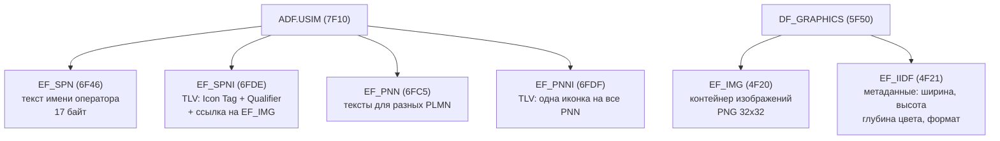
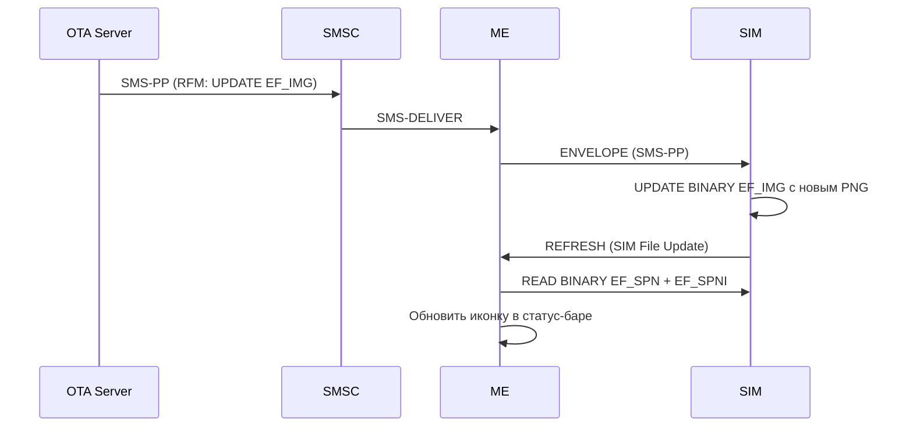
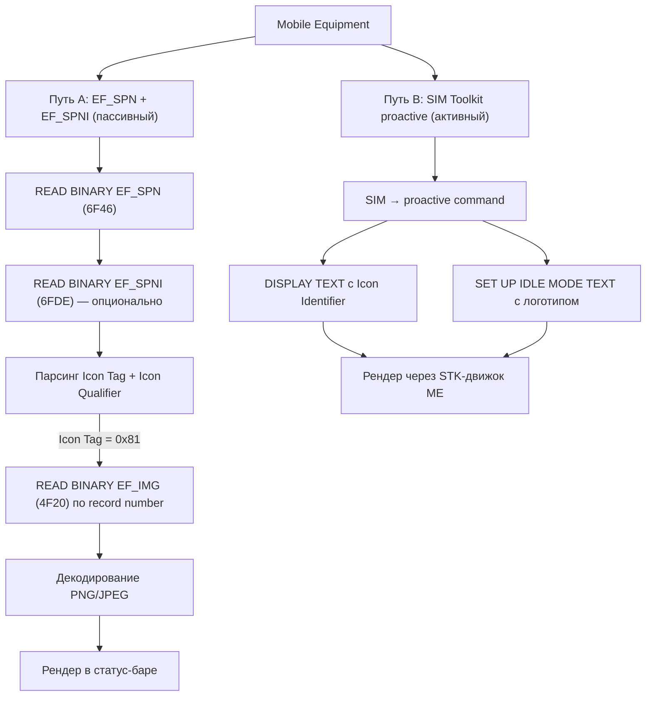
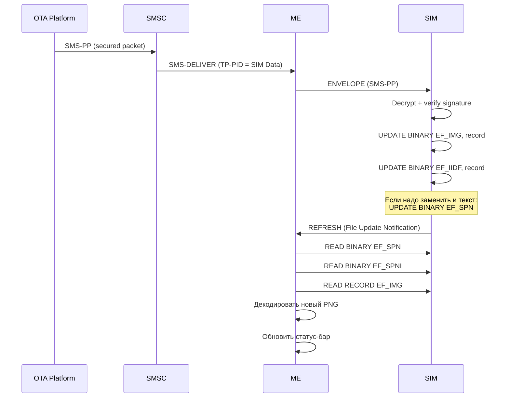

# Отображение картинки в имени оператора: путь иконки от SIM до экрана

> **Research** — жизненный цикл операторской иконки: как изображение из EF на SIM-карте превращается в логотип в статус-баре телефона.

---

## 1. Вопрос исследования

Как именно телефон **берёт картинку из SIM-карты** и **показывает её рядом с именем оператора**? Что происходит между чтением EF и появлением иконки на экране?

Этот вопрос распадается на три:
1. **Откуда берётся изображение?** — Provisioning (OTA, персонализация)
2. **Как телефон узнаёт что иконка есть?** — Terminal Profile + Service Table + чтение EF
3. **Как телефон решает что и где показать?** — Display Condition + Icon Qualifier + ME implementation

---

## 2. Provisioning: как иконка попадает на SIM

### 2.1 При персонализации

На этапе производства оператор записывает изображения в соответствующие EF:



### 2.2 Через OTA (Remote File Management)

Оператор может обновить иконку **после выдачи SIM** через OTA:



^[extracted] ETSI TS 102 226 (Remote APDU) + TS 102 223 (REFRESH proactive command)

---

## 3. Terminal Profile: телефон объявляет свои возможности

### 3.1 Ключевые биты

Перед тем как SIM начнёт слать иконки, ME сообщает о своей поддержке в **TERMINAL PROFILE**:

| Byte | Bit | Значение | Что даёт |
|---|---|---|---|
| **Byte 25** | Bit 1 (`0x02`) | **Image support (DF_GRAPHICS)** | EF_IMG, EF_IIDF доступны для команд |
| **Byte 25** | Bit 4 (`0x08`) | **DISPLAY TEXT с иконкой** | SIM может показать логотип через proactive command |
| **Byte 25** | Bit 6 (`0x20`) | **SET UP IDLE MODE TEXT** | SIM может записать логотип на idle screen |

Если биты не взведены — SIM не получит REFRESH с иконкой, даже если EF_IMG заполнен. ^[inferred]

### 3.2 USIM Service Table

Для EF_SPNI нужны **Service n°19** (Service Provider Name) и **Service n°78** (Service Provider Name Icon) в USIM Service Table. Без них ME не будет читать EF_SPNI. ^[extracted] TS 31.102 §4.2.88

---

## 4. Display Condition: логика «что и когда показывать»

### 4.1 EF_SPN Display Condition (Byte 1)

ME читает байт Display Condition из EF_SPN и применяет правила:

| Ситуация | Bit 1 | Bit 2 | Что видит пользователь |
|---|---|---|---|
| **Домашняя сеть** | 0 | — | **Только SPN** (имя оператора) |
| **Домашняя сеть** | 1 | — | **SPN + PLMN name** (MegaFon + MTS) |
| **Роуминг** | — | 0 | **PLMN name + SPN** (Vodafone ES + MegaFon) |
| **Роуминг** | — | 1 | **Только PLMN name** (SPN скрыт) |

^[extracted] TS 31.102 §4.2.12

### 4.2 Icon Qualifier — иконка заменяет или дополняет?

EF_SPNI хранит **Icon Qualifier** в TLV:

| Qualifier | Значение | Эффект на экране |
|---|---|---|
| `'01'` | **Self-explanatory** | Иконка **заменяет** текст — пользователь видит только логотип |
| `'02'` | **Not self-explanatory** | Иконка **рядом** с текстом — логотип + "Vodafone" |

^[extracted] TS 31.102 §4.2.88

### 4.3 Два независимых пути отображения



Путь A реализуется прозрачно — пользователь не знает что телефон читает EF. Путь B — активное вмешательство SIM через STK.

> [!seealso] Структуры файлов
> Детальное описание EF_IMG, EF_IIDF, EF_ICON и их TLV-форматов — в [[wiki/syntheses/sim_files_graphics|Графика и иконки: EF_SPNI, EF_PNNI, EF_IMG]].

---

---

## 5. Render Pipeline: от байтов до пикселей

### 5.1 Шаг 1: Чтение

```
ME → SIM: READ BINARY EF_SPN (6F46), offset=0, len=17
SIM → ME: [0x01][0x56,0x6F,0x64,0x61,0x66,0x6F,0x6E,0x65,0xFF x8]
         = Display=0x01 (показывать SPN + PLMN), Name="Vodafone" (GSM 7-bit)

ME → SIM: READ BINARY EF_SPNI (6FDE) — если Service n°78 available
SIM → ME: [0x81][0x03][0x01][0x00,0x01]
         = Icon Tag=0x81 (EF_IMG ptr), Len=3, Qualifier=01 (self-explanatory),
           Record #1

ME → SIM: READ RECORD EF_IMG (4F20), record=1
SIM → ME: <PNG binary data, 32×32 px>
```

### 5.2 Шаг 2: Декодирование

ME поддерживает форматы согласно TERMINAL PROFILE:
- **PNG** — основной формат. Сжатие без потерь, альфа-канал
- **JPEG** — для фото-иконок. Поддерживается не всеми ME
- **BMP** — legacy. Определён в TS 31.102 Annex B для обратной совместимости

Размеры: 32×32 (стандарт) или 64×64 (расширенный, зависит от ME).

### 5.3 Шаг 3: Размещение на экране

Позиция иконки зависит от реализации ME:

| Платформа | Позиция иконки SPN |
|---|---|
| **Android AOSP** | Статус-бар, слева от имени сети. Макс 32×32 dp |
| **Samsung One UI** | Экран блокировки + статус-бар. Поддержка 64×64 |
| **iOS** | Не показывает иконку из EF_SPNI. Apple использует carrier bundle |
| **Feature phones** | Статус-бар или idle screen. Определяется SET UP IDLE MODE TEXT |

^[inferred] На основе анализа поведения различных устройств. Точные спецификации — vendor-specific.

---

## 6. Практический пример: полный flow для "MegaFon"

```
┌──────────────────────────────────────────────────────────────────┐
│ SIM-карта MegaFon                                                │
│                                                                  │
│  EF_SPN (6F46):                                                  │
│    00 4D 65 67 61 46 6F 6E FF FF FF FF FF FF FF FF FF           │
│    Display=00 (только SPN дома), Name="MegaFon"                  │
│                                                                  │
│  EF_SPNI (6FDE):                                                 │
│    81 03 01 00 01                                                │
│    Tag=EF_IMG, Len=3, Qualifier=01 (self-explanatory), Rec#1     │
│                                                                  │
│  DF_GRAPHICS/EF_IMG (4F20), Record 1:                            │
│    8950 4E47 0D0A...  ← PNG header, 32×32, зелёный круг MF      │
│                                                                  │
│  DF_GRAPHICS/EF_IIDF (4F21), Entry for Record 1:                 │
│    81 00 20 00 20 08 01                                           │
│    Tag=81, width=32, height=32, depth=8, format=PNG              │
└──────────────────────────────────────────────────────────────────┘
                              │
                              ▼
┌──────────────────────────────────────────────────────────────────┐
│ Телефон (Android AOSP)                                           │
│                                                                  │
│  1. Power-on → Terminal Profile: биты Image support + DISPLAY    │
│     TEXT with icon = 1                                           │
│  2. READ EF_SPN → "MegaFon", Display=0x00                        │
│  3. Проверка USIM Service Table: Service 19 + 78 = available     │
│  4. READ EF_SPNI → Icon Qualifier=0x01 (заменяет текст)          │
│  5. READ EF_IMG record 1 → PNG 32×32                             │
│  6. Декодировать PNG → Bitmap в кэше                             │
│  7. Проверить текущий PLMN = HPLMN → да, домашняя сеть           │
│  8. Display=0x00 → только SPN                                    │
│  9. Icon Qualifier=0x01 → заменить текст иконкой                 │
│  10. Отрендерить PNG 32×32 dp в статус-баре, текст скрыть       │
│                                                                  │
│  РЕЗУЛЬТАТ: пользователь видит зелёный кружок MF вместо текста   │
└──────────────────────────────────────────────────────────────────┘
```

---

## 7. Два механизма: пассивный (SPN) vs активный (STK)

| Аспект | EF_SPN + EF_SPNI (Пассивный) | SET UP IDLE MODE TEXT (Активный) |
|---|---|---|
| **Инициатор** | ME читает SIM при старте | SIM посылает proactive command |
| **Когда** | Power-on, REFRESH, PLMN change | Любой момент (OTA триггер) |
| **Обновление** | Требует REFRESH от SIM | Мгновенно при получении команды |
| **Контроль SIM** | Пассивный — ME решает что показать | Активный — SIM диктует что показать |
| **Форматы** | PNG/JPEG из EF_IMG | Текст + опциональная иконка из EF_IMG |
| **Поддержка** | Зависит от Service Table + ME | Зависит от TERMINAL PROFILE битов |

^[inferred] Сравнительный анализ TS 31.102 и TS 102 223

---

## 8. Интеграция с OTA

Оператор может поменять иконку без замены SIM. Цепочка:



^[extracted] Протокол: ETSI TS 102 225 (securing packet) + TS 102 226 (Remote APDU) + 3GPP TS 31.115 (OTA)

---

## 9. Ограничения и vendor-specific поведение

### 9.1 Когда иконка НЕ покажется

| Ситуация | Причина |
|---|---|
| Service 78 не available | ME не читает EF_SPNI |
| TERMINAL PROFILE bit 25.1 = 0 | ME не поддерживает DF_GRAPHICS |
| EF_IMG пуст или битый | Нет данных для рендера |
| PLMN не HPLMN + Display bit 2 = 1 | SPN скрыт в роуминге |
| iPhone | Apple не использует EF_SPNI; иконки из carrier bundle |
| Старый feature phone | Нет поддержки PNG, только BMP |

### 9.2 Форк поведения: Android vs iOS

**Android**: честно читает EF_SPNI + EF_IMG. Иконка появляется в статус-баре. Производители (Samsung, Xiaomi) могут переопределить.

**iOS**: **игнорирует** EF_SPNI. Иконки оператора загружаются из **carrier bundle** (`.ipcc` файл). Это proprietary-механизм Apple. SIM-иконки на iPhone не работают. ^[inferred]

---

## 10. Выводы

1. **Отображение иконки оператора — двухэтапный процесс**: сначала Provisioning (персонализация или OTA записывает PNG в EF_IMG), затем Display (ME читает EF_SPN → EF_SPNI → EF_IMG и рендерит).

2. **Ключевые контрольные точки**: USIM Service Table (Service 19 + 78) → TERMINAL PROFILE (Byte 25 биты 1,4,6) → EF_SPN Display Condition (Byte 1) → EF_SPNI Icon Qualifier (Byte 2).

3. **Два пути отображения**: пассивный (ME читает EF при старте — прозрачно для пользователя) и активный (SIM Toolkit proactive command — SIM управляет экраном).

4. **OTA позволяет обновить иконку без замены SIM**: UPDATE BINARY EF_IMG + REFRESH → ME перечитывает и обновляет статус-бар.

5. **Apple не поддерживает SIM-иконки**: iPhone игнорирует EF_SPNI и использует carrier bundle. Это architectural decision, не баг.

6. **PNG — стандарт де-факто** для современных UICC. BMP — legacy, JPEG — для фото-иконок.

---

## Связанные страницы

- **Структуры файлов**: [[wiki/syntheses/sim_files_graphics|Графика и иконки: EF_SPNI, EF_PNNI, EF_IMG]]
- **Имена оператора**: [[wiki/syntheses/sim_files_operator_name|Имя оператора в SIM: SPN, PNN, OPL]]
- **Файловая система**: [[wiki/concepts/UICC_File_System]]
- **USIM application**: [[wiki/concepts/USIM]]
- **EF таблица**: [[wiki/reference/USIM_EF_Table]]
- **Иконки (исследование)**: [[wiki/research/operator_icons_on_sim|Operator Icons on SIM]]
- **OTA механизмы**: [[wiki/concepts/OTA_Remote_Management]]
