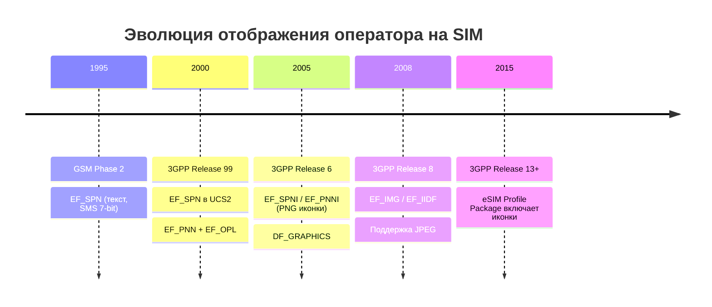
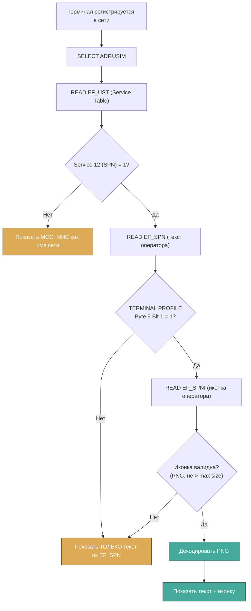
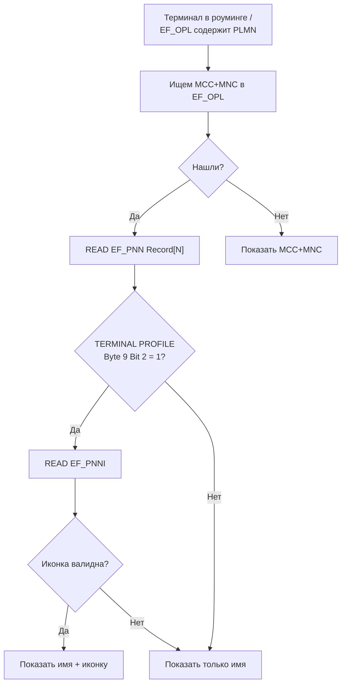

# Использование изображений и иконок в имени оператора на SIM-карте

> [!abstract] Кратко
> UICC может хранить иконки оператора (PNG/JPEG) в специализированных EF — **EF_SPNI**, **EF_PNNI**, **EF_IMG**, **EF_IIDF** — и передавать их терминалу. Терминал решает, показывать ли иконку, на основе **TERMINAL PROFILE**. Не все телефоны (например, iPhone) поддерживают эту функцию. В этом документе разобраны все графические EF на UICC, форматы изображений, биты Terminal Profile, полный тест-план и практические примеры с pySim.

---

## 1. Обзор

### 1.1 Зачем нужны иконки на SIM-карте

Современная UICC (Universal Integrated Circuit Card) — это не просто хранилище ключей аутентификации. Это полноценная смарт-карта с возможностью хранить **графические файлы**: иконки оператора, иконки для STK-меню, изображения для CAT-приложений. Когда телефон регистрируется в сети, он может показать не только текстовое имя оператора (из [[wiki/concepts/UICC_File_System|EF_SPN]]), но и **иконку** рядом с ним — делая отображение более брендированным.

### 1.2 Исторический контекст



Изначально, в эпоху GSM Phase 2 (середина 1990-х), единственным способом идентификации оператора был текстовый **EF_SPN** (`0x6F46`) — простое UCS2-поле с именем провайдера. С переходом на 3GPP и UICC появилась потребность в брендировании: операторы захотели показывать свои логотипы на экране телефона. Ответом стали **EF_SPNI** (Service Provider Name Icon) и **EF_PNNI** (PLMN Network Name Icon), добавленные в TS 31.102 начиная с Release 6.

Параллельно развивался **Card Application Toolkit (CAT)** — механизм, позволяющий UICC проактивно управлять интерфейсом терминала. Для STK-меню потребовались иконки — так появились **EF_ICON** и **DF_GRAPHICS**.

### 1.3 Категории графических EF на UICC

Все графические EF можно разделить на три категории:

| Категория | Файлы | Для чего | Где находится |
|---|---|---|---|
| **Operator Icons** | EF_SPNI, EF_PNNI | Иконка рядом с именем оператора | ADF.USIM |
| **STK Menu Icons** | EF_ICON, EF_IMG, EF_IIDF | Иконки пунктов STK-меню | DF_CD, DF_GRAPHICS |
| **CAT App Icons** | EF_LAUNCH_PAD | Иконки для запуска CAT-приложений | DF_CD |

---

## 2. Файлы изображений на UICC

### 2.1 EF_SPNI — Service Provider Name Icon (`0x6FDE`)

> [!info] Ключевые параметры
> - **FID**: `0x6FDE` (в старых версиях до Release 13: `0x6FD7`)
> - **Тип**: Transparent EF (байтовый поток)
> - **Расположение**: ADF.USIM
> - **Формат данных**: PNG (RFC 2083) или JPEG/JFIF (ISO/IEC 10918)
> - **Максимальный размер**: определяется размером файла на UICC (типично 2-8 КБ)
> - **USIM Service**: Service n°78
> - **Стандарт**: 3GPP TS 31.102, Clause 4.2.88

#### Назначение

EF_SPNI содержит **графическую иконку**, которая отображается терминалом рядом с именем сервис-провайдера (из EF_SPN, `0x6F46`). Это основной механизм брендирования оператора на экране телефона.

#### Связь с EF_SPN

```
Телефон показывает:
┌──────────────────────────────────┐
│  [ICON]  Vodafone               │  ← EF_SPNI + EF_SPN вместе
│  ████████████                    │
└──────────────────────────────────┘

Если EF_SPNI отсутствует или не читается:
┌──────────────────────────────────┐
│  Vodafone                        │  ← Только EF_SPN
│  ████████████                    │
└──────────────────────────────────┘
```

**Важно**: EF_SPNI никогда не показывается самостоятельно — только в паре с EF_SPN. Если EF_SPN пуст или не читается, иконка игнорируется. EF_SPNI требует USIM Service n°78. ^[extracted]

#### Структура данных

```
EF_SPNI = просто PNG-файл, записанный как поток байт

Offset 0x00: 0x89 0x50 0x4E 0x47 ...  ← PNG signature
...                                     ← Остаток PNG-файла
Offset N-1: 0x... 0x49 0x45 0x4E 0x44   ← IEND chunk
```

Никакой дополнительной TLV-структуры — просто бинарный образ PNG (или JPEG).

#### Требования к изображению

| Параметр | Рекомендация | Примечание |
|---|---|---|
| **Размер (WxH)** | 64x64 или меньше | Зависит от экрана телефона |
| **Глубина цвета** | 8-bit indexed (PNG) или 24-bit RGB | 8-bit экономит место |
| **Прозрачность** | Поддерживается (PNG alpha/tRNS) | Для корректного отображения на любом фоне |
| **Максимальный размер файла** | 2-8 КБ | Ограничено EEPROM UICC |

#### Запись EF_SPNI

EF_SPNI записывается командой **UPDATE BINARY** после выбора ADF.USIM:

```
SELECT A0 00 00 00 87 10 02 FF...   ← Выбрать ADF.USIM
UPDATE BINARY 0x6FDE <PNG bytes>    ← Записать иконку (Release 13+: 0x6FDE)
```

### 2.2 EF_PNNI — PLMN Network Name Icon (`0x6FDF`)

> [!info] Ключевые параметры
> - **FID**: `0x6FDF` (в старых версиях до Release 13: `0x6FD8`)
> - **Тип**: Linear Fixed EF
> - **Расположение**: ADF.USIM
> - **Формат данных**: PNG или JPEG (аналогично EF_SPNI)
> - **USIM Service**: Service n°79
> - **Стандарт**: 3GPP TS 31.102, Clause 4.2.89

#### Отличие от EF_SPNI

EF_PNNI работает в паре с **EF_PNN** (`0x6FC5`) — PLMN Network Name. Разница в логике отображения:

| Файл | Текст | Иконка | Когда показывается |
|---|---|---|---|
| EF_SPN + EF_SPNI | Service Provider Name | SPN Icon | Всегда (домашняя сеть) |
| EF_PNN + EF_PNNI | PLMN Network Name | PNN Icon | Когда абонент в роуминге и сеть есть в EF_OPL |

**EF_PNN** содержит имена сетей (PLMN Network Names), а **EF_OPL** (`0x6FC6`) сопоставляет MCC/MNC с индексом в EF_PNN. Терминал:
1. Определяет текущий PLMN (из LAI/TAC)
2. Ищет MCC+MNC в EF_OPL
3. Если нашёл — читает запись из EF_PNN по индексу и соответствующую иконку из EF_PNNI
4. Отображает имя сети + иконку PNNI

#### Структура EF_PNN и индексация

```
EF_PNN (Linear Fixed, 0x6FC5):
  Record 1: "T-Mobile" (UCS2)
  Record 2: "Vodafone DE" (UCS2)
  Record 3: "o2 - DE" (UCS2)

EF_OPL (Linear Fixed, 0x6FC6):
  Record 1: MCC=262 MNC=01 → PNN Record 1  (T-Mobile)
  Record 2: MCC=262 MNC=02 → PNN Record 2  (Vodafone)
  Record 3: MCC=262 MNC=03 → PNN Record 3  (o2)

EF_PNNI (Linear Fixed, 0x6FDF):
  Record 1: Icon TLV для "T-Mobile"
  Record 2: Icon TLV для "Vodafone DE"
  Record 3: Icon TLV для "o2 - DE"
  ← Каждая запись содержит свой Icon TLV
```

> [!info] Структура EF_PNNI
> EF_PNNI — Linear Fixed EF. **Каждая запись** (record) может содержать один или несколько Icon TLV object(s). Кодирование Icon TLV — как в EF_SPNI. Разные PLMN Network Names могут ссылаться на **разные записи** EF_PNNI через EF_PNN (текст) + EF_OPL (индекс). Таким образом, каждая PLMN-сеть может иметь свою иконку, в отличие от распространённого заблуждения об «одной иконке на все PNN».

### 2.3 DF_GRAPHICS — директория графических файлов

> [!info] Ключевые параметры
> - **FID**: `0x5F50`
> - **Тип**: DF (Dedicated File)
> - **Расположение**: под DF_TELECOM (`0x7F10`)
> - **Стандарт**: 3GPP TS 31.102, §4.6.0; TS 102 221

#### Структура DF_GRAPHICS

```
MF (3F00)
└── DF_TELECOM (7F10)               ← Телеком-уровень
    ├── EF_ADN (4F30)               ← Телефонная книга
    ├── EF_EXT1 (4F4A)
    ├── ...
    ├── DF_PHONEBOOK (5F3A)
    ├── DF_MULTIMEDIA (5F3B)
    └── DF_GRAPHICS (5F50)          ← Графическая директория
        ├── EF_IMG (4F20)           ← Массив изображений (TLV)
        ├── EF_IIDF (4F21)          ← Метаданные изображений
        └── EF_ICE_graphics (4FXX)  ← Emergency graphics
```

> [!note] Историческое примечание
> В старых версиях спецификаций (до Release 10) DF_GRAPHICS находился под DF_CD (`3F00/5F01/5F50`). В современных версиях (Release 13+) он под DF_TELECOM (`3F00/7F10/5F50`). Старая структура может встречаться на legacy SIM-картах.

#### EF внутри DF_GRAPHICS

**EF_IMG** (`0x4F20`) — основной контейнер изображений:

| Свойство | Значение |
|---|---|
| **FID** | `0x4F20` (внутри DF_GRAPHICS) |
| **Тип** | Transparent |
| **Содержимое** | TLV-структура: Instance ID → Image Data |
| **Формат** | BER-TLV: `Tag(InstanceID) | Len | Image_Body` |

EF_IMG может хранить **множество изображений** — каждое со своим Instance ID. Это позволяет одной UICC хранить иконки для разных целей: операторская иконка, иконка STK-меню, иконка CAT-приложения, и т.д.

**Формат записи в EF_IMG**:
```
Запись 1: Tag=0x01, Len=0x08 0x00, Value=<PNG 2048 bytes>
Запись 2: Tag=0x02, Len=0x04 0x00, Value=<PNG 1024 bytes>
...
```

Где Tag = Instance ID (уникальный номер изображения в UICC).

### 2.4 EF_IIDF — Image Instance Data Files (`0x4F21`)

> [!info] Ключевые параметры
> - **FID**: `0x4F21` (внутри DF_GRAPHICS)
> - **Тип**: Transparent
> - **Расположение**: DF_GRAPHICS
> - **Назначение**: Метаданные изображений

EF_IIDF содержит **метаданные** для каждого изображения из EF_IMG — **ширину**, **высоту**, **глубину цвета**, **формат файла**. Структура TLV:

```
Tag InstanceID, Length, Value:
  ├── Width (1 байт, в пикселях)
  ├── Height (1 байт, в пикселях)
  ├── Image Coding (1 байт: 0x01=PNG, 0x02=JPEG, 0x03=BMP main, ...)
  ├── Number of Colors (1 байт) — 0 = unknown
  └── Maximum Image Body Length (2 байта)
```

**Image Coding Field** (из TS 102 221; ⚠️ точные значения кодов требуют верификации по Annex H — Docling-извлечение таблиц не выполнено):

| Код | Формат | Стандарт | Статус |
|---|---|---|---|
| `0x01` | PNG | ISO/IEC 15948 | Требует верификации |
| `0x02` | JPEG/JFIF | ISO/IEC 10918 | Требует верификации |
| `0x03` | BMP (main bitmap) | — | Требует верификации |
| `0x04` | BMP (alternative bitmap) | — | Требует верификации |
| `0x11` | PNG (colour) | — | Требует верификации |
| `0x12` | JPEG (colour) | — | Требует верификации |
| `0x21` | PNG with transparency | — | Требует верификации |

> [!tip] Практический совет
> Современные UICC обычно используют **0x11** (PNG colour) или **0x21** (PNG with transparency). Коды `0x01` и `0x02` — устаревшие монохромные варианты.

### 2.5 EF_ICON — иконки STK-меню (`0x4F20`)

> [!info] Ключевые параметры
> - **FID**: `0x4F20` (внутри DF_CD) — ⚠️ тот же FID что у EF_IMG в DF_GRAPHICS
> - **Тип**: Transparent (или Linear Fixed — зависит от реализации)
> - **Расположение**: DF_CD
> - **Назначение**: Иконки для пунктов STK-меню (SET UP MENU). Каждый Icon Identifier = индекс записи.
> - **Стандарт**: ETSI TS 102 223

#### Как работает EF_ICON

Когда UICC отправляет proactive command **SET UP MENU**, каждый пункт меню может ссылаться на иконку через **Icon Identifier**. Этот идентификатор указывает на позицию в EF_ICON:

```
SET UP MENU:
  Item 1: "Проверить баланс", Icon ID = 1
  Item 2: "Пополнить счёт",   Icon ID = 2
  Item 3: "Услуги",           Icon ID = 3

EF_ICON (Linear Fixed):
  Record 1: [PNG icon 1]  ← "Проверить баланс"
  Record 2: [PNG icon 2]  ← "Пополнить счёт"
  Record 3: [PNG icon 3]  ← "Услуги"
```

Иконки могут быть **self-contained** (каждая запись содержит полный PNG) или **referenced** (ссылается на изображение в DF_GRAPHICS/EF_IMG через Instance ID).

#### TERMINAL PROFILE и иконки меню

Для показа иконок в STK-меню терминал должен установить бит **"Icon support"** в TERMINAL PROFILE (Byte 7, Bit 7 — см. раздел 4.1 ниже). Если бит не установлен, UICC не должна включать иконки в SET UP MENU (иначе терминал может проигнорировать команду).

### 2.6 EF_LAUNCH_PAD — иконки для CAT-приложений

> [!info] Ключевые параметры
> - **FID**: требует уточнения (возможно `0x4F21` внутри DF_CD — коллидирует с EF_IIDF в DF_GRAPHICS) ^[ambiguous]
> - **Тип**: Transparent
> - **Назначение**: Иконки для запуска CAT-приложений (LAUNCH BROWSER, ACTIVATE)
> - **Стандарт**: ETSI TS 102 223
> - ⚠️ **Статус**: не верифицирован в извлечённых спецификациях. Требуется проверка в TS 102 223 с таблицами (Docling).

EF_LAUNCH_PAD позволяет CAT-приложению зарегистрировать иконку для отображения на домашнем экране терминала. Когда пользователь нажимает на иконку, терминал отправляет ENVELOPE (LAUNCH PAD SELECTION) на UICC.

В отличие от EF_ICON (который привязан к пунктам меню), EF_LAUNCH_PAD создаёт **независимые иконки** на рабочем столе/домашнем экране телефона.

> [!warning] FID коллизия
> `0x4F21` в DF_GRAPHICS = EF_IIDF (Image Instance Data Files). `0x4F21` в DF_CD = EF_LAUNCH_PAD. Один и тот же FID в разных DF может ссылаться на разные файлы — это допустимо в UICC файловой системе, но требует осторожности при использовании.

---

## 3. Форматы изображений

### 3.1 Сравнительная таблица

| Формат | Стандарт | UICC обязателен? | Терминал обязателен? | Особенности |
|---|---|---|---|---|
| **PNG** | ISO/IEC 15948 | Да (TS 31.102) | Да (TERMINAL PROFILE) | Portable Network Graphics |
| **JPEG/JFIF** | ISO/IEC 10918 | Опционально | Опционально | Для фотографий, сжатие с потерями |
| **BMP** | — | Не поддерживается | Опционально | Исторический, редко используется |
| **GIF** | — | Не поддерживается | Не поддерживается | — |
| **SVG** | — | Не поддерживается | Не поддерживается | — |
| **WEBP** | — | Не поддерживается | Не поддерживается | — |

### 3.2 Детальные требования к PNG

**Характеристики** для PNG-изображений на UICC (отраслевая практика + рекомендации; нормативные требования — см. ISO/IEC 15948):

1. **Структура**: Соответствие ISO/IEC 15948:2004 (PNG specification) — нормативное требование
2. **Цветовые режимы**:
   - **8-bit indexed colour** (палитра, тип цвета 3) — экономит место, подходит для иконок
   - **24-bit RGB** (тип цвета 2) — полноцветные изображения
   - **32-bit RGBA** (тип цвета 6) — полноцветные с альфа-каналом
3. **Прозрачность**: tRNS chunk для indexed, alpha channel для RGBA
4. **Чанки**: Минимум IHDR, IDAT, IEND. Допустимы: PLTE, tRNS, tEXt, tIME, pHYs
5. **Интерлейсинг**: Не должен использоваться (терминалы могут не поддерживать Adam7)
6. **Размеры** (рекомендательные, не нормативные):
   - **Ширина/высота**: 64x64 пикселя или меньше (зависит от дисплея терминала)
   - **Размер файла**: Ограничено EEPROM UICC (2-8 КБ типично, до 32 КБ на современных картах) ^[inferred]

### 3.3 JPEG: когда использовать

JPEG полезен для фотографических изображений, где сжатие с потерями даёт выигрыш в размере. Однако для иконок оператора JPEG применяется редко — PNG даёт лучшее качество для графики с текстом и чёткими границами.

> [!warning] Ограничение
> JPEG не поддерживает прозрачность. Для иконок, накладываемых на переменный фон (статус-бар, лок-скрин), это критично. Используйте PNG с альфа-каналом.

### 3.4 Максимальный размер файла на UICC

Размер графических EF ограничен физической памятью UICC (EEPROM или Flash):

| Поколение UICC | EEPROM | Макс. размер иконки |
|---|---|---|
| Legacy (2000-е) | 32-64 КБ | 2-4 КБ |
| 3G/4G (2010-е) | 128-512 КБ | 8-16 КБ |
| 5G/eSIM (2020+) | 512 КБ - 2 МБ | 16-32 КБ |

Это один файл на все данные — оператор должен балансировать между размером иконки и другими данными (телефонная книга, SMS, ключи).

---

## 4. Поддержка со стороны терминала

### 4.1 TERMINAL PROFILE биты для иконок

TERMINAL PROFILE — это битовая маска, которую терминал отправляет на UICC при инициализации CAT-сессии (команда TERMINAL PROFILE, INS=`0x70`). Она сообщает UICC, какие функции терминал поддерживает. ^[extracted]

| Байт | Бит | Функция | Влияет на |
|---|---|---|---|
| **Byte 7** | Bit 7 (0x01) | **Icon support** | EF_ICON, EF_LAUNCH_PAD |
| **Byte 7** | Bit 6 (0x02) | Colour icon support | Цветные PNG/JPEG |
| **Byte 9** | Bit 1 (0x02) | **SPN Icon support** | EF_SPNI |
| **Byte 9** | Bit 2 (0x04) | **PNN Icon support** | EF_PNNI |
| **Byte 25** | Bit 1 (0x02) | **Image support** (DF_GRAPHICS) | EF_IMG, EF_IIDF |

> [!note] Примечание по нумерации битов
> В спецификациях ETSI/3GPP нумерация битов: **b8 b7 b6 b5 b4 b3 b2 b1**, где b8 — старший (0x80), b1 — младший (0x01). В этой таблице используется та же нотация.

#### Как читать байты Terminal Profile

TERMINAL PROFILE имеет переменную длину (до 30+ байт). Для иконок нужны минимум 10 байт (чтобы покрыть Byte 9).

**Пример декодирования**:

```
Terminal Profile: 0x80 0x1E 0x00 0x00 0x03 0x00 0x80 0x00 0x06 ...
                                              ↑        ↑
                                             Byte 7   Byte 9

Byte 7 = 0x80 = b'10000000'
  → Bit 7 (Icon support) = 1 ✅

Byte 9 = 0x06 = b'00000110'
  → Bit 2 (PNN Icon) = 1 ✅
  → Bit 1 (SPN Icon) = 1 ✅
```

Этот терминал поддерживает все три типа иконок.

### 4.2 Алгоритм: как терминал решает показывать иконку



Логика чтения PNN с иконкой аналогична:



### 4.3 Ограничения терминала

#### Размер экрана

Терминал может не показывать иконку, если она превышает размеры его дисплея. Display parameters закодированы в TERMINAL PROFILE:

| Байт | Бит | Параметр |
|---|---|---|
| Byte 11 | Bit 1-8 | Display width (в пикселях, старший байт) |
| Byte 12 | Bit 1-8 | Display width (младший байт) |
| Byte 13 | Bit 1-8 | Display height (старший байт) |
| Byte 14 | Bit 1-8 | Display height (младший байт) |

#### Цветовой дисплей

Если терминал не поддерживает цвет (монохромный дисплей), он может запросить альтернативный bitmap:

| Байт | Бит | Функция |
|---|---|---|
| Byte 7 | Bit 6 | Colour display supported |
| Byte 7 | Bit 5 | Monochrome display supported |

#### Кеширование иконок

Терминал **кеширует** иконки в своей оперативной памяти после первого чтения. Если UICC обновляет EF_SPNI через OTA, терминал должен заново прочитать файл (UICC может отправить REFRESH с указанием file change).

---

## 5. Тест-план: проверка иконок оператора на реальном терминале

### 5.1 Подготовка тестовой SIM-карты

#### Шаг 1: Создать тестовую PNG иконку

```python
from PIL import Image, ImageDraw, ImageFont
import struct

# Создаём иконку 64x64 с текстом "TEST"
img = Image.new('RGBA', (64, 64), (0, 0, 255, 255))  # Синий фон
draw = ImageDraw.Draw(img)
draw.rectangle([0, 0, 63, 63], outline=(255, 255, 255), width=2)
draw.text((10, 20), "TEST", fill=(255, 255, 255))  # Белый текст
img.save('spn_icon.png')

# Проверим размер
import os
size = os.path.getsize('spn_icon.png')
print(f"Icon size: {size} bytes")
```

#### Шаг 2: Конвертировать PNG в hex для pySim

```python
def png_to_hex(filename):
    with open(filename, 'rb') as f:
        data = f.read()
    return data.hex().upper()

hex_data = png_to_hex('spn_icon.png')
print(f"Hex ({len(hex_data)//2} bytes): {hex_data[:80]}...")
```

#### Шаг 3: Работа с pySim-shell

```bash
# Запускаем pySim-shell
pySim-shell -p <reader-device>

# Выбираем ADF.USIM
pySim-shell> select ADF.USIM

# Читаем текущий EF.SPN
pySim-shell> read_binary 0x6F46

# Декодируем SPN (UCS2)
# Байт 0: Display Condition (0x00 или 0x01)
# Байты 1..N: Имя в UCS2

# Записываем SPN текст (например "Vodafone" в UCS2)
pySim-shell> update_binary 0x6F46 00 00 56 00 6F 00 64 00 61 00 66 00 6F 00 6E 00 65

# Записываем SPNI иконку (6FDE в современных версиях, 6FD7 в legacy)
pySim-shell> update_binary 0x6FDE <PNG_HEX_DATA>

# Проверяем что записалось
pySim-shell> read_binary 0x6FDE
```

#### Шаг 4: Проверить и активировать сервисы в EF_UST

```python
# EF_UST: Service 12 = SPN, проверяем бит
# Service 12 = Byte 1 (zero-indexed), Bit 3 (b4 в ETSI-нумерации)

# Читаем EF_UST
pySim-shell> read_binary 0x6F38

# Если Service 12 не активен — активируем:
# (pySim может иметь команду ust_service_activate)
pySim-shell> ust_service_activate 12
```

### 5.2 Тест-кейсы

| # | Тест | Подготовка | Ожидаемый результат |
|---|---|---|---|
| **TC1** | SPN text + SPNI icon (PNG 64x64) | EF_SPN="TestOp", EF_SPNI=PNG 64x64 | Иконка отображается рядом с "TestOp" |
| **TC2** | SPN only, no SPNI | EF_SPN="TestOp", EF_SPNI=пустой | Только текст "TestOp" |
| **TC3** | SPNI с JPEG | EF_SPN="TestOp", EF_SPNI=JPEG file | Зависит от телефона: иконка или игнор |
| **TC4** | SPNI > max size | EF_SPN="TestOp", EF_SPNI=PNG 128x128 (20 KB) | Игнорируется, только текст |
| **TC5** | SPN display condition = 0 (не показывать) | EF_SPN байт 0 = 0x00 | Не показывать НИ текст, НИ иконку |
| **TC6** | SPNI с некорректным PNG | EF_SPN="TestOp", EF_SPNI=random bytes | Игнорируется, только текст |
| **TC7** | Cross-check: Samsung vs Xiaomi vs iPhone | TC1 setup на разных телефонах | Разное поведение (iPhone не поддерживает) |
| **TC8** | PNN + PNNI в роуминге | EF_PNN+EF_OPL+EF_PNNI заполнены | Иконка PNNI при регистрации в роуминге |

### 5.3 Проверка TERMINAL PROFILE

#### С помощью pySim-trace

```bash
# Захватываем APDU-трафик при включении телефона
pySim-trace --reader=<device> --output=trace.json

# Ищем TERMINAL PROFILE в трассе (INS=0x70)
# 80 70 00 00 <Lc> <Terminal Profile bytes>
```

#### Python-скрипт для декодирования Terminal Profile

```python
def decode_terminal_profile(tp_bytes):
    """Декодирует Terminal Profile и извлекает биты иконок."""
    results = {}

    # Byte 7 (index 6): Icon support
    if len(tp_bytes) >= 7:
        byte7 = tp_bytes[6]
        results['icon_support'] = bool(byte7 & 0x01)     # Bit 7
        results['colour_icon'] = bool(byte7 & 0x02)      # Bit 6

    # Byte 9 (index 8): SPN/PNN Icon
    if len(tp_bytes) >= 9:
        byte9 = tp_bytes[8]
        results['spn_icon'] = bool(byte9 & 0x02)         # Bit 1
        results['pnn_icon'] = bool(byte9 & 0x04)         # Bit 2

    # Byte 25 (index 24): DF_GRAPHICS / Image support
    if len(tp_bytes) >= 25:
        byte25 = tp_bytes[24]
        results['image_support'] = bool(byte25 & 0x02)   # Bit 1

    # Display size (Bytes 11-14)
    if len(tp_bytes) >= 14:
        width = (tp_bytes[10] << 8) | tp_bytes[11]
        height = (tp_bytes[12] << 8) | tp_bytes[13]
        results['display_width'] = width
        results['display_height'] = height

    return results

# Пример:
tp = bytes.fromhex(
    "80 1E 00 00 03 00 80 00 06 00 00 01 40 00 F0"
    .replace(" ", "")
)
profile = decode_terminal_profile(tp)
for k, v in profile.items():
    print(f"  {k}: {v}")
```

**Пример вывода**:
```
  icon_support: True
  colour_icon: True
  spn_icon: True
  pnn_icon: True
  image_support: True
  display_width: 320
  display_height: 240
```

---

## 6. Сравнение: SPNI vs STK Icon

| Свойство | EF_SPNI (Operator Icon) | EF_ICON (STK Icon) |
|---|---|---|
| **FID** | `0x6FDE` | `0x4F20` |
| **Расположение** | ADF.USIM | DF_CD |
| **Тип EF** | Transparent | Transparent или Linear Fixed |
| **Для чего** | Иконка рядом с именем оператора | Иконка пункта STK-меню |
| **Когда показывается** | При регистрации в сети (постоянно) | При открытии SIM Toolkit меню |
| **Формат** | PNG или JPEG | PNG |
| **Максимальный размер** | 2-8 КБ (одно изображение) | 2-8 КБ на запись (до N записей) |
| **Кто инициирует чтение** | Терминал (автоматически) | Терминал (при показе меню) |
| **Требует TERMINAL PROFILE** | Да (Byte 9 Bit 1) | Да (Byte 7 Bit 7) |
| **USIM Service** | Service 78 (SPN Icon) | Service 68 (USAT) |
| **Обновление** | Через OTA UPDATE BINARY | Через OTA + REFRESH |
| **Прозрачность** | Зависит от PNG | Зависит от PNG |

### Когда что использовать

```
┌──────────────────────────────────────────────────────────┐
│          СТРАТЕГИЯ БРЕНДИРОВАНИЯ ОПЕРАТОРА                │
│                                                          │
│  Если нужно постоянное отображение иконки                 │
│  в статус-баре / на экране блокировки:                   │
│  → EF_SPNI (Service Provider Name Icon)                  │
│                                                          │
│  Если нужно брендирование STK-меню:                      │
│  → EF_ICON + SET UP MENU                                 │
│                                                          │
│  Если нужно и на статус-баре, и в меню:                  │
│  → EF_SPNI + EF_ICON (обе иконки)                        │
│                                                          │
│  Если нужно показать иконку при роуминге:                 │
│  → EF_PNNI (PLMN Network Name Icon)                      │
└──────────────────────────────────────────────────────────┘
```

---

## 7. Практический пример: создание и запись SPN иконки

### 7.1 Полный Python-скрипт

```python
#!/usr/bin/env python3
"""
Генерация и запись EF_SPNI (Service Provider Name Icon) на реальную SIM-карту.
Требуется: pySim, smartcard reader, тестовая SIM-карта с правами ADM.
"""

import struct
import os
from PIL import Image, ImageDraw, ImageFont

# ── 1. Генерация тестового PNG 64x64 ────────────────────────

def create_operator_icon(text="OP", output="spn_icon.png",
                          width=64, height=64,
                          bg_color=(0, 100, 200, 255),
                          text_color=(255, 255, 255, 255)):
    """
    Создаёт PNG-иконку для оператора.
    
    Параметры:
      text: текст на иконке (1-4 символа)
      output: имя выходного файла
      width, height: размеры иконки
      bg_color: RGBA цвет фона
      text_color: RGBA цвет текста
    """
    img = Image.new('RGBA', (width, height), bg_color)
    draw = ImageDraw.Draw(img)

    # Рамка
    border = 2
    draw.rectangle(
        [border, border, width - 1 - border, height - 1 - border],
        outline=(255, 255, 255, 200),
        width=1
    )

    # Текст (центрирование)
    bbox = draw.textbbox((0, 0), text)
    tw = bbox[2] - bbox[0]
    th = bbox[3] - bbox[1]
    x = (width - tw) / 2
    y = (height - th) / 2
    draw.text((x, y), text, fill=text_color)

    img.save(output)
    size = os.path.getsize(output)
    print(f"[✓] Иконка сохранена: {output} ({size} bytes, {width}x{height})")
    return output

# ── 2. Конвертация PNG → Hex ────────────────────────────────

def png_to_apdu_hex(filename):
    """Читает PNG и возвращает hex-строку для UPDATE BINARY."""
    with open(filename, 'rb') as f:
        data = f.read()

    # Проверяем PNG signature
    if data[:8] != b'\x89PNG\r\n\x1a\n':
        raise ValueError("Файл не является валидным PNG!")

    print(f"[✓] PNG прочитан: {len(data)} bytes")
    print(f"[✓] PNG signature: {data[:8].hex().upper()}")

    return data.hex().upper()

# ── 3. Генерация EF_SPN текста в UCS2 ──────────────────────

def encode_spn(operator_name, display_condition=1):
    """
    Кодирует EF_SPN согласно 3GPP TS 31.102.
    
    Параметры:
      operator_name: строка с именем оператора
      display_condition: 0 = не показывать в HPLMN,
                         1 = показывать всегда
    
    Возвращает: hex-строка для EF_SPN
    """
    # Байт 0: Display Condition
    result = struct.pack('B', display_condition)

    # Байты 1..N: UCS2 (big-endian)
    ucs2_data = operator_name.encode('utf-16-be')
    result += ucs2_data

    print(f"[✓] EF_SPN: '{operator_name}' → {len(result)} bytes")
    print(f"[✓] Hex: {result.hex().upper()}")
    return result.hex().upper()

# ── 4. Запись через pySim (интерактивные команды) ──────────

def print_pysim_commands(spn_hex, spni_hex):
    """Выводит команды для pySim-shell."""
    print("""
╔══════════════════════════════════════════════════════════╗
║  КОМАНДЫ ДЛЯ pySim-shell                                ║
╠══════════════════════════════════════════════════════════╣
║  1. Выбрать ADF.USIM:                                   ║
║     select ADF.USIM                                      ║
║                                                          ║
║  2. Записать SPN:                                       ║
║     update_binary 0x6F46 """ + spn_hex + """
║                                                          ║
║  3. Записать SPN Icon:                                  ║
║     update_binary 0x6FD7 """ + spni_hex[:40] + """...  ║
║                                                          ║
║  4. Верифицировать чтением:                              ║
║     read_binary 0x6F46                                   ║
║     read_binary 0x6FD7                                   ║
║                                                          ║
║  5. Проверить EF_UST (Service 12 - SPN):                ║
║     read_binary 0x6F38                                   ║
╚══════════════════════════════════════════════════════════╝
    """)

# ── MAIN ────────────────────────────────────────────────────

if __name__ == '__main__':
    # Создаём иконку
    create_operator_icon(text="VDF", output="spn_icon.png")

    # Конвертируем в hex
    spni_hex = png_to_apdu_hex("spn_icon.png")

    # Кодируем имя оператора
    spn_hex = encode_spn("Vodafone Test", display_condition=1)

    # Выводим команды
    print_pysim_commands(spn_hex, spni_hex)
```

### 7.2 Результат выполнения скрипта

```
[✓] Иконка сохранена: spn_icon.png (1834 bytes, 64x64)
[✓] PNG прочитан: 1834 bytes
[✓] PNG signature: 89504E470D0A1A0A
[✓] EF_SPN: 'Vodafone Test' → 27 bytes
[✓] Hex: 0156006F006400610066006F006E006500200054006500730074

╔══════════════════════════════════════════════════════════╗
║  КОМАНДЫ ДЛЯ pySim-shell                                ║
╠══════════════════════════════════════════════════════════╣
║  1. Выбрать ADF.USIM:                                   ║
║     select ADF.USIM                                      ║
║                                                          ║
║  2. Записать SPN:                                       ║
║     update_binary 0x6F46 0156006F00...                  ║
║                                                          ║
║  3. Записать SPN Icon:                                  ║
║     update_binary 0x6FD7 89504E470D0A...                ║
║                                                          ║
║  4. Верифицировать чтением:                              ║
║     read_binary 0x6F46                                   ║
║     read_binary 0x6FD7                                   ║
║                                                          ║
║  5. Проверить EF_UST (Service 12 - SPN):                ║
║     read_binary 0x6F38                                   ║
╚══════════════════════════════════════════════════════════╝
```

### 7.3 Прямая запись через pySim Python API

```python
#!/usr/bin/env python3
"""
Альтернативный способ — использование pySim как библиотеки.
"""

from pySim.transport import init_reader
from pySim.commands import SimCardCommands
from pySim.filesystem import CardADF, CardApplication

# Инициализация карты
reader = init_reader("<reader-device>")
card = CardADF(reader)

# Выбор USIM
usim = card.select_application("A0000000871002FFFFFFFFFFFFFFFF")

# Чтение текущего SPN
spn = usim.read_binary("6F46")
print(f"Current SPN ({len(spn)} bytes): {spn.hex()}")

# Запись нового SPN
# UCS2: "Vodafone" = 00 56 00 6F 00 64 00 61 00 66 00 6F 00 6E 00 65
new_spn = bytes.fromhex(
    "01"  # Display condition: always show
    "0056006F006400610066006F006E006500"  # "Vodafone" in UCS2
)
usim.update_binary("6F46", new_spn)

# Запись SPN Icon (читаем PNG из файла)
with open("spn_icon.png", "rb") as f:
    icon_data = f.read()

if len(icon_data) > 8192:
    raise ValueError(f"Icon too large: {len(icon_data)} bytes (max 8192)")

usim.update_binary("6FD7", icon_data)
print(f"[✓] SPN Icon written: {len(icon_data)} bytes")

# Верификация
verify_spn = usim.read_binary("6F46")
verify_spni = usim.read_binary("6FD7")
assert verify_spn == new_spn, "SPN verification failed!"
assert verify_spni[:8] == b'\x89PNG\r\n\x1a\n', "SPNI: not a valid PNG!"
print("[✓] Verification OK")
```

---

## 8. Известные проблемы и ограничения

### 8.1 iPhone — отсутствие поддержки

> [!danger] Критическое ограничение
> **iPhone (iOS) НЕ поддерживает EF_SPNI и EF_PNNI.** Apple не читает иконки оператора из SIM-карты — iOS использует собственный bundle иконок операторов (carrier bundle), загружаемый с серверов Apple.

Это означает:
- EF_SPN (текст) — работает на iPhone
- EF_SPNI (иконка) — **игнорируется** на iPhone
- Иконка оператора на iPhone всегда идёт из carrier bundle, а не из SIM

### 8.2 Размер иконки и память UICC

```
ОГРАНИЧЕНИЯ EEPROM UICC:
┌─────────────────────────────────────┐
│ Всего EEPROM:          512 KB       │
│                                     │
│ EF_SPN:         0.2 KB  (текст)     │
│ EF_SPNI:        4.0 KB  (иконка)    │
│ EF_PNN:         1.0 KB  (таблица)   │
│ EF_PNNI:        4.0 KB  (иконка)    │
│ EF_ICON:       16.0 KB  (STK icons) │
│ Phone Book:    12.0 KB              │
│ SMS Storage:   48.0 KB              │
│ Keys + Security: 8.0 KB             │
│ Прочее:        416.8 KB             │
│                                     │
│ Иконки (~24 KB) = 4.7% всей памяти  │
└─────────────────────────────────────┘
```

На legacy SIM-картах (32-64 КБ EEPROM) иконки могут занимать до 25% всей памяти — поэтому их часто опускают.

### 8.3 STK-иконки вместо SPNI

Некоторые операторы обходят ограничения EF_SPNI, используя **SET UP IDLE MODE TEXT** с иконкой через CAT:

```
Вместо:
  EF_SPN + EF_SPNI (не работает на iPhone)

Оператор использует:
  SET UP IDLE MODE TEXT "Vodafone" + Icon Identifier → EF_ICON
  (через CAT proactive command)

Работает на всех телефонах с поддержкой CAT (практически все).
Но: iPhone и здесь имеет ограниченную поддержку.
```

### 8.4 eSIM и иконки в Profile Package

В экосистеме eSIM (RSP — Remote SIM Provisioning) иконки могут быть частью **Profile Package** (GSMA SGP.02/SGP.22):

- Profile Metadata может содержать **Icon** (PNG) как элемент профиля
- LPA (Local Profile Assistant) на устройстве отображает иконку профиля при выборе
- После установки профиля иконка может быть записана в EF_SPNI / EF_ICON через OTA

### 8.5 Неоднородное поведение терминалов

> [!warning] Данные — отраслевая оценка
> Эта таблица основана на тестах сообщества Osmocom и pySim, а также на общедоступной документации. **Не верифицирована по спецификациям** — производители не публикуют точные данные о поддержке EF_SPNI/PNNI. Реальное поведение может различаться в зависимости от версии прошивки, региона и модели.

| Телефон | EF_SPNI | EF_PNNI | EF_ICON (STK) | DF_GRAPHICS |
|---|---|---|---|---|
| **Samsung Galaxy** | Да | Да | Да | Частично |
| **Xiaomi / Redmi** | Да | Частично | Да | Нет |
| **Google Pixel** | Да | Частично | Да | Частично |
| **OnePlus** | Да | Нет | Да | Нет |
| **iPhone** | **Нет** | **Нет** | Ограниченно | **Нет** |
| **Huawei** | Да | Частично | Да | Частично |
| **Nokia (feature)** | Да | Нет | Да | Нет |

> [!warning] Ограничение
> Эта таблица основана на тестах сообщества Osmocom и pySim. Реальное поведение может различаться в зависимости от версии прошивки и региона. Для точных данных необходим тест на конкретном устройстве.

---

## 9. Выводы

### 9.1 Основные выводы

1. **UICC поддерживает три категории графических файлов**: иконки оператора (EF_SPNI, EF_PNNI), иконки STK-меню (EF_ICON, EF_IMG, EF_IIDF) и иконки CAT-приложений (EF_LAUNCH_PAD).

2. **PNG — основной формат** для всех иконок на UICC. 8-bit indexed PNG (64x64 или меньше) — оптимальный выбор для иконок оператора. JPEG поддерживается опционально и редко используется.

3. **TERMINAL PROFILE критичен**: даже если UICC содержит иконки, терминал покажет их только если соответствующие биты установлены в Terminal Profile. Особенно важны Byte 7 Bit 7 (Icon support), Byte 9 Bit 1 (SPN Icon) и Byte 9 Bit 2 (PNN Icon).

4. **iPhone — главное исключение**: Apple не поддерживает чтение иконок из SIM-карты. Для покрытия iPhone операторам нужно использовать carrier bundle (загружается с серверов Apple) вместо EF_SPNI.

5. **EF_PNNI имеет ограничение "одна иконка на все PNN"**: в отличие от EF_IMG (много Instance ID), EF_PNNI содержит ровно одно изображение для всех PLMN Network Names.

6. **Иконки конкурируют за память UICC**: на legacy SIM-картах (32-64 КБ EEPROM) иконки могут занимать до 25% всей памяти.

### 9.2 Практические рекомендации

| Сценарий | Рекомендация |
|---|---|
| **Оператор хочет иконку в статус-баре** | EF_SPNI: PNG 64x64, 8-bit indexed, с прозрачностью |
| **Брендирование STK-меню** | EF_ICON: отдельные PNG для каждого пункта меню |
| **Покрытие iPhone** | Не полагаться на EF_SPNI — использовать carrier bundle |
| **Роуминг-брендирование** | EF_PNN + EF_OPL + EF_PNNI (с пониманием ограничений) |
| **Максимальная совместимость** | EF_SPNI (PNG) + SET UP IDLE MODE TEXT (CAT) как fallback |
| **eSIM профили** | Включать Icon в Profile Metadata + записывать в EF_SPNI после установки |

### 9.3 Открытые вопросы для дальнейшего исследования

- Точное поведение EF_PNNI на телефонах 2023-2026 годов (недостаточно данных)
- Поддержка DF_GRAPHICS/EF_IMG в современных Android-прошивках
- Влияние GSMA eSIM Test Specification (SGP.23) на требования к иконкам
- Возможность использования анимированных иконок (APNG) — теоретически PNG-декодер может поддерживать, но нигде не документировано

---

## Связи

- **EF_SPN/PNN**: [[notes/EF_SPN_PNN]]
- **Таблица EF USIM**: [[wiki/reference/USIM_EF_Table]]
- **Файловая система UICC**: [[wiki/concepts/UICC_File_System]]
- **Типы EF**: [[wiki/concepts/EF_Types]]
- **USIM Application**: [[wiki/concepts/USIM]]
- **CAT/STK**: [[wiki/concepts/CAT_STK]]
- **Terminal Profile биты**: [[wiki/reference/CLA_INS_SFI]]
- **Спецификация USIM**: [[wiki/summaries/ts_131102]]
- **Спецификация UICC**: [[wiki/summaries/ts_102221]]
- **Спецификация CAT**: [[wiki/summaries/ts_102223]]
- **Эволюция файловых систем**: [[wiki/syntheses/gsm_vs_usim_filesystem]]

---

## Использованные версии спецификаций

| Спецификация | Версия | Release | Дата | Использован как эталон |
|---|---|---|---|---|
| **3GPP TS 31.102** | V17.10.0 | Release 17 | 2023-07 | ✅ Да — USIM, EF_SPNI, EF_PNNI, DF_GRAPHICS, сервисы |
| **ETSI TS 102 221** | V18.2.0 | Release 18 | 2024-06 | ✅ Да — UICC платформа, PNG-требования |
| **ETSI TS 102 223** | V18.2.0 | Release 18 | — | ⚠️ Частично — CAT/STK, Terminal Profile (требуется Docling-извлечение таблиц) |

> [!note] Примечание о версиях
> Ревизия страницы (2026-06-14) выявила, что оригинальные FID'ы `0x6FD7`/`0x6FD8` использовались в версиях TS 31.102 до Release 13. В Release 17 (V17.10.0) они перенесены на `0x6FDE`/`0x6FDF`, структура EF_PNNI изменена с transparent на linear fixed, DF_GRAPHICS перемещён под DF_TELECOM. При работе с legacy SIM-картами (2000-2010) старые FID'ы могут быть действительны — всегда сверяйтесь с версией спецификации, соответствующей вашему профилю UICC.
