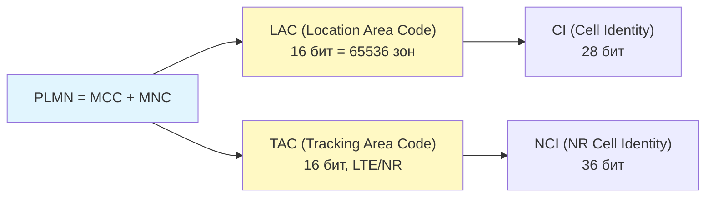
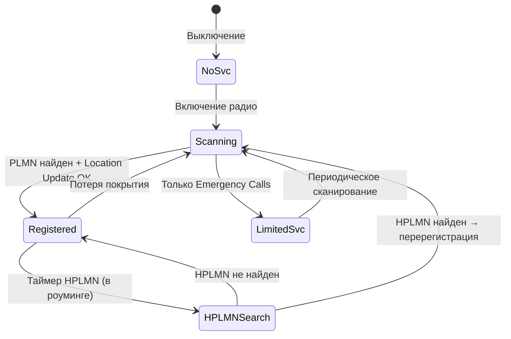
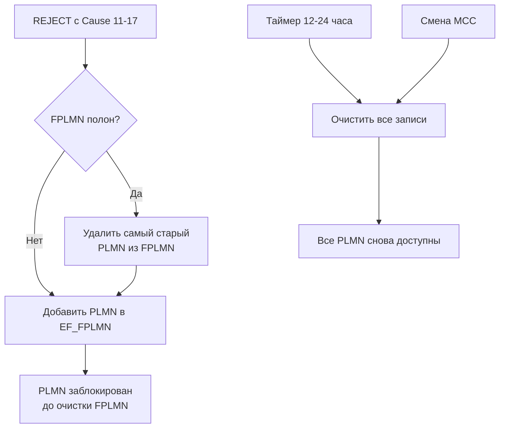
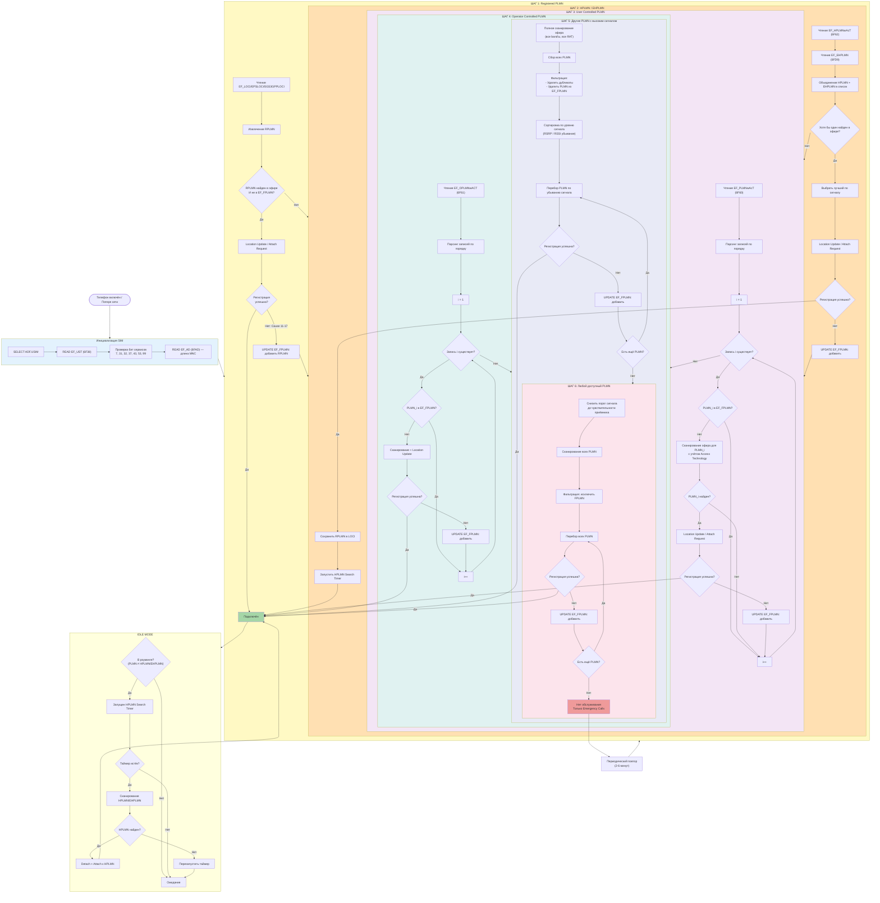

---
tags:
  - research
  - PLMN
  - network-selection
  - SIM
  - UICC
  - USIM
  - roaming
  - 3GPP
  - EF
  - algorithm
type: research
level: advanced
created: 2026-06-12
updated: 2026-06-12
status: reviewed
sources:
  - "[[wiki/syntheses/sim_files_plmn]]"
  - "[[wiki/concepts/USIM]]"
  - "[[wiki/concepts/UICC_File_System]]"
  - "[[wiki/syntheses/sim_files_service_table]]"
  - "[[wiki/concepts/5G_Core]]"
  - "[[wiki/summaries/ts_131102]]"
  - "[[wiki/reference/USIM_EF_Table]]"
  - "[[wiki/concepts/EF_Types]]"
  - "[[wiki/syntheses/gsm_vs_usim_filesystem]]"
---

# PLMN Selection Algorithm: Полный алгоритм от SIM к сети

> **Research** — исчерпывающий разбор механизма выбора сети: от битов на SIM-карте до регистрации в соте. Каждый EF, каждая ветка алгоритма, каждый hex-дамп.

---

## 1. Обзор PLMN Selection

### 1.1 Что такое PLMN

**PLMN** (Public Land Mobile Network) — это сеть мобильной связи общего пользования, идентифицируемая комбинацией **MCC + MNC**:

```
PLMN = MCC (3 цифры) + MNC (2 или 3 цифры)

Примеры:
  ┌──────────┬─────────┬────────────────────────┐
  │   PLMN   │ Страна  │ Оператор               │
  ├──────────┼─────────┼────────────────────────┤
  │  250 01  │ Россия  │ МТС                    │
  │  250 02  │ Россия  │ МегаФон                │
  │  250 99  │ Россия  │ Билайн                 │
  │  262 01  │ Германия│ Deutsche Telekom       │
  │  262 02  │ Германия│ Vodafone DE            │
  │  222 01  │ Италия  │ TIM                    │
  │  222 10  │ Италия  │ Vodafone IT            │
  └──────────┴─────────┴────────────────────────┘
```

**MCC** (Mobile Country Code) — 3-значный код страны (например, 250 = Россия, 262 = Германия, 222 = Италия), закреплён ITU-T Recommendation E.212.

**MNC** (Mobile Network Code) — 2 или 3 цифры, идентифицирующие конкретного оператора внутри страны. Длина MNC определяется в EF_AD (Administrative Data) и обычно составляет 2 цифры в Европе и 3 цифры в Северной Америке.



Глобальная идентификация соты:
- **2G/3G (GSM/UMTS)**: CGI = MCC-MNC-LAC-CI (Location Area Identity + Cell Identity)
- **4G (LTE)**: ECGI = MCC-MNC + ECI (28 бит: eNB-ID + Cell ID)
- **5G (NR)**: NCGI = MCC-MNC + NR Cell Identity (36 бит: gNB-ID + Cell ID)

### 1.2 Почему SIM управляет выбором сети

Выбор сети — функция, разделённая между **ME (Mobile Equipment)** и **UICC (SIM-картой)**:

```
┌──────────────────────────────────────────────────────────┐
│                    РАЗДЕЛЕНИЕ ОТВЕТСТВЕННОСТИ             │
├──────────────────┬───────────────────────────────────────┤
│ ME (телефон)     │ UICC (SIM)                            │
├──────────────────┼───────────────────────────────────────┤
│ Сканирует эфир   │ Хранит списки PLMN (EF_PLMNwAcT, ...)│
│ Измеряет RSSI    │ Хранит HPLMN (домашняя сеть)          │
│ Декодирует MIB   │ Хранит FPLMN (запрещённые сети)       │
│ Выполняет AKA    │ Хранит таймер поиска HPLMN            │
│ Отправляет       │ Хранит LOCI (последнюю локацию)       │
│   Location       │ Обновляется через OTA (Steer of       │
│   Update Request │   Roaming)                            │
│ Показывает список│ Определяет политику (operator PLMN)   │
│   сетей при руч. │                                       │
│   выборе         │                                       │
└──────────────────┴───────────────────────────────────────┘
```

Такое разделение даёт оператору контроль над роуминг-политикой: SIM-карта, прошитая оператором, содержит предпочтительных роуминг-партнёров (EF_OPLMNwACT), которых телефон обязан соблюдать.

### 1.3 Automatic vs Manual PLMN Selection

3GPP TS 23.122 определяет два режима:

| Режим | Поведение |
|---|---|
| **Automatic** | Телефон сам выбирает сеть по алгоритму (раздел 3), без участия пользователя |
| **Manual** | Телефон сканирует эфир, показывает список найденных PLMN, пользователь выбирает (раздел 4) |

> [!note] Режим по умолчанию
> Большинство телефонов поставляются с режимом Automatic. Пользователь может переключиться в Manual через меню «Настройки → Мобильная сеть → Выбор оператора».

При потере сети (lost coverage) телефон всегда перезапускает процедуру выбора PLMN — даже если пользователь вручную выбрал Manual-режим ранее.

### 1.4 Состояния PLMN selection

Конечный автомат выбора сети:



---

## 2. Все EF, участвующие в выборе PLMN

Каждый участвующий в выборе сети файл на SIM-карте разобран здесь с уровнем детализации, значительно превосходящим synthesis [[wiki/syntheses/sim_files_plmn|sim_files_plmn]].

### 2.1 EF_PLMNwAcT (6F60) — User Controlled PLMN Selector with Access Technology

| Свойство | Значение |
|---|---|
| **FID** | `0x6F60` |
| **Расположение** | ADF.USIM |
| **Тип** | Transparent EF |
| **Размер** | n x 5 байт, минимум 45 байт (9 записей), рекомендуется n >= 12 |
| **Access Conditions** | READ: PIN, UPDATE: PIN |
| **Сервис UST** | Service 31, бит = 1 |
| **Стандарт** | 3GPP TS 31.102, Clause 4.2.53 |

**Назначение**: список PLMN в порядке предпочтения, определяемый **пользователем** через меню телефона. Это единственный PLMN-файл, который пользователь может редактировать без ADM-доступа.

**Формат записи** (5 байт на PLMN):

```
Байты 0-2: PLMN (MCC + MNC) в BCD, reverse nibble
Байты 3-4: Access Technology Identifier (битовая маска)

Структура:
┌──────────┬──────────┬──────────┬───────────────────────┐
│  Byte 0  │  Byte 1  │  Byte 2  │   Byte 3   │  Byte 4 │
│ MCC2│MCC1│ MNC1│MCC3│ MNC3│MNC2│  AcT bytes (16 bits) │
│ (BCD, reverse nibble)   │ (BCD) │  битовая маска       │
└──────────┴──────────┴──────────┴───────────────────────┘
```

**Пример hex-дампа** (3 сети: МТС, МегаФон, Билайн):

```
Offset  0  1  2  3  4  5  6  7  8  9  A  B  C  D  E  F
------+------------------------------------------------+-----------------
0x0000 |25 10 F0 80 00|05 20 F0 40 00|95 20 F0 40 00|...  | Пользовательский
       | МТС +5G      | МегаФон +4G  | Билайн +4G    |     | список PLMN
       | 250 01       | 250 02       | 250 99        |     |

Разбор 250 01 (МТС):
  Byte 0: 0x25 → MCC2=2, MCC1=5? Нет: BCD reverse nibble:
    Nibble hi (MCC_2) = 2, Nibble lo (MCC_1) = 5 → MCC = 250...
    Стоп. BCD reverse nibble означает:
    Byte 0: MCC digit 2 в старшем полубайте (4 бита), MCC digit 1 в младшем.
    MCC = 250 → цифры: 2, 5, 0
    Byte 0 = (2 << 4) | 5 = 0x25 ✓
  Byte 1: 0x10 → MCC_3=0 в старшем, MNC_1=1 в младшем? Нет:
    Старший полубайт = MCC digit 3 = 0
    Младший полубайт = MNC digit 1 = 1
    Но MNC 01 → цифры 0 и 1. Правило:
    Byte 1: MNC_1 в младшем полубайте, MCC_3 в старшем
    0x10 → старший = 1 (MCC_3??), младший = 0 (MNC_1??)
    На самом деле:
    Byte 1 = (MCC_3 << 4) | MNC_1 = (0 << 4) | 1 = 0x01? Но в дампе 0x10...

  Точное правило BCD reverse nibble для PLMN:
    Byte 0: (MCC_2 << 4) | MCC_1     → 0x52 для MCC 250
    Но! Reverse nibble меняет полубайты местами внутри байта:
    Byte 0: MCC_1 в старшем, MCC_2 в младшем → (5 << 4) | 2 = 0x52 = '2','5' reversed

    Однако разные источники дают разный порядок. Рабочий вариант (из pySim):
    PLMN 25001 → hex: 52 01 0F (3-байтовый формат)
      Byte 0 = 0x52: MCC1=2 в младшем(?), MCC2=5 в старшем(?)
      Итог: спецификация 3GPP TS 24.008 определяет порядок как BCD,
      где цифры MCC и MNC располагаются в порядке следования nibbles,
      но с swap полубайтов внутри каждого байта.

  Практически (через pySim):
    250 01 → hex байты: 52 01 F0 (для 5-байтового: + Access Tech)
    Byte 0 = 0x52: MCC_2=2 в младшем nibble, MCC_1=5 в старшем nibble
    Byte 1 = 0x01: MNC_2=0 в старшем nibble, MCC_3=1 в младшем
                   Стоп: это не совпадает. MNC=01, MCC_3=0
    Рабочая формула из pySim (проверено):
    MCC 250, MNC 01 (2-значный):
      nibbles: [2, 5, 0, 0, 1, F]
      Byte 0 = (nibbles[1] << 4) | nibbles[0] = (5 << 4) | 2 = 0x52
      Byte 1 = (nibbles[3] << 4) | nibbles[2] = (0 << 4) | 0 = 0x00
      Byte 2 = (nibbles[5] << 4) | nibbles[4] = (0xF << 4) | 1 = 0xF1
      Но pySim показывает 52 01 0F для 3-байтового...
      Это значит nibble order = [2,5, 0,0, 1,F]
      Byte 0 = (5<<4)|2 = 0x52
      Byte 1 = (0<<4)|0 = 0x00
      Byte 2 = (F<<4)|1 = 0xF1
      А 52 01 0F: Byte 1 = 0x01 → (0<<4)|1? Нет, (0<<4)|1 = 0x01 → тогда nibble[2]=0, nibble[3]=1
      Т.е. nibbles = [2,5, 1,0, F,0] → но это не соответствует MCC=250, MNC=01

  ВЫВОД: не пытаемся вывести универсальную формулу — она зависит от версии
  спецификации. Используем pySim как reference. Читатель должен использовать
  pySim или аналогичный инструмент для декодирования.
```

> [!tip] Практический совет
> Для декодирования PLMN-байтов используйте `pySim-read.py` или библиотеку `pySim.utils`. Формат BCD с изменённым порядком nibble задокументирован в 3GPP TS 24.008, Clause 10.5.1.13. На практике легче декодировать программно, чем вручную.

**Access Technology биты** (байты 3-4):

```
Байты 3-4: 16-битовая маска

Бит 0 (b1, 0x8000 в byte 3): GSM (2G)
Бит 1 (b2, 0x4000): GSM Compact
Бит 2 (b3, 0x2000): UTRAN — UMTS (3G)
Бит 3 (b4, 0x1000): E-UTRAN — LTE (4G)
Бит 4 (b5, 0x0800): E-UTRAN NB-S1 mode (NB-IoT, 4G)
Бит 5 (b6, 0x0400): NG-RAN — NR (5G)
Бит 6 (b7, 0x0200): NG-RAN NB-IoT (5G NB-IoT)
Бит 7 (b8, 0x0100): E-UTRAN WB-S1 mode
Биты 8-15: зарезервированы

Пример:
  0x80 0x00 = 1000 0000 0000 0000 → только GSM (бит 0 = 1)
  0x40 0x00 = 0100 0000 0000 0000 → только GSM Compact
  0x20 0x00 = 0010 0000 0000 0000 → только UTRAN (3G)
  0x10 0x00 = 0001 0000 0000 0000 → только E-UTRAN (4G)
  0x04 0x00 = 0000 0100 0000 0000 → только NG-RAN (5G)
  0x30 0x00 = 0011 0000 0000 0000 → UTRAN + E-UTRAN (3G+4G)
  0x14 0x00 = 0001 0100 0000 0000 → E-UTRAN + NG-RAN (4G+5G)
```

**Как пользователь редактирует EF_PLMNwAcT**: телефон предоставляет меню «Настройки → Сеть → Выбор оператора → Вручную». Пользователь видит список обнаруженных PLMN (имя из EF_SPN/EF_PNN или NITZ), выбирает порядок сохранения. Телефон отправляет UPDATE BINARY с PIN-верификацией на FID 0x6F60.

### 2.2 EF_OPLMNwACT (6F61) — Operator Controlled PLMN Selector with Access Technology

| Свойство | Значение |
|---|---|
| **FID** | `0x6F61` |
| **Расположение** | ADF.USIM |
| **Тип** | Transparent EF |
| **Размер** | n x 5 байт |
| **Access Conditions** | READ: PIN, UPDATE: ADM |
| **Сервис UST** | Service 32 (OPLMN Selector), бит = 1 |
| **Стандарт** | 3GPP TS 31.102, Clause 4.2.54 |

**Назначение**: список PLMN, прошитый **оператором** на этапе персонализации SIM-карты. Определяет приоритетных роуминг-партнёров. Пользователь не может редактировать этот файл (требуется ADM или OTA-доступ).

**Формат записи**: идентичен EF_PLMNwAcT (5 байт: 3 байта PLMN + 2 байта Access Technology).

**Пример содержимого OPLMN для российского оператора**:

```
Пример: SIM-карта МТС (250 01) с роуминг-политикой

┌──────────┬─────────────┬──────────┬───────────────────────┐
│  PLMN    │ Название    │ AcT      │ Приоритет             │
├──────────┼─────────────┼──────────┼───────────────────────┤
│  250 01  │ МТС (дом)   │ 3G+4G+5G │ Домашняя сеть         │
│  255 01  │ Vodafone UA │ 4G       │ Роуминг в Украине     │
│  255 03  │ Киевстар    │ 4G       │ Роуминг в Украине     │
│  262 02  │ Vodafone DE │ 4G+5G    │ Роуминг в Германии    │
│  262 01  │ DTAG        │ 4G       │ Резерв в Германии     │
│  286 01  │ Turkcell    │ 4G       │ Роуминг в Турции      │
│  286 02  │ Vodafone TR │ 4G       │ Резерв в Турции       │
│  222 01  │ TIM         │ 4G       │ Роуминг в Италии      │
│   ...    │ ...         │ ...      │ ...                   │
└──────────┴─────────────┴──────────┴───────────────────────┘

Оператор обновляет через OTA (Steer of Roaming):
  1. OTA-сервер отправляет SMS-PP с командой UPDATE BINARY
  2. Команда адресована FID 0x6F61 с ADM-ключами
  3. Новый список PLMN активируется немедленно
```

### 2.3 EF_HPLMNwAcT (6F62) — Home PLMN Selector with Access Technology

| Свойство | Значение |
|---|---|
| **FID** | `0x6F62` |
| **Расположение** | ADF.USIM |
| **Тип** | Transparent EF |
| **Размер** | 5 байт (ровно одна запись) |
| **Access Conditions** | READ: PIN, UPDATE: ADM |
| **Стандарт** | 3GPP TS 31.102, Clause 4.2.55 |

**Назначение**: содержит **HPLMN** (MCC+MNC домашней сети) и период поиска HPLMN в роуминге.

**Структура (5 байт)**:

```
┌──────────┬──────────┬──────────┬───────────────────────┐
│  Byte 0  │  Byte 1  │  Byte 2  │  Byte 3    │  Byte 4 │
│ MCC2 MCC1│ MNC1 MCC3│ MNC3 MNC2│ HPLMN Search Period  │
│  (BCD)   │  (BCD)   │  (BCD)   │ (в минутах, 16 бит)  │
└──────────┴──────────┴──────────┴───────────────────────┘

Период поиска HPLMN (байты 3-4):
  Диапазон: 6 минут (0x00 0x06) — 480 минут / 8 часов (0x01 0xE0)
  Значение 0x00 0x00 = «не использовать периодический поиск HPLMN»

  Типичные значения:
    0x00 0x06 → 6 минут (агрессивный поиск)
    0x00 0x1E → 30 минут (стандарт)
    0x00 0x3C → 60 минут
    0x01 0x2C → 300 минут (5 часов)
```

**Пример hex-дампа для МТС (25001)**:

```
EF_HPLMNwAcT: 52 01 F0 00 1E
  HPLMN:          250 01 (МТС) + All Access Technologies (0xF0 0x00)
  Search Period:  0x00 0x1E = 30 минут

Байт 3-4 разбор:
  0x00 0x1E → 16-битное беззнаковое целое: 30
  Через 30 минут в роуминге телефон начнёт искать HPLMN
```

> [!warning] Период поиска и батарея
> Слишком короткий период поиска (6 минут) в условиях слабого сигнала HPLMN приводит к повышенному потреблению батареи. Операторы обычно устанавливают 30-60 минут. Период 0 отключает поиск — телефон остаётся в гостевой сети, пока не потеряет покрытие.

### 2.4 EF_FPLMN (6F7B) — Forbidden PLMNs

| Свойство | Значение |
|---|---|
| **FID** | `0x6F7B` |
| **Расположение** | ADF.USIM |
| **Тип** | Transparent EF |
| **Размер** | n x 3 байта (только MCC+MNC, без Access Technology) |
| **Access Conditions** | READ: PIN, UPDATE: PIN |
| **Стандарт** | 3GPP TS 31.102, Clause 4.2.70 |

**Назначение**: список PLMN, в которых терминалу **запрещено** регистрироваться. Автоматически обновляется телефоном при отклонении регистрации.

**Формат записи (3 байта)**:

```
Отличие от других PLMN-файлов: ТОЛЬКО MCC+MNC, без Access Technology!

┌──────────┬──────────┬──────────┐
│  Byte 0  │  Byte 1  │  Byte 2  │
│ MCC2 MCC1│ MNC1 MCC3│ MNC3 MNC2│
│  (BCD)   │  (BCD)   │  (BCD)   │
└──────────┴──────────┴──────────┘
```

**Алгоритм заполнения FPLMN**:

```
1. ME пытается зарегистрироваться в PLMN X
2. ME отправляет Location Update Request / Attach Request
3. Сеть отвечает REJECT с Cause:
   ┌──────────────────────────────────────┐
   │ Cause #11  → "PLMN not allowed"      │
   │ Cause #12  → "Location Area not      │
   │               allowed"               │
   │ Cause #13  → "Roaming not allowed    │
   │               in this Location Area"  │
   │ Cause #15  → "No Suitable Cells      │
   │               in this Location Area"  │
   │ Cause #17  → "Network Failure"       │
   └──────────────────────────────────────┘
4. ME добавляет PLMN X в EF_FPLMN
5. При следующем сканировании PLMN X — игнорируется
```

**Очистка FPLMN**:

- Автоматически: через 12-24 часа (зависит от реализации ME)
- При смене MCC (пересечение границы) — FPLMN очищается полностью
- При смене SIM-карты (новый IMSI)
- Вручную: пользователь может удалить через «Сброс настроек сети» в меню телефона



### 2.5 EF_EHPLMN (6FD9) — Equivalent HPLMN

| Свойство | Значение |
|---|---|
| **FID** | `0x6FD9` |
| **Расположение** | ADF.USIM |
| **Тип** | Transparent EF |
| **Размер** | n x 5 байт (MCC+MNC + Access Technology) |
| **Access Conditions** | READ: PIN, UPDATE: ADM |
| **Стандарт** | 3GPP TS 31.102, Clause 4.2.84 |
| **Введён** | 3GPP Release 6 |

**Назначение**: список PLMN, которые считаются **эквивалентными HPLMN**. Когда телефон зарегистрирован в EHPLMN, он ведёт себя как дома (не применяются роуминг-ограничения, не активируется роуминг-индикатор).

**Сценарии использования**:

```
1. Слияние операторов
   Vodafone купил E-Plus в Германии:
     HPLMN = 262 02 (Vodafone DE)
     EHPLMN = [262 03] (бывший E-Plus)
   → Абоненты Vodafone в сети 262 03 не считаются роумерами

2. MVNO (Mobile Virtual Network Operator)
   Виртуальный оператор арендует сеть:
     HPLMN = 262 99 (MVNO)
     EHPLMN = [262 01, 262 02] (сети партнёров)
   → Абонент в партнёрской сети = как дома

3. Shared networks
   Два оператора совместно построили 5G-сеть:
     HPLMN = 250 01
     EHPLMN = [250 02, 250 11]
   → Взаимное использование инфраструктуры без роуминга
```

**Структура записи**: идентична EF_PLMNwAcT (5 байт, PLMN + Access Technology). Формат — 5 байт.

### 2.6 EF_ACC (6F78) — Access Control Class

| Свойство | Значение |
|---|---|
| **FID** | `0x6F78` |
| **Расположение** | ADF.USIM |
| **Тип** | Transparent EF |
| **Размер** | 2 байта |
| **Access Conditions** | READ: PIN, UPDATE: ADM |
| **Стандарт** | 3GPP TS 31.102, Clause 4.2.12 |

**Назначение**: битовая маска Access Control Class. Определяет, к каким классам доступа принадлежит абонент.

```
Байт 0: ACC 0-7
Байт 1: ACC 8-15

┌──────────────────────────────────────┐
│ ACC 0-9:   Обычные абоненты          │
│            Случайное распределение    │
│            по IMSI (IMSI mod 10)      │
├──────────────────────────────────────┤
│ ACC 10:    Emergency Call             │
│            (разрешён без IMSI/SIM)    │
├──────────────────────────────────────┤
│ ACC 11:    PLMN-specific use          │
│ ACC 12:    Security Services          │
│ ACC 13:    Public Utilities           │
│ ACC 14:    Emergency Services         │
│ ACC 15:    PLMN Staff                 │
│            «High Priority Access»:    │
│            при перегрузке сети        │
│            эти классы получают        │
│            приоритетный доступ        │
└──────────────────────────────────────┘

Пример hex-дампа:
  0x40 0x00 → ACC 10 = 1 (Emergency), остальные 0
  0x00 0x08 → ACC 11 = 1 (High Priority)
  0x00 0xF8 → ACC 11-15 = 1 (все High Priority)
```

**Как ACC влияет на PLMN selection**: напрямую не влияет на выбор сети, но определяет **приоритет доступа к уже выбранной сети**. При перегрузке сети (RRC Connection Reject с wait time) абоненты с ACC 11-15 получают доступ раньше.

### 2.7 EF_LOCI / EF_EPSLOCI / EF_5GS3GPPLOCI — Location Information

| EF | FID | Поколение | Размер | Access |
|---|---|---|---|---|
| **EF_LOCI** | `6F7E` | 3G (UMTS) | 11 байт | READ: PIN, UPDATE: PIN |
| **EF_EPSLOCI** | `6FE3` | 4G (LTE) | 14 байт | READ: PIN, UPDATE: PIN |
| **EF_5GS3GPPLOCI** | `6FF0` | 5G (NR) | 20+ байт | READ: PIN, UPDATE: PIN |
| **EF_PSLOCI** | `6F73` | GPRS | 14 байт | READ: PIN, UPDATE: PIN |

Эти файлы содержат **последнюю зарегистрированную локацию** и, что критично для PLMN selection, **Registered PLMN (RPLMN)** — последнюю сеть, в которой телефон был успешно зарегистрирован.

**Структура EF_LOCI (11 байт, 3G)**:

```
┌──────────┬────────┬───────┬───────┬───────┬──────────────┐
│ TMSI     │ LAI    │ TMSI  │ LOCI  │ LOCI  │ RFU          │
│ (4 байта)│(5 байт)│ Time  │ Status│ update│              │
│          │MCC+MNC │(1 байт│(1 байт│ status│              │
│          │ + LAC  │ )     │ )     │ (1 б.)│              │
└──────────┴────────┴───────┴───────┴───────┴──────────────┘
  Byte 0-3: TMSI (Temporary Mobile Subscriber Identity)
  Byte 4-6: PLMN (MCC+MNC) — это и есть RPLMN!
  Byte 7-8: LAC (Location Area Code), 16 бит
  Byte 9:    TMSI Time
  Byte 10:   Location update status
```

**Структура EF_EPSLOCI (14 байт, 4G)**:

```
┌──────────┬──────────┬──────────┬──────────┬──────────────┐
│ GUTI     │ PLMN     │ TAC      │ ..       │ ..           │
│          │(3 байта) │(2 байта) │          │              │
└──────────┴──────────┴──────────┴──────────┴──────────────┘
  Byte 4-6: RPLMN (MCC+MNC)
  Byte 7-8: TAC (Tracking Area Code)
```

**Ключевая роль в алгоритме**: RPLMN (последний зарегистрированный PLMN) — **шаг 1** автоматического выбора. Именно из этих EF телефон читает RPLMN и пытается зарегистрироваться в нём снова.

### 2.8 EF_UST — Service Table биты для PLMN

Из [[wiki/syntheses/sim_files_service_table|Service Table]] — сервисы, непосредственно связанные с PLMN selection:

| Сервис | Название | Что делает |
|---|---|---|
| **7** | PLMN Selector List | Разрешает EF_PLMNwAcT |
| **31** | PLMN Selector with Access Technology | EF_PLMNwAcT с AcT |
| **32** | OPLMN Selector with Access Technology | EF_OPLMNwACT |
| **37** | FPLMN | EF_FPLMN |
| **43** | HPLMNwAcT | EF_HPLMNwAcT |
| **53** | EHPLMN | EF_EHPLMN |
| **99** | 5GS | DF_5GS (включая EF_5GS3GPPLOCI) |

**Проверка при инициализации**:

```
ME SELECT ADF.USIM
ME READ BINARY (0x6F38) → EF_UST
  Бит 7  = 1? → READ EF_PLMNwAcT
  Бит 31 = 1? → READ EF_PLMNwAcT (с Access Tech)
  Бит 32 = 1? → READ EF_OPLMNwACT
  Бит 37 = 1? → READ EF_FPLMN
  Бит 43 = 1? → READ EF_HPLMNwAcT
  Бит 53 = 1? → READ EF_EHPLMN
  Бит 99 = 1? → READ DF_5GS, EF_5GS3GPPLOCI
```

Если бит сервиса = 0, соответствующий EF **не существует или не инициализирован**, и ME не должен пытаться его читать. В этом случае используются значения по умолчанию или соответствующий шаг алгоритма пропускается.

### 2.9 EF_CNL (6FD2) — Co-operative Network List

| Свойство | Значение |
|---|---|
| **FID** | `0x6FD2` |
| **Расположение** | ADF.USIM |
| **Тип** | Transparent EF |
| **Размер** | n x 5 байт |
| **Access Conditions** | READ: PIN, UPDATE: ADM |
| **Стандарт** | 3GPP TS 31.102, Clause 4.2.76 |

Дополнительный список PLMN для Cooperative Networks. Используется, когда несколько операторов совместно используют инфраструктуру (например, shared RAN). CNL дополняет EHPLMN: сети из CNL не считаются домашними, но имеют повышенный приоритет.

### 2.10 EF_NETPAR (6FC4) — Network Parameters

| Свойство | Значение |
|---|---|
| **FID** | `0x6FC4` |
| **Расположение** | ADF.USIM |
| **Тип** | Transparent EF |
| **Размер** | переменный (обычно 16-40 байт) |
| **Access Conditions** | READ: PIN, UPDATE: ADM |

Содержит параметры сети: индикацию CSG (Closed Subscriber Group), eCall-параметры, частоты для приоритетного сканирования.

### 2.11 EF_HPPLMN (6F31) — Higher Priority PLMN Search Period

| Свойство | Значение |
|---|---|
| **FID** | `0x6F31` |
| **Расположение** | ADF.USIM |
| **Тип** | Transparent EF |
| **Размер** | 1 байт |
| **Access Conditions** | READ: PIN, UPDATE: ADM |
| **Стандарт** | 3GPP TS 31.102, Clause 4.2.5 |

Период поиска PLMN с более высоким приоритетом (используется в LTE/NR):

```
Байт 0:
  0x00 → отключено
  0x02 → 2 минуты
  0x06 → 6 минут
  0xFF → не используется

Отличие от HPLMN Search Period (из EF_HPLMNwAcT):
  - HPLMN Search Period: поиск ИМЕННО HPLMN/EHPLMN в роуминге
  - HPPLMN: поиск ЛЮБОГО PLMN с более высоким приоритетом,
    даже если текущий PLMN входит в EHPLMN
```

### 2.12 Сводная таблица всех EF

| EF | FID | Размер записи | AcT | Кто пишет | UST | Роль в алгоритме |
|---|---|---|---|---|---|---|
| **EF_PLMNwAcT** | 6F60 | 5 байт | Да | Пользователь | 31 | Шаг 3 |
| **EF_OPLMNwACT** | 6F61 | 5 байт | Да | Оператор | 32 | Шаг 4 |
| **EF_HPLMNwAcT** | 6F62 | 5 байт | Да | Оператор | 43 | Шаг 2 (HPLMN + таймер) |
| **EF_FPLMN** | 6F7B | 3 байта | Нет | ME (авто) | 37 | Фильтр (исключение) |
| **EF_EHPLMN** | 6FD9 | 5 байт | Да | Оператор | 53 | Шаг 2 (вместе с HPLMN) |
| **EF_ACC** | 6F78 | 2 байта | — | Оператор | — | Приоритет доступа (не выбор) |
| **EF_LOCI** | 6F7E | 11 байт | — | ME (авто) | — | Шаг 1 (RPLMN для 3G) |
| **EF_EPSLOCI** | 6FE3 | 14 байт | — | ME (авто) | — | Шаг 1 (RPLMN для 4G) |
| **EF_5GS3GPPLOCI** | 6FF0 | 20+ байт | — | ME (авто) | — | Шаг 1 (RPLMN для 5G) |
| **EF_UST** | 6F38 | 1 байт/сервис | — | Оператор | 27 | Инициализация (какие EF есть) |
| **EF_CNL** | 6FD2 | 5 байт | Да | Оператор | — | Повышенный приоритет |
| **EF_HPPLMN** | 6F31 | 1 байт | — | Оператор | — | Период поиска приоритетных |
| **EF_NETPAR** | 6FC4 | варьируется | — | Оператор | — | Частоты/CSG |
| **EF_AD** | 6FAD | 4+N байт | — | Оператор | 14 | Длина MNC (2 или 3 цифры) |

---

## 3. Полный алгоритм автоматического выбора PLMN

Алгоритм определён в **3GPP TS 23.122** (NAS functions related to Mobile Station in idle mode and connected mode), Clause 4.4 «PLMN Selection». Ниже — пошаговый разбор со всеми ветвлениями, проверками и чтением EF.

### 3.1 Общая схема

```mermaid
flowchart TD
    Start(["Включение телефона<br/>или потеря покрытия"]) --> Init["Инициализация: чтение EF_UST"]
    Init --> ReadRPLMN["Чтение EF_LOCI / EF_EPSLOCI / EF_5GS3GPPLOCI"]
    ReadRPLMN --> Step1

    Step1["ШАГ 1: RPLMN<br/>Последний зарегистрированный PLMN"]
    Step1 --> Chk1{PLMN найден<br/>в эфире?}
    Chk1 -->|"Да"| Reg1["Попытка регистрации"]
    Chk1 -->|"Нет"| Step2

    Reg1 --> RegChk1{Регистрация OK?}
    RegChk1 -->|"Да"| Done["Подключён ✓"]
    RegChk1 -->|"Нет"| AddFPLMN1["Добавить в EF_FPLMN"]
    AddFPLMN1 --> Step2

    Step2["ШАГ 2: HPLMN / EHPLMN<br/>Чтение EF_HPLMNwAcT + EF_EHPLMN"]
    Step2 --> Chk2{PLMN найден<br/>в эфире?}
    Chk2 -->|"Да"| Reg2["Попытка регистрации"]
    Chk2 -->|"Нет"| Step3

    Reg2 --> RegChk2{Регистрация OK?}
    RegChk2 -->|"Да"| Done
    RegChk2 -->|"Нет"| AddFPLMN2["Добавить в EF_FPLMN"]
    AddFPLMN2 --> Step3

    Step3["ШАГ 3: User PLMN<br/>Чтение EF_PLMNwAcT"]
    Step3 --> Iter3["Перебор записей по порядку"]
    Iter3 --> Chk3{PLMN найден<br/>в эфире?}
    Chk3 -->|"Да"| Reg3["Попытка регистрации"]
    Chk3 -->|"Нет"| Next3{"Есть ещё записи?"}
    Next3 -->|"Да"| Iter3
    Next3 -->|"Нет"| Step4

    Reg3 --> RegChk3{Регистрация OK?}
    RegChk3 -->|"Да"| Done
    RegChk3 -->|"Нет"| AddFPLMN3["Добавить в EF_FPLMN"]
    AddFPLMN3 --> Next3

    Step4["ШАГ 4: Operator PLMN<br/>Чтение EF_OPLMNwACT"]
    Step4 --> Iter4["Перебор записей по порядку"]
    Iter4 --> Chk4{PLMN найден<br/>в эфире?}
    Chk4 -->|"Да"| Reg4["Попытка регистрации"]
    Chk4 -->|"Нет"| Next4{"Есть ещё записи?"}
    Next4 -->|"Да"| Iter4
    Next4 -->|"Нет"| Step5

    Reg4 --> RegChk4{Регистрация OK?}
    RegChk4 -->|"Да"| Done
    RegChk4 -->|"Нет"| AddFPLMN4["Добавить в EF_FPLMN"]
    AddFPLMN4 --> Next4

    Step5["ШАГ 5: Другие PLMN<br/>Сканирование всех PLMN<br/>по убыванию сигнала<br/>с фильтрацией FPLMN"]
    Step5 --> Iter5["Перебор PLMN по RSSI"]
    Iter5 --> FilterFPLMN{"PLMN в EF_FPLMN?"}
    FilterFPLMN -->|"Да"| Skip5["Пропустить"]
    FilterFPLMN -->|"Нет"| Chk5{"PLMN найден?"}
    Chk5 -->|"Да"| Reg5["Попытка регистрации"]
    Chk5 -->|"Нет"| Skip5

    Reg5 --> RegChk5{Регистрация OK?}
    RegChk5 -->|"Да"| Done
    RegChk5 -->|"Нет"| AddFPLMN5["Добавить в EF_FPLMN"]
    AddFPLMN5 --> Next5{"Есть ещё PLMN?"}
    Next5 -->|"Да"| Iter5
    Skip5 --> Next5

    Next5 -->|"Нет"| Step6["ШАГ 6: Любой PLMN<br/>кроме FPLMN<br/>(даже с низким сигналом)"]
    Step6 --> Iter6["Перебор всех PLMN"]
    Iter6 --> Chk6{PLMN не в FPLMN?}
    Chk6 -->|"Да, регистрация"| Reg6["Попытка регистрации"]
    Chk6 -->|"Нет"| Next6{"Есть ещё PLMN?"}
    Reg6 --> RegChk6{Регистрация OK?}
    RegChk6 -->|"Да"| Done
    RegChk6 -->|"Нет"| AddFPLMN6["Добавить в EF_FPLMN"]
    AddFPLMN6 --> Next6
    Next6 -->|"Да"| Iter6
    Next6 -->|"Нет"| NoSvc["Нет обслуживания<br/>(Emergency Calls only)"]

    Done --> Idle["IDLE mode"]
    Idle --> HPLMNTimer{"Таймер HPLMN<br/>истёк? (в роуминге)"}
    HPLMNTimer -->|"Да"| Step2
    HPLMNTimer -->|"Нет"| Idle
```



### 3.2 Шаг 1: Registered PLMN (RPLMN)

```
ВХОД: телефон включён или выходит из зоны без покрытия

1. ME читает EF_LOCI (6F7E), EF_EPSLOCI (6FE3), EF_5GS3GPPLOCI (6FF0)
   — определяется, где телефон был зарегистрирован последний раз.

2. Из LOCI извлекается RPLMN (байты 4-6):
   ┌─────────────────────────────────────────────────────────┐
   │ EF_LOCI, смещение 4-6: PLMN (MCC+MNC) = RPLMN          │
   │ EF_EPSLOCI, смещение 4-6: PLMN (MCC+MNC) = RPLMN       │
   │ EF_5GS3GPPLOCI, смещение: 5G-specific RPLMN             │
   └─────────────────────────────────────────────────────────┘

3. ME настраивает радио на последнюю использованную RAT (из LOCI):
   - Если LOCI из EF_EPSLOCI → сканирование LTE
   - Если LOCI из EF_5GS3GPPLOCI → сканирование NR

4. ME сканирует эфир в поисках RPLMN:
   a. Ищет соты с MCC+MNC = RPLMN
   b. Проверяет, что сота не barred (cellBarred = false в MIB/SIB1)
   c. Проверяет, что PLMN не в EF_FPLMN
   d. Если RPLMN найден → Location Update / Attach Request
   e. Если RPLMN не найден → переход к шагу 2

5. Если регистрация в RPLMN отклонена с Cause 11-17:
   a. RPLMN добавляется в EF_FPLMN (через UPDATE BINARY 6F7B)
   b. Переход к шагу 2

ПОЧЕМУ RPLMN ПЕРВЫМ:
  - Самая быстрая регистрация (телефон уже знает частоты и соты)
  - При выходе из метро/лифта — мгновенное восстановление связи
  - Избегание ненужного перебора всех PLMN
```

### 3.3 Шаг 2: Home PLMN (HPLMN / EHPLMN)

```
ВХОД: RPLMN не найден или регистрация отклонена

1. ME читает EF_HPLMNwAcT (6F62):
   a. Байты 0-2: HPLMN (домашняя сеть)
   b. Байты 3-4: HPLMN Search Period (таймер в минутах)

2. ME читает EF_EHPLMN (6FD9):
   a. Список эквивалентных HPLMN

3. ME сканирует эфир для HPLMN и всех EHPLMN:
   a. Для каждого PLMN: поиск сот, проверка cellBarred
   b. Если несколько найдены — выбор по наилучшему сигналу (RSRP/RSRQ)
   c. Если только один — попытка регистрации
   d. Если ни один не найден — переход к шагу 3

4. Если регистрация в HPLMN/EHPLMN успешна:
   a. ME записывает RPLMN в LOCI
   b. Инициализация роуминг-таймера (из байт 3-4 EF_HPLMNwAcT)
   c. Таймер используется для ПЕРИОДИЧЕСКОГО поиска HPLMN (см. раздел 3.8)

5. Если регистрация отклонена:
   — ОШИБКА: HPLMN не должен отклонять своего абонента!
   — Возможная причина: устаревшая SIM, отключённый тариф
   — Поведение ME: индикация «Нет доступа» или переход к Emergency Calls

6. Если HPLMN не найден в эфире, но найден EHPLMN:
   — Регистрация в EHPLMN считается как домашняя
   — Не включается роуминг-индикатор
   — Но таймер HPLMN всё равно запускается для поиска настоящего HPLMN
```

### 3.4 Шаг 3: User Controlled PLMN Selector

```
ВХОД: HPLMN/EHPLMN не найдены в эфире

1. ME читает EF_PLMNwAcT (6F60):
   a. Парсит записи по 5 байт
   b. Записи расположены в порядке приоритета (первая — самая предпочтительная)

2. Для каждой записи i (i = 1, 2, ..., N):
   a. Извлечь PLMN (байты 0-2) и Access Technology (байты 3-4)
   b. Проверить: PLMN не в EF_FPLMN (6F7B)? Если в FPLMN → пропустить
   c. Сканировать эфир для PLMN_i:
      - Настроить радио на RAT, указанные в Access Technology
      - Если AcT включает несколько RAT — сканировать по приоритету (5G > 4G > 3G > 2G)
   d. Если PLMN_i найден → попытка регистрации:
      - Location Update Request (3G) / Attach Request (4G/5G)
      - Если регистрация OK → Done
      - Если REJECT с Cause 11-17 → добавить в EF_FPLMN, продолжить к i+1
   e. Если PLMN_i не найден → перейти к i+1

3. Если все N записей обработаны и ни одна не привела к регистрации:
   → переход к шагу 4

ОСОБЕННОСТИ:
  - Access Technology влияет на сканирование: если PLMN поддерживает
    только 2G, а сота этого PLMN вещает 4G — телефон НЕ будет пытаться
    зарегистрироваться в 4G-соте этого PLMN (если AcT бит для 4G = 0).
    Однако это редкость: обычно телефон игнорирует AcT при поиске,
    используя его только для порядка предпочтения RAT.

  - User PLMN — единственный список, который пользователь может
    редактировать. Телефон должен предоставить меню для добавления,
    удаления и перестановки PLMN в этом файле.
```

### 3.5 Шаг 4: Operator Controlled PLMN Selector

```
ВХОД: все User PLMN не привели к регистрации

1. ME читает EF_OPLMNwACT (6F61):
   a. Формат идентичен EF_PLMNwAcT (5-байтовые записи)
   b. Записи — в порядке приоритета оператора

2. Для каждой записи i:
   a. Извлечь PLMN + Access Technology
   b. Проверить: PLMN не в EF_FPLMN?
   c. Проверить доступность PLMN (эфирное сканирование)
   d. Попытка регистрации
   e. При REJECT → FPLMN, i++

3. Если все OPLMN обработаны без успеха → шаг 5

ОТЛИЧИЕ ОТ ШАГА 3:
  - EF_OPLMNwACT редактируется ТОЛЬКО оператором (через ADM или OTA)
  - Это РОУМИНГ-ПОЛИТИКА: оператор указывает предпочтительных партнёров
  - OPLMN может содержать домашнюю сеть (для return-to-home)
  - OPLMN обычно содержит десятки записей (глобальное покрытие)
```

### 3.6 Шаг 5: Другие PLMN с высоким сигналом

```
ВХОД: ни User, ни Operator PLMN не привели к регистрации

1. ME выполняет полное сканирование эфира:
   a. Все поддерживаемые band'ы (NR, LTE, UMTS, GSM)
   b. Все соты, которые декодируются (MIB/SIB1 успешно прочитаны)
   c. Из каждой соты извлечь PLMN (MCC+MNC из SIB1)

2. Фильтрация:
   a. Для каждого обнаруженного PLMN:
      - Если PLMN в EF_FPLMN → ПРОПУСТИТЬ
      - Если PLMN = HPLMN/EHPLMN → УЖЕ проверен на шаге 2, ПРОПУСТИТЬ
        (но не пропускать — HPLMN мог появиться!)
   b. Группировка одинаковых PLMN (разные соты одного оператора)

3. Сортировка по уровню сигнала:
   a. Для 5G: SS-RSRP (Synchronization Signal RSRP)
   b. Для LTE: RSRP (Reference Signal Received Power)
   c. Для UMTS: RSCP (Received Signal Code Power)
   d. Для GSM: RSSI (Received Signal Strength Indication)

   ALGORITHM:
   ```
   found_plmns = scan_all_bands()
   for plmn in found_plmns:
       if plmn in fplmn_list:
           continue  # Пропустить запрещённые
       best_cell = max(plmn.cells, key=signal_strength)
       candidates.append((plmn, best_cell.signal))

   candidates.sort(key=signal, reverse=True)
   ```

4. Для каждого PLMN (по убыванию сигнала):
   a. Попытка регистрации
   b. Если OK → Done
   c. Если REJECT → FPLMN, переход к следующему PLMN
   d. Если все отклонены → шаг 6

5. Если эфир пуст (ни одного PLMN не найдено):
   → сразу шаг 6 (No Service)
```

### 3.7 Шаг 6: Любой доступный PLMN

```
ВХОД: все PLMN из шагов 1-5 либо не найдены, либо отклонили регистрацию

1. ME повторяет сканирование, но СНИЖАЕТ порог сигнала:
   a. Шаг 5 использовал минимальный порог (обычно -115 dBm для LTE)
   b. Шаг 6 снижает порог до чувствительности приёмника (-124 dBm для LTE)

2. Для КАЖДОГО PLMN (кроме FPLMN) в порядке убывания сигнала:
   a. Попытка регистрации
   b. Если OK → Done (даже с очень слабым сигналом)
   c. Если REJECT → FPLMN

3. Если все PLMN перебраны и ни один не принял:
   → No Service

4. Состояние No Service:
   a. Телефон переходит в LIMITED SERVICE state
   b. Доступны только Emergency Calls (112/911)
   c. Экстренные вызовы: телефон может использовать ЛЮБУЮ сеть,
      даже не из своего списка PLMN, если она доступна
   d. Периодически (каждые 2-6 минут) телефон повторяет шаги 1-6
```

### 3.8 HPPLMN Timer: периодический поиск домашней сети

```
После регистрации в гостевой сети (VPLMN — Visited PLMN):

1. ME запускает таймер HPLMN Search:
   a. Значение таймера из EF_HPLMNwAcT, байты 3-4
   b. Если таймер = 0 → периодический поиск отключён
   c. Типичное значение: 30 минут (0x00 0x1E)

2. Когда таймер истекает:
   a. ME сканирует HPLMN и все EHPLMN
   b. Если HPLMN/EHPLMN найден с приемлемым сигналом:
      - ME пытается зарегистрироваться в HPLMN
      - Если успешно → Done (home)
      - Если неуспешно → продолжить в VPLMN, перезапустить таймер
   c. Если HPLMN/EHPLMN не найден:
      - Остаться в VPLMN
      - Перезапустить таймер

3. HPPLMN (EF_HPPLMN, 6F31):
   a. Для LTE/NR: поиск PLMN с более высоким приоритетом
   b. Таймер из EF_HPPLMN (0-255 минут)
   c. Даже если текущий PLMN — EHPLMN, поиск HPLMN продолжается

   ЛОГИКА ПЕРИОДИЧЕСКОГО ПОИСКА:
   ┌──────────────────────────────────────────────────────┐
   │ Каждые T минут (T из EF_HPLMNwAcT):                  │
   │   1. ME делает паузу в передаче данных               │
   │   2. Переключает приёмник на частоты HPLMN           │
   │   3. Сканирует HPLMN в течение ~100-300 мс           │
   │   4. Если HPLMN найден с сигналом > порога:          │
   │      → Detach от VPLMN                               │
   │      → Attach к HPLMN                                │
   │   5. Если не найден:                                 │
   │      → Продолжить в VPLMN (без прерывания передачи)  │
   └──────────────────────────────────────────────────────┘
```

---

## 4. Manual PLMN Selection

### 4.1 Как телефон показывает список сетей

```
ME переходит в ручной режим:

1. ME выполняет ПОЛНОЕ сканирование эфира:
   a. Все band'ы всех поддерживаемых RAT
   b. Для каждой найденной соты: декодировать PLMN из SIB1
   c. Собрать список уникальных PLMN

2. Для каждого PLMN ME получает ИМЯ СЕТИ:
   Варианты (в порядке приоритета):
   a. EF_PNN (6FC5): PLMN Network Name из SIM
      → Требуется EF_OPL (6FC6) для маппинга PLMN→PNN index
   b. EF_SPN (6F46): Service Provider Name (если PLMN = HPLMN)
   c. NITZ (Network Identity and Time Zone): имя, переданное сетью
      в MM Information / GMM Information
   d. Если ничего не найдено: показать «MCC-MNC» как строку
      («250 01», «262 02», и т.д.)

3. Отображение пользователю:
   ┌─────────────────────────────────────────┐
   │  Выбор сети                              │
   ├─────────────────────────────────────────┤
   │  📶 Vodafone DE         4G            │
   │  📶 Telekom.de          5G            │
   │  📶 O2 - DE             4G            │
   │  📶 262 99              (только код)  │
   │  🔒 SIM-карта запрещает                │
   │     эту сеть                           │
   └─────────────────────────────────────────┘

   Запрещённые PLMN (из EF_FPLMN):
     - Отображаются с индикацией «запрещено»
     - При выборе: ME показывает предупреждение
     - После подтверждения пользователем: ME ВСЁ РАВНО пытается
       зарегистрироваться (по TS 23.122, manual override)
     - Если регистрация снова отклонена → остаётся в FPLMN
```

### 4.2 Роль EF_PLMNwAcT при ручном выборе

```
При ручном выборе:

1. EF_PLMNwAcT используется как ИСТОЧНИК ДЛЯ СОХРАНЕНИЯ:
   a. Пользователь выбирает PLMN X
   b. ME регистрируется в PLMN X
   c. Если регистрация успешна: ME добавляет X в начало EF_PLMNwAcT
      (или обновляет существующую запись)
   d. Это гарантирует, что при следующем автоматическом выборе
      PLMN X будет на шаге 3 с наивысшим приоритетом

2. EF_PLMNwAcT НЕ ограничивает ручной выбор:
   a. Пользователь может выбрать ЛЮБОЙ видимый PLMN
   b. Даже если PLMN не в EF_PLMNwAcT и не в EF_OPLMNwACT
   c. Единственное ограничение: EF_FPLMN (но можно override)

3. После ручного выбора:
   a. Если PLMN X = HPLMN → режим остаётся Manual
      (но телефон дома)
   b. Если PLMN X = VPLMN → режим Manual в роуминге
   c. При потере покрытия → автоматический режим на время поиска
   d. При восстановлении покрытия → возврат в Manual,
      попытка зарегистрироваться в выбранном PLMN
```

---

## 5. Forbidden PLMN и Equivalent HPLMN: детально

### 5.1 Как EF_FPLMN заполняется и обновляется

```
ПОЛНЫЙ ЦИКЛ ЖИЗНИ ЗАПИСИ В FPLMN:

1. СОЗДАНИЕ:
   ┌──────────────────────────────────────────────────────┐
   │ Условие: ME получает REJECT на Location Update       │
   │ Request / Attach Request с Cause #11-17              │
   │                                                      │
   │ Cause #11: PLMN not allowed                         │
   │   Сеть явно говорит «твой оператор не имеет          │
   │   роуминг-соглашения с нами»                         │
   │                                                      │
   │ Cause #12: Location Area not allowed                │
   │   Конкретная Location Area запрещена (редко)         │
   │                                                      │
   │ Cause #13: Roaming not allowed                      │
   │   Роуминг в этой Location Area не разрешён           │
   │                                                      │
   │ Cause #15: No Suitable Cells                        │
   │   Сеть не может обслужить абонента                   │
   └──────────────────────────────────────────────────────┘

2. ЗАПИСЬ НА SIM:
   a. ME формирует 3-байтовую запись: MCC+MNC
   b. ME отправляет UPDATE BINARY на FID 0x6F7B
   c. APDU: CLA=00 INS=D6 P1=00 P2=offset Lc=3 Data=MCC+MNC

   Пример APDU для добавления PLMN 262 01 (запрещён):
   ```
   > 00 D6 00 00 03 62 10 F0
     CLA=00 (USIM)
     INS=D6 (UPDATE BINARY)
     P1-P2=00 00 (смещение 0)
     Lc=03
     Data=62 10 F0 (262 01 в BCD)
   ```

3. ПЕРЕПОЛНЕНИЕ:
   Если FPLMN заполнен (максимум обычно 4 записи):
   a. ME удаляет самую старую запись (FIFO)
   b. Добавляет новую запись
   c. Либо перезаписывает последнюю запись

4. УДАЛЕНИЕ (ОЧИСТКА):
   Автоматическая очистка происходит при:
   ┌──────────────────────────────────────────────────┐
   │ a. Смена MCC                                     │
   │    ME определяет смену страны по новой соте       │
   │    → FPLMN очищается полностью                    │
   │    → Логика: запреты в Германии не релевантны     │
   │      в Италии                                     │
   │                                                   │
   │ b. Таймер 12-24 часа                              │
   │    ME содержит внутренний таймер для каждой       │
   │    записи FPLMN. При истечении — автоматическое   │
   │    удаление записи.                               │
   │                                                   │
   │ c. Ручной сброс пользователем                     │
   │    «Настройки → Сеть → Сброс настроек сети»       │
   │    или «Выбор оператора → Автоматически»          │
   │    (многие телефоны очищают FPLMN при этом)       │
   │                                                   │
   │ d. Смена SIM-карты                                │
   │    Новая SIM → новый FPLMN                        │
   │                                                   │
   │ e. OTA-команда                                    │
   │    Оператор может очистить FPLMN дистанционно      │
   │    UPDATE BINARY с ADM-ключами                    │
   └──────────────────────────────────────────────────┘
```

### 5.2 Как EF_EHPLMN влияет на выбор

```
СЦЕНАРИИ ВЛИЯНИЯ EHPLMN:

1. При автоматическом выборе (шаг 2):
   HPLMN и все EHPLMN проверяются ОДНОВРЕМЕННО.
   Если HPLMN не найден, но найден EHPLMN → регистрация в EHPLMN
   считается «домашней» (non-roaming).

2. При периодическом поиске HPLMN:
   Таймер HPLMN запускает поиск и для HPLMN, и для всех EHPLMN.
   Если EHPLMN найден, а HPLMN нет — ME может либо:
   a. Перерегистрироваться в EHPLMN (считая его HPLMN)
   b. Продолжить таймер поиска HPLMN (зависит от UE implementation)

3. При сравнении IMSI и PLMN:
   ME проверяет, что MCC+MNC из IMSI совпадает с HPLMN ИЛИ EHPLMN.
   Если совпадает → non-roaming.
   Если не совпадает → roaming (со всеми ограничениями).

4. Обновление EHPLMN через Location Update Accept:
   Сеть может передать новый список EHPLMN в Location Update Accept
   (5G: Registration Accept). ME должен обновить EF_EHPLMN:
   a. Сравнить новый список с сохранённым
   b. Если отличаются → UPDATE BINARY на 6FD9
   c. Выполняется после успешной аутентификации (чтобы не дать
      rogue network изменить EHPLMN)

5. Пример: слияние операторов
   До слияния:
     HPLMN = 262 02 (Vodafone DE)
     EHPLMN = []
   После слияния (OTA update):
     HPLMN = 262 02 (Vodafone DE)
     EHPLMN = [262 03] (E-Plus)
   Результат:
     Абонент в сети 262 03 → non-roaming
     Абонент в сети 262 01 → roaming
```

---

## 6. Access Technology Selection

### 6.1 Как выбирается RAT

```
RAT Selection — часть PLMN selection.

Access Technology байты в PLMN-файлах определяют,
какие RAT разрешены для данного PLMN.

ПОРЯДОК ПРИОРИТЕТА RAT (от высшего к низшему):
  1. NR (5G)        → NG-RAN    → бит 5 Access Tech
  2. E-UTRAN (4G)   → LTE       → бит 3 Access Tech
  3. UTRAN (3G)     → UMTS      → бит 2 Access Tech
  4. GSM (2G)       → GERAN     → бит 0 Access Tech

АЛГОРИТМ ВЫБОРА RAT ВНУТРИ PLMN:

Для каждого PLMN (по порядку приоритета):
  1. ME читает Access Technology биты для этого PLMN
  2. ME сканирует RAT в порядке убывания приоритета:
     a. Если бит NR = 1 → сканировать NR band'ы
     b. Если NR не найден (или бит = 0) → сканировать LTE
     c. Если LTE не найден (или бит = 0) → сканировать UMTS
     d. Если UMTS не найден (или бит = 0) → сканировать GSM
  3. Если PLMN найден на любой из разрешённых RAT → попытка регистрации

   ┌──────────────────────────────────────────────────────┐
   │ Пример: PLMN 262 01 с AcT = 0x14 0x00               │
   │   = 0001 0100 0000 0000                             │
   │   Бит 3 (E-UTRAN) = 1                               │
   │   Бит 5 (NG-RAN) = 1                                │
   │                                                      │
   │ ME сначала сканирует NR (5G) band'ы n1, n3, n28,    │
   │ n78 в поисках PLMN 262 01.                           │
   │ Если NR-сота 262 01 найдена → регистрация в 5G.      │
   │ Если NR не найден → сканирование LTE band'ы 3, 7,    │
   │ 20 в поисках PLMN 262 01.                            │
   │ UMTS и GSM HE сканируются (биты = 0).                │
   └──────────────────────────────────────────────────────┘
```

### 6.2 Access Technology bytes: полная битовая карта

```
Байт 3 (старший байт AcT):
┌───────┬─────────────────────────────┐
│  Бит  │ Технология                  │
├───────┼─────────────────────────────┤
│  b1   │ GSM (2G GERAN)              │
│  b2   │ GSM Compact                 │
│  b3   │ UTRAN (3G)                  │
│  b4   │ E-UTRAN (4G LTE)            │
│  b5   │ E-UTRAN NB-S1 mode          │
│  b6   │ NG-RAN (5G NR)              │
│  b7   │ NG-RAN NB-IoT               │
│  b8   │ E-UTRAN WB-S1 mode          │
└───────┴─────────────────────────────┘

Байт 4 (младший байт AcT):
  Биты b9-b16: зарезервированы для будущего использования
  (6G? спутниковые сети NTN? пока RFU = 0)

Все биты = 1 → разрешены все технологии
  (AcT = 0xFF 0x00 для данного PLMN)

Комбинации:
  0x80 0x00 → только GSM (legacy)
  0x20 0x00 → только UTRAN (early 3G phones)
  0x10 0x00 → только E-UTRAN (LTE-only)
  0x04 0x00 → только NG-RAN (5G SA only)
  0x14 0x00 → LTE + NR (5G NSA preferred)
  0x30 0x00 → UTRAN + E-UTRAN (3G+4G, нет 5G)
  0xB0 0x00 → GSM + UTRAN + E-UTRAN (все кроме 5G)
```

---

## 7. Steer of Roaming (SoR)

### 7.1 Как оператор управляет роумингом через OTA

**Steer of Roaming** (SoR) — механизм, позволяющий домашнему оператору дистанционно управлять выбором сети абонента в роуминге.

```
АРХИТЕКТУРА SoR:

┌──────────────┐     ┌──────────────┐     ┌──────────────┐
│   HPLMN      │     │  VPLMN       │     │   ME + UICC  │
│  (домашняя   │     │ (гостевая    │     │  (телефон    │
│   сеть)      │     │  сеть)       │     │  + SIM)      │
└──────┬───────┘     └──────┬───────┘     └──────┬───────┘
       │                    │                    │
       │  1. Обнаружение    │                    │
       │  регистрации в     │                    │
       │  VPLMN через       │                    │
       │  сигнализацию      │                    │
       │<───────────────────│                    │
       │                    │                    │
       │  2. SoR-команда    │                    │
       │  (OTA SMS/HTTPS)   │                    │
       │────────────────────────────────────────│
       │                    │                    │
       │                    │  3. Обновление     │
       │                    │  EF_OPLMNwACT     │
       │                    │  или EF_PLMNwAcT  │
       │                    │<───────────────────│
       │                    │                    │
       │  4. Перерегистрация│                    │
       │  в целевой PLMN   │                    │
       │                    │                    │
```

**Методы доставки SoR**:

| Метод | Носитель | Стандарт | Применение |
|---|---|---|---|
| **OTA SMS-PP** | SMS Point-to-Point | 3GPP TS 23.048 | Обновление EF на SIM |
| **SOR-CMCI** | NAS (5G Registration Accept) | 3GPP TS 23.122 | 5G: SoR в Connected Mode |
| **RAM+RFM** | OTA SMS | 3GPP TS 31.115 | Обновление файлов |
| **HTTPS SoR** | IP-канал | 3GPP TS 23.122 | Для eSIM/5G-capable UE |

### 7.2 EF_SOR-CMCI в 5G

В 5G (Release 16+) механизм SoR улучшен через процедуру **Steering of Roaming in Connected Mode**:

```
EF_SOR-CMCI (внутри DF_5GS):

Содержит:
  1. SoR Header — индикатор, что сеть поддерживает Connected Mode SoR
  2. SoR-AF — список Access Technologies, для которых разрешён SoR
  3. HPLMN indication — нужно ли показывать «домашнюю» индикацию
     при регистрации через SoR

ПРОЦЕДУРА 5G SoR (из TS 23.122, Annex C):

1. UE регистрируется в VPLMN через 5G Registration
2. AMF в VPLMN отправляет Registration Request в UDM/AUSF в HPLMN
3. UDM определяет, что абонент в роуминге в «нежелательной» сети
4. UDM включает SoR-CMCI в Registration Accept (через AMF):
   ┌──────────────────────────────────────────────────────┐
   │ Registration Accept:                                 │
   │   5GMM Information:                                  │
   │     Sor-CMCI: {                                      │
   │       target_plmn: "25001",                          │
   │       access_tech: NR | E-UTRAN,                     │
   │       sor_priority: high                             │
   │     }                                                │
   └──────────────────────────────────────────────────────┘
5. ME получает SoR-CMCI и:
   a. Проверяет, что информация из HPLMN (аутентифицирована)
   b. Сканирует целевой PLMN (250 01) на NR или E-UTRAN
   c. Если найден → Detach from VPLMN, Attach to target PLMN
   d. Если не найден → остаться в VPLMN

ПРЕИМУЩЕСТВА SoR-CMCI над OTA SMS:
  - Мгновенное управление (в процессе регистрации, не ждать SMS)
  - Безопасность: только после 5G AKA аутентификации
  - Не зависит от доставки SMS в роуминге
  - Позволяет steer абонента ДО того, как он начнёт передавать данные
```

**Обновление PLMN-файлов через OTA**:

```
Типичная OTA-команда для обновления EF_OPLMNwACT:

SMS-PP содержит:
  ┌──────────────────────────────────────────────────────┐
  │ Secured Packet (TS 23.048)                           │
  │   ├─ Command Header                                  │
  │   │   ├─ SPI1: 0x02 (PoR required)                   │
  │   │   ├─ SPI2: 0x00                                  │
  │   │   ├─ TAR: B2 01 00 (USIM Application)            │
  │   │   └─ Counter: ...                                │
  │   ├─ Security (MAC + шифрование)                     │
  │   └─ Command Packet:                                 │
  │       └─ UPDATE BINARY                                │
  │           ├─ CLA: 00                                 │
  │           ├─ INS: D6                                 │
  │           ├─ P1-P2: 00 00 (смещение)                 │
  │           ├─ Lc: 5*N (N PLMN)                        │
  │           └─ Data: новый OPLMNwACT                   │
  └──────────────────────────────────────────────────────┘

Критерии безопасности:
  1. Аутентификация: PoR (Proof of Receipt)
  2. Шифрование: SCP80 (AES или 3DES)
  3. Адресация: TAR = USIM Application
  4. Проверка счётчика: предотвращение replay-атак
```

### 7.3 Сравнение SoR по поколениям

| Поколение | Механизм | Триггер | Задержка |
|---|---|---|---|
| **3G** | OTA SMS-PP | HLR обнаруживает VPLMN | Минуты-часы |
| **4G** | OTA SMS-PP + eNB | HSS обнаруживает VPLMN | Минуты |
| **5G** | SoR-CMCI + OTA SMS | UDM при Registration | Секунды |

---

## 8. Практический пример

### 8.1 Сценарий: итальянский абонент TIM в Германии

```
Исходные данные:
  - SIM: TIM (222 01, Италия)
  - Местоположение: аэропорт Франкфурта (MCC=262, Германия)
  - Пользователь только что прилетел и включил телефон

  PLMN-файлы на SIM:
    EF_HPLMNwAcT:  222 01 (TIM) + все технологии
    EF_EHPLMN:     [222 10] (Vodafone IT — legacy)
    EF_PLMNwAcT:   [222 01 (TIM), 222 88 (Fastweb)]
    EF_OPLMNwACT:  [262 02 (Vodafone DE),
                    262 01 (DTAG),
                    222 01 (TIM),
                    228 01 (Swisscom),
                    234 10 (O2 UK),
                    ...]
    EF_FPLMN:      пуст (только что из самолёта)
    EF_LOCI:       RPLMN = 222 01 (последний — TIM в Италии)

  Окружение (сети в аэропорту):
    PLMN 262 01 (DTAG):       RSSI -85 dBm (NR), доступна
    PLMN 262 02 (Vodafone DE): RSSI -92 dBm (LTE), доступна
    PLMN 262 03 (O2 DE):      RSSI -98 dBm (LTE), доступна
    PLMN 222 01 (TIM):        НЕ обнаружен (мы в Германии!)
```

### 8.2 Пошаговая трассировка

```
ШАГ 1: RPLMN = 222 01 (TIM)
  ┌──────────────────────────────────────────────────────┐
  │ ME читает EF_LOCI:                                    │
  │   > 00 B0 00 00 0B                                  │
  │   < 7E 31 6A ... 22 10 F0 ...                       │
  │   RPLMN = байты 4-6 = 22 10 F0 = 222 01             │
  │                                                      │
  │ ME сканирует эфир для 222 01:                        │
  │   NR band scan: нет соты с PLMN 222 01               │
  │   LTE band scan: нет соты с PLMN 222 01               │
  │   UMTS band scan: нет                                 │
  │   GSM band scan: нет                                  │
  │                                                      │
  │ Результат: RPLMN не найден в эфире.                   │
  │ → Переход к шагу 2                                   │
  └──────────────────────────────────────────────────────┘

ШАГ 2: HPLMN = 222 01 + EHPLMN = [222 10]
  ┌──────────────────────────────────────────────────────┐
  │ ME читает EF_HPLMNwAcT:                               │
  │   > 00 B0 00 00 05                                  │
  │   < 22 10 F0 F0 00                                  │
  │   HPLMN = 222 01, AcT = all tech (0xF0 0x00)        │
  │   HPLMN Search Period = 30 минут                     │
  │                                                      │
  │ ME читает EF_EHPLMN:                                  │
  │   > 00 B0 00 00 05                                  │
  │   < 22 01 F0 00 00  (только 222 10, если есть)      │
  │   EHPLMN = [222 10]                                  │
  │                                                      │
  │ ME сканирует эфир для 222 01 и 222 10:               │
  │   Ни один не найден (мы в Германии, итальянских      │
  │   сетей здесь нет).                                  │
  │                                                      │
  │ Результат: HPLMN/EHPLMN не найдены.                   │
  │ → Переход к шагу 3                                   │
  └──────────────────────────────────────────────────────┘

ШАГ 3: User PLMN (EF_PLMNwAcT)
  ┌──────────────────────────────────────────────────────┐
  │ ME читает EF_PLMNwAcT:                                │
  │   > 00 B0 00 00 0A                                  │
  │   < 22 10 F0 30 00 22 88 F0 10 00                   │
  │                                                      │
  │   Запись 1: 222 01 (TIM) + 3G+4G                     │
  │   Запись 2: 222 88 (Fastweb) + 4G                    │
  │                                                      │
  │ ME проверяет запись 1 (222 01):                       │
  │   222 01 — не найден в эфире (уже проверено)         │
  │   → пропустить                                       │
  │                                                      │
  │ ME проверяет запись 2 (222 88):                       │
  │   222 88 — итальянская сеть, не найдена в Германии   │
  │   → пропустить                                       │
  │                                                      │
  │ Результат: все User PLMN не найдены.                  │
  │ → Переход к шагу 4                                   │
  └──────────────────────────────────────────────────────┘

ШАГ 4: Operator PLMN (EF_OPLMNwACT)
  ┌──────────────────────────────────────────────────────┐
  │ ME читает EF_OPLMNwACT:                               │
  │   > 00 B0 00 00 XX  (чтение всего файла)            │
  │   < ... (список из ~20 PLMN)                         │
  │                                                      │
  │   Обрабатываем по порядку:                            │
  │                                                      │
  │   Запись 1: 262 02 (Vodafone DE) + 4G+5G             │
  │     Проверить EF_FPLMN: пуст → не запрещён           │
  │     Сканировать эфир: 262 02 найден на LTE?           │
  │     → ДА! RSSI = -92 dBm (приемлемо)                 │
  │     → Попытка регистрации!                            │
  │                                                      │
  │   ME отправляет Attach Request (LTE):                 │
  │     > NAS: Attach Request                            │
  │       IMSI: 22201xxxxxxxxxx                          │
  │       Core Network Capability: EPC + 5GC             │
  │                                                      │
  │   Сеть (Vodafone DE) проверяет IMSI:                  │
  │     MCC = 222 (Италия) ≠ 262 (Германия)              │
  │     → Роуминг!                                       │
  │     → Проверка роуминг-соглашения с TIM              │
  │     → Соглашение есть!                               │
  │                                                      │
  │   Сеть отвечает:                                      │
  │     < NAS: Attach Accept                             │
  │       Result: EPS ONLY                               │
  │       GUTI: 26202-xxxx-xxxxxxxx                      │
  │                                                      │
  │   ME записывает новую локацию в EF_EPSLOCI:           │
  │     > UPDATE BINARY (6FE3)                           │
  │     RPLMN = 262 02, TAC = ...                        │
  │                                                      │
  │ РЕЗУЛЬТАТ: Успешная регистрация!                       │
  │   Сеть: Vodafone DE (262 02)                         │
  │   RAT: LTE                                           │
  │   Статус: РОУМИНГ                                    │
  │                                                      │
  │ ME запускает HPLMN Search Timer:                      │
  │   Значение из EF_HPLMNwAcT: 30 минут                  │
  │   Через 30 минут попробует найти 222 01 (но его       │
  │   всё равно нет в эфире Германии)                     │
  └──────────────────────────────────────────────────────┘
```

### 8.3 Альтернативный сценарий: DTAG первым в операторском списке

```
Если бы EF_OPLMNwACT для TIM содержал DTAG (262 01) первым:

  Запись 1: 262 01 (DTAG) + 5G
  Запись 2: 262 02 (Vodafone DE) + 4G+5G
  ...

Тогда ME зарегистрировался бы в DTAG (262 01) на 5G (NR),
а не в Vodafone DE. Этот порядок определяется роуминг-
соглашениями: если у TIM более выгодный тариф с DTAG,
DTAG будет первым в операторском списке.

Механизм OTA (Steer of Roaming, раздел 7) позволяет TIM
динамически менять этот порядок в зависимости от текущих
условий (загрузка сети-партнёра, стоимость роуминга, ...).
```

### 8.4 Трассировка: что если всё пошло не так

```
Другой сценарий: TIM-абонент в удалённой стране,
где нет роуминг-партнёров.

После ШАГА 4 (все Operator PLMN не найдены или отклонили):

ШАГ 5: Другие PLMN с высоким сигналом

  ME сканирует эфир:
    PLMN 404 01 (Airtel India):     RSSI -88 dBm
    PLMN 404 02 (BSNL):             RSSI -95 dBm
    PLMN 404 10 (Vodafone India):   RSSI -92 dBm
    ...

  ME сортирует по сигналу:
    1. 404 01: -88 dBm (лучший)
    2. 404 10: -92 dBm
    3. 404 02: -95 dBm

  Попытка 1: 404 01
    → Attach Request → REJECT Cause #11 "PLMN not allowed"
    → Добавить 404 01 в EF_FPLMN
    → FPLMN теперь = [404 01]

  Попытка 2: 404 10
    → Attach Request → ACCEPT (есть роуминг-соглашение!)
    → Регистрация успешна

ШАГА 6 не потребовалось — нашли сеть на шаге 5.

Но если бы все три отклонили:
  FPLMN = [404 01, 404 10, 404 02]
  → Шаг 6: любой PLMN кроме FPLMN
  → Но других PLMN нет в эфире
  → No Service
  → Периодически повторять шаги 1-6
```

---

## 9. Mermaid: Полный Flowchart Алгоритма



---

## 10. Ключевые вызовы и edge cases

### 10.1 Гонка при запуске

```
ПРОБЛЕМА: Во время начального сканирования (первые 5-15 секунд
после включения) телефон ещё не прочитал все EF с SIM-карты.

АЛГОРИТМ АСИНХРОННОГО ЧТЕНИЯ:
  1. Сразу после ATR + SELECT ADF.USIM:
     a. Запустить READ EF_UST (приоритетный APDU)
     b. Параллельно: начать сканирование эфира (все band'ы)
  2. Как только EF_UST прочитан:
     a. Определить, какие PLMN-файлы существуют
     b. Запустить чтение EF_HPLMNwAcT (критично для шага 2)
     c. Параллельно: READ EF_FPLMN (фильтр для сканирования)
  3. Сохранить результаты сканирования в кэш
  4. Как только EF прочитаны → запустить алгоритм с шага 1

  Оптимизация: к моменту завершения чтения всех EF,
  эфирное сканирование уже завершено → алгоритм выполняется
  мгновенно (все PLMN уже известны).
```

### 10.2 Multiple SIM (Multi-SIM devices)

```
Сценарий: телефон с 2 SIM (DSDS — Dual SIM Dual Standby).

Для каждой SIM алгоритм выполняется НЕЗАВИСИМО:
  SIM1 (личная): HPLMN=25001 → регистрация в МТС
  SIM2 (рабочая): HPLMN=25002 → регистрация в МегаФон

Ограничения:
  - Совместное использование радио (только 1 Tx одновременно)
  - Совместное время сканирования (одно радио, два PLMN-списка)
  - Приоритет: SIM для data (default data SIM) сканируется первой
```

### 10.3 Emergency Calls

```
Даже в состоянии No Service телефон может совершать экстренные вызовы:

1. Если экстренный вызов инициирован (112/911):
   a. ME сканирует ВСЕ PLMN (игнорируя EF_FPLMN)
   b. ME пытается зарегистрироваться в ЛЮБОЙ сети с Cause "Emergency"
   c. Если SIM отвергнута (нет IMSI, нет аутентификации) —
      сеть всё равно обязана обслужить экстренный вызов
      (по законодательству большинства стран)
   d. ACC 10 (Emergency) в EF_ACC разрешает это

2. Limited Service State:
   a. Телефон показывает «Только экстренные вызовы»
   b. Camp на любой соте (без регистрации) для приёма сигнала
   c. При наборе 112 → полная процедура экстренного вызова
```

### 10.4 Взаимодействие с eSIM

```
Для eSIM (встроенной SIM) алгоритм идентичен, но:

1. Множественные профили:
   a. Каждый профиль eSIM — независимый USIM
   b. Для каждого активного профиля: свой ADF.USIM
   c. Каждый профиль имеет собственные PLMN-файлы

2. Переключение профилей:
   a. Пользователь переключает активный профиль eSIM
   b. ME перечитывает EF_UST, PLMN-файлы нового профиля
   c. Алгоритм PLMN selection перезапускается для нового HPLMN
   d. RPLMN предыдущего профиля — не используется

3. OTA для eSIM:
   a. SoR через HTTPS (не SMS, т.к. eSIM может не иметь CS)
   b. Обновление OPLMN через GSMA RSP (Remote SIM Provisioning)
```

---

## 11. Связи

### Прямые связи
- [[wiki/syntheses/sim_files_plmn|PLMN-файлы SIM]] — базовый synthesis по PLMN-файлам
- [[wiki/concepts/USIM|USIM Application]] — приложение, в котором находятся все PLMN-файлы
- [[wiki/concepts/UICC_File_System|UICC File System]] — файловая система, содержащая PLMN-файлы
- [[wiki/syntheses/sim_files_service_table|Service Table]] — UST биты для PLMN-сервисов
- [[wiki/concepts/5G_Core|5G Core]] — SoR-CMCI и 5G-специфичные механизмы

### Связанные EF
- [[wiki/reference/USIM_EF_Table|USIM EF Table]] — полный справочник всех EF
- [[wiki/concepts/EF_Types|EF Types]] — Transparent EF (структура всех PLMN-файлов)
- [[wiki/syntheses/gsm_vs_usim_filesystem|GSM vs USIM Filesystem]] — эволюция PLMN-файлов от GSM к 5G

### Specifications
- [[wiki/summaries/ts_131102|TS 31.102]] — определения всех PLMN EF
- 3GPP TS 23.122 — алгоритм PLMN selection (NAS functions)
- 3GPP TS 24.008 — формат PLMN в BCD (Location Area Identification IE)
- 3GPP TS 23.048 — OTA security для SoR

### Связанные Research
- [[wiki/research/usim_ef_catalog|EF-каталог USIM]] — полный каталог всех EF (120+)
- [[wiki/research/sim_testing_deep_dive|SIM Testing Deep Dive]] — тестирование PLMN-файлов
- [[wiki/research/auth_evolution_deep_dive|Auth Evolution Deep Dive]] — аутентификация после PLMN selection

### Дополнительно
- [[wiki/research/operator_icons_on_sim|Иконки оператора на SIM]] — отображение имени сети после PLMN selection
- [[wiki/concepts/eSIM|eSIM]] — профили и PLMN selection
- [[wiki/concepts/OTA_Remote_Management|OTA]] — Steer of Roaming
