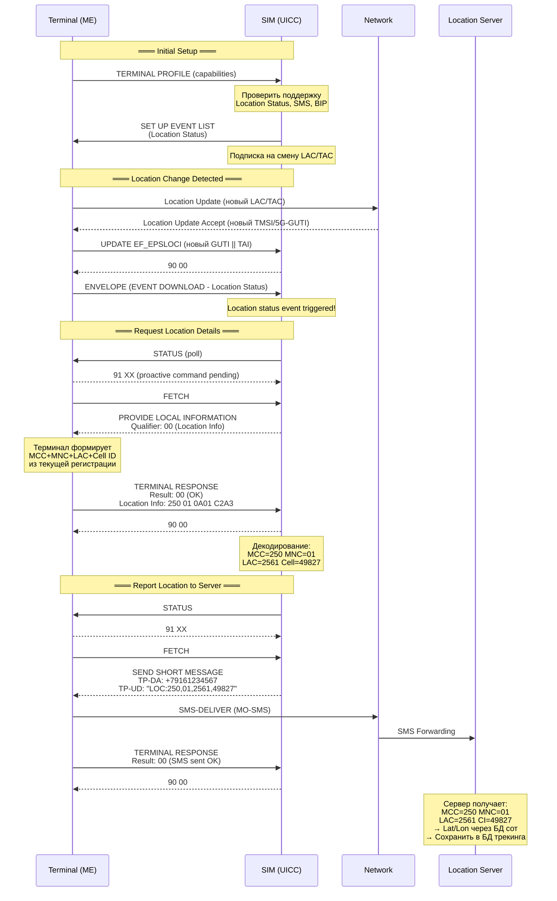

---
tags:
  - research
  - SIM
  - GPS
  - LCS
  - STK
  - UICC
  - location
  - GAD
  - PROVIDE-LOCAL-INFO
  - tracking
  - cell-id
type: research
level: advanced
created: 2026-06-12
updated: 2026-06-12
status: reviewed
sources:
  - "[[wiki/summaries/ts_102223]]"
  - "[[wiki/summaries/ts_131102]]"
  - "[[wiki/concepts/CAT_STK]]"
  - "[[wiki/concepts/UICC]]"
  - "[[wiki/syntheses/sim_files_location]]"
  - "[[wiki/syntheses/sim_files_plmn]]"
  - "[[wiki/concepts/USIM]]"
  - "[[wiki/concepts/UICC_File_System]]"
  - "[[wiki/concepts/JavaCard]]"
  - "[[wiki/concepts/JavaCard_Applet_Development]]"
---

# SIM и GPS/LCS — Location Services на UICC

> **Research** — глубокое исследование того, как SIM-карта может предоставлять и обрабатывать геолокационные данные. От сетевой архитектуры LCS до практических сценариев JavaCard-апплетов и GAD-форм.

---

## Введение: что может SIM в контексте локации?

SIM-карта (точнее, UICC-приложения USIM/SIM) **не имеет собственного GPS-приёмника**. Она не измеряет координаты напрямую. Однако SIM играет ключевую роль в экосистеме локации:

1. **Хранилище** — сохраняет сетевые идентификаторы локации (LOCI-семейство EF), доступные даже без GPS
2. **Инструмент запроса** — через STK PROACTIVE COMMAND может запросить у терминала его местоположение (включая GPS-координаты, если терминал их знает)
3. **Триггер** — может отреагировать на смену локации (LAC/TAC change event) и инициировать действие
4. **Вычислитель** — может сравнивать GAD-формы для геозон (geofencing)
5. **Репортер** — может отправить координаты через SMS или BIP-канал на сервер

Эта статья разбирает каждый из этих аспектов на уровне байтов и кода.

---

## 1. Обзор LCS (Location Services) в 3GPP

### 1.1 Что такое LCS

**LCS** (LoCation Services) — стандартизированный 3GPP механизм предоставления местоположения UE (User Equipment) авторизованным потребителям. Определён в:
- **3GPP TS 22.071** — сервисные требования к LCS (Stage 1)
- **3GPP TS 23.271** — функциональная архитектура LCS для 2G/3G/4G (Stage 2)
- **3GPP TS 23.273** — LCS для 5G (Stage 2)
- **3GPP TS 23.032** — Universal Geographical Area Description (GAD)

LCS решает три фундаментальные задачи:
- **Позиционирование** — определение координат UE с заданной точностью
- **Доставка** — передача координат авторизованному LCS-клиенту
- **Приватность** — контроль того, кто и когда может получать локацию абонента

### 1.2 Архитектура LCS

Классическая архитектура LCS (2G/3G/4G) включает следующие сетевые элементы:

```
┌─────────────────────────────────────────────────────────────────┐
│                     LCS Architecture (TS 23.271)                 │
│                                                                  │
│  ┌──────────┐     ┌──────────┐     ┌──────────┐                 │
│  │ LCS      │────▶│ Request  │────▶│ GMLC     │                 │
│  │ Client   │     │ Gateway  │     │ (Gateway │                 │
│  │ (External│     │ (LRG)    │     │  Mobile  │                 │
│  │  App)    │     │          │     │  Location│                 │
│  └──────────┘     └──────────┘     │  Center) │                 │
│                                     └────┬─────┘                 │
│                                          │                       │
│                    ┌──────────────────────┼──────────────┐       │
│                    │     Core Network     │              │       │
│                    │  ┌────────┐   ┌──────▼──────┐      │       │
│                    │  │ HLR/HSS│◀──│ VMSC/MSC    │      │       │
│                    │  │        │   │ Server      │      │       │
│                    │  └────────┘   └──────┬──────┘      │       │
│                    │                     │              │       │
│                    └─────────────────────┼──────────────┘       │
│                                          │                       │
│  ┌───────────────────────────────────────┼──────────────┐       │
│  │              RAN                      │              │       │
│  │  ┌────────┐     ┌────────┐    ┌──────▼──────┐      │       │
│  │  │ BTS    │     │ NodeB  │    │ eNB/gNB     │      │       │
│  │  │ (2G)   │     │ (3G)   │    │ (4G/5G)     │      │       │
│  │  └────┬───┘     └───┬────┘    └──────┬──────┘      │       │
│  └───────┼─────────────┼───────────────┼──────────────┘       │
│          │             │               │                       │
│  ┌───────▼─────────────▼───────────────▼──────────────┐       │
│  │                    UE                              │       │
│  │  ┌─────────────┐  ┌──────────────────┐            │       │
│  │  │ GPS/ГЛОНАСС │  │ UICC (SIM/USIM)  │            │       │
│  │  │ (опционально)│  │ EF_LOCI, SLPP   │            │       │
│  │  └─────────────┘  └──────────────────┘            │       │
│  └────────────────────────────────────────────────────┘       │
└─────────────────────────────────────────────────────────────────┘
```

Ключевые сетевые элементы:

| Элемент | Функция | Связь с SIM |
|---|---|---|
| **GMLC** (Gateway Mobile Location Center) | Точка входа для внешних LCS-клиентов. Маршрутизирует запросы к нужному MSC/SGSN/MME/AMF | Хранит SLPP абонента (связан с IMSI) |
| **HLR/HSS** | Хранит LCS-подписку абонента и адрес обслуживающего узла | IMSI/MSISDN — ключи для поиска |
| **VMSC/MSC Server** | Обслуживает location request для CS-домена | Проверяет LCS-подписку по IMSI |
| **SGSN/MME** | Обслуживает location request для PS-домена | Аналогично |
| **LMF** (Location Management Function) | В 5G: центральный элемент позиционирования | Не напрямую |
| **UE** | Целевое устройство | SIM предоставляет ID, хранит LOCI |

### 1.3 Типы Location Requests

| Тип | Инициатор | Описание |
|---|---|---|
| **MO-LR** (Mobile Originated) | Сам UE | UE запрашивает свою локацию или отправляет её внешнему клиенту |
| **MT-LR** (Mobile Terminated) | Внешний LCS-клиент | Клиент запрашивает локацию UE |
| **NI-LR** (Network Induced) | Сеть | Автоматический запрос при экстренном вызове |

### 1.4 Где участвует SIM

```
MO-LR:
  1. UE отправляет LCS MO-LR Request
  2. VMSC/MSC Server проверяет подписку (IMSI → HLR)
  3. Сеть определяет локацию (Cell ID, GPS, OTDOA, ...)
  4. Результат возвращается UE
  [SIM]: IMSI для авторизации; EF_LOCI для быстрого Cell ID

MT-LR:
  1. LCS Client → GMLC: Location Request (MSISDN)
  2. GMLC → HLR: Send Routing Info for LCS
  3. HLR возвращает адрес обслуживающего MSC/SGSN
  4. GMLC → VMSC: Provide Subscriber Location
  5. VMSC проверяет SLPP абонента (приватность!)
  6. Позиционирование → результат → GMLC → LCS Client
  [SIM]: SLPP определяет, кто может видеть локацию
```

> [!important] Ключевой вывод
> SIM не участвует в радиоизмерениях (RTT, AOA, OTDOA). Её роль — **идентификация**, **авторизация** и **приватность**. Но через STK она может **запросить** локацию у терминала и **отправить** её куда угодно — это и есть предмет данной статьи.

---

## 2. EF, связанные с локацией

Детальный разбор семейства LOCI-файлов представлен в [[wiki/syntheses/sim_files_location|LOCI-синтезе]]. Здесь — извлечение геолокационной информации и её точность.

### 2.1 Что можно извлечь из LOCI-файлов

| EF | FID | Извлекаемая информация | Точность | Поколение |
|---|---|---|---|---|
| **EF_LOCI** | `6F7E` | MCC, MNC, LAC (Location Area Code) | LAC: город/район | 3G CS |
| **EF_PSLOCI** | `6F73` | MCC, MNC, LAC, RAC (Routing Area Code) | RAC: район/кластер сот | 3G PS |
| **EF_EPSLOCI** | `6FE3` | MCC, MNC, TAC (Tracking Area Code) | TAC: группа eNB | 4G |
| **EF_5GS3GPPLOCI** | `6FF0` | MCC, MNC, TAC (3 байта в 5G) | TAC: группа gNB | 5G cellular |
| **EF_5GSN3GPPLOCI** | TS 31.102 | MCC, MNC, TAC | TAC: через N3IWF | 5G Wi-Fi |

### 2.2 Точность локации через Cell ID

Точность позиционирования по Cell ID (MCC+MNC+LAC/TAC+Cell ID) **драматически зависит от плотности сети**:

| Среда | Радиус соты | Точность | Пример |
|---|---|---|---|
| Urban dense (5G mmWave) | 50-200 m | **~50-200 m** | Центр Москвы, Токио |
| Urban (4G/5G mid-band) | 200-1000 m | **~200 m - 1 km** | Городская застройка |
| Suburban (4G) | 1-3 km | **~1-3 km** | Пригород |
| Rural (4G/2G) | 5-15 km | **~5-15 km** | Сельская местность |
| Extended Range (GSM) | до 35 km | **~35 km** | Пустыня, море |

> [!note] Cell ID — всегда доступен
> В отличие от GPS, Cell ID доступен всегда, когда UE зарегистрирован в сети. Он не требует отдельного позиционирования и не расходует батарею. Именно поэтому это базовый fallback в LCS.

### 2.3 Как UICC узнаёт LAC/TAC при FILE CHANGE

При изменении LAC/TAC терминал обновляет соответствующий EF. UICC может **подписаться на событие Location Status**:

```
Механизм:
  1. UICC отправляет SET UP EVENT LIST (Location Status = bit 4)
  2. Терминал следит за LAC/TAC
  3. При смене LAC/TAC терминал отправляет ENVELOPE (EVENT DOWNLOAD - Location Status)
  4. ENVELOPE содержит новый LAC/TAC + MCC/MNC
  5. UICC может прочитать соответствующий EF для получения деталей
```

Это ключевой механизм для сценариев слежения за роумингом — не нужно поллить, UICC уведомляется асинхронно.

### 2.4 Практический APDU-пример: чтение EPSLOCI

```
> ME → UICC:  SELECT ADF.USIM
  00 A4 00 04 02 3F 00
< UICC → ME:  61 19 (data available)

> ME → UICC:  SELECT EF_EPSLOCI (6FE3)
  00 A4 00 04 02 6F E3
< UICC → ME:  6F 17 (FCP: 18 bytes, Transparent, READ PIN, UPDATE PIN)

> ME → UICC:  READ BINARY (offset=0, len=18)
  00 B0 00 00 12
< UICC → ME:  GUTI (11B) || TAI (6B) || KSI (1B)
               Example TAI: 2F 50 10 F0 00 01 A0
               Декодирование:
                 MCC = 250, MNC = 01, TAC = 0x0001A0 = 416
               90 00
```

**Декодированный результат**: абонент зарегистрирован в сети `250 01` (МТС Россия), в Tracking Area `416`.

---

## 3. STK: PROVIDE LOCAL INFORMATION

### 3.1 Proactive Command в общем

**PROVIDE LOCAL INFORMATION** — proactive command из UICC в терминал (command type = `0x26` в ранних версиях, `0x38` в TS 102 223). Определён в ETSI TS 102 223, clause 6.4.12 и 8.19.

**Это единственный легальный способ для SIM получить локацию от терминала.**

### 3.2 Байтовый формат команды

```
PROVIDE LOCAL INFORMATION Command TLV:
┌──────────────┬──────────┬─────────────────────┐
│ Tag          │ Length   │ Value               │
├──────────────┼──────────┼─────────────────────┤
│ D0           │ Len      │ Proactive UICC Cmd  │
│  └─ 81       │ 02       │ Command Details     │
│       └─ 01  │          │ Cmd Number          │
│       └─ 26  │          │ Type = PROVIDE LOCAL│
│  └─ 82       │ 01       │ Device Identities   │
│       └─ 81  │          │ Src=UICC, Dst=ME    │
│  └─ 9F 2E    │ 01       │ Local Info Qualifier│
│       └─ XX  │          │ Qualifier byte      │
└──────────────┴──────────┴─────────────────────┘
```

### 3.3 Qualifier'ы — что можно запросить

Qualifier (байт в TLV `9F 2E`) определяет, какую информацию запрашивает UICC:

| Qualifier | Запрашиваемая информация | Где определено | Что возвращает терминал |
|---|---|---|---|
| `00` | Location Information | 8.19 | MCC+MNC+LAC+CellID |
| `01` | IMEI | 8.20 | IMEI терминала |
| `02` | Network Measurement Results (NMR) | 8.22 | Измерения соседних сот |
| `03` | Date, Time & Time Zone | 8.39 | Текущие дата/время/часовой пояс |
| `04` | Language | 8.45 | Язык интерфейса ME |
| `05` | Battery State | 8.46 | Состояние батареи |
| `06` | Access Technology | 8.61 | Текущая RAT (GSM/UTRAN/E-UTRAN/NR) |
| `07` | Multiple Access Technologies | 8.63 | Все активные RAT |
| `08` | Supported Radio Access Technologies | 8.69 | Все поддерживаемые ME RAT |
| `09` | IMEISV | 8.75 | IMEI + Software Version |
| `0A` | Search Mode | 8.76 | Автоматический/ручной выбор сети |
| `0B` | MEID | 8.81 | Mobile Equipment Identifier (CDMA) |
| `0C` | Broadcast Network Information | 8.90 | Информация о broadcast-сетях |
| `10-1F` | Location Info per Access Technology | 8.19 (ext) | Локация для каждой активной RAT |

> [!tip] Самый важный qualifier
> `00` — Location Information. Это даёт **MCC + MNC + LAC/TAC + Cell ID**. Именно его используют все геолокационные STK-апплеты.

### 3.4 Terminal Response: Location Information (Qualifier 00)

```
TERMINAL RESPONSE для PROVIDE LOCAL INFORMATION (Qualifier 00):
┌──────────┬──────────┬─────────────────────────────────┐
│ Tag      │ Length   │ Value                           │
├──────────┼──────────┼─────────────────────────────────┤
│ 81       │ 02       │ Cmd Details (echo)              │
│ 82       │ 01       │ Device Identities               │
│ 83       │ 01       │ Result (00=OK)                  │
│ 9F 2F    │ 07       │ Location Information            │
│          │          │  Byte 0: MCC digit 2 \| MCC 1  │
│          │          │  Byte 1: MNC 3 \| MCC 3        │
│          │          │  Byte 2: MNC 2 \| MNC 1        │
│          │          │  Byte 3-4: LAC/TAC (2 байта)    │
│          │          │  Byte 5-6: Cell ID (2 байта)     │
└──────────┴──────────┴─────────────────────────────────┘
```

**Пример декодирования Location Information:**
```
9F 2F 07: 2F 50 10 F0 0A 01 C2 A3
          MCC = 250, MNC = 01
          LAC/TAC = 0x0A01 = 2561
          Cell ID = 0xC2A3 = 49827
→ Абонент в сети МТС (250 01), LAC 2561, Cell 49827
```

### 3.5 Terminal Response: Location Info + Access Technology (Qualifier 10-1F)

Более современный вариант — запрос локации **для каждой активной RAT**:

```
TERMINAL RESPONSE (Qualifier 10, две активных RAT):
┌──────────┬──────────┬─────────────────────────────┐
│ 83       │ 01       │ Result = 00                  │
│ 9F 2A    │ 02       │ Access Technologies          │
│          │          │  Byte 0 = 04 (E-UTRAN/LTE)   │
│          │          │  Byte 1 = 06 (NG-RAN/NR)     │
│ 9F 2F    │ 07       │ Location Info for LTE        │
│          │          │  MCC, MNC, TAC, Cell ID       │
│ 9F 2F    │ 07       │ Location Info for NR         │
│          │          │  MCC, MNC, TAC, Cell ID       │
└──────────┴──────────┴─────────────────────────────┘
```

Это особенно полезно для EN-DC (LTE+NR одновременно) или для multi-SIM active-режимов.

---

## 4. JavaCard-код: получение локации через STK

### 4.1 Общий подход

JavaCard-апплет, использующий `uicc.toolkit` (пакет `javacard.framework` + `uicc.toolkit.*`), может:

1. Запросить `PROVIDE LOCAL INFORMATION`
2. В обработчике `processToolkit()` получить `TERMINAL RESPONSE`
3. Извлечь MCC, MNC, LAC/TAC, Cell ID
4. Отправить их через `SEND SHORT MESSAGE` или `OPEN CHANNEL` (BIP)

### 4.2 Базовый код: запрос локации и отправка по SMS

```java
package com.example.locationtracker;

import javacard.framework.*;
import uicc.toolkit.*;

public class LocationTrackerApplet extends Applet
    implements ToolkitInterface, ToolkitConstants {

    // Proactive handler
    private ProactiveHandler proHandler;
    // SMS handler
    private SMSHandler smsHandler;

    // Registration
    private static final byte EVENT_LOCATION_STATUS = 0x04;

    // Command qualifier
    private static final byte QUAL_LOCATION_INFO = 0x00;

    // Destination number for location reports (SMSC + TP-DA)
    private byte[] serverNumber;
    private short serverNumberLen;

    // Flag: first boot → send location
    private boolean firstBoot;

    private LocationTrackerApplet() {
        // Get toolkit handlers
        proHandler = ProactiveHandler.getTheHandler();
        smsHandler = SMSHandler.getTheHandler();
        firstBoot = true;
    }

    public static void install(byte[] bArray, short bOffset, byte bLength) {
        LocationTrackerApplet app = new LocationTrackerApplet();
        app.register(bArray, (short)(bOffset + 1), bArray[bOffset]);

        // Register for events
        app.registerEvents();
    }

    private void registerEvents() {
        // Subscribe to Location Status event
        // SET UP EVENT LIST will be sent on next proactive poll
        proHandler.init(PRO_CMD_SET_UP_EVENT_LIST, (byte)0x00, DEV_ID_ME);
        proHandler.appendTLV(
            TAG_EVENT_LIST,
            new byte[] { EVENT_LOCATION_STATUS },
            (short)0, (short)1
        );
        // Event list will be sent to terminal
    }

    /**
     * Called by toolkit framework when a proactive command
     * or event needs to be processed.
     */
    public void processToolkit(byte event) {
        switch (event) {
            case EVENT_UNRECOGNIZED_ENVELOPE:
                // Not used in this app
                break;

            case EVENT_PROFILE_DOWNLOAD:
                // Terminal profile received
                // Send SET UP EVENT LIST
                sendSetupEventList();
                break;

            case EVENT_EVENT_DOWNLOAD_LOCATION_STATUS:
                // Location changed! Request new location info
                requestLocationAndReport();
                break;

            case EVENT_PROACTIVE_HANDLER_AVAILABLE:
                // Result of previous proactive command is ready
                handleLocationResponse();
                break;
        }
    }

    /**
     * Send SET UP EVENT LIST to subscribe to location changes
     */
    private void sendSetupEventList() {
        proHandler.init(
            PRO_CMD_SET_UP_EVENT_LIST,
            (byte)0x00,
            DEV_ID_ME
        );

        byte[] eventList = new byte[1];
        eventList[0] = EVENT_LOCATION_STATUS;

        proHandler.appendTLV(
            TAG_EVENT_LIST,
            eventList,
            (short)0, (short)1
        );

        proHandler.send();
    }

    /**
     * Request PROVIDE LOCAL INFORMATION (qualifier 00)
     */
    private void requestLocationAndReport() {
        // Build PROVIDE LOCAL INFORMATION command
        proHandler.init(
            PRO_CMD_PROVIDE_LOCAL_INFORMATION,
            (byte)0x00,
            DEV_ID_ME
        );

        // Append qualifier: Location Information
        byte[] qualifier = new byte[1];
        qualifier[0] = QUAL_LOCATION_INFO;

        proHandler.appendTLV(
            TAG_LOCAL_INFO_QUALIFIER,  // 9F 2E
            qualifier,
            (short)0, (short)1
        );

        proHandler.send();
    }

    /**
     * Handle TERMINAL RESPONSE — extract location and send SMS
     */
    private void handleLocationResponse() {
        // Get the result
        byte result = proHandler.getResult();

        if (result != RESULT_OK) {
            // Terminal could not provide location
            return;
        }

        // Extract Location Information TLV (9F 2F)
        byte[] locInfo = new byte[7];
        short locLen = proHandler.getTLV(
            TAG_LOCATION_INFO,   // 9F 2F
            locInfo,
            (short)0
        );

        if (locLen < 7) {
            // Invalid location data
            return;
        }

        // Decode location
        decodeAndSendSMS(locInfo);
    }

    /**
     * Decode location bytes and send SMS to server
     *
     * locInfo[7]:
     *   [0] = MCC digit 2 | MCC digit 1
     *   [1] = MNC digit 3 | MCC digit 3
     *   [2] = MNC digit 2 | MNC digit 1
     *   [3-4] = LAC/TAC (MSB first)
     *   [5-6] = Cell ID (MSB first)
     */
    private void decodeAndSendSMS(byte[] locInfo) {
        // Build SMS text payload
        // Format: "LOC:MCC,MNC,LAC,CI"
        // Example: "LOC:250,01,2561,49827"
        byte[] smsText = new byte[64];
        short offset = 0;

        // "LOC:"
        smsText[offset++] = 'L';
        smsText[offset++] = 'O';
        smsText[offset++] = 'C';
        smsText[offset++] = ':';

        // MCC
        byte mcc1 = (byte)((locInfo[0] & 0x0F) + '0');
        byte mcc2 = (byte)(((locInfo[0] >> 4) & 0x0F) + '0');
        byte mcc3 = (byte)((locInfo[1] & 0x0F) + '0');
        smsText[offset++] = mcc2;
        smsText[offset++] = mcc1;
        smsText[offset++] = mcc3;
        smsText[offset++] = ',';

        // MNC
        byte mnc1 = (byte)((locInfo[2] & 0x0F) + '0');
        byte mnc2 = (byte)(((locInfo[2] >> 4) & 0x0F) + '0');
        byte mnc3 = (byte)(((locInfo[1] >> 4) & 0x0F) + '0');
        smsText[offset++] = mnc2;
        smsText[offset++] = mnc1;
        // Check for 3-digit MNC (0xF means 2-digit)
        if (mnc3 != 0x0F + '0') {
            smsText[offset++] = mnc3;
        }
        smsText[offset++] = ',';

        // LAC (2 bytes, big-endian)
        short lac = (short)(((locInfo[3] & 0xFF) << 8) | (locInfo[4] & 0xFF));
        offset = appendShort(lac, smsText, offset);
        smsText[offset++] = ',';

        // Cell ID (2 bytes, big-endian)
        short cellId = (short)(((locInfo[5] & 0xFF) << 8) | (locInfo[6] & 0xFF));
        offset = appendShort(cellId, smsText, offset);

        // Send the SMS
        sendSMS(smsText, offset);
    }

    /**
     * Convert short to ASCII decimal and append to buffer
     */
    private short appendShort(short value, byte[] buffer, short offset) {
        // Simple conversion for unsigned short (0-65535)
        if (value >= 10000) {
            buffer[offset++] = (byte)('0' + (value / 10000));
            value %= 10000;
        }
        if (value >= 1000) {
            buffer[offset++] = (byte)('0' + (value / 1000));
            value %= 1000;
        }
        buffer[offset++] = (byte)('0' + (value / 100));
        value %= 100;
        buffer[offset++] = (byte)('0' + (value / 10));
        buffer[offset++] = (byte)('0' + (value % 10));
        return offset;
    }

    /**
     * Send SMS via SEND SHORT MESSAGE proactive command
     */
    private void sendSMS(byte[] textData, short textLen) {
        // Build the TP-UD (User Data) with 7-bit GSM alphabet packing
        // For simplicity, using 8-bit data coding (UCS2 or 8-bit)
        // Real impl: GSM 03.38 7-bit packing for ASCII
        byte[] tpdu = new byte[160];
        short tpduLen = 0;

        // TP-UDL (User Data Length) = text length in septets
        // Using 8-bit encoding for simplicity
        tpdu[tpduLen++] = (byte)textLen;  // TP-UDL

        // Copy text
        for (short i = 0; i < textLen; i++) {
            tpdu[tpduLen++] = textData[i];
        }

        // Send via SEND SHORT MESSAGE
        proHandler.init(
            PRO_CMD_SEND_SHORT_MESSAGE,
            (byte)0x00,
            DEV_ID_NETWORK  // Destination: network
        );

        // Packing required
        proHandler.appendTLV(
            TAG_SMS_TPDU,
            tpdu,
            (short)0, tpduLen
        );

        // Destination address (server number)
        if (serverNumber != null && serverNumberLen > 0) {
            proHandler.appendTLV(
                TAG_ADDRESS,  // TP-DA
                serverNumber,
                (short)0, serverNumberLen
            );
        }

        proHandler.send();
    }

    /**
     * Handle Shareable interface — not used
     */
    public Shareable getShareableInterfaceObject(AID clientAID, byte parameter) {
        return null;
    }
}
```

### 4.3 Ключевые моменты кода

1. **Подписка на событие Location Status**: апплет регистрируется на `EVENT_LOCATION_STATUS` через `SET UP EVENT LIST`. При каждой смене LAC/TAC терминал уведомляет UICC через `ENVELOPE (EVENT DOWNLOAD - Location Status)`.

2. **Инициирование PROVIDE LOCAL INFORMATION**: апплет отправляет proactive command с qualifier `00`, запрашивая MCC+MNC+LAC+Cell ID.

3. **Обработка Terminal Response**: `handleLocationResponse()` извлекает TLV `9F 2F` (Location Information) и парсит 7 байт.

4. **Отправка SMS**: `sendSMS()` формирует SMS с текстовым форматом `LOC:MCC,MNC,LAC,CI` и отправляет через `PRO_CMD_SEND_SHORT_MESSAGE`.

5. **Ограничения памяти**: JavaCard имеет жёсткие лимиты (4-16 KB RAM на апплет). Парсинг и формирование SMS должны быть компактными.

### 4.4 Цикл запроса локации с таймером

Альтернативный подход без подписки на Location Status — периодический опрос через `TIMER MANAGEMENT`:

```
Цикл апплета:
  1. TIMER MANAGEMENT (start, 60000 ms = 1 min)
  2. Терминал: ENVELOPE (TIMER EXPIRATION)
  3. Апплет: PROVIDE LOCAL INFORMATION (qualifier 00)
  4. Терминал: TERMINAL RESPONSE (MCC+MNC+LAC+Cell ID)
  5. Апплет: SEND SHORT MESSAGE (отправка на сервер)
  6. TIMER MANAGEMENT (start, 60000 ms) → пункт 2
```

Недостаток: постоянный поллинг даже если локация не менялась. Преимущество: проще и не зависит от поддержки Location Status терминалом.

---

## 5. GAD Shapes (Geographical Area Description)

### 5.1 Что такое GAD

**GAD** — универсальный формат описания географических зон, стандартизированный в 3GPP TS 23.032. Используется в LCS для описания:

- Где находится UE (в ответе на location request)
- Какую зону покрывает сота (cell coverage area)
- Геозоны для location-based services

Базовый референс: **WGS 84** (World Geodetic System 1984):
- Major axis (a) = 6,378,137 m
- Minor axis (b) = 6,356,752.314 m
- Longitude: -180° to +180° (0° = Greenwich, east = positive)
- Latitude: -90° to +90° (0° = equator, north = positive)

### 5.2 Обзор GAD-форм

| # | Форма | Кодирование | Применение |
|---|---|---|---|
| 1 | **Ellipsoid Point** | Lat (24b) + Lon (24b) | Простая точка на эллипсоиде |
| 2 | **Ellipsoid Point with Uncertainty Circle** | Lat + Lon + радиус r | Точка с круговой областью неопределённости |
| 3 | **Ellipsoid Point with Uncertainty Ellipse** | Lat + Lon + r1 + r2 + ориентация A | Точка с эллиптической областью |
| 3a | **High Accuracy Ellipsoid Point with Uncertainty Ellipse** | 32-битные координаты | Субметровая точность |
| 4 | **Polygon** | 3-15 вершин | Произвольная полигональная зона |
| 5 | **Ellipsoid Point with Altitude** | Lat + Lon + Alt | 3D точка |
| 6 | **Ellipsoid Point with Altitude and Uncertainty Ellipsoid** | 3D + эллипсоид ошибок | 3D с областью |
| 6a | **High Accuracy 3D** | 32-битные координаты | Высокоточное 3D |
| 7 | **Ellipsoid Arc** | Центр + внутренний R + ширина + смещение + угол | **Сектор соты** |
| 8 | **Local 2D Point with Uncertainty Ellipse** | Относительно локальной точки | 5GS локальные координаты |
| 9 | **Local 3D Point with Uncertainty Ellipsoid** | 3D относительно локальной точки | 5GS локальные 3D |

### 5.3 Кодирование координат

**Стандартная точность (24 бита):**
```
Latitude: 24-битное знак+модуль
  lat = (N / 2^23) × 90°
  Где N — 23-битное беззнаковое целое
  Разрешение: 90° / 2^23 ≈ 0.0000107° ≈ 1.2 метра

Longitude: 24-битный 2's complement
  lon = (N / 2^23) × 360°
  Где N — 23-битное знаковое целое (со знаком в 24-м бите)
  Разрешение: 360° / 2^23 ≈ 0.000043° ≈ 3.6 метра (на экваторе)
```

**Высокая точность (32 бита):**
```
Latitude: 32-битное знак+модуль
  lat = (N / 2^31) × 90°
  Разрешение: 90° / 2^31 ≈ 0.000000042° ≈ 4.6 мм

Longitude: 32-битный 2's complement
  lon = (N / 2^31) × 360°
  Разрешение: 360° / 2^31 ≈ 0.00000017° ≈ 14 мм (на экваторе)
```

### 5.4 Нелинейное кодирование uncertainty

Радиус неопределённости кодируется нелинейно (чтобы охватить диапазон от сантиметров до тысяч километров):

```
Стандартное кодирование:
  r = 10 × ((1 + 0.1)^K - 1)  метров
  K = 0..127
  Range: 0 м ... ~1,800 км

Высокоточное кодирование:
  r = 0.3 × ((1 + 0.02)^K - 1)  метров
  K = 0..255
  Range: 0 м ... ~46.5 м
```

### 5.5 Ellipsoid Arc — геометрия сектора соты

Самая интересная форма для SIM — **Ellipsoid Arc**, так как она описывает сектор сотовой вышки:

```
┌─────────────────────────────────────────────────────────┐
│              Ellipsoid Arc                              │
│                                                          │
│          ┌─────────────────────┐                        │
│         /                       \                        │
│        /     ╔══════════╗        \                       │
│       /     ║  Covered  ║         \                      │
│      /      ║  Sector   ║          \                     │
│     /       ║           ║           \                    │
│    /        ╚═════╤═════╝            \                   │
│   /               │ Center            \                  │
│  /                │ (lat, lon)         \                 │
│ ──────────────────●──────────────────────               │
│        ^          │          ^                           │
│     Inner R       │    Uncertainty                      │
│                   │     Radius                           │
│  │←─────────────→│←────────────────→│                  │
│                   │                                      │
│  offset_angle ────┘  included_angle                     │
│  (from North CW)     (angular width)                    │
└─────────────────────────────────────────────────────────┘
```

Параметры Ellipsoid Arc:
- `lat, lon` — центр (координаты вышки)
- `inner_r` — внутренний радиус (зона уверенного приёма)
- `unc_r` — ширина кольца неопределённости (внешний радиус = inner_r + unc_r)
- `offset_angle` — смещение от севера по часовой (направление сектора)
- `included_angle` — угловая ширина сектора (60° / 90° / 120°)
- `confidence` — уровень доверия 0-100%

### 5.6 Как SIM может хранить и сравнивать GAD-формы

**Вариант 1: Хранение в Transparent EF (custom)**

Оператор может выделить свободный EF (например, из резервного диапазона) и записать туда бинарное представление GAD-формы. Апплет читает этот EF и сравнивает с данными из Terminal Response.

```
Пользовательский EF для GAD (например, в DF.TELECOM):
  EF_GEOFENCE (FID 6F80, Transparent, READ PIN, UPDATE ADM)
  Структура:
    [0]     : GAD Shape Type (4 бита) + кол-во точек (4 бита)
    [1..n]  : Данные формы в бинарном GAD-формате
```

**Вариант 2: Вшивание в байт-код апплета**

Геозона (например, полигон домашнего региона) компилируется в байт-код апплета как `static final byte[]`. Недостаток: нельзя обновить без переустановки апплета.

```java
// Home region polygon: Москва
private static final byte[] HOME_REGION_GAD = {
    (byte)0x50, // Polygon, 5 точек
    // Point 1: 55.7558°N, 37.6173°E → кодирование в 24 бита...
    // Point 2-5: ...
};
```

**Вариант 3: Сравнение через point-in-polygon алгоритм**

Для определения, находится ли абонент в зоне, SIM должен реализовать алгоритм point-in-polygon на JavaCard. Это сложно из-за ограничений памяти, но возможно для простых форм:

```
Для Ellipsoid Arc (сектор соты):
  IF расстояние(точка, центр) В [inner_r, inner_r+unc_r]
     AND азимут(точка, центр) В [offset_angle, offset_angle+included_angle]
  THEN точка внутри сектора

Для Polygon:
  Использовать ray-casting алгоритм (чётное/нечётное число пересечений)
  Проблема: геодезические линии (не прямые на плоскости!), нужна
  интерполяция на эллипсоиде для больших полигонов
```

> [!warning] Вычислительная сложность
> Геодезические вычисления (расстояние, азимут на эллипсоиде WGS 84) требуют тригонометрических функций (sin, cos, atan2) и плавающей точки — всё это отсутствует в стандартном JavaCard API. Для практической реализации на SIM нужны:
> - Таблицы предвычисленных значений sin/cos
> - Аппроксимация формулами для малых расстояний (до 100 км)
> - Или внешний сервер, которому SIM отправляет координаты и получает ответ "inside/outside"

---

## 6. Практические сценарии

### 6.1 Сценарий 1: Слежение за роумингом

**Задача**: оператор хочет знать, когда абонент выезжает за границу, и отправлять ему SMS с тарифами на роуминг.

**Реализация на SIM:**

```java
// В обработчике EVENT_DOWNLOAD_LOCATION_STATUS:
byte[] locInfo = readEF(EF_EPSLOCI);  // Или через PROVIDE LOCAL INFO
short mcc = extractMCC(locInfo);      // MCC из TAI

if (mcc != HOME_MCC) {
    // Абонент в роуминге!
    // Отправить SMS с информацией о тарифах
    sendRoamingInfoSMS(mcc);
}

// Альтернативно: сравнить с EF_HPLMNwAcT
boolean isHome = checkHomePLMN(mcc, extractMNC(locInfo));
if (!isHome) {
    reportRoaming(mcc, extractMNC(locInfo), extractLAC(locInfo));
}
```

**Псевдокод полного цикла:**
```
1. UICC: SET UP EVENT LIST (Location Status)
2. ME:    перемещается, LAC меняется
3. ME:    обновляет EF_EPSLOCI
4. ME:    ENVELOPE (EVENT DOWNLOAD - Location Status)
5. UICC:  читает EF_EPSLOCI → извлекает MCC
6. UICC:  IF MCC != домашний MCC:
7. UICC:    PROVIDE LOCAL INFORMATION (qualifier 00) — детальная локация
8. ME:     TERMINAL RESPONSE: MCC, MNC, LAC, Cell ID
9. UICC:   SEND SHORT MESSAGE ("Roaming: MCC=255, LAC=1234")
10. Сервер: получает SMS → отправляет приветственное роуминг-сообщение
```

### 6.2 Сценарий 2: Гео-ограниченные STK-услуги

**Задача**: банковское STK-приложение должно работать только в домашней стране (антифрод).

```java
private boolean isInHomeCountry() {
    // Вариант A: проверка EF_LOCI / EF_EPSLOCI
    byte[] locInfo = readLocationFromEF();
    short mcc = extractMCC(locInfo);

    // HOME_MCC_LIST = {250, 255, ...} (Россия + страны таможенного союза)
    for (byte i = 0; i < HOME_MCC_LIST.length; i++) {
        if (mcc == HOME_MCC_LIST[i]) {
            return true;
        }
    }
    return false;
}

public void process(APDU apdu) {
    if (selectingApplet()) { return; }

    // Check location before any financial operation
    if (!isInHomeCountry()) {
        // Show warning via DISPLAY TEXT
        proHandler.init(PRO_CMD_DISPLAY_TEXT, (byte)0x00, DEV_ID_ME);
        proHandler.appendTLV(TAG_TEXT_STRING,
            "Service unavailable outside home country".getBytes(),
            (short)0, (short)44);
        proHandler.send();
        ISOException.throwIt(ISO7816.SW_CONDITIONS_NOT_SATISFIED);
        return;
    }

    // Proceed with operation
    processOperation(apdu);
}
```

### 6.3 Сценарий 3: Fleet Management через SIM

**Задача**: SIM в GPS-трекере грузовика отправляет координаты каждые 5 минут.

**Реализация (полный цикл с таймером):**

```java
private void startTrackingCycle() {
    // Start timer: 5 minutes = 300,000 ms
    // TIMER MANAGEMENT (start, timer_id=1, value=300000)
    proHandler.init(PRO_CMD_TIMER_MANAGEMENT, (byte)0x00, DEV_ID_ME);
    byte[] timerData = new byte[4];
    timerData[0] = 0x01;  // Timer ID = 1
    timerData[1] = 0x01;  // Action: start
    timerData[2] = 0x04;  // Hour: 0
    timerData[3] = 0x05;  // Minute: 5
    proHandler.appendTLV(TAG_TIMER_VALUE, timerData, (short)0, (short)4);
    proHandler.send();
}

// In processToolkit:
case EVENT_TIMER_EXPIRATION:
    // Timer fired → request location
    requestLocationAndReport();
    // Restart timer
    startTrackingCycle();
    break;
```

**Формат данных на сервер (SMS):**
```
LOC:250,01,2561,49827,2026-06-12T14:35:00
```

**Серверная обработка:**
```
1. Принять SMS
2. Распарсить: MCC, MNC, LAC, Cell ID, timestamp
3. Конвертировать клеточный ID в координаты через базу данных сот
   (Cell ID → Lat/Lon lookup table)
4. Сохранить в БД трекинга
5. Отобразить на карте
```

**Точность и частота:**
- Частота: 5 минут — компромисс между точностью трека и батареей/трафиком
- При движении по трассе на 90 км/ч за 5 минут грузовик проходит 7.5 км
- Точность Cell ID в rural (5-15 км) достаточна для отслеживания маршрута
- В городе точность 200-1000 м даёт хороший трек

---

## 7. Ограничения

### 7.1 Cell ID точность — фундаментальное ограничение

Без GPS координаты известны только с точностью до соты. Даже в городе это минимум 200 метров. Для fleet management это приемлемо; для навигации — нет.

### 7.2 Нет прямого доступа к GPS с SIM

SIM может запросить локацию через STK, но **терминал решает, что вернуть**:
- Если терминал знает GPS-координаты (активно приложение с геолокацией), он может вернуть их в Location Information
- Большинство терминалов возвращают только Cell ID (сетевую локацию)
- SIM не может включить GPS принудительно

**TERMINAL PROFILE — бит location:**
```
TERMINAL PROFILE, бит X (27-й байт, бит 2):
  0 = терминал НЕ предоставляет детальную локацию (GPS) через STK
  1 = терминал предоставляет GPS-координаты в PROVIDE LOCAL INFO response
```

Большинство стандартных телефонов устанавливают этот бит в 0. GPS-координаты в STK доступны в основном на индустриальных терминалах и трекерах.

### 7.3 Зависимость от TERMINAL PROFILE

Каждая CAT-функция, которую UICC хочет использовать, должна быть подтверждена в TERMINAL PROFILE:

| Функция | Бит в TERMINAL PROFILE | Если не поддержана |
|---|---|---|
| PROVIDE LOCAL INFO (Location) | Байт 3, бит 1 | UICC не может запросить локацию |
| PROVIDE LOCAL INFO (NMR) | Байт 3, бит 2 | UICC не может получить измерения сот |
| SEND SHORT MESSAGE | Байт 4, бит 1 | Невозможно отправить SMS |
| Event: Location Status | Байт 7, бит 4 | Нет авто-уведомлений о смене LAC |
| TIMER MANAGEMENT | Байт 6, бит 1 | Нет периодического опроса |
| BIP (OPEN CHANNEL) | Байт 8, бит 7 | Невозможно TCP/IP соединение |

> [!important] Практический вывод
> SIM-апплет должен проверять TERMINAL PROFILE перед использованием функций. Если Location Status не поддерживается, fallback на TIMER MANAGEMENT. Если SEND SHORT MESSAGE не поддерживается, fallback на BIP. Всегда нужен Plan B.

### 7.4 Отсутствие криптографической защиты локации в STK

Location Information в Terminal Response не подписана и не зашифрована. Терминал может соврать. SIM не может проверить достоверность координат. Это архитектурное ограничение: SIM доверяет терминалу.

### 7.5 Ограничения JavaCard

| Ограничение | Влияние |
|---|---|
| Нет плавающей точки | Геодезия без sin/cos — только таблицы и аппроксимации |
| Нет динамической памяти (malloc) | Фиксированные буферы, осторожное управление |
| 4-16 KB RAM на апплет | Минимум промежуточных данных |
| Медленный процессор (5-20 MHz) | Геовычисления занимают миллисекунды |
| Нет String.format() | Преобразование чисел в текст вручную |
| Firewall между апплетами | Нельзя читать файлы другого апплета |

---

## 8. Полный цикл: получение и отправка локации через STK

### 8.1 Mermaid-диаграмма



### 8.2 Байтовый дамп полного цикла (симуляция)

```
=== Шаг 1: TERMINAL PROFILE ===
ME → UICC: 80 10 00 00 14 [TERMINAL PROFILE bytes...]
UICC → ME: 90 00

=== Шаг 2: SET UP EVENT LIST ===
ME → UICC: 80 12 00 00 0C [FETCH, Le=12]
UICC → ME: D0 0A 81 02 01 05 82 01 81 99 01 04 90 00
  └─ D0 = Proactive UICC command tag
     └─ 81 02 01 05 = Command Details: Cmd#1, Type=SET UP EVENT LIST
     └─ 82 01 81 = Device: UICC→ME
     └─ 99 01 04 = Event List: [Location Status]

=== Шаг 3: EVENT DOWNLOAD (Location Status) ===
ME → UICC: 80 C2 00 00 16 [ENVELOPE, EVENT DOWNLOAD]
  └─ D6: Transport Level Event
     └─ 99: Event List
        └─ 04: Location Status
     └─ 9F 2F: Location Information
        └─ 2F 50 10 F0 0A 01 C2 A3: MCC=250 MNC=01 LAC=2561 CI=49827
UICC → ME: 90 00

=== Шаг 4: STATUS (UICC имеет proactive команду) ===
ME → UICC: 80 F2 00 00 02 [STATUS]
UICC → ME: 91 18 [Proactive cmd pending, 0x18 bytes]

=== Шаг 5: FETCH (PROVIDE LOCAL INFORMATION) ===
ME → UICC: 80 12 00 00 18 [FETCH]
UICC → ME: D0 16 81 02 02 26 82 01 81 9F 2E 01 00
  └─ 81 02 02 26 = Cmd#2, Type=0x26 (PROVIDE LOCAL INFO)
  └─ 82 01 81 = UICC→ME
  └─ 9F 2E 01 00 = Qualifier: Location Information
90 00

=== Шаг 6: TERMINAL RESPONSE ===
ME → UICC: 80 14 00 00 13 [TERMINAL RESPONSE]
  └─ 81 02 02 26 = Command Details (echo)
  └─ 82 01 82 = Device: ME→UICC
  └─ 83 01 00 = Result: OK
  └─ 9F 2F 07 2F 50 10 F0 0A 01 C2 A3 = Location Info
UICC → ME: 90 00

=== Шаг 7: STATUS (следующая proactive команда) ===
ME → UICC: 80 F2 00 00 02
UICC → ME: 91 2A [Proactive cmd pending, 0x2A bytes]

=== Шаг 8: FETCH (SEND SHORT MESSAGE) ===
ME → UICC: 80 12 00 00 2A [FETCH]
UICC → ME: D0 28 81 02 03 13 82 01 81 9F 3E ...
  └─ 81 02 03 13 = Cmd#3, Type=0x13 (SEND SHORT MESSAGE)
  └─ Текст: "LOC:250,01,2561,49827"
90 00

=== Шаг 9: TERMINAL RESPONSE (SMS sent) ===
ME → UICC: 80 14 00 00 0A [TERMINAL RESPONSE]
  └─ 81 02 03 13 = Cmd#3, SEND SHORT MESSAGE
  └─ 83 01 00 = Result: OK
UICC → ME: 90 00
```

---

## 9. Что SIM НЕ может в контексте локации

Для полноты картины — где заканчиваются возможности SIM:

| Возможность | Может ли SIM? | Почему |
|---|---|---|
| **Определить GPS-координаты** | Нет | SIM не имеет GPS-приёмника |
| **Включить GPS на телефоне** | Нет | Нет proactive command для этого |
| **Принудительно запросить GPS-локацию** | Нет | PROVIDE LOCAL INFO — это просьба; терминал решает, что вернуть |
| **Получить сырые GNSS-измерения** | Нет | LPP-сообщения не доходят до SIM |
| **Выполнить OTDOA/AOA/RTT позиционирование** | Нет | Это PHY-уровень; SIM на уровне приложений |
| **Сменить MCC/MNC/PLMN для фальсификации локации** | Частично | Можно обновить EF_LOCI/EF_EPSLOCI (PIN), но сеть перезапишет при регистрации |
| **Скрыть свою локацию от сети** | Нет | Сеть всегда знает LAC/TAC из сигнализации |
| **Блокировать LCS-запрос** | Частично | Через SLPP в HLR/HSS (сетевой уровень); не на SIM напрямую |
| **Хранить и сравнивать GAD-формы** | Да | В собственных EF или байт-коде (см. раздел 5.6) |
| **Отправить локацию на сервер** | Да | SEND SMS или BIP (OPEN CHANNEL + SEND DATA) |

---

## 10. Сравнение: SIM-локация vs другие методы

| Метод | Точность | Доступность | Батарея | Участие SIM |
|---|---|---|---|---|
| **Cell ID (SIM)** | 200 m - 35 km | Всегда, без GPS | 0 | Хранит LAC/TAC, может читать и отправлять |
| **Cell ID + TA/RTT** | 50 m - 500 m | Всегда (4G/5G) | 0 | Нет доступа к TA/RTT |
| **Wi-Fi positioning** | 5-50 m | Нужен Wi-Fi | Низкая | Нет доступа |
| **GPS/GNSS** | 3-10 m | Нужно небо | Высокая | Нет доступа (может запросить результат через STK на некоторых терминалах) |
| **A-GPS (Assisted)** | 1-5 m | Нужно небо + сеть | Средняя | Нет доступа |
| **OTDOA / DL-TDOA** | 10-50 m | Нужна сеть 4G/5G | Низкая | Нет доступа |
| **5G NR Positioning (multi-RTT)** | <1-3 m | Нужна сеть 5G SA | Средняя | Нет доступа |

> [!note] Золотая середина
> Cell ID — единственный метод, к которому SIM имеет прямой доступ. Комбинация Cell ID + STK + SMS/BIP даёт SIM возможность быть автономным гео-репортером, не требующим ни GPS, ни смартфона, ни интернета — только сотовая сеть.

---

## 11. Архитектурная роль SIM в современной LCS-экосистеме

### 11.1 Текущая роль: скромная, но значимая

```
┌──────────────────────────────────────────────────────────────┐
│  Современная LCS-экосистема                                  │
│                                                               │
│  ┌────────────────────┐   ┌──────────────────────┐           │
│  │  Сеть (LMF/GMLC)   │   │  Смартфон (A-GPS,   │           │
│  │  • Позиционирование │   │  GNSS, Wi-Fi, BT)   │           │
│  │  • OTDOA, NR-RTT   │───│  • Google Fused      │           │
│  │  • LPP/NPP message │   │  • Apple Location    │           │
│  └────────┬───────────┘   └──────────┬───────────┘           │
│           │                          │                        │
│           │    ┌─────────────────────┼──────┐                │
│           │    │    UICC (SIM)       │      │                │
│           │    │                     │      │                │
│           │    │  • EF_LOCI (LAI)    │      │                │
│           └────┤  • EF_EPSLOCI (TAI) │      │                │
│                │  • STK: PROVIDE     │◄─────┘                │
│                │    LOCAL INFO       │  Terminal Response     │
│                │  • STK: SEND SMS    │                       │
│                │  • GAD storage      │                       │
│                │  • Location trigger │                       │
│                └─────────────────────┘                       │
└──────────────────────────────────────────────────────────────┘
```

### 11.2 Будущее: SIM как Secure Location Element

С развитием eSIM и IoT есть потенциал для более активной роли:

- **Secure Location Element**: SIM как доверенный источник локации для критических приложений
- **Offline geofencing**: решение "inside/outside" без связи с сервером (апплет + GAD)
- **Location-based USIM authentication**: аутентификация разрешена только из определённых зон
- **Privacy-preserving location attestation**: SIM подписывает локацию (если получит доступ к TEE/SE) и отправляет ZKP (zero-knowledge proof) вместо сырых координат

Однако архитектурное ограничение остаётся: SIM не имеет собственного радио и полагается на терминал для любых измерений.

---

## 12. Связи

- **CAT/STK Reference**: [[wiki/concepts/CAT_STK]] — полный справочник proactive команд
- **LOCI Family**: [[wiki/syntheses/sim_files_location]] — детальная структура EF_LOCI, EF_EPSLOCI, EF_5GS3GPPLOCI
- **PLMN Files**: [[wiki/syntheses/sim_files_plmn]] — EF_HPLMNwAcT, EF_PLMNwAcT, EF_FPLMN для роуминг-логики
- **UICC Platform**: [[wiki/concepts/UICC]] — платформа, на которой работает USIM/SIM
- **USIM**: [[wiki/concepts/USIM]] — приложение USIM на UICC
- **JavaCard**: [[wiki/concepts/JavaCard]] — среда выполнения апплетов
- **JavaCard Applet Dev**: [[wiki/concepts/JavaCard_Applet_Development]] — разработка STK-апплетов
- **EF Types**: [[wiki/concepts/EF_Types]] — Transparent EF для GAD-хранения
- **UICC Security**: [[wiki/concepts/UICC_Security]] — access conditions для EF
- **APDU Reference**: [[wiki/concepts/APDU]] — STATUS, FETCH, TERMINAL RESPONSE
- **PLMN Selection Algorithm**: [[wiki/research/plmn_selection_algorithm|PLMN Selection Algorithm]] — алгоритм выбора сети (гео-контекст)
- **Spec Summary**: [[wiki/summaries/ts_102223|TS 102 223]] — STK/CAT спецификация
- **Spec Summary**: [[wiki/summaries/ts_131102|TS 31.102]] — USIM EF спецификация (LOCI, PLMN, GAD)
- **SIM как веб-сервер**: [[wiki/research/sim_scws_webserver|SCWS + BIP]] — альтернативный канал доставки локации
- **Cell Broadcast**: [[wiki/syntheses/cell_broadcast_pws_applet|PWS/CMAS Applet]] — Cell Broadcast и экстренное информирование
