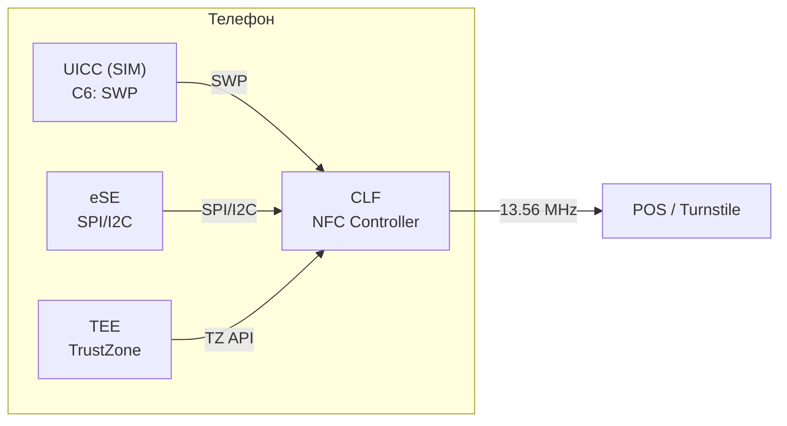
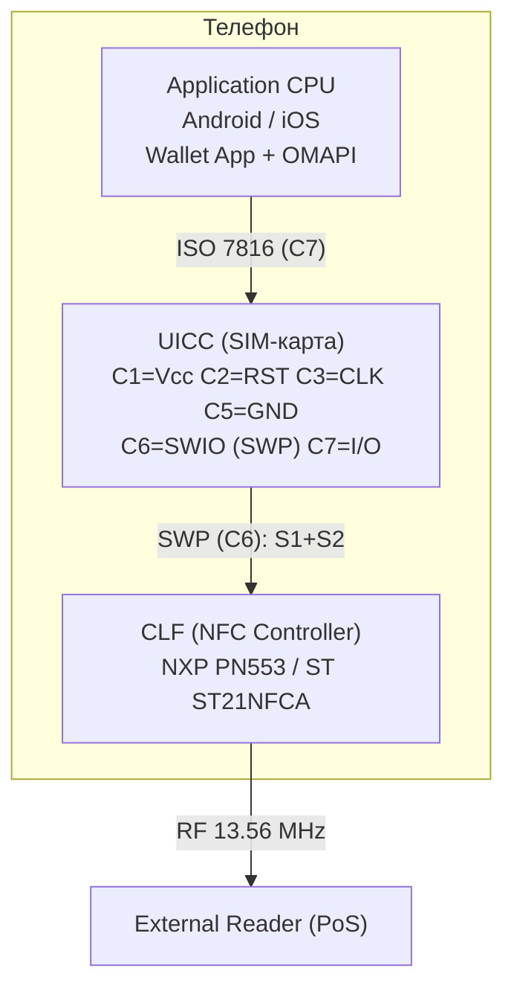
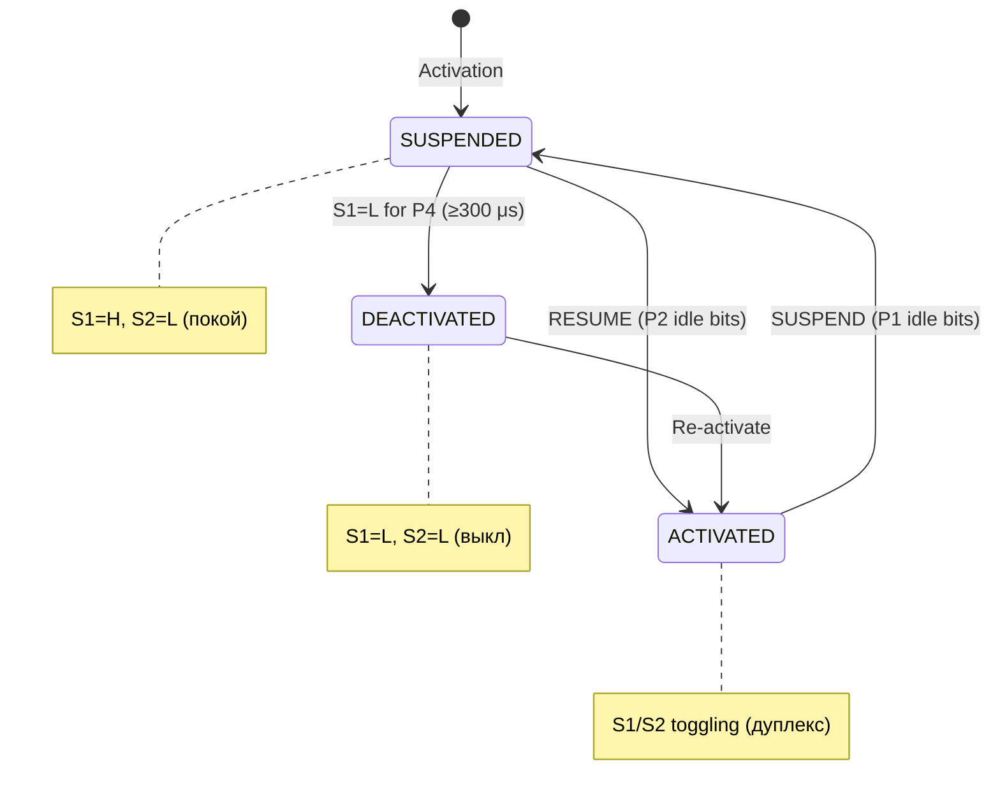
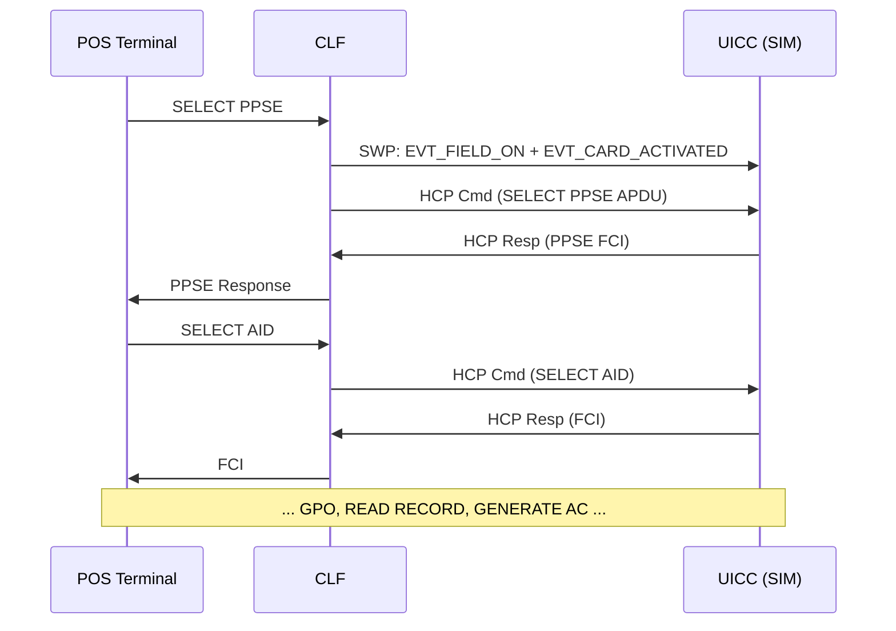
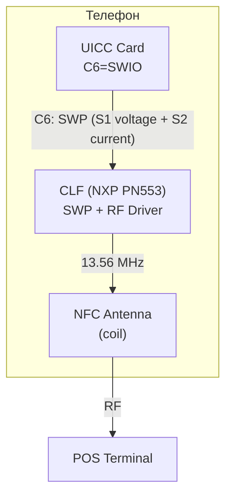
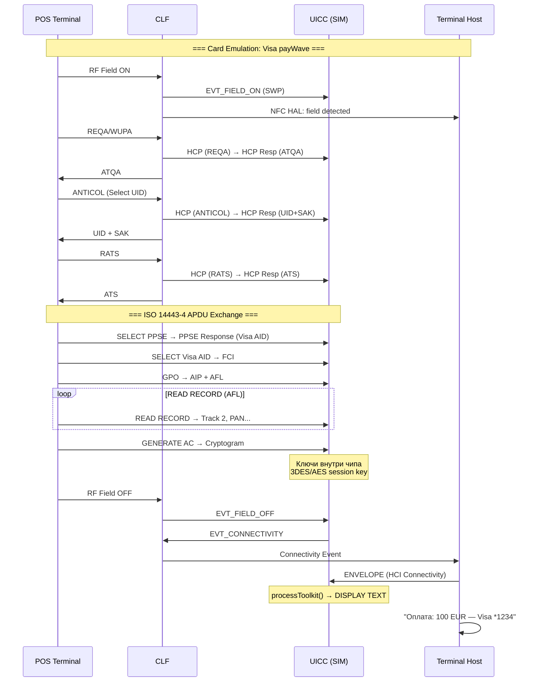

# SIM и NFC: Contactless Frontend (CLF), SWP, HCI

> **Research** — глубокий разбор взаимодействия SIM-карты с NFC-чипом: от физического уровня SWP до EMV-платежей, MIFARE-транспорта и HCE-безопасности.

---

## 1. Архитектура: SIM как Secure Element для NFC

### 1.1 Три компонента NFC-стека

Современный телефон содержит три независимых Secure Element, работающих одновременно:

| SE | Где | Владелец | Интерфейс с CLF | Примеры |
|---|---|---|---|---|
| **UICC SE** | SIM-карта | MNO | SWP через C6 | Visa/MC на SIM, MIFARE |
| **eSE** | Впаян в PCB | OEM | SPI/I2C | Apple Pay, Samsung Pay |
| **TEE** | SoC (TrustZone) | OEM + GP | TrustZone API | FIDO, DRM, Wallet UI |



**Фокус этого Research** — UICC (SIM) как Secure Element для contactless.

### 1.2 Принцип работы



> [!abstract] Ключевая идея
> UICC — **внешний Secure Element**, соединённый с CLF через один провод C6. Все contactless-приложения (платежи, транспорт, доступ) исполняются на SIM. CLF — лишь радиомост.

---

## 2. SWP — Single Wire Protocol (физический и канальный уровень)

### 2.1 Обзор

**SWP** (Single Wire Protocol) — бит-ориентированный, полнодуплексный протокол между CLF (master) и UICC (slave) через один провод. Определён в **ETSI TS 102 613** (V16.0.0, 2021). ^[extracted]

| Свойство | Значение |
|---|---|
| **Пин UICC** | C6 (SWIO — SWP I/O) |
| **Топология** | Master (CLF) → Slave (UICC) |
| **Дуплекс** | Full-duplex на одном проводе |
| **Скорость** | 212 Kb/s (default), до 1.695 Mb/s |
| **Рекомендуемая** | ≥ 848 Kb/s (GSMA NFC_REQ_22) |
| **Питание UICC** | От CLF через C1, ≤ 10 mA |

### 2.2 Физический уровень: S1 (Voltage) и S2 (Current)

SWP реализует full-duplex через одновременную модуляцию напряжения (S1, master→slave) и тока (S2, slave→master):

```
S1 (Voltage, Master→Slave):
  Логическая 1: S1=H 75% периода T, S1=L 25%
  Логическая 0: S1=H 25% периода T, S1=L 75%
  T = 1–5 μs (200 Kb/s – 1 Mb/s)

S2 (Current, Slave→Master):
  Только когда S1=H. S2=H → доп. ток 300-600 μA (лог. 1), S2=L (лог. 0)
```

Три состояния SWP:



### 2.3 Активация SWP

**Full init (новая UICC):**
1. CLF подаёт питание на C1, тактирование C3
2. CLF: S1 L→H (SUSPENDED)
3. CLF посылает ACT frame → UICC отвечает ACT_READY
4. CLF ждёт EVT_HCL_END_of_OPERATION или ≥2 сек inactivity

**Light init (известная UICC):**
1. CLF: GET_SESSION_ID → UICC возвращает сохранённый ID
2. CLF ждёт EVT_HCL_END_of_OPERATION или ≥2 сек inactivity

### 2.4 Data Link Layer: MAC + LLC

**MAC Frame** (HDLC-подобный framing):
```
┌──────┬─────────────────────┬──────────┬──────┐
│ SOF  │ Payload (≤30 bytes) │ CRC-16   │ EOF  │
│ 0x7E │                     │ CCITT    │ 0x7F │
└──────┴─────────────────────┴──────────┴──────┘
Slave→Master: добавлен 1-битный Wake-up (L→H) перед SOF.
Bit stuffing: 0 после 5 единиц; CRC: x^16+x^12+x^5+1
```

**Три LLC типа:**

| LLC | Назначение |
|---|---|
| **ACT** | Активация SWP |
| **SHDLC** | Основной канал APDU (Simplified HDLC) |
| **CLT** | Contactless Tunneling (MIFARE Classic, FeliCa) |

### 2.5 SHDLC (Simplified HDLC)

SHDLC — основной протокол для APDU-обмена:

```
Control Field (1-й байт payload):
  I-Frame: 0 N(S)[3] P/F N(R)[3]   — данные + seq
  S-Frame: 1 0 Type[2] P/F N(R)[3] — управление потоком
  U-Frame: 1 1 M[3] P/F M[2]       — setup/teardown
```

| Тип | Байт | Назначение |
|---|---|---|
| **I** | `0xxx xxxx` | APDU, N(S)+N(R) |
| **RR** | `1000 xxxx` | Ack до N(R)-1 |
| **REJ** | `1001 xxxx` | Go-back-N с N(R) |
| **SREJ** | `1011 xxxx` | Selective reject фрейма N(R) |
| **RSET** | `11xx xxxx` | Сброс/инициализация линка |
| **UA** | `11xx xxxx` | Ack RSET |

**Параметры:** w=4 (window), T1≤5ms×w/4, T2≥10ms, T3≤5ms.

**Установка соединения:**
```
CLF ──RSET(w=4, SREJ=1)──► UICC
CLF ◄──UA────────────────── UICC  (линк установлен, N(S)=N(R)=DN(R)=0)
```

### 2.6 CLT (Contactless Tunneling)

CLT используется для протоколов с жёсткими таймингами (MIFARE Classic, FeliCa). CLF не интерпретирует содержимое — работает как прозрачный мост. Требование GSMA **NFC_REQ_19**: handset SHALL support CLT.

---

## 3. HCI — Host Controller Interface

### 3.1 Обзор

**HCI** — логический интерфейс поверх SWP. Определён в **ETSI TS 102 622** (V15.0.0). Обеспечивает маршрутизацию, gates/pipes, транспорт APDU и уведомления о событиях.

### 3.2 Хосты, гейты, пайпы

| H_ID | Host |
|---|---|
| `'00'` | Host Controller (CLF) |
| `'01'` | Terminal Host (App CPU) |
| `'02'` | UICC Host (SIM) |

**Gates** — сервисные точки внутри хоста: Administration, Link Mgmt, Identity, Card Gate A/B, Reader Gate, Connectivity Gate. **Pipes** — логические каналы между гейтами (static — всегда, dynamic — по требованию).

### 3.3 HCP Message

```
┌──────────┬──────────┬─────────┬───────────┐
│ Header   │ Type     │ Length  │ Data      │
│ (1 byte) │ (1 byte) │ (1 byte)│ (N bytes) │
└──────────┴──────────┴─────────┴───────────┘
Header: PipeID[2] | RFU | Chain | Instruction[4]
Types: Command=0x00, Event=0x01, Response=0x02, Error=0x03
```

### 3.4 Ключевые HCI Events

| Event | Gate | Значение |
|---|---|---|
| **EVT_FIELD_ON/OFF** | Card App | RF-поле обнаружено/пропало |
| **EVT_CARD_ACTIVATED** | Card App | Карта выбрана ридером |
| **EVT_TRANSACTION** | Card App | Транзакция на RF |
| **EVT_CONNECTIVITY** | Connectivity | UICC → Terminal Host (мост к STK) |
| **EVT_HCL_END_of_OPERATION** | Admin | SWP-инициализация завершена |

### 3.5 APDU Transport через HCI



---

## 4. Contactless-приложения на UICC

### 4.1 Экосистема

| Категория | Приложения | Стандарт |
|---|---|---|
| **Платежи** | Visa payWave, MC PayPass, AmEx, PBOC | EMV Co Book C-2 |
| **Транспорт** | MIFARE, FeliCa, Calypso, CIPURSE | ISO 14443 |
| **ID/Доступ** | ePassport (ICAO 9303), eID | ISO 7816 |
| **Лояльность** | Bonus, Coupons | Proprietary |

### 4.2 EMV Contactless — PPSE Flow

**PPSE** — точка входа для EMV contactless. AID: `2PAY.SYS.DDF01`.

Flow: POS → SELECT PPSE → FCI (AID list: Visa, MC) → SELECT Visa AID → FCI (PDOL) → GPO → AIP+AFL → READ RECORD (Track 2, PAN) → GENERATE AC (криптограмма).

**Проблема нескольких апплетов:** два банковских апплета видят SELECT PPSE одновременно → конфликт. Решение: **CRS (Contactless Registry Service)** — Wallet выбирает активную карту, CRS открывает HCI pipe только для неё.

### 4.3 Транспортные карты (MIFARE)

| Продукт | Крипто | ISO 14443-4 | SWP Mode |
|---|---|---|---|
| **MIFARE Classic** | CRYPTO1 (взломан) | Нет | CLT |
| **MIFARE Plus** | AES-128 | Да (SL3) | SHDLC/CLT |
| **MIFARE DESFire EV3** | 3DES, AES | Да | SHDLC |
| **MIFARE Ultralight** | Нет/3DES | Нет | CLT |

DESFire EV3 сертифицирован **CC EAL5+** — уровень банковской карты.

**MIFARE4Mobile** (NXP + GSMA + операторы) — стандарт OTA-управления MIFARE на UICC:
- Install, Personalize, Top-up, Block через SCP80/SCP81
- API для Wallet, TSM и SE Platform
- Пример: Gemalto (2010) — первое DESFire-приложение в SIM, 40+ городов

**Временное требование для транспорта: ≤ 300 ms** на валидацию → нужна скорость SWP ≥ 848 Kb/s и оптимизация апплета.

---

## 5. STK и Contactless

### 5.1 TERMINAL PROFILE — Contactless биты

| Байт | Бит | Значение |
|---|---|---|
| 2 | 5 | Contactless communication (CLF) |
| 2 | 6 | SWP/HCI поддержка |
| 5 | 1 | Contactless state change |
| 15 | 5 | BIP Contactless |
| 17 | 8 | Contactless activation |

### 5.2 Contactless Proactive Commands

| Команда | Type | Назначение |
|---|---|---|
| **ACTIVATE** | `0x77` | Активировать/деактивировать contactless-приложение |
| **CONTACTLESS STATE CHANGED** | `0x36` | Уведомить UICC об изменении RF-состояния |

### 5.3 Contactless Events

| Event | Код | Как работает |
|---|---|---|
| **HCI Connectivity** | `0x13` | UICC → EVT_CONNECTIVITY → CLF → Terminal Host → ENVELOPE → UICC |

**Мост NFC → STK (показать уведомление после платежа):**
```
Applet process() → SWP EVT_CONNECTIVITY → CLF → Terminal Host
  → ENVELOPE(EVENT_DOWNLOAD, HCI Connectivity) → UICC
    → processToolkit() → DISPLAY TEXT "Оплата: 100 EUR"
```

> [!tip] NFC-апплет не может напрямую вызвать DISPLAY TEXT. HCI Connectivity Event — единственный мост между contactless-транзакцией и STK UI.

---

## 6. GlobalPlatform Contactless Framework

### 6.1 CRS (Contactless Registry Service)

Определён в **GP Card Spec 2.2 Amendment C**. CRS — менеджер contactless-приложений:

| Функция | Описание |
|---|---|
| **Регистрация** | Приложение регистрируется с AID и RF-параметрами |
| **Активация/Деактивация** | Вкл/выкл на RF через HCI gates |
| **Conflict Resolution** | Проверка пересечений SAK, ATQA, ATS |
| **PPSE Composition** | Формирование ответа на SELECT PPSE |
| **Priority Mgmt** | Приоритет приложения в PPSE |
| **Event Notification** | Через CREL уведомляет Wallet об изменениях |

**CRS Java Card API:**
```java
package org.globalplatform.contactless;
boolean isRegistered(AID appletAID);
void setActive(AID appletAID, boolean active);
AID[] getRegisteredApplications();
boolean resolveConflict(AID app1, AID app2);
byte[] getPPSEData();
```

### 6.2 Активация через Wallet

```
Wallet (Android) → OMAPI: SELECT CRS
                 → STORE DATA: SetActive(MC=true, Visa=false)
CRS on UICC:
  1. Проверяет RF-параметры на конфликты
  2. HCI Gate: MC pipe OPEN, Visa pipe CLOSE
  3. Обновляет PPSE FCI: только MC в ответе
  4. CREL записывает событие → Wallet получает уведомление
```

### 6.3 CREL и STID

**CREL** (Contactless Registry Event Listener) отслеживает все изменения реестра. При GET DATA от Wallet возвращает список изменений.

**STID** (Service Type ID) — 5 бит в AID, 32 типа сервисов (Payment, Ticketing, Transport, Loyalty, Access Control...). Позволяет Wallet группировать приложения по типу.

---

## 7. Практическая архитектура и платёжный flow

### 7.1 Физическая схема



### 7.2 Полный платёжный flow (Visa payWave через SIM)



### 7.3 Временные параметры

| Фаза | Время |
|---|---|
| RF detection + Anticollision | <30 ms |
| PPSE + AID SELECT | <50 ms |
| Transaction (GPO+READ+AC) | <200 ms |
| **Транспорт (MIFARE), требование** | **≤ 300 ms** |
| **EMV (стандартное)** | **< 500 ms** |

---

## 8. ETSI/GM Conformance Testing

| Стандарт | Содержание |
|---|---|
| **TS 102 694** (1-3) | SWP conformance: voltage, timing, framing, SHDLC, CLT |
| **TS 102 695** (1-3) | HCI conformance: gates, pipes, HCP, events |
| **GSMA TS.27** | NFC Handset Test Book |

**Ключевые GSMA требования:**

| ID | Требование |
|---|---|
| NFC_REQ_15 | Card emulation via UICC |
| NFC_REQ_19 | CLT mode support |
| NFC_REQ_20/21 | SWP/HCI support |
| NFC_REQ_22 | SWP speed ≥ 848 Kb/s |
| NFC_REQ_23 | Window sizes 3, 4 |
| NFC_REQ_08/09 | ISO 14443 Type A/B |

**ETSI TS 102 705** (V18.0.0) — UICC Contactless Framework API (Java Card):
```java
package uicc.contactless;
short getCLFState();
byte[] getCLFInfo();
boolean isRFProtocolSupported(byte protocol);
void requestActivation(short duration);

package uicc.contactless.registry;
boolean registerApplication(AID aid, byte[] rfParams);
void activate(AID aid); void deactivate(AID aid);
AID[] getActiveApplications();
```

---

## 9. Secure Element vs HCE — Безопасность

### 9.1 Сравнение архитектур

| Свойство | UICC SE (SIM) | HCE (Software) | HCE + TEE |
|---|---|---|---|
| **Хранение ключей** | Аппаратное (tamper-resistant) | Файл в ОС | TEE (TrustZone) |
| **Крипто-операции** | Внутри чипа | CPU Rich OS | Внутри TEE |
| **Изоляция** | Физическая (отдельный чип) | Process-level | Логическая (TrustZone) |
| **Защита от malware** | Полная | Частичная | Высокая |
| **Сертификация** | EAL4+ (eUICC), EAL5+ (DESFire) | Нет | EAL2+-EAL4+ |
| **Атаки на ОС** | Неприменимо | Уязвимо (root/kernel) | Устойчиво |
| **Физические атаки** | Возможны (DPA, decap) | Нет | Нет |
| **Производительность** | Медленнее (8-32-bit) | Быстрее (ARM A-cores) | Средняя |
| **Стоимость** | Высокая (TSM, MNO) | Низкая | Средняя |

### 9.2 HCE Defence-in-Depth

HCE компенсирует отсутствие SE пятью уровнями защиты:
1. **TEE** (опционально) — ARM TrustZone изоляция ключей
2. **Android Security** — SELinux, sandbox, Verified Boot
3. **Limited-Use Keys** — одноразовые/времянные ключи
4. **Tokenization** — PAN заменён на DPAN (токен)
5. **Risk Engine** — Real-time fraud detection, behavioral analysis

### 9.3 Когда что использовать

| Сценарий | Рекомендация | Причина |
|---|---|---|
| High-value payments (>€1K) | UICC SE / eSE | Физическая изоляция |
| Retail (<€100) | HCE + TEE | Баланс цена/безопасность |
| Public Transport | UICC SE (DESFire) | EAL5+, ≤300ms |
| Physical Access | UICC SE / eSE | Offline безопасность |
| Loyalty | HCE | Низкие требования |
| ePassport / eID | UICC SE | Гос. сертификация EAL5+ |

### 9.4 Индустрия

| Решение | Тип SE | Примечание |
|---|---|---|
| Apple Pay | eSE + TEE | Закрытая экосистема |
| Google Wallet (2011) | UICC SE | Требовал MNO |
| Google Wallet (2013+) | HCE + cloud | Свобода от MNO |
| Samsung Pay | eSE + MST | Аппаратный SE |
| Osaifu-Keitai (JP) | eSE (FeliCa) | Встроенный SE |

---

## 10. Сводные таблицы

### 10.1 Полный стек протоколов

```
┌─────────────────────────────────────────────────┐
│ Application: EMV, MIFARE, ePassport, FeliCa     │
├─────────────────────────────────────────────────┤
│ CRS/CREL (GP): Activation, PPSE, Conflicts      │
├─────────────────────────────────────────────────┤
│ HCI (TS 102 622): Gates, Pipes, HCP             │
├─────────────────────────────────────────────────┤
│ SWP Data Link (TS 102 613): MAC, SHDLC, CLT     │
├─────────────────────────────────────────────────┤
│ SWP Physical (TS 102 613): S1/S2, States        │
├─────────────────────────────────────────────────┤
│ Physical: C6=SWIO, C1/C2/C3/C5/C7, ISO 7816    │
└─────────────────────────────────────────────────┘
```

### 10.2 CLF-чипы

| Чип | Производитель | SWP | CLT | Max Speed |
|---|---|---|---|---|
| PN553 | NXP | Yes | Yes | 1.7 Mb/s |
| ST54K | STMicro | Yes | Yes | 1.7 Mb/s |
| PN81T | NXP | Yes | Yes | 848 Kb/s |
| BCM20793 | Broadcom | Yes | Yes | 848 Kb/s |
| NQ210/220 | Qualcomm | Yes | Yes | 848 Kb/s |

### 10.3 Specifications

| Стандарт | Версия | Фокус |
|---|---|---|
| ETSI TS 102 613 | V16.0.0 | SWP Physical + Data Link |
| ETSI TS 102 622 | V15.0.0 | HCI |
| ETSI TS 102 705 | V18.0.0 | UICC Contactless API |
| ETSI TS 102 223 | V12+ | CAT contactless events |
| ETSI TS 102 694/695 | V8+ | SWP/HCI Test Suites |
| GSMA NFC Handset | v1.0 | Handset requirements |
| GP Card Spec 2.2 Amd C | — | Contactless Services (CRS) |
| GP Card Spec 2.3 | — | Multi-SE, расширенный CRS |
| EMV Contactless | Book C-2 | Payment protocol |
| ISO 14443 | 1-4 | Proximity cards |
| MIFARE4Mobile | v2.0 | MIFARE OTA management |

### 10.4 Ключевые аббревиатуры

| Термин | Расшифровка |
|---|---|
| **SWP** | Single Wire Protocol — протокол UICC↔CLF (C6) |
| **SWIO** | SWP I/O — обозначение контакта C6 |
| **CLF** | Contactless Front-end — NFC-контроллер |
| **HCI** | Host Controller Interface — логический интерфейс поверх SWP |
| **HCP** | Host Controller Protocol — протокол сообщений HCI |
| **SHDLC** | Simplified HDLC — основной LLC для APDU |
| **CLT** | Contactless Tunneling — туннель RF для MIFARE/FeliCa |
| **CRS** | Contactless Registry Service — менеджер contactless-приложений |
| **CREL** | Contactless Registry Event Listener — слушатель CRS |
| **PPSE** | Proximity Payment System Environment — точка входа EMV |
| **HCE** | Host Card Emulation — программная эмуляция карты |
| **TEE** | Trusted Execution Environment — изолированная среда SoC |
| **TSM** | Trusted Service Manager — OTA-управление SE |
| **OMAPI** | Open Mobile API — доступ к SE из Android |

---

## Связи

- [[wiki/concepts/UICC|UICC Platform]] — платформа SWP/HCI
- [[wiki/concepts/CAT_STK|CAT/STK]] — proactive commands, contactless events
- [[wiki/concepts/GlobalPlatform_Card|GlobalPlatform Card]] — CRS, multi-app SE, SCP
- [[wiki/concepts/TEE|TEE]] — альтернативный SE в SoC
- [[wiki/concepts/UICC_Security|UICC Security]] — безопасность SE
- [[wiki/concepts/JavaCard|Java Card]] — платформа апплетов
- [[wiki/concepts/eSIM|eSIM]] — eUICC и contactless
- [[wiki/concepts/OTA_Remote_Management|OTA]] — SCP80 provisioning
- [[wiki/concepts/SCP|SCP]] — Secure Channel Protocol
- [[wiki/summaries/ts_102223|TS 102 223 (CAT)]]
- [[wiki/summaries/gpc_card_spec_2_3_1|GP Card Spec 2.3.1]]
- [[wiki/syntheses/sim_files_plmn|SIM Files — PLMN]]

### Рекомендуется добавить

- "ETSI TS 102 613" (Summary) — SWP Physical & Data Link Layer
- "ETSI TS 102 622" (Summary) — HCI Specification
- "ETSI TS 102 705" (Summary) — UICC Contactless API
- "GSMA NFC Handset Requirements" (Summary)
- "EMV Contactless Book C-2" (Summary)

---

> [!quote] Ключевой вывод
> SIM-карта — не просто телеком-модуль. Через SWP на пине C6 она превращается в **аппаратный Secure Element** для NFC. Весь стек — от модуляции напряжения (S1/S2) до EMV-криптограмм — работает внутри SIM. Телефон предоставляет лишь радио-интерфейс (CLF) и экран (через STK). Это позволяет сертифицировать SIM на EAL4+/EAL5+ независимо от телефона — что невозможно для чисто программных HCE-решений. Глубокое понимание SWP/HCI необходимо для разработки, отладки и сертификации contactless-приложений на UICC.
