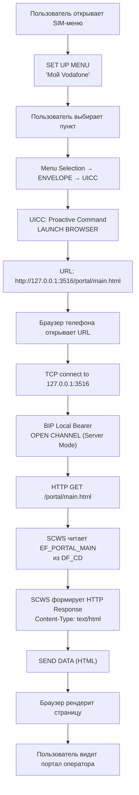
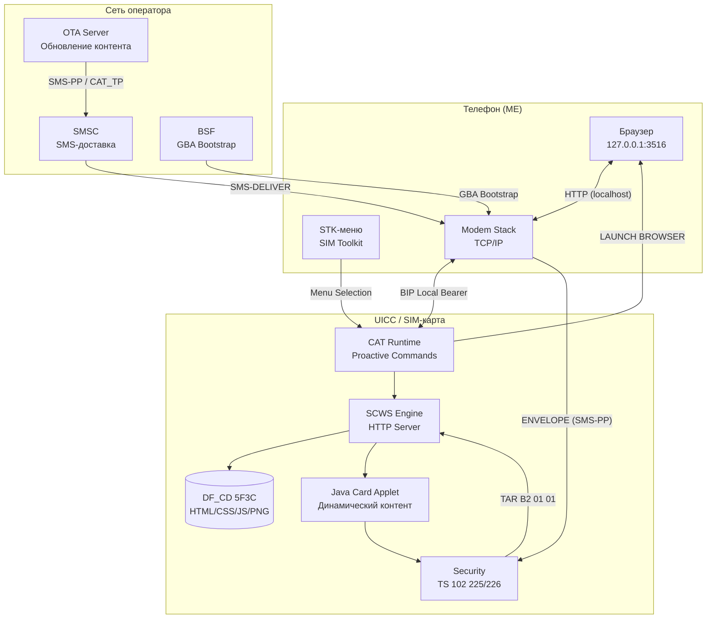

---
tags:
  - SCWS
  - BIP
  - CAT
  - STK
  - UICC
  - HTTP-server
  - OMA
  - TAR
  - research
type: research
level: advanced
created: 2026-06-12
updated: 2026-06-12
status: reviewed
sources:
  - "[[wiki/concepts/CAT_STK]]"
  - "[[wiki/concepts/OTA_Remote_Management]]"
  - "[[wiki/concepts/GlobalPlatform_Card]]"
  - "[[wiki/summaries/ts_102223]]"
  - "[[wiki/summaries/ts_101_220]]"
  - "[[wiki/summaries/ts_102225]]"
  - "[[wiki/summaries/ts_133220]]"
  - "[[wiki/syntheses/ota_evolution]]"
  - "[[wiki/syntheses/sim_files_5g]]"
---

# SIM как веб-сервер: SCWS + BIP — Полное руководство

> **Research** — Глубокое исследование архитектуры Smart Card Web Server: как UICC-карта становится HTTP-сервером, обслуживая веб-страницы через Bearer Independent Protocol. От физического хранения HTML в EF до маршрутизации OTA-обновлений через TAR `B2 01 01`.

---

## 1. Концепция SCWS: UICC как HTTP-сервер

### 1.1 Что такое Smart Card Web Server

**Smart Card Web Server (SCWS)** — это подсистема UICC, реализующая полноценный HTTP/1.1 сервер прямо на SIM-карте. SCWS обслуживает веб-страницы (HTML, CSS, JavaScript, изображения) хранящиеся в элементарных файлах UICC, и доставляет их браузеру телефона через локальный TCP-порт. ^[inferred]

В отличие от традиционного веб-сервера, работающего на полноценной ОС, SCWS функционирует на ресурсно-ограниченной платформе смарт-карты:
- **Процессор**: 8/16/32-битный микроконтроллер (обычно ARM SC000/SC300)
- **RAM**: 8-32 KB
- **EEPROM/Flash**: 128 KB — 2 MB (из них под SCWS обычно выделяется 32-256 KB)
- **Стек TCP/IP**: отсутствует на UICC — используется BIP через терминал

Стандартизирован консорциумом **OMA** (Open Mobile Alliance) в спецификации **OMA-TS-Smartcard-Web-Server-V1_0**. Интегрирован в экосистему ETSI/3GPP через механизмы CAT (Card Application Toolkit).

### 1.2 Как телефон обращается к SCWS

Телефон обращается к SCWS по **loopback-адресу** (localhost) через специальный TCP-порт:

```
http://127.0.0.1:3516/
```

Физически трафик маршрутизируется так:

```
┌─────────────┐  HTTP Request  ┌──────────┐  BIP (Local)  ┌──────────┐
│  Браузер    │  ────────────→ │ Modem    │  ───────────→ │  UICC    │
│  телефона   │  127.0.0.1:   │ (Terminal│  OPEN CHANNEL │  (SCWS)  │
│             │     3516       │  Server) │               │          │
└─────────────┘  ←──────────── │          │  ←─────────── │          │
   HTML/CSS/JS   HTTP Response └──────────┘  RECEIVE DATA └──────────┘
```

> [!note] Почему порт 3516?
> Порт **3516** зарегистрирован IANA как "Smartcard Web Server". Это стандартный TCP-порт, который терминал назначает BIP-каналу Local Bearer для SCWS.

### 1.3 Статические vs динамические страницы

SCWS поддерживает два типа контента:

| Тип | Описание | Пример |
|---|---|---|
| **Статический** | Предварительно загруженные файлы в EF UICC | HTML, CSS, JS, PNG, SVG |
| **Динамический** | Генерируется SCWS-приложением на лету | Баланс счёта, статус услуг, данные с UICC |

Статические страницы хранятся прямо в элементарных файлах (EF) директории **DF_CD** (Configuration Data). Это могут быть предустановленные на заводе страницы или загруженные через OTA.

Динамический контент генерируется Java Card апплетом или встроенным скриптовым движком SCWS, который имеет доступ к данным на UICC (IMSI, MSISDN, локация, статус услуг).

---

## 2. BIP (Bearer Independent Protocol): Как UICC получает TCP/IP

### 2.1 Фундаментальная проблема

UICC **не имеет** собственного TCP/IP-стека. Это смарт-карта с последовательным интерфейсом (ISO 7816), который физически не способен к IP-маршрутизации. Для передачи данных через интернет UICC использует **Bearer Independent Protocol (BIP)**, который позволяет UICC открывать сокеты **через модем терминала**.

BIP — это набор proactive команд CAT (ETSI TS 102 223, Clauses 6.4.27-6.4.31):

| Команда | Код | Описание |
|---|---|---|
| **OPEN CHANNEL** | `0x3B` (3G+) | Открыть TCP/UDP-соединение через модем терминала |
| **CLOSE CHANNEL** | `0x3C` (3G+) | Закрыть ранее открытый канал |
| **SEND DATA** | `0x3D` (3G+) | Отправить данные в открытый канал |
| **RECEIVE DATA** | `0x3E` (3G+) | Получить данные из открытого канала |
| **GET CHANNEL STATUS** | `0x3F` (3G+) | Проверить состояние канала |

### 2.2 UICC Server Mode vs Terminal Server Mode

BIP поддерживает два режима работы, критически важных для SCWS:

#### UICC Server Mode
UICC выступает **сервером** — слушает TCP-порт, к которому подключается внешний клиент (в случае SCWS — браузер телефона):

```
Terminal (клиент) ──TCP connect──→ UICC (сервер, слушает порт)
```

- Используется SCWS
- UICC ждёт входящего соединения (listen)
- Терминал открывает канал → уведомляет UICC через ENVELOPE (Data Available)
- UICC отправляет/получает данные через SEND DATA / RECEIVE DATA

#### Terminal Server Mode
UICC выступает **клиентом** — подключается к внешнему серверу в интернете через модем:

```
UICC (клиент) ──TCP connect──→ Внешний сервер (интернет)
```

- Используется для OTA (CAT_TP), IoT, банкинга
- UICC отправляет OPEN CHANNEL с адресом внешнего сервера
- Модем выполняет TCP-соединение и передаёт данные UICC

### 2.3 BIP-каналы и типы bearer'ов

BIP поддерживает несколько типов каналов передачи данных, определяемых при открытии канала:

| Bearer Type | Код | Описание | Скорость | Применение |
|---|---|---|---|---|
| **CS (CSD)** | `0x01` | Circuit Switched Data | 9.6-14.4 kbps | Устаревший |
| **GPRS/EDGE** | `0x02` | Packet-switched 2G/2.5G | 40-230 kbps | Базовые OTA-обновления |
| **UMTS (3G)** | `0x03` | 3G PS | 384 kbps — 2 Mbps | SCWS, RAM over IP |
| **LTE (4G)** | `0x04` | 4G PS | 10-150 Mbps | SCWS, большие апплеты |
| **NR (5G)** | `0x05` | 5G PS | 100+ Mbps | Будущие применения |
| **Local Bearer** | `0x06` | Локальный TCP/IP внутри терминала | Мгновенный (localhost) | **SCWS (основной)** |
| **Bluetooth** | `0x07` | Bluetooth-соединение | ~1-3 Mbps | IoT, wearables |
| **IMS** | `0x08` | IP Multimedia Subsystem | — | VoLTE/VoNR companion |
| **Default Bearer** | `0x09` | Использует текущий data-канал | Зависит от RAT | Mixed applications |

Для SCWS используется преимущественно **Local Bearer** (`0x06`) — самый быстрый и надёжный, так как трафик не покидает телефон. В некоторых реализациях может использоваться и сетевой bearer для доступа к SCWS извне (например, для удалённой диагностики оператором).

### 2.4 Жизненный цикл BIP-канала

```mermaid
sequenceDiagram
    participant U as UICC (SCWS)
    participant T as Terminal (ME)
    participant B as Browser
    participant N as Network

    Note over U,T: ═══ 1. Инициализация ═══
    U->>T: TERMINAL PROFILE (BIP supported)
    Note over T: Бит: BIP = 1

    Note over U,T: ═══ 2. Открытие канала ═══
    U->>T: Proactive: OPEN CHANNEL<br/>(Bearer=Local, Port=3516, Server Mode)
    T->>T: Открывает TCP listener<br/>127.0.0.1:3516
    T-->>U: TERMINAL RESPONSE<br/>(Channel ID=01, Result=OK)

    Note over U,T,B: ═══ 3. Входящее HTTP-соединение ═══
    B->>T: HTTP GET http://127.0.0.1:3516/index.html
    T->>U: ENVELOPE (Data Available, Channel=01)
    U->>T: FETCH → RECEIVE DATA
    T-->>U: TERMINAL RESPONSE<br/>(GET /index.html HTTP/1.1)
    Note over U: SCWS обрабатывает запрос<br/>Читает EF в DF_CD

    Note over U,T,B: ═══ 4. HTTP-ответ ═══
    U->>T: SEND DATA<br/>(HTTP/1.1 200 OK + HTML)
    T-->>U: TERMINAL RESPONSE (OK)
    T->>B: HTTP/1.1 200 OK<br/><html>...операторский портал...</html>

    Note over U,T,B: ═══ 5. Дополнительные запросы ═══
    B->>T: HTTP GET /style.css
    Note over U,T: Цикл RECEIVE → SEND повторяется

    Note over U,T: ═══ 6. Закрытие ═══
    B->>T: Закрытие соединения
    T->>U: ENVELOPE (Channel Status, Closed)
    U->>T: CLOSE CHANNEL
    T-->>U: TERMINAL RESPONSE (OK)
```

> [!important] Одновременные каналы
> UICC может иметь **несколько одновременных BIP-каналов** (обычно до 7). Например: один канал для SCWS (Local Bearer), другой для OTA CAT_TP (GPRS/4G), третий для IoT.

---

## 3. Файловая система SCWS

### 3.1 DF_CD (Configuration Data)

**DF_CD** (`0x5F3C`) — специализированная директория на UICC для хранения конфигурации и контента CAT-приложений, включая SCWS. Это основное место хранения веб-страниц.

```
MF (3F00)
│
├── ADF.USIM
│   └── DF_5GS (5FC1)
│
├── DF_CD (5F3C)         ← SCWS и другие CAT-приложения
│   ├── EF_LAUNCH_PAD    ← Точки входа (URL/пункты меню)
│   ├── EF_ICON          ← Иконки для отображения в меню
│   ├── EF_LAUNCH_PAD_KEYS   ← Ключи для защищённого запуска
│   ├── EF_WWW           ← HTML/CSS/JS страницы (статические)
│   ├── EF_IMG           ← PNG/GIF изображения
│   └── ...              ← Другие EF для SCWS-приложений
│
├── DF_TELECOM
└── ...
```

### 3.2 Ключевые EF для SCWS

#### EF_LAUNCH_PAD (точка входа)
Содержит список "запускных" URL-ов, которые могут быть открыты через STK-меню или LAUNCH BROWSER:

| Поле | Размер | Описание |
|---|---|---|
| **Alpha Identifier** | переменный | Название (например "Мой оператор") |
| **URL** | переменный | http://127.0.0.1:3516/portal/index.html |
| **Icon Identifier** | 1 байт | Ссылка на иконку в EF_ICON |
| **Launch Condition** | 1 байт | Когда показывать: always, roaming only, home only |

#### EF_ICON (графика)
Содержит иконки в формате **Basic Icon** (ETSI TS 102 223 Annex B):
- Цветовая палитра: 1/2/4/8 бит на пиксель
- Максимальный размер: 32×32 пикселя (обычно)
- Формат: BMP-подобный raw bitmap

#### EF_WWW (веб-контент)
Статические ресурсы SCWS — HTML-страницы, CSS-стили, JavaScript-файлы. Хранятся как Transparent EF (**не** как обычные файлы с файловой системой):
- Каждая "страница" — один EF
- URL-путь маппится напрямую на EF внутри DF_CD
- `/index.html` → EF_INDEX
- `/css/style.css` → EF_STYLE
- `/js/app.js` → EF_APPJS

#### EF_IMG (изображения)
Графические ресурсы в форматах PNG, GIF, JPEG (реже):
- Ограничены размером EEPROM (обычно 2-10 KB на изображение)
- Используются для логотипов оператора, фонов, иконок сервисов

### 3.3 Ограничения размера

SCWS работает в экстремально ограниченной среде:

| Ресурс | Типичный объём | Примечание |
|---|---|---|
| **EEPROM под SCWS** | 32-256 KB | Выделяется при производстве карты |
| **RAM (heap)** | 2-8 KB | Для HTTP-парсинга и генерации ответа |
| **Макс. размер одной страницы** | 4-32 KB | Определяется размером буфера SEND DATA |
| **Макс. общий контент** | 64-256 KB | Все HTML+CSS+JS+PNG вместе |
| **Размер изображения** | 2-10 KB | Иконки 32×32, логотипы ~5 KB |

Для сравнения: средняя страница в интернете весит ~2 MB. SCWS-страница умещается в ~5-15 KB — это минималистичный HTML с inlined CSS, без внешних библиотек, сжатый до предела.

---

## 4. TAR и маршрутизация SCWS

### 4.1 Специальные TAR-значения для SCWS

SCWS имеет два зарегистрированных TAR (Toolkit Application Reference) в реестре ETSI TS 101 220:

| TAR | Назначение | Направление |
|---|---|---|
| `B2 01 01` | **SCWS** — основное приложение Smart Card Web Server | OTA → SCWS (обновление контента) |
| `B2 01 02` | **SCWS Administrative Agent** — административный агент SCWS | OTA → SCWS Agent (конфигурация, управление) |

### 4.2 Маршрутизация OTA-сообщений к SCWS

Когда OTA-сервер оператора отправляет обновление контента для SCWS, используется следующая цепочка:

```
OTA Server
  │
  ▼ SMS-DELIVER (TP-UD = Command Packet)
  │  SPI = 0x12 (шифрование + MAC)
  │  TAR = B2 01 01 (SCWS)
  │
  ▼ Terminal (ME)
  │  ENVELOPE (SMS-PP)
  │
  ▼ UICC
  │  Проверка TAR:
  │  • B2 01 01 → доставка SCWS-апплету
  │  • B2 01 02 → доставка Admin Agent
  │
  ▼ SCWS Applet
     Распаковка Secured Packet
     → Извлечение APDU команд
     → UPDATE/STORE DATA в EF_WWW, EF_IMG и т.д.
     → REFRESH (сообщить терминалу об изменениях)
```

### 4.3 Обновление контента через OTA

Оператор может обновлять SCWS-контент удалённо без физического доступа к карте:

1. **Создание контента**: оператор готовит HTML/CSS/JS для обновления
2. **Упаковка в APDU**: контент разбивается на APDU-команды `STORE DATA` или `UPDATE BINARY`
3. **Secured Packet (TS 102 225)**: APDU шифруются и подписываются MAC для защиты
4. **Command Packet (TS 102 226)**: пакет с TAR `B2 01 01` и SPI=0x12
5. **SMS-доставка**: один или несколько SMS-DELIVER (конкатенированные SMS для больших обновлений)
6. **Приём UICC**: TAR-маршрутизация → SCWS апплет → обновление EF
7. **REFRESH**: UICC уведомляет терминал об изменении файлов

Для больших обновлений (например, новый логотип PNG 10 KB) используется **CAT_TP** поверх BIP вместо SMS — значительно быстрее и надёжнее.

---

## 5. SCWS vs OTA vs STK: Сравнительный анализ

### 5.1 Три механизма взаимодействия оператора с UICC

```
┌─────────────────────────────────────────────────────────────────┐
│                     ОПЕРАТОРСКИЙ ИНТЕРФЕЙС                      │
│                                                                 │
│  ┌──────────────┐  ┌──────────────┐  ┌──────────────────────┐  │
│  │  STK (CAT)   │  │  SCWS        │  │  OTA (Remote Mgmt)   │  │
│  │  Простой UI  │  │  Богатый UI  │  │  Фоновое обновление  │  │
│  ├──────────────┤  ├──────────────┤  ├──────────────────────┤  │
│  │ Текстовое    │  │ HTML/CSS/JS  │  │ APDU-команды         │  │
│  │ меню         │  │ страницы     │  │                      │  │
│  │              │  │              │  │                      │  │
│  │ DISPLAY TEXT │  │ HTTP Server  │  │ SMS-PP / CAT_TP      │  │
│  │ SET UP MENU  │  │ на UICC      │  │                      │  │
│  │ GET INPUT    │  │              │  │ UPDATE FILE          │  │
│  │              │  │              │  │ INSTALL APPLET       │  │
│  └──────────────┘  └──────────────┘  └──────────────────────┘  │
│         ▲                 ▲                    ▲               │
│         │                 │                    │               │
│         └─────────────────┴────────────────────┘               │
│                    Все используют CAT/APDU                      │
└─────────────────────────────────────────────────────────────────┘
```

### 5.2 Детальное сравнение

| Критерий | STK (SIM Toolkit) | SCWS (Smart Card Web Server) | OTA (Over-the-Air) |
|---|---|---|---|
| **Тип интерфейса** | Текстовые меню и диалоги | Полноценные веб-страницы | Нет UI (фоновый) |
| **UI-возможности** | Текст, списки, ввод строки | HTML5, CSS3, JS, PNG/SVG | Отсутствует |
| **Инициатор** | UICC → проактивная команда | Браузер → HTTP-запрос | OTA-сервер → push |
| **Хранение** | Встроено в апплет (код) | EF в DF_CD (файлы) | Не применимо |
| **Обновление** | Через OTA (новый апплет) | OTA-обновление EF_WWW | Само OTA |
| **Скорость обновления** | Медленно (загрузка апплета) | Быстро (обновление файлов) | N/A |
| **Интерактивность** | Пошаговая (меню→меню) | Свободная навигация | Нет |
| **Сложность разработки** | Низкая (Java Card + STK API) | Средняя (HTML/JS + SCWS API) | Высокая (APDU, crypto) |
| **Размер контента** | ~2-5 KB (код апплета) | 32-256 KB (HTML/CSS/PNG) | Нет контента |
| **Требования к телефону** | CAT-поддержка (все телефоны) | Специальный SCWS-клиент | Прозрачно |
| **Безопасность** | Через UICC (нет сети) | Локальный (localhost) | Шифрование + MAC |

### 5.3 Когда что использовать

| Сценарий | Лучший механизм | Почему |
|---|---|---|
| **Баланс и тарифы** | SCWS | Богатый UI с графиками, таблицами |
| **Быстрое меню (1-2 клика)** | STK | Просто, быстро, оффлайн |
| **Обновление PLMN-списка** | OTA | Фоновое, невидимое пользователю |
| **Подтверждение платежа** | SCWS | Полноценная форма с валидацией |
| **SMS-сервисы** | STK | Нативные SMS-команды |
| **Установка нового апплета** | OTA | Полный lifecycle управления |
| **Операторский портал** | SCWS | Навигация, мультимедиа, закладки |
| **Экстренные уведомления** | STK | DISPLAY TEXT с высоким приоритетом |

---

## 6. Практический пример: операторский портал на SCWS

### 6.1 Сценарий

Оператор "Vodafone" хочет предоставить абонентам портал самообслуживания прямо с SIM-карты:
- Проверка баланса
- Информация о тарифе
- Подключение/отключение услуг
- Новости и акции

### 6.2 Что хранится на UICC

```
DF_CD (5F3C)
├── EF_LAUNCH_PAD
│   Запись 1: AlphaId = "Мой Vodafone", URL = http://127.0.0.1:3516/portal/main.html
│   Запись 2: AlphaId = "Баланс", URL = http://127.0.0.1:3516/portal/balance.html
│   Запись 3: AlphaId = "Услуги", URL = http://127.0.0.1:3516/portal/services.html
│
├── EF_PORTAL_MAIN (HTML страница, ~4 KB)
│   <!DOCTYPE html>
│   <html lang="ru">
│   <head><meta charset="UTF-8"><link rel="stylesheet" href="/css/main.css"></head>
│   <body>
│       <h1>Мой Vodafone</h1>
│       <p>Баланс: <span id="balance">загрузка...</span></p>
│       <a href="/portal/balance.html">Подробнее о балансе</a>
│       <a href="/portal/services.html">Мои услуги</a>
│   </body>
│   </html>
│
├── EF_PORTAL_BALANCE (HTML ~2 KB)
│   Таблица с детализацией баланса
│
├── EF_PORTAL_SERVICES (HTML ~3 KB)
│   Список подключенных услуг с переключателями
│
├── EF_MAIN_CSS (CSS ~1 KB)
│   Стили для всех страниц
│
├── EF_PORTAL_JS (JavaScript ~2 KB)
│   AJAX-запросы для динамического получения данных
│
└── EF_LOGO_PNG (PNG ~5 KB)
    Логотип Vodafone
```

### 6.3 Как пользователь открывает портал



### 6.4 Пошаговая последовательность APDU

```
Шаг 1: Пользователь открывает SIM Toolkit меню
  Me -> UICC: ENVELOPE (Menu Selection)
    D3 05 00 01 01 01 90 00
    (Item ID = 1, "Мой Vodafone")

Шаг 2: UICC выдаёт LAUNCH BROWSER
  Me <- UICC: '91 XX' (FETCH pending)
  Me -> UICC: FETCH
    D0 22 81 03 01 3A 00 82 02 81 82 31 1E
    68 74 74 70 3A 2F 2F 31 32 37 2E 30 2E 30 2E 31
    3A 33 35 31 36 2F 70 6F 72 74 61 6C 2F 6D 61 69 6E 2E 68 74 6D 6C
    Разбор:
    81 03 01 3A 00 — Command Details (LAUNCH BROWSER, no qualifier)
    82 02 81 82    — Device Identities (UICC → ME)
    31 1E          — URL (Tag 31h, Len 30)
    68 74...       — "http://127.0.0.1:3516/portal/main.html"

Шаг 3: Браузер выполняет HTTP-запрос
  Me -> UICC: ENVELOPE (Data Available, Channel 01)
  Me -> UICC: RECEIVE DATA
    → "GET /portal/main.html HTTP/1.1\r\nHost: 127.0.0.1:3516\r\n\r\n"

Шаг 4: SCWS отвечает
  Me <- UICC: SEND DATA
    → "HTTP/1.1 200 OK\r\nContent-Type: text/html\r\nContent-Length: 4096\r\n\r\n"
    → "<html>...содержимое EF_PORTAL_MAIN...</html>"
```

---

## 7. Применение SCWS

### 7.1 Операторские порталы

**Основное и исторически первое применение SCWS.** Оператор размещает портал самообслуживания на SIM-карте:

- **Баланс и тарификация**: актуальный баланс, история списаний
- **Управление услугами**: подключение/отключение VoLTE, роуминга, MMS
- **Новости и акции**: персонализированные предложения
- **Контакты поддержки**: direct call to operator, чат

**Преимущества перед USSD и SMS**:
- USSD: 182 символа, сессионная модель, только текст
- SMS: 160 символов, нет интерактивности
- SCWS: полноценные веб-страницы, HTML/CSS, изображения, навигация

### 7.2 M2M / IoT: конфигурация через SCWS

В промышленных и IoT-сценариях SCWS предоставляет веб-интерфейс для локальной конфигурации устройства:

```
┌──────────────────────────────────────────────────────┐
│              IoT-устройство (счётчик, сенсор)         │
│                                                      │
│  ┌──────────┐  BIP Local   ┌────────────────────┐   │
│  │ SCWS на  │←───────────→│ Локальный Wi-Fi/Eth │   │
│  │ UICC     │   HTTP       │ администратора     │   │
│  └──────────┘              └────────────────────┘   │
│                                                      │
│  SCWS-страницы:                                      │
│  • Статус устройства (online/offline, uptime)        │
│  • Параметры подключения (APN, частота отчётов)     │
│  • Диагностика (сигнал, ошибки, статистика)         │
│  • Обновление прошивки (загрузка через BIP)         │
└──────────────────────────────────────────────────────┘
```

Преимущества для IoT:
- Не требует внешнего веб-сервера на устройстве
- Не зависит от ОС устройства (работает на уровне UICC)
- Безопасность на уровне смарт-карты (аппаратная защита)
- Удалённое обновление конфигурации через OTA

### 7.3 Банкинг: безопасный UI для подтверждения транзакций

SCWS рассматривается как платформа для **Trusted UI** в мобильном банкинге:

```
┌──────────────────────────────────────────────┐
│  Пользователь инициирует перевод в приложении │
│  банка на телефоне                           │
│                                              │
│  1. Приложение: "Перевод 5000₽ на счёт X"   │
│  2. Приложение перенаправляет на             │
│     http://127.0.0.1:3516/bank/confirm.html  │
│  3. SCWS показывает форму подтверждения      │
│     (на UICC, не на ОС телефона!)            │
│  4. Пользователь нажимает "Подтвердить"      │
│  5. SCWS криптографически подписывает        │
│     транзакцию ключом из UICC                │
│  6. Банк получает подписанную транзакцию     │
│     → высокая гарантия подлинности           │
│                                              │
│  Почему безопаснее:                          │
│  • UI выполняется на UICC, не на ОС телефона  │
│  • Компрометация ОС не даёт доступа к UICC   │
│  • Ключи подписи никогда не покидают UICC     │
│  • Защита от malware, подменяющего экран     │
└──────────────────────────────────────────────┘
```

Это относится к концепции **Trusted Path** в GlobalPlatform — взаимодействие пользователя напрямую с UICC, минуя потенциально скомпрометированную ОС телефона.

### 7.4 Аутентификация через GBA (Generic Bootstrapping Architecture)

SCWS может использовать **GBA** (3GPP TS 33.220) для безопасной аутентификации:

1. Браузер пытается открыть SCWS-страницу с аутентификацией
2. SCWS требует HTTP Digest Authentication
3. Телефон выполняет GBA bootstrap с BSF (Bootstrapping Server Function) сети
4. На основе UICC-аутентификации генерируется общий секрет Ks_NAF
5. Браузер аутентифицируется на SCWS, используя производные от Ks_NAF

GBA позволяет SCWS проверять, что запрос действительно исходит от авторизованного абонента сети — без необходимости ввода логина и пароля.

### 7.5 Ограничения и вызовы SCWS

| Проблема | Описание | Решение/обход |
|---|---|---|
| **Поддержка телефонами** | Не все телефоны имеют SCWS-клиент | Требуется сертификация (GCF/PTCRB) |
| **Размер контента** | EEPROM ограничен 256 KB | Минималистичные страницы, сжатие |
| **Сложность разработки** | Требуется знание CAT + HTML + OTA | Специализированные SDK |
| **Скорость загрузки** | BIP Local — быстрый, BIP Network — медленный | Кэширование в браузере |
| **Обновление контента** | OTA-цикл дорог (SMS) | CAT_TP для больших обновлений |
| **Конкуренция с приложениями** | Родные приложения богаче функционально | Нишевое применение (безопасность) |
| **eSIM** | В eSIM нет гарантии физического DF_CD | Стандартизация в GSMA SGP.22 |

---

## 8. Архитектурный обзор: полная картина



---

## 9. Связи с другими концепциями

### 9.1 Прямые зависимости

| Концепция | Роль в SCWS | Ссылка |
|---|---|---|
| **CAT/STK** | Proactive команды (OPEN CHANNEL, LAUNCH BROWSER, SEND/RECEIVE DATA) | [[wiki/concepts/CAT_STK]] |
| **BIP** | Транспорт TCP/IP через терминал (Local Bearer, GPRS, LTE) | [[wiki/concepts/CAT_STK#BIP (Bearer Independent Protocol)]] |
| **OTA** | Удалённое обновление контента через SMS-PP / CAT_TP | [[wiki/concepts/OTA_Remote_Management]] |
| **TAR** | Маршрутизация `B2 01 01` (SCWS), `B2 01 02` (Admin Agent) | [[wiki/summaries/ts_101_220]] |
| **UICC File System** | DF_CD, EF_LAUNCH_PAD, EF_ICON, EF_WWW, EF_IMG | [[wiki/concepts/UICC_File_System]] |
| **GlobalPlatform** | Security Domains, управление апплетами | [[wiki/concepts/GlobalPlatform_Card]] |
| **GBA** | Аутентификация пользователя на SCWS | [[wiki/summaries/ts_133220]] |
| **Secured Packet** | Защита OTA-обновлений SCWS-контента | [[wiki/summaries/ts_102225]] |
| **eCAT** | Расширенный CAT для удалённого управления | [[wiki/summaries/ts_102223]] |

### 9.2 Косвенные связи

| Концепция | Связь | Ссылка |
|---|---|---|
| **Java Card Applet** | SCWS-апплеты написаны на Java Card | [[wiki/concepts/JavaCard_Applet_Development]] |
| **STK Applet** | LAUNCH BROWSER из STK-меню | [[wiki/concepts/STK_Applet]] |
| **5G Bearers** | NR как транспорт для BIP (высокая скорость) | [[wiki/syntheses/sim_files_5g]] |
| **EF_ICON** | Иконки для SCWS-страниц | [[wiki/research/operator_icons_on_sim]] |

---

## 10. Выводы

### 10.1 Ключевые инсайты

1. **SCWS — это полноценный HTTP-сервер в SIM-карте.** Он обслуживает веб-страницы через BIP Local Bearer по адресу `http://127.0.0.1:3516/`, не требуя внешнего сервера.

2. **BIP — транспортный мост.** Без BIP UICC не может общаться через TCP/IP. BIP использует модем терминала как прокси для передачи данных, поддерживая CS, GPRS, 3G, 4G, 5G и Local Bearer.

3. **Файловая система — хранилище контента.** HTML, CSS, JS и PNG хранятся как Transparent EF в DF_CD. Суммарный объём контента ограничен 32-256 KB, что требует минималистичного дизайна страниц.

4. **TAR — ключ к OTA-обновлению.** TAR `B2 01 01` маршрутизирует OTA-сообщения к SCWS, а `B2 01 02` — к административному агенту. Оператор может обновлять весь контент SCWS удалённо через SMS или CAT_TP.

5. **SCWS + STK — комплементарная пара.** STK обеспечивает быстрый вход через SIM-меню (LAUNCH BROWSER), а SCWS — богатый пользовательский опыт через HTML/CSS/JS. Они не конкурируют, а дополняют друг друга.

6. **Безопасность на уровне UICC.** SCWS-страницы выполняются на SIM-карте, изолированной от ОС телефона. Это делает SCWS привлекательной платформой для банкинга и подтверждения критических операций (Trusted UI).

### 10.2 Будущее SCWS

С развитием eSIM (GSMA SGP.22) и появлением мощных встроенных secure elements, архитектура SCWS эволюционирует:
- **iUICC** (integrated UICC): SCWS может обслуживать страницы конфигурации eSIM-профилей
- **IoT SAFE** (GSMA): SCWS как веб-интерфейс для IoT-устройств с zero-touch provisioning
- **5G Network Slicing**: SCWS как интерфейс управления слайсами (URSP), хранящимися на UICC

Однако конкуренция со стороны полноценных мобильных приложений ограничивает применение SCWS нишами, где безопасность UICC важнее богатства UI: банкинг, IoT-конфигурация, операторские порталы на бюджетных телефонах (без смарт-ОС).

---

## 11. Ссылки

- **CAT/STK**: [[wiki/concepts/CAT_STK|Card Application Toolkit / STK]] — proactive commands, BIP
- **OTA**: [[wiki/concepts/OTA_Remote_Management|OTA — Удалённое управление SIM]] — SMS-PP, CAT_TP, TAR-маршрутизация
- **GP Card**: [[wiki/concepts/GlobalPlatform_Card|GlobalPlatform Card]] — Security Domains, управление
- **TS 102 223**: [[wiki/summaries/ts_102223|CAT Specification]] — BIP section, OPEN CHANNEL
- **TS 101 220**: [[wiki/summaries/ts_101_220|ETSI Numbering]] — TAR `B2 01 01`, `B2 01 02`
- **TS 102 225**: [[wiki/summaries/ts_102225|Secured Packet]] — защита OTA для SCWS
- **TS 33.220**: [[wiki/summaries/ts_133220|GBA]] — аутентификация на SCWS
- **OTA Evolution**: [[wiki/syntheses/ota_evolution|OTA: от SMS-PP к eSIM RSP]] — эволюция транспорта
- **5G Files**: [[wiki/syntheses/sim_files_5g|DF_5GS]] — bearer context для 5G
- **Иконки**: [[wiki/research/operator_icons_on_sim|Иконки оператора]] — EF_ICON, EF_IMG
- **STK Applet**: [[wiki/concepts/STK_Applet|STK Applet Development]] — LAUNCH BROWSER из Java Card
