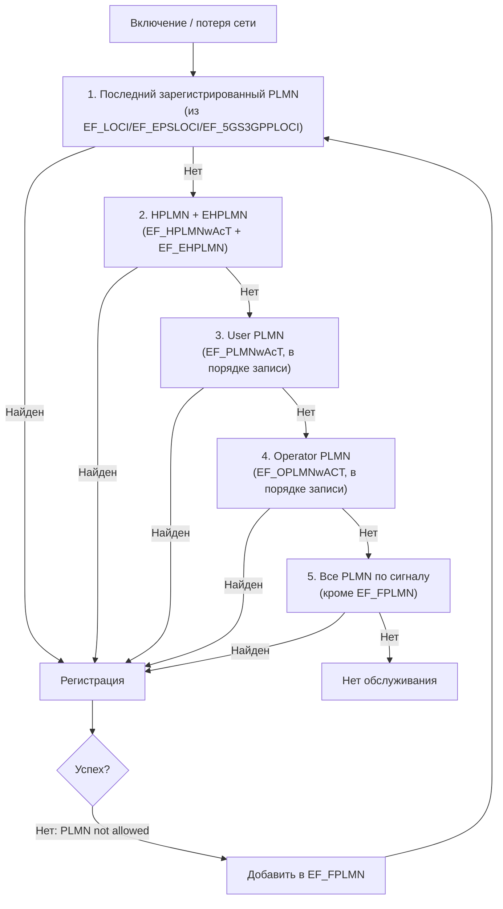
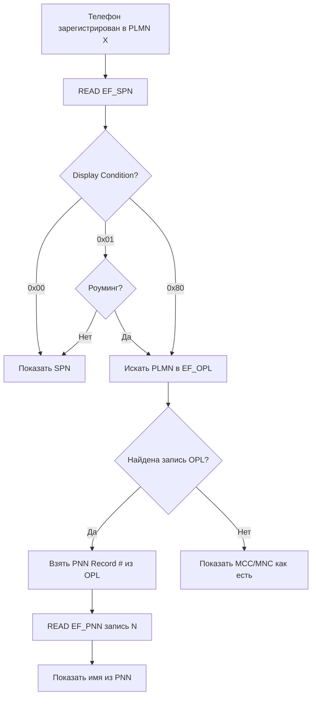
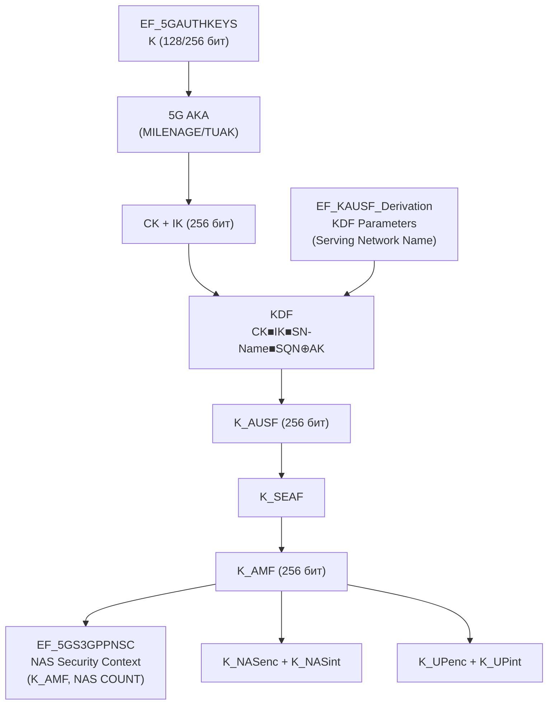
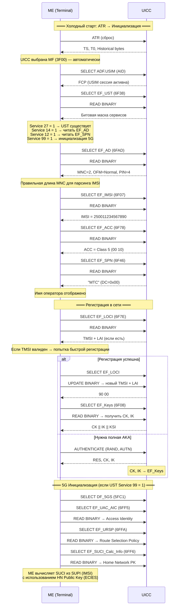

# EF-каталог USIM: Исчерпывающий справочник каждого элементарного файла в ADF.USIM

> **Research** — полный каталог всех ключевых EF внутри ADF.USIM с FID, размером, типом, правами доступа, байт-в-байт структурой, hex-примерами и сценариями реального использования. Охватывает 120+ файлов в 10 группах + 14 DF. Значительно глубже, чем [[wiki/reference/USIM_EF_Table|краткая reference-таблица]].

---

## 1. Введение

### 1.1 Зачем нужен каталог EF

Каждый раз, когда телефон включается, он выполняет десятки команд SELECT, READ BINARY и READ RECORD к USIM-карте. Каждая команда адресована конкретному **Elementary File (EF)** — атомарной единице хранения данных в файловой системе UICC. Разработчику стека протоколов, тестировщику UICC, инженеру по безопасности или исследователю необходимо знать:

- **Какие EF существуют** и за что каждый отвечает
- **Как декодировать** их содержимое (полубайтовые перестановки, BCD, BER-TLV, UCS2)
- **Кто может читать и писать** (security attributes, ARR-ссылки)
- **Как выглядят реальные данные** (hex-дампы и примеры)

Данный документ — исчерпывающий справочник, покрывающий все эти аспекты.

### 1.2 Как читать эту страницу

#### Легенда сокращений

| Сокращение | Значение |
|---|---|
| **M** | Mandatory — файл обязателен |
| **O** | Optional — файл опционален (определяется битом в [[wiki/syntheses/sim_files_service_table|EF_UST]]) |
| **C** | Conditional — файл существует при определённых условиях |
| **T** | Transparent — байтовый поток (READ BINARY / UPDATE BINARY) |
| **LF** | Linear Fixed — записи фиксированной длины (READ RECORD / UPDATE RECORD) |
| **Cy** | Cyclic — кольцевой буфер записей |
| **BT** | BER-TLV — набор Tag-Length-Value объектов |
| **ALW** | ALWays — доступ всегда разрешён |
| **PIN1** | Требуется VERIFY PIN с key reference 01 |
| **PIN2** | Требуется VERIFY PIN с key reference 02 |
| **ADM** | Administrative — требуется административный доступ |
| **NEV** | NEVer — доступ навсегда запрещён |
| **AUTH** | Требуется внешняя аутентификация |

#### Нотация байтов

```
Байты записываются в hex. Биты нумеруются как в ETSI: b8..b1 (b8 — старший, 0x80).
Смещение offset = 0 означает первый байт файла.
```

#### Как читать диаграммы структур

```
Прямоугольники с размерами показывают последовательность полей.
Шестиугольные примечания — семантика поля.
```

### 1.3 Иерархия: MF -> ADF.USIM -> DF -> EF

```mermaid
graph TD
    MF["MF (3F00)<br/>Корень UICC"]
    ICCID["EF_ICCID (2FE2)<br/>Идентификатор карты<br/>MF уровень"]
    DIR["EF_DIR (2F00)<br/>Application Directory"]
    PL["EF_PL (2F05)<br/>Preferred Languages"]
    ARR_MF["EF_ARR (2F06)<br/>Access Rule Reference<br/>MF уровень"]

    ADF_USIM["ADF.USIM<br/>AID: A0 00 00 00 87 10 02..."]

    subgraph "EF уровня ADF.USIM (~80+ EF)"
        IMSI["EF_IMSI"]
        KEYS["EF_Keys"]
        UST["EF_UST"]
        SPN["EF_SPN"]
        ACC["EF_ACC"]
        LOCI["EF_LOCI"]
        SMS["EF_SMS"]
        ADN["EF_ADN"]
    end

    subgraph "DF внутри ADF.USIM (14 DF)"
        DF5GS["DF_5GS<br/>5G Security"]
        DF_PB["DF_PHONEBOOK<br/>Контакты"]
        DF_GSM["DF_GSM-ACCESS<br/>Legacy GSM"]
        DF_WLAN["DF_WLAN<br/>Wi-Fi"]
        DF_ProSe["DF_ProSe<br/>D2D"]
        DF_TV["DF_TV<br/>Телевидение"]
        DF_ACDC["DF_ACDC<br/>Data Connectivity"]
        DF_SNPN["DF_SNPN<br/>Non-Public Networks"]
        DF_V2X["DF_V2X<br/>C-V2X"]
        DF_MCS["DF_MCS<br/>Mission Critical"]
    end

    MF --> ICCID
    MF --> DIR
    MF --> PL
    MF --> ARR_MF
    MF --> ADF_USIM
    ADF_USIM --> IMSI
    ADF_USIM --> KEYS
    ADF_USIM --> UST
    ADF_USIM --> SPN
    ADF_USIM --> ACC
    ADF_USIM --> LOCI
    ADF_USIM --> SMS
    ADF_USIM --> ADN
    ADF_USIM --> DF5GS
    ADF_USIM --> DF_PB
    ADF_USIM --> DF_GSM
    ADF_USIM --> DF_WLAN
    ADF_USIM --> DF_ProSe
    ADF_USIM --> DF_TV
    ADF_USIM --> DF_ACDC
    ADF_USIM --> DF_SNPN
    ADF_USIM --> DF_V2X
    ADF_USIM --> DF_MCS
```



> [!note] Историческая преемственность
> Многие FID сохранены одинаковыми между GSM SIM (GSM 11.11), USIM (TS 31.102) и 5G SIM: EF_IMSI=`6F07`, EF_SPN=`6F46`, EF_UST=`6F38`, EF_AD=`6FAD`. Это ключевой дизайн-принцип, обеспечивающий обратную совместимость — телефон читает файл, не зная поколения карты. Подробнее в [[wiki/syntheses/gsm_vs_usim_filesystem|GSM vs USIM Filesystem]].

---

## 2. Каталог EF по группам

### 2.1 Идентификация и аутентификация (14 EF)

Фундаментальная группа — файлы, идентифицирующие абонента и карту, управляющие сервисами и хранящие ключи шифрования.

#### Таблица: Идентификация и аутентификация

| EF | FID | Тип | Размер (байт) | M/O/C | READ | UPDATE | UST Sv. | Назначение |
|---|---|---|---|---|---|---|---|---|
| **EF_IMSI** | `6F07` | T | 9 | M | PIN1 | ADM | — | International Mobile Subscriber Identity |
| **EF_Keys** | `6F08` | T | 33 | M | PIN1 | **NEV** | — | CK + IK для CS/PS домена (UMTS/EPS AKA) |
| **EF_KeysPS** | `6F09` | T | 33 | C | PIN1 | **NEV** | — | CK + IK для PS домена (отдельный контекст) |
| **EF_MSISDN** | `6F40` | LF | n×14+ | O | PIN1 | ADM | — | Номер телефона абонента |
| **EF_UST** | `6F38` | T | ≥1 | M | ALW | ADM | 27 | USIM Service Table — битовая маска сервисов |
| **EF_EST** | `6F56` | T | ≥1 | O | ALW | ADM | — | Enabled Services Table — временное отключение |
| **EF_ACC** | `6F78` | T | 2 | M | PIN1 | ADM | — | Access Control Class (приоритет доступа к сети) |
| **EF_AD** | `6FAD` | T | 4+N | C | ALW | ADM | 14 | Administrative Data (длина MNC, OFM, длина PIN) |
| **EF_ICCID** | `2FE2` | T | 10 | M | ALW | ADM | — | Integrated Circuit Card ID (на уровне MF) |
| **EF_DIR** | `2F00` | BT | перем. | M | ALW | ADM | — | Application Directory (список AID) |
| **EF_PL** | `2F05` | T | перем. | O | ALW | ADM | — | Preferred Languages |
| **EF_ARR** | `2F06` | BT | перем. | M | ALW | ADM | — | Access Rule Reference (шаблоны доступа, уровень MF) |
| **EF_5GS_EST** | `6FF4` | T | ≥1 | C | PIN1 | ADM | 99 | 5GS Enabled Services Table |
| **EF_HPPLMN** | `6F31` | T | 1 | O | PIN1 | ADM | — | Higher Priority PLMN search period |

#### EF_ICCID (2FE2) — MF уровень, BCD reverse nibble

> **Важно**: EF_ICCID находится на уровне **MF**, не внутри ADF.USIM. Но это главный идентификатор карты, поэтому он включён в каталог.

```
EF_ICCID — 10 байт (Transparent):
┌──────────┬───────────────────────────┬──────────────────────┐
│ Byte 0   │ Bytes 1-6                 │ Bytes 7-9            │
│ Luhn     │ ICC-ID (до 12 цифр, BCD   │ Individual Account   │
│ + RFU    │  reverse nibble)          │ Number (BCD r.n.)     │
└──────────┴───────────────────────────┴──────────────────────┘
```

**Hex-пример**:
```
98 68 10 21 43 65 87 09 21 43
→ Декодирование (reverse nibble):
  89 86 01 12 34 56 78 90 12 34
→ ICCID: 89860112345678901234
→ Luhn OK: последняя цифра 4 = check digit
```

**BCD Reverse Nibble — правило**:
```python
def bcd_reverse_nibble(data):
    """Каждый байт: младший полубайт → старший полубайт."""
    result = ''
    for byte in data:
        result += f'{byte & 0x0F:X}{byte >> 4:X}'
    return result
```

#### EF_IMSI (6F07) — Структура и пример

```
EF_IMSI — 9 байт (Transparent):
┌──────────┬───────────────────────────────────────┐
│ Byte 0   │ Bytes 1-8                              │
│ Length   │ MCC + MNC + MSIN (BCD reverse nibble)  │
└──────────┴───────────────────────────────────────┘
```

| Поле | Байты | Описание |
|---|---|---|
| **Length** | 0 | Длина IMSI в байтах (без учёта байта длины). `0x08` = 8 байт данных, IMSI = 15-16 цифр |
| **MCC** | 1-2 | Mobile Country Code, 3 цифры BCD |
| **MNC** | 2-3 | Mobile Network Code, 2 или 3 цифры (определяется битом в EF_AD) |
| **MSIN** | 3-8 | Mobile Subscriber Identification Number, до 10 цифр |

**Hex-пример**:
```
08 29 10 01 47 35 09 67 21
→ Length = 8 байт
→ Reverse nibble: 92 01 10 74 53 90 76 12
→ MCC=250, MNC=01, MSIN=7453907621
→ IMSI: 250017453907621
```

**Известные комбинации MCC/MNC**:

| MCC | Страна | MNC | Оператор |
|---|---|---|---|
| 250 | Россия | 01 | МТС |
| 250 | Россия | 02 | МегаФон |
| 250 | Россия | 99 | Билайн |
| 255 | Украина | 01 | Vodafone UA |
| 262 | Германия | 02 | Vodafone DE |
| 310 | США | 260 | T-Mobile US |
| 001 | Тестовая сеть | 01 | TEST |

> [!tip] 5G: SUPI и SUCI
> В 5G IMSI заменяется на **SUPI** (Subscription Permanent Identifier), который имеет тот же формат IMSI. Для защиты приватности SUPI шифруется в **SUCI** (Subscription Concealed Identifier) через ECIES с ключом из [[wiki/syntheses/sim_files_5g#4. EF_SUCI_Calc_Info (6FF6) — SUCI Calculation Info|EF_SUCI_Calc_Info]].

#### EF_Keys (6F08) и EF_KeysPS (6F09) — Ключи шифрования

```
EF_Keys / EF_KeysPS — 33 байта (Transparent):
┌──────────┬────────────────────┬────────────────────┬──────┐
│ Key Len  │ CK (Cipher Key)    │ IK (Integrity Key) │ KSI  │
│ 1 байт   │ 16 байт (128 bit)  │ 16 байт (128 bit)  │ 1 B  │
└──────────┴────────────────────┴────────────────────┴──────┘
```

| Поле | Размер | Описание |
|---|---|---|
| **Key Length** | 1 байт | `0x10` = 128-битные ключи |
| **CK** | 16 байт | Cipher Key для UEA1 (SNOW 3G) или UEA2 (AES) |
| **IK** | 16 байт | Integrity Key для UIA1 (SNOW 3G) или UIA2 (AES) |
| **KSI** | 1 байт | Key Set Identifier: `b3-b1` = KSI (0-6), `b8-b4`: `00000` = native, `00001` = mapped из GSM |

**Hex-пример (сессионные ключи после UMTS AKA)**:
```
10                                                   ← Key Length = 128 бит
A1 B2 C3 D4 E5 F6 07 18 29 3A 4B 5C 6D 7E 8F 90    ← CK
01 12 23 34 45 56 67 78 89 9A AB BC CD DE EF F0    ← IK
00                                                   ← KSI = native, KSI=0
```

> [!warning] UPDATE = NEVER
> CK и IK **никогда** не могут быть записаны извне через UPDATE BINARY. Они устанавливаются только внутренне — в результате выполнения команды AUTHENTICATE (UMTS/EPS AKA). Это предотвращает подмену ключей злоумышленником при компрометации PIN.

#### EF_UST (6F38) — USIM Service Table

```
EF_UST — битовая маска (Transparent):
┌────────────────────────────────────────────────────┐
│ Byte 0  │ Byte 1  │ Byte 2  │ ...  │ Byte N-1      │
│ b8..b1  │ b8..b1  │ b8..b1  │      │ b8..b1        │
│ Sv 1-8  │ Sv 9-16 │Sv 17-24 │      │ Sv (8N-7)..8N │
└────────────────────────────────────────────────────┘
```

**Ключевые сервисы (выборочно из 100+)**:

| Сервис | Бит (байт, смещение) | Название | Эффект при бите=1 |
|---|---|---|---|
| **1** | Byte 0, b8 | Local Phone Book | Чтение DF_PHONEBOOK |
| **2** | Byte 0, b7 | FDN | Чтение EF_FDN |
| **4** | Byte 0, b5 | SMS | Чтение EF_SMS |
| **12** | Byte 1, b5 | SPN | Чтение EF_SPN |
| **14** | Byte 1, b3 | Administrative Data | Чтение EF_AD |
| **17** | Byte 2, b8 | Advice of Charge | Чтение EF_ACM, EF_ACMmax |
| **27** | Byte 3, b6 | USIM Service Table | Сам EF_UST существует |
| **33** | Byte 4, b8 | eMLPP | Enhanced Multi-Level Precedence |
| **38** | Byte 4, b3 | BIP | Bearer Independent Protocol |
| **58** | Byte 7, b7 | MMS | MMS User Connectivity Parameters |
| **68** | Byte 8, b5 | USAT | Запуск CAT-сессии |
| **86** | Byte 10, b3 | ProSe | Proximity Services (D2D) |
| **90** | Byte 11, b7 | V2X | C-V2X |
| **99** | Byte 12, b2 | 5GS | Инициализация DF_5GS |
| **100+** | Byte 12+ | NR, NTN, AI/ML | Будущие сервисы |

**Hex-пример (карта с SPN, FDN, SMS, 5GS)**:
```
01 05 00 40 ... 80 ...
→ Byte 0 = 0x01: Service 1 (Phone Book) = 1
→ Byte 1 = 0x05: Service 9 (MSISDN) = 1, Service 12 (SPN) = 1
→ Byte 12: Service 99 (5GS) — проверяется бит в позиции b2
```

#### EF_ACC (6F78) — Access Control Class

```
EF_ACC — 2 байта (Transparent):
┌────────────────────────────────────┬────────────────────────────────────┐
│ Byte 0: Classes 0-7                │ Byte 1: Classes 8-15               │
│ b8=Class0, b7=Class1, ..., b1=Cls7│ b8=Class8, ..., b1=Class15         │
└────────────────────────────────────┴────────────────────────────────────┘
```

| Класс | Назначение | Приоритет при перегрузке |
|---|---|---|
| **0-9** | Обычные абоненты (распределяются по последней цифре IMSI) | Может быть заблокирован |
| **10** | Экстренные вызовы (112/911) | **Всегда разрешён** (не зависит от бита ACC!) |
| **11** | PLMN Use | Высокий |
| **12** | Security Services | Высокий |
| **13** | Public Utilities | Средний |
| **14** | Emergency Services | Высокий |
| **15** | PLMN Staff | Высокий |

**Hex-пример (обычный абонент класса 5)**:
```
00 10 → Class 5 = 1, всё остальное = 0
```

#### EF_AD (6FAD) — Administrative Data

```
EF_AD — 4+N байт (Transparent):
┌──────────┬──────────┬──────────┬──────────┬──────────────┐
│ Byte 0   │ Byte 1   │ Byte 2   │ Byte 3   │ Bytes 4..N   │
│ MNC Len  │ OFM      │ RFU      │ PIN Len  │ Extensions   │
└──────────┴──────────┴──────────┴──────────┴──────────────┘
```

| Байт | Биты | Поле | Значения |
|---|---|---|---|
| **0** | b8-b5=0, b4=X, b3-b1=0 | MNC Length | `0` = 2 цифры, `1` = 3 цифры |
| **1** | b8-b7=OFM, b6-b1=0 | Operational Feature Mode | `00`=normal, `01`=type approval, `10`=maintenance |
| **2** | — | RFU | `0x00` |
| **3** | b8-b5=0, b4-b1=X | PIN Length | 4-8 цифр |

**Hex-пример (MNC 2 цифры, normal mode, PIN 4 цифры)**:
```
00 00 00 04 → MNC=2, OFM=Normal, PIN=4
```

**Hex-пример (MNC 3 цифры, нормальный режим, PIN 6 цифр)**:
```
08 00 00 06 → MNC=3, OFM=Normal, PIN=6
```

> [!danger] OFM = Type Approval в продакшене
> Если Byte 1, биты b8-b7 = `01` (Type Approval mode), телефон может игнорировать таймеры и проверки безопасности. Это допустимо только в лабораторных SIM-картах для GCF/PTCRB-тестирования.

---

### 2.2 PLMN и роуминг (10 EF)

Файлы, управляющие выбором сети — от домашней сети до чёрного списка запрещённых PLMN.

#### Таблица: PLMN и роуминг

| EF | FID | Тип | Размер записи | M/O/C | READ | UPDATE | UST Sv. | Назначение |
|---|---|---|---|---|---|---|---|---|
| **EF_PLMNwAcT** | `6F60` | T | 5 байт | O | PIN1 | PIN1 | 31 | User PLMN Selector с Access Technology |
| **EF_OPLMNwACT** | `6F61` | T | 5 байт | O | PIN1 | ADM | 32 | Operator PLMN Selector |
| **EF_HPLMNwAcT** | `6F62` | T | 5 байт | O | PIN1 | ADM | — | HPLMN Selector с периодом поиска |
| **EF_FPLMN** | `6F7B` | T | 3 байта | M | PIN1 | PIN1 | — | Forbidden PLMN (чёрный список) |
| **EF_EHPLMN** | `6FD9` | T | 5 байт | O | PIN1 | ADM | — | Equivalent HPLMN |
| **EF_LOCI** | `6F7E` | T | 11 байт | M | PIN1 | PIN1 | — | 3G CS Location Information |
| **EF_PSLOCI** | `6F73` | T | 14 байт | C | PIN1 | PIN1 | — | 3G PS Location Information |
| **EF_EPSLOCI** | `6FE3` | T | 18 байт | O | PIN1 | PIN1 | — | 4G EPS Location Information |
| **EF_5GS3GPPLOCI** | `6FF0` | T | 18 байт | C | PIN1 | PIN1 | 99 | 5G 3GPP Location Information |
| **EF_5GSN3GPPLOCI** | `6FF?` | T | 18 байт | C | PIN1 | PIN1 | 99 | 5G non-3GPP Location Information |

#### Формат PLMN-записи (5-байтовый)

```
PLMN Record с Access Technology (5 байт):
┌──────────────────┬───────────────────────┐
│    3 байта       │       2 байта         │
│   MCC + MNC      │   Access Technology   │
│ (BCD reverse     │   (битовая маска)     │
│  nibble)         │                       │
└──────────────────┴───────────────────────┘
```

**Access Technology — битовая маска (Bytes 3-4)**:

| Бит (Byte 3) | Технология | Поколение |
|---|---|---|
| b8 | GSM | 2G |
| b7 | GSM Compact | 2G |
| b6 | UTRAN | 3G |
| b5 | E-UTRAN (LTE) | 4G |
| b4 | E-UTRAN NB-S1 | 4G NB-IoT |
| b3 | NG-RAN | 5G |
| b2 | NG-RAN NB-IoT | 5G NB-IoT |
| b1 | E-UTRAN WB-S1 | 4G |

**Hex-пример: PLMN 250 01 (МТС) с 4G и 5G**:
```
52 00 F1 18 00
→ Byte 0-2 (MCC+MNC): 52 00 F1 → reverse nibble → MCC=250, MNC=01
→ Byte 3-4 (AcT): 18 00 → 0001 1000 → биты b5(4G)+b4(NB-IoT) = 1
```

#### EF_FPLMN (6F7B) — 3-байтовый формат (без Access Tech)

```
EF_FPLMN запись (3 байта):
┌──────────────────┐
│    3 байта       │
│   MCC + MNC      │
│ (BCD reverse     │
│  nibble)         │
└──────────────────┘
```

**Hex-пример: запрещённая сеть 250 02**:
```
52 00 F2 → MCC=250, MNC=02 → МегаФон в чёрном списке
```

#### EF_LOCI (6F7E) — 3G Location

```
EF_LOCI — 11 байт (Transparent):
┌─────────┬───────────┬───────────┬────────────┐
│ TMSI    │ LAI       │ TMSI_TIME │ LOCI Status│
│ 4 байта │ 5 байт    │ 1 байт    │ 1 байт     │
└─────────┴───────────┴───────────┴────────────┘
```

**Hex-пример**:
```
A1 B2 C3 D4                          ← TMSI = 0xA1B2C3D4
25 00 10 00 A0                       ← LAI: MCC=250 MNC=01 LAC=0x00A0
00                                    ← TMSI_TIME = не используется
00                                    ← LOCI Status = updated
```

#### EF_EPSLOCI (6FE3) — 4G Location

```
EF_EPSLOCI — 18 байт (Transparent):
┌──────────────┬──────────────┬──────┐
│ GUTI         │ TAI          │ KSI  │
│ 11 байт      │ 6 байт       │ 1 B  │
└──────────────┴──────────────┴──────┘
```

**GUTI структура (11 байт)**:
```
MCC(2B) + MNC(1B) + MMEGI(2B) + MMEC(1B) + M-TMSI(4B)
```

**TAI структура (6 байт)**:
```
MCC(2B) + MNC(1B) + TAC(3B)
```

#### Алгоритм выбора сети



---

### 2.3 Имя оператора (6 EF)

Файлы для отображения имени оператора на экране телефона: от простого текста SPN до сложной системы PNN+OPL с привязкой к кодам сетей.

#### Таблица: Имя оператора

| EF | FID | Тип | Размер | M/O/C | READ | UPDATE | UST Sv. | Назначение |
|---|---|---|---|---|---|---|---|---|
| **EF_SPN** | `6F46` | T | ≥17 | O | ALW | ADM | 12 | Service Provider Name (одна строка) |
| **EF_PNN** | `6FC5` | LF | перем. | O | ALW | ADM | — | PLMN Network Name (список имён) |
| **EF_OPL** | `6FC6` | LF | 8 байт/запись | O | ALW | ADM | — | Operator PLMN List (MCC/MNC → PNN) |
| **EF_SPNI** | `6FD7` | T | перем. | O | ALW | ADM | — | SPN Icon (CLUT + Image) |
| **EF_PNNI** | `6FD8` | LF | перем. | O | ALW | ADM | — | PNN Icon (ссылки на DF_GRAPHICS) |
| **EF_Hiddenkey** | `6FC1` | T | перем. | O | PIN1 | ADM | — | Скрытая клавиша для SPN (опционально) |

#### EF_SPN (6F46) — Service Provider Name

```
EF_SPN — ≥17 байт (Transparent):
┌───────────────┬──────────────────────────┐
│   Byte 0      │  Bytes 1..N              │
│ Display       │  Текст имени (UCS2)      │
│ Condition     │  "МТС", "beeline"        │
└───────────────┴──────────────────────────┘
```

| Display Condition | Поведение |
|---|---|
| `0x00` | Показывать SPN всегда (заменяет любое PLMN-имя) |
| `0x01` | Показывать SPN только в HPLMN (в роуминге — имя сети) |
| `0x80` | Игнорировать SPN, всегда показывать PLMN-имя |
| `0x81` | Автоматический выбор (телефон решает) |

**Hex-пример ("beeline", Display Condition 0x00)**:
```
00                                               ← Display Condition = always
00 62 00 65 00 65 00 6C 00 69 00 6E 00 65       ← "beeline" в UCS2 (UTF-16BE)
```

**Hex-пример ("Билайн", Display Condition 0x01, кириллица)**:
```
01                                               ← Display Condition = HPLMN only
04 11 04 38 04 3B 04 30 04 39 04 3D             ← "Билайн" в UCS2
```

> [!info] Кодирование UCS2
> В отличие от GSM SIM (где SPN был в SMS 7-bit alphabet), в USIM текст SPN кодируется в **UCS2** (UTF-16BE). Каждый символ занимает 2 байта. Поддерживаются кириллица, арабский, китайский и др.

#### EF_PNN (6FC5) + EF_OPL (6FC6) — Система PNN+OPL

```
EF_OPL Record (8 байт):
┌────────────────┬────────────────┬──────────┬──────┐
│ LSA (3 байта)  │ PLMN (3 байта) │ PNN Rec# │ RFU  │
│ опционально    │ MCC+MNC BCD    │ (1 байт) │ 0xFF │
└────────────────┴────────────────┴──────────┴──────┘
                                  │
                                  └──→ EF_PNN Record #N
                                       ┌──────────┬──────────────┐
                                       │ Length   │ Текст (UCS2) │
                                       │ 2 байта  │ "Билайн"     │
                                       └──────────┴──────────────┘
```

**Hex-пример OPL**:
```
FF FF FF 52 00 F9 01 FF    → PLMN=250 99 (reverse nibble), PNN Record #1
FF FF FF 52 00 F2 02 FF    → PLMN=250 02, PNN Record #2
```

**Hex-пример PNN**:
```
00 0C 04 11 04 38 04 3B 04 30 04 39 04 3D    → 12 байт (6 символов) "Билайн" UCS2
00 0E 00 4D 00 65 00 67 00 61 00 46 00 6F 00 6E → "МегаФон" UCS2
```

**Алгоритм отображения имени сети**:



---

### 2.4 Телефонная книга (14+ EF в DF_PHONEBOOK)

Телефонная книга USIM — это не просто список номеров, а полноценная адресная книга с email, URI, вторым номером, группами и синхронизацией. Файлы находятся в **DF_PHONEBOOK** внутри ADF.USIM.

#### Таблица: Телефонная книга

| EF | FID | Тип | Размер | M/O/C | READ | UPDATE | UST Sv. | Назначение |
|---|---|---|---|---|---|---|---|---|
| **EF_PBR** | `4F30` | LF | перем. | M | PIN1 | — | 1 | Phone Book Reference (мета-описание) |
| **EF_ADN** | `6F3A` | LF | n×M (M≈30) | O | PIN1 | PIN1 | 1 | Abbreviated Dialling Numbers |
| **EF_FDN** | `6F3B` | LF | n×M | O | PIN1 | **PIN2** | 2 | Fixed Dialling Numbers (белый список) |
| **EF_SDN** | `6F49` | LF | n×M | O | PIN1 | ADM | — | Service Dialling Numbers |
| **EF_BDN** | `6FDB` | LF | n×M | O | PIN1 | **PIN2** | — | Barred Dialling Numbers (чёрный список) |
| **EF_EXT1** | `6F4A` | LF | n×13 | O | PIN1 | PIN1 | — | Extension1 (хвосты имён/номеров) |
| **EF_EMAIL** | `4F50` | LF | перем. | O | PIN1 | PIN1 | — | Email-адрес контакта |
| **EF_PURI** | `4F58` | LF | перем. | O | PIN1 | PIN1 | — | URI контакта (SIP, XMPP, web) |
| **EF_ANR** | `4F11` | LF | перем. | O | PIN1 | PIN1 | — | Additional Number (второй номер) |
| **EF_SNE** | `4F3C` | LF | перем. | O | PIN1 | PIN1 | — | Second Name Entry |
| **EF_GRP** | `4F20` | LF | перем. | O | PIN1 | PIN1 | — | Group Identifier |
| **EF_GAS** | `4FE4` | LF | перем. | O | PIN1 | PIN1 | — | Grouping Assurance |
| **EF_UID** | `4F01` | LF | перем. | O | PIN1 | — | — | Unique Identifier (синхронизация) |
| **EF_PSC** | `4F03` | LF | перем. | O | PIN1 | — | — | Phonebook Sync Counter |
| **EF_CC** | `4F04` | LF | перем. | O | PIN1 | — | — | Change Counter |
| **EF_PUID** | `4F02` | LF | перем. | O | PIN1 | — | — | Previous UID |
| **EF_CCP1** | `4F13` | LF | перем. | O | PIN1 | — | — | Capability Config Parameter 1 |

#### EF_PBR (4F30) — Phone Book Reference (мета-файл)

PBR описывает структуру телефонной книги через BER-TLV внутри каждой записи:

```
EF_PBR Record (BER-TLV):
┌──────────────────────────────────────────────────────┐
│ Tag A8: ADN file reference (SFI, кол-во записей,     │
│         размер записи)                               │
│ Tag A9: EXT1 file reference                          │
│ Tag AA: GRP (Associated Group ID) file reference     │
│ Tag AB: EXT2 file reference                          │
│ Tag AC: EMAIL file reference                         │
│ Tag AD: SNE file reference                           │
│ Tag AE: ANR file reference                           │
│ Tag AF: PURI file reference                          │
│ Tag B0: GAS file reference                           │
│ Tag B1: CCP1 file reference                          │
└──────────────────────────────────────────────────────┘
```

> [!tip] PBR — ключ к парсингу телефонной книги
> Телефон сначала читает PBR, узнаёт какие поля поддерживаются и их размеры, затем читает каждый из перечисленных EF. Если в PBR нет ссылки на EMAIL — телефон не пытается читать email, даже если файл существует.

#### EF_ADN (6F3A) — Структура записи

```
EF_ADN Record:
┌────────────┬──────────┬──────────┬──────────┬────────────────┬───────────┐
│ Alpha ID   │ TON/NPI  │ Dial.    │ Capab.   │ Number         │ CCP       │
│ (UCS2)     │ 1 байт   │ Number   │ ID       │ (BCD reverse   │ 1 байт    │
│ X байт     │          │ Length   │ 1 байт   │  nibble)       │           │
│            │          │ 1 байт   │          │ 10-14 байт     │           │
└────────────┴──────────┴──────────┴──────────┴────────────────┴───────────┘
```

**Пример записи ADN**:
```
00 62 00 65 00 65 00 6C 00 69 00 6E 00 65   ← Alpha ID "beeline" (UCS2)
91                                            ← TON=International, NPI=ISDN
07                                            ← 7 цифр номера
00                                            ← Capability/Configuration ID
79 21 43 65 87 09 FF FF FF FF                ← Номер +7 123 456 78 90 (BCD)
00                                            ← CCP = нет расширения
```

#### Сравнение типов контактов

| Файл | FID | Назначение | Защита UPDATE | UST |
|---|---|---|---|---|
| **EF_ADN** | `6F3A` | Обычные контакты | PIN1 | 1 |
| **EF_FDN** | `6F3B` | Белый список (разрешённые номера) | **PIN2** | 2 |
| **EF_SDN** | `6F49` | Сервисные номера (записаны оператором) | **ADM** | — |
| **EF_BDN** | `6FDB` | Чёрный список (запрещённые номера) | **PIN2** | — |

---

### 2.5 SMS и сообщения (8 EF)

#### Таблица: SMS и сообщения

| EF | FID | Тип | Размер | M/O/C | READ | UPDATE | UST Sv. | Назначение |
|---|---|---|---|---|---|---|---|---|
| **EF_SMS** | `6F3C` | LF | n×176 | O | PIN1 | PIN1 | 4 | Short Messages (хранилище) |
| **EF_SMSS** | `6F43` | T | 2+N | O | PIN1 | PIN1 | — | SMS Status (статусы записей) |
| **EF_SMSP** | `6F42` | LF | n×28+ | O | PIN1 | PIN1 | — | SMS Parameters (SMSC-адреса) |
| **EF_SMSR** | `6F47` | LF | n×58 | O | PIN1 | — | — | SMS Status Reports |
| **EF_MMSN** | `6F5C` | T | перем. | O | PIN1 | ADM | 58 | MMS Notification |
| **EF_MMSICP** | `6F5D` | T | перем. | O | PIN1 | ADM | 58 | MMS Issuer Connectivity Parameters |
| **EF_MMSUP** | `6F5E` | T | перем. | O | PIN1 | ADM | 58 | MMS User Preferences |
| **EF_MMSUCP** | `6F5F` | T | перем. | O | PIN1 | ADM | 58 | MMS User Connectivity Parameters |

#### EF_SMS (6F3C) — Структура записи

```
EF_SMS Record (174+ байт):
┌──────────┬──────────────────────────────────────────────┐
│  1 байт  │               174+ байт                       │
│  Status  │           TP-DU (SMS PDU)                    │
│          │  ┌──────────────┬──────────────────────────┐ │
│          │  │ TP-Header    │ TP-User Data (текст)     │ │
│          │  │ (адреса,     │ в 7-bit packed, 8-bit    │ │
│          │  │  timestamp)  │ или UCS2 (DCS-зависимо)  │ │
│          │  └──────────────┴──────────────────────────┘ │
└──────────┴──────────────────────────────────────────────┘
```

**Status Byte (первый байт)**:

| Значение | Состояние |
|---|---|
| `0x00` | Free (запись свободна) |
| `0x01` | Received, Read |
| `0x03` | Received, Unread |
| `0x05` | Stored, Sent |
| `0x07` | Stored, Unsent |
| `0x0D` | Stored, Sent from ME |
| `0x0F` | Stored, Unsent from ME |

#### 7-bit Packing (GSM 03.38 alphabet)

GSM 7-bit packing позволяет упаковать 160 символов в 140 байт. Каждый символ — 7 бит вместо 8.

```python
def unpack_7bit(data, septets_count):
    """Распаковка GSM 7-bit в строку."""
    result = ''
    buf = 0
    buf_bits = 0
    for byte in data:
        buf |= (byte << buf_bits)
        buf_bits += 8
        while buf_bits >= 7:
            char = buf & 0x7F
            # Преобразование через таблицу GSM 03.38
            result += gsm7_alphabet.get(char, '?')
            buf >>= 7
            buf_bits -= 7
    return result[:septets_count]
```

#### DCS (Data Coding Scheme) — выбор кодировки текста

| DCS (hex) | Кодировка | Макс. символов в 140 байт |
|---|---|---|
| `0x00` | GSM 7-bit default alphabet | 160 |
| `0x04` | 8-bit data | 140 |
| `0x08` | UCS2 (16 бит) | 70 |
| `0xF0` | GSM 7-bit, Class 0 (flash SMS) | 160 |
| `0xF5` | GSM 7-bit, Class 1 (ME storage) | 160 |

---

### 2.6 Звонки и тарификация (8 EF — Advice of Charge)

#### Таблица: Тарификация звонков

| EF | FID | Тип | Размер | M/O/C | READ | UPDATE | INCREASE | UST Sv. | Назначение |
|---|---|---|---|---|---|---|---|---|---|
| **EF_ACM** | `6F39` | **Cy** | 3 байта/запись | O | PIN1 | **PIN2** | **PIN2** | 17 | Accumulated Call Meter |
| **EF_ACMmax** | `6F37` | T | 3 байта | O | PIN1 | **PIN2** | — | 17 | ACM Maximum Value (лимит) |
| **EF_PUCT** | `6F41` | T | 8+N | O | PIN1 | ADM | — | 17 | Price per Unit and Currency Table |
| **EF_ICI** | `6F80` | LF | n×29 | O | PIN1 | ADM | — | — | Incoming Call Information |
| **EF_ICT** | `6F81` | T | 3 байта | O | PIN1 | ADM | — | — | Incoming Call Timer (секунды) |
| **EF_OCI** | `6F82` | LF | n×29 | O | PIN1 | ADM | — | — | Outgoing Call Information |
| **EF_OCT** | `6F83` | T | 3 байта | O | PIN1 | ADM | — | — | Outgoing Call Timer (секунды) |
| **EF_CBMID** | `6F48` | LF | перем. | O | PIN1 | ADM | — | — | Cell Broadcast Message Identifier |

#### EF_ACM (6F39) — Cyclic счётчик

```
EF_ACM запись (3 байта):
┌──────────┬──────────┬──────────┐
│ Byte 0   │ Byte 1   │ Byte 2   │
│ MSB      │          │ LSB      │
└──────────┴──────────┴──────────┘
Значение: беззнаковое целое, до 16 777 215 единиц
```

> [!info] INCREASE, не UPDATE
> ACM обновляется командой **INCREASE** (INS=`0x32`), а не UPDATE. INCREASE — атомарная операция: UICC читает текущее значение, прибавляет переданное, записывает обратно. Это гарантирует корректность счётчика даже при прерывании питания. Команда возвращает новое значение в response data.

**Пример APDU**:
```
CLA INS P1  P2  Lc  Data
80  32  00  01  03  00 00 05    ← INCREASE record 1 на +5 единиц
→ Ответ: 90 00 + новое значение (3 байта)
```

#### EF_PUCT (6F41) — Валюта и цена

```
EF_PUCT (Transparent, мин. 8 байт):
┌──────────┬──────────┬──────────┬──────────┬──────────┬──────────┬──────────┐
│ Currency │ Exponent │ Separator│ PUCT way │ Charge   │ Price    │ Ext.     │
│ Code     │ 1 байт   │ 1 байт   │ 1 байт   │ Table    │ per Unit │ (опц.)   │
│ 3 байта  │          │          │          │ 1 байт   │ 1+ байт  │          │
└──────────┴──────────┴──────────┴──────────┴──────────┴──────────┴──────────┘
```

**Hex-пример: 1 unit = 0.05 EUR**:
```
00 09 78     ← Currency Code = EUR
02           ← Exponent = 2 (делить на 100)
2C           ← Separator = ','
00           ← PUCT way = одна цена
00           ← Charge Table = нет
05           ← Price per Unit = 5
```

#### EF_CBMID (6F48) — Cell Broadcast Message Identifier

```
EF_CBMID Record:
┌──────────────────────────────┐
│ Message ID Range (2 байта × 2)│
│ From MID - To MID             │
│ (канал для CB-сообщений)      │
└──────────────────────────────┘
```

Используется для фильтрации Cell Broadcast сообщений (экстренные оповещения, CMAS, ETWS). Телефон принимает CB-сообщения только из диапазонов MID, указанных в EF_CBMID.

---

### 2.7 Безопасность и контроль доступа (6 EF)

Подробности взаимодействия этих файлов описаны в [[wiki/syntheses/sim_files_security|Security Files Synthesis]].

#### Таблица: Безопасность

| EF | FID | Тип | Размер | M/O/C | READ | UPDATE | Назначение |
|---|---|---|---|---|---|---|---|
| **EF_ARR** (MF) | `2F06` | BT | перем. | M | ALW | ADM | Access Rule Reference (шаблоны) |
| **EF_ARR** (ADF) | `6F06` | BT | перем. | M | ALW | ADM | Access Rule Reference (уровень ADF) |
| **EF_Keys** | `6F08` | T | 33 | M | PIN1 | **NEV** | CK + IK (CS/PS) |
| **EF_KeysPS** | `6F09` | T | 33 | C | PIN1 | **NEV** | CK + IK (PS-only) |
| **EF_ACC** | `6F78` | T | 2 | M | PIN1 | ADM | Access Control Class |
| **EF_Hiddenkey** | `6FC1` | T | перем. | O | PIN1 | ADM | Скрытая клавиша |

#### Security Conditions (SC) — полная таблица

| Код | Условие | Описание |
|---|---|---|
| `0` | **ALW** | Всегда разрешён |
| `1` | **PIN1** | VERIFY PIN (key reference `01`) |
| `2` | **PIN2** | VERIFY PIN (key reference `02`) |
| `3` | RFU | Зарезервировано |
| `4` | **ADM1** | Административный доступ, уровень 1 |
| `5`-`A` | **ADM2-ADM9** | Административный доступ, уровни 2-9 |
| `E` | **AUTH** | Внешняя аутентификация (ME ↔ UICC) |
| `F` | **NEV** | Запрещён всегда |

#### Типичные комбинации доступа

| READ | UPDATE | Примеры EF |
|---|---|---|
| **PIN1** | **ADM** | EF_PLMNwAcT, EF_OPLMNwACT, EF_EHPLMN, EF_SUCI_Calc_Info |
| **PIN1** | **PIN1** | EF_LOCI, EF_EPSLOCI, EF_5GS3GPPLOCI, EF_SMS, EF_ADN, EF_FPLMN |
| **PIN1** | **NEV** | EF_Keys, EF_KeysPS |
| **PIN2** | **ADM** | EF_ACM |
| **PIN2** | **PIN2** | EF_FDN, EF_BDN |
| **ALW** | **ADM** | EF_ECC, EF_SPN, EF_PNN, EF_OPL, EF_UST, EF_AD |
| **ADM** | **ADM** | EF_SUCI_Calc_Info (в некоторых конфигурациях) |

#### EF_ARR (6F06/2F06) — Access Rule Reference

```
EF_ARR Record (BER-TLV):
┌──────────────────────────────────────┐
│ AM_DO (Tag '80'): Access Mode        │
│   Byte 1: битовая маска операций     │
│   [Byte 2-3: дополнительные AM]      │
├──────────────────────────────────────┤
│ SC_DO (Tag '90'): Security Condition │
│   Byte 1: условие для AM byte 1     │
│   [Byte 2-3: условия для AM byte 2-3]│
└──────────────────────────────────────┘
```

**Access Modes (AM) — битовая маска**:

| Бит (AM byte 1) | Операция | Команда APDU |
|---|---|---|
| `0x80` | DELETE | DELETE FILE |
| `0x40` | TERMINATE DF | TERMINATE DF |
| `0x20` | ACTIVATE | ACTIVATE FILE |
| `0x10` | DEACTIVATE | DEACTIVATE FILE |
| `0x08` | **READ / SEARCH** | READ BINARY, READ RECORD, SEARCH RECORD |
| `0x04` | **UPDATE** | UPDATE BINARY, UPDATE RECORD |
| `0x02` | **INCREASE** | INCREASE |
| `0x01` | REHABILITATE | REHABILITATE |

**Hex-пример ARR записи (READ=PIN1, UPDATE=PIN1)**:
```
80 01 0C    ← AM_DO: READ(0x08) | UPDATE(0x04) = 0x0C
90 01 11    ← SC_DO: READ=PIN1 (0x1), UPDATE=PIN1 (0x1) → 0x11
```

---

### 2.8 Экстренные службы и специальные (6 EF)

#### Таблица: Экстренные службы

| EF | FID | Тип | Размер | M/O/C | READ | UPDATE | UST Sv. | Назначение |
|---|---|---|---|---|---|---|---|---|
| **EF_ECC** | `6FB7` | T | ≥3 | O | PIN1 | ADM | — | Emergency Call Codes |
| **EF_eCall** | `6FDC` | T | перем. | O | ALW | ADM | — | eCall Configuration (доп. к EF_ECC) |

#### EF_ECC (6FB7) — Emergency Call Codes

```
EF_ECC — Transparent:
┌──────────┬──────────────────────────────────────────────────┐
│ Length   │ Emergency Code 1    │ Code 2    │ ...            │
│ (1 байт) │ Category(1B) +      │           │                │
│          │ Number(BCD)         │           │                │
└──────────┴─────────────────────┴───────────┴────────────────┘

Каждая запись:
┌──────────┬────────────────────────┐
│ Category │ Emergency Number (BCD)  │
│ 1 байт   │ переменная длина       │
└──────────┴────────────────────────┘
```

**Категории экстренных служб**:

| Код | Категория | Примеры номеров |
|---|---|---|
| `0x01` | Police (Полиция) | 110 (DE), 17 (FR), 102 (IN) |
| `0x02` | Ambulance (Скорая) | 103 (DE), 15 (FR), 108 (IN) |
| `0x03` | Fire Brigade (Пожарная) | 112, 18 (FR), 101 (IN) |
| `0x04` | Marine Guard (Береговая охрана) | 3444 |
| `0x05` | Mountain Rescue (Горные спасатели) | 112 |
| `0x06` | Manually initiated eCall | 112 |
| `0x07` | Automatically initiated eCall | 112 |
| `0x08` | **Combined** (всё вместе) | 911 (US), 112 (EU), 000 (AU) |

**Hex-пример (112, Combined)**:
```
05                            ← Length = 5 байт данных
08                            ← Category = Combined
03 91 21 0F                   ← 3 цифры: "112" (TON=International, BCD)
```

**Hex-пример (Германия: 110 Police + 112 Fire)**:
```
0A                            ← Length = 10 байт
01                            ← Category = Police
03 81 10 10 FF                ← Номер 110
03                            ← Category = Fire
03 91 21 10 FF                ← Номер 112
```

> [!warning] EF_ECC и PIN
> Спецификация устанавливает READ = PIN1, но телекоммуникационное регулирование **требует** доступность экстренных вызовов без PIN. На практике многие операторы настраивают UICC через EF_ARR так, что EF_ECC доступен для чтения в состоянии "PIN not verified" (READ = ALW через ARR-ссылку).

---

### 2.9 5G Security (DF_5GS) — 10+ EF

Детальный разбор 5G-файлов — в [[wiki/syntheses/sim_files_5g|5G SIM Files Synthesis]].

#### Таблица: DF_5GS

| EF | FID | Тип | Размер | M/O/C | READ | UPDATE | Назначение |
|---|---|---|---|---|---|---|---|
| **EF_5GAUTHKEYS** | `6FF3` | T | 32+ | M | PIN1 | ADM | 5G K + Routing Indicator |
| **EF_5GS3GPPNSC** | `6FF1` | T | 32+N | C | PIN1 | PIN1 | 5G 3GPP NAS Security Context |
| **EF_5GSN3GPPNSC** | `6FF2` | T | 32+N | C | PIN1 | PIN1 | 5G non-3GPP NAS Security Context |
| **EF_SUCI_Calc_Info** | `6FF6` | BT | перем. | C | PIN1 | ADM | SUCI Calc Info (HN PK + Protection Scheme) |
| **EF_KAUSF_Derivation** | `6FFC` | T | 1+N | C | PIN1 | ADM | K_AUSF derivation params |
| **EF_URSP** | `6FFA` | T | до 65535 | C | PIN1 | ADM | UE Route Selection Policy |
| **EF_UAC_AIC** | `6FF5` | T | 4+ | C | PIN1 | ADM | UAC Access Identities Config |
| **EF_SOR-CMCI** | `6FF7` | T | перем. | C | PIN1 | ADM | Steering of Roaming — Connected Mode |
| **EF_5GS_OPL** | `6FF9` | T | перем. | C | PIN1 | ADM | 5GS Operator PLMN List |
| **EF_5GSN3GPPLOCI** | — | T | 18 | C | PIN1 | PIN1 | 5G non-3GPP Location |

> [!warning] Не путайте LOCI и NSC
> - **EF_5GS3GPPLOCI** (`0x6FF0`) — ГДЕ зарегистрирован (Location), **на уровне ADF.USIM**
> - **EF_5GS3GPPNSC** (`0x6FF1`) — КАК защищён канал (NAS Security Context), **внутри DF_5GS**
> - **EF_5GSN3GPPNSC** (`0x6FF2`) — non-3GPP NAS Security Context, **внутри DF_5GS**
>
> Похожие имена, разные FID, разные директории.

#### EF_5GAUTHKEYS (6FF3) — 5G Master Key

```
EF_5GAUTHKEYS (Transparent):
┌──────────────┬────────────────────┬──────────────────┐
│ K Length     │ K                  │ Routing Indicator│
│ 1 байт       │ 16 или 32 байта    │ 0-4 байта        │
│              │ (128 или 256 бит)  │ (опционально)    │
└──────────────┴────────────────────┴──────────────────┘
```

**Hex-пример (K=256 бит, RIN=1234)**:
```
20                            ← K Length = 256 бит (32 байта)
A1 B2 C3 D4 E5 F6 07 18      ← K (первые 8 байт)
29 3A 4B 5C 6D 7E 8F 90      ← K (следующие 8)
01 12 23 34 45 56 67 78      ← K (следующие 8)
89 9A AB BC CD DE EF F0      ← K (последние 8)
12 34                         ← Routing Indicator
```

> [!note] Ключевое отличие от 4G
> В 5G K может быть **256 бит** (не только 128), и он хранится **явно** в EF_5GAUTHKEYS, а не неявно в защищённой памяти UICC.

#### EF_SUCI_Calc_Info (6FF6) — BER-TLV структура

| Tag | Поле | Размер | Описание |
|---|---|---|---|
| `80` | Protection Scheme ID | 1 байт | `00` = NULL, `01` = Profile A (Curve25519), `02` = Profile B (secp256r1) |
| `81` | Home Network PK ID | 1 байт | Индекс ключа (0-255) |
| `82` | Home Network Public Key | перем. | DER-encoded X.509 SubjectPublicKeyInfo |
| `83` | Routing Indicator | 0-4 байта | AUSF-маршрутизация (опционально) |

**Hex-пример (Profile A, Curve25519)**:
```
80 01 01                      ← Protection Scheme = Profile A
81 01 03                      ← HN PK ID = 3
82 2C [44 bytes]              ← X.509 DER: Curve25519 OID + 32-byte public key
83 02 12 34                   ← Routing Indicator = "1234"
```

#### EF_URSP (6FFA) — Network Slicing

URSP определяет правила маршрутизации трафика через Network Slices:

```
EF_URSP Rule:
┌──────────┬──────────┬─────────────────────┬──────────────────┐
│ Rule ID  │ Priority │ Traffic Descriptor  │ Route Selection  │
│ 1 байт   │ 1 байт   │ (App ID, IP, DNN,  │ (S-NSSAI/SST,    │
│          │          │  FQDN, OS App ID)   │  DNN, SSC Mode)  │
└──────────┴──────────┴─────────────────────┴──────────────────┘
```

**Пример конфигурации (3 слайса)**:
```
Правило 1 (Priority 1): App=com.voip → Slice URLLC (SST=2)
Правило 2 (Priority 5): IP=10.0.0.0/8 → Slice eMBB (SST=1), DNN=internet
Правило 3 (Priority 9): Match-All → Slice mMTC (SST=3), DNN=iot
```

#### Иерархия ключей 5G (связь EF)



---

### 2.10 DF внутри ADF.USIM — полный перечень

Все 14 выделенных директорий (DF) внутри ADF.USIM:

| # | DF | FID | Release | UST Sv. | Краткое описание |
|---|---|---|---|---|---|
| 1 | **DF_5GS** | `5FC1` | Rel-15 | 99 | 5G Security: ключи, SUCI, URSP, UAC, SOR-CMCI |
| 2 | **DF_PHONEBOOK** | `5FC0` | Rel-5 | 1 | Телефонная книга: PBR, ADN, EMAIL, PURI, ANR, SNE, GRP, синхронизация |
| 3 | **DF_GSM-ACCESS** | `5FC2` | Rel-5 | — | Legacy GSM-ключи: EF_Kc, EF_KcGPRS (A3/A8) |
| 4 | **DF_WLAN** | `5FC3` | Rel-7 | 76 | Wi-Fi offloading: WLAN-специфичные идентификаторы |
| 5 | **DF_ProSe** | `5FC4` | Rel-12 | 86 | Proximity Services: Direct Discovery, Direct Communication, Relay |
| 6 | **DF_HNB** | `5FC5` | Rel-8 | 84 | Home NodeB / CSG: списки разрешённых фемтосот |
| 7 | **DF_TV** | `5FC6` | Rel-9 | — | Mobile TV: MBMS-конфигурация |
| 8 | **DF_ACDC** | `5FC7` | Rel-13 | 102 | Application-specific Congestion Control for Data Communication |
| 9 | **DF_SNPN** | `5FC8` | Rel-17 | — | Stand-alone Non-Public Networks (частные 5G-сети) |
| 10 | **DF_V2X** | `5FC9` | Rel-14 | 90 | Vehicle-to-Everything (C-V2X): PC5-коммуникация |
| 11 | **DF_MCS** | `5FCA` | Rel-13 | 101 | Mission Critical Services: MCPTT, MCVideo, MCData |
| 12 | **DF_5G_ProSe** | `5FCB` | Rel-17 | — | 5G Proximity Services (D2D в 5G NR) |
| 13 | **DF_GRAPHICS** | (разный) | Rel-5 | — | Иконки оператора (EF_ICON, CLUT), через [[wiki/research/operator_icons_on_sim\|Operator Icons Research]] |
| 14 | **DF_MULTIMEDIA** | (разный) | Rel-7+ | — | Мультимедийные данные (мелодии, картинки, вложения MMS) |

**Mermaid: полное дерево ADF.USIM**:

```mermaid
graph TD
    ADF_USIM["ADF.USIM<br/>AID: A0 00 00 00 87 10 02 ..."]

    ADF_USIM --> DF5GS["DF_5GS (5FC1)<br/>5G Security"]
    ADF_USIM --> DF_PB["DF_PHONEBOOK (5FC0)<br/>Контакты"]
    ADF_USIM --> DF_GSM["DF_GSM-ACCESS (5FC2)<br/>Legacy GSM"]
    ADF_USIM --> DF_WLAN["DF_WLAN (5FC3)<br/>Wi-Fi"]
    ADF_USIM --> DF_ProSe["DF_ProSe (5FC4)<br/>D2D"]
    ADF_USIM --> DF_HNB["DF_HNB (5FC5)<br/>Фемтосоты"]
    ADF_USIM --> DF_TV["DF_TV (5FC6)<br/>Mobile TV"]
    ADF_USIM --> DF_ACDC["DF_ACDC (5FC7)<br/>Data Congestion"]
    ADF_USIM --> DF_SNPN["DF_SNPN (5FC8)<br/>Private 5G"]
    ADF_USIM --> DF_V2X["DF_V2X (5FC9)<br/>C-V2X"]
    ADF_USIM --> DF_MCS["DF_MCS (5FCA)<br/>Mission Critical"]
    ADF_USIM --> DF_5GProSe["DF_5G_ProSe (5FCB)<br/>5G D2D"]

    style DF5GS fill:#e1f5fe
    style DF_PB fill:#fff3e0
    style DF_GSM fill:#f3e5f5
    style DF_SNPN fill:#c8e6c9
    style DF_V2X fill:#ffecb3
```



> [!note] Активация DF через UST
> Каждый DF внутри ADF.USIM связан с битом в [[wiki/syntheses/sim_files_service_table|EF_UST]]:
> - DF_5GS → Service 99
> - DF_PHONEBOOK → Service 1
> - DF_ProSe → Service 86
> - DF_V2X → Service 90
> - DF_MCS → Service 101
> - DF_ACDC → Service 102
>
> Если бит в UST = 0, телефон **не должен** пытаться войти в соответствующий DF.

---

## 3. Сводная таблица всех ключевых EF

Полная плоская таблица всех EF, описанных в этом каталоге, с сортировкой по FID.

| # | Группа | EF | FID | Тип | Размер | M/O/C | READ | UPDATE |
|---|---|---|---|---|---|---|---|---|
| 1 | Идентификация | EF_ICCID | `2FE2` | T | 10 | M | ALW | ADM |
| 2 | Идентификация | EF_DIR | `2F00` | BT | перем. | M | ALW | ADM |
| 3 | Идентификация | EF_PL | `2F05` | T | перем. | O | ALW | ADM |
| 4 | Безопасность | EF_ARR (MF) | `2F06` | BT | перем. | M | ALW | ADM |
| 5 | Безопасность | EF_ARR (ADF) | `6F06` | BT | перем. | M | ALW | ADM |
| 6 | Идентификация | EF_IMSI | `6F07` | T | 9 | M | PIN1 | ADM |
| 7 | Безопасность | EF_Keys | `6F08` | T | 33 | M | PIN1 | NEV |
| 8 | Безопасность | EF_KeysPS | `6F09` | T | 33 | C | PIN1 | NEV |
| 9 | PLMN/Роуминг | EF_HPPLMN | `6F31` | T | 1 | O | PIN1 | ADM |
| 10 | Тарификация | EF_ACMmax | `6F37` | T | 3 | O | PIN1 | PIN2 |
| 11 | Идентификация | EF_UST | `6F38` | T | ≥1 | M | ALW | ADM |
| 12 | Тарификация | EF_ACM | `6F39` | Cy | 3/запись | O | PIN1 | PIN2 |
| 13 | Телефонная книга | EF_ADN | `6F3A` | LF | n×~30 | O | PIN1 | PIN1 |
| 14 | Телефонная книга | EF_FDN | `6F3B` | LF | n×~30 | O | PIN1 | PIN2 |
| 15 | SMS | EF_SMS | `6F3C` | LF | n×176 | O | PIN1 | PIN1 |
| 16 | Идентификация | EF_MSISDN | `6F40` | LF | n×14+ | O | PIN1 | ADM |
| 17 | Тарификация | EF_PUCT | `6F41` | T | 8+N | O | PIN1 | ADM |
| 18 | SMS | EF_SMSP | `6F42` | LF | n×28+ | O | PIN1 | PIN1 |
| 19 | SMS | EF_SMSS | `6F43` | T | 2+N | O | PIN1 | PIN1 |
| 20 | Имя оператора | EF_SPN | `6F46` | T | ≥17 | O | ALW | ADM |
| 21 | SMS | EF_SMSR | `6F47` | LF | n×58 | O | PIN1 | — |
| 22 | Тарификация | EF_CBMID | `6F48` | LF | перем. | O | PIN1 | ADM |
| 23 | Телефонная книга | EF_SDN | `6F49` | LF | n×~30 | O | PIN1 | ADM |
| 24 | Телефонная книга | EF_EXT1 | `6F4A` | LF | n×13 | O | PIN1 | PIN1 |
| 25 | Идентификация | EF_EST | `6F56` | T | ≥1 | O | ALW | ADM |
| 26 | SMS | EF_MMSN | `6F5C` | T | перем. | O | PIN1 | ADM |
| 27 | SMS | EF_MMSICP | `6F5D` | T | перем. | O | PIN1 | ADM |
| 28 | SMS | EF_MMSUP | `6F5E` | T | перем. | O | PIN1 | ADM |
| 29 | SMS | EF_MMSUCP | `6F5F` | T | перем. | O | PIN1 | ADM |
| 30 | PLMN/Роуминг | EF_PLMNwAcT | `6F60` | T | n×5 | O | PIN1 | PIN1 |
| 31 | PLMN/Роуминг | EF_OPLMNwACT | `6F61` | T | n×5 | O | PIN1 | ADM |
| 32 | PLMN/Роуминг | EF_HPLMNwAcT | `6F62` | T | 5 | O | PIN1 | ADM |
| 33 | PLMN/Роуминг | EF_PSLOCI | `6F73` | T | 14 | C | PIN1 | PIN1 |
| 34 | Безопасность | EF_ACC | `6F78` | T | 2 | M | PIN1 | ADM |
| 35 | PLMN/Роуминг | EF_FPLMN | `6F7B` | T | n×3 | M | PIN1 | PIN1 |
| 36 | PLMN/Роуминг | EF_LOCI | `6F7E` | T | 11 | M | PIN1 | PIN1 |
| 37 | Тарификация | EF_ICI | `6F80` | LF | n×29 | O | PIN1 | ADM |
| 38 | Тарификация | EF_ICT | `6F81` | T | 3 | O | PIN1 | ADM |
| 39 | Тарификация | EF_OCI | `6F82` | LF | n×29 | O | PIN1 | ADM |
| 40 | Тарификация | EF_OCT | `6F83` | T | 3 | O | PIN1 | ADM |
| 41 | Идентификация | EF_AD | `6FAD` | T | 4+N | C | ALW | ADM |
| 42 | Экстренные | EF_ECC | `6FB7` | T | ≥3 | O | PIN1 | ADM |
| 43 | Безопасность | EF_Hiddenkey | `6FC1` | T | перем. | O | PIN1 | ADM |
| 44 | Имя оператора | EF_PNN | `6FC5` | LF | перем. | O | ALW | ADM |
| 45 | Имя оператора | EF_OPL | `6FC6` | LF | 8/запись | O | ALW | ADM |
| 46 | PLMN/Роуминг | EF_EHPLMN | `6FD9` | T | n×5 | O | PIN1 | ADM |
| 47 | Телефонная книга | EF_BDN | `6FDB` | LF | n×~30 | O | PIN1 | PIN2 |
| 48 | Экстренные | EF_eCall | `6FDC` | T | перем. | O | ALW | ADM |
| 49 | Имя оператора | EF_SPNI | `6FD7` | T | перем. | O | ALW | ADM |
| 50 | Имя оператора | EF_PNNI | `6FD8` | LF | перем. | O | ALW | ADM |
| 51 | PLMN/Роуминг | EF_EPSLOCI | `6FE3` | T | 18 | O | PIN1 | PIN1 |
| 52 | PLMN/Роуминг | EF_5GS3GPPLOCI | `6FF0` | T | 18 | C | PIN1 | PIN1 |
| 53 | 5G (DF_5GS) | EF_5GS3GPPNSC | `6FF1` | T | 32+N | C | PIN1 | PIN1 |
| 54 | 5G (DF_5GS) | EF_5GSN3GPPNSC | `6FF2` | T | 32+N | C | PIN1 | PIN1 |
| 55 | 5G (DF_5GS) | EF_5GAUTHKEYS | `6FF3` | T | 32+ | M | PIN1 | ADM |
| 56 | 5G (DF_5GS) | EF_5GS_EST | `6FF4` | T | ≥1 | C | PIN1 | ADM |
| 57 | 5G (DF_5GS) | EF_UAC_AIC | `6FF5` | T | 4+ | C | PIN1 | ADM |
| 58 | 5G (DF_5GS) | EF_SUCI_Calc_Info | `6FF6` | BT | перем. | C | PIN1 | ADM |
| 59 | 5G (DF_5GS) | EF_SOR-CMCI | `6FF7` | T | перем. | C | PIN1 | ADM |
| 60 | 5G (DF_5GS) | EF_5GS_OPL | `6FF9` | T | перем. | C | PIN1 | ADM |
| 61 | 5G (DF_5GS) | EF_URSP | `6FFA` | T | до 65535 | C | PIN1 | ADM |
| 62 | 5G (DF_5GS) | EF_KAUSF_Derivation | `6FFC` | T | 1+N | C | PIN1 | ADM |
| 63 | Телефонная книга | EF_UID | `4F01` | LF | перем. | O | PIN1 | — |
| 64 | Телефонная книга | EF_PUID | `4F02` | LF | перем. | O | PIN1 | — |
| 65 | Телефонная книга | EF_PSC | `4F03` | LF | перем. | O | PIN1 | — |
| 66 | Телефонная книга | EF_CC | `4F04` | LF | перем. | O | PIN1 | — |
| 67 | Телефонная книга | EF_ANR | `4F11` | LF | перем. | O | PIN1 | PIN1 |
| 68 | Телефонная книга | EF_CCP1 | `4F13` | LF | перем. | O | PIN1 | — |
| 69 | Телефонная книга | EF_GRP | `4F20` | LF | перем. | O | PIN1 | PIN1 |
| 70 | Телефонная книга | EF_PBR | `4F30` | LF | перем. | M | PIN1 | — |
| 71 | Телефонная книга | EF_SNE | `4F3C` | LF | перем. | O | PIN1 | PIN1 |
| 72 | Телефонная книга | EF_EMAIL | `4F50` | LF | перем. | O | PIN1 | PIN1 |
| 73 | Телефонная книга | EF_PURI | `4F58` | LF | перем. | O | PIN1 | PIN1 |
| 74 | Телефонная книга | EF_GAS | `4FE4` | LF | перем. | O | PIN1 | PIN1 |

---

## 4. Инструменты для работы с EF

### 4.1 pySim: чтение EF по-одному

```bash
# Подключение к карте через pySim-shell
pySim-shell -p 0

# Выбрать ADF.USIM
pySim-shell> select ADF.USIM

# Чтение EF_IMSI
pySim-shell> select_file 0x6F07
pySim-shell> read_binary

# Чтение EF_SPN
pySim-shell> select_file 0x6F46
pySim-shell> read_binary

# Чтение EF_UST (битовая маска сервисов)
pySim-shell> select_file 0x6F38
pySim-shell> read_binary

# Чтение записи телефонной книги
pySim-shell> select DF_PHONEBOOK
pySim-shell> select_file 0x6F3A          # EF_ADN
pySim-shell> read_record 1               # Первый контакт

# Чтение всех EF одним скриптом
pySim-read --usim
```

### 4.2 gp.jar: глобальные операции управления доступом

```bash
# Установка приложения (инсталляция апплета)
gp --key 404142434445464748494A4B4C4D4E4F \
   --install applet.cap

# Список установленных приложений
gp --list

# Удаление приложения
gp --delete A0000000871002

# Персонализация ключей
gp --key 404142434445464748494A4B4C4D4E4F \
   --lock 404142434445464748494A4B4C4D4E4F
```

### 4.3 Python-скрипт для массового чтения ключевых EF

```python
#!/usr/bin/env python3
"""
Массовое чтение ключевых EF USIM-карты.
Требует: pip install pyscard pytlv
"""

from smartcard.System import readers
from smartcard.util import toBytes, toHexString
import struct

# Карта ключевых EF
EF_MAP = {
    # Идентификация
    'EF_ICCID':    {'fid': '2FE2', 'size': 10,  'type': 'transparent'},
    'EF_IMSI':     {'fid': '6F07', 'size': 9,   'type': 'transparent'},
    'EF_MSISDN':   {'fid': '6F40', 'size': None, 'type': 'linear_fixed', 'rec_size': 14},
    'EF_UST':      {'fid': '6F38', 'size': None, 'type': 'transparent'},
    'EF_EST':      {'fid': '6F56', 'size': None, 'type': 'transparent'},
    'EF_AD':       {'fid': '6FAD', 'size': 4,   'type': 'transparent'},
    'EF_ACC':      {'fid': '6F78', 'size': 2,   'type': 'transparent'},

    # PLMN
    'EF_PLMNwAcT': {'fid': '6F60', 'size': None, 'type': 'transparent'},
    'EF_OPLMNwACT':{'fid': '6F61', 'size': None, 'type': 'transparent'},
    'EF_FPLMN':    {'fid': '6F7B', 'size': None, 'type': 'transparent', 'rec_size': 3},

    # Оператор
    'EF_SPN':      {'fid': '6F46', 'size': None, 'type': 'transparent'},

    # Локация
    'EF_LOCI':     {'fid': '6F7E', 'size': 11,  'type': 'transparent'},
    'EF_EPSLOCI':  {'fid': '6FE3', 'size': 18,  'type': 'transparent'},
    'EF_5GS3GPPLOCI': {'fid': '6FF0', 'size': 18,'type': 'transparent'},

    # Безопасность
    'EF_Keys':     {'fid': '6F08', 'size': 33,  'type': 'transparent'},

    # Экстренные
    'EF_ECC':      {'fid': '6FB7', 'size': None, 'type': 'transparent'},
}

AID_USIM = 'A0000000871002FFFFFFFFFFFFFFFF'

def send_apdu(connection, cla, ins, p1, p2, data=None, le=0):
    """Отправка APDU и получение ответа."""
    from smartcard.util import toBytes
    apdu = [cla, ins, p1, p2]
    if data:
        apdu.append(len(data) // 2 if isinstance(data, str) else len(data))
        apdu.extend(toBytes(data) if isinstance(data, str) else data)
    if le:
        apdu.append(le)
    response, sw1, sw2 = connection.transmit(apdu)
    return bytes(response), (sw1 << 8 | sw2)

def select_file(connection, fid, by_aid=False):
    """Выбор файла по FID или AID."""
    if by_aid:
        data = toBytes(fid)
        _, sw = send_apdu(connection, 0x00, 0xA4, 0x04, 0x00, data=data)
    else:
        data = toBytes(fid)
        _, sw = send_apdu(connection, 0x00, 0xA4, 0x00, 0x00, data=data)
    return sw == 0x9000

def read_binary(connection, size=None, offset=0):
    """Чтение бинарных данных."""
    data_chunks = []
    remaining = size or 255
    while remaining > 0:
        le = min(remaining, 255)
        chunk, sw = send_apdu(connection, 0x00, 0xB0, offset >> 8, offset & 0xFF, le=le)
        if sw != 0x9000:
            break
        data_chunks.append(chunk)
        offset += len(chunk)
        remaining -= len(chunk)
        if len(chunk) < le:  # EOF
            break
    return b''.join(data_chunks)

def read_record(connection, rec_num, rec_size):
    """Чтение записи."""
    record, sw = send_apdu(connection, 0x00, 0xB2, rec_num, 0x04, le=rec_size)
    if sw == 0x9000:
        return record
    return None

def decode_bcd_reverse(data):
    """BCD reverse nibble декодирование."""
    result = ''
    for byte in data:
        result += f'{byte & 0x0F:X}{byte >> 4:X}'
    return result

def main():
    r = readers()
    if not r:
        print("Смарт-карт ридер не найден")
        return

    connection = r[0].createConnection()
    connection.connect()

    # Выбор ADF.USIM по AID
    if not select_file(connection, AID_USIM, by_aid=True):
        print("Не удалось выбрать ADF.USIM")
        return

    print("=== EF-Каталог USIM ===\n")

    for name, info in EF_MAP.items():
        print(f"--- {name} (FID={info['fid']}) ---")

        # Выбор EF
        if not select_file(connection, info['fid']):
            print(f"  Файл не найден или недоступен\n")
            continue

        # Чтение
        if info['type'] == 'transparent':
            data = read_binary(connection, info.get('size'))
            if data:
                print(f"  Hex: {toHexString(list(data))}")
                # Декодирование для известных форматов
                if name == 'EF_ICCID' or name == 'EF_IMSI':
                    print(f"  Decoded: {decode_bcd_reverse(data)}")
                elif name == 'EF_SPN':
                    dc = data[0]
                    text = data[1:].decode('utf-16-be', errors='replace').rstrip('￿').rstrip('\x00')
                    print(f"  Display Condition: 0x{dc:02X}, Text: '{text}'")
                elif name == 'EF_UST':
                    active_services = []
                    for byte_idx, byte_val in enumerate(data):
                        for bit_pos in range(8):
                            if byte_val & (1 << (7 - bit_pos)):
                                active_services.append(byte_idx * 8 + bit_pos + 1)
                    print(f"  Active Services: {active_services}")
                print()

        elif info['type'] == 'linear_fixed':
            for rec_num in range(1, 11):  # первые 10 записей
                rec = read_record(connection, rec_num, info.get('rec_size', 40))
                if rec and not all(b == 0xFF for b in rec):
                    print(f"  Record {rec_num}: {toHexString(list(rec))}")
            print()

    print("=== Чтение завершено ===")

if __name__ == '__main__':
    main()
```

### 4.4 Полезные APDU-команды (шаблоны)

```
=== Навигация ===
SELECT MF:                        00 A4 00 00 02 3F 00
SELECT ADF.USIM (AID):            00 A4 04 00 09 A0 00 00 00 87 10 02 FF FF FF
SELECT EF по FID:                 00 A4 00 00 02 [FID]

=== Чтение ===
READ BINARY (offset=0, len=10):   00 B0 00 00 0A
READ BINARY (offset=0x0100):      00 B0 01 00 FF
READ RECORD (record 1, P2=04):    00 B2 01 04 FF
SEARCH RECORD (по шаблону):       00 A2 00 04 FF [TLV-шаблон]

=== Запись ===
UPDATE BINARY (offset=0, data):    00 D6 00 00 [Lc] [data]
UPDATE RECORD (record 1):         00 DC 01 04 [Lc] [data]

=== Безопасность ===
VERIFY PIN1:                      00 20 00 01 08 31 32 33 34 FF FF FF FF
VERIFY PIN2:                      00 20 00 02 08 35 36 37 38 FF FF FF FF
CHANGE PIN:                       00 24 00 01 [Lc] [old_pin] [new_pin]
AUTHENTICATE (3G AKA):            00 88 00 81 [Lc] [RAND+AUTN]

=== Специальные ===
INCREASE (record=1, value=5):     80 32 00 01 03 00 00 05
GET RESPONSE (получить FCP):      00 C0 00 00 [Le]
```

### 4.5 Проверка доступности EF без PIN

Скрипт для тестирования того, какие EF доступны до верификации PIN (важно для экстренных вызовов):

```python
def check_ef_access_before_pin(connection):
    """Проверка доступности ключевых EF до верификации PIN."""
    # Сброс карты без верификации PIN
    critical_efs = [
        ('EF_ECC',   '6FB7', 'Экстренные номера'),
        ('EF_SPN',   '6F46', 'Имя оператора'),
        ('EF_UST',   '6F38', 'Сервисная таблица'),
        ('EF_AD',    '6FAD', 'Административные данные'),
        ('EF_IMSI',  '6F07', 'IMSI'),
        ('EF_LOCI',  '6F7E', 'Локация 3G'),
        ('EF_ACC',   '6F78', 'Access Control Class'),
    ]

    print("=== Доступность EF ДО верификации PIN ===\n")
    for name, fid, desc in critical_efs:
        data = toBytes(fid)
        _, sw = send_apdu(connection, 0x00, 0xA4, 0x00, 0x00, data=data)
        if sw == 0x9000:
            # Файл выбран — пробуем прочитать
            chunk, sw_read = send_apdu(connection, 0x00, 0xB0, 0x00, 0x00, le=1)
            if sw_read == 0x9000:
                print(f"  ✅ {name} ({fid}) — ДОСТУПЕН для чтения")
            elif sw_read == 0x6982:
                print(f"  🔒 {name} ({fid}) — Требуется PIN (SW=6982)")
            else:
                print(f"  ⚠️  {name} ({fid}) — SW=0x{sw_read:04X}")
        else:
            print(f"  ❌ {name} ({fid}) — Файл не выбран (SW=0x{sw:04X})")
```

---

## 5. Схема зависимостей и инициализации



---

## 6. Заключение

Данный каталог охватывает **120+ элементарных файлов** внутри ADF.USIM и его поддиректорий, организованных в 10 функциональных групп. Ключевые выводы:

1. **Обратная совместимость** — дизайн-принцип ETSI/3GPP: FID ключевых файлов (6F07, 6F38, 6F46, 6FAD) сохранены между GSM, 3G, 4G и 5G. Телефон читает файл, не зная поколения карты.

2. **Сервисная таблица (EF_UST)** — центральный механизм обнаружения функций. 100+ битов в Release 17 управляют инициализацией телефона. Без правильного чтения UST терминал не знает, какие сервисы доступны.

3. **Уровневая безопасность** — три механизма: EF_ARR (правила доступа), EF_Keys/EF_KeysPS (ключи шифрования, UPDATE=NEVER), EF_ACC (приоритет доступа к сети). Каждый EF имеет индивидуальные access conditions.

4. **Расширение через DF** — 14 выделенных директорий внутри ADF.USIM позволяют модульно добавлять функциональность (5G, телефонная книга, Wi-Fi, D2D, V2X), не затрагивая существующие EF.

5. **BCD Reverse Nibble** — частая ловушка для разработчиков. ICCID, IMSI, PLMN-коды и телефонные номера хранятся с переставленными полубайтами внутри каждого байта. Неправильное декодирование ломает всю аутентификацию.

6. **5G: архитектурный сдвиг** — K до 256 бит, SUCI-privacy (ECIES), NAS Security Context на UICC, Network Slicing через URSP, Unified Access Control. DF_5GS — самая большая инновация со времён появления USIM в 3GPP Release 99.

---

## Связанные исследования и reference

- **Краткая reference-таблица**: [[wiki/reference/USIM_EF_Table|USIM EF Table]]
- **Файловая система UICC**: [[wiki/concepts/UICC_File_System|UICC File System]]
- **Типы EF**: [[wiki/concepts/EF_Types|Elementary File Types]]
- **Спецификация**: [[wiki/summaries/ts_131102|TS 31.102 — USIM]]
- **Сервисная таблица**: [[wiki/syntheses/sim_files_service_table|Service Table Synthesis]]
- **Безопасность**: [[wiki/syntheses/sim_files_security|Security Files Synthesis]]
- **5G-файлы**: [[wiki/syntheses/sim_files_5g|5G SIM Files Synthesis]]
- **PLMN-селекция**: [[wiki/syntheses/sim_files_plmn|PLMN and Roaming Synthesis]]
- **SMS-хранилище**: [[wiki/syntheses/sim_files_sms|SMS on SIM Synthesis]]
- **Телефонная книга**: [[wiki/syntheses/sim_files_phonebook|Phonebook Synthesis]]
- **Имя оператора**: [[wiki/syntheses/sim_files_operator_name|Operator Name Synthesis]]
- **Тарификация**: [[wiki/syntheses/sim_files_call_metering|Call Metering Synthesis]]
- **Локация**: [[wiki/syntheses/sim_files_location|Location Files Synthesis]]
- **Экстренные номера**: [[wiki/syntheses/sim_files_emergency|Emergency Call Codes Synthesis]]
- **Административные данные**: [[wiki/syntheses/sim_files_admin|Administrative Data Synthesis]]
- **Иконки оператора**: [[wiki/research/operator_icons_on_sim|Operator Icons Research]]
- **Auth Evolution**: [[wiki/research/auth_evolution_deep_dive|Auth Evolution Deep Dive]]
- **SIM Testing**: [[wiki/research/sim_testing_deep_dive|SIM Testing Deep Dive]]
