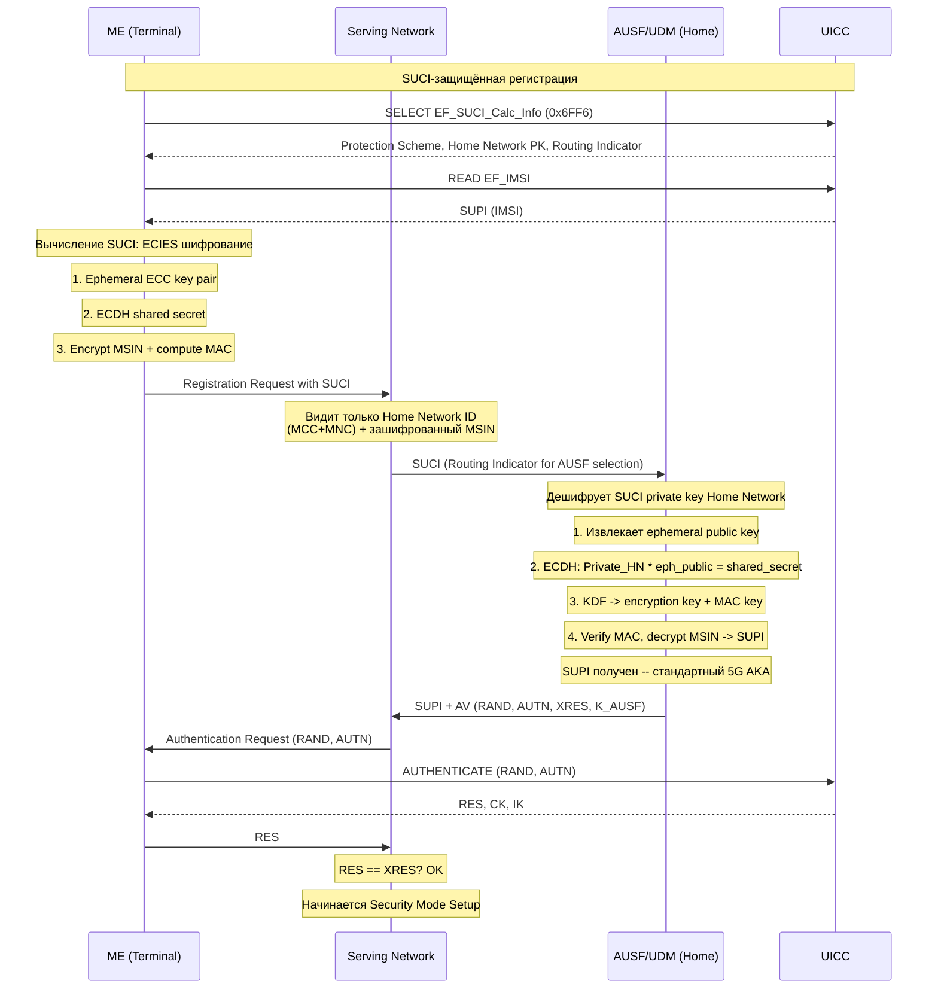
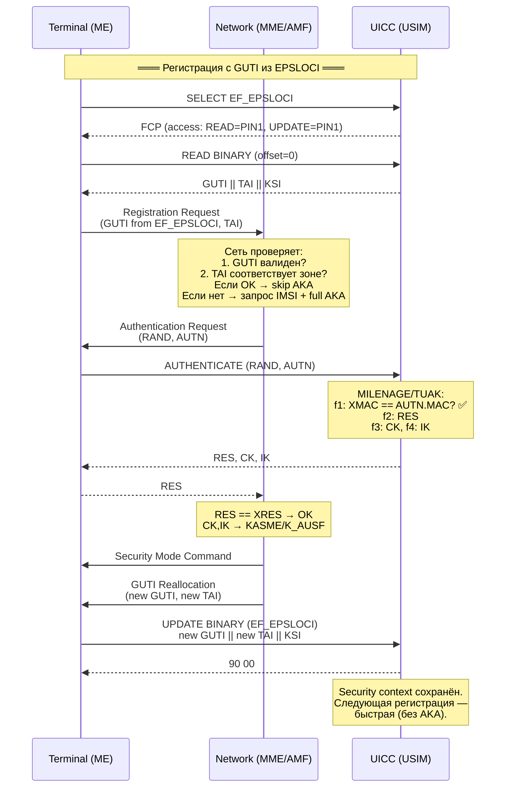

# Evolution of Authentication: From COMP128 to 5G AKA

> **Synthesis** — эволюция аутентификации в мобильных сетях: от односторонней GSM до взаимной 5G с SUCI-privacy.

---

## 1. Обзор поколений

```
2G (GSM)          3G (UMTS)           4G (LTE)             5G
COMP128            UMTS AKA            EPS AKA               5G AKA / EAP-AKA'
─────────         ──────────          ──────────            ─────────────────
SIM                USIM                USIM                  USIM
GSM 11.11          TS 31.102           TS 31.102             TS 31.102
Односторонняя      Взаимная            Взаимная +            Взаимная +
                   аутентификация      иерархия ключей      SUCI privacy
                   + integrity         + KASME               + K_AUSF/K_SEAF
```

---

## 2. GSM (2G) — COMP128: Односторонняя аутентификация

### Процесс
```
Сеть (HLR/AUC)                    ME                          SIM
   │                               │                           │
   │── RAND (128 bit) ────────────→│── RUN GSM ALGORITHM ────→│
   │                               │                           │
   │                               │         COMP128           │
   │                               │    RAND + Ki →            │
   │                               │    SRES (32 bit)          │
   │                               │    Kc (64 bit)            │
   │                               │                           │
   │←────────── SRES ──────────────│←──────── SRES ────────────│
   │                               │                           │
   │  Сеть сверяет SRES           │                           │
   │  SRES == SRES' → OK          │                           │
   │  Kc → для A5/x шифрования    │                           │
```

### Характеристики
| Параметр | Значение |
|---|---|
| **Стандарт** | GSM 11.11, TS 51.011 |
| **Алгоритм** | COMP128-1/2/3 (A3 — auth, A8 — key gen) |
| **Направление** | **Односторонняя** (сеть проверяет SIM; SIM НЕ проверяет сеть!) |
| **Ключи** | Ki (128 bit, общий секрет), Kc (64 bit, сессионный ключ) |
| **Ответ** | SRES (32 bit — слишком короткий!) |
| **Integrity** | ❌ Нет integrity protection |
| **Уязвимости** | False base station, replay-attacks, COMP128-1 broken (1998) |

### COMP128-1 vs COMP128-2 vs COMP128-3
| Версия | Статус | Примечание |
|---|---|---|
| **COMP128-1** | Сломан (1998) | 2^17 chosen plaintexts → Ki за 30 мин |
| **COMP128-2** | Ослаблен | Улучшенная версия, но всё ещё уязвима |
| **COMP128-3** | Относительно стоек | 3GPP-рекомендуемый для GSM |

> 🔴 **Критическая проблема**: GSM-сеть НЕ аутентифицирует себя перед SIM. Это позволяет **false base station** атаки (IMSI-catcher).

---

## 3. UMTS (3G) — UMTS AKA: Взаимная аутентификация

### Процесс
```
Сеть (HLR/AUC)                    ME                          USIM
   │                               │                           │
   │  [RAND, AUTN, XRES,          │                           │
   │   CK, IK]                    │                           │
   │                               │                           │
   │── RAND, AUTN ───────────────→│── AUTHENTICATE ──────────→│
   │                               │                           │
   │                               │        f1...f5            │
   │                               │   RAND + K →              │
   │                               │   XMAC == AUTN.MAC?       │
   │                               │   → Да: сеть подлинна! ✅ │
   │                               │   RES = f2(K, RAND)       │
   │                               │   CK = f3(K, RAND)        │
   │                               │   IK = f4(K, RAND)        │
   │                               │                           │
   │←────────── RES ───────────────│←────── RES, CK, IK ───────│
   │                               │                           │
   │  RES == XRES → OK            │                           │
   │  CK → UEA (шифрование)       │                           │
   │  IK → UIA (integrity!)       │                           │
```

### Характеристики
| Параметр        | Значение                                        |
| --------------- | ----------------------------------------------- |
| **Стандарт**    | 3GPP TS 33.102, USIM TS 31.102                  |
| **Алгоритмы**   | MILENAGE (AES-based) или TUAK (Keccak-based)    |
| **Направление** | **Взаимная** — сеть + USIM проверяют друг друга |
| **Ключи**       | K (128/256 bit), CK (128 bit), IK (128 bit)     |
| **AUTN**        | Authentication Token: SQN⊕AK + AMF + MAC        |
| **Integrity**   | ✅ IK → UIA1/UIA2 для integrity protection       |
| **Sequencing**  | SQN (Sequence Number) — защита от replay!       |

### Функции MILENAGE
```
f1: K + RAND + SQN + AMF → MAC (network auth)
f2: K + RAND → RES (user auth)
f3: K + RAND → CK (cipher key)
f4: K + RAND → IK (integrity key)
f5: K + RAND → AK (anonymity key — скрывает SQN)
f5*: K + RAND → AK* (для re-synchronisation)
```

> 🟢 **Ключевое преимущество над GSM**: взаимная аутентификация + integrity + SQN против replay + CK и IK по 128 бит (против Kc 64 бит).

---

## 4. LTE (4G) — EPS AKA: Иерархия ключей

### Ключевое отличие от UMTS AKA

UMTS AKA генерирует CK, IK → они же используются. **EPS AKA добавляет уровень деривации**:

```
K (в USIM)
  │
  ▼ UMTS AKA (f3, f4)
CK, IK
  │
  ▼ KDF (Key Derivation Function) [CK || IK + SN_ID + SQN⊕AK]
KASME (256 bit)
  │
  ├── K_NASenc (NAS encryption)
  ├── K_NASint (NAS integrity)
  ├── K_eNB (base station key)
  │     ├── K_UPenc (User Plane encryption)
  │     ├── K_RRCint (RRC integrity)
  │     └── K_RRCenc (RRC encryption)
  └── ...
```

### Характеристики
| Параметр | Значение |
|---|---|
| **Стандарт** | 3GPP TS 33.401 |
| **KASME** | 256 bit — ключ доступа к сети |
| **Иерархия** | K → CK,IK → KASME → множество production keys |
| **Forward security** | K_eNB обновляется при handover |
| **Шифры** | SNOW 3G, AES, ZUC |

---

## 5. 5G — 5G AKA / EAP-AKA' + SUCI Privacy

### Два метода аутентификации

#### 5G AKA (аналог UMTS/EPS AKA, улучшенный)
```
K (в USIM, DF_5GS)
  │
  ▼ 5G AKA
K_AUSF (Authentication Server Function)
  │
  ▼
K_SEAF (Security Anchor Function)
  │
  ▼
K_AMF (Access and Mobility Management Function)
  │
  ├── K_NASenc, K_NASint
  ├── K_gNB
  │     ├── K_UPenc, K_RRCint, K_RRCenc
  └── ...
```

#### EAP-AKA' (для non-3GPP доступа, например Wi-Fi)
- EAP-based (RFC 5448)
- Инкапсулирует UMTS AKA в EAP-фреймворк
- Используется для Wi-Fi Calling, trusted/untrusted non-3GPP

### 5.1 SUCI: Privacy Protection -- глубокий разбор

#### 5.1.1 Почему SUCI нужен

**Историческая проблема.** Начиная с GSM и вплоть до LTE, IMSI (International Mobile Subscriber Identity) передавался в открытом виде при каждой регистрации терминала в сети. Когда терминал впервые подключается или сеть не может опознать его по временному идентификатору (TMSI/GUTI), сеть посылает Identity Request, и ME отвечает IMSI в plaintext. Этот IMSI содержит MCC+MNC+MSIN -- полный идентификатор абонента.

**False base station (IMSI-catcher).** Злоумышленник разворачивает подставную базовую станцию с более сильным сигналом, чем у легитимной сети. Терминал подключается к ней, и она немедленно посылает Identity Request. Терминал, следуя стандарту, отвечает своим IMSI в открытом виде. Всё -- абонент идентифицирован, его местоположение раскрыто, и это происходит без единого признака для пользователя.

IMSI-catcher стал массовой проблемой к 2010-м годам: оборудование подешевело до нескольких тысяч долларов, а жертва не может защититься -- протокол требует выдать IMSI. Правоохранительные органы, частные детективы и криминальные группы активно использовали эту технику.

**3GPP решение.** В релизе 15 (5G Phase 1) 3GPP вводит концепцию SUCI -- Subscription Concealed Identifier. Идея в том, что SUPI (Subscription Permanent Identifier -- аналог IMSI для 5G) никогда не передаётся в открытом виде. Вместо этого ME (Mobile Equipment, не UICC!) шифрует SUPI с использованием Home Network Public Key, получая SUCI. Только домашняя сеть (Home Network), обладающая соответствующим private key, может дешифровать SUCI обратно в SUPI.

Таким образом, IMSI-catcher в 5G видит лишь зашифрованную строку -- и Home Network Identifier (MCC+MNC), который и так известен из радиопараметров сети. Сам идентификатор абонента (MSIN) остаётся скрытым.

#### 5.1.2 SUPI vs SUCI

**SUPI (Subscription Permanent Identifier)** -- постоянный идентификатор абонента в 5G, аналог IMSI. Определён в 3GPP TS 23.501. Два основных формата:

- **IMSI-based SUPI** (SUPI Type = 0): MCC (3 digits) + MNC (2-3 digits) + MSIN (до 10 digits). По сути тот же IMSI, но в контексте 5G называется SUPI.
- **NAI-based SUPI** (SUPI Type = 1): RFC 4282 Network Access Identifier в формате `username@realm`, например `user123@carrier.com`. Используется для non-3GPP доступа и private networks.

**SUCI (Subscription Concealed Identifier)** -- зашифрованная версия SUPI. Формат SUCI (TS 23.003):

```
SUCI = SUPI Type || Home Network Identifier || Routing Indicator || Protection Scheme ID || Home Network PK ID || Scheme Output
```

| Компонент | Размер | Описание |
|---|---|---|
| SUPI Type | 3 bits | 0 = IMSI-based, 1 = NAI-based |
| Home Network ID | переменный | MCC + MNC (тот же, что в SUPI) -- открытая часть, видна сети |
| Routing Indicator | 0-4 digits | Опционально, для маршрутизации к конкретному AUSF |
| Protection Scheme ID | 4 bits | 0000 = NULL, 0001 = Profile A, 0010 = Profile B |
| Home Network PK ID | 8 bits | Какой публичный ключ из набора использован |
| Scheme Output | переменный | Зашифрованная MSIN (или username) + ephemeral public key + MAC |

Критически важно: Home Network ID (MCC+MNC) остаётся в открытом виде в составе SUCI. Это необходимо для того, чтобы serving network могла определить, в какую домашнюю сеть направлять SUCI, но при этом сам абонент (MSIN) остаётся скрытым. Таким образом, IMSI-catcher всё ещё видит, из какой страны и сети абонент, но не может определить конкретного человека.

#### 5.1.3 Защитные схемы (Protection Schemes)

Для шифрования SUPI в SUCI 3GPP определяет несколько Protection Schemes (TS 33.501 Annex C):

**NULL-scheme (Protection Scheme ID = 0x00)**
- SUPI = SUCI (без защиты)
- Scheme Output пустой
- Предназначена только для тестовых сред и сетей, где privacy не требуется
- В production-сетях НЕ ДОЛЖНА использоваться

**Profile A (Protection Scheme ID = 0x01)**
- ECIES-based (Elliptic Curve Integrated Encryption Scheme)
- Использует Curve25519 (X25519 для ECDH)
- Home Network Public Key шифрует MSIN-часть SUPI
- Алгоритм:
  1. ME генерирует ephemeral ECC key pair на Curve25519
  2. Вычисляет общий секрет через ECDH: shared_secret = X25519(eph_private, home_network_public_key)
  3. Derives encryption key и MAC key из shared_secret через KDF (ANSI-X9.63-KDF)
  4. Шифрует MSIN с AES-128-CTR (encryption key)
  5. Вычисляет HMAC-SHA-256 от зашифрованного MSIN (MAC key)
  6. Scheme Output = ephemeral public key (32 байта) || ciphertext (длина MSIN) || MAC tag (8 байт)
- Key blinding: ephemeral key обеспечивает, что каждый SUCI уникален -- даже один и тот же SUPI даёт разный SUCI при каждом вычислении

**Profile B (Protection Scheme ID = 0x02)**
- Тот же ECIES, но с другими криптографическими параметрами
- Использует secp256r1 (NIST P-256) вместо Curve25519
- KDF: HMAC-SHA-256 вместо ANSI-X9.63-KDF
- MAC: HMAC-SHA-256 (truncated до 8 байт)
- На практике большинство операторов выбирают Profile A (Curve25519 быстрее и имеет лучшую репутацию в криптосообществе)

Оба профиля обеспечивают:
- **Конфиденциальность**: MSIN скрыт от serving network и eavesdroppers
- **Unlinkability**: разные SUCI одного абонента не связываются между собой (благодаря ephemeral key)
- **Подлинность**: MAC tag предотвращает подделку SUCI

#### 5.1.4 Как работает SUCI вычисление

SUCI вычисляется в **ME (Mobile Equipment)**, а НЕ в UICC. Это архитектурное решение: UICC может не иметь вычислительных ресурсов для ECIES, и это позволяет обновлять алгоритмы шифрования без замены UICC.

Необходимые данные ME получает из EF на UICC:

**EF_SUCI_Calc_Info (`0x6FF6`)** -- специальный EF в DF_5GS, содержит:

| Поле | Размер | Описание |
|---|---|---|
| Protection Scheme ID | 1 байт | 00 = NULL, 01 = Profile A, 02 = Profile B |
| Home Network PK ID | 1 байт | Индекс ключа (0-255) в наборе ключей оператора |
| Home Network Public Key | переменный | Публичный ключ ECC в DER-кодированном X.509 SubjectPublicKeyInfo или raw формате |
| Routing Indicator | 0-4 байта | Опциональный Routing Indicator для AUSF-маршрутизации |

Все поля внутри EF хранятся в BER-TLV формате.

**Процесс вычисления SUCI:**

1. ME читает EF_SUCI_Calc_Info с UICC -- получает Protection Scheme ID, Home Network Public Key, Routing Indicator
2. ME читает EF_IMSI (или другой источник SUPI) с UICC -- получает SUPI
3. ME проверяет схему защиты:
   - Если NULL-scheme: SUCI = SUPI (Scheme Output пустой) -- только для тестов
   - Если Profile A/B: ME выполняет ECIES шифрование
4. Для ECIES:
   a. ME генерирует ephemeral ECC key pair (private + public) на указанной кривой
   b. ME вычисляет общий секрет через ECDH: eph_private x Home_Network_PK
   c. ME извлекает encryption key и MAC key через KDF
   d. ME шифрует MSIN (или username для NAI-based SUPI)
   e. ME вычисляет MAC tag от зашифрованных данных
   f. Scheme Output = ephemeral_public_key || encrypted_msin || mac_tag
5. ME формирует SUCI: SUPI_Type || Home_Network_ID || Routing_Indicator || Protection_Scheme_ID || Home_Network_PK_ID || Scheme_Output
6. ME использует SUCI в Registration Request

**Только Home Network (AUSF/UDM) может дешифровать SUCI**, потому что только Home Network обладает private key, соответствующим Home Network Public Key. Serving network (Visited PLMN) не может дешифровать SUCI -- она только маршрутизирует его в домашнюю сеть. После дешифрования AUSF получает SUPI и запускает стандартный 5G AKA.

#### 5.1.5 Mermaid: SUCI-защищённая регистрация в 5G



#### 5.1.6 Сравнение: до и после SUCI

| Аспект | 4G (IMSI) | 5G (SUCI) |
|---|---|---|
| Идентификатор в эфире | IMSI (открытый текст) | SUCI (зашифрован) |
| IMSI-catching | Полный IMSI виден | Только Home Network ID (MCC+MNC) |
| Где вычисляется | Не требуется (IMSI читается из EF_IMSI) | ME вычисляет SUCI с EF_SUCI_Calc_Info |
| Ключ шифрования | -- | Home Network Public Key |
| Схема защиты | -- | ECIES (Profile A -- Curve25519, Profile B -- secp256r1) |
| Кто дешифрует | Не требуется | Только AUSF/UDM в Home Network |
| Стандарт | 3GPP TS 33.401 | 3GPP TS 33.501 |
| Unlinkability | Нет (IMSI всегда одинаков) | Да (разные SUCI для одного SUPI благодаря ephemeral key) |
| Вычислительные требования | Минимальные | ECC + AES + HMAC (в ME) |

#### 5.1.7 EF_SUCI_Calc_Info -- детальная структура

EF_SUCI_Calc_Info (`0x6FF6`) расположен в DF_5GS (`0x5FC1`) и содержит параметры для SUCI-вычисления. Доступ: READ = PIN1, UPDATE = ADM (оператор может обновлять ключи).

**BER-TLV структура внутри EF:**

| Tag | Поле | Размер | Описание |
|---|---|---|---|
| `80` | Protection Scheme ID | 1 байт | `00` = NULL-scheme, `01` = Profile A, `02` = Profile B |
| `81` | Home Network Public Key ID | 1 байт | Индекс ключа в наборе оператора (0-255) |
| `82` | Home Network Public Key | переменный | DER-encoded X.509 SubjectPublicKeyInfo. Для Profile A: Curve25519 (OID 1.3.101.110), 32 байта ключа. Для Profile B: secp256r1 (OID 1.2.840.10045.3.1.7), 65 байт (uncompressed point) |
| `83` | Routing Indicator | 0-4 байта | Опциональное поле, digits 0-9, кодируется как BCD. Используется AUSF для маршрутизации запроса к правильному экземпляру UDM при наличии нескольких |

**Пример (Profile A, Curve25519):**
```
80 01 01           # Protection Scheme ID = Profile A
81 01 03           # Home Network PK ID = 3
82 2C 30 2A 30 05 06 03 2B 65 6E 03 21 00 [32 bytes key]
                   # Home Network PK: DER-encoded X.509, Curve25519
83 02 12 34        # Routing Indicator = "1234"
```

**Ключевые моменты:**
- Home Network может иметь несколько публичных ключей (для ротации), каждый идентифицируется Home Network PK ID
- Routing Indicator позволяет оператору направлять разных абонентов к разным экземплярам AUSF/UDM (sharding по регионам, балансировка нагрузки)
- Если Routing Indicator отсутствует (0 байт), SUCI не содержит Routing Indicator -- используется стандартная маршрутизация по Home Network ID
- EF_SUCI_Calc_Info может обновляться OTA (Over-The-Air) оператором для ротации ключей или изменения схемы защиты

### Характеристики
| Параметр | Значение |
|---|---|
| **Стандарт** | 3GPP TS 33.501 |
| **Аутентификация** | 5G AKA или EAP-AKA' |
| **Ключи в USIM** | EF_5GAUTHKEYS (K, RIN), EF_KAUSF_Derivation |
| **K_AUSF** | 256 bit — выносится в AUSF (облачный сервис!) |
| **K_SEAF** | Привязка к serving network |
| **SUCI** | ✅ IMSI больше не передаётся открыто! |
| **Home Network Control** | HPLMN контролирует аутентификацию через AUSF |

---

## 6. Сравнительная таблица

| Свойство | GSM | UMTS | LTE | 5G |
|---|---|---|---|---|
| **Год** | 1991 | 1999 | 2008 | 2018 |
| **Спецификация** | GSM 11.11 | TS 33.102 | TS 33.401 | TS 33.501 |
| **Алгоритм** | COMP128 | MILENAGE | MILENAGE + KDF | MILENAGE + KDF / EAP-AKA' |
| **Направление** | Сеть→SIM | Взаимная | Взаимная | Взаимная |
| **Ключ сети** | Kc (64 bit) | CK, IK (128 bit) | KASME (256 bit) | K_AUSF (256 bit) |
| **Integrity** | ❌ | ✅ IK | ✅ NAS + RRC | ✅ NAS + RRC |
| **SQN (anti-replay)** | ❌ | ✅ | ✅ | ✅ |
| **Privacy** | ❌ IMSI открыт | ❌ IMSI открыт | ❌ IMSI открыт | ✅ SUCI |
| **Иерархия ключей** | Нет | Нет (CK,IK напрямую) | KASME→цепь ключей | K_AUSF→K_SEAF→K_AMF→... |
| **Home Network Control** | ❌ | Частично (AUC) | Частично | ✅ AUSF в HPLMN |
| **Non-3GPP доступ** | ❌ | ❌ | ❌ | ✅ EAP-AKA' |

## 7. Эволюция ключей

```
GSM:    Ki (128) → Kc (64)                         2 ключа
UMTS:   K (128) → CK (128) + IK (128)              3 ключа
LTE:    K (128) → CK+IK → KASME (256) → 7+ ключей  ~10 ключей
5G:     K (256) → CK+IK → K_AUSF → K_SEAF → ...    ~15+ ключей
```

Каждое поколение увеличивает: длину ключей, количество ключей в иерархии, и стойкость.

---

## 8. Ключевые EF для аутентификации

Аутентификация в мобильных сетях опирается на две группы элементарных файлов: EF с криптографическими ключами и секретами (собственно аутентификация) и EF с контекстом местоположения (LOCI-семейство), которые определяют, *как* и *когда* сеть запрашивает аутентификацию.

### 8.1 EF с ключами и секретами (собственно аутентификация)

Эти EF хранят криптографический материал, непосредственно используемый в процессе AKA: общие секреты (K, Ki), сессионные ключи (Kc, CK, IK) и параметры для privacy-защиты.

| EF | FID | Поколение | Содержит | Роль в AKA |
|---|---|---|---|---|
| **EF_Kc** | `0x6F20` | GSM | Kc (64 bit) | GSM cipher key — результат COMP128; используется для A5/x шифрования радио-канала |
| **EF_Keys** | `0x6F08` | 3G/4G | CK (128 bit) + IK (128 bit) | UMTS/EPS AKA keys — результат f3/f4; CK для UEA-шифрования, IK для UIA-integrity |
| **EF_KeysPS** | `0x6F09` | 3G/4G | CK + IK (PS domain) | Аналог EF_Keys для PS-домена; позволяет раздельные ключи для CS и PS |
| **EF_5GAUTHKEYS** | `0x6FF3` | 5G | K (до 256 bit) + RIN (Routing Indicator) | 5G AKA master key; RIN определяет, какой AUSF обслуживает абонента в HPLMN |
| **EF_SUCI_Calc_Info** | `0x6FF6` | 5G | Home Network Public Key + Protection Scheme ID | Параметры для вычисления SUCI: шифрование SUPI публичным ключом HPLMN |
| **EF_KAUSF_Derivation** | `0x6FFC` | 5G | KDF parameters + Serving Network Name (опционально) | Деривация K_AUSF из CK,IK — управляет тем, как строится 5G иерархия ключей |

### 8.2 EF с контекстом и состоянием (LOCI-семейство) — зачем они нужны при аутентификации

**Почему location files важны для аутентификации:**

Location files (LOCI, PSLOCI, EPSLOCI, 5GS3GPPLOCI, 5GSN3GPPLOCI) не содержат ключей, но критически влияют на процесс аутентификации:

- **Идентификация терминала сетью**: при каждой регистрации терминал предъявляет сети временный идентификатор (TMSI/GUTI/5G-GUTI), сохранённый в LOCI. Сеть сопоставляет его с сохранённым security context и решает: разрешить быструю регистрацию или запросить полную AKA.
- **Защита от replay-атак**: LOCI содержит текущий LAC/TAC/TAI — зону, в которой был получен временный идентификатор. Если терминал предъявляет TMSI из зоны A, но находится в зоне B, сеть может запросить полную аутентификацию — это предотвращает перехват и повтор TMSI в другой локации.
- **Сохранение security context**: после успешной AKA сеть выдаёт новый временный идентификатор; терминал через UICC обновляет LOCI. Этот контекст используется для следующей регистрации без полной AKA (fast re-authentication).
- **Без актуального LOCI**: UICC возвращает статус `'6A88'` (referenced data not found) → сеть вынуждена запрашивать IMSI и запускать полную AKA, что медленнее и раскрывает идентификатор абонента.

**Общий принцип UPDATE LOCI:**
```
Terminal (ME)                                UICC
     │                                          │
     │── SELECT EF_LOCI ───────────────────────→│
     │←── FCP (access: UPDATE + PIN1) ──────────│
     │                                          │
     │── READ BINARY (offset=0, len=11) ───────→│  ← Terminal читает текущий LOCI
     │←── TMSI || LAI || TMSI_TIME ─────────────│    (для включения в Location Update Request)
     │                                          │
     │   ... сеть выполняет AKA, выдаёт новый TMSI ...
     │                                          │
     │── UPDATE BINARY (offset=0, new data) ───→│  ← Terminal записывает новый контекст
     │←── 90 00 (OK) ───────────────────────────│
```

#### Таблица LOCI-семейства

| EF | FID | Поколение | Содержит | Когда обновляется | Размер |
|---|---|---|---|---|---|
| **EF_LOCI** | `0x6F7E` | 3G (UMTS) | TMSI (4B), LAI (5B), TMSI_TIME (1B), LOCI status (1B) | После каждой successful аутентификации / TMSI reallocation | 11 байт |
| **EF_PSLOCI** | `0x6F73` | 3G (PS domain) | P-TMSI (4B) + P-TMSI signature (3B), RAI (6B), status (1B) | После PS attach / RA update | 14 байт |
| **EF_EPSLOCI** | `0x6FE3` | 4G (LTE) | GUTI (11B), last visited TAI (6B), KSI (1B) | После EPS AKA / TAU / GUTI reallocation | 18 байт |
| **EF_5GS3GPPLOCI** | `0x6FF0` | 5G (3GPP access) | 5G-GUTI (11B), last visited TAI (6B), 5GS registration status (1B) | После 5G AKA / registration over 3GPP | 18 байт |
| **EF_5GSN3GPPLOCI** | `0x6FF1` | 5G (non-3GPP access) | 5G-GUTI (11B), last visited TAI (6B), 5GS registration status (1B) | После non-3GPP регистрации (Wi-Fi, untrusted) | 18 байт |

### 8.3 Как LOCI участвует в процессе аутентификации



### 8.4 Детали для каждого LOCI-файла

#### EF_LOCI (`0x6F7E`) — 3G Location Information

Самый старый из LOCI-семейства. Используется в UMTS для CS-домена.

| Поле | Размер | Описание |
|---|---|---|
| **TMSI** | 4 байта | Temporary Mobile Subscriber Identity — временный идентификатор в пределах одного LAC |
| **LAI** | 5 байт | Location Area Identification (MCC+MNC+LAC) — где TMSI был выделен |
| **TMSI_TIME** | 1 байт | Таймер TMSI (0 = no timer) |
| **LOCI status** | 1 байт | Статус: `00`=updated, `01`=not updated, `FF`=invalid |

- **READ**: Terminal читает перед Location Update Request — получить текущие TMSI и LAI
- **UPDATE**: Terminal записывает после TMSI Reallocation от сети
- **Access conditions**: READ = PIN1, UPDATE = PIN1
- **Cold reset**: TMSI может сохраняться или сбрасываться в зависимости от реализации
- **Warm reset**: состояние сохраняется — TMSI действителен
- **Формат TMSI**: 32 бита, назначается VLR, уникален в пределах LAC

#### EF_PSLOCI (`0x6F73`) — PS Location Information

Раздельный файл для PS-домена (GPRS). Появился потому что CS и PS могут обслуживаться разными узлами (MSC vs SGSN).

| Поле | Размер | Описание |
|---|---|---|
| **P-TMSI** | 4 байта | Packet-TMSI — аналог TMSI для PS домена |
| **P-TMSI signature** | 3 байта | Подпись P-TMSI для валидации |
| **RAI** | 6 байт | Routing Area Identification (MCC+MNC+LAC+RAC) |
| **Status** | 1 байт | Статус регистрации |

- **READ**: Terminal читает перед GPRS Attach / RA Update
- **UPDATE**: Terminal записывает после P-TMSI Reallocation
- **Access conditions**: READ = PIN1, UPDATE = PIN1
- **P-TMSI Signature**: дополнительная защита — сеть проверяет, что P-TMSI не подделан

#### EF_EPSLOCI (`0x6FE3`) — EPS Location Information

Используется в LTE/EPS. Вместо TMSI+P-TMSI вводится единый GUTI.

| Поле | Размер | Описание |
|---|---|---|
| **GUTI** | 11 байт | Globally Unique Temporary Identity (MCC+MNC+MMEGI+MMEC+M-TMSI) |
| **Last visited TAI** | 6 байт | Tracking Area Identity (MCC+MNC+TAC) |
| **KSI** (NAS key set ID) | 1 байт | Идентификатор набора ключей: `000`=native security (AKA), `001`=mapped security |

- **GUTI формат**: MCC (3B) + MNC (1B) + MMEGI (2B) + MMEC (1B) + M-TMSI (4B) — глобально уникален
- **READ**: Terminal читает перед Attach / TAU Request
- **UPDATE**: Terminal записывает после GUTI Reallocation
- **Access conditions**: READ = PIN1, UPDATE = PIN1
- **KSI**: связывает GUTI с конкретным набором ключей K_ASME; критично для быстрой регистрации — несовпадение KSI → full AKA

#### EF_5GS3GPPLOCI (`0x6FF0`) — 5GS 3GPP Access Location Information

| Поле | Размер | Описание |
|---|---|---|
| **5G-GUTI** | 11 байт | 5G Globally Unique Temporary Identity |
| **Last visited TAI** | 6 байт | Tracking Area Identity |
| **5GS registration status** | 1 байт | `00`=not registered, `01`=registered, `02`=attempting registration |

- **5G-GUTI формат**: аналогичен GUTI, но назначается AMF (не MME)
- **READ**: Terminal читает перед 5G Registration Request (3GPP)
- **UPDATE**: Terminal записывает после успешной 5G регистрации / GUTI reallocation
- **Access conditions**: READ = PIN1, UPDATE = PIN1
- **5GS registration status**: дополнительное поле, позволяющее ME быстро определить, зарегистрирован ли терминал в 5G, без чтения всего файла

#### EF_5GSN3GPPLOCI (`0x6FF1`) — 5GS Non-3GPP Access Location Information

| Поле | Размер | Описание |
|---|---|---|
| **5G-GUTI** | 11 байт | 5G-GUTI (для non-3GPP доступа) |
| **Last visited TAI** | 6 байт | TAI (может быть виртуальным для non-3GPP) |
| **5GS registration status** | 1 байт | Статус non-3GPP регистрации |

- **Ключевое отличие 5G**: разделение 3GPP и non-3GPP контекстов — одна UICC обслуживает одновременную регистрацию через cellular и Wi-Fi с разными GUTI и разными security context
- **READ**: Terminal читает перед non-3GPP регистрацией (через N3IWF/TNGF)
- **UPDATE**: Terminal записывает после non-3GPP регистрации
- **Сценарий**: телефон зарегистрирован и в 5G-RAN, и в Wi-Fi — каждый доступ имеет собственный GUTI и security context

### 8.5 Практическое значение — почему понимание LOCI важно

#### Для тестирования UICC и сети

- **Stale LOCI simulation**: запись некорректного TMSI/GUTI в EF_LOCI/EPSLOCI позволяет протестировать, как сеть реагирует на невалидный временный идентификатор — должен последовать запрос IMSI + full AKA
- **Multi-RAT testing**: EPSLOCI и 5GS3GPPLOCI могут содержать разные GUTI → тестирование перехода 4G↔5G (inter-system change)
- **PLMN change**: при смене PLMN LOCI обычно инвалидируется → full AKA с новым оператором
- **SIM-tester tools**: pySim, shadysim позволяют напрямую читать/писать LOCI для отладки

#### Для безопасности

- **Stale LOCI = потенциальный replay risk**: если злоумышленник перехватывает GUTI + TAI и воспроизводит их в той же зоне до истечения таймера, возможен replay. Именно поэтому сеть должна проверять свежесть контекста.
- **TMSI/GUTI ротация**: частая смена TMSI (VLR-controlled) и GUTI (MME/AMF-controlled) снижает replay-окно — каждый новый LOCI уменьшает ценность перехваченного идентификатора
- **5G improvement**: разделение 5GS3GPPLOCI и 5GSN3GPPLOCI предотвращает cross-access утечку — компрометация non-3GPP GUTI не компрометирует 3GPP security context и наоборот
- **Cold vs warm reset**: при физическом извлечении UICC (cold reset) LOCI может очищаться или сохраняться в зависимости от политики оператора — это влияет на то, сможет ли злоумышленник извлечь GUTI из вынутой карты

## 9. Безопасность: уязвимости и защита

| Атака | GSM | UMTS | LTE | 5G |
|---|---|---|---|---|
| **False BTS** | ✅ возможна | ❌ (AUTN) | ❌ (AUTN) | ❌ (AUTN) |
| **IMSI-catching** | ✅ | ✅ | ✅ | ❌ (SUCI!) |
| **Replay** | ✅ | ❌ (SQN) | ❌ (SQN) | ❌ (SQN) |
| **Side-channel** | ✅ (COMP128) | Сложнее (AES) | Сложнее | TBD |
| **Quantum** | Уязвим (64-bit Kc) | Уязвим (128-bit K) | Уязвим (128-bit K) | Стойкий (256-bit K) |

## См. также

- **[[wiki/research/auth_evolution_deep_dive|Auth Evolution Deep Dive]]** — исчерпывающий research: математический разбор COMP128, полный криптоанализ MILENAGE/TUAK, квантовая угроза, хронология инцидентов, производительность, полная EF-карта, sequence diagrams всех поколений
- **[[wiki/research/milenage_vs_tuak|MILENAGE vs TUAK: Сравнительный анализ]]** — глубокий криптографический разбор двух алгоритмов аутентификации
- **[[wiki/concepts/USIM]]** — архитектура и возможности USIM, включая DF_5GS и файлы 5G-аутентификации
- **[[wiki/reference/USIM_EF_Table]]** — полная таблица USIM элементарных файлов с кодами и access conditions

## Ссылки на источники

- GSM 11.11: [[wiki/summaries/gsm_1111]]
- USIM Security: [[wiki/concepts/UICC_Security]]
- USIM: [[wiki/concepts/USIM]]
- TS 31.102: [[wiki/summaries/ts_131102]]
