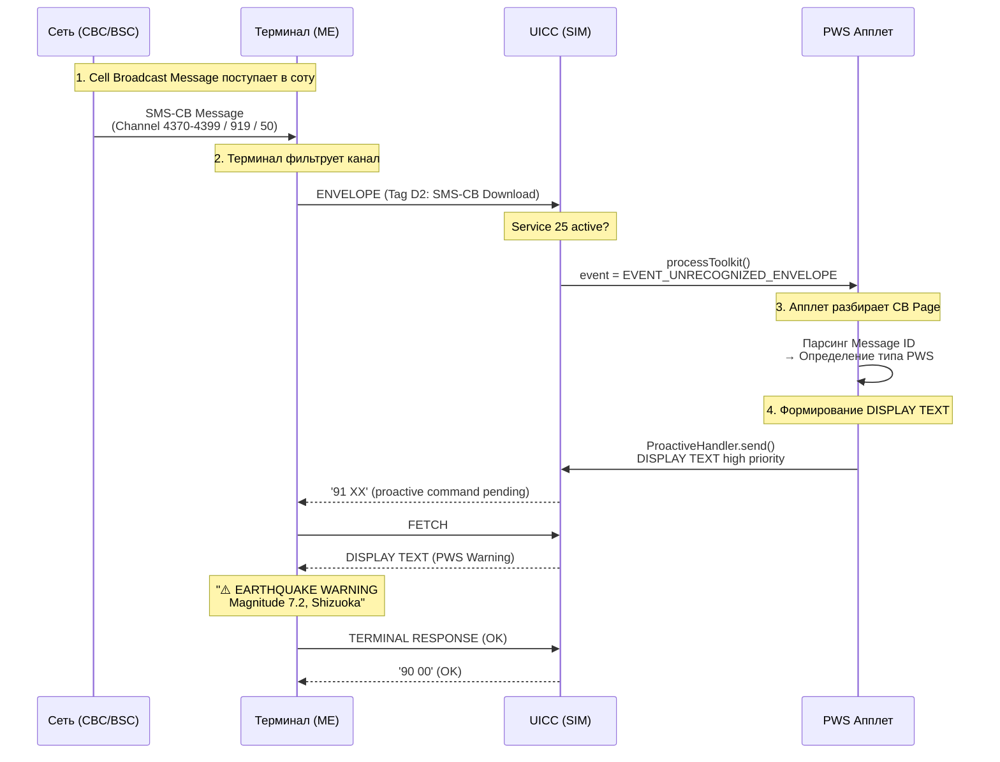

# Разработка Java Card апплета для приёма Cell Broadcast / PWS / CMAS и отображения через DISPLAY TEXT

> **Synthesis** — комплексное руководство: от теории Cell Broadcast до рабочего Java Card STK-апплета, принимающего PWS-сообщения и показывающего их на экране телефона.

---

## 1. Концептуальная база: что такое Cell Broadcast

### 1.1 SMS-CB vs SMS-PP

**SMS Cell Broadcast (SMS-CB)** — это механизм широковещательной доставки сообщений от сети **ко всем телефонам в соте** одновременно. В отличие от SMS-PP (Point-to-Point), CB-сообщения:

| Характеристика | SMS-CB (Cell Broadcast) | SMS-PP (Point-to-Point) |
|---|---|---|
| **Направление** | Broadcast (всем) | Point-to-point (конкретному абоненту) |
| **Адресация** | Номер канала (Channel) | MSISDN (номер телефона) |
| **Доставка на UICC** | ENVELOPE (Data Download via SMS-CB) | ENVELOPE (SMS-PP Data Download) |
| **Повторная передача** | Автоматически, с заданным интервалом | Нет |
| **Абонент может отписаться** | Частично (зависит от канала) | Не применимо |
| **Размер** | До 15 страниц по 82 байта = 1230 байт | 140 байт (7-bit) / 160 символов |
| **Канал на UICC** | Service 25 (Data download via SMS-CB) | Service 7/8/9 (SMS-PP) |

> [!important] Ключевое отличие
> CB-сообщения передаются через ENVELOPE с тегом **D2** (SMS-CB Download), в то время как SMS-PP — через ENVELOPE с тегом **D1** (SMS-PP Data Download)[reference:1].

### 1.2 Public Warning System (PWS)

**PWS** — это общее название систем экстренного оповещения через Cell Broadcast. Разные регионы используют свои варианты:

| Система | Регион | Стандарт | Особенности |
|---|---|---|---|
| **ETWS** | Япония | 3GPP TS 22.168 | Earthquake Warning, Tsunami Warning. Доставка за 4 секунды |
| **CMAS** | США/Канада | FCC, 3GPP TS 22.268 | Presidential Alert, Imminent Threat, AMBER Alert |
| **EU-Alert** | EC (Европа) | ETSI TS 102 900 | Гармонизирован с CMAS, обязателен с 2022 года |
| **KPAS** | Южная Корея | 3GPP TS 22.268 (адаптация) | Korean Public Alert System |
| **WEA** | США | FCC (Wireless Emergency Alerts) | Коммерческое название CMAS в США |

### 1.3 Номера каналов Cell Broadcast

Номера каналов определяют тип сообщения и его приоритет:

| Диапазон каналов | Назначение |
|---|---|
| 0-999 | Общего назначения (определяются оператором) |
| 50 | CMAS (США) — Presidential Alert, Imminent Threat |
| 4370-4399 | Зарезервировано для PWS (ETWS / CMAS / KPAS / EU-Alert) |
| 919 | EU-Alert (Европа) |
| 1000-4095 | Расширенные каналы (operator-defined) |

### 1.4 Ключевые Message ID для PWS

Message ID (2 байта) внутри CB-сообщения определяет конкретный тип предупреждения:

| Message ID | Тип | Описание |
|---|---|---|
| 4370 | ETWS Earthquake Warning | Первичное предупреждение (Primary Notification) |
| 4371-4372 | ETWS Tsunami Warning | Предупреждение о цунами |
| 4373 | ETWS Earthquake + Tsunami | Комбинированное предупреждение |
| 4380 | CMAS Presidential Alert | Президентское предупреждение (обязательный приём) |
| 4381 | CMAS Imminent Threat — Extreme | Критическая угроза (tornado, flood, etc.) |
| 4382 | CMAS Imminent Threat — Severe | Серьёзная угроза |
| 4383 | CMAS Child Abduction (AMBER) | Похищение ребёнка |
| 4384-4387 | CMAS AMBER Alert (вариации) | Разные уровни AMBER |
| 4393 | EU-Alert Level 1 (Presidential) | Национальное предупреждение |
| 4394 | EU-Alert Level 2 (Extreme) | Экстремальная угроза |
| 4395 | EU-Alert Level 3 (Severe) | Серьёзная угроза |
| 4388 | CMAS Required Monthly Test | Тестовое сообщение (обязательно) |
| 4389 | CMAS State/Local Test | Тестовое сообщение (локальное) |

---

## 2. Технический механизм: как CB-сообщение попадает в апплет

### 2.1 Service 25 — Data Download via SMS-CB

Для приёма CB-сообщений на UICC сервис **Service 25 (Data download via SMS-CB)** должен быть активирован в EF_SST (SIM Service Table) или EF_UST (USIM Service Table). ^[inferred]

- **EF_SST** (6F38) — для 2G SIM
- **EF_UST** (6F39) — для 3G/4G/5G UICC
- Service 25 должен быть установлен в «1» (available)

### 2.2 Terminal Profile

Терминал сообщает UICC о поддержке SMS-CB Data Download через бит в TERMINAL PROFILE:

> **Capability 3 (Byte 1, Bit 3)** = Cell Broadcast Data Download ^[inferred]

Если этот бит не установлен, терминал не будет доставлять CB-сообщения на UICC.

### 2.3 Структура ENVELOPE для SMS-CB

```
ENVELOPE (INS D0)
└── Tag: D2 (SMS-CB Download)
    ├── Device Identities (Tag 82):
    │     Source: 83 (Network)
    │     Destination: 81 (UICC)
    ├── Cell Broadcast Page (Tag 0C):    ← повторяется для каждой страницы
    │     ├── Serial Number (2 bytes)    ← GS: Group Serial (2 bits) + Message Code (10 bits) + Update Number (4 bits)
    │     ├── Message ID (2 bytes)       ← ключевой идентификатор PWS типа
    │     ├── DCS (1 byte)               ← Data Coding Scheme
    │     └── Page Data (1-82 bytes)     ← полезная нагрузка (текст предупреждения)
    └── [далее CB Page для стр. 2, 3, ... до 15]
```

### 2.4 Разбор Serial Number

```
Serial Number (2 байта, 16 бит):

  Bits 15-14: GS (Geographical Scope)
    00 = Cell wide
    01 = PLMN wide
    10 = Location Area wide
    11 = Cell wide (immediate display)

  Bits 13-4: Message Code (10 бит)
    Дифференцирует сообщения с одинаковым Message ID

  Bits 3-0: Update Number (4 бита)
    Различает новые сообщения от повторов
    Инкрементируется при изменении содержания
```

> [!tip] Практический совет
> Update Number используется для дедупликации: если Update Number не изменился — это повтор того же сообщения, повторно показывать не нужно.

### 2.5 DCS (Data Coding Scheme)

| DCS | Кодировка | Описание |
|---|---|---|
| 0x00 | GSM 7-bit (default alphabet) | Наиболее распространён |
| 0x04 | 8-bit data | Бинарные данные |
| 0x08 | UCS-2 (16-bit) | Unicode (128 символов на страницу) |
| 0x0F | GSM 7-bit, Class 0 | Flash SMS (немедленное отображение) |
| 0x10 | GSM 7-bit, Language 1 | Язык определяется DCS |

---

## 3. Поток данных: от сети до экрана



> [!note] EVENT_UNRECOGNIZED_ENVELOPE vs событие CB
> В текущих версиях Java Card API (`uicc.toolkit`) нет отдельной константы для события SMS-CB Download. CB-сообщения приходят как `EVENT_UNRECOGNIZED_ENVELOPE`. Апплет должен сам анализировать BER-TLV структуру ENVELOPE, чтобы определить, что это SMS-CB Download (Tag D2), а не что-то другое.

---

## 4. Полный код апплета

```java
package com.example.pws;

import javacard.framework.*;
import uicc.toolkit.*;

/**
 * PWS Applet — приём Cell Broadcast PWS/CMAS/ETWS/EU-Alert
 * и отображение экстренных предупреждений через DISPLAY TEXT.
 *
 * Использует uicc.toolkit API (3G+ UICC).
 */
public class PwsApplet extends Applet implements ToolkitInterface {

    // ══════════════════════════════════════════════════════
    // Константы ENVELOPE и CB
    // ══════════════════════════════════════════════════════

    /** TAG в APDU буфере, где начинается ENVELOPE data */
    private static final short ENVELOPE_DATA_OFFSET = 23;

    /** Tag SMS-CB Download внутри ENVELOPE */
    private static final byte TAG_SMS_CB_DOWNLOAD = (byte)0xD2;

    /** Tag Cell Broadcast Page */
    private static final byte TAG_CB_PAGE = (byte)0x0C;

    /** Tag Device Identities */
    private static final byte TAG_DEVICE_IDENTITIES = (byte)0x82;

    /** Смещение Message ID внутри CB Page (после Serial Number) */
    private static final short MSG_ID_OFFSET = 2;

    /** Смещение DCS внутри CB Page */
    private static final short DCS_OFFSET = 4;

    /** Смещение начала page data */
    private static final short PAGE_DATA_OFFSET = 5;

    /** Максимальная длина отображаемого текста на страницу */
    private static final short MAX_TEXT_LEN = 82;

    /** Serial number для дедупликации последнего сообщения */
    private short lastSerial;

    // ══════════════════════════════════════════════════════
    // Proactive команды
    // ══════════════════════════════════════════════════════

    private static final short PRO_CMD_DISPLAY_TEXT = 0x21;

    private static final byte DEV_ID_DISPLAY = 0x02;

    /** Tag Text String (по TS 102 223, Clause 6.4.5.4) */
    private static final byte TAG_TEXT_STRING = (byte)0x0D;

    /** DCS: 8-bit data */
    private static final byte DCS_8BIT = 0x04;

    /** DCS: GSM 7-bit default alphabet — перекодируется через SMS-стек */
    private static final byte DCS_GSM7 = 0x00;

    /** DCS: UCS-2 (используем напрямую) */
    private static final byte DCS_UCS2 = 0x08;

    // ── Qualifier для DISPLAY TEXT ──
    /** Normal priority, clear after delay */
    private static final byte QUALIFIER_NORMAL = 0x00;

    /** High priority, wait user, immediate */
    private static final byte QUALIFIER_HIGH_PRIORITY = (byte)0x81;

    // ══════════════════════════════════════════════════════
    // Псевдо-константы Message ID PWS
    // ══════════════════════════════════════════════════════

    /** Нижняя граница диапазона PWS Message ID */
    private static final short PWS_MSG_ID_MIN = 4370;

    /** Верхняя граница диапазона PWS Message ID */
    private static final short PWS_MSG_ID_MAX = 4399;

    // ── ETWS (Япония) ──
    private static final short MSG_ID_ETWS_EARTHQUAKE = 4370;
    private static final short MSG_ID_ETWS_TSUNAMI_MIN = 4371;
    private static final short MSG_ID_ETWS_TSUNAMI_MAX = 4372;

    // ── CMAS (США) ──
    private static final short MSG_ID_CMAS_PRESIDENTIAL_MIN = 4380;
    private static final short MSG_ID_CMAS_PRESIDENTIAL_MAX = 4383;
    private static final short MSG_ID_CMAS_AMBER_MIN = 4384;
    private static final short MSG_ID_CMAS_AMBER_MAX = 4387;
    private static final short MSG_ID_CMAS_TEST = 4388;

    // ── EU-Alert ──
    private static final short MSG_ID_EU_ALERT_1 = 4393;
    private static final short MSG_ID_EU_ALERT_2 = 4394;
    private static final short MSG_ID_EU_ALERT_3 = 4395;

    // ══════════════════════════════════════════════════════
    // install() — точка входа
    // ══════════════════════════════════════════════════════

    public static void install(byte[] bArray, short bOffset, byte bLength) {
        PwsApplet applet = new PwsApplet();
        if (bArray[bOffset] == 0) {
            applet.register();
        } else {
            applet.register(bArray, (short)(bOffset + 1), bArray[bOffset]);
        }
    }

    // ══════════════════════════════════════════════════════
    // Конструктор
    // ══════════════════════════════════════════════════════

    private PwsApplet() {
        // Инициализация
        lastSerial = (short)0xFFFF;  // форсировать показ первого сообщения
    }

    // ══════════════════════════════════════════════════════
    // process() — APDU диспетчер
    // ══════════════════════════════════════════════════════

    public void process(APDU apdu) {
        byte[] buf = apdu.getBuffer();
        byte ins = buf[ISO7816.OFFSET_INS];

        if (ins == (byte)0xD0) {
            // ENVELOPE → передаём в ToolkitInterface
            processToolkit(apdu);
        } else if (ins == (byte)0xA4) {
            // SELECT — OK
            return;
        } else {
            ISOException.throwIt(ISO7816.SW_INS_NOT_SUPPORTED);
        }
    }

    // ══════════════════════════════════════════════════════
    // processToolkit() — обработчик ENVELOPE
    // ══════════════════════════════════════════════════════

    public boolean processToolkit(APDU apdu) {
        byte[] buf = apdu.getBuffer();
        byte event = buf[ISO7816.OFFSET_P1];

        // CB-сообщения приходят через EVENT_UNRECOGNIZED_ENVELOPE
        if (event == ToolkitConstants.EVENT_UNRECOGNIZED_ENVELOPE) {
            handleEnvelope(buf);
        }
    }

    // ══════════════════════════════════════════════════════
    // handleEnvelope() — разбор ENVELOPE на тип
    // ══════════════════════════════════════════════════════

    private void handleEnvelope(byte[] buf) {
        // ENVELOPE структура:
        //   CLA=80 INS=D0 P1=00 P2=00 Lc P2L+data
        //
        //   P2L=data[ISO7816.OFFSET_LC]
        //
        //   data начинается с первого BER-TLV:
        //     Tag (1-2 байта) | Length | Value
        //
        //   Tag D2 → SMS-CB Download

        short envOffset = ENVELOPE_DATA_OFFSET;
        byte tag = buf[envOffset];

        switch (tag) {
            case TAG_SMS_CB_DOWNLOAD:
                processCbDownload(buf, envOffset);
                break;

            // Другие ENVELOPE типы пропускаем
            default:
                break;
        }
        return true;  // событие обработано
    }

    // ══════════════════════════════════════════════════════
    // processCbDownload() — разбор SMS-CB Download
    // ══════════════════════════════════════════════════════

    private void processCbDownload(byte[] buf, short offset) {
        // Пропускаем Tag (1 байт) и Length (var)
        short pos = skipTagLength(buf, offset);

        // Device Identities (Tag 82): 4 байта
        if (buf[pos] == TAG_DEVICE_IDENTITIES) {
            // Пропускаем Tag 82 + Length (обычно 02) + 2 байта DevId
            pos = skipTagLength(buf, pos);
            pos += 2;  // Source + Destination
        }

        // CB Page(s) — Tag 0C
        while (pos < (short)(buf.length) && buf[pos] == TAG_CB_PAGE) {
            pos = processCbPage(buf, pos);

            // Проверяем, есть ли ещё страницы
            if (pos >= (short)(buf.length)) break;
        }
    }

    // ══════════════════════════════════════════════════════
    // processCbPage() — разбор одной CB Page
    // ══════════════════════════════════════════════════════

    private short processCbPage(byte[] buf, short offset) {
        // Пропускаем Tag 0C
        short pos = (short)(offset + 1);

        // Длина CB Page (1 или 2 байта)
        if ((buf[pos] & (byte)0x80) != 0) {
            // Long form: 2 байта длины
            pos += 2;
        } else {
            // Short form: 1 байт длины
            pos += 1;
        }

        // CB Page Content:
        //   [0-1]: Serial Number (2 bytes)
        //   [2-3]: Message ID (2 bytes)
        //   [4]:   DCS (1 byte)
        //   [5+]:  Page Data (1-82 bytes)

        short serial = Util.getShort(buf, pos);
        short msgId  = Util.getShort(buf, (short)(pos + MSG_ID_OFFSET));
        byte  dcs    = buf[(short)(pos + DCS_OFFSET)];

        // Дедупликация: то же сообщение — не показываем повторно
        if (serial == lastSerial) {
            return (short)(pos + DCS_OFFSET + 1 + 82);  // граница страницы
        }
        lastSerial = serial;

        // Проверяем, это PWS-сообщение?
        if (!isPwsMessage(msgId)) {
            return (short)(pos + DCS_OFFSET + 1 + 82);
        }

        // Извлекаем текст
        short dataOffset = (short)(pos + PAGE_DATA_OFFSET);

        // Вычисляем длину данных страницы
        // CB Page length (из TLV) — 5 байт заголовка
        short pageLen = getCbPageLength(buf, (short)(offset + 1));
        short dataLen = (short)(pageLen - PAGE_DATA_OFFSET);
        if (dataLen < 0) dataLen = 0;
        if (dataLen > MAX_TEXT_LEN) dataLen = MAX_TEXT_LEN;

        // Определяем приоритет по типу сообщения
        byte qualifier = getDisplayQualifier(msgId);

        // Формируем префикс типа предупреждения
        byte[] prefix = getWarningPrefix(msgId);
        short prefixLen = getWarningPrefixLength(msgId);

        // Показываем предупреждение
        displayWarning(buf, dataOffset, dataLen,
                       prefix, prefixLen, dcs, qualifier);

        // Возвращаем позицию после этой страницы
        return (short)(pos + pageLen);
    }

    // ══════════════════════════════════════════════════════
    // isPwsMessage() — проверка, является ли Message ID PWS
    // ══════════════════════════════════════════════════════

    private boolean isPwsMessage(short msgId) {
        return (msgId >= PWS_MSG_ID_MIN && msgId <= PWS_MSG_ID_MAX);
    }

    // ══════════════════════════════════════════════════════
    // getDisplayQualifier() — приоритет DISPLAY TEXT
    // ══════════════════════════════════════════════════════

    private byte getDisplayQualifier(short msgId) {
        // Presidential Alert, Earthquake, Tsunami → high priority
        if (msgId == MSG_ID_ETWS_EARTHQUAKE) {
            return QUALIFIER_HIGH_PRIORITY;
        }
        if (msgId >= MSG_ID_ETWS_TSUNAMI_MIN && msgId <= MSG_ID_ETWS_TSUNAMI_MAX) {
            return QUALIFIER_HIGH_PRIORITY;
        }
        if (msgId >= MSG_ID_CMAS_PRESIDENTIAL_MIN && msgId <= MSG_ID_CMAS_PRESIDENTIAL_MAX) {
            return QUALIFIER_HIGH_PRIORITY;
        }
        if (msgId == MSG_ID_EU_ALERT_1) {
            return QUALIFIER_HIGH_PRIORITY;
        }
        // Остальные — normal priority
        return QUALIFIER_NORMAL;
    }

    // ══════════════════════════════════════════════════════
    // getWarningPrefix() / getWarningPrefixLength()
    // ══════════════════════════════════════════════════════

    private byte[] getWarningPrefix(short msgId) {
        if (msgId == MSG_ID_ETWS_EARTHQUAKE) {
            return EARTHQUAKE_PREFIX;
        }
        if (msgId >= MSG_ID_ETWS_TSUNAMI_MIN && msgId <= MSG_ID_ETWS_TSUNAMI_MAX) {
            return TSUNAMI_PREFIX;
        }
        if (msgId >= MSG_ID_CMAS_PRESIDENTIAL_MIN && msgId <= MSG_ID_CMAS_PRESIDENTIAL_MAX) {
            return PRESIDENTIAL_PREFIX;
        }
        if (msgId >= MSG_ID_CMAS_AMBER_MIN && msgId <= MSG_ID_CMAS_AMBER_MAX) {
            return AMBER_PREFIX;
        }
        if (msgId == MSG_ID_EU_ALERT_1 ||
            msgId == MSG_ID_EU_ALERT_2 ||
            msgId == MSG_ID_EU_ALERT_3) {
            return EU_ALERT_PREFIX;
        }
        if (msgId == MSG_ID_CMAS_TEST) {
            return TEST_PREFIX;
        }
        return WARNING_PREFIX;
    }

    private short getWarningPrefixLength(short msgId) {
        if (msgId == MSG_ID_ETWS_EARTHQUAKE) {
            return (short)EARTHQUAKE_LEN;
        }
        if (msgId >= MSG_ID_ETWS_TSUNAMI_MIN && msgId <= MSG_ID_ETWS_TSUNAMI_MAX) {
            return (short)TSUNAMI_LEN;
        }
        if (msgId >= MSG_ID_CMAS_PRESIDENTIAL_MIN && msgId <= MSG_ID_CMAS_PRESIDENTIAL_MAX) {
            return (short)PRESIDENTIAL_LEN;
        }
        if (msgId >= MSG_ID_CMAS_AMBER_MIN && msgId <= MSG_ID_CMAS_AMBER_MAX) {
            return (short)AMBER_LEN;
        }
        if (msgId == MSG_ID_EU_ALERT_1 ||
            msgId == MSG_ID_EU_ALERT_2 ||
            msgId == MSG_ID_EU_ALERT_3) {
            return (short)EU_ALERT_LEN;
        }
        if (msgId == MSG_ID_CMAS_TEST) {
            return (short)TEST_LEN;
        }
        return (short)WARNING_LEN;
    }

    // ── Тексты префиксов ──
    private static final byte[] EARTHQUAKE_PREFIX = {
        '!','!',' ','E','A','R','T','H','Q','U','A','K','E',' ','W','A','R','N','I','N','G',' ','!','!','\n'
    };
    private static final short EARTHQUAKE_LEN = 25;

    private static final byte[] TSUNAMI_PREFIX = {
        '!','!',' ','T','S','U','N','A','M','I',' ','W','A','R','N','I','N','G',' ','!','!','\n'
    };
    private static final short TSUNAMI_LEN = 22;

    private static final byte[] PRESIDENTIAL_PREFIX = {
        'P','R','E','S','I','D','E','N','T','I','A','L',' ','A','L','E','R','T',':',' '
    };
    private static final short PRESIDENTIAL_LEN = 19;

    private static final byte[] AMBER_PREFIX = {
        'A','M','B','E','R',' ','A','L','E','R','T',':',' '
    };
    private static final short AMBER_LEN = 13;

    private static final byte[] EU_ALERT_PREFIX = {
        'E','U','-','A','L','E','R','T',':',' '
    };
    private static final short EU_ALERT_LEN = 10;

    private static final byte[] TEST_PREFIX = {
        '[','T','E','S','T',']',' '
    };
    private static final short TEST_LEN = 7;

    private static final byte[] WARNING_PREFIX = {
        'E','M','E','R','G','E','N','C','Y',':',' '
    };
    private static final short WARNING_LEN = 11;

    // ══════════════════════════════════════════════════════
    // displayWarning() — показ предупреждения через DISPLAY TEXT
    // ══════════════════════════════════════════════════════

    private void displayWarning(
            byte[] srcBuf, short srcOff, short srcLen,
            byte[] prefix, short prefixLen,
            byte dcs, byte qualifier) {

        ProactiveHandler ph = ProactiveHandler.getTheHandler();

        // DISPLAY TEXT, заданный приоритет, target = display
        ph.init(
            PRO_CMD_DISPLAY_TEXT,
            qualifier,
            DEV_ID_DISPLAY
        );

        // Собираем сообщение: prefix + payload
        short totalLen = (short)(prefixLen + srcLen);
        if (totalLen > (short)120) {
            srcLen = (short)(120 - prefixLen);
        }

        // Используем APDU буфер как временный для сборки
        byte[] tempBuf = APDU.getCurrentAPDUBuffer().getBuffer();
        short tempOff = (short)0;

        // Копируем prefix
        Util.arrayCopyNonAtomic(prefix, (short)0, tempBuf, tempOff, prefixLen);
        tempOff += prefixLen;

        // Копируем тело сообщения
        Util.arrayCopyNonAtomic(srcBuf, srcOff, tempBuf, tempOff, srcLen);
        tempOff += srcLen;

        // Определяем DCS для DISPLAY TEXT
        // Если исходное сообщение в GSM 7-bit, а телефон не поддерживает 7-bit в proactive —
        // используем 8-bit data (телефон интерпретирует как GSM 7-bit если сконфигурирован)
        byte displayDcs = DCS_8BIT;  // safest default

        // Отправляем
        ph.appendTLV(
            (byte)(TAG_TEXT_STRING | (byte)0x80),
            displayDcs,
            tempBuf,
            (short)0,
            (short)(tempOff)
        );

        ph.send();
    }

    // ══════════════════════════════════════════════════════
    // Вспомогательные методы разбора TLV
    // ══════════════════════════════════════════════════════

    /**
     * Пропускает BER-TLV Tag и Length, возвращает позицию первого байта Value.
     */
    private short skipTagLength(byte[] buf, short offset) {
        short pos = offset;

        // Пропускаем Tag: 1 или 2 байта
        if ((buf[pos] & 0x1F) == 0x1F) {
            // Multi-byte tag
            pos++;
            while ((buf[pos] & (byte)0x80) != 0) {
                pos++;
            }
        }
        pos++;  // последний байт tag

        // Пропускаем Length: 1 или несколько байт
        if ((buf[pos] & (byte)0x80) != 0) {
            byte lenBytes = (byte)(buf[pos] & 0x7F);
            pos = (short)(pos + 1 + lenBytes);
        } else {
            pos++;  // short form length
        }

        return pos;
    }

    /**
     * Получить длину CB Page из TLV.
     */
    private short getCbPageLength(byte[] buf, short offset) {
        if ((buf[offset] & (byte)0x80) != 0) {
            // Long form: читаем 2 байта
            short lenBytes = (short)(buf[offset] & 0x7F);
            short length = 0;
            for (short i = 1; i <= lenBytes; i++) {
                length = (short)((length << 8) | (buf[(short)(offset + i)] & 0xFF));
            }
            return length;
        } else {
            return (short)(buf[offset] & 0xFF);
        }
    }
}
```

---

## 5. Сборка и установка

### 5.1 build.xml

```xml
<project default="build" basedir=".">

  <taskdef name="javacard"
           classname="pro.javacard.ant.JavaCard"
           classpath="lib/ant-javacard.jar"/>

  <target name="build">
    <mkdir dir="bin"/>

    <!-- Компиляция Java → class -->
    <javac srcdir="src" destdir="bin"
           source="1.1" target="1.1"
           bootclasspath="lib/api.jar"
           classpath="lib/uicc.jar"/>

    <!-- Конвертация class → CAP -->
    <javacard>
      <cap targetsdk="oracle_javacard_sdks/jc221_kit"
           jckit="oracle_javacard_sdks/jc305u3_kit"
           output="bin/pws-applet.cap"
           sources="src"
           classes="bin"
           version="1.0">
        <applet class="com.example.pws.PwsApplet"
                aid="f0:70:02:ca:44:90:04:01"/>
        <import exps="exp" jar="lib/uicc.jar"/>
      </cap>
    </javacard>
  </target>

</project>
```

### 5.2 Install Parameters

```
C9 00                         ← Application Parameters (пусто)
EF 24                         ← System Parameters (36 байт)
  C8 02 02 00                 ← NVM Quota = 512 байт
  C7 02 01 00                 ← RAM Quota = 256 байт
  CA 1A                       ← STK Parameters (26 байт)
    01 00                     ← Access Domain = 0x00 (полный доступ к ФС)
    01                        ← Priority = 1
    00                        ← Max Timers = 0
    00                        ← Max Menu Entry Length = 0 (нет меню)
    00                        ← Max Menu Entries = 0 (нет меню)
    F0 70 02 CA               ← TAR Value (TAR = F0:70:02:CA)
    00 00 00                  ← MSL placeholder (нет)
    00 00 00 00 00 00          ← Reserved
```

Склеенная hex-строка:
```
c900ef24c8020200c7020100ca1a010001000000f07002ca00000000000000
```

> [!warning] Важно про TAR
> Апплету для PWS **не требуется TAR** для OTA-доставки (сообщения приходят через Cell Broadcast, а не через SMS-PP). Однако TAR может потребоваться, если планируется OTA-конфигурация апплета. В данном примере TAR = `F0:70:02:CA` (тестовый, без реального OTA).

### 5.3 Установка через GlobalPlatformPro

```bash
# Параметры
CAP="bin/pws-applet.cap"
PARAMS="c900ef24c8020200c7020100ca1a010001000000f07002ca00000000000000"

# Установка на карту
java -jar gp.jar \
  --key-enc $KIC --key-mac $KID --key-dek $KIK --key-ver $KVN \
  --install $CAP --params $PARAMS

# Проверка
java -jar gp.jar \
  --key-enc $KIC --key-mac $KID --key-dek $KIK \
  --list | grep PWS
```

### 5.4 Активация Service 25 в EF_UST

Сервис **Data download via SMS-CB** должен быть активирован на уровне UICC. Это делается либо:

1. **При персонализации карты** — прожечь EF_UST с Service 25 = 1
2. **Через OTA RFM** — удалённо обновить EF_UST
3. **Через pySim** — для программируемых карт (sysmoUSIM, Sysmocom):

```bash
# Активировать Service 25 (Data download via SMS-CB)
pySim-shell -p <serial_port>
# Внутри pySim-shell:
select MF
select ADF.USIM
ust_service_deactivate 25   # убедиться, что деактивирован
ust_service_activate 25     # активировать
```

---

## 6. Как это работает: полный цикл

### 6.1 Предварительные условия

1. **На UICC**: Service 25 активирован в EF_UST/EF_SST
2. **Терминал**: заявил Capability 3 (Cell Broadcast Data Download) в TERMINAL PROFILE
3. **Апплет**: установлен и зарегистрирован в EF_DIR

### 6.2 Получение и отображение

```
1. Сеть (CBC) отправляет SMS-CB с Message ID=4370 (Earthquake Warning)
   → Канал 919 или 4370-4399

2. Терминал получает CB → видит Service 25 активен → ENVELOPE (Tag D2)

3. UICC/JCRE:
   - Ищет апплет, подходящий под TAR (если есть)
   - Если TAR = BF FF FF или TAR совпадает → processToolkit()

4. PwsApplet.processToolkit():
   - Определяет тип ENVELOPE → Tag D2
   - Разбирает CB Page:
     · Serial Number → проверка дедупликации
     · Message ID → 4370 = ETWS Earthquake
     · DCS → GSM 7-bit
     · Page Data → "M6.8 earthquake detected in Tokyo Bay"
   - Определяет приоритет → high priority

5. ProactiveHandler.send():
   → DISPLAY TEXT, high priority, display target
   → "!! EARTHQUAKE WARNING !! [NL] M6.8 earthquake detected in Tokyo Bay"

6. Терминал получает proactive command через STATUS + FETCH
   → Показывает предупреждение на экране
   → Возможно: вибрация + звук (зависит от реализации терминала)

7. Терминал отправляет TERMINAL RESPONSE: OK
   → Апплет ждёт следующее сообщение
```

---

## 7. Соображения и ограничения

### 7.1 Дедупликация

Cell Broadcast сообщения отправляются **повторно** (обычно каждые 2-30 секунд, в зависимости от конфигурации сети). Без дедупликации пользователь будет видеть одно и то же предупреждение бесконечно.

Решение: сохранять `Serial Number` (2 байта) последнего показанного сообщения и игнорировать повторы. При изменении Update Number или Message Code = новое сообщение.

### 7.2 Мульти-страничность

CB-сообщения могут содержать до 15 страниц. NAA-апплет должен быть готов:
- Собрать все страницы (отслеживать порядок по номеру страницы в Serial Number)
- Показать их последовательно или объединить в одно сообщение
- Учесть, что страницы могут прийти не по порядку или с пропусками

### 7.3 Память

| Элемент | Оценка памяти |
|---|---|
| lastSerial (short) | 2 байта EEPROM |
| Префиксы предупреждений (статик) | ~150 байт ROM |
| Буфер сборки сообщения | Используется APDU-буфер (~255 байт) |
| Транзитные массивы | 0 (не создаются) |

Итого: ~200 байт EEPROM, 0 RAM, ~150 байт ROM. Апплет исключительно лёгкий.

### 7.4 Логические каналы

На картах UICC (3G+) возможно параллельное выполнение. Однако DISPLAY TEXT блокирует сессию до TERMINAL RESPONSE — второе сообщение не будет обработано, пока первое висит на экране. Это ограничение протокола, не обходится.

### 7.5 Поддержка терминалом

Не все терминалы реализуют Service 25 в TERMINAL PROFILE. Без этого бита CB-сообщения не будут доставлены на UICC. Практическое наблюдение: большинство современных Android-телефонов с 2020+ поддерживают. iPhone — ограниченная поддержка.

---

## 8. Расширение: фильтрация по каналу и геоскопу

### 8.1 Фильтрация по каналу CB

Апплет может быть настроен на приём только определённых каналов. Номер канала CB передаётся не внутри ENVELOPE на UICC — фильтрация происходит на стороне терминала или сети. Апплет получает уже отфильтрованные сообщения.

### 8.2 Фильтрация по Geographical Scope (GS)

```java
private static final byte GS_MASK = (byte)0xC0;
private static final byte GS_CELL_WIDE = (byte)0x00;
private static final byte GS_PLMN_WIDE = (byte)0x40;
private static final byte GS_LA_WIDE = (byte)0x80;

private boolean matchesGeoScope(byte serialHi, byte allowedScopes) {
    byte gs = (byte)(serialHi & GS_MASK);
    return (gs & allowedScopes) != 0;
}
```

---

## 9. Тестирование

### 9.1 Симуляция через pySim / SIMtrace

```python
# Пример отправки симулированного SMS-CB ENVELOPE через pySim
# (упрощённо — для реального теста требуется CBC или тестовая сеть)

envelope_cb = bytes([
    0xD2,           # Tag: SMS-CB Download
    0x10,           # Length
    0x82, 0x02, 0x83, 0x81,  # Device Identities: Network → UICC
    0x0C, 0x0A,     # CB Page: Tag 0C, Len 10
    0x10, 0x05,     # Serial Number (GS=CELL_WIDE, MsgCode=5, Update=0)
    0x11, 0x16,     # Message ID = 4374 (Earthquake, EU-Alert range)
    0x00,           # DCS = GSM 7-bit
    'E', 'U', '-', 'A', 'L', 'E', 'R', 'T', ' ', 'T'  # "EU-ALERT T..."
])
```

### 9.2 Unit-тестирование на Java Card

Используйте `JCardSim` или `javacard.framework.System.getTransientByteArray()` для тестирования логики парсинга без физической карты.

---

## 10. Альтернативная реализация с sim.toolkit (GSM/2G)

### 10.1 Обзор и отличия API

Для GSM SIM-карт (2G) стандартом является API `sim.toolkit`, определённый в **3GPP TS 43.019** (ранее GSM 11.14). В отличие от более современного `uicc.toolkit` (TS 102 223 для UICC 3G+), `sim.toolkit` имеет следующие особенности:

| Особенность | sim.toolkit | uicc.toolkit |
|---|---|---|
| **Целевой стандарт** | 3GPP TS 43.019 (GSM 11.14) | ETSI TS 102 223 |
| **Тип карты** | GSM SIM (2G) | USIM/UICC (3G/4G/5G) |
| **Пакет AID** | `A0 00 00 00 76 01 01` | `A0 00 00 00 09 00 05` |
| **Импорт** | `import sim.toolkit.*;` | `import uicc.toolkit.*;` |
| **Интерфейс** | `sim.toolkit.ToolkitInterface` | `uicc.toolkit.ToolkitInterface` |
| **ProactiveHandler** | `sim.toolkit.ProactiveHandler` | `uicc.toolkit.ProactiveHandler` |
| **ToolkitRegistry** | `sim.toolkit.ToolkitRegistry` | `uicc.toolkit.ToolkitRegistry` |
| **Логические каналы** | Только канал 0 | Каналы 0-19 |
| **SEID (Security Environment ID)** | Отсутствует | Присутствует |
| **eCAT (Extended CAT)** | Не поддерживается | Поддерживается (начиная с Rel-7) |
| **Сборка** | `<import exps="exp" jar="lib/sim.jar"/>` | `<import exps="exp" jar="lib/uicc.jar"/>` |
| **События CB** | `EVENT_UNRECOGNIZED_ENVELOPE` (то же) | `EVENT_UNRECOGNIZED_ENVELOPE` (то же) |
| **Применимость** | Только GSM/2G сети | UMTS/LTE/5G (3G+) |

> [!important] Ключевое семантическое отличие
> В `sim.toolkit` отсутствует поддержка SEID (Security Environment Identifier) — идентификатора криптографического контекста на многоканальных картах. Это означает что на GSM SIM шифрование CB-сообщений (если применимо) должно обрабатываться на уровне апплета, а не делегироваться JCRE. Кроме того, канал всегда 0 — параллельная обработка нескольких ENVELOPE невозможна.

> [!note] Почему sim.toolkit всё ещё актуален
> Несмотря на доминирование UICC в современных телефонах, миллионы GSM SIM-карт (особенно в IoT/M2M-устройствах и развивающихся регионах) продолжают использовать `sim.toolkit`. Более того, многие коммерческие SIM-карты, выпущенные до 2020 года, реализуют именно этот API — и PWS-апплет должен быть совместим с ними.

### 10.2 Полный код апплета на sim.toolkit

```java
package com.example.pws;

import javacard.framework.*;
import sim.toolkit.*;

/**
 * PWS Applet (GSM/2G) — приём Cell Broadcast PWS/CMAS/ETWS/EU-Alert
 * и отображение экстренных предупреждений через DISPLAY TEXT.
 *
 * Версия для GSM SIM-карт с использованием sim.toolkit API (3GPP TS 43.019).
 * Отличается от uicc.toolkit-версии:
 *   - Импорт: sim.toolkit.* вместо uicc.toolkit.*
 *   - Пакет AID: A0 00 00 00 76 01 01 (SIM Toolkit)
 *   - Отсутствие SEID и eCAT
 *   - Только канал 0
 */
public class PwsAppletGsm extends Applet implements ToolkitInterface {

    // ══════════════════════════════════════════════════════
    // Константы ENVELOPE и CB
    // ══════════════════════════════════════════════════════

    /** TAG в APDU буфере, где начинается ENVELOPE data */
    private static final short ENVELOPE_DATA_OFFSET = 23;

    /** Tag SMS-CB Download внутри ENVELOPE */
    private static final byte TAG_SMS_CB_DOWNLOAD = (byte)0xD2;

    /** Tag Cell Broadcast Page */
    private static final byte TAG_CB_PAGE = (byte)0x0C;

    /** Tag Device Identities */
    private static final byte TAG_DEVICE_IDENTITIES = (byte)0x82;

    /** Смещение Message ID внутри CB Page (после Serial Number) */
    private static final short MSG_ID_OFFSET = 2;

    /** Смещение DCS внутри CB Page */
    private static final short DCS_OFFSET = 4;

    /** Смещение начала page data */
    private static final short PAGE_DATA_OFFSET = 5;

    /** Максимальная длина отображаемого текста на страницу */
    private static final short MAX_TEXT_LEN = 82;

    // ══════════════════════════════════════════════════════
    // Proactive команды (константы sim.toolkit)
    // ══════════════════════════════════════════════════════

    /** DISPLAY TEXT команда */
    private static final byte PRO_CMD_DISPLAY_TEXT = 0x21;

    /** Device ID: Display */
    private static final byte DEV_ID_DISPLAY = 0x02;

    /** Tag Text String (по TS 43.019 / TS 102 223, Clause 6.4.5.4) */
    private static final byte TAG_TEXT_STRING = (byte)0x0D;

    /** DCS: 8-bit data */
    private static final byte DCS_8BIT = 0x04;

    /** DCS: GSM 7-bit default alphabet */
    private static final byte DCS_GSM7 = 0x00;

    /** DCS: UCS-2 */
    private static final byte DCS_UCS2 = 0x08;

    // ── Qualifier для DISPLAY TEXT ──
    /** Normal priority, clear after delay */
    private static final byte QUALIFIER_NORMAL = 0x00;

    /** High priority, wait user, immediate */
    private static final byte QUALIFIER_HIGH_PRIORITY = (byte)0x81;

    // ══════════════════════════════════════════════════════
    // Псевдо-константы Message ID PWS
    // ══════════════════════════════════════════════════════

    /** Нижняя граница диапазона PWS Message ID */
    private static final short PWS_MSG_ID_MIN = 4370;

    /** Верхняя граница диапазона PWS Message ID */
    private static final short PWS_MSG_ID_MAX = 4399;

    // ── ETWS (Япония) ──
    private static final short MSG_ID_ETWS_EARTHQUAKE = 4370;
    private static final short MSG_ID_ETWS_TSUNAMI_MIN = 4371;
    private static final short MSG_ID_ETWS_TSUNAMI_MAX = 4372;

    // ── CMAS (США) ──
    private static final short MSG_ID_CMAS_PRESIDENTIAL_MIN = 4380;
    private static final short MSG_ID_CMAS_PRESIDENTIAL_MAX = 4383;
    private static final short MSG_ID_CMAS_AMBER_MIN = 4384;
    private static final short MSG_ID_CMAS_AMBER_MAX = 4387;
    private static final short MSG_ID_CMAS_TEST = 4388;

    // ── EU-Alert ──
    private static final short MSG_ID_EU_ALERT_1 = 4393;
    private static final short MSG_ID_EU_ALERT_2 = 4394;
    private static final short MSG_ID_EU_ALERT_3 = 4395;

    // ── Дедупликация ──
    /** Serial number последнего обработанного сообщения (EEPROM) */
    private short lastSerial;

    // ══════════════════════════════════════════════════════
    // install() — точка входа
    // ══════════════════════════════════════════════════════

    public static void install(byte[] bArray, short bOffset, byte bLength) {
        // STK апплет — используем стандартный Toolkit applet AID
        // AID = A0 00 00 00 76 01 01 (SIM Toolkit Application)
        PwsAppletGsm applet = new PwsAppletGsm();
        if (bArray[bOffset] == 0) {
            applet.register();
        } else {
            applet.register(bArray, (short)(bOffset + 1), bArray[bOffset]);
        }
    }

    // ══════════════════════════════════════════════════════
    // Конструктор
    // ══════════════════════════════════════════════════════

    private PwsAppletGsm() {
        lastSerial = (short)0xFFFF;  // форсировать показ первого сообщения
    }

    // ══════════════════════════════════════════════════════
    // process() — APDU диспетчер
    // ══════════════════════════════════════════════════════

    public void process(APDU apdu) {
        byte[] buf = apdu.getBuffer();
        byte ins = buf[ISO7816.OFFSET_INS];

        if (ins == (byte)0xD0) {
            // ENVELOPE → передаём в sim.toolkit.ToolkitInterface
            processToolkit(apdu);
        } else if (ins == (byte)0xA4) {
            // SELECT — OK, молча принимаем
            return;
        } else {
            ISOException.throwIt(ISO7816.SW_INS_NOT_SUPPORTED);
        }
    }

    // ══════════════════════════════════════════════════════
    // processToolkit() — обработчик ENVELOPE от JCRE
    //
    // В sim.toolkit (GSM 11.14 / TS 43.019) используется тот же
    // механизм: EVENT_UNRECOGNIZED_ENVELOPE для неподдерживаемых
    // типов ENVELOPE, включая SMS-CB Download.
    // ══════════════════════════════════════════════════════

    public void processToolkit(APDU apdu) {
        byte[] buf = apdu.getBuffer();

        // sim.toolkit.ToolkitConstants.EVENT_UNRECOGNIZED_ENVELOPE
        byte event = buf[ISO7816.OFFSET_P1];

        if (event == ToolkitConstants.EVENT_UNRECOGNIZED_ENVELOPE) {
            handleEnvelope(buf);
        }
        // Другие события (EVENT_MENU_SELECTION, EVENT_PROFILE_DOWNLOAD и т.д.)
        // в GSM-версии PWS-апплета не обрабатываются
    }

    // ══════════════════════════════════════════════════════
    // handleEnvelope() — разбор ENVELOPE на тип
    // ══════════════════════════════════════════════════════

    private void handleEnvelope(byte[] buf) {
        short envOffset = ENVELOPE_DATA_OFFSET;
        byte tag = buf[envOffset];

        switch (tag) {
            case TAG_SMS_CB_DOWNLOAD:
                // CB-сообщение обнаружено — обрабатываем
                processCbDownload(buf, envOffset);
                break;

            default:
                // Не CB — игнорируем
                break;
        }
    }

    // ══════════════════════════════════════════════════════
    // processCbDownload() — разбор SMS-CB Download
    //
    // Структура ENVELOPE для SMS-CB идентична как в 2G (TS 43.019),
    // так и в 3G+ (TS 102 223). Механизм разбора не отличается.
    // ══════════════════════════════════════════════════════

    private void processCbDownload(byte[] buf, short offset) {
        short pos = skipTagLength(buf, offset);

        // Device Identities (Tag 82): Source + Destination
        if (buf[pos] == TAG_DEVICE_IDENTITIES) {
            pos = skipTagLength(buf, pos);
            pos += 2;  // 1 байт Source + 1 байт Destination
        }

        // CB Page(s) — Tag 0C (может быть несколько)
        while (pos < (short)(buf.length) && buf[pos] == TAG_CB_PAGE) {
            pos = processCbPage(buf, pos);

            if (pos >= (short)(buf.length)) break;
        }
    }

    // ══════════════════════════════════════════════════════
    // processCbPage() — разбор одной CB Page
    // ══════════════════════════════════════════════════════

    private short processCbPage(byte[] buf, short offset) {
        short pos = (short)(offset + 1);  // пропускаем Tag 0C

        // Длина CB Page (короткая или длинная форма BER-TLV)
        if ((buf[pos] & (byte)0x80) != 0) {
            pos += 2;  // Long form: 2 байта длины
        } else {
            pos += 1;  // Short form: 1 байт длины
        }

        // CB Page Content:
        //   [0-1]: Serial Number (2 bytes)
        //   [2-3]: Message ID (2 bytes)
        //   [4]:   DCS (1 byte)
        //   [5+]:  Page Data (1-82 bytes)

        short serial = Util.getShort(buf, pos);
        short msgId  = Util.getShort(buf, (short)(pos + MSG_ID_OFFSET));
        byte  dcs    = buf[(short)(pos + DCS_OFFSET)];

        // ── Дедупликация ──
        if (serial == lastSerial) {
            // Это повтор того же сообщения — не показываем
            return (short)(pos + DCS_OFFSET + 1 + MAX_TEXT_LEN);
        }
        lastSerial = serial;

        // ── Не PWS? Пропускаем ──
        if (!isPwsMessage(msgId)) {
            return (short)(pos + DCS_OFFSET + 1 + MAX_TEXT_LEN);
        }

        // ── Извлекаем текст ──
        short dataOffset = (short)(pos + PAGE_DATA_OFFSET);
        short pageLen = getCbPageLength(buf, (short)(offset + 1));
        short dataLen = (short)(pageLen - PAGE_DATA_OFFSET);
        if (dataLen < 0) dataLen = 0;
        if (dataLen > MAX_TEXT_LEN) dataLen = MAX_TEXT_LEN;

        // ── Определяем приоритет ──
        byte qualifier = getDisplayQualifier(msgId);

        // ── Префикс типа предупреждения ──
        byte[] prefix = getWarningPrefix(msgId);
        short prefixLen = getWarningPrefixLength(msgId);

        // ── Показываем предупреждение ──
        displayWarning(buf, dataOffset, dataLen,
                       prefix, prefixLen, dcs, qualifier);

        return (short)(pos + pageLen);
    }

    // ══════════════════════════════════════════════════════
    // isPwsMessage() — проверка, находится ли Message ID
    // в диапазоне PWS (4370-4399)
    // ══════════════════════════════════════════════════════

    private boolean isPwsMessage(short msgId) {
        return (msgId >= PWS_MSG_ID_MIN && msgId <= PWS_MSG_ID_MAX);
    }

    // ══════════════════════════════════════════════════════
    // getDisplayQualifier() — приоритет DISPLAY TEXT
    // ══════════════════════════════════════════════════════

    private byte getDisplayQualifier(short msgId) {
        // Presidential Alert, Earthquake, Tsunami → high priority
        if (msgId == MSG_ID_ETWS_EARTHQUAKE) {
            return QUALIFIER_HIGH_PRIORITY;
        }
        if (msgId >= MSG_ID_ETWS_TSUNAMI_MIN && msgId <= MSG_ID_ETWS_TSUNAMI_MAX) {
            return QUALIFIER_HIGH_PRIORITY;
        }
        if (msgId >= MSG_ID_CMAS_PRESIDENTIAL_MIN && msgId <= MSG_ID_CMAS_PRESIDENTIAL_MAX) {
            return QUALIFIER_HIGH_PRIORITY;
        }
        if (msgId == MSG_ID_EU_ALERT_1) {
            return QUALIFIER_HIGH_PRIORITY;
        }
        // Остальные — normal priority
        return QUALIFIER_NORMAL;
    }

    // ══════════════════════════════════════════════════════
    // getWarningPrefix() — префикс по типу Message ID
    // ══════════════════════════════════════════════════════

    private byte[] getWarningPrefix(short msgId) {
        if (msgId == MSG_ID_ETWS_EARTHQUAKE) {
            return EARTHQUAKE_PREFIX;
        }
        if (msgId >= MSG_ID_ETWS_TSUNAMI_MIN && msgId <= MSG_ID_ETWS_TSUNAMI_MAX) {
            return TSUNAMI_PREFIX;
        }
        if (msgId >= MSG_ID_CMAS_PRESIDENTIAL_MIN && msgId <= MSG_ID_CMAS_PRESIDENTIAL_MAX) {
            return PRESIDENTIAL_PREFIX;
        }
        if (msgId >= MSG_ID_CMAS_AMBER_MIN && msgId <= MSG_ID_CMAS_AMBER_MAX) {
            return AMBER_PREFIX;
        }
        if (msgId == MSG_ID_EU_ALERT_1 ||
            msgId == MSG_ID_EU_ALERT_2 ||
            msgId == MSG_ID_EU_ALERT_3) {
            return EU_ALERT_PREFIX;
        }
        if (msgId == MSG_ID_CMAS_TEST) {
            return TEST_PREFIX;
        }
        return WARNING_PREFIX;
    }

    private short getWarningPrefixLength(short msgId) {
        if (msgId == MSG_ID_ETWS_EARTHQUAKE) {
            return (short)EARTHQUAKE_LEN;
        }
        if (msgId >= MSG_ID_ETWS_TSUNAMI_MIN && msgId <= MSG_ID_ETWS_TSUNAMI_MAX) {
            return (short)TSUNAMI_LEN;
        }
        if (msgId >= MSG_ID_CMAS_PRESIDENTIAL_MIN && msgId <= MSG_ID_CMAS_PRESIDENTIAL_MAX) {
            return (short)PRESIDENTIAL_LEN;
        }
        if (msgId >= MSG_ID_CMAS_AMBER_MIN && msgId <= MSG_ID_CMAS_AMBER_MAX) {
            return (short)AMBER_LEN;
        }
        if (msgId == MSG_ID_EU_ALERT_1 ||
            msgId == MSG_ID_EU_ALERT_2 ||
            msgId == MSG_ID_EU_ALERT_3) {
            return (short)EU_ALERT_LEN;
        }
        if (msgId == MSG_ID_CMAS_TEST) {
            return (short)TEST_LEN;
        }
        return (short)WARNING_LEN;
    }

    // ── Тексты префиксов (статик — в ROM/E²PROM) ──
    private static final byte[] EARTHQUAKE_PREFIX = {
        '!','!',' ','E','A','R','T','H','Q','U','A','K','E',' ','W','A','R','N','I','N','G',' ','!','!','\n'
    };
    private static final short EARTHQUAKE_LEN = 25;

    private static final byte[] TSUNAMI_PREFIX = {
        '!','!',' ','T','S','U','N','A','M','I',' ','W','A','R','N','I','N','G',' ','!','!','\n'
    };
    private static final short TSUNAMI_LEN = 22;

    private static final byte[] PRESIDENTIAL_PREFIX = {
        'P','R','E','S','I','D','E','N','T','I','A','L',' ','A','L','E','R','T',':',' '
    };
    private static final short PRESIDENTIAL_LEN = 19;

    private static final byte[] AMBER_PREFIX = {
        'A','M','B','E','R',' ','A','L','E','R','T',':',' '
    };
    private static final short AMBER_LEN = 13;

    private static final byte[] EU_ALERT_PREFIX = {
        'E','U','-','A','L','E','R','T',':',' '
    };
    private static final short EU_ALERT_LEN = 10;

    private static final byte[] TEST_PREFIX = {
        '[','T','E','S','T',']',' '
    };
    private static final short TEST_LEN = 7;

    private static final byte[] WARNING_PREFIX = {
        'E','M','E','R','G','E','N','C','Y',':',' '
    };
    private static final short WARNING_LEN = 11;

    // ══════════════════════════════════════════════════════
    // displayWarning() — показ предупреждения через
    // DISPLAY TEXT (sim.toolkit.ProactiveHandler)
    //
    // В sim.toolkit используется sim.toolkit.ProactiveHandler,
    // а не uicc.toolkit.ProactiveHandler. Сигнатуры методов и
    // константы идентичны — различие только в пространстве имён.
    // ══════════════════════════════════════════════════════

    private void displayWarning(
            byte[] srcBuf, short srcOff, short srcLen,
            byte[] prefix, short prefixLen,
            byte dcs, byte qualifier) {

        // sim.toolkit.ProactiveHandler.getTheHandler()
        ProactiveHandler ph = ProactiveHandler.getTheHandler();

        // Инициализируем DISPLAY TEXT
        ph.init(
            PRO_CMD_DISPLAY_TEXT,
            qualifier,
            DEV_ID_DISPLAY
        );

        // Собираем сообщение: prefix + payload
        short totalLen = (short)(prefixLen + srcLen);
        if (totalLen > (short)120) {
            srcLen = (short)(120 - prefixLen);
        }

        // Используем APDU буфер как временный
        byte[] tempBuf = APDU.getCurrentAPDUBuffer().getBuffer();
        short tempOff = (short)0;

        // Копируем prefix
        Util.arrayCopyNonAtomic(prefix, (short)0, tempBuf, tempOff, prefixLen);
        tempOff += prefixLen;

        // Копируем тело сообщения
        Util.arrayCopyNonAtomic(srcBuf, srcOff, tempBuf, tempOff, srcLen);
        tempOff += srcLen;

        // DCS для DISPLAY TEXT: на GSM SIM используем 8-bit data
        // (GSM 7-bit decoding зависит от реализации терминала)
        byte displayDcs = DCS_8BIT;

        // Добавляем Text String TLV
        ph.appendTLV(
            (byte)(TAG_TEXT_STRING | (byte)0x80),
            displayDcs,
            tempBuf,
            (short)0,
            (short)(tempOff)
        );

        // Отправляем proactive команду
        ph.send();
    }

    // ══════════════════════════════════════════════════════
    // Вспомогательные методы разбора BER-TLV
    // ══════════════════════════════════════════════════════

    /**
     * Пропускает BER-TLV Tag и Length, возвращает позицию Value.
     * Идентичен версии для uicc.toolkit.
     */
    private short skipTagLength(byte[] buf, short offset) {
        short pos = offset;

        // Пропускаем Tag: 1 или несколько байт
        if ((buf[pos] & 0x1F) == 0x1F) {
            pos++;
            while ((buf[pos] & (byte)0x80) != 0) {
                pos++;
            }
        }
        pos++;

        // Пропускаем Length
        if ((buf[pos] & (byte)0x80) != 0) {
            byte lenBytes = (byte)(buf[pos] & 0x7F);
            pos = (short)(pos + 1 + lenBytes);
        } else {
            pos++;
        }

        return pos;
    }

    /**
     * Получить длину CB Page из TLV.
     */
    private short getCbPageLength(byte[] buf, short offset) {
        if ((buf[offset] & (byte)0x80) != 0) {
            short lenBytes = (short)(buf[offset] & 0x7F);
            short length = 0;
            for (short i = 1; i <= lenBytes; i++) {
                length = (short)((length << 8) | (buf[(short)(offset + i)] & 0xFF));
            }
            return length;
        } else {
            return (short)(buf[offset] & 0xFF);
        }
    }
}
```

### 10.3 Сравнительная таблица: sim.toolkit vs uicc.toolkit для Cell Broadcast

| Аспект | sim.toolkit (2G — GSM SIM) | uicc.toolkit (3G+ — UICC/USIM) |
|---|---|---|
| **Стандарт** | 3GPP TS 43.019 (GSM 11.14) | ETSI TS 102 223 |
| **Импорт** | `import sim.toolkit.*;` | `import uicc.toolkit.*;` |
| **Пакет AID** | `A0 00 00 00 76 01 01` | `A0 00 00 00 09 00 05` |
| **Интерфейс апплета** | `implements sim.toolkit.ToolkitInterface` | `implements uicc.toolkit.ToolkitInterface` |
| **ProactiveHandler** | `sim.toolkit.ProactiveHandler` | `uicc.toolkit.ProactiveHandler` |
| **ToolkitRegistry** | `sim.toolkit.ToolkitRegistry` | `uicc.toolkit.ToolkitRegistry` |
| **ToolkitConstants** | `sim.toolkit.ToolkitConstants` | `uicc.toolkit.ToolkitConstants` |
| **Логические каналы** | Только канал 0 | Каналы 0-19 |
| **SEID** | Отсутствует | Присутствует (для крипто-контекста) |
| **eCAT** | Не поддерживается | Поддерживается (Extended CAT, Rel-7+) |
| **События CB** | `EVENT_UNRECOGNIZED_ENVELOPE` | `EVENT_UNRECOGNIZED_ENVELOPE` |
| **Структура ENVELOPE** | Tag D2, идентична | Tag D2, идентична |
| **DISPLAY TEXT** | `ph.init(0x21, qual, devId)` | `ph.init(0x21, qual, devId)` |
| **Сборка (ant)** | `<import exps="exp" jar="lib/sim.jar"/>` | `<import exps="exp" jar="lib/uicc.jar"/>` |
| **Применимость** | Только 2G GSM-сети | UMTS / LTE / 5G NR |

> [!note] Обратная совместимость
> Карты UICC (3G+) могут эмулировать `sim.toolkit` для обратной совместимости с 2G-терминалами. В таком случае на одной физической карте может быть установлено два апплета: один на `sim.toolkit` (для 2G) и один на `uicc.toolkit` (для 3G+). Это достигается через отдельные AID и отдельные Security Domains.

### 10.4 Build.xml для sim.toolkit версии

```xml
<project default="build" basedir=".">

  <taskdef name="javacard"
           classname="pro.javacard.ant.JavaCard"
           classpath="lib/ant-javacard.jar"/>

  <target name="build">
    <mkdir dir="bin"/>

    <!-- Компиляция Java → class -->
    <!-- sim.toolkit требует lib/sim.jar (не uicc.jar!) -->
    <javac srcdir="src" destdir="bin"
           source="1.1" target="1.1"
           bootclasspath="lib/api.jar"
           classpath="lib/sim.jar"/>

    <!-- Конвертация class → CAP -->
    <javacard>
      <cap targetsdk="oracle_javacard_sdks/jc221_kit"
           jckit="oracle_javacard_sdks/jc305u3_kit"
           output="bin/pws-applet-gsm.cap"
           sources="src"
           classes="bin"
           version="1.0">
        <applet class="com.example.pws.PwsAppletGsm"
                aid="a0:00:00:00:76:01:01"/>
        <!-- Ключевое отличие: sim.jar вместо uicc.jar -->
        <import exps="exp" jar="lib/sim.jar"/>
      </cap>
    </javacard>
  </target>

</project>
```

> [!warning] Важно про AID
> AID `A0 00 00 00 76 01 01` зарезервирован для SIM Toolkit Application (по ISO 7816-5 / ETSI TS 101 220). На реальной GSM SIM этот AID уже занят системным STK-апплетом оператора. Для тестовых/исследовательских карт (sysmoSIM, программируемые SIM) можно использовать тот же AID, но на коммерческих картах потребуется другой AID в домене оператора.

### 10.5 Различия в установке и параметрах

Для GSM SIM (sim.toolkit) параметры установки аналогичны версии для UICC, но есть несколько нюансов:

```
C9 00                         ← Application Parameters (пусто)
EF 24                         ← System Parameters (36 байт)
  C8 02 02 00                 ← NVM Quota = 512 байт
  C7 02 01 00                 ← RAM Quota = 256 байт
  CA 1A                       ← STK Parameters (26 байт)
    01 00                     ← Access Domain = 0x00
    01                        ← Priority = 1
    00                        ← Max Timers = 0
    00                        ← Max Menu Entry Length = 0
    00                        ← Max Menu Entries = 0
    F0 70 02 CA               ← TAR Value (опционально для CB)
    00 00 00                  ← MSL placeholder
    00 00 00 00 00 00          ← Reserved
```

> [!note] Service 25 на GSM SIM
> На GSM SIM (а не UICC) сервис Data download via SMS-CB активируется через **EF_SST** (6F38), а не EF_UST (6F39). Service 25 должен быть установлен в «1» в соответствующем байте EF_SST.

Установка через GlobalPlatformPro не отличается от uicc.toolkit версии:

```bash
CAP="bin/pws-applet-gsm.cap"
PARAMS="c900ef24c8020200c7020100ca1a010001000000f07002ca00000000000000"

java -jar gp.jar \
  --key-enc $KIC --key-mac $KID --key-dek $KIK --key-ver $KVN \
  --install $CAP --params $PARAMS
```

### 10.6 Примечание о миграции с sim.toolkit на uicc.toolkit

При переходе от GSM SIM (2G) к UICC (3G+) необходимо:

1. **Сменить импорты**: `sim.toolkit.*` → `uicc.toolkit.*` во всех исходных файлах
2. **Сменить JAR в build.xml**: `<import exps="exp" jar="lib/sim.jar"/>` → `<import exps="exp" jar="lib/uicc.jar"/>`
3. **Обновить AID**: `A0 00 00 00 76 01 01` → `A0 00 00 00 09 00 05` (или кастомный AID в домене оператора)
4. **Добавить поддержку SEID** (опционально): если апплет использует криптографию — передавать SEID в `ProactiveHandler.init()`
5. **EF_SST → EF_UST**: Service 25 активируется в EF_UST (6F39) вместо EF_SST (6F38)
6. **Многоканальность**: на UICC каналы 1-19 доступны для фоновых операций, но для DISPLAY TEXT всё равно используется канал 0 (ограничение протокола STK)

Код логики разбора CB Page (парсинг Tag D2, Message ID, Serial Number, Page Data) **не меняется** — структура ENVELOPE идентична в 2G и 3G+. Меняются только API-классы (пространство имён), AID и сборочный конфиг.

> [!tip] Практический совет по миграции
> На практике проще всего поддерживать две кодовые базы с общей логикой разбора CB, вынесенной в абстрактный класс или utility-класс. Различия касаются только слоя интеграции с STK API (ProactiveHandler, ToolkitRegistry, регистрация событий). Альтернативно, можно использовать один проект с условной компиляцией через аннотации и препроцессор.

---

## 11. Связи

- Базовый CAT/STK: [[wiki/concepts/CAT_STK|Card Application Toolkit / STK]]
- STK-апплеты: [[wiki/concepts/STK_Applet|STK Applet Development]]
- ENVELOPE обработка: [[wiki/concepts/OTA_Remote_Management|OTA Remote Management]]
- Спецификация CAT: [[wiki/summaries/ts_102223|ETSI TS 102 223]]
- DISPLAY TEXT: [[wiki/concepts/CAT_STK#Ключевые Proactive Commands|CAT — Proactive Commands]]
- Java Card установка: [[wiki/concepts/JavaCard_Applet_Development|Applet Development]]
- GlobalPlatform: [[wiki/concepts/GlobalPlatform_Card|GlobalPlatform Card]]
- Практическое STK-руководство: [[wiki/syntheses/javacard_stk_end_to_end|Java Card: от исходников до STK-меню]]
- EF_SST/EF_UST: [[wiki/concepts/UICC_File_System|UICC File System]]
- sim.toolkit для GSM: [[wiki/concepts/STK_Applet|STK Applet Development]]
