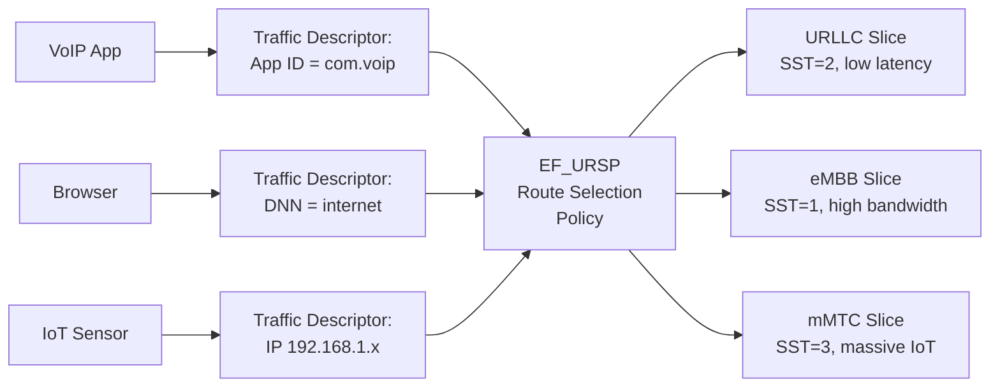
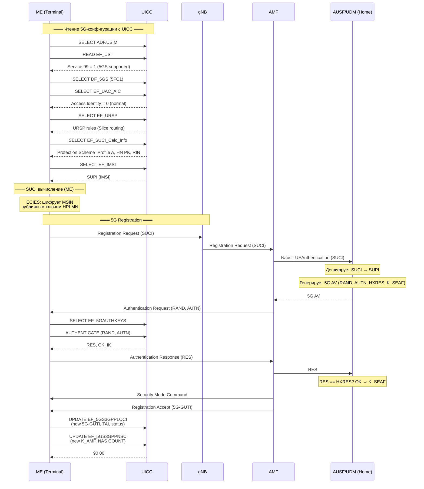

---
tags:
  - synthesis
  - SIM-files
  - 5G
  - DF_5GS
  - security
  - SUCI
  - URSP
  - UAC
type: synthesis
created: 2026-06-12
updated: 2026-06-12
status: reviewed
sources:
  - "[[wiki/summaries/ts_131102]]"
  - "[[wiki/concepts/USIM]]"
  - "[[wiki/concepts/UICC_File_System]]"
  - "[[wiki/concepts/UICC_Security]]"
  - "[[wiki/syntheses/auth_evolution]]"
  - "[[wiki/reference/USIM_EF_Table]]"
---

# 5G в SIM: DF_5GS и новые элементарные файлы

> **Synthesis** — что нового принесла 5G в файловую систему UICC: директория DF_5GS, ключи 5G AKA, SUCI-privacy, сетевая маршрутизация (URSP) и контроль доступа (UAC).

---

## 1. Обзор

С введением 5G (3GPP Release 15+) файловая система UICC претерпела значительное расширение. Внутри ADF.USIM появилась новая директория — **DF_5GS** (`0x5FC1`), содержащая 10+ специализированных EF для 5G-безопасности, конфигурации сети и privacy-защиты.

```
ADF.USIM
│
├── EF_IMSI (6F07)        ← 4G IMSI (используется и для 5G SUPI)
├── EF_Keys (6F08)         ← CK, IK от UMTS/EPS AKA
├── ...
│
└── DF_5GS (5FC1)          ← НОВОЕ: 5G-специфичные файлы
    ├── EF_5GAUTHKEYS (4F05)       ← K + RIN (5G master key)
    ├── EF_5GS3GPPNSC (4F03)       ← 5G 3GPP NAS Security Context
    │                                 (не путать с EF_5GS3GPPLOCI!)
    ├── EF_5GSN3GPPNSC (4F04)      ← 5G non-3GPP NAS Security Context
    ├── EF_SUCI_Calc_Info (4F07)   ← Home Network PK + Protection Scheme
    ├── EF_KAUSF_Derivation (4F0C) ← K_AUSF derivation parameters
    ├── EF_URSP (4F0B)             ← UE Route Selection Policy
    ├── EF_UAC_AIC (4F06)          ← UAC Access Identities Config
    ├── EF_SOR-CMCI (4F08)         ← Steering of Roaming (Connected Mode)
    ├── EF_5GS_OPL (4F08)          ← 5GS Operator PLMN List
    └── EF_5GS_EST (4F06)          ← 5GS Enabled Services Table
```

> [!tip] 5G-готовность = Service 99
> USIM объявляет поддержку 5G через бит **Service 99** в [[wiki/concepts/USIM#USIM Service Table (EF_UST)|EF_UST]]. Если бит = 0, телефон не должен пытаться читать DF_5GS.

---

## 2. Таблица файлов DF_5GS

| EF | FID | Тип | Размер | READ | UPDATE | Назначение |
|---|---|---|---|---|---|---|
| **EF_5GAUTHKEYS** | `4F05` | Transparent | 32+ байт | PIN1 | ADM | 5G master key (K) + Routing Indicator |
| **EF_5GS3GPPNSC** | `4F03` | Transparent | 32+N байт | PIN1 | PIN1 | 5G 3GPP NAS Security Context |
| **EF_5GSN3GPPNSC** | `4F04` | Transparent | 32+N байт | PIN1 | PIN1 | 5G non-3GPP NAS Security Context |
| **EF_SUCI_Calc_Info** | `4F07` | BER-TLV | переменный | PIN1 | ADM | Параметры для вычисления SUCI |
| **EF_KAUSF_Derivation** | `4F0C` | Transparent | 1+N байт | PIN1 | ADM | Параметры деривации K_AUSF |
| **EF_URSP** | `4F0B` | Transparent | до 65535 | PIN1 | ADM | UE Route Selection Policy |
| **EF_UAC_AIC** | `4F06` | Transparent | 4+ байт | PIN1 | ADM | Unified Access Control — Access Identities |
| **EF_SOR-CMCI** | `4F08` | Transparent | переменный | PIN1 | ADM | Steering of Roaming — Connected Mode |
| **EF_5GS_OPL** | `4F08` | Transparent | переменный | PIN1 | ADM | 5GS Operator PLMN List |
| **EF_5GS_EST** | `4F06` | Transparent | ≥1 байт | PIN1 | ADM | 5GS Enabled Services Table |

> [!warning] Важное различие: EF_5GS3GPPNSC vs EF_5GS3GPPLOCI
> Это **два разных файла**:
> - **EF_5GS3GPPNSC** (`0x4F03`) — NAS Security Context (ключи, алгоритмы, MAC) — находится в DF_5GS
> - **EF_5GS3GPPLOCI** (`0x6FF0`) — Location Information (GUTI, TAI, статус) — находится в ADF.USIM
>
> Они находятся в разных директориях и имеют разные FID, несмотря на похожие имена.

---

## 3. EF_5GAUTHKEYS (4F05) — 5G Authentication Keys

### 3.1 Назначение

EF_5GAUTHKEYS — это **главный файл с ключами 5G-аутентификации**. Он хранит:
- **K** — долговременный общий секрет (128 или 256 бит), аналог Ki в GSM и K в 3G/4G
- **RIN** (Routing Indicator) — определяет, какой AUSF в домашней сети обслуживает данного абонента

### 3.2 Структура

```
EF_5GAUTHKEYS (Transparent):
┌─────────────┬───────────────┬──────────────────┐
│ K Length (1)│ K (16 или 32) │ RIN (опционально)│
└─────────────┴───────────────┴──────────────────┘
```

| Поле | Размер | Описание |
|---|---|---|
| **K Length** | 1 байт | `0x10` = 128 бит (16 байт), `0x20` = 256 бит (32 байта) |
| **K** | 16 или 32 байта | Долговременный общий секрет для 5G AKA и EAP-AKA' |
| **RIN** | 0-4 байта | Routing Indicator для AUSF-маршрутизации (опционально) |

### 3.3 Ключевое отличие от 3G/4G

| Аспект | 3G/4G (EF_Keys) | 5G (EF_5GAUTHKEYS) |
|---|---|---|
| **Где хранится K** | Неявно (в EF_Keys хранятся только CK,IK — результат AKA; K — в защищённой памяти UICC) | Явно (EF_5GAUTHKEYS хранит K напрямую — но доступ ограничен ADM) |
| **Размер K** | 128 бит | 128 или **256 бит** (впервые!) |
| **Routing** | Не требуется (AUC привязан к HLR) | RIN для маршрутизации к конкретному AUSF (облачная архитектура) |

---

## 4. EF_SUCI_Calc_Info (4F07) — SUCI Calculation Info

### 4.1 Назначение

Содержит параметры для вычисления **SUCI** (Subscription Concealed Identifier) — зашифрованной версии SUPI. Детальный разбор SUCI см. в [[wiki/syntheses/auth_evolution#5.1 SUCI: Privacy Protection -- глубокий разбор|auth_evolution]].

### 4.2 Структура (BER-TLV)

| Tag | Поле | Размер | Описание |
|---|---|---|---|
| `80` | Protection Scheme ID | 1 байт | `00` = NULL, `01` = Profile A (Curve25519), `02` = Profile B (secp256r1) |
| `81` | Home Network PK ID | 1 байт | Индекс ключа в наборе оператора (0-255) |
| `82` | Home Network Public Key | переменный | DER-encoded X.509 SubjectPublicKeyInfo |
| `83` | Routing Indicator | 0-4 байта | Опциональный Routing Indicator для AUSF-маршрутизации |

### 4.3 Пример (Profile A, Curve25519)

```
80 01 01           # Protection Scheme = Profile A
81 01 03           # Home Network PK ID = 3
82 2C [44 bytes]   # X.509 DER: Curve25519 OID + 32-byte key
83 02 12 34        # Routing Indicator = "1234"
```

> [!info] Где вычисляется SUCI
> SUCI вычисляется в **ME (Mobile Equipment)**, а не в UICC. ME читает EF_SUCI_Calc_Info и EF_IMSI с UICC, затем выполняет ECIES-шифрование MSIN с использованием Home Network Public Key. Только домашняя сеть (AUSF/UDM) может дешифровать SUCI.

---

## 5. EF_KAUSF_Derivation (4F0C) — K_AUSF Derivation

### 5.1 Назначение

Определяет, **как** K_AUSF выводится из CK и IK после успешной 5G AKA. Это критично для иерархии ключей 5G.

### 5.2 Структура

```
EF_KAUSF_Derivation (Transparent):
┌──────────────────┬───────────────────────┐
│ Number of Params │ KDF Parameters (N)    │
│ (1 байт)         │ каждый: Tag + Len + Val│
└──────────────────┴───────────────────────┘
```

| Поле | Размер | Описание |
|---|---|---|
| **Number of Parameters** | 1 байт | Количество KDF-параметров (N) |
| **KDF Parameter** | переменный × N | BER-TLV: Tag `80` = Serving Network Name, Tag `81` = KDF Identifier |

### 5.3 Иерархия деривации K_AUSF

```
K (из EF_5GAUTHKEYS)
  │
  ▼ 5G AKA (MILENAGE/TUAK)
CK, IK
  │
  ▼ KDF (параметры из EF_KAUSF_Derivation)
  │   Input: CK || IK || Serving Network Name || SQN⊕AK
K_AUSF (256 bit)
  │
  ├── K_SEAF (для serving network)
  │     └── K_AMF
  │           ├── K_NASenc, K_NASint
  │           └── K_gNB
  └── ...
```

> [!note] Serving Network Name
> Опциональный параметр **Serving Network Name** (Tag `80`) позволяет привязать K_AUSF к конкретной сети, предотвращая cross-network атаки. Если параметр отсутствует, используется стандартная KDF без привязки к имени сети.

---

## 6. EF_5GS3GPPNSC (4F03) и EF_5GSN3GPPNSC (4F04) — NAS Security Context

### 6.1 Назначение

Эти файлы хранят **текущий NAS Security Context** — набор криптографических параметров для защиты сигнализации между ME и AMF. Разделение на 3GPP и non-3GPP позволяет одновременную регистрацию в 5G через cellular и Wi-Fi.

### 6.2 Структура

Оба файла имеют одинаковую структуру (Transparent):

| Поле | Размер | Описание |
|---|---|---|
| **KSI** (Key Set Identifier) | 1 байт | Идентификатор набора ключей (`000` = native 5G AKA, `001` = mapped из EPS) |
| **K_AMF** | 32 байта | K_AMF (256 bit) — корневой ключ доступа |
| **Uplink NAS COUNT** | 4 байта | Счётчик uplink NAS-сообщений |
| **Downlink NAS COUNT** | 4 байта | Счётчик downlink NAS-сообщений |
| **Selected NAS Algorithm** | 1 байт | Выбранный алгоритм шифрования и integrity для NAS |
| **selected RRC Algorithm** | 1 байт | Выбранный алгоритм для RRC |
| **selected UP Algorithm** | 1 байт | Выбранный алгоритм для User Plane |

### 6.3 Зачем разделение 3GPP / non-3GPP

- **3GPP доступ**: Cellular 5G NR (gNB)
- **Non-3GPP доступ**: Wi-Fi через N3IWF/TNGF

Одно ME может быть зарегистрировано в 5G **одновременно** через оба доступа — каждый имеет **собственный** NAS Security Context:
- Разные ключи (K_AMF могут различаться)
- Разные NAS COUNT (независимые счётчики)
- Разные алгоритмы шифрования

---

## 7. EF_URSP (4F0B) — UE Route Selection Policy

### 7.1 Назначение

**URSP** (UE Route Selection Policy) — это набор правил, определяющих, какой трафик через какой **Network Slice** направлять. Это ключевой механизм 5G network slicing.

### 7.2 Структура

```
EF_URSP (Transparent, BER-TLV структура внутри):
┌──────────────┬──────────────────────────────────┐
│ Header (1B+) │ URSP Rules (N записей)           │
└──────────────┴──────────────────────────────────┘

Каждое правило (URSP Rule):
┌─────────┬──────────┬───────────┬──────────────┐
│ Rule ID │ Priority │ Traffic   │ Route        │
│         │          │ Descriptor│ Selection    │
└─────────┴──────────┴───────────┴──────────────┘
```

| Компонент | Описание |
|---|---|
| **Rule ID** | Уникальный идентификатор правила |
| **Priority** | Приоритет правила (чем меньше, тем выше) |
| **Traffic Descriptor** | Какой трафик (App ID, IP descriptor, DNN, FQDN) |
| **Route Selection** | Куда маршрутизировать: S-NSSAI (Slice), DNN, SSC Mode |

### 7.3 Пример: URSP rule

```
Правило 1 (Priority 1):
  Traffic: App = "com.voip.app"
  Route:   Slice = URLLC (SST=2), DNN = "ims"

Правило 2 (Priority 5):
  Traffic: IP = 10.0.0.0/8
  Route:   Slice = eMBB (SST=1), DNN = "internet"
```

### 7.4 Mermaid: как URSP работает



> [!info] URSP vs ANDSP
> В 4G аналогичную роль выполнял **ANDSF** (Access Network Discovery and Selection Function), но он был опциональным и редко развёртывался. URSP в 5G — обязательный элемент для network slicing.

---

## 8. EF_UAC_AIC (4F06) — UAC Access Identities Configuration

### 8.1 Назначение

**UAC** (Unified Access Control) — механизм контроля доступа к сети в 5G. EF_UAC_AIC определяет **Access Identities** — привилегии абонента при перегрузке сети.

### 8.2 Access Identities

| Identity | Назначение |
|---|---|
| **0** | Не назначен (обычный абонент) |
| **1** | PLMN staff (сотрудники оператора) |
| **2** | Emergency services |
| **3** | Public Utilities (электричество, вода, газ) |
| **4** | Security Services (полиция) |
| **5** | PLMN use (операторское) |
| **11** | PLMN Config 1 (Access Class 11 из 4G) |
| **12** | PLMN Config 2 (Access Class 12) |
| **13** | PLMN Config 3 (Access Class 13) |
| **14** | PLMN Config 4 (Access Class 14) |
| **15** | PLMN Config 5 (Access Class 15) |

### 8.3 Приоритет при перегрузке

При перегрузке сети AMF посылает **UAC Barring Info**: какие Access Identities имеют приоритет. Например:
- Identity 2 (Emergency) — всегда имеет доступ
- Identity 4 (Security) — высокий приоритет
- Identity 0 (Normal) — может быть заблокирован при перегрузке

---

## 9. Что нового по сравнению с 4G

### 9.1 Сравнительная таблица

| Аспект | 4G (LTE) | 5G |
|---|---|---|
| **Директория** | Нет специализированной DF | **DF_5GS** (`0x5FC1`) |
| **Ключи аутентификации** | EF_Keys (CK,IK), K неявный | **EF_5GAUTHKEYS** (K до 256 бит) |
| **NAS Security Context** | Хранится в ME (не на UICC) | **EF_5GS3GPPNSC** / **EF_5GSN3GPPNSC** (на UICC!) |
| **Контекст для non-3GPP** | Отдельный EF не предусмотрен | **EF_5GSN3GPPNSC** (Wi-Fi calling security) |
| **Privacy (SUCI)** | Нет (IMSI открыт) | **EF_SUCI_Calc_Info** (ECIES шифрование SUPI) |
| **K_AUSF деривация** | Не применимо (нет AUSF) | **EF_KAUSF_Derivation** (параметры KDF) |
| **Network Slicing** | Нет | **EF_URSP** (Route Selection Policy) |
| **Access Control** | EF_ACC (Access Class 11-15) | **EF_UAC_AIC** (Unified Access Control) |
| **Steering of Roaming** | OTA-only | **EF_SOR-CMCI** (Connected Mode Control) |
| **Service Table** | EF_EST | **EF_5GS_EST** (5G-specific services) |

### 9.2 Ключевые архитектурные изменения

1. **Облачная аутентификация (AUSF)**. В 4G MME выполнял аутентификацию. В 5G AUSF — облачный сервис в HPLMN. RIN в EF_5GAUTHKEYS и EF_SUCI_Calc_Info маршрутизирует запросы к конкретному AUSF.

2. **SUCI Privacy**. Впервые идентификатор абонента шифруется в эфире. EF_SUCI_Calc_Info предоставляет Home Network Public Key для ECIES.

3. **Network Slicing на UICC**. EF_URSP переносит логику выбора слайса на UICC — оператор может предварительно сконфигурировать правила маршрутизации.

4. **NAS Context на UICC**. В 4G NAS Security Context хранился только в ME. В 5G он сохраняется и на UICC (EF_5GS3GPPNSC), что позволяет восстановить контекст при перезагрузке ME без полной AKA.

---

## 10. Mermaid: инициализация 5G с UICC



---

## 11. Связи

- **Эволюция аутентификации**: от GSM до 5G AKA — [[wiki/syntheses/auth_evolution|Auth Evolution]]
- **USIM**: DF_5GS находится в [[wiki/concepts/USIM|ADF.USIM]]
- **Файловая система**: [[wiki/concepts/UICC_File_System|UICC File System]]
- **Типы EF**: все файлы DF_5GS — Transparent или BER-TLV — [[wiki/concepts/EF_Types|EF Types]]
- **Безопасность**: K, CK, IK, K_AUSF — [[wiki/concepts/UICC_Security|UICC Security]]
- **SUCI**: детальный криптографический разбор в [[wiki/syntheses/auth_evolution#5.1 SUCI: Privacy Protection -- глубокий разбор|auth_evolution]]
- **Location**: отдельно от NAS Security Context — [[wiki/syntheses/sim_files_location|EF_5GS3GPPLOCI, EF_5GSN3GPPLOCI]]
- **Справочник**: [[wiki/reference/USIM_EF_Table|USIM EF Table]] — раздел 5G Security
- **Спецификация**: [[wiki/summaries/ts_131102|TS 31.102]] — Clause 4.4 (DF_5GS)
