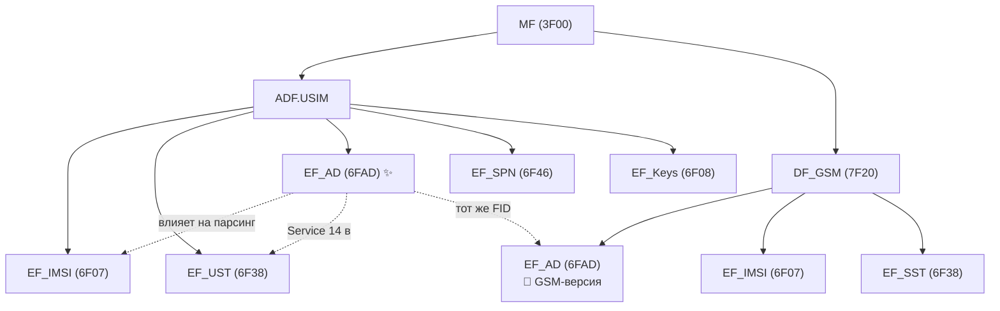
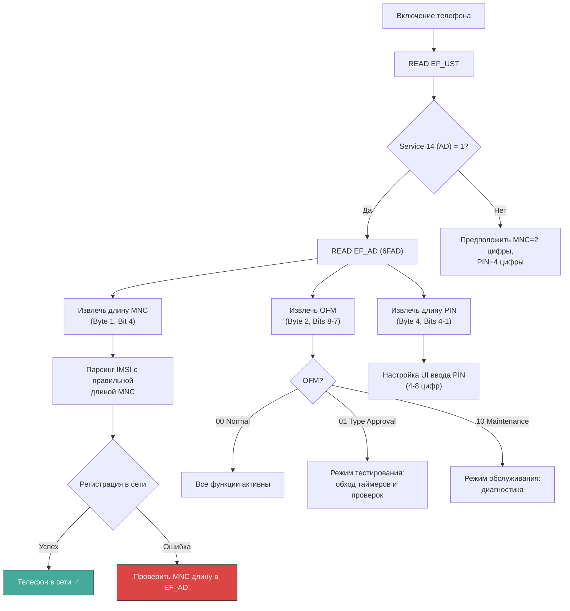
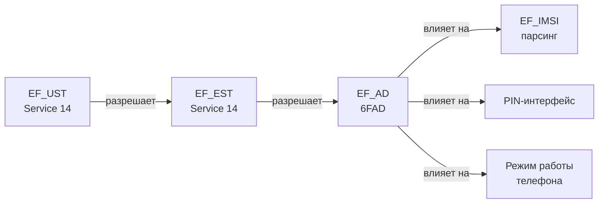

---
tags:
  - synthesis
  - USIM
  - EF
  - administrative-data
  - MNC
  - PIN
type: synthesis
created: 2026-06-12
updated: 2026-06-12
status: reviewed
sources:
  - "[[wiki/summaries/ts_131102]]"
  - "[[wiki/summaries/gsm_1111]]"
  - "[[wiki/concepts/USIM]]"
  - "[[wiki/concepts/UICC_File_System]]"
  - "[[wiki/concepts/EF_Types]]"
  - "[[wiki/reference/USIM_EF_Table]]"
  - "[[wiki/syntheses/gsm_vs_usim_filesystem]]"
---

# Административные данные: EF_AD

> **Synthesis** — EF_AD (6FAD): как UICC сообщает терминалу длину MNC, режим работы, длину PIN и прочие административные параметры.

---

## 1. Определение и назначение

**EF_AD** (Administrative Data) — это Transparent EF в ADF.USIM, который содержит **критически важные для работы телефона параметры**: длину кода мобильной сети (MNC), режим работы UICC, длину PIN-кода и дополнительные флаги. Без EF_AD терминал не может правильно распарсить IMSI и определить поведение карты. ^[extracted]

Файл существует как в GSM SIM (`0x6FAD` в DF_GSM), так и в USIM (тот же FID в ADF.USIM) — ещё один пример сохранения FID между поколениями.

---

## 2. Положение в файловой системе



---

## 3. Параметры файла

| Свойство | Значение |
|---|---|
| **FID** | `0x6FAD` |
| **Тип** | Transparent EF |
| **Расположение** | ADF.USIM (и DF_GSM в GSM) |
| **Размер** | 4 + N байт |
| **Access** | READ: ALW, UPDATE: ADM |
| **Стандарт** | 3GPP TS 31.102, Clause 4.2.14 |
| **Связанный сервис** | Service 14 в EF_UST |

---

## 4. Структура EF_AD

EF_AD состоит из обязательной части (4 байта) и опционального расширения:

```
EF_AD (Transparent):
┌──────────┬──────────┬──────────┬──────────┬──────────────┐
│ Byte 1   │ Byte 2   │ Byte 3   │ Byte 4   │ Bytes 5...N  │
│ MSI      │ RFU +    │ RFU      │ RFU +    │ Дополнительные│
│ (MNC len)│ OFM      │          │ PIN len  │ поля          │
└──────────┴──────────┴──────────┴──────────┴──────────────┘
   ← обязательная часть (4 байта) →   ← опционально →
```

### Байт 1: MSI (MNC Storage Info)

Определяет длину MNC (Mobile Network Code) в IMSI:

| Биты | Поле | Значение |
|---|---|---|
| b8-b5 | RFU | 0 |
| b4 | **MNC Length** | **0** = 2 цифры, **1** = 3 цифры |
| b3-b1 | RFU | 0 |

```
Byte 1:
  b8 b7 b6 b5 b4 b3 b2 b1
   0  0  0  0  X  0  0  0
               ↑
               MNC Length: 0 = 2 digits, 1 = 3 digits

Примеры:
  0x00 = MNC из 2 цифр (европейский стандарт)
  0x08 = MNC из 3 цифр (североамериканский стандарт)
```

### Байт 2: OFM и режим работы

| Биты | Поле | Значение |
|---|---|---|
| b8-b7 | **OFM** (Operational Feature Mode) | `00` = normal, `01` = type approval, `10` = maintenance, `11` = RFU |
| b6-b1 | RFU | 0 |

```
OFM (Operational Feature Mode) — определяет поведение UICC:

00 = Normal mode
  → Стандартный режим, все функции активны

01 = Type approval mode
  → Режим тестирования: отключены таймеры, упрощены проверки безопасности
  → Используется при сертификации терминалов (GCF/PTCRB)

10 = Maintenance mode
  → Режим обслуживания: диагностика, специальные команды
  → Для отладки оператором в лаборатории

11 = RFU (зарезервировано)
```

### Байт 3: RFU

Зарезервирован для будущего использования. Должен быть `0x00`.

### Байт 4: Длина PIN

| Биты | Поле | Значение |
|---|---|---|
| b8-b5 | RFU | 0 |
| b4-b1 | **PIN Length** | Длина PIN-кода (4-8 цифр) |

```
Byte 4:
  b8 b7 b6 b5 b4 b3 b2 b1
   0  0  0  0  X  X  X  X
               ↑--------↑
               PIN Length (4-8)

Примеры:
  0x04 = PIN из 4 цифр
  0x06 = PIN из 6 цифр
  0x08 = PIN из 8 цифр
```

### Байты 5...N: Дополнительные поля

Опциональные поля, содержащие расширенную информацию:

| Поле | Байты | Описание |
|---|---|---|
| **UE Type** | 1 байт | Тип пользовательского оборудования |
| **Additional Info** | Переменная | Специфичные для оператора данные |

---

## 5. MNC Coding: почему длина так важна

### Проблема двух- и трёхзначных MNC

IMSI состоит из MCC (3 цифры) + MNC (2 или 3 цифры) + MSIN (остальное). Без знания длины MNC терминал не может правильно отделить MNC от MSIN:

```
IMSI = 250 02 1234567890
       ↑↑↑ ↑↑ ↑↑↑↑↑↑↑↑↑
       MCC MNC MSIN

Если терминал думает что MNC = 2 цифры:  MNC=02, MSIN=1234567890 ✅
Если терминал думает что MNC = 3 цифры: MNC=021, MSIN=234567890  ❌ ОШИБКА!
```

Именно бит в EF_AD Byte 1 разрешает эту неоднозначность.

### Географическое распределение

| Регион | Длина MNC | Примеры |
|---|---|---|
| **Европа, Азия, Африка** | 2 цифры | 250 02 (MegaFon RU), 234 15 (Vodafone UK) |
| **Северная Америка** | 3 цифры | 310 260 (T-Mobile US), 302 720 (Rogers CA) |
| **Индия** | 2 или 3 цифры | Зависит от оператора |

> [!tip] Практический совет
> Если терминал неправильно отображает MCC+MNC или не может зарегистрироваться в сети — первое что нужно проверить: правильная ли длина MNC в EF_AD. Это одна из самых частых причин проблем с регистрацией.

---

## 6. Как EF_AD влияет на работу телефона



### Конкретные последствия неправильного EF_AD

| Ошибка в EF_AD | Симптом |
|---|---|
| MNC длина неверна | IMSI парсится неправильно, аутентификация падает, телефон не регистрируется |
| OFM = Type Approval в продакшене | Обходятся проверки безопасности, телефон может работать нестабильно |
| Длина PIN не указана | Интерфейс ввода PIN может не появиться или запросить неверное количество цифр |
| EF_AD отсутствует (Service 14 = 0) | Терминал предполагает MNC=2 цифры, PIN=4 цифры, Normal mode |

---

## 7. Связь с EF_UST и EF_EST

EF_AD доступен только если **Service 14 установлен в 1** в EF_UST:

```
EF_UST Service 14 = 1
  └─> EF_AD существует и доступен
      ├─> EF_EST Service 14 = 1 → EF_AD читается
      └─> EF_EST Service 14 = 0 → EF_AD заблокирован
                                  → Терминал использует значения по умолчанию

EF_UST Service 14 = 0
  └─> EF_AD не существует или не инициализирован
      └─> Терминал использует значения по умолчанию
```

### Цепочка зависимостей



---

## 8. Эволюция EF_AD: GSM SIM vs USIM

| Свойство | EF_AD (GSM 11.11) | EF_AD (TS 31.102) |
|---|---|---|
| **FID** | `0x6FAD` | `0x6FAD` (тот же!) |
| **Расположение** | DF_GSM (`7F20`) | ADF.USIM |
| **Размер** | 4 байта (фикс.) | 4 + N байт |
| **Byte 2 OFM** | Да | Да |
| **Byte 4 PIN Length** | Да | Да |
| **Дополнительные поля** | Нет | Да (UE Type, ...) |
| **Сервисная таблица** | SST Service 14 | UST Service 14 |

Ключевое: **FID и структура первых 4 байт идентичны** между GSM и USIM. Это ещё один пример дизайн-принципа обратной совместимости ETSI/3GPP.

---

## 9. Практический пример: чтение EF_AD

### Через pySim-shell

```bash
pySim-shell> select ADF.USIM
pySim-shell> read_binary 0x6FAD
# Ответ: 00 00 00 04
#
# Byte 1 = 0x00: MNC = 2 цифры
# Byte 2 = 0x00: OFM = Normal mode
# Byte 3 = 0x00: RFU
# Byte 4 = 0x04: PIN = 4 цифры
```

### Пример с 3-значным MNC (Северная Америка)

```bash
pySim-shell> read_binary 0x6FAD
# Ответ: 08 00 00 06 01 FF ...
#
# Byte 1 = 0x08: MNC = 3 цифры
# Byte 2 = 0x00: OFM = Normal mode
# Byte 3 = 0x00: RFU
# Byte 4 = 0x06: PIN = 6 цифр
# Byte 5 = 0x01: UE Type = ...
# ...
```

### Python-декодирование

```python
def decode_ef_ad(data):
    """Декодирует EF_AD в читаемый словарь."""
    if len(data) < 4:
        raise ValueError("EF_AD requires at least 4 bytes")

    byte1 = data[0]
    byte2 = data[1]
    byte4 = data[3]

    mnc_len = 2 if (byte1 & 0x08) == 0 else 3

    ofm_bits = (byte2 >> 6) & 0x03
    ofm_map = {0: "Normal", 1: "Type Approval", 2: "Maintenance", 3: "RFU"}
    ofm = ofm_map.get(ofm_bits, "Unknown")

    pin_len = byte4 & 0x0F

    result = {
        'mnc_length': mnc_len,
        'ofm': ofm,
        'pin_length': pin_len,
    }

    if len(data) > 4:
        result['additional_data'] = data[4:].hex()

    return result

# Примеры
ad1 = bytes.fromhex("00000004")
print(decode_ef_ad(ad1))
# {'mnc_length': 2, 'ofm': 'Normal', 'pin_length': 4}

ad2 = bytes.fromhex("08000006")
print(decode_ef_ad(ad2))
# {'mnc_length': 3, 'ofm': 'Normal', 'pin_length': 6}
```

---

## 10. Особые случаи и диагностика

### Случай 1: EF_AD отсутствует (Service 14 = 0)

Если в EF_UST Service 14 равен 0, EF_AD не существует. Терминал применяет значения по умолчанию:

```
По умолчанию:
  MNC Length = 2
  OFM = Normal
  PIN Length = 4
```

Это минимально безопасные настройки, подходящие для большинства рынков (кроме Северной Америки с 3-значным MNC).

### Случай 2: Режим Type Approval в продакшен-карте

> [!danger] Критическая ошибка конфигурации
> Если EF_AD Byte 2 содержит OFM = Type Approval (`01`), терминал может:
> - Игнорировать таймеры повторной аутентификации
> - Принимать невалидные сертификаты
> - Отключать часть проверок безопасности
>
> Это допустимо только в лабораторных SIM-картах для GCF/PTCRB-тестирования. **Никогда не должно встречаться в продакшен-картах абонентов.**

### Случай 3: Несоответствие EF_AD и реальной длины MNC в IMSI

```
EF_AD говорит MNC = 2 цифры
EF_IMSI содержит: 310 260 123456789
                  ↑↑↑ ↑↑↑
                  MCC  MNC (но это 3 цифры!)

→ Терминал парсит: MNC=31, MSIN=0260123456789
→ Аутентификация: ошибка
→ Симптом: телефон не регистрируется в сети, но другие SIM работают
```

---

## 11. Связь с другими файлами

### EF_AD и EF_IMSI

EF_AD Byte 1 определяет как парсить IMSI в EF_IMSI (`6F07`). Неправильная длина MNC ломает всю аутентификацию.

### EF_AD и PIN

EF_AD Byte 4 определяет ожидаемую длину PIN-кода. Если длина установлена в 6, а пользователь вводит 4-значный PIN — терминал должен отклонить ввод (или запросить повторно).

### EF_AD и UE Type (байт 5+)

Дополнительное поле UE Type указывает категорию устройства, для которого предназначена UICC:
- Смартфон
- Планшет
- IoT-устройство (NB-IoT, LTE-M)
- Автомобильное устройство (V2X)
- ...

Это поле используется для конфигурации специфичных для типа устройства параметров (например, таймеры T3412 для IoT).

---

## Связи

- **Спецификация USIM**: [[wiki/summaries/ts_131102|TS 31.102]]
- **Спецификация GSM SIM**: [[wiki/summaries/gsm_1111|GSM 11.11]]
- **ADF.USIM**: [[wiki/concepts/USIM|USIM Application]]
- **Файловая система**: [[wiki/concepts/UICC_File_System|UICC File System]]
- **Типы EF (Transparent)**: [[wiki/concepts/EF_Types|Elementary File Types]]
- **Сервисная таблица (Service 14)**: [[wiki/syntheses/sim_files_service_table|Service Table: EF_UST]]
- **EF_IMSI (зависит от длины MNC)**: [[wiki/reference/USIM_EF_Table|USIM EF Table]]
- **Эволюция SIM -> USIM**: [[wiki/syntheses/gsm_vs_usim_filesystem|GSM vs USIM Filesystem]]
- **Безопасность UICC (PIN)**: [[wiki/concepts/UICC_Security|UICC Security]]
