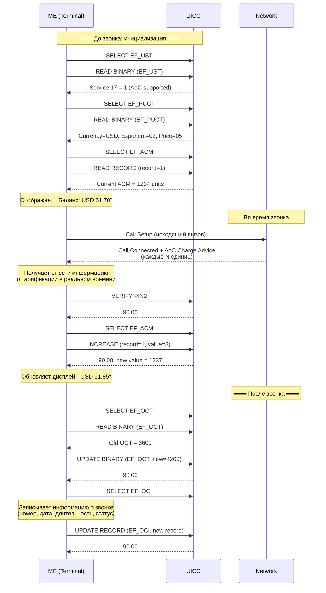
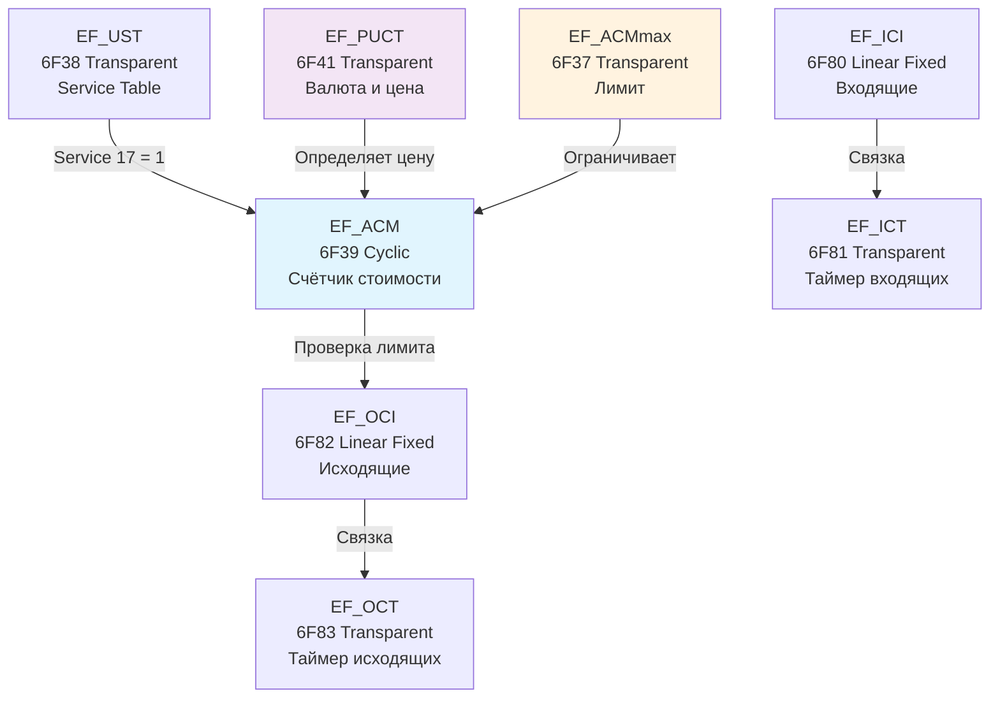

---
tags:
  - synthesis
  - SIM-files
  - ACM
  - Advice-of-Charge
  - call-metering
  - telephony
type: synthesis
created: 2026-06-12
updated: 2026-06-12
status: reviewed
sources:
  - "[[wiki/summaries/ts_131102]]"
  - "[[wiki/concepts/USIM]]"
  - "[[wiki/concepts/UICC_File_System]]"
  - "[[wiki/concepts/EF_Types]]"
---

# SIM-файлы тарификации звонков: ACM, ICT, OCT и Advice of Charge

> **Synthesis** — как SIM-карта считает деньги: архитектура Advice of Charge (AoC), счётчики звонков и информационные файлы.

---

## 1. Обзор

SIM-карта не только идентифицирует абонента в сети, но и **участвует в тарификации** — подсчитывает стоимость звонков и хранит сопутствующую информацию. Этот механизм называется **Advice of Charge (AoC)** и реализуется через группу EF внутри ADF.USIM.

```
┌─────────────────────────────────────────────────────┐
│           Advice of Charge (AoC) Architecture        │
│                                                      │
│  ┌──────────────┐    ┌──────────────┐                │
│  │ EF_ACM (6F39)│    │EF_ACMmax(6F37)│               │
│  │ Cyclic       │    │  Transparent │                │
│  │ Суммарный    │◄───│  Лимит       │                │
│  │ счётчик      │    │  звонков     │                │
│  └──────┬───────┘    └──────────────┘                │
│         │                                             │
│  ┌──────┴───────┐    ┌──────────────┐                │
│  │ EF_PUCT(6F41)│    │  INCREASE    │                │
│  │  Transparent │    │  команда     │                │
│  │  Валюта +    │    │  обновляет   │                │
│  │  цена за ед. │    │  ACM         │                │
│  └──────────────┘    └──────────────┘                │
│                                                      │
│  ┌──────────────┐    ┌──────────────┐                │
│  │ EF_ICI (6F80)│    │ EF_OCI (6F82)│                │
│  │ Linear Fixed │    │ Linear Fixed │                │
│  │ Информация о │    │ Информация о │                │
│  │ входящих     │    │ исходящих    │                │
│  └──────┬───────┘    └──────┬───────┘                │
│         │                    │                        │
│  ┌──────┴───────┐    ┌──────┴───────┐                │
│  │ EF_ICT (6F81)│    │ EF_OCT (6F83)│                │
│  │  Transparent │    │  Transparent │                │
│  │  Таймер      │    │  Таймер      │                │
│  │  входящих    │    │  исходящих   │                │
│  └──────────────┘    └──────────────┘                │
└─────────────────────────────────────────────────────┘
```

> [!info] Где это определено
> AoC описан в 3GPP TS 31.102 (USIM), раздел Advice of Charge. Поддержка AoC контролируется битом Service 17 в [[wiki/concepts/USIM#USIM Service Table (EF_UST)|EF_UST]].

---

## 2. Таблица файлов

| EF | FID | Тип | Размер | READ | UPDATE | INCREASE |
|---|---|---|---|---|---|---|
| **EF_ACM** | `6F39` | Cyclic | 3 байта/запись | PIN1 | PIN2 | PIN2 |
| **EF_ACMmax** | `6F37` | Transparent | 3 байта | PIN1 | PIN2 | — |
| **EF_PUCT** | `6F41` | Transparent | 8+N байт | PIN1 | ADM | — |
| **EF_ICI** | `6F80` | Linear Fixed | N×29 байт | PIN1 | ADM | — |
| **EF_ICT** | `6F81` | Transparent | 3 байта | PIN1 | ADM | — |
| **EF_OCI** | `6F82` | Linear Fixed | N×29 байт | PIN1 | ADM | — |
| **EF_OCT** | `6F83` | Transparent | 3 байта | PIN1 | ADM | — |

> [!warning] PIN2 для ACM
> EF_ACM и EF_ACMmax защищены **PIN2**, не PIN1. Это означает, что оператор может ограничить доступ к счётчику звонков, даже если PIN1 верифицирован. На практике многие телефоны не запрашивают PIN2 и не обновляют ACM.

---

## 3. EF_ACM (6F39) — Accumulated Call Meter

### 3.1 Назначение

EF_ACM — это **накопительный счётчик** стоимости звонков. Тип файла: **Cyclic** (кольцевой буфер записей). Каждая запись — 3 байта, хранящих количество потраченных единиц (units) в двоичном формате.

### 3.2 Структура записи

```
Запись EF_ACM (3 байта):
┌──────────┬──────────┬──────────┐
│ Byte 0   │ Byte 1   │ Byte 2   │
│ (MSB)    │          │ (LSB)    │
└──────────┴──────────┴──────────┘
Значение: беззнаковое целое, до 2^24 - 1 = 16 777 215 единиц
```

### 3.3 Cyclic-природа

EF_ACM — **cyclic**, а не transparent: это означает, что существует **несколько записей** (обычно 1 или более). Cyclic позволяет вести историю: при переполнении одной записи данные могут быть перенесены в следующую. Стандарт не фиксирует количество записей — это решение оператора.

### 3.4 Как обновляется: команда INCREASE

ACM обновляется **не** через UPDATE RECORD, а через специальную команду **INCREASE** (INS=`0x32`). Это единственный тип EF, поддерживающий INCREASE (см. [[wiki/concepts/EF_Types#INCREASE и Transparent EF|EF_Types]]).

```
ME                                    UICC
 │                                      │
 │── VERIFY PIN2 ──────────────────────→│  ← Требуется PIN2
 │←── 90 00 (OK) ──────────────────────│
 │                                      │
 │── SELECT EF_ACM (0x6F39) ───────────→│
 │←── FCP ──────────────────────────────│
 │                                      │
 │── INCREASE (record=1, value=0x000005)──→│  ← +5 единиц
 │←── 90 00 + new value ───────────────│  ← Возвращает новое значение
```

> [!tip] INCREASE vs UPDATE
> INCREASE — **атомарная** операция: UICC читает текущее значение, прибавляет переданное, записывает обратно. Это гарантирует корректность счётчика даже при прерывании питания. Команда INCREASE возвращает новое значение в response data.

### 3.5 Переполнение

При достижении максимального значения (`0xFFFFFF`) следующее INCREASE вызывает **сброс в 0** (wrapping). Это поведение аналогично переполнению беззнакового целого.

---

## 4. EF_ACMmax (6F37) — ACM Maximum Value

### 4.1 Назначение

**Лимит** стоимости звонков. Если ACM достигает ACMmax, дальнейшие звонки **запрещены** до сброса счётчика (через ADM).

### 4.2 Структура

```
EF_ACMmax (3 байта, Transparent):
┌──────────┬──────────┬──────────┐
│ Byte 0   │ Byte 1   │ Byte 2   │
│ (MSB)    │          │ (LSB)    │
└──────────┴──────────┴──────────┘
```

- Значение `0x000000` означает "лимит не установлен / AoC отключён"
- UPDATE требует PIN2
- После установки лимита телефон должен проверять ACM перед каждым исходящим звонком

---

## 5. EF_PUCT (6F41) — Price per Unit and Currency Table

### 5.1 Назначение

Определяет **денежную единицу** (валюту) и **стоимость одной единицы** (unit) в этой валюте. Без PUCT счётчик ACM считает абстрактные "единицы"; с PUCT телефон может отображать реальную денежную сумму.

### 5.2 Структура

```
EF_PUCT (Transparent, минимум 8 байт):
┌──────────┬──────────┬──────────┬──────────┬──────────┬──────────┬──────────┬──────────┐
│ Byte 0-2 │ Byte 3   │ Byte 4   │ Byte 5   │ Byte 6   │ Byte 7   │ Byte 8+  │
│ Currency │ Exponent │ Separator│ PUCT way │ Charge   │ Price    │ Extension│
│ Code     │          │          │          │ Table    │ per Unit │ (опц.)   │
└──────────┴──────────┴──────────┴──────────┴──────────┴──────────┴──────────┘
```

| Поле | Размер | Описание |
|---|---|---|
| **Currency Code** | 3 байта | ISO 4217 (напр. `0x00 0x08 0x26` = USD, `0x00 0x09 0x78` = EUR) или GSM alphabet |
| **Exponent** | 1 байт | Десятичная позиция (например, `02` = делить на 100) |
| **Separator** | 1 байт | Символ-разделитель (`.` или `,`) |
| **PUCT way** | 1 байт | Способ вычисления: `00` = одна цена на всё, `01` = таблица с разной ценой |
| **Charge Table** | 1 байт | Количество записей в Charge Advice Information (если PUCT way = `01`) |
| **Price per Unit** | 1+ байт | Цена в выбранной валюте (BCD или binary) |

> [!example] Пример: 1 unit = 0.05 EUR
> Currency Code: `00 09 78` (EUR), Exponent: `02`, Separator: `,`, Price per Unit: `05` → телефон отображает "EUR 0,05/unit"

---

## 6. EF_ICI (6F80) и EF_OCI (6F82) — Информация о звонках

### 6.1 Назначение

Эти два файла хранят **детальную информацию** о последних звонках. Оба — Linear Fixed, каждая запись — 29 байт.

| EF | Назначение | FID |
|---|---|---|
| **EF_ICI** | Incoming Call Information — информация о входящих | `6F80` |
| **EF_OCI** | Outgoing Call Information — информация об исходящих | `6F82` |

### 6.2 Структура записи (29 байт)

| Поле | Размер | Описание |
|---|---|---|
| **Called/Calling Number** | до 20 байт | Номер (BCD, длина в первом байте) |
| **TON/NPI** | 1 байт | Type of Number / Numbering Plan Identification |
| **Date/Time** | 4 байта | Дата и время звонка (BCD: YY MM DD HH MM SS) |
| **Duration** | 3 байта | Длительность (BCD или binary) |
| **Call result** | 1 байт | Статус звонка (answered, busy, no reply, etc.) |

### 6.3 Call Result values

| Значение | Статус |
|---|---|
| `0x00` | Информация недоступна |
| `0x01` | Отвечен |
| `0x02` | Занято |
| `0x03` | Нет ответа |
| `0x04` | Отклонён/сброшен пользователем |
| `0x05` | Отклонён сетью |

---

## 7. EF_ICT (6F81) и EF_OCT (6F83) — Таймеры звонков

### 7.1 Назначение

Суммарная длительность входящих (ICT) и исходящих (OCT) звонков. Оба — **Transparent**, 3 байта.

```
EF_ICT / EF_OCT (3 байта, Transparent):
┌──────────┬──────────┬──────────┐
│ Byte 0   │ Byte 1   │ Byte 2   │
│ (MSB)    │          │ (LSB)    │
└──────────┴──────────┴──────────┘
Значение: секунды, до 2^24 - 1 ≈ 194 дня
```

- **EF_ICT**: суммарное время всех входящих звонков (секунды)
- **EF_OCT**: суммарное время всех исходящих звонков (секунды)
- Обновляются терминалом через UPDATE BINARY после каждого звонка
- Требуют PIN1 для чтения, ADM для записи

---

## 8. Advice of Charge: как SIM считает деньги

### 8.1 Полный цикл AoC при исходящем звонке



### 8.2 AoC information от сети

Во время звонка сеть может посылать **AoC information** через:
- **AoCI** (Advice of Charge Information): стоимость текущего звонка
- **AoCC** (Advice of Charge Charging): обновление ACM на SIM

Телефон получает эту информацию и через INCREASE обновляет EF_ACM.

### 8.3 Проверка лимита

```
Перед каждым исходящим звонком:

1. ME читает EF_ACMmax
   ├── ACMmax = 0x000000 → лимита нет, звонок разрешён
   └── ACMmax > 0 →
       2. ME читает EF_ACM
          ├── ACM >= ACMmax → ЗВОНОК ЗАПРЕЩЁН
          └── ACM < ACMmax → звонок разрешён
               После звонка: ACM увеличивается на стоимость
```

> [!danger] Блокировка звонков
> При ACM >= ACMmax **все исходящие звонки запрещены**, кроме экстренных (112/911 и из [[wiki/syntheses/sim_files_emergency|EF_ECC]]). Сброс ACM требует ADM-доступа — обычный пользователь не может обойти лимит.

---

## 9. Сценарии использования

### 9.1 Prepaid-тарификация

В prepaid-сценарии AoC используется для информирования абонента о расходовании баланса:
- ACM отражает текущий счёт
- ACMmax может быть установлен в 0 (безлимитный prepaid) или в сумму пополнения
- Телефон отображает стоимость в реальном времени

### 9.2 Corporate control

В корпоративных SIM:
- ACMmax устанавливается как месячный лимит на звонки
- При превышении лимита звонки блокируются
- Только администратор (ADM) может сбросить ACM

### 9.3 Payphone / таксофон

В таксофонах GSM:
- AoC используется для поминутной тарификации
- ACM увеличивается каждую минуту (или тарификационный интервал)
- При достижении нулевого баланса звонок прерывается

---

## 10. Взаимодействие с другими файлами



---

## 11. Связи

- **Стандарт**: AoC определён в [[wiki/summaries/ts_131102|TS 31.102]], Clause 5.3 (Subscription)
- **Платформа**: файлы находятся в [[wiki/concepts/UICC_File_System|ADF.USIM]]
- **Типы EF**: Cyclic (ACM), Transparent (ACMmax, PUCT, ICT, OCT), Linear Fixed (ICI, OCI) — [[wiki/concepts/EF_Types|EF Types]]
- **Безопасность**: PIN2 для ACM, ADM для сброса — [[wiki/concepts/UICC_Security|UICC Security]]
- **Сервисы**: Service 17 (AoC) в [[wiki/concepts/USIM#USIM Service Table (EF_UST)|EF_UST]]
- **Экстренные вызовы**: звонки через [[wiki/syntheses/sim_files_emergency|EF_ECC]] не блокируются лимитом ACM
- **Связанные файлы**: [[wiki/reference/USIM_EF_Table|USIM EF Table]] — раздел Телефония
