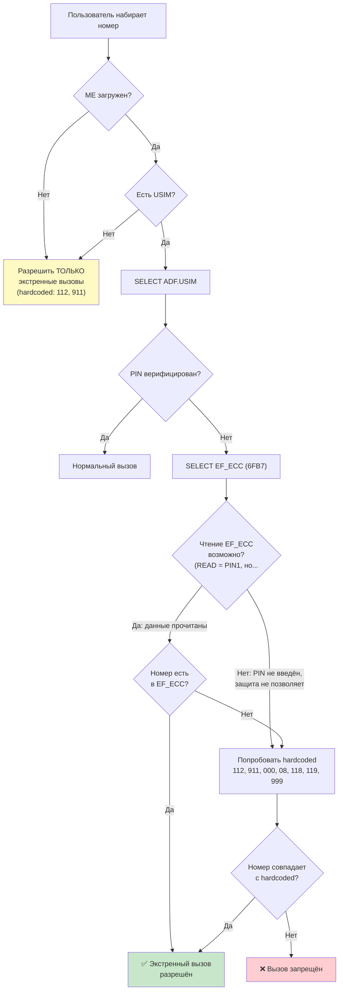
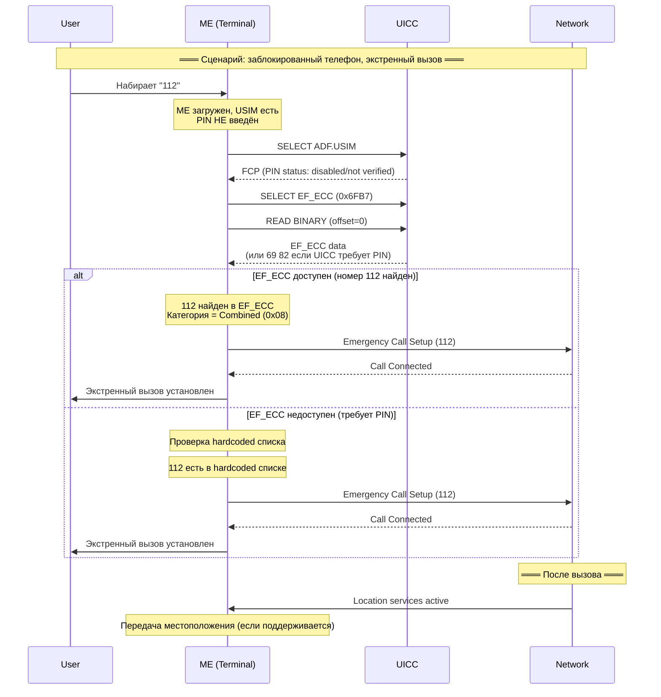

---
tags:
  - synthesis
  - SIM-files
  - ECC
  - emergency
  - номер-экстренной-службы
  - 112
type: synthesis
created: 2026-06-12
updated: 2026-06-12
status: reviewed
sources:
  - "[[wiki/summaries/ts_131102]]"
  - "[[wiki/concepts/USIM]]"
  - "[[wiki/concepts/UICC_File_System]]"
  - "[[wiki/concepts/EF_Types]]"
---

# Экстренные номера: EF_ECC

> **Synthesis** — как SIM-карта хранит экстренные номера, почему они доступны без PIN и чем EF_ECC отличается от eCall.

---

## 1. Обзор

**EF_ECC** (Emergency Call Codes, `0x6FB7`) — это Transparent EF внутри ADF.USIM, содержащий **список экстренных номеров**, которые абонент может набрать **даже без PIN-верификации и даже при отсутствии USIM-сессии**. Это один из немногих файлов, доступных при заблокированной карте.

> [!tip] Ключевой факт
> Экстренные вызовы работают **даже если PIN не введён**. Телефон читает EF_ECC до верификации PIN, и если набранный номер совпадает с записью в EF_ECC — вызов проходит без аутентификации пользователя.

---

## 2. Таблица характеристик

| Свойство | Значение |
|---|---|
| **FID** | `0x6FB7` |
| **Тип** | Transparent (поток байт) |
| **Расположение** | ADF.USIM |
| **READ access** | PIN1 |
| **UPDATE access** | ADM |
| **Минимальный размер** | 3 байта (1 запись) |
| **Максимальный размер** | Определяется оператором (обычно до ~200 байт) |

---

## 3. Структура EF_ECC

### 3.1 Формат

```
EF_ECC — Transparent, структура TLV-подобная:

┌────────────┬───────────────────────────────────────┬───────────
│ Length (1) │ Emergency Code 1                      │ Code 2...
│ N записей  │ Category (1) + Digits (перем.)        │ ...
└────────────┴───────────────────────────────────────┴───────────

Детально каждая запись:
┌──────────┬──────────────────────┐
│ Category │ Emergency Number     │
│ 1 байт   │ переменная длина     │
└──────────┴──────────────────────┘
```

### 3.2 Первый байт — длина

Первый байт EF_ECC содержит **количество байт данных после него** (N — общая длина всех записей). Это позволяет телефону быстро определить размер файла.

### 3.3 Структура записи

| Поле | Размер | Описание |
|---|---|---|
| **Category** | 1 байт | Тип экстренной службы |
| **Emergency Number** | переменный | Номер в BCD-кодировании (как телефонный номер) |

### 3.4 Кодирование номера

Номер кодируется так же, как в EF_ADN (TS 51.011):
```
Byte 0: длина номера в цифрах
Byte 1: TON/NPI (Type of Number / Numbering Plan)
Byte 2+: BCD-цифры номера (свопнутые, pad = 0xF)
```

### 3.5 Категории экстренных служб

| Код | Категория | Описание | Пример номера |
|---|---|---|---|
| `0x01` | **Police** | Полиция | 110 (DE), 17 (FR), 102 (IN) |
| `0x02` | **Ambulance** | Скорая помощь | 103 (DE), 15 (FR), 108 (IN) |
| `0x03` | **Fire Brigade** | Пожарная служба | 112 (DE/EU), 18 (FR), 101 (IN) |
| `0x04` | **Marine Guard** | Береговая охрана | 3444, VHF Ch.16 |
| `0x05` | **Mountain Rescue** | Горные спасатели | 112 (интегрировано в общий экстренный номер) |
| `0x06` | **Manually initiated eCall** | eCall (автомобильный экстренный вызов) | 112 |
| `0x07` | **Automatically initiated eCall** | Автоматический eCall | 112 |
| `0x08` | **Combined** | Комбинированная служба (всё сразу) | 911 (US), 112 (EU) |
| `0x09`-`0xFF` | RFU | Зарезервировано | — |

> [!info] Категории eCall
> Категории `0x06` и `0x07` относятся к **eCall** — системе автоматического экстренного вызова в автомобилях (EU regulation 2015/758). Подробнее в разделе 6.

---

## 4. Примеры

### 4.1 Европейский профиль (112)

```
EF_ECC contents:
┌──────┬──────┬─────────────────┐
│ 05   │ 08   │ 03 91 21 0F FF │
│ N=5  │ Comb.│ 3 цифры: 1 1 2 │
└──────┴──────┴─────────────────┘

Интерпретация:
  Length = 5 байт
  Запись 1:
    Category = 0x08 (Combined)
    Number = 112 (TON=0x91=international, 3 цифры BCD: 1, 1, 2)
```

### 4.2 Мульти-сервисный профиль (Германия)

```
EF_ECC contents:
┌──────┬──────┬─────────────────┬──────┬─────────────────┬──────┬─────────────────┐
│ 0C   │ 01   │ 03 81 10 10 FF │ 02   │ 03 81 30 10 FF │ 03   │ 03 91 21 10 FF │
│ N=12 │Police│ 110             │Amb.  │ 112             │Fire  │ 112             │
└──────┴──────┴─────────────────┴──────┴─────────────────┴──────┴─────────────────┘

Записи:
  1. Category=01 (Police), Number=110 (TON=0x81)
  2. Category=02 (Ambulance), Number=112 (TON=0x81)
  3. Category=03 (Fire), Number=112 (TON=0x91)
```

> [!note] Один номер — несколько категорий
> Номер 112 может появляться в EF_ECC несколько раз — для разных категорий. Телефон при наборе 112 найдёт любую запись с этим номером и разрешит экстренный вызов.

---

## 5. Как телефон использует EF_ECC

### 5.1 Алгоритм экстренного вызова



### 5.2 Проблема: READ = PIN1

Спецификация устанавливает **READ = PIN1** для EF_ECC. Но телефон должен иметь возможность экстренного вызова **без PIN**. Как это работает?

Варианты реализации:
1. **UICC разрешает чтение EF_ECC без PIN** (реализация оператора — многие UICC отключают требование PIN для EF_ECC)
2. **Телефон пробует прочитать** — если `69 82` (security status not satisfied), использует hardcoded список (112, 911)
3. **EF_ECC читается при первом включении** с PIN, кэшируется в ME и используется при заблокированном PIN

> [!warning] Нестандартное поведение
> Спецификация говорит READ = PIN1, но телекоммуникационное регулирование **требует** доступность экстренных вызовов без PIN. На практике большинство операторов настраивают UICC так, что EF_ECC доступен для чтения в состоянии "PIN not verified" — через EF_ARR с условием ALW для READ.

### 5.3 Hardcoded emergency numbers

Каждый телефон обязан иметь **встроенный список** экстренных номеров, которые работают даже без SIM/USIM (TS 22.101):

| Номер | Регион | Примечание |
|---|---|---|
| **112** | Весь мир (GSM стандарт) | Единый экстренный номер GSM/3GPP |
| **911** | Северная Америка | Перенаправляется на 112 в EU через EF_ECC |
| **000** | Австралия | Triple Zero |
| **08** | Швеция | |
| **118** | Италия | |
| **119** | Япония | |
| **999** | Великобритания, Ирландия | |

Телефон сравнивает набранный номер **сначала с EF_ECC, затем с hardcoded списком**. Если совпадение есть в любом из них — вызов разрешён.

---

## 6. Отличие от eCall

### 6.1 Что такое eCall

**eCall** — европейская система автоматического экстренного вызова в автомобилях (EU Regulation 2015/758, обязательна с 2018). При столкновении автомобиль автоматически совершает экстренный вызов 112 и передаёт **MSD** (Minimum Set of Data): GPS, VIN, время, направление.

### 6.2 Сравнение

| Аспект | EF_ECC (экстренные номера) | eCall |
|---|---|---|
| **Назначение** | Список номеров для ручного экстренного вызова | Автоматический экстренный вызов при ДТП |
| **Где хранится** | EF_ECC (`0x6FB7`) на USIM | Логика eCall в ME + MSD данные |
| **Категории** | Police, Ambulance, Fire, Guard, Mountain, Combined | `0x06` (manual eCall), `0x07` (auto eCall) |
| **Инициатор** | Человек (ручной набор) | Автомобиль (автоматически или кнопка SOS) |
| **Данные** | Только номер | Номер + MSD (GPS, VIN, etc.) |
| **Стандарты** | TS 31.102 (USIM) | TS 26.267 (eCall data transfer), TS 24.008 |
| **Связь с UICC** | EF_ECC в ADF.USIM | Не требуется USIM для eCall (но eCall-only mode поддерживается) |

> [!info] eCall-only mode
> Автомобиль может совершить eCall даже **без USIM** или при отсутствии сети домашнего оператора. eCall-only mode — это режим, в котором ME регистрируется в любой доступной сети **исключительно** для экстренного вызова.

### 6.3 Интеграция с EF_ECC

Категории `0x06` (manual eCall) и `0x07` (auto eCall) в EF_ECC позволяют оператору переопределить номер для eCall. По умолчанию eCall использует **112**, но оператор может указать другой номер через EF_ECC с этими категориями.

---

## 7. Mermaid: взаимодействие телефона и UICC при экстренном вызове



---

## 8. Безопасность

### 8.1 Почему экстренные номера доступны без PIN

Это **требование регуляторов** (FCC, EU, ITU), а не техническое решение:
- Человек в опасности не должен помнить PIN
- Чужой телефон должен позволить экстренный вызов
- Ребёнок должен иметь возможность вызвать помощь

### 8.2 Защита от злоупотреблений

| Риск | Защита |
|---|---|
| **Спам-звонки на 112** | Сеть отслеживает и блокирует злоумышленников |
| **Подмена EF_ECC** | UPDATE = ADM — только оператор может изменить |
| **Отказ в обслуживании** | Hardcoded список в ME — резервный механизм |
| **Ложные eCall** | MSD содержит данные автомобиля — злоумышленник идентифицируем |

### 8.3 Роль EF_ARR в защите EF_ECC

Как и другие EF, EF_ECC может использовать [[wiki/concepts/UICC_Security#Access Rule Referencing (ARR)|EF_ARR]] для контроля доступа. Оператор настраивает:
- **READ**: ALW (доступен всегда) — для экстренных вызовов без PIN
- **UPDATE**: ADM — только оператор может изменить список

---

## 9. Региональные особенности

### 9.1 Европейский союз

- **112** — единый экстренный номер (с 1991)
- **eCall** — обязательно во всех новых автомобилях (с 2018)
- EF_ECC содержит `112` с категорией Combined (`0x08`)
- Дополнительно могут быть `110` (полиция Германии) и другие национальные номера

### 9.2 Северная Америка

- **911** — единый экстренный номер
- EF_ECC содержит `911` с категорией Combined
- eCall не обязателен, но поддерживается некоторыми автопроизводителями

### 9.3 Япония

- **110** — полиция
- **119** — скорая + пожарная
- EF_ECC содержит обе записи с соответствующими категориями

---

## 10. Практические рекомендации

### Для тестирования UICC

- Проверка EF_ECC: `SELECT 0x6FB7` → `READ BINARY` с offset=0
- Проверка доступности без PIN: VERIFY PIN с неверным PIN (или без VERIFY) → `SELECT 0x6FB7` → `READ BINARY` → ожидать или данные, или `69 82`
- pySim: `pySim-read --usim` покажет EF_ECC в читаемом формате

### Для развёртывания

- Всегда включайте **хотя бы 112** в EF_ECC
- Используйте категорию `0x08` (Combined) для универсального экстренного номера
- Разделяйте категории только если в стране есть отдельные номера для разных служб
- Не дублируйте одну службу разными категориями (112 как `0x02` Ambulance и `0x08` Combined) — это путает ME

---

## 11. Связи

- **Спецификация**: [[wiki/summaries/ts_131102|TS 31.102]] — Clause 4.4.25 (EF_ECC)
- **USIM-приложение**: файл находится в [[wiki/concepts/USIM|ADF.USIM]]
- **Тип EF**: [[wiki/concepts/EF_Types|Transparent EF]]
- **Файловая система**: [[wiki/concepts/UICC_File_System|UICC File System]]
- **Безопасность**: контроль доступа через [[wiki/concepts/UICC_Security|UICC Security]], EF_ARR
- **Связанные файлы**: [[wiki/reference/USIM_EF_Table|USIM EF Table]] — раздел Телефония
- **Тарификация**: в отличие от обычных звонков, экстренные не учитываются в [[wiki/syntheses/sim_files_call_metering|EF_ACM]]
- **eCall**: регулирование EU 2015/758, 3GPP TS 26.267
- **Экстренные вызовы без SIM**: 3GPP TS 22.101
