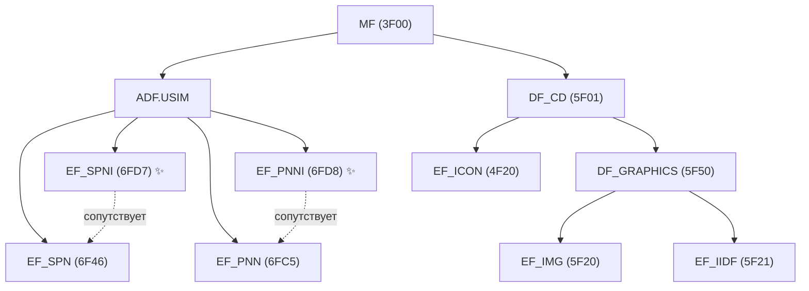
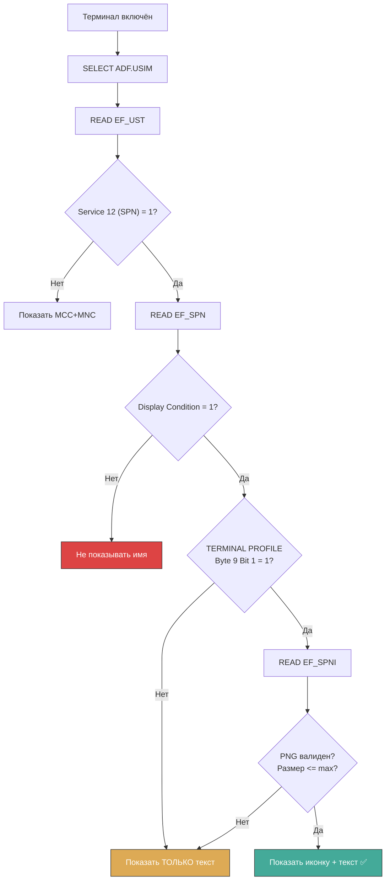

---
tags:
  - synthesis
  - USIM
  - EF
  - graphics
  - icons
  - PNG
  - SPNI
  - PNNI
  - DF_GRAPHICS
type: synthesis
created: 2026-06-12
updated: 2026-06-12
status: reviewed
sources:
  - "[[wiki/summaries/ts_131102]]"
  - "[[wiki/summaries/ts_102221]]"
  - "[[wiki/research/operator_icons_on_sim]]"
  - "[[wiki/concepts/USIM]]"
  - "[[wiki/concepts/UICC_File_System]]"
  - "[[wiki/concepts/EF_Types]]"
  - "[[wiki/reference/USIM_EF_Table]]"
---

# Графика и иконки: EF_SPNI, EF_PNNI, EF_IMG

> **Synthesis** — графические файлы на UICC: от иконок оператора в статус-баре до STK-меню и CAT-приложений.

---

## 1. Обзор: три категории графических файлов

UICC хранит графику в трёх независимых подсистемах:

| Категория | Файлы | Где | Для чего |
|---|---|---|---|
| **Operator Icons** | EF_SPNI, EF_PNNI | ADF.USIM | Иконка рядом с именем оператора |
| **STK Menu Icons** | EF_ICON | DF_CD | Иконки пунктов STK-меню |
| **Graphics Directory** | EF_IMG, EF_IIDF | DF_GRAPHICS (`5F50`) | Универсальный контейнер изображений |

---

## 2. Положение в файловой системе



---

## 3. EF_SPNI — Service Provider Name Icon (6FD7)

### Параметры

| Свойство | Значение |
|---|---|
| **FID** | `0x6FD7` |
| **Тип** | Transparent EF |
| **Расположение** | ADF.USIM |
| **Формат данных** | PNG (ISO/IEC 15948) или JPEG/JFIF (ISO/IEC 10918) |
| **Максимальный размер** | 2-8 КБ (ограничено EEPROM UICC) |
| **Access** | READ: ALW, UPDATE: ADM |
| **Стандарт** | 3GPP TS 31.102, Clause 4.2.82 |

### Назначение

EF_SPNI содержит **графическую иконку**, отображаемую терминалом рядом с текстовым именем сервис-провайдера из EF_SPN (`0x6F46`). Это основной механизм брендирования оператора в статус-баре телефона.

```
Телефон показывает:
┌─────────────────────────────────┐
│  [ICON]  Vodafone               │  ← EF_SPNI + EF_SPN
│  ██████████████████████████████  │
└─────────────────────────────────┘

Без EF_SPNI:
┌─────────────────────────────────┐
│  Vodafone                        │  ← Только EF_SPN
│  ██████████████████████████████  │
└─────────────────────────────────┘
```

> [!important] Важное правило
> EF_SPNI никогда не показывается самостоятельно. Если EF_SPN пуст или его Display Condition = 0 (не показывать), иконка игнорируется. Иконка всегда сопровождает текст.

### Структура данных

EF_SPNI не содержит TLV-обёртки — это просто бинарный образ файла PNG (или JPEG), записанный как байтовый поток через UPDATE BINARY:

```
Offset 0x00: 0x89 0x50 0x4E 0x47 0x0D 0x0A 0x1A 0x0A  ← PNG signature
Offset 0x08: ...                                          ← IHDR, IDAT, ...
Offset N-4:  0x00 0x00 0x00 0x00 0x49 0x45 0x4E 0x44     ← IEND chunk
```

### Запись через pySim

```bash
pySim-shell> select ADF.USIM
pySim-shell> update_binary 0x6FD7 89504E470D0A1A0A...
```

---

## 4. EF_PNNI — PLMN Network Name Icon (6FD8)

### Параметры

| Свойство | Значение |
|---|---|
| **FID** | `0x6FD8` |
| **Тип** | Transparent EF |
| **Расположение** | ADF.USIM |
| **Формат данных** | PNG или JPEG (аналогично EF_SPNI) |
| **Стандарт** | 3GPP TS 31.102, Clause 4.2.83 |

### Отличие от SPNI: одна иконка на все PNN

EF_PNNI работает в паре с **EF_PNN** (`0x6FC5`) и **EF_OPL** (`0x6FC6`):

```
EF_PNN (Linear Fixed, сетевые имена):
  Record 1: "T-Mobile"
  Record 2: "Vodafone DE"
  Record 3: "o2 - DE"

EF_OPL (Linear Fixed, привязка MCC+MNC → индекс):
  Record 1: MCC=262 MNC=01 → PNN Record 1
  Record 2: MCC=262 MNC=02 → PNN Record 2
  Record 3: MCC=262 MNC=03 → PNN Record 3

EF_PNNI (Transparent):
  [Одна PNG-иконка]  ← используется для ВСЕХ PNN-записей!
```

> [!warning] Ограничение EF_PNNI
> В отличие от EF_IMG/EF_IIDF (где можно хранить много изображений с разными Instance ID), EF_PNNI содержит **ровно одно** изображение. Все PLMN Network Names разделяют одну иконку или не имеют её вовсе.

### Когда показывается PNNI

| Ситуация | Что показывает телефон |
|---|---|
| Абонент в домашней сети (HPLMN) | EF_SPN + EF_SPNI |
| Абонент в роуминге, MCC+MNC есть в EF_OPL | EF_PNN + EF_PNNI |
| Абонент в роуминге, сети нет в EF_OPL | MCC+MNC (или имя из прошивки) |

---

## 5. DF_GRAPHICS — директория изображений (5F50)

### Параметры

| Свойство | Значение |
|---|---|
| **FID** | `0x5F50` |
| **Тип** | DF (Dedicated File) |
| **Расположение** | MF или внутри DF_CD |
| **Стандарт** | ETSI TS 102 221 Annex H; 3GPP TS 31.102 |

### Структура

```
MF (3F00)
└── DF_CD (5F01)                  ← Config Data
    └── DF_GRAPHICS (5F50)        ← Графическая директория
        ├── EF_IMG (5F20)         ← Контейнер изображений (TLV)
        ├── EF_IIDF (5F21)        ← Метаданные изображений
        └── EF_IMG_N (5Fxx)       ← Индивидуальные EF (опционально)
```

> [!note] Вариативность расположения
> DF_GRAPHICS может находиться как непосредственно под MF (`3F00/5F50`), так и внутри DF_CD (`3F00/5F01/5F50`). Определяется реализацией UICC.

---

## 6. EF_IMG — Image (5F20)

### Параметры

| Свойство | Значение |
|---|---|
| **FID** | `0x5F20` (внутри DF_GRAPHICS) |
| **Тип** | Transparent |
| **Содержимое** | BER-TLV: `Tag(InstanceID) \| Length \| Image_Body` |
| **Назначение** | Хранение множества изображений с разными Instance ID |

### Формат записи

```
EF_IMG = конкатенация TLV-записей:

Запись 1: Tag=0x01, Len=0x08 0x00, Value=<PNG 2048 байт>
Запись 2: Tag=0x02, Len=0x04 0x00, Value=<PNG 1024 байт>
...
```

Каждое изображение имеет свой **Instance ID** (поле Tag). Это позволяет одной UICC хранить иконки для разных целей и выбирать нужную по ID.

## 7. EF_IIDF — Image Instance Data Files (5F21)

### Параметры

| Свойство | Значение |
|---|---|
| **FID** | `0x5F21` |
| **Тип** | Transparent |
| **Расположение** | DF_GRAPHICS |
| **Назначение** | Метаданные для каждого изображения из EF_IMG |

### Структура метаданных

На каждый Instance ID — TLV-запись:

| Поле | Размер | Описание |
|---|---|---|
| Width | 1 байт | Ширина в пикселях |
| Height | 1 байт | Высота в пикселях |
| Image Coding | 1 байт | Формат (см. таблицу ниже) |
| Number of Colors | 1 байт | 0 = неизвестно |
| Max Image Body Length | 2 байта | Максимальный размер изображения |

### Image Coding Field

| Код | Формат | Примечание |
|---|---|---|
| `0x01` | PNG (monochrome) | Устаревший |
| `0x02` | JPEG/JFIF (monochrome) | Устаревший |
| `0x03` | BMP (main bitmap) | Исторический |
| `0x04` | BMP (alternative bitmap) | Исторический |
| `0x11` | **PNG (colour)** | Стандарт для современных UICC |
| `0x12` | **JPEG (colour)** | Для фотографий |
| `0x21` | **PNG with transparency** | Рекомендуется для иконок |

> [!tip] Современная практика
> Используйте `0x21` (PNG with transparency) для иконок оператора — альфа-канал обеспечивает корректное отображение на любом фоне статус-бара. `0x11` — для STK-иконок на фиксированном фоне.

---

## 8. EF_ICON — иконки STK-меню (4F20)

### Параметры

| Свойство | Значение |
|---|---|
| **FID** | `0x4F20` (внутри DF_CD) |
| **Тип** | Transparent (или Linear Fixed) |
| **Расположение** | DF_CD |
| **Назначение** | Иконки для пунктов SET UP MENU |
| **Стандарт** | ETSI TS 102 223 |

### Как работает

```
SET UP MENU (proactive command от UICC к терминалу):
  Item 1: "Проверить баланс", Icon ID = 1
  Item 2: "Пополнить счёт",   Icon ID = 2
  Item 3: "Услуги",           Icon ID = 3

EF_ICON (в DF_CD):
  Record 1: [PNG icon 1]  ← для "Проверить баланс"
  Record 2: [PNG icon 2]  ← для "Пополнить счёт"
  Record 3: [PNG icon 3]  ← для "Услуги"
```

Иконки могут быть **self-contained** (каждая запись — полный PNG) или **referenced** (ссылка на DF_GRAPHICS/EF_IMG через Instance ID).

---

## 9. Форматы изображений: что поддерживается

### Сравнительная таблица

| Формат | Стандарт | UICC обязателен? | Терминал обязателен? | Прозрачность |
|---|---|---|---|---|
| **PNG** | ISO/IEC 15948 | Да | Да (TERMINAL PROFILE) | Да (alpha/tRNS) |
| **JPEG/JFIF** | ISO/IEC 10918 | Опционально | Опционально | Нет |
| **BMP** | — | Не поддерживается | Опционально | Нет |
| **GIF** | — | Нет | Нет | — |
| **SVG** | — | Нет | Нет | — |
| **WEBP** | — | Нет | Нет | — |

### Требования к PNG на UICC

| Параметр | Требование |
|---|---|
| **Соответствие** | ISO/IEC 15948:2004 |
| **Цветовые режимы** | 8-bit indexed, 24-bit RGB, 32-bit RGBA |
| **Прозрачность** | tRNS chunk (indexed) или alpha channel (RGBA) |
| **Минимальные чанки** | IHDR, IDAT, IEND |
| **Интерлейсинг** | Не использовать (Adam7 может не поддерживаться) |
| **Размер** | Рекомендуется 64x64 или меньше |

---

## 10. TERMINAL PROFILE: биты для графики

Терминал сообщает UICC о поддержке иконок через **TERMINAL PROFILE** (INS=`0x70`) при инициализации CAT-сессии:

| Байт | Бит | Маска | Функция | Влияет на |
|---|---|---|---|---|
| Byte 7 | Bit 7 | `0x01` | **Icon support** | EF_ICON, EF_LAUNCH_PAD |
| Byte 7 | Bit 6 | `0x02` | Colour icon support | Цветные PNG/JPEG |
| Byte 9 | Bit 1 | `0x02` | **SPN Icon support** | EF_SPNI |
| Byte 9 | Bit 2 | `0x04` | **PNN Icon support** | EF_PNNI |
| Byte 25 | Bit 1 | `0x02` | **Image support** (DF_GRAPHICS) | EF_IMG, EF_IIDF |

> [!note] Нотация битов ETSI
> Нумерация: b8 (старший, 0x80) ... b1 (младший, 0x01).

### Пример декодирования

```
Terminal Profile: ... 0x80 ... 0x06 ...
                     Byte 7    Byte 9

Byte 7 = 0x80 = b'10000000'
  → Bit 7 (Icon support) = 1 ✅

Byte 9 = 0x06 = b'00000110'
  → Bit 2 (PNN Icon) = 1 ✅
  → Bit 1 (SPN Icon) = 1 ✅

→ Терминал поддерживает SPNI, PNNI и STK-иконки.
```

---

## 11. Алгоритм: чтение и показ иконки оператора



---

## 12. Ограничения памяти: конкуренция за EEPROM

```
ВСЕГО EEPROM UICC: 512 КБ (типичная 4G-карта)
┌──────────────────────────────────────────┐
│ EF_SPNI:              4.0 КБ  (0.8%)     │
│ EF_PNNI:              4.0 КБ  (0.8%)     │
│ EF_ICON:             16.0 КБ  (3.1%)     │
│ DF_GRAPHICS:          8.0 КБ  (1.6%)     │
│ Phone Book:          12.0 КБ             │
│ SMS Storage:         48.0 КБ             │
│ Keys (CK, IK, 5G):    8.0 КБ             │
│ Прочее (EF, OTA, ...): 412.0 КБ          │
├──────────────────────────────────────────┤
│ Иконки: ~32 КБ = 6.3% памяти UICC        │
└──────────────────────────────────────────┘
```

На legacy SIM-картах (32-64 КБ EEPROM) иконки могут занимать до 25% всей памяти — поэтому операторы часто их опускают для экономии места под телефонную книгу и SMS.

---

## 13. Известные ограничения

### iPhone — отсутствие поддержки SPNI и PNNI

> [!danger] Критическое ограничение
> **iPhone (iOS) НЕ поддерживает EF_SPNI и EF_PNNI.** Apple не читает иконки оператора из SIM-карты. iOS использует собственный **carrier bundle** (загружается с серверов Apple). EF_SPN (текст) при этом работает.

### Неоднородность Android-производителей

| Производитель | EF_SPNI | EF_PNNI | EF_ICON (STK) | DF_GRAPHICS |
|---|---|---|---|---|
| Samsung Galaxy | Да | Да | Да | Частично |
| Xiaomi / Redmi | Да | Частично | Да | Нет |
| Google Pixel | Да | Частично | Да | Частично |
| OnePlus | Да | Нет | Да | Нет |
| iPhone | **Нет** | **Нет** | Ограниченно | **Нет** |
| Huawei | Да | Частично | Да | Частично |

### eSIM и иконки в Profile Package

В экосистеме eSIM (RSP — Remote SIM Provisioning, GSMA SGP.02/SGP.22):
- Profile Metadata может содержать **Icon** (PNG) как элемент профиля
- LPA (Local Profile Assistant) отображает иконку при выборе профиля
- После установки профиля иконка может быть записана в EF_SPNI через OTA

---

## Связи

- **Детальное исследование иконок**: [[wiki/research/operator_icons_on_sim|Operator Icons on SIM]]
- **EF_SPN и EF_PNN текст**: [[wiki/reference/USIM_EF_Table|USIM EF Table]]
- **Файловая система UICC**: [[wiki/concepts/UICC_File_System|UICC File System]]
- **Типы EF (Transparent)**: [[wiki/concepts/EF_Types|Elementary File Types]]
- **USIM Application**: [[wiki/concepts/USIM|USIM]]
- **CAT/STK и EF_ICON**: [[wiki/concepts/CAT_STK|CAT and STK]]
- **Сервисная таблица (Service 12 = SPN)**: [[wiki/syntheses/sim_files_service_table|Service Table: EF_UST]]
- **Спецификация**: [[wiki/summaries/ts_131102|TS 31.102]]
