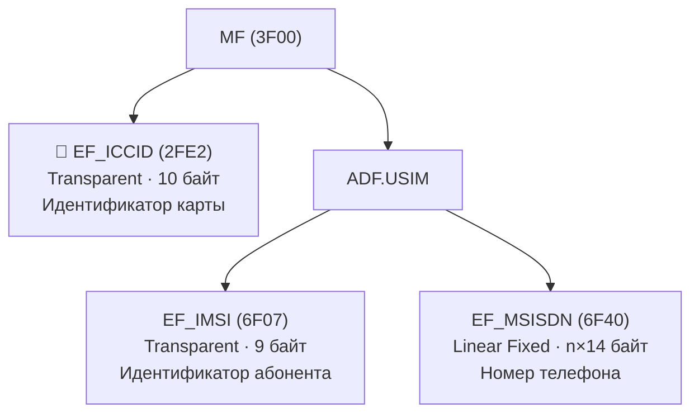

# Идентификаторы SIM: ICCID, IMSI, MSISDN

> **Synthesis** — три главных идентификатора на SIM-карте: что они значат, где хранятся и как читаются.

---

## Карта местоположения



> [!note] Ключевое различие
> **ICCID** идентифицирует **карту** (SIM как физический объект), **IMSI** идентифицирует **абонента** в сети, **MSISDN** — это **номер телефона**, который набирают для звонка. ICCID лежит на уровне MF, а IMSI и MSISDN — внутри ADF.USIM.

---

## 1. EF_ICCID (2FE2) — Идентификатор карты

### Параметры файла

| Свойство | Значение |
|---|---|
| **FID** | `0x2FE2` |
| **Уровень** | MF (первый уровень) |
| **Тип** | Transparent |
| **Размер** | 10 байт (фикс.) |
| **Доступ** | READ BINARY, UPDATE BINARY (ADM) |
| **Кодирование** | BCD (Binary-Coded Decimal), reversed nibble |
| **Стандарт** | ITU-T E.118 |

### Структура

```
Байты ICCID (10 байт):
┌──────┬──────┬──────┬──────┬──────┬──────┬──────┬──────┬──────┬──────┐
│ Byte │ Byte │ Byte │ Byte │ Byte │ Byte │ Byte │ Byte │ Byte │ Byte │
│  0   │  1   │  2   │  3   │  4   │  5   │  6   │  7   │  8   │  9   │
└──────┴──────┴──────┴──────┴──────┴──────┴──────┴──────┴──────┴──────┘
  └─┬─┘  └──────────────┬──────────────┘  └──┬──┘  └─┬─┘  └──────────┘
    │                   │                  │       │       │
    Luhn            ICC-ID            Country  Issuer  Individual
    check           19 цифр             (2-3)   (1-4)  Account Number
    digit
```

- **Byte 0**: старший полубайт = Luhn check digit, младший полубайт = RFU (0xF)
- **Byte 1-2**: Country Code (MCC), 2-3 цифры
- **Byte 3-5 или 3-6**: Issuer Identifier, до 4 цифр
- **Byte 6-9 или 7-9**: Individual Account Number
- **Byte 9**: младший полубайт = check digit для всего номера

### BCD Reverse Nibble

Ключевая особенность ICCID: цифры в байтах переставляются **в обратном порядке полубайтов** (reverse nibble).

```
Исходный ICCID (19 цифр):   89 86 01 12 34 56 78 90 12 34
Группировка по 2 цифры:     [89] [86] [01] [12] [34] [56] [78] [90] [12] [34 5?]
                           → каждая пара переставляется:
                           [98] [68] [10] [21] [43] [65] [87] [09] [21] [43]
```

> [!warning] Reverse nibble — частая ловушка
> Если прочитать ICCID как обычную BCD-строку без перестановки полубайтов внутри каждого байта, номер будет нечитаем. Каждая пара десятичных цифр внутри одного байта хранится в **переставленном** порядке: старшая цифра — в младшем полубайте, младшая — в старшем.

**Псевдокод reverse nibble:**
```
function decode_iccid(data[10]):
    out = ""
    for i in 0..9:
        byte = data[i]
        out += hex_digit(byte & 0x0F)   // младший полубайт → сначала
        out += hex_digit(byte >> 4)     // старший полубайт → потом
    return out[0..19]  // первые 19 цифр (без check digit в начале)
```

### Luhn Check Digit

Последняя цифра ICCID вычисляется по алгоритму Луна:

```
1. Удвоить каждую вторую цифру с конца (чётные позиции, начиная с 0)
2. Если результат > 9 — сложить цифры результата
3. Суммировать все цифры
4. Check digit = (10 - (сумма % 10)) % 10
```

---

## 2. EF_IMSI (6F07) — Идентификатор абонента

### Параметры файла

| Свойство | Значение |
|---|---|
| **FID** | `0x6F07` |
| **Уровень** | ADF.USIM |
| **Тип** | Transparent |
| **Размер** | 9 байт (фикс.) |
| **Доступ** | READ BINARY (PIN), UPDATE BINARY (ADM) |

### Структура

```
EF_IMSI (9 байт):
┌───────┬──────────────┬────────────────────────────────┐
│Bytes  │    Field     │          Значение              │
├───────┼──────────────┼────────────────────────────────┤
│  0    │  Length      │ Длина IMSI (напр. 0x08 = 8)    │
│  1-3  │  MCC + MNC   │ Mobile Country Code + Network  │
│  4-8  │  MSIN        │ Mobile Subscriber Id. Number   │
└───────┴──────────────┴────────────────────────────────┘
```

- **Byte 0**: длина IMSI в байтах (не считая самого байта длины)
- **Byte 1-3**: MCC (3 цифры) + MNC (2 или 3 цифры), BCD-кодирование, **тоже reverse nibble**
- **Byte 4-8**: MSIN — Mobile Subscriber Identification Number, до 10 цифр

### Формат декодирования (тот же reverse nibble)

```
Байты IMSI (hex):  08 29 10 01 47 35 09 67 21
                    ↓  ↓─────────────────────↓
                   len    BCD reverse nibble
                            ↓
                    MCC=250, MNC=01, MSIN=7453907621
                    → IMSI: 250017453907621
```

### MCC + MNC в деталях

| MCC | Страна | MNC | Оператор |
|---|---|---|---|
| 250 | Россия | 01 | МТС |
| 250 | Россия | 02 | МегаФон |
| 250 | Россия | 99 | Билайн |
| 255 | Украина | 01 | Vodafone Украина |
| 001 | Тестовая сеть | 01 | TEST |

> [!tip] 5G: SUPI и SUCI
> В 5G IMSI заменяется на **SUPI** (Subscription Permanent Identifier), который имеет тот же формат, что и IMSI. Для защиты приватности SUPI шифруется в **SUCI** (Subscription Concealed Identifier) через EF_SUCI_Calc_Info.

---

## 3. EF_MSISDN (6F40) — Номер телефона

### Параметры файла

| Свойство | Значение |
|---|---|
| **FID** | `0x6F40` |
| **Уровень** | ADF.USIM |
| **Тип** | Linear Fixed |
| **Размер** | n записей x 14 байт (базовая запись) |
| **Доступ** | READ RECORD (PIN), UPDATE RECORD (ADM) |

### Структура записи

```
EF_MSISDN Record (14 байт):
┌────────┬──────────┬─────────────────────────────────────┐
│ Byte 0 │ Byte 1-2 │ Byte 3-13                            │
│ Alpha  │ Length + │ BCD-кодированный номер               │
│ Len    │ TON/NPI  │ (+ padding 0xFF)                     │
└────────┴──────────┴─────────────────────────────────────┘
```

- **Byte 0**: длина Alpha-идентификатора (имени)
- **Byte 1**: TON (Type of Number) + NPI (Numbering Plan Identification)
- **Byte 2**: длина номера в байтах
- **Byte 3-13**: BCD-кодированный номер телефона (reverse nibble), padding `0xFF`

### TON (Type of Number) — старшие 3 бита Byte 1

| TON | Значение |
|---|---|
| `000` | Unknown |
| `001` | International Number |
| `010` | National Number |
| `011` | Network Specific |
| `100` | Subscriber Number |
| `101` | Alphanumeric (только для SMS-C) |
| `110` | Abbreviated Number |

### NPI (Numbering Plan Identification) — младшие 4 бита Byte 1

| NPI | Значение |
|---|---|
| `0000` | Unknown |
| `0001` | ISDN/Телефон (E.164) |
| `0011` | Data (X.121) |
| `0100` | Telex |
| `1000` | National |
| `1001` | Private |

> [!example] Пример записи MSISDN
> ```
> Alpha Len: 0x00            → нет имени
> TON/NPI:   0x91            → International, ISDN/E.164
> Число цифр: 0x07           → 7 цифр (14 полубайт)
> Номер:     79 21 43 65 87  → reverse nibble: +7 12 34 56 78 (pad 0xF)
> ```
> Итоговый номер: **+7 123 456 78** (международный формат).

---

## 4. Чтение через pySim + APDU

### ICCID через APDU

```
; Выбрать MF
00 A4 00 00 02 3F 00
; Выбрать EF_ICCID
00 A4 00 00 02 2F E2
; Читать 10 байт
00 B0 00 00 0A
; Ответ: 98 68 10 21 43 65 87 09 21 43 + SW=9000
```

### IMSI через APDU

```
; Выбрать ADF.USIM по AID (частичный)
00 A4 04 00 09 A0 00 00 00 87 10 02 FF FF FF
; Выбрать EF_IMSI
00 A4 00 00 02 6F 07
; Читать 9 байт
00 B0 00 00 09
```

### Python (pySim)

```python
from pytlv.TLV import TLV
# После получения байт ICCID
iccid_bytes = bytes.fromhex('98681021436587092143')
iccid = ''
for b in iccid_bytes:
    iccid += f'{b & 0x0F:1X}{b >> 4:1X}'
# iccid = '89860112345678901234'
luhn_check = iccid[-1]  # последняя цифра
```

---

## 5. Сравнительная таблица

| Свойство | EF_ICCID | EF_IMSI | EF_MSISDN |
|---|---|---|---|
| **FID** | `0x2FE2` | `0x6F07` | `0x6F40` |
| **Уровень** | MF | ADF.USIM | ADF.USIM |
| **Тип** | Transparent | Transparent | Linear Fixed |
| **Размер** | 10 байт | 9 байт | n×14 байт (на запись) |
| **Идентифицирует** | SIM-карту | Абонента | Номер телефона |
| **Кодирование** | BCD (reverse nibble) | BCD (reverse nibble) | BCD + TON/NPI |
| **Уникальность** | Глобально уникальный | Глобально уникальный | Уникален в сети |
| **Стандарт** | ITU-T E.118 | ITU-T E.212 | ITU-T E.164 |
| **Обновление** | Только при выпуске | Только при выпуске | Оператором (OTA) |
| **Доступность** | Всегда (MF) | После SELECT ADF.USIM | После SELECT ADF.USIM |

---

## 6. Связи

- [[wiki/concepts/UICC_File_System|Файловая система UICC]] — где эти файлы расположены
- [[wiki/concepts/EF_Types|Типы EF]] — Transparent и Linear Fixed структуры
- [[wiki/concepts/USIM|USIM]] — приложение, содержащее IMSI и MSISDN
- [[wiki/syntheses/gsm_vs_usim_filesystem|GSM vs USIM]] — как сохранились FID между поколениями
- [[wiki/reference/USIM_EF_Table|Таблица USIM EF]] — справочник всех EF
- [[wiki/summaries/ts_131102|TS 31.102]] — полная спецификация USIM
