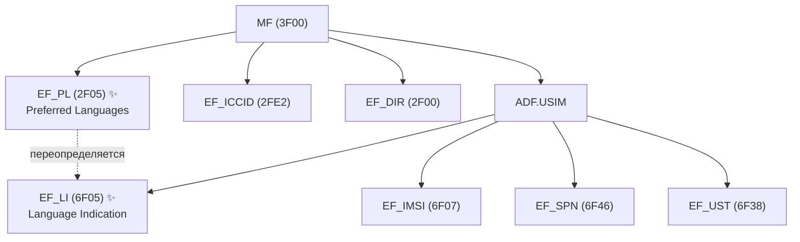
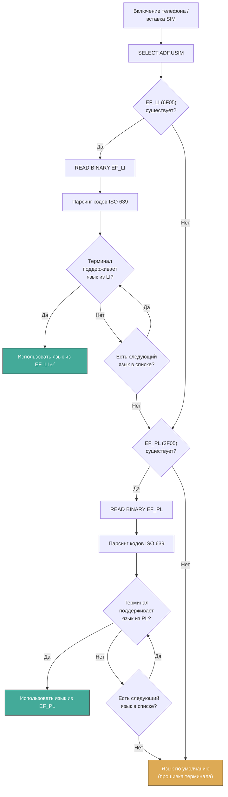

---
tags:
  - synthesis
  - USIM
  - EF
  - language
  - localization
  - PL
  - LI
type: synthesis
created: 2026-06-12
updated: 2026-06-12
status: reviewed
sources:
  - "[[wiki/summaries/ts_131102]]"
  - "[[wiki/summaries/ts_102221]]"
  - "[[wiki/concepts/USIM]]"
  - "[[wiki/concepts/UICC_File_System]]"
  - "[[wiki/concepts/EF_Types]]"
---

# Языки и локализация: EF_PL и EF_LI

> **Synthesis** — как UICC указывает терминалу предпочтительные языки: от глобального EF_PL на уровне MF до EF_LI внутри ADF.USIM.

---

## 1. Зачем SIM-карте хранить языки

Когда абонент впервые вставляет SIM-карту в телефон, терминал должен определить на каком языке показывать меню, сообщения и STK-интерфейс. UICC предоставляет два механизма для этого:

| Механизм | Файл | Уровень | Назначение |
|---|---|---|---|
| **Глобальные предпочтения** | EF_PL (`2F05`) | MF | Языки для всех приложений UICC |
| **Локальные предпочтения** | EF_LI (`6F05`) | ADF.USIM | Языки для конкретного USIM-приложения |

Оба файла используют коды языков по **ISO 639** и позволяют оператору предконфигурировать языковой опыт абонента до того как тот что-либо настроит.

---

## 2. Положение в файловой системе



---

## 3. EF_PL — Preferred Languages (2F05)

### Параметры

| Свойство | Значение |
|---|---|
| **FID** | `0x2F05` |
| **Тип** | Transparent EF |
| **Расположение** | MF (корень файловой системы) |
| **Размер** | 2 × N байт (N языков, по 2 байта каждый) |
| **Access** | READ: ALW, UPDATE: ADM |
| **Стандарт** | ETSI TS 102 221, Clause 13.3 |

### Формат

EF_PL содержит последовательность 2-байтовых кодов языков в порядке убывания приоритета:

```
EF_PL (Transparent):
┌──────────┬──────────┬──────────┬─────┬──────────┐
│ Lang 1   │ Lang 2   │ Lang 3   │ ... │ Lang N   │
│ (2 байта)│ (2 байта)│ (2 байта)│     │ (2 байта)│
└──────────┴──────────┴──────────┴─────┴──────────┘
   ↑ Самый приоритетный              ↑ Наименее приоритетный
```

### Коды языков (ISO 639)

Каждый язык кодируется 2 символами (2 байта) по ISO 639 alpha-2:

| Код | Язык |
|---|---|
| `en` (`0x65 0x6E`) | English |
| `ru` (`0x72 0x75`) | Russian |
| `de` (`0x64 0x65`) | German |
| `fr` (`0x66 0x72`) | French |
| `es` (`0x65 0x73`) | Spanish |
| `it` (`0x69 0x74`) | Italian |
| `pt` (`0x70 0x74`) | Portuguese |
| `zh` (`0x7A 0x68`) | Chinese |
| `ja` (`0x6A 0x61`) | Japanese |
| `ar` (`0x61 0x72`) | Arabic |
| `tr` (`0x74 0x72`) | Turkish |

### Примеры EF_PL

```
Оператор в России, абонент говорит по-русски и по-английски:
  EF_PL = "ru" "en" = 0x72 0x75 0x65 0x6E  (4 байта)

Оператор в Швейцарии, абонент говорит на немецком, французском, итальянском:
  EF_PL = "de" "fr" "it" = 0x64 0x65 0x66 0x72 0x69 0x74  (6 байт)

Один язык:
  EF_PL = "en" = 0x65 0x6E  (2 байта)
```

### Семантика

- **Порядок важен**: первый код в списке — самый предпочтительный язык
- **Минимум 1 язык**: EF_PL не может быть пустым (если файл существует)
- **Максимум**: определяется размером файла (типично до 8-16 языков)
- **Если EF_PL отсутствует**: терминал использует свой язык по умолчанию

---

## 4. EF_LI — Language Indication (6F05)

### Параметры

| Свойство | Значение |
|---|---|
| **FID** | `0x6F05` |
| **Тип** | Transparent EF |
| **Расположение** | ADF.USIM |
| **Размер** | 2 × N байт (N языков) |
| **Access** | READ: ALW, UPDATE: ADM |
| **Стандарт** | 3GPP TS 31.102, Clause 4.2.30 |

### Отличие от EF_PL

EF_LI определяет языковые предпочтения **специфичные для USIM-приложения**. В то время как EF_PL глобален для всей UICC, EF_LI позволяет разным ADF (USIM, ISIM, ...) иметь разные языковые настройки.

| Свойство | EF_PL | EF_LI |
|---|---|---|
| **Уровень** | MF (глобальный) | ADF.USIM (локальный) |
| **FID** | `0x2F05` | `0x6F05` |
| **Приоритет** | Ниже (переопределяется) | Выше (переопределяет) |
| **Формат** | 2-байтовые коды ISO 639 | 2-байтовые коды ISO 639 (тот же) |
| **Обязательность** | Опциональный | Опциональный |

> [!tip] Правило приоритета
> Если существует EF_LI в ADF.USIM, терминал использует его. Если EF_LI отсутствует — терминал читает EF_PL на уровне MF. Если нет ни того ни другого — терминал использует язык по умолчанию (обычно из заводской прошивки).

---

## 5. Как терминал выбирает язык



### Пошаговый алгоритм

1. **SELECT ADF.USIM** — активация USIM-сессии
2. **Попытка чтения EF_LI** (`6F05`) в ADF.USIM
3. Если EF_LI существует и содержит поддерживаемый терминалом язык — используется он
4. Если EF_LI отсутствует или все языки в нём не поддерживаются — переход к **EF_PL** (`2F05`) на уровне MF
5. Если EF_PL существует и содержит поддерживаемый язык — используется он
6. Если ни один язык из EF_PL не поддерживается — используется язык по умолчанию (заводская прошивка терминала)

---

## 6. EF_LI и STK-меню

Языковые настройки напрямую влияют на **STK-меню** (SIM Application Toolkit). Команда **SET UP MENU** позволяет указать текст пунктов меню на разных языках через механизм **language-specific menu entries**.

```
SET UP MENU:
  Item 1: "Check Balance" (en) / "Проверить баланс" (ru) / "Saldo prüfen" (de)
  Item 2: "Top Up" (en) / "Пополнить счёт" (ru) / "Aufladen" (de)
  ...
```

Терминал выбирает текст на языке, который совпадает с текущим языком из EF_LI (или EF_PL). Если совпадения нет — используется первый язык в списке menu entries.

---

## 7. Практические сценарии

### Сценарий 1: Российский оператор, многоязычный абонент

```
EF_PL (MF, 2F05):
  "ru" "en" = 0x72 0x75 0x65 0x6E

EF_LI (ADF.USIM, 6F05):
  отсутствует

→ Терминал читает EF_PL
→ Первый язык "ru" (русский) — поддерживается
→ Меню на русском, STK на русском
→ Если бы терминал не имел русской локализации — перешёл бы на "en"
```

### Сценарий 2: Международный роуминг-профиль

```
EF_PL (MF, 2F05):
  "en" "fr" "de" "it" "es"

→ Нет EF_LI
→ Терминал в Германии: использует "en" (первый в списке, всегда доступен)
→ Если терминал куплен во Франции (поддерживает "fr") — использует "fr" (второй в списке)
→ Порядок в EF_PL — это приоритет, а не жёсткое указание
```

### Сценарий 3: Специализированное приложение USIM

```
EF_PL (MF, 2F05):
  "en"  (глобальный для всей UICC)

EF_LI (ADF.USIM, 6F05):
  "ja" "en"  (специфично для USIM-приложения)

→ Японский абонент с японским USIM-апплетом
→ EF_LI переопределяет EF_PL
→ Терминал показывает меню на японском (если поддерживает)
→ Английский — fallback
```

---

## 8. Сравнение с другими механизмами локализации

| Механизм | Где | Что хранит | Для чего |
|---|---|---|---|
| **EF_PL** | MF | Список языков UICC | Глобальные предпочтения всех приложений |
| **EF_LI** | ADF.USIM | Список языков приложения | Специфичные для USIM языки |
| **EF_SPN** | ADF.USIM | Имя оператора (UCS2, любой язык) | Отображение имени оператора |
| **EF_PNN + EF_OPL** | ADF.USIM | Сетевые имена на разных языках | Имя сети при роуминге |
| **MMS User Preferences** | ADF.USIM | Язык MMS-сообщений | Заголовки MMS |

EF_PL и EF_LI уникальны тем, что влияют **не на данные, а на интерфейс** — они управляют языком меню самого терминала и STK-сообщений.

---

## 9. Кодирование: только ISO 639 alpha-2

> [!warning] Ограничение
> EF_PL и EF_LI используют **только 2-буквенные коды** ISO 639-1 (alpha-2). Коды ISO 639-2 (3 буквы) и ISO 639-3 **не поддерживаются**. Языки без 2-буквенного кода (например, некоторые региональные) не могут быть представлены в этих EF.

### Что делать если язык не имеет кода ISO 639-1

Для языков без alpha-2 кода оператор может:
1. Использовать ближайший доступный язык как fallback (например, `ru` вместо `ba` для башкирского)
2. Реализовать выбор языка через STK-меню (собственный диалог)
3. Положиться на автоматический выбор языка терминалом

---

## 10. Практический пример: чтение EF_PL через pySim

```bash
pySim-shell> select MF
pySim-shell> read_binary 0x2F05
# Ответ: 7275656E
# Декодирование:
#   72 75 = "ru"
#   65 6E = "en"
# → Предпочтительные языки: русский, затем английский

pySim-shell> select ADF.USIM
pySim-shell> read_binary 0x6F05
# 9000 (файл не существует: EF_LI отсутствует)
# → Терминал должен использовать EF_PL с уровня MF
```

### Python-декодирование

```python
def decode_language_ef(data):
    """Декодирует EF_PL или EF_LI в список языковых кодов."""
    if len(data) % 2 != 0:
        raise ValueError("Длина должна быть кратна 2")
    languages = []
    for i in range(0, len(data), 2):
        code = data[i:i+2].decode('ascii')
        languages.append(code)
    return languages

# Пример
pl_data = bytes.fromhex("7275656E")
langs = decode_language_ef(pl_data)
print(langs)  # ['ru', 'en']
print(f"Primary: {langs[0]}")  # Primary: ru
```

---

## 11. ISO 639: справочная таблица популярных кодов

| Код | Язык (EN) | Язык (RU) |
|---|---|---|
| `en` | English | Английский |
| `ru` | Russian | Русский |
| `de` | German | Немецкий |
| `fr` | French | Французский |
| `es` | Spanish | Испанский |
| `it` | Italian | Итальянский |
| `pt` | Portuguese | Португальский |
| `zh` | Chinese | Китайский |
| `ja` | Japanese | Японский |
| `ko` | Korean | Корейский |
| `ar` | Arabic | Арабский |
| `hi` | Hindi | Хинди |
| `tr` | Turkish | Турецкий |
| `nl` | Dutch | Нидерландский |
| `pl` | Polish | Польский |
| `sv` | Swedish | Шведский |
| `fi` | Finnish | Финский |
| `cs` | Czech | Чешский |
| `uk` | Ukrainian | Украинский |
| `vi` | Vietnamese | Вьетнамский |

---

## Связи

- **Файловая система UICC**: [[wiki/concepts/UICC_File_System|UICC File System]]
- **Типы EF (Transparent)**: [[wiki/concepts/EF_Types|Elementary File Types]]
- **USIM Application**: [[wiki/concepts/USIM|USIM]]
- **Сервисная таблица (Service 12 = SPN)**: [[wiki/syntheses/sim_files_service_table|Service Table: EF_UST]]
- **SPN и PNN (языкозависимые)**: [[wiki/reference/USIM_EF_Table|USIM EF Table]]
- **CAT/STK (языкозависимые меню)**: [[wiki/concepts/CAT_STK|CAT and STK]]
- **Спецификация UICC**: [[wiki/summaries/ts_102221|TS 102 221]]
- **Спецификация USIM**: [[wiki/summaries/ts_131102|TS 31.102]]
