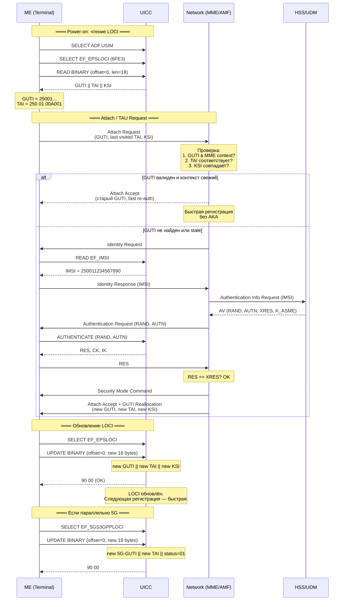
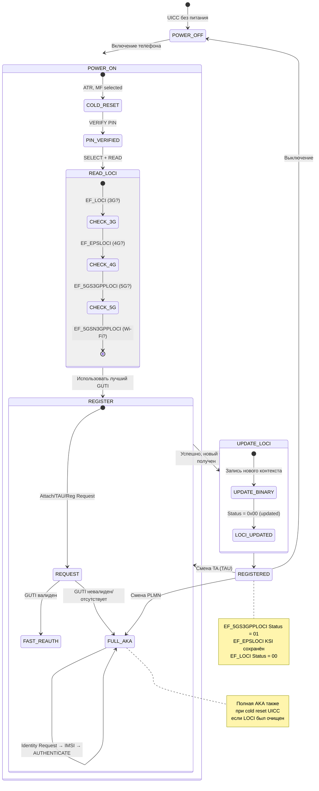

---
tags:
  - synthesis
  - SIM-files
  - LOCI
  - location
  - tracking
  - TMSI
  - GUTI
  - registration
type: synthesis
created: 2026-06-12
updated: 2026-06-12
status: reviewed
sources:
  - "[[wiki/summaries/ts_131102]]"
  - "[[wiki/concepts/USIM]]"
  - "[[wiki/concepts/UICC_File_System]]"
  - "[[wiki/concepts/EF_Types]]"
  - "[[wiki/syntheses/auth_evolution]]"
---

# Локация и tracking: LOCI, PSLOCI, EPSLOCI, 5GS*LOCI

> **Synthesis** — как UICC отслеживает местоположение абонента через поколения сетей: от 3G LOCI до 5G 3GPP/non-3GPP LOCI, защита от replay и цикл регистрации.

---

## 1. Обзор: семейство LOCI-файлов

Семейство **LOCI** (Location Information) — это группа Transparent EF, каждый из которых хранит **временный идентификатор** абонента и **зону**, в которой этот идентификатор был выдан. Эти файлы критичны для:

- **Быстрой регистрации** без полной AKA (fast re-authentication)
- **Защиты от replay-атак** (привязка временного ID к зоне)
- **Межпоколенной мобильности** (3G → 4G → 5G handover/transition)

```
Эволюция LOCI-файлов по поколениям:

3G (UMTS)                4G (LTE)                 5G
EF_LOCI (6F7E)           EF_EPSLOCI (6FE3)        EF_5GS3GPPLOCI (6FF0)
EF_PSLOCI (6F73)                                  EF_5GSN3GPPLOCI (6FF1)
──────────                ──────────               ──────────
TMSI + LAI                GUTI + TAI               5G-GUTI + TAI
11 байт                   18 байт                  18 байт каждый
```

> [!info] Почему раздельные файлы
> Каждое поколение сети имеет свой формат временного идентификатора и свою иерархию зон (LAI → TAI). Раздельные EF позволяют USIM хранить контексты для разных RAT одновременно, что необходимо для межпоколенных переходов (inter-RAT mobility).

---

## 2. Таблица файлов

| EF | FID | Поколение | Размер | READ | UPDATE | Содержит |
|---|---|---|---|---|---|---|
| **EF_LOCI** | `6F7E` | 3G CS | 11 байт | PIN1 | PIN1 | TMSI + LAI + статус |
| **EF_PSLOCI** | `6F73` | 3G PS | 14 байт | PIN1 | PIN1 | P-TMSI + RAI + подпись |
| **EF_EPSLOCI** | `6FE3` | 4G | 18 байт | PIN1 | PIN1 | GUTI + TAI + KSI |
| **EF_5GS3GPPLOCI** | `6FF0` | 5G (3GPP) | 18 байт | PIN1 | PIN1 | 5G-GUTI + TAI + статус |
| **EF_5GSN3GPPLOCI** | (см. TS 31.102) | 5G (non-3GPP) | 18 байт | PIN1 | PIN1 | 5G-GUTI + TAI + статус |

> [!info] Различие LOCI и NSC
> Не путайте файлы LOCI (местоположение) с файлами NSC (NAS Security Context):
> - **EF_5GS3GPPLOCI** (`0x4F01`) в DF_5GS — ГДЕ зарегистрирован (Location)
> - **EF_5GS3GPPNSC** (`0x4F03`) в DF_5GS — КАК защищён канал (Security Context)
> - Это разные файлы с разными FID, оба в DF_5GS

---

## 3. EF_LOCI (6F7E) — 3G Location Information

### 3.1 Назначение

EF_LOCI — старейший файл семейства, обслуживает **CS-домен** в UMTS (3G). Хранит временный идентификатор TMSI и Location Area Identification.

### 3.2 Структура (11 байт)

```
EF_LOCI — 11 байт:
┌─────────┬───────────┬───────────┬────────────┐
│ TMSI    │ LAI       │ TMSI_TIME │ LOCI Status│
│ 4 байта │ 5 байт    │ 1 байт    │ 1 байт     │
└─────────┴───────────┴───────────┴────────────┘
```

| Поле | Размер | Описание |
|---|---|---|
| **TMSI** | 4 байта | Temporary Mobile Subscriber Identity (32 бита) |
| **LAI** | 5 байт | Location Area Identification: MCC (2B) + MNC (1B) + LAC (2B) |
| **TMSI_TIME** | 1 байт | Таймер TMSI (0 = timer не используется) |
| **LOCI Status** | 1 байт | `00` = updated, `01` = not updated, `FF` = invalid |

### 3.3 Поля детально

**TMSI** (4 байта):
- Временный идентификатор, назначаемый VLR
- Уникален в пределах одного LAC
- Меняется при каждой TMSI Reallocation (обычно при каждом Location Update)

**LAI** (5 байт):
```
LAI = MCC (2 байта, BCD) + MNC (1 байт, BCD) + LAC (2 байта)
Пример: MCC=250, MNC=01, LAC=0x00A0 → 250 01 LAC 160
```

**TMSI_TIME** (1 байт):
- Таймер, после которого TMSI считается недействительным
- Значение `0x00` = таймер не используется (TMSI действителен неограниченно)
- Типичные значения: `0x0A` = 10 минут, `0x3C` = 60 минут

**LOCI Status** (1 байт):
- `0x00` = LOCI updated (контекст актуален)
- `0x01` = LOCI not updated (была попытка регистрации, но не завершена)
- `0xFF` = LOCI invalid (контекст недействителен — нужна полная AKA с IMSI)

---

## 4. EF_PSLOCI (6F73) — PS Location Information

### 4.1 Назначение

Раздельный LOCI для **PS-домена** (GPRS). Появился потому что в 3G CS (голос) и PS (данные) могут обслуживаться разными узлами (MSC vs SGSN).

### 4.2 Структура (14 байт)

```
EF_PSLOCI — 14 байт:
┌─────────┬──────────────┬───────────┬────────┐
│ P-TMSI  │ P-TMSI sig   │ RAI       │ Status │
│ 4 байта │ 3 байта      │ 6 байт    │ 1 байт │
└─────────┴──────────────┴───────────┴────────┘
```

| Поле | Размер | Описание |
|---|---|---|
| **P-TMSI** | 4 байта | Packet-TMSI — аналог TMSI для PS домена |
| **P-TMSI Signature** | 3 байта | Подпись P-TMSI для валидации |
| **RAI** | 6 байт | Routing Area Identification: MCC (2B) + MNC (1B) + LAC (2B) + RAC (1B) |
| **Status** | 1 байт | Статус PS регистрации |

### 4.3 Отличие RAI от LAI

RAI расширяет LAI одним байтом — **RAC** (Routing Area Code):
```
RAI = LAI + RAC = MCC + MNC + LAC + RAC
```
Это позволяет SGSN иметь более гранулярное деление, чем VLR.

### 4.4 P-TMSI Signature

Дополнительное 3-байтовое поле, которое:
- Генерируется SGSN при выделении P-TMSI
- Проверяется при следующем PS Attach
- Предотвращает угадывание/подделку P-TMSI злоумышленником

---

## 5. EF_EPSLOCI (6FE3) — EPS Location Information (4G)

### 5.1 Назначение

Обслуживает **LTE/EPS** (4G). Ключевое изменение: вместо TMSI + P-TMSI используется единый **GUTI** (Globally Unique Temporary Identity).

### 5.2 Структура (18 байт)

```
EF_EPSLOCI — 18 байт:
┌─────────┬──────────┬──────┐
│ GUTI    │ TAI      │ KSI  │
│ 11 байт │ 6 байт   │ 1 B  │
└─────────┴──────────┴──────┘
```

| Поле | Размер | Описание |
|---|---|---|
| **GUTI** | 11 байт | Globally Unique Temporary Identity |
| **Last visited TAI** | 6 байт | Tracking Area Identity: MCC (2B) + MNC (1B) + TAC (3B) |
| **KSI** | 1 байт | Key Set Identifier: `000` = native EPS AKA, `001` = mapped из UMTS |

### 5.3 GUTI структура

```
GUTI (11 байт):
┌─────┬─────┬───────┬───────┬──────────┐
│ MCC │ MNC │ MMEGI │ MMEC  │ M-TMSI   │
│ 2B  │ 1B  │ 2B    │ 1B    │ 4B       │
└─────┴─────┴───────┴───────┴──────────┘

- MCC (2B, BCD): Mobile Country Code
- MNC (1B, BCD): Mobile Network Code
- MMEGI (2B): MME Group ID
- MMEC (1B): MME Code
- M-TMSI (4B): MME-TMSI (32 бита)
```

**Ключевое преимущество GUTI**: глобальная уникальность. TMSI уникален только в пределах LAC, GUTI — глобально (содержит идентификатор MME). Это позволяет GUTI использоваться в разных TA без коллизий.

### 5.4 TAI (Tracking Area Identity)

```
TAI = MCC (2B) + MNC (1B) + TAC (3B)
```
TAI — аналог LAI для 4G/5G. TAC (Tracking Area Code) — 3 байта вместо 2 байт LAC в 3G.

### 5.5 KSI (Key Set Identifier)

```
KSI:
  b8-b4: 00000 (native EPS security context)
  b8-b4: 00001 (mapped security context — из UMTS)
  b3-b1: значение KSI (0-6)

KSI связывает GUTI с конкретным K_ASME.
Несовпадение KSI → полная AKA с IMSI.
```

---

## 6. EF_5GS3GPPLOCI (6FF0) и EF_5GSN3GPPLOCI (6FF1) — 5G Location

### 6.1 Назначение

5G разделяет контекст местоположения для **двух типов доступа**:

| EF | FID | Доступ | Через |
|---|---|---|---|
| **EF_5GS3GPPLOCI** | `6FF0` | 3GPP (cellular) | gNB → AMF |
| **EF_5GSN3GPPLOCI** | (TS 31.102) | Non-3GPP (Wi-Fi) | N3IWF/TNGF → AMF |

### 6.2 Структура (18 байт каждый)

```
EF_5GS3GPPLOCI / EF_5GSN3GPPLOCI — 18 байт:
┌──────────┬──────────┬──────────────┐
│ 5G-GUTI  │ TAI      │ 5GS Reg.     │
│ 11 байт  │ 6 байт   │ Status (1B)  │
└──────────┴──────────┴──────────────┘
```

| Поле | Размер | Описание |
|---|---|---|
| **5G-GUTI** | 11 байт | 5G Globally Unique Temporary Identity |
| **Last visited TAI** | 6 байт | Tracking Area Identity |
| **5GS Registration Status** | 1 байт | `00` = not registered, `01` = registered, `02` = attempting registration |

### 6.3 5G-GUTI структура

```
5G-GUTI (11 байт):
┌─────┬─────┬────────┬──────┬──────────┐
│ MCC │ MNC │ AMF ID │ AMF  │ 5G-TMSI  │
│ 2B  │ 1B  │ 2B     │ Set  │ 4B       │
│     │     │        │ ID   │          │
└─────┴─────┴────────┴──────┴──────────┘

Аналогичен GUTI, но:
- AMF Region ID + AMF Set ID вместо MMEGI
- AMF Pointer вместо MMEC
- Назначается AMF (не MME)
```

### 6.4 5GS Registration Status

Новое поле, отсутствовавшее в предыдущих поколениях:

| Значение | Статус | Когда устанавливается |
|---|---|---|
| `0x00` | Not registered | После отключения, смены PLMN |
| `0x01` | Registered | После успешной 5G регистрации |
| `0x02` | Attempting registration | Во время процедуры регистрации |

Это позволяет ME быстро определить, зарегистрирован ли терминал в 5G, без чтения всего файла и парсинга GUTI.

### 6.5 Почему разделение 3GPP / non-3GPP

5G поддерживает **одновременную регистрацию** через оба доступа:

```
Пример:
  Телефон подключён к 5G NR (gNB)  → EF_5GS3GPPLOCI  → 5G-GUTI_A, TAI_cellular
  Телефон подключён к Wi-Fi (N3IWF) → EF_5GSN3GPPLOCI → 5G-GUTI_B, TAI_wifi

Каждый GUTI независим, каждый security context независим.
Компрометация одного не затрагивает другой.
```

---

## 7. Сравнительная таблица всех LOCI

| Свойство | EF_LOCI | EF_PSLOCI | EF_EPSLOCI | EF_5GS3GPPLOCI | EF_5GSN3GPPLOCI |
|---|---|---|---|---|---|
| **Поколение** | 3G CS | 3G PS | 4G | 5G cellular | 5G Wi-Fi |
| **FID** | `6F7E` | `6F73` | `6FE3` | `6FF0` | TS 31.102 |
| **Размер** | 11 Б | 14 Б | 18 Б | 18 Б | 18 Б |
| **Временный ID** | TMSI (4B) | P-TMSI (4B) | GUTI (11B) | 5G-GUTI (11B) | 5G-GUTI (11B) |
| **Зона** | LAI (5B) | RAI (6B) | TAI (6B) | TAI (6B) | TAI (6B) |
| **Защита подписи** | Нет | P-TMSI sig (3B) | Через KSI | Через KSI | Через KSI |
| **Статус** | 1B | 1B | Нет (KSI 1B) | 1B (reg. status) | 1B (reg. status) |
| **Кто назначает** | VLR | SGSN | MME | AMF | AMF |
| **Таймер** | TMSI_TIME | Нет | Нет | Нет | Нет |
| **Обновляется при** | LU, TMSI Reall. | RAU, P-TMSI Reall. | TAU, GUTI Reall. | 5G Reg., GUTI Reall. | Non-3GPP Reg. |

---

## 8. Как LOCI защищает от replay-атак

### 8.1 Механизм

```
┌─────────────────────────────────────────────────────────────┐
│  Защита от replay через привязку TMSI/GUTI к зоне          │
│                                                              │
│  Сеть проверяет:                                             │
│    1. TMSI/GUTI валиден? (есть в VLR/MME/AMF)              │
│    2. LAI/TAI соответствует текущей зоне?                   │
│    3. KSI совпадает с сохранённым security context?         │
│                                                              │
│  Если любая проверка не проходит → full AKA с IMSI/SUCI    │
└─────────────────────────────────────────────────────────────┘
```

### 8.2 Пример попытки replay

```
Шаг 1: Злоумышленник перехватывает TMSI + LAI абонента в зоне A

Шаг 2: Злоумышленник пытается использовать перехваченный TMSI
       в зоне B (или той же зоне, но позже)

Шаг 3: Сеть в зоне B:
       - Проверяет TMSI: не найден в VLR зоны B
       - Или проверяет LAI: не совпадает с текущей зоной
       → Запрашивает IMSI (Identity Request)

Шаг 4: Даже если злоумышленник знает IMSI (например, из IMSI-catcher):
       - Сеть запускает полную AKA (RAND, AUTN)
       - Злоумышленник не знает K → не может вычислить RES
       → Аутентификация провалена

Шаг 5: Легитимный абонент при следующей регистрации:
       - Если LOCI всё ещё валиден: быстрая регистрация
       - Если TMSI был инвалидирован: полная AKA (стандартно)
```

### 8.3 Дополнительная защита: TMSI/GUTI ротация

Сеть периодически меняет временный идентификатор:
- **TMSI Reallocation**: VLR назначает новый TMSI при Location Update
- **GUTI Reallocation**: MME назначает новый GUTI при TAU
- **5G-GUTI Reallocation**: AMF назначает новый 5G-GUTI при Registration

Частая ротация сужает окно replay: даже если злоумышленник перехватил TMSI, через несколько минут он станет недействительным.

---

## 9. Жизненный цикл LOCI: регистрация в сети



---

## 10. Mermaid: состояние LOCI при сменах сети



---

## 11. Обработка ошибок и краевые случаи

### 11.1 Cold Reset vs Warm Reset

| Событие | EF_LOCI | EF_PSLOCI | EF_EPSLOCI | EF_5GS*LOCI |
|---|---|---|---|---|
| **Warm reset** (программный) | Сохраняется | Сохраняется | Сохраняется | Сохраняется |
| **Cold reset** (извлечение UICC) | Может очищаться* | Может очищаться* | Может очищаться* | Может очищаться* |
| **Смена PLMN** | Инвалидируется | Инвалидируется | Инвалидируется | Инвалидируется |
| **Power off → on** (warm) | Сохраняется | Сохраняется | Сохраняется | Сохраняется |

*Зависит от реализации UICC и политики оператора.

### 11.2 Stale LOCI — статус `'6A88'`

Если ME пытается прочитать LOCI, а файл отсутствует или контекст не инициализирован:

```
ME → UICC: SELECT EF_EPSLOCI
UICC → ME: FCP (файл существует)

ME → UICC: READ BINARY (offset=0)
UICC → ME: '6A88' (Referenced data not found)

Интерпретация: LOCI существует как файл, но не содержит
валидных данных. ME должен запросить IMSI и запустить полную AKA.
```

### 11.3 LOCI Status = `0xFF` (invalid)

Оператор может удалённо инвалидировать LOCI через OTA:
- При смене тарифного плана
- При блокировке UICC (lost/stolen)
- При сетевой миграции (переход на новое поколение)

Инвалидированный LOCI → `'6A88'` при чтении → полная AKA.

---

## 12. Практическое значение

### Для тестирования

- **Симуляция stale LOCI**: запись невалидного GUTI в EF_EPSLOCI → ожидать Identity Request + AKA от сети
- **Симуляция смены PLMN**: запись GUTI от другого оператора → ожидать полную AKA
- **Multi-RAT testing**: EF_EPSLOCI с 4G GUTI + EF_5GS3GPPLOCI с 5G GUTI → проверка inter-RAT transition
- **pySim**: `pySim-read --usim` покажет все LOCI с декодированными значениями

### Для безопасности

- **Stale LOCI = зона риска**: если злоумышленник физически извлёк UICC и прочитал GUTI, он может попытаться использовать его до истечения таймера. Холодный reset должен очищать LOCI для предотвращения этого.
- **Разделение 3GPP/non-3GPP в 5G**: это security improvement — компрометация Wi-Fi контекста не раскрывает cellular GUTI и наоборот.
- **KSI mismatch**: всегда приводит к полной AKA — важный защитный механизм.

---

## 13. Связи

- **Аутентификация**: полный цикл AKA + LOCI — [[wiki/syntheses/auth_evolution|Auth Evolution]]
- **USIM**: все LOCI находятся в [[wiki/concepts/USIM|ADF.USIM]]
- **Файловая система**: [[wiki/concepts/UICC_File_System|UICC File System]]
- **Типы EF**: все LOCI — Transparent — [[wiki/concepts/EF_Types|EF Types]]
- **Безопасность**: доступ PIN1, KSI для привязки к security context — [[wiki/concepts/UICC_Security|UICC Security]]
- **5G-файлы**: NAS Security Context vs LOCI — [[wiki/syntheses/sim_files_5g|5G SIM Files]]
- **PLMN-селекция**: связанные EF (FPLMN, PLMNwAcT, EHPLMN) — [[wiki/reference/USIM_EF_Table|USIM EF Table]]
- **Specifications**: [[wiki/summaries/ts_131102|TS 31.102]] — Clause 4.2 (EF_LOCI и другие)
- **LCS и геолокация**: [[wiki/research/sim_gps_lcs|SIM и GPS/LCS]] — как SIM использует LOCI для геолокации, GAD Shapes, PROVIDE LOCAL INFORMATION
