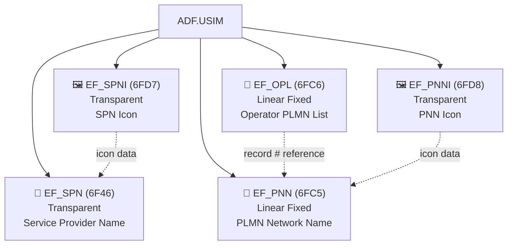
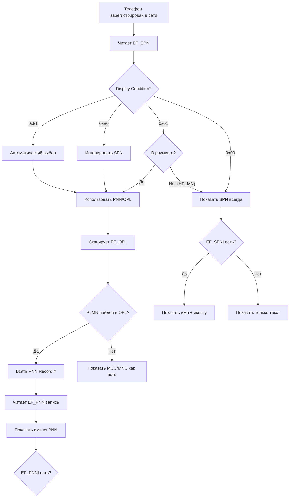

# Имя оператора в SIM: SPN, PNN, OPL

> **Synthesis** — как SIM-карта сообщает телефону, какое имя оператора показывать на экране: от простого текста SPN до сложной системы PNN+OPL с привязкой к MCC/MNC.

---

## Карта файлов



> [!note] Три слоя отображения
> SIM-карта предоставляет оператору **три уровня** для отображения имени:
> 1. **SPN** — имя сервис-провайдера (одна строка, всегда на экране)
> 2. **PNN + OPL** — имена PLMN-сетей с привязкой к кодам (MCC/MNC → имя), для роуминга
> 3. **SPNI + PNNI** — иконки к именам (опционально)

---

## 1. EF_SPN (6F46) — Service Provider Name

### Параметры файла

| Свойство | Значение |
|---|---|
| **FID** | `0x6F46` |
| **Уровень** | ADF.USIM |
| **Тип** | Transparent |
| **Размер** | ≥17 байт (1 байт Display Condition + 16+ байт текста) |
| **Доступ** | READ BINARY (ALW) |
| **Кодирование** | UCS2 (16 бит/символ) или GSM 7-bit default alphabet |
| **Сервис UST** | Service 12 |

### Структура

```
EF_SPN:
┌───────────┬──────────────────────────────────┐
│   Byte 0  │  Byte 1..N                       │
│  Display  │  Текст имени оператора (UCS2)    │
│ Condition │  "МТС", "beeline", "T-Mobile"    │
└───────────┴──────────────────────────────────┘
```

#### Display Condition (Byte 0)

| Значение | Смысл | Поведение телефона |
|---|---|---|
| `0x00` | Показывать SPN всегда | SPN заменяет любое PLMN-имя |
| `0x01` | Показывать SPN только в HPLMN | В роуминге — PNN/PLMN, дома — SPN |
| `0x80` | Показывать PLMN всегда | SPN игнорируется |
| `0x81` | Автоматический выбор | Телефон решает сам |

### Кодирование текста

Текст SPN кодируется в **UCS2** (UTF-16BE) согласно TS 102 221 Annex A. Каждый символ занимает 2 байта. Поддерживаются кириллица, арабский, китайский и другие алфавиты.

```
Пример "beeline":
  b=0062, e=0065, e=0065, l=006C, i=0069, n=006E, e=0065
  → байты: 00 62 00 65 00 65 00 6C 00 69 00 6E 00 65
```

> [!info] SPN vs GSM SIM
> В старых GSM-картах (GSM 11.11) SPN тоже был по FID `6F46`, но текст кодировался в **SMS 7-bit default alphabet**. В USIM (TS 31.102) кодировка изменена на **UCS2** для поддержки всех языков.

---

## 2. EF_PNN (6FC5) — PLMN Network Name

### Параметры файла

| Свойство | Значение |
|---|---|
| **FID** | `0x6FC5` |
| **Уровень** | ADF.USIM |
| **Тип** | Linear Fixed |
| **Размер** | n записей × M байт (переменная длина) |
| **Доступ** | READ RECORD (ALW) |
| **Кодирование** | UCS2 |

### Структура записи

```
EF_PNN Record:
┌──────────┬──────────────────────────────────┐
│ 2 байта  │  N байт                          │
│  Length  │  Текст имени (UCS2)              │
│  (UCS2   │  "Vodafone DE", "T-Mobile D"    │
│  длина)  │                                  │
└──────────┴──────────────────────────────────┘
```

- **Byte 0-1**: длина последующего текста в байтах (всегда чётное — каждый UCS2-символ = 2 байта)
- **Byte 2..N**: UCS2-текст имени сети

PNN содержит список **всех возможных имён сетей**, на которые ссылается EF_OPL. Каждая запись — это одно имя, которое может отображаться для определённого PLMN.

---

## 3. EF_OPL (6FC6) — Operator PLMN List

### Параметры файла

| Свойство | Значение |
|---|---|
| **FID** | `0x6FC6` |
| **Уровень** | ADF.USIM |
| **Тип** | Linear Fixed |
| **Размер** | n записей × 8 байт (базовая запись) |
| **Доступ** | READ RECORD (ALW) |
| **Кодирование** | BCD для MCC/MNC |

### Структура записи

```
EF_OPL Record (8 байт):
┌─────────┬─────────┬─────────┬──────────┬──────────┐
│ 3 байта │ 3 байта │ 1 байт  │ 1 байт   │          │
│ MCC+MNC │ MCC+MNC │ PNN     │ RFU      │          │
│ (LSA)   │ (PLMN)  │ Record# │ 0xFF     │          │
└─────────┴─────────┴─────────┴──────────┴──────────┘
```

- **Byte 0-2**: Location Service Area (LSA) — опциональный префикс MCC+MNC в BCD
- **Byte 3-5**: PLMN code (MCC+MNC), BCD reverse nibble
- **Byte 6**: номер записи в EF_PNN (1-based), указывает какое имя показывать
- **Byte 7**: RFU = `0xFF`

### Как OPL связывается с PNN

```
OPL Record #3:
  PLMN = 250 99 (Билайн, Россия)
  PNN Record # = 2
         │
         └────→ PNN Record #2: "Билайн"
```

Таким образом, при регистрации в сети 250/99 телефон найдёт в OPL запись, возьмёт номер записи PNN и отобразит имя "Билайн".

---

## 4. EF_SPNI (6FD7) и EF_PNNI (6FD8) — Иконки

### EF_SPNI — Service Provider Name Icon

| Свойство | Значение |
|---|---|
| **FID** | `0x6FD7` |
| **Тип** | Transparent |
| **Содержимое** | CLUT + Image data (PNG, JPEG, BMP) или ссылка на DF_GRAPHICS |

### EF_PNNI — PLMN Network Name Icon

| Свойство | Значение |
|---|---|
| **FID** | `0x6FD8` |
| **Тип** | Linear Fixed |
| **Содержимое** | Ссылки на иконки в DF_GRAPHICS, по одной записи на каждую иконку PNN |

> [!seealso] Иконки операторов
> Детальный разбор форматов иконок, CLUT, TERMINAL PROFILE и практический тест-план — в [[wiki/research/operator_icons_on_sim|исследовании иконок оператора]].
> **Как иконка попадает на экран**: [[wiki/research/operator_icon_display_pipeline|Display pipeline — от SIM до статус-бара]].

---

## 5. Алгоритм: как телефон выбирает имя для отображения



---

## 6. Пример: «beeline» на SIM-карте

Взят из [[notes/EF_SPN_PNN|EF_SPN_PNN]].

```bash
# Чтение EF_SPN через pySim
$ pySim-read -p 0
SPN: "beeline" (Display Condition: 0x00 — always show)

# Чтение EF_OPL
OPL #1: PLMN=25099 → PNN #1
OPL #2: PLMN=25020 → PNN #2

# Чтение EF_PNN
PNN #1: "Билайн"
PNN #2: "Билайн (Теле2)"
```

В этом примере:
- SPN = "beeline" (Display Condition 0x00) — телефон всегда показывает "beeline"
- В роуминге в сети 250/20 (Tele2) — PNN может показать "Билайн (Теле2)" если SPN Display Condition изменён на 0x01

---

## 7. Сравнительная таблица файлов имени оператора

| Свойство | EF_SPN | EF_PNN | EF_OPL | EF_SPNI | EF_PNNI |
|---|---|---|---|---|---|
| **FID** | `6F46` | `6FC5` | `6FC6` | `6FD7` | `6FD8` |
| **Тип** | Transparent | Linear Fixed | Linear Fixed | Transparent | Linear Fixed |
| **Содержимое** | Одна строка имени | Список имён сетей | MCC/MNC → PNN-запись | Иконка SPN | Иконки PNN |
| **Кодирование** | UCS2 | UCS2 | BCD | PNG/JPEG/BMP | PNG/JPEG/BMP |
| **Запись (размер)** | Н/П | Перем. (≥2 байта) | 8 байт | Н/П | Перем. |
| **Сервис UST** | Service 12 | — (через PNN/O) | — (через PNN/O) | — | — |
| **Когда читается** | При загрузке | При роуминге | При регистрации | При загрузке | При роуминге |

---

## 8. Связи

- [[wiki/concepts/UICC_File_System|Файловая система UICC]] — иерархия файлов
- [[wiki/concepts/EF_Types|Типы EF]] — Transparent и Linear Fixed
- [[wiki/concepts/USIM|USIM]] — приложение, содержащее эти файлы
- [[wiki/reference/USIM_EF_Table|USIM EF Table]] — полный справочник
- [[wiki/research/operator_icons_on_sim|Иконки оператора]] — глубокое исследование EF_SPNI, EF_PNNI
- [[wiki/syntheses/gsm_vs_usim_filesystem|GSM vs USIM]] — эволюция EF_SPN от SMS 7-bit к UCS2
- [[notes/EF_SPN_PNN|Заметка SPN/PNN]] — примеры с "beeline" и Annex A про UCS2
- [[wiki/summaries/ts_131102|TS 31.102]] — полная спецификация
