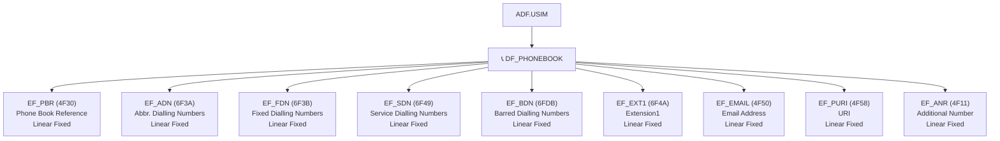

# Телефонная книга SIM: ADN, FDN, SDN, BDN

> **Synthesis** — как SIM-карта хранит контакты: от простых номеров (ADN) до запрещённых (BDN), фиксированных (FDN) и сервисных (SDN), плюс современные расширения (email, URI, второй номер).

---

## Карта DF_PHONEBOOK



> [!note] DF_PHONEBOOK — выделенная директория
> В отличие от GSM SIM где ADN и FDN висели в DF_TELECOM, в USIM телефонная книга вынесена в отдельную директорию DF_PHONEBOOK. Это позволило добавить множество новых полей: email, URI, second name, группировка.

---

## 1. EF_PBR (4F30) — Phone Book Reference

### Параметры файла

| Свойство | Значение |
|---|---|
| **FID** | `0x4F30` |
| **Уровень** | DF_PHONEBOOK |
| **Тип** | Linear Fixed |
| **Размер** | 1 запись на телефонную книгу |
| **Доступ** | READ RECORD (PIN) |

### Структура

PBR — это **мета-файл**: он описывает, какие поля присутствуют в телефонной книге, их FID и размер. Каждая запись в PBR описывает одну «книгу» (набор файлов ADN + EMAIL + ANR + ...).

```
EF_PBR Record (BER-TLV):
┌──────────────────────────────────────────────────────────┐
│ Tag A8: ADN file reference (SFI, record count, size)     │
│ Tag A9: EXT1 file reference                              │
│ Tag AA: Associated Group ID file reference (GRP)         │
│ Tag AB: Associated Extension2 file reference (EXT2)      │
│ Tag AC: E-mail file reference                            │
│ Tag AD: Second Name file reference (SNE)                 │
│ Tag AE: Additional Number file reference (ANR)           │
│ Tag AF: URI file reference (PURI)                        │
└──────────────────────────────────────────────────────────┘
```

> [!tip] Как телефон использует PBR
> Телефон читает PBR, узнаёт какие поля поддерживаются, затем читает каждый из перечисленных EF. Если в PBR нет ссылки на EMAIL — телефон не будет пытаться читать email'ы, даже если файл существует.

---

## 2. EF_ADN (6F3A) — Abbreviated Dialling Numbers

### Параметры файла

| Свойство | Значение |
|---|---|
| **FID** | `0x6F3A` |
| **Уровень** | DF_PHONEBOOK |
| **Тип** | Linear Fixed |
| **Размер** | n записей × M байт (M = 14 + X, обычно ~30) |
| **Доступ** | READ RECORD (PIN), UPDATE RECORD (PIN) |
| **Сервис UST** | Service 1 |

### Структура записи

```
EF_ADN Record:
┌───────────┬───────┬───────┬───────────┬──────────┬───────────┐
│ X байт    │ 1     │ 1     │ 1         │ 10-14    │ 1         │
│ Alpha ID  │TON/NPI│ Dial. │ Capability│ Number   │ CCP (Ext1 │
│ (UCS2)    │       │ Number│ ID        │ (BCD)    │ record #) │
│           │       │ Length│           │          │           │
└───────────┴───────┴───────┴───────────┴──────────┴───────────┘
```

#### Capability/Configuration ID (Byte после длины номера)

| Биты | Значение |
|---|---|
| b8-b6 | RFU = `000` |
| b5 | `1` = используется CCP (ссылка на EXT1) |
| b4 | RFU = `0` |
| b3-b1 | RFU = `000` |

#### CCP (Capability/Configuration Parameter)

Если b5 = 1, последний байт записи содержит **номер записи в EF_EXT1**. Это нужно, когда номер или Alpha ID не помещается в базовую запись.

### Типичные размеры

| Размер поля | Назначение |
|---|---|
| Alpha ID: 10-20 байт | UCS2 имя (5-10 символов) |
| Номер: 10 байт | BCD, до 20 цифр |
| CCP: 1 байт | Ссылка на EXT1 |
| **Итого: ~30 байт на контакт** | |

### Пустая запись

Пустая запись идентифицируется по `0xFF` во всех байтах. Некоторые карты используют `0xFF` только в первом байте Alpha ID.

---

## 3. EF_FDN (6F3B) — Fixed Dialling Numbers

### Параметры файла

| Свойство | Значение |
|---|---|
| **FID** | `0x6F3B` |
| **Уровень** | DF_PHONEBOOK |
| **Тип** | Linear Fixed |
| **Доступ** | READ RECORD (PIN), UPDATE RECORD (PIN2) |
| **Сервис UST** | Service 2 |

### Назначение

FDN — **белый список** номеров. Когда FDN активирован, телефон разрешает звонки **только** на номера из этого списка. Все остальные номера блокируются.

> [!warning] PIN2 защищает FDN
> Для изменения списка FDN требуется **PIN2** (отдельный от основного PIN). Это не даёт злоумышленнику, знающему PIN, изменить список разрешённых номеров. Структура записи идентична ADN.

### Сценарий использования

```
FDN активирован:
  ✅ +7 123 456 78 90  (в списке — разрешён)
  ✅ +7 987 654 32 10  (в списке — разрешён)
  ❌ +7 111 222 33 44  (НЕ в списке — ЗАБЛОКИРОВАН)
```

---

## 4. EF_SDN (6F49) — Service Dialling Numbers

### Параметры файла

| Свойство | Значение |
|---|---|
| **FID** | `0x6F49` |
| **Уровень** | DF_PHONEBOOK |
| **Тип** | Linear Fixed |
| **Доступ** | READ RECORD (PIN), UPDATE RECORD (ADM) |

### Назначение

SDN — **сервисные номера**, записанные оператором. Это номера службы поддержки, баланса, экстренных служб. Пользователь не может их редактировать (только ADM).

Структура записи идентична ADN.

---

## 5. EF_BDN (6FDB) — Barred Dialling Numbers

### Параметры файла

| Свойство | Значение |
|---|---|
| **FID** | `0x6FDB` |
| **Уровень** | DF_PHONEBOOK |
| **Тип** | Linear Fixed |
| **Доступ** | READ RECORD (PIN), UPDATE RECORD (PIN2) |

### Назначение

BDN — **чёрный список** номеров. Телефон **блокирует** все звонки на номера из этого списка, даже если FDN не активирован. Противоположность FDN.

```
BDN активирован:
  ❌ +7 900 111 22 33  (в чёрном списке — ЗАБЛОКИРОВАН)
  ✅ +7 123 456 78 90  (НЕ в чёрном списке — разрешён)
  ✅ +7 987 654 32 10  (НЕ в чёрном списке — разрешён)
```

---

## 6. EF_EXT1 (6F4A) — Extension1

### Параметры файла

| Свойство | Значение |
|---|---|
| **FID** | `0x6F4A` |
| **Уровень** | DF_PHONEBOOK |
| **Тип** | Linear Fixed |
| **Размер** | n записей × 13 байт |

### Назначение

Когда Alpha ID или номер не помещается в базовую запись ADN, «хвост» данных помещается в EXT1. CCP-байт в ADN-записи указывает номер записи в EXT1.

```
ADN Record #5:
  Alpha ID: "Александр Сер" (усечено)
  CCP: → EXT1 Record #3
  
EXT1 Record #3:
  Остаток: "геевич"
  
→ Полное имя: "Александр Сергеевич"
```

---

## 7. Современные поля телефонной книги

### EF_EMAIL (4F50) — Email Address

| Свойство | Значение |
|---|---|
| **FID** | `0x4F50` |
| **Содержимое** | Email в UCS2, одна запись на контакт |

### EF_PURI (4F58) — URI

| Свойство | Значение |
|---|---|
| **FID** | `0x4F58` |
| **Содержимое** | URI (SIP, XMPP, web), одна запись на контакт |

### EF_ANR (4F11) — Additional Number

| Свойство | Значение |
|---|---|
| **FID** | `0x4F11` |
| **Содержимое** | Второй номер телефона для контакта |

### Другие поля

| EF | FID | Назначение |
|---|---|---|
| **EF_GRP** | `4F20` | Group identifier |
| **EF_SNE** | `4F3C` | Second Name Entry |
| **EF_UID** | `4F01` | Unique Identifier (для синхронизации) |
| **EF_PSC** | `4F03` | Phonebook Synchronisation Counter |
| **EF_CC** | `4F04` | Change Counter |

---

## 8. Сравнительная таблица всех типов контактов

| Файл | FID | Тип | Назначение | Доступ | Защита | UST Service |
|---|---|---|---|---|---|---|
| **EF_ADN** | `6F3A` | LF | Обычные контакты | BIN/UPDATE | PIN | 1 |
| **EF_FDN** | `6F3B` | LF | Белый список | BIN/UPDATE | PIN2 | 2 |
| **EF_SDN** | `6F49` | LF | Сервисные номера | BIN | ADM | — |
| **EF_BDN** | `6FDB` | LF | Чёрный список | BIN/UPDATE | PIN2 | — |
| **EF_EXT1** | `6F4A` | LF | Расширение ADN | BIN/UPDATE | PIN | — |
| **EF_EMAIL** | `4F50` | LF | Email контакта | BIN/UPDATE | PIN | — |
| **EF_PURI** | `4F58` | LF | URI контакта | BIN/UPDATE | PIN | — |
| **EF_ANR** | `4F11` | LF | Доп. номер | BIN/UPDATE | PIN | — |
| **EF_GRP** | `4F20` | LF | Группа контакта | BIN/UPDATE | PIN | — |
| **EF_PBR** | `4F30` | LF | Мета-описание книги | READ | — | — |

> LEGENDA: LF = Linear Fixed, BIN = READ BINARY/UPDATE BINARY

---

## 9. Изменения от GSM к USIM

В GSM (DF_TELECOM) телефонная книга была скромной:

```
GSM DF_TELECOM:
  EF_ADN (6F3A) + EF_EXT1 (6F4A) + EF_FDN (6F3B) + EF_SDN (6F49)
```

В USIM (DF_PHONEBOOK) телефонная книга расширилась:

| Поколение | Файлов | Возможности |
|---|---|---|
| **GSM** | 5 файлов | Только имя + номер |
| **USIM** | 15+ файлов | Имя + номер + email + URI + второй номер + группа + синхронизация |

---

## 10. Связи

- [[wiki/concepts/UICC_File_System|Файловая система UICC]] — где DF_PHONEBOOK в иерархии
- [[wiki/concepts/EF_Types|Типы EF]] — Linear Fixed структуры
- [[wiki/concepts/USIM|USIM]] — UST Service 1 (ADN), Service 2 (FDN)
- [[wiki/reference/USIM_EF_Table|USIM EF Table]] — все EF телефонной книги
- [[wiki/syntheses/gsm_vs_usim_filesystem|GSM vs USIM]] — как расширилась телефонная книга
- [[wiki/syntheses/sim_files_identifiers|Идентификаторы SIM]] — MSISDN (отображаемый номер)
- [[wiki/summaries/ts_131102|TS 31.102]] — спецификация DF_PHONEBOOK
