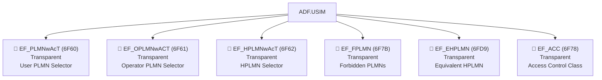
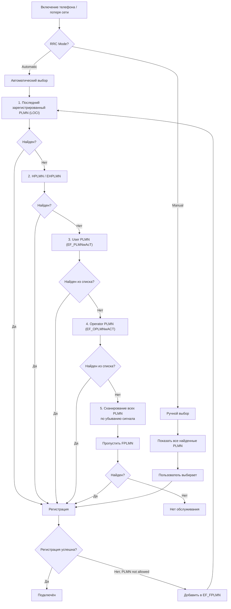

# PLMN и роуминг: как SIM выбирает сеть

> **Synthesis** — механизм выбора сети: от списков предпочтительных PLMN до запрещённых сетей, формат записей и алгоритм автоматического выбора.

---

## Карта файлов PLMN



> [!note] Кто кем управляет
> **User PLMN** (EF_PLMNwAcT) — редактируется пользователем через меню телефона. **Operator PLMN** (EF_OPLMNwACT) — прошивается оператором, пользователь не может изменить. **Forbidden PLMN** (EF_FPLMN) — автоматически обновляется при неудачных попытках регистрации.

---

## 1. Формат PLMN-записи (общий для всех файлов)

Все PLMN-файлы используют одинаковый формат записей. Каждая запись занимает **5 байт** (MCC+MNC = 3 байта + Access Technology = 2 байта), либо **3 байта** (только MCC+MNC, без Access Technology).

### Структура записи (5-байтовый формат)

```
PLMN Record (5 байт):
┌──────────────┬───────────────┐
│   3 байта    │    2 байта    │
│  MCC + MNC   │ Access Tech   │
│  (BCD,       │  (битовая     │
│   reverse    │   маска)      │
│   nibble)    │               │
└──────────────┴───────────────┘
```

#### Байты 0-2: MCC + MNC (BCD reverse nibble)

```
MCC 250, MNC 01:
  1-я цифра: 2, 2-я цифра: 5, 3-я цифра: 0, MNC2: 1
  → байт 0: 0x52 (5 в старшем полубайте, 2 в младшем)
  → байт 1: 0x01 (MCC_3=0 в старшем, MNC_1=0 — RFU)
  → байт 2: 0xF1 (MNC_2=1 в старшем, MNC_3=0xF для 2-значного MNC)
```

> [!info] 2-значный vs 3-значный MNC
> Если MNC — 2 цифры (как в Европе), байт 2 содержит `0xF?` (старший полубайт = 0xF). Если 3 цифры (как в США: MNC 410), то байт 2 содержит обычный BCD.

#### Байты 3-4: Access Technology (битовая маска)

| Бит | Технология | Поколение |
|---|---|---|
| b1 | GSM | 2G |
| b2 | GSM Compact | 2G |
| b3 | UTRAN (UMTS) | 3G |
| b4 | E-UTRAN (LTE) | 4G |
| b5 | E-UTRAN NB-S1 mode | 4G NB-IoT |
| b6 | NG-RAN (NR) | 5G |
| b7 | NG-RAN NB-IoT | 5G NB-IoT |
| b8 | E-UTRAN WB-S1 mode | 4G |

> [!example] Пример: PLMN с поддержкой 4G и 5G
> ```
> Байты 3-4: 0x30 0x00 = 0000 0000 0011 0000
>                              └────────────┘
>                              Биты 5-6 (0-indexed: 4-5):
>                              E-UTRAN + NG-RAN
> → Сеть поддерживает 4G и 5G
> ```

---

## 2. EF_PLMNwAcT (6F60) — User PLMN Selector

### Параметры файла

| Свойство | Значение |
|---|---|
| **FID** | `0x6F60` |
| **Уровень** | ADF.USIM |
| **Тип** | Transparent |
| **Размер** | n × 5 байт (≥45 байт — 9 сетей) |
| **Доступ** | READ BINARY (PIN), UPDATE BINARY (PIN) |
| **Сервис UST** | Service 31 |

### Назначение

Список PLMN, **приоритетно выбранных пользователем**. Пользователь редактирует его через меню «Выбор сети → Вручную» в телефоне. Сети в списке расположены в порядке предпочтения (первая — самая предпочтительная).

```
EF_PLMNwAcT:
┌─────────────────────────────────────────────────────┐
│ Record 1: 25001 (МТС)     + 4G,5G → самый желаемый  │
│ Record 2: 25002 (МегаФон) + 4G    → второй          │
│ Record 3: 25099 (Билайн)  + 4G    → третий          │
│ Record 4..N: ...                                    │
└─────────────────────────────────────────────────────┘
```

---

## 3. EF_OPLMNwACT (6F61) — Operator PLMN Selector

### Параметры файла

| Свойство | Значение |
|---|---|
| **FID** | `0x6F61` |
| **Уровень** | ADF.USIM |
| **Тип** | Transparent |
| **Размер** | n × 5 байт |
| **Доступ** | READ BINARY (PIN), UPDATE BINARY (ADM) |

### Назначение

Список PLMN, **прошитый оператором** на SIM-карте. Это роуминг-политика оператора: в каких странах и с какими партнёрами должен регистрироваться абонент. Пользователь не может редактировать (только ADM/OTA).

```
Пример OPLMNwACT для российского оператора:
  РФ:     25001 (МТС) + all tech
  Украина: 25501 (Vodafone UA) + 4G,5G
  Германия: 26202 (Vodafone DE) + 4G,5G
  Турция:  28601 (Turkcell) + 4G
  ...
```

---

## 4. EF_HPLMNwAcT (6F62) — HPLMN Selector

### Параметры файла

| Свойство | Значение |
|---|---|
| **FID** | `0x6F62` |
| **Уровень** | ADF.USIM |
| **Тип** | Transparent |
| **Размер** | 5 байт (одна запись) |
| **Доступ** | READ BINARY (PIN), UPDATE BINARY (ADM) |

### Назначение

Содержит **MCC+MNC домашней сети** (HPLMN — Home PLMN) и период поиска домашней сети в роуминге.

```
EF_HPLMNwAcT:
┌──────────────┬───────────────┐
│   3 байта    │    2 байта    │
│  HPLMN       │  Period       │
│  (MCC+MNC)   │  (в минутах)  │
└──────────────┴───────────────┘
```

Период указывает, как часто телефон должен пытаться найти HPLMN (или EHPLMN) во время роуминга. Типичное значение: 6-60 минут.

---

## 5. EF_FPLMN (6F7B) — Forbidden PLMNs

### Параметры файла

| Свойство | Значение |
|---|---|
| **FID** | `0x6F7B` |
| **Уровень** | ADF.USIM |
| **Тип** | Transparent |
| **Размер** | n × 3 байта (только MCC+MNC, без Access Tech) |
| **Доступ** | READ BINARY (PIN), UPDATE BINARY (PIN) |

### Назначение

Список **запрещённых сетей** — PLMN, в которых регистрация была отклонена. Телефон автоматически добавляет сеть в FPLMN, если регистрация не удалась (причина отказа: «PLMN not allowed», «Roaming not allowed», и т.д.).

Автоматический алгоритм:
```
1. Попытка регистрации в PLMN X
2. Сеть отвечает: "PLMN not allowed" (Cause #11)
3. Телефон добавляет X в EF_FPLMN
4. При следующем сканировании: X — пропускается
```

> [!warning] FPLMN и ручной выбор
> Даже при ручном выборе сети телефон НЕ должен пытаться регистрироваться в PLMN из FPLMN. Чтобы удалить сеть из FPLMN, нужен перезапуск или OTA-команда от оператора.

### Очистка FPLMN

FPLMN очищается автоматически через 12-24 часа (зависит от реализации) или при смене страны (MCC изменился).

---

## 6. EF_EHPLMN (6FD9) — Equivalent HPLMN

### Параметры файла

| Свойство | Значение |
|---|---|
| **FID** | `0x6FD9` |
| **Уровень** | ADF.USIM |
| **Тип** | Transparent |
| **Размер** | n × 5 байт |
| **Доступ** | READ BINARY (PIN), UPDATE BINARY (ADM) |

### Назначение

Список PLMN, которые считаются **эквивалентными домашней сети**. Это важно для операторов, у которых есть несколько кодов PLMN (например, после слияния компаний).

```
Пример: Vodafone + бывший E-Plus в Германии
  HPLMN: 262 02 (Vodafone DE)
  EHPLMN: 262 03 (E-Plus legacy)
  → В обеих сетях телефон ведёт себя как "дома" (не роуминг)
```

---

## 7. EF_ACC (6F78) — Access Control Class

### Параметры файла

| Свойство | Значение |
|---|---|
| **FID** | `0x6F78` |
| **Уровень** | ADF.USIM |
| **Тип** | Transparent |
| **Размер** | 2 байта |
| **Доступ** | READ BINARY (PIN) |

### Назначение

Битовая маска из 16 бит (2 байта), определяющая **приоритет доступа** к сети.

| Биты (ACC) | Назначение |
|---|---|
| 0-9 | Случайно распределены между абонентами (0-9) |
| 10 | Экстренный вызов (разрешён без IMSI/SIM) |
| 11-14 | Специальные службы (полиция, скорая, пожарные) |
| 15 | PLMN Staff |

ACC 11-15 — «High Priority Access»: в случае перегрузки сети эти классы получают приоритет.

---

## 8. Алгоритм выбора PLMN (3GPP TS 23.122)



### Приоритет в автоматическом режиме

1. **Last Registered PLMN** (из EF_LOCI / EF_EPSLOCI / EF_5GS3GPPLOCI)
2. **Home PLMN** (EF_HPLMNwAcT + EF_EHPLMN)
3. **User PLMN Selector** (EF_PLMNwAcT) — в порядке записи
4. **Operator PLMN Selector** (EF_OPLMNwACT) — в порядке записи
5. **Все остальные PLMN** — по убыванию уровня сигнала
6. **Любой PLMN** (кроме FPLMN) — последняя надежда

> [!tip] Периодический поиск HPLMN (HPPLMN timer)
> В роуминге телефон периодически повторяет поиск HPLMN/EHPLMN с интервалом, заданным в EF_HPLMNwAcT (2-60 минут). Если HPLMN найден — немедленно перерегистрируется.

---

## 9. Сравнительная таблица PLMN-файлов

| Свойство | EF_PLMNwAcT | EF_OPLMNwACT | EF_HPLMNwAcT | EF_FPLMN | EF_EHPLMN | EF_ACC |
|---|---|---|---|---|---|---|
| **FID** | `6F60` | `6F61` | `6F62` | `6F7B` | `6FD9` | `6F78` |
| **Тип** | Transparent | Transparent | Transparent | Transparent | Transparent | Transparent |
| **Размер записи** | 5 байт | 5 байт | 5 байт | 3 байта | 5 байт | 2 байта |
| **Содержимое** | Предпочтения пользователя | Роуминг-политика оператора | HPLMN + таймер | Запрещённые сети | Эквиваленты HPLMN | Класс доступа |
| **Доступ на запись** | PIN | ADM | ADM | PIN (авто) | ADM | ADM |
| **Порядок приоритета** | 3-й | 4-й | 2-й | Исключение | 2-й (вместе с HPLMN) | — |
| **UST Service** | 31 | 32 | — | — | — | — |

---

## 10. Связи

- [[wiki/concepts/UICC_File_System|Файловая система UICC]] — местоположение PLMN-файлов
- [[wiki/concepts/EF_Types|Типы EF]] — Transparent структура
- [[wiki/concepts/USIM|USIM]] — PLMN Selection и Location Info
- [[wiki/reference/USIM_EF_Table|USIM EF Table]] — полный справочник EF
- [[wiki/syntheses/gsm_vs_usim_filesystem|GSM vs USIM]] — как расширился выбор сети от GSM к 5G
- [[wiki/syntheses/sim_files_operator_name|Имя оператора]] — SPN, PNN, OPL для отображения имени сети
- [[wiki/syntheses/sim_files_identifiers|Идентификаторы SIM]] — IMSI (MCC+MNC в идентификаторе)
- [[wiki/summaries/ts_131102|TS 31.102]] — спецификация PLMN-файлов
- [[wiki/research/plmn_selection_algorithm|PLMN Selection Algorithm]] — полный алгоритм выбора сети (Research, 95+ KB)
