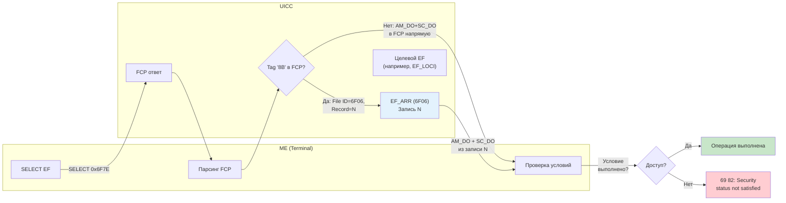
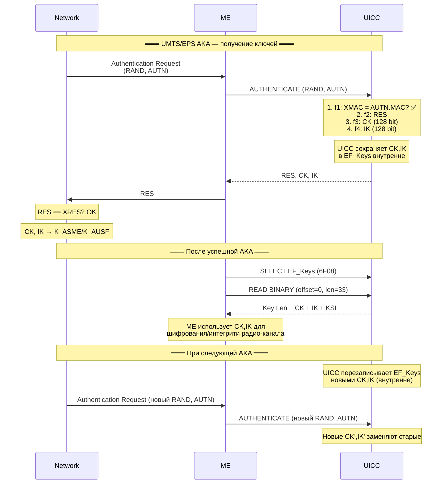
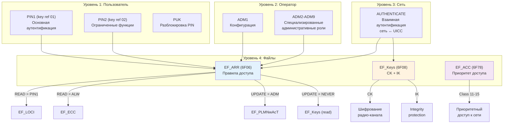

---
tags:
  - synthesis
  - SIM-files
  - security
  - EF_ARR
  - EF_Keys
  - EF_ACC
  - access-control
  - PIN
type: synthesis
created: 2026-06-12
updated: 2026-06-12
status: reviewed
sources:
  - "[[wiki/summaries/ts_131102]]"
  - "[[wiki/summaries/ts_102221]]"
  - "[[wiki/concepts/UICC_Security]]"
  - "[[wiki/concepts/USIM]]"
  - "[[wiki/concepts/UICC_File_System]]"
  - "[[wiki/concepts/EF_Types]]"
---

# Безопасность через файлы: EF_ARR, EF_Keys, EF_ACC

> **Synthesis** — как файловая система UICC реализует многоуровневую безопасность: контроль доступа через EF_ARR, хранение ключей шифрования в EF_Keys/EF_KeysPS, и приоритет доступа к сети через EF_ACC.

---

## 1. Обзор: три столпа файловой безопасности UICC

Безопасность UICC построена на трёх механизмах, каждый из которых реализован через конкретные EF:

```
┌────────────────────────────────────────────────────────────────┐
│                 Файловая безопасность UICC                     │
│                                                                │
│  ┌──────────────────┐  ┌──────────────────┐  ┌──────────────┐ │
│  │  EF_ARR (6F06)   │  │  EF_Keys/KeysPS  │  │  EF_ACC(6F78)│ │
│  │  Контроль        │  │  Ключи           │  │  Приоритет   │ │
│  │  доступа         │  │  шифрования      │  │  доступа     │ │
│  └──────┬───────────┘  └──────┬───────────┘  └──────┬───────┘ │
│         │                     │                      │         │
│         ▼                     ▼                      ▼         │
│  ┌──────────────┐  ┌──────────────────┐  ┌──────────────┐     │
│  │ Кто может    │  │ Как шифруется    │  │ Кто первый   │     │
│  │ читать/писать│  │ радио-канал      │  │ при перегрузке│    │
│  │ каждый EF?   │  │                  │  │ сети?        │     │
│  └──────────────┘  └──────────────────┘  └──────────────┘     │
└────────────────────────────────────────────────────────────────┘
```

---

## 2. Таблица файлов

| EF | FID | Тип | Расположение | READ | UPDATE | Назначение |
|---|---|---|---|---|---|---|
| **EF_ARR** | `6F06` | BER-TLV | MF (`3F00`) | ALW | ADM | Access Rule Reference — шаблоны доступа |
| **EF_Keys** | `6F08` | Transparent | ADF.USIM | PIN1 | NEVER | CK + IK для CS/PS доменов |
| **EF_KeysPS** | `6F09` | Transparent | ADF.USIM | PIN1 | NEVER | CK + IK для PS домена |
| **EF_ACC** | `6F78` | Transparent | ADF.USIM | PIN1 | ADM | Access Control Class |

> [!warning] EF_Keys UPDATE = NEVER
> Ключи шифрования CK и IK **никогда** не могут быть записаны извне через UPDATE BINARY. Это предотвращает подмену ключей злоумышленником. Ключи устанавливаются только внутренне — в результате выполнения команды AUTHENTICATE.

---

## 3. EF_ARR (6F06) — Access Rule Reference

### 3.1 Назначение

**EF_ARR** — это центральный реестр **правил доступа**. Вместо того чтобы встраивать security attributes в FCP каждого EF, UICC может хранить их в EF_ARR и ссылаться на них. Это позволяет:

- **Централизованное управление**: изменение одного правила в EF_ARR меняет доступ ко всем файлам, которые на него ссылаются
- **Экономия памяти**: не нужно дублировать одинаковые security attributes в каждом EF
- **Гибкость**: оператор может переопределить доступ к группе файлов одной операцией

### 3.2 Структура

EF_ARR — **BER-TLV** файл. Каждая запись — Linear Fixed. Ссылка на запись — через её **record number**.

```
EF_ARR (BER-TLV внутри записи):
┌────────────────────────────────────────────┐
│ AM_DO (Tag '80'): Access Mode              │
│   Byte 1: режимы доступа (битовая маска)   │
│   [Byte 2-3: ещё AM, если нужно]           │
├────────────────────────────────────────────┤
│ SC_DO (Tag '90'): Security Condition       │
│   Byte 1: условие для AM byte 1            │
│   [Byte 2-3: условия для AM byte 2-3]      │
└────────────────────────────────────────────┘
```

### 3.3 Как работает ARR-ссылка

Когда телефон выбирает EF и получает FCP, security attributes могут быть указаны двумя способами:

**Способ 1: Compact Format (встроенные)**
```
FCP содержит:
  AM_DO (Tag '80') + SC_DO (Tag '90')
```

**Способ 2: Expanded Format (ARR-ссылка)**
```
FCP содержит:
  Tag '8B' → {
      File ID = 0x6F06 (EF_ARR)
      Record number = N
      [SEID = X (для multi-verification)]
  }
```

Телефон читает EF_ARR запись N и получает готовые AM_DO + SC_DO.

### 3.4 Пример: как EF_ARR упрощает жизнь

```
Без EF_ARR:
  EF_SPN:     FCP содержит AM=04(READ)+SC=01(PIN1)
  EF_LOCI:    FCP содержит AM=04(READ)+SC=01(PIN1), AM=08(UPDATE)+SC=01(PIN1)
  EF_FPLMN:   FCP содержит AM=04(READ)+SC=01(PIN1), AM=08(UPDATE)+SC=01(PIN1)
  ... (100 EF — 100 копий security attributes)

С EF_ARR:
  EF_ARR Record 1: READ=PIN1, UPDATE=PIN1
  EF_ARR Record 2: READ=ALW, UPDATE=ADM

  EF_SPN:     FCP → EF_ARR Record 1 (READ=PIN1)
  EF_LOCI:    FCP → EF_ARR Record 1 (READ=PIN1, UPDATE=PIN1)
  EF_FPLMN:   FCP → EF_ARR Record 1 (READ=PIN1, UPDATE=PIN1)
  EF_ECC:     FCP → EF_ARR Record 2 (READ=ALW, UPDATE=ADM)
```

### 3.5 Mermaid: ARR-механизм



---

## 4. EF_Keys (6F08) и EF_KeysPS (6F09) — Ключи шифрования

### 4.1 Назначение

EF_Keys и EF_KeysPS хранят **сессионные ключи**, полученные в результате UMTS/EPS AKA:
- **CK** (Cipher Key, 128 бит) — для шифрования радио-канала (UEA — UMTS Encryption Algorithm)
- **IK** (Integrity Key, 128 бит) — для integrity protection (UIA — UMTS Integrity Algorithm)

### 4.2 Структура EF_Keys и EF_KeysPS

Оба файла имеют идентичную структуру (Transparent, 33 байта):

```
EF_Keys (6F08) / EF_KeysPS (6F09) — 33 байта:

┌──────────┬────────────────────┬────────────────────┬──────┐
│ Key Len  │ CK                 │ IK                 │ KSI  │
│ 1 байт   │ 16 байт (128 bit)  │ 16 байт (128 bit)  │ 1 B  │
└──────────┴────────────────────┴────────────────────┴──────┘
```

| Поле | Размер | Описание |
|---|---|---|
| **Key Length** | 1 байт | `0x10` = 128 бит ключи (стандарт) |
| **CK** | 16 байт | Cipher Key — для UEA1 (SNOW 3G) или UEA2 (AES) |
| **IK** | 16 байт | Integrity Key — для UIA1 (SNOW 3G) или UIA2 (AES) |
| **KSI** | 1 байт | Key Set Identifier (`000` = native, `001` = mapped из GSM) |

### 4.3 EF_Keys vs EF_KeysPS

| Аспект | EF_Keys (6F08) | EF_KeysPS (6F09) |
|---|---|---|
| **Домен** | CS + PS (общие ключи) | Только PS (выделенные ключи) |
| **Использование** | Когда CS и PS обслуживаются одним MSC/SGSN | Когда PS имеет отдельный SGSN с отдельной AKA |
| **Размер** | 33 байта | 33 байта |
| **Обновление** | После каждой UMTS/EPS AKA | После PS-specific AKA |
| **READ** | PIN1 | PIN1 |
| **UPDATE** | NEVER | NEVER |

> [!tip] Зачем разделение?
> В ранних 3G-сетях CS (голос) и PS (данные) могли обслуживаться разными узлами (MSC и SGSN), каждый со своим security context. EF_KeysPS позволяет PS-домену иметь независимые ключи, не затрагивая CS-домен. В современных сетях (LTE/5G) используется единый контекст, и разделение менее актуально.

### 4.4 Жизненный цикл ключей



### 4.5 Почему UPDATE = NEVER

Ключи CK и IK — это **сессионные ключи**. Они должны:
1. Быть известны только UICC и сети (не ME, не злоумышленнику)
2. Быть результатом AKA (не могут быть записаны извне)
3. Обновляться только через команду AUTHENTICATE

UPDATE = NEVER гарантирует, что даже при компрометации PIN1 злоумышленник не может записать свои ключи в EF_Keys.

---

## 5. EF_ACC (6F78) — Access Control Class

### 5.1 Назначение

EF_ACC определяет **приоритет доступа** абонента к сети. Это 2-байтовый Transparent файл (битовая маска), управляющий тем, может ли абонент совершать звонки при перегрузке сети.

### 5.2 Структура

```
EF_ACC — 2 байта (Transparent):
┌──────────────────────────────────────────────────────────────┐
│ Byte 0: Access Class 0-7                                     │
│ Byte 1: Access Class 8-15                                    │
└──────────────────────────────────────────────────────────────┘

Биты (в порядке b8..b1 каждого байта):
Byte 0:
  b8 = Class 0
  b7 = Class 1
  ...
  b1 = Class 7

Byte 1:
  b8 = Class 8
  b7 = Class 9
  b6 = Class 10
  b5 = Class 11 (PLMN use)
  b4 = Class 12 (Security Services)
  b3 = Class 13 (Public Utilities)
  b2 = Class 14 (Emergency Services)
  b1 = Class 15 (PLMN Staff)
```

### 5.3 Значение классов доступа

| Класс | Назначение | Кто назначает | Приоритет при перегрузке |
|---|---|---|---|
| **0-9** | Обычные абоненты | Случайно (по IMSI) | Может быть заблокирован |
| **10** | Экстренные вызовы (112/911) | Не требует ACC | **Всегда разрешён** (не зависит от ACC!) |
| **11** | PLMN Use (оператор) | Оператор | Высокий |
| **12** | Security Services (полиция, спецслужбы) | Оператор | Высокий |
| **13** | Public Utilities (вода, газ, электричество) | Оператор | Средний |
| **14** | Emergency Services (скорая, пожарные) | Оператор | Высокий |
| **15** | PLMN Staff (сотрудники оператора) | Оператор | Высокий |

### 5.4 Как это работает при перегрузке

```
При перегрузке сети (чрезвычайная ситуация, массовое событие):

Сеть объявляет запрет (barring) для определённых классов:
  "Access Classes 0-9 barred for 60 seconds"
  "Access Class 14 always allowed"

ME случайным образом выбирает:
  - Если ACC содержит Class 0-9 → ME ждёт случайное время и повторяет
  - Если ACC содержит Class 11-15 → ME игнорирует запрет и выполняет вызов

Emergency call (Class 10): ALWAYS разрешён, ACC не проверяется!
```

> [!info] 5G Evolution: UAC
> В 5G EF_ACC дополняется (не заменяется!) механизмом **UAC** (Unified Access Control) через [[wiki/syntheses/sim_files_5g#8. EF_UAC_AIC (6FF5) — UAC Access Identities Configuration|EF_UAC_AIC]]. UAC более гранулярный: помимо класса доступа учитывает тип вызова, слайс и приложение.

### 5.5 Связь ACC с IMSI

Для обычных абонентов (Class 0-9) класс назначается **детерминированно** из IMSI:

```
Access Class = (последняя цифра IMSI) mod 10

Пример:
  IMSI = 250 01 123456789 → последняя цифра = 9 → Access Class 9
```

Это обеспечивает равномерное распределение: при запрете одного класса (скажем, Class 5) блокируется только ~10% абонентов.

---

## 6. Access Conditions: полный справочник

### 6.1 Access Modes (AM) — что защищается

| Бит | Операция | Команда APDU |
|---|---|---|
| `0x80` | DELETE FILE | DELETE FILE |
| `0x40` | TERMINATE DF | TERMINATE DF |
| `0x20` | ACTIVATE FILE | ACTIVATE FILE |
| `0x10` | DEACTIVATE FILE | DEACTIVATE FILE |
| `0x08` | **READ / SEARCH** | READ BINARY, READ RECORD, SEARCH RECORD |
| `0x04` | **UPDATE** | UPDATE BINARY, UPDATE RECORD |
| `0x02` | **INCREASE** | INCREASE |
| `0x01` | **REHABILITATE** | REHABILITATE |
| `0x80` (AM2) | INVALIDATE | INVALIDATE |

### 6.2 Security Conditions (SC) — что требуется

| Код | Условие | Описание |
|---|---|---|
| `0` | **ALW** (ALWays) | Доступ всегда разрешён, без ограничений |
| `1` | **PIN1** | Требуется VERIFY PIN (key reference `01`) |
| `2` | **PIN2** | Требуется VERIFY PIN (key reference `02`) |
| `3` | RFU | Зарезервировано |
| `4` | **ADM1** | Административный доступ (уровень 1) |
| `5`-`A` | ADM2-ADM9 | Административный доступ (уровни 2-9) |
| `B`-`D` | RFU | Зарезервировано |
| `E` | **AUTH** | Требуется внешняя аутентификация (между ME и UICC) |
| `F` | **NEV** (NEVer) | Доступ запрещён всегда |

### 6.3 Типичные комбинации

| Комбинация | Где используется |
|---|---|
| **READ = PIN1, UPDATE = ADM** | EF_PLMNwAcT, EF_OPLMNwACT, EF_EHPLMN — пользователь видит, оператор меняет |
| **READ = PIN1, UPDATE = PIN1** | EF_LOCI, EF_EPSLOCI — ME читает и пишет после регистрации |
| **READ = PIN1, UPDATE = NEVER** | EF_Keys, EF_KeysPS — ключи только для чтения (и то — для отладки) |
| **READ = PIN2, UPDATE = ADM** | EF_ACM — пользователь (с PIN2) видит, оператор сбрасывает |
| **READ = ALW, UPDATE = ADM** | EF_ECC, EF_SPN — экстренные номера/имя оператора видны всегда |
| **READ = ADM, UPDATE = ADM** | EF_SUCI_Calc_Info — критические параметры только для оператора |

---

## 7. Mermaid: иерархия безопасности



---

## 8. Взаимодействие файлов безопасности с другими системами

### 8.1 При включении телефона

```
1. ME получает ATR от UICC
2. ME выбирает MF (3F00) — автоматически после ATR
3. ME запрашивает PIN (если PIN включён)
   ME → UICC: VERIFY PIN (сначала может прочитать PIN Status из FCP)
4. После успешной верификации PIN: доступны EF с SC=PIN1
5. ME выбирает ADF.USIM по AID
6. ME читает EF_UST → определяет сервисы
7. ME читает EF_ACC → определяет класс доступа
8. По мере необходимости ME обращается к другим EF,
   каждый раз проверяя security attributes (из FCP или EF_ARR)
```

### 8.2 При регистрации в сети

```
1. ME читает EF_IMSI → предъявляет сети
2. Сеть запускает AUTHENTICATE → EF_Keys обновляется (CK, IK)
3. После успешной регистрации ME обновляет EF_LOCI (TMSI + LAI)
4. ME периодически читает EF_Keys для получения актуальных CK/IK
```

### 8.3 При экстренном вызове

```
1. PIN не введён → большинство EF недоступны
2. ME читает EF_ECC (READ = ALW или PIN1 с исключением) → список экстренных номеров
3. EF_ACC не проверяется: экстренные вызовы Class 10 всегда разрешены
4. Вызов проходит без аутентификации
```

---

## 9. Практические аспекты

### 9.1 Для разработчиков/тестировщиков

- **Чтение EF_ARR**: `SELECT 0x6F06` → `READ RECORD N` → парсинг BER-TLV (Tag `80` = AM_DO, Tag `90` = SC_DO)
- **Проверка прав**: `SELECT target_EF` → FCP → если Tag `8B` → `READ EF_ARR record N` → проверка AM/SC
- **PIN status**: SELECT DF → FCP → PS_DO (Tag `8B`/`8C`) → количество оставшихся попыток, статус
- **pySim**: `pySim-read --usim` показывает EF_ACC в читаемом формате (Class 0-15)

### 9.2 Для операторов

- EF_ARR должен быть тщательно спроектирован: изменение одной записи влияет на множество файлов
- EF_Keys UPDATE = NEVER — правильное решение, не пытайтесь обойти
- EF_ACC Class 12-15 должны назначаться только авторизованному персоналу
- При ротации Home Network PK (EF_SUCI_Calc_Info) убедитесь, что старый private key сохранён на период перехода

---

## 10. Связи

- **Платформа безопасности**: фундаментальная архитектура — [[wiki/concepts/UICC_Security|UICC Security]]
- **Файловая система**: где находятся эти EF — [[wiki/concepts/UICC_File_System|UICC File System]]
- **Типы EF**: Transparent (EF_Keys, EF_ACC), BER-TLV (EF_ARR) — [[wiki/concepts/EF_Types|EF Types]]
- **USIM**: все эти файлы в контексте — [[wiki/concepts/USIM|USIM Application]]
- **Эволюция аутентификации**: как используются ключи в AKA — [[wiki/syntheses/auth_evolution|Auth Evolution]]
- **5G-безопасность**: расширение в DF_5GS — [[wiki/syntheses/sim_files_5g|5G SIM Files]]
- **FCP**: как телефон узнаёт security attributes — [[wiki/concepts/FCP]]
- **APDU-команды**: VERIFY PIN, AUTHENTICATE, READ/UPDATE — [[wiki/concepts/APDU]]
- **Specifications**: [[wiki/summaries/ts_102221|TS 102 221 (UICC)]], [[wiki/summaries/ts_131102|TS 31.102 (USIM)]]
