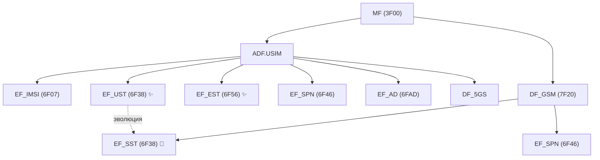
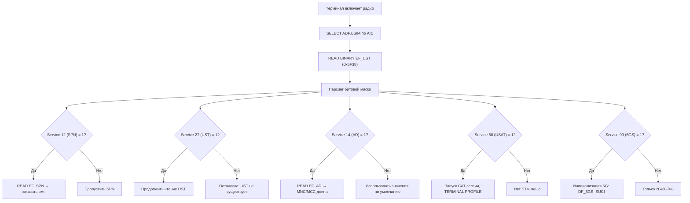
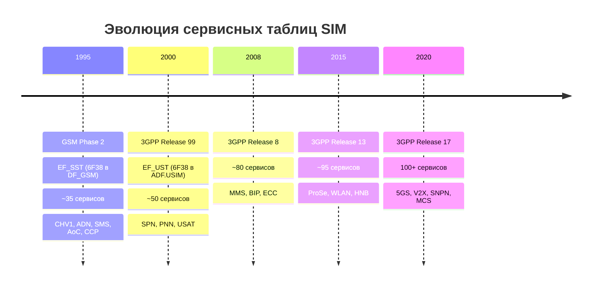

---
tags:
  - synthesis
  - USIM
  - EF
  - service-table
  - UST
  - SST
type: synthesis
created: 2026-06-12
updated: 2026-06-12
status: reviewed
sources:
  - "[[wiki/summaries/ts_131102]]"
  - "[[wiki/summaries/gsm_1111]]"
  - "[[wiki/concepts/USIM]]"
  - "[[wiki/concepts/UICC_File_System]]"
  - "[[wiki/concepts/EF_Types]]"
  - "[[wiki/syntheses/gsm_vs_usim_filesystem]]"
---

# Сервисная таблица: EF_UST и EF_SST

> **Synthesis** — как UICC сообщает терминалу какие сервисы доступны: от 35 бит SST в GSM до 100+ бит UST в 5G.

---

## 1. Зачем нужна сервисная таблица

Когда терминал впервые взаимодействует с UICC после включения, он не знает какие сервисы поддерживает данная карта. UICC может быть усечённой (только голос и SMS), а может быть полнофункциональной (5G, ProSe, V2X, MMS, ...). Вместо того чтобы пробовать читать каждый EF и обрабатывать ошибки, терминал читает **один файл** — сервисную таблицу — и получает полную битовую карту доступных сервисов.

```
ВКЛЮЧЕНИЕ ТЕЛЕФОНА:
┌──────────┐     ┌──────────┐     ┌───────────────┐
│  ATR     │ ──> │ SELECT   │ ──> │ READ EF_UST    │
│  (сброс) │     │ ADF.USIM │     │ (Service Table)│
└──────────┘     └──────────┘     └───────┬─────────┘
                                          │
                    ┌─────────────────────┤
                    ▼                     ▼
             Service 12=1?        Service 99=1?
             └─> READ EF_SPN      └─> 5GS инициализация
             Service 2=1?         Service 17=1?
             └─> READ EF_FDN      └─> Advice of Charge
             Service 27=1?        Service 68=1?
             └─> (сама UST        └─> USAT инициализация
                  существует)
```

---

## 2. EF_UST — USIM Service Table (6F38)

### Параметры файла

| Свойство | Значение |
|---|---|
| **FID** | `0x6F38` |
| **Тип** | Transparent EF |
| **Расположение** | ADF.USIM |
| **Минимальный размер** | 1 байт |
| **Максимальный размер** | Расширяемый (зависит от числа сервисов) |
| **Access** | READ: ALW, UPDATE: ADM |
| **Стандарт** | 3GPP TS 31.102 Clause 4.2.9 |

### Формат

EF_UST — это битовая маска. Каждый бит соответствует одному сервису:

```
EF_UST:
┌─────────────────────────────────────────────────────┐
│ Byte 0  │ Byte 1  │ Byte 2  │ ...    │ Byte N-1     │
│ b8...b1 │ b8...b1 │ b8...b1 │        │ b8...b1      │
│ S1..S8  │ S9..S16 │ S17..S24│        │ S(8N-7)..S8N │
└─────────────────────────────────────────────────────┘

Бит = 1 → Сервис allocated AND activated (EF существует и доступен)
Бит = 0 → Сервис не доступен (EF может отсутствовать или не инициализирован)
```

> [!note] Нумерация битов в ETSI/3GPP
> Используется нотация **b8 b7 b6 b5 b4 b3 b2 b1**, где b8 — старший бит байта (0x80), b1 — младший (0x01). Сервис N соответствует биту `((N-1) mod 8) + 1` в байте `(N-1) // 8`.

### Ключевые сервисы (выборочно из 100+)

| Сервис # | Название | Что делает терминал при бите=1 |
|---|---|---|
| **1** | Local Phone Book | Читает EF_PBR, EF_ADN, EF_EMAIL из DF_PHONEBOOK |
| **2** | Fixed Dialling Numbers (FDN) | Читает EF_FDN (разрешённые номера) |
| **4** | Short Message Storage (SMS) | Читает EF_SMS, EF_SMSP |
| **12** | Service Provider Name | Читает EF_SPN, отображает имя оператора |
| **14** | Administrative Data | Читает EF_AD (MNC длина, режим работы) |
| **17** | Advice of Charge (AoC) | Читает EF_ACM, EF_ACMmax |
| **27** | USIM Service Table | Рекурсивно: сам факт существования EF_UST |
| **33** | eMLPP | Enhanced Multi-Level Precedence and Pre-emption |
| **38** | BIP (Bearer Independent Protocol) | Поддержка data-канала через USAT |
| **58** | MMS | MMS User Connectivity Parameters |
| **68** | USAT (USIM Application Toolkit) | Запуск CAT-сессии, чтение EF_UFC |
| **86** | ProSe | Proximity Services (D2D, Direct Discovery) |
| **90** | V2X | Vehicle-to-Everything (C-V2X) |
| **99** | 5GS | 5G System: инициализация DF_5GS, 5G-ключей |
| **100+** | Beyond Release 17 | Будущие сервисы (NTN, AI/ML, ...) |

> [!tip] Практическое правило
> Если бит сервиса = 0, терминал **не должен** пытаться читать соответствующие EF. Это экономит APDU-команды при инициализации и предотвращает ошибки от отсутствующих файлов.

### Позиции битов для популярных сервисов

```
Byte 0 (Services 1-8):    [A][P][B][...]
Byte 1 (Services 9-16):   [SMS][...][SPN][...]
Byte 3 (Services 25-32):  [ADM][UST][...]
Byte 8 (Services 65-72):  [USAT][...]
Byte 12 (Services 97-104):[5GS][...]
```

---

## 3. EF_EST — Enabled Services Table (6F56)

EF_EST позволяет **временно отключить** сервис, не удаляя его из EF_UST:

| Свойство | Значение |
|---|---|
| **FID** | `0x6F56` |
| **Тип** | Transparent EF |
| **Расположение** | ADF.USIM |
| **Формат** | Битовая маска, идентичная EF_UST по структуре |

```
Логика:
┌───────────────┬───────────────┬────────────────────────┐
│ EF_UST бит    │ EF_EST бит    │ Поведение              │
├───────────────┼───────────────┼────────────────────────┤
│       1       │      1        │ Сервис активен         │
│       1       │      0        │ Сервис заблокирован    │
│       0       │      0        │ Сервис не существует   │
│       0       │      1        │ Недопустимая комбинация│
└───────────────┴───────────────┴────────────────────────┘
```

> [!example] Сценарий использования EF_EST
> Оператор хочет временно отключить Advice of Charge (Service 17) для конкретного абонента. Вместо удаления EF_ACM и изменения EF_UST, оператор через OTA сбрасывает бит 17 в EF_EST. Терминал видит что сервис отключён и перестаёт считать звонки. При повторном включении — OTA устанавливает бит обратно, без перезаписи файловой системы.

---

## 4. EF_SST — SIM Service Table (6F38 в GSM)

### Исторический предшественник

В GSM 11.11 та же логика реализована через **EF_SST** (SIM Service Table). FID совпадает (`0x6F38`), но:

| Свойство | EF_SST (GSM) | EF_UST (USIM) |
|---|---|---|
| **Спецификация** | GSM 11.11 | 3GPP TS 31.102 |
| **FID** | `0x6F38` | `0x6F38` (тот же!) |
| **Расположение** | DF_GSM (`0x7F20`) | ADF.USIM |
| **Количество сервисов** | ~35 | 100+ |
| **Терминология** | CHV1, CHV2 | PIN1, PIN2 |
| **Сервисы 5G** | Нет | Да (Service 99) |
| **Сервисы ProSe/V2X** | Нет | Да (Service 86, 90) |

### Сравнение: какие сервисы есть в SST, но изменились в UST

| SST # | Сервис GSM | UST # | Сервис USIM |
|---|---|---|---|
| 1 | CHV1 Disable | 1 | Local Phone Book |
| 2 | ADN | 2 | FDN |
| 3 | FDN | 3 | _(изменено)_ |
| 4 | SMS | 4 | SMS |
| 5 | AoC | 17 | Advice of Charge (сдвинут!) |
| 6 | CCP | 6 | Capability Config |
| 7 | PLMN Selector | 7 | PLMN Selector |
| — | _(нет)_ | 12 | Service Provider Name |
| — | _(нет)_ | 68 | USAT |
| — | _(нет)_ | 99 | 5GS |

---

## 5. Mermaid: положение в файловой системе



---

## 6. Как терминал читает UST и что делает с каждым битом



---

## 7. Эволюция: SST (35 сервисов) -> UST (100+)



Основной принцип совместимости: **FID 6F38 сохранён между поколениями**. Терминал читает один и тот же FID и получает битовую маску — длина маски говорит ему о поколении карты и количестве поддерживаемых сервисов.

---

## 8. Взаимодействие с другими EF

### EF_UST и EF_SPN

```
EF_UST Service 12 = 1
  └─> Терминал читает EF_SPN (6F46)
      └─> Если Display Condition = 1 → показывает имя оператора
      └─> Если также TERMINAL PROFILE Byte 9 Bit 1 = 1
          └─> Читает EF_SPNI (6FD7) и показывает иконку
```

### EF_UST и DF_5GS

```
EF_UST Service 99 = 1
  └─> Терминал выбирает DF_5GS
      ├─> EF_5GAUTHKEYS (6FF3) — 5G K, RIN
      ├─> EF_5GS3GPPNSC (6FF1) — 5G NAS Security Context
      ├─> EF_SUCI_Calc_Info (6FF6) — Home Network PK
      └─> EF_URSP (6FFA) — UE Route Selection Policy
```

### EF_UST и EF_AD

```
EF_UST Service 14 = 1
  └─> Терминал читает EF_AD (6FAD)
      ├─> Длина MNC (2 или 3 цифры) → правильный парсинг IMSI
      ├─> Режим работы → normal / type approval / ...
      └─> Длина PIN → настройка PIN-интерфейса
```

---

## 9. Практический пример: чтение UST

### Через pySim-shell

```bash
pySim-shell> select ADF.USIM
pySim-shell> read_binary 0x6F38
# Пример ответа для карты с SPN, FDN, SMS, 5GS:
# 01 05 00 40 ... 80 ...
#
# Byte 0 = 0x01 = b'00000001'
#   → Bit 1 (Service 1: Local Phone Book) = 1
#
# Byte 1 = 0x05 = b'00000101'
#   → Bit 1 (Service 9: MSISDN) = 1
#   → Bit 3 (Service 11: ...) = 0
#   → Bit 4 (Service 12: SPN) = 1
#
# Byte 12 (Service 97-104):
#   0x80 = b'10000000'
#   → Bit 8 (Service 104) = ?
#   → Bit 1 (Service 97) = 0
#   Проверяем Service 99 (Byte 12, Bit 3):
#   0x80 не содержит бита 3 → Service 99 = 0 (нет 5GS)
```

### Python-декодирование

```python
def decode_ust(ust_bytes):
    """Декодирует EF_UST в словарь {service_number: bool}."""
    services = {}
    for byte_idx, byte_val in enumerate(ust_bytes):
        for bit_pos in range(8):
            service_num = byte_idx * 8 + bit_pos + 1  # 1-based
            is_active = bool(byte_val & (1 << (7 - bit_pos)))  # b8..b1
            services[service_num] = is_active
    return services

# Пример
ust = bytes.fromhex("0105004080")
svc = decode_ust(ust)
print(f"SPN: {svc.get(12, False)}")     # True (бит 12 = 1)
print(f"FDN: {svc.get(2, False)}")      # True
print(f"5GS: {svc.get(99, False)}")     # False
```

---

## 10. Расширение UST: что делать если сервисов больше чем байт в EF

Если терминал читает EF_UST длиной 1 байт (сервисы 1-8), а спецификация определяет сервис 99 — терминал должен считать что все сервисы за пределами прочитанного = 0. Это обеспечивает **обратную совместимость**:

```
Терминал Release 17 читает EF_UST длиной 1 байт:
  → Сервисы 1-8: из байта 0
  → Сервисы 9-99+: считаются = 0

Терминал Release 8 читает EF_UST длиной 13 байт:
  → Сервисы 1-104: из байтов 0-12
  → Service 99 = 1 → инициализация 5GS!
```

---

## Связи

- **Спецификация USIM**: [[wiki/summaries/ts_131102|TS 31.102]]
- **Спецификация GSM SIM**: [[wiki/summaries/gsm_1111|GSM 11.11]]
- **ADF.USIM и его EF**: [[wiki/concepts/USIM|USIM Application]]
- **Файловая система**: [[wiki/concepts/UICC_File_System|UICC File System]]
- **Типы EF (Transparent)**: [[wiki/concepts/EF_Types|Elementary File Types]]
- **Эволюция SIM -> USIM**: [[wiki/syntheses/gsm_vs_usim_filesystem|GSM vs USIM Filesystem]]
- **EF_AD и Administrative Data**: [[wiki/syntheses/sim_files_admin|Administrative Data EF]]
- **Иконки оператора (связаны с Service 12)**: [[wiki/research/operator_icons_on_sim|Operator Icons on SIM]]
