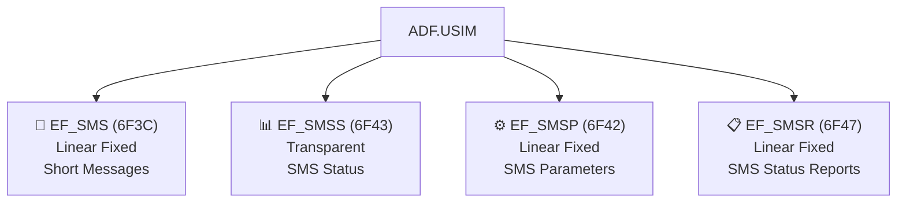

# SMS на SIM: хранение сообщений

> **Synthesis** — как SIM-карта хранит SMS: структура записей, статусы, 7-bit packing и ограничения.

---

## Карта файлов SMS



> [!note] Где лежат SMS-файлы
> Все файлы SMS находятся на уровне ADF.USIM — они не вынесены в отдельный DF. Это legacy-наследие от GSM DF_TELECOM, где EF_SMS тоже был файлом верхнего уровня приложения.

---

## 1. EF_SMS (6F3C) — Short Messages

### Параметры файла

| Свойство | Значение |
|---|---|
| **FID** | `0x6F3C` |
| **Уровень** | ADF.USIM |
| **Тип** | Linear Fixed |
| **Размер** | n записей × 176 байт (типично) |
| **Доступ** | READ RECORD (PIN), UPDATE RECORD (PIN) |
| **Сервис UST** | Service 4 |

### Структура записи SMS

```
EF_SMS Record (стандартный размер: 176 байт):
┌──────────┬────────────────────────────────────────────────────────────┐
│  1 байт  │                    175 байт                                │
│  Status  │                TP-DU (Transport Protocol Data Unit)        │
│          │  ┌──────────────┬────────────────────────────────────────┐ │
│          │  │TP-Header     │ TP-User Data (текст сообщения)         │ │
│          │  │(адреса,      │ в 7-bit packed, 8-bit, или UCS2        │ │
│          │  │ timestamp)   │                                        │ │
│          │  └──────────────┴────────────────────────────────────────┘ │
└──────────┴────────────────────────────────────────────────────────────┘
```

#### Status Byte

Первый байт записи определяет состояние сообщения:

| Status Byte | Состояние | Описание |
|---|---|---|
| `0x00` | Free | Запись свободна (можно записать новое SMS) |
| `0x01` | **Received, Read** | Сообщение получено и прочитано |
| `0x03` | **Received, Unread** | Сообщение получено, но НЕ прочитано |
| `0x05` | Stored, Sent | Сообщение записано и отправлено |
| `0x07` | Stored, Unsent | Сообщение записано, но НЕ отправлено |
| `0x0D` | Stored, Sent from ME | Отправлено с ME (Mobile Equipment) |
| `0x0F` | Stored, Unsent from ME | Сохранено на ME, не отправлено |

> [!tip] Status = 0x00
> Когда Status = 0x00, вся запись считается пустой. Телефон может перезаписать её новым сообщением.

### TP-DU (Transport Protocol Data Unit)

TP-DU — это стандартная PDU сообщения SMS как в 3GPP TS 23.040. Основные поля:

| Поле | Размер | Описание |
|---|---|---|
| **TP-MTI** | 2 бита | Message Type Indicator (SMS-DELIVER, SMS-SUBMIT, etc.) |
| **TP-OA** | 2-12 байт | Originating Address (номер отправителя) |
| **TP-PID** | 1 байт | Protocol Identifier |
| **TP-DCS** | 1 байт | Data Coding Scheme (определяет кодировку) |
| **TP-SCTS** | 7 байт | Service Centre Time Stamp |
| **TP-UDL** | 1 байт | User Data Length |
| **TP-UD** | до 140 байт | User Data (текст сообщения) |

### Размер записи

| Параметр | Типичное значение |
|---|---|
| Стандартная запись | **176 байт** |
| Может варьироваться | 40-250 байт (зависит от производителя UICC) |
| Максимально в ETSI | Произвольный (определён в FCP) |

---

## 2. EF_SMSS (6F43) — SMS Status

### Параметры файла

| Свойство | Значение |
|---|---|
| **FID** | `0x6F43` |
| **Уровень** | ADF.USIM |
| **Тип** | Transparent |
| **Размер** | ≥2 байта (N байт статуса + 2 байта Last Used Record) |
| **Доступ** | READ BINARY (PIN), UPDATE BINARY (PIN) |

### Структура

```
EF_SMSS:
┌──────────────┬──────────────────┬──────────────────┐
│   N байт     │   2 байта         │                  │
│ SMS Statuses │ Last Used Record  │                  │
│ (1 байт на   │ (индекс последней │                  │
│  запись EF_  │  использованной)  │                  │
│  SMS)        │                   │                  │
└──────────────┴──────────────────┴──────────────────┘
```

#### SMS Statuses — битовая маска на каждую запись EF_SMS

| Биты (на запись) | Значение |
|---|---|
| `b1=0` | Свободная память (можно записать) |
| `b1=1` | Занято (сообщение присутствует) |
| `b2` | Статус прочтения (телефон-зависимый) |

#### Last Used Record

Указывает, какая запись EF_SMS была использована последней. Помогает телефону оптимизировать поиск свободного слота.

---

## 3. EF_SMSP (6F42) — SMS Parameters

### Параметры файла

| Свойство | Значение |
|---|---|
| **FID** | `0x6F42` |
| **Уровень** | ADF.USIM |
| **Тип** | Linear Fixed |
| **Размер** | n записей × M байт (обычно 28+ байт) |
| **Доступ** | READ RECORD (PIN), UPDATE RECORD (PIN) |

### Структура записи

```
EF_SMSP Record:
┌──────────┬──────────┬──────────────────────────────┐
│ 1 байт   │ 1 байт   │  N байт                      │
│ TON/NPI  │ Dialling │  SMSC Address (BCD,          │
│          │ Number   │  reverse nibble)             │
│          │ Length   │  → номер SMS-центра          │
└──────────┴──────────┴──────────────────────────────┘
```

- **Byte 0**: TON/NPI (Type of Number / Numbering Plan) — для SMSC-адреса
- **Byte 1**: Длина номера в байтах
- **Byte 2..N**: BCD-кодированный номер SMS-центра

SMSP хранит **адрес SMS-центра** (SMSC), через который отправляются сообщения. Может быть несколько записей для разных SMSC (роуминг, разные сервисы).

> [!info] SMSC Address
> SMSC — Short Message Service Centre. Это сервер оператора, который принимает SMS от отправителя и доставляет получателю. Без корректного SMSC-адреса отправка SMS невозможна.

---

## 4. EF_SMSR (6F47) — SMS Status Reports

### Параметры файла

| Свойство | Значение |
|---|---|
| **FID** | `0x6F47` |
| **Уровень** | ADF.USIM |
| **Тип** | Linear Fixed |
| **Размер** | n записей × 58 байт (типично) |
| **Доступ** | READ RECORD (PIN) |

### Назначение

Хранит **статус-отчёты о доставке SMS** (delivery reports). Каждый отчёт подтверждает, что сообщение было доставлено адресату.

### Структура записи

```
EF_SMSR Record:
┌──────────┬──────────────────────────────────────┐
│  1 байт  │           57 байт                    │
│  Status  │   SMS Status Report TP-DU            │
│          │   (номер, время доставки, статус)    │
└──────────┴──────────────────────────────────────┘
```

- **Byte 0**: Status byte (аналогично EF_SMS: 0x01=read, 0x03=unread)
- **Byte 1-57**: Status Report TP-DU (формат как в TS 23.040)

---

## 5. 7-bit Packing: как текст упаковывается

Текст SMS по умолчанию кодируется в **GSM 7-bit default alphabet** (GSM 03.38). Это не ASCII — это отдельная кодовая страница с латиницей, кириллицей и спец-символами.

### Как работает packing

В 7-битной кодировке **каждый символ занимает 7 бит**, а не 8. Это позволяет упаковать 160 символов в 140 байт (вместо 140 символов при 8-бит).

```
Символы:   H        e        l        l        o
Биты:   1001000  1100101  1101100  1101100  1101111
          48       65       6C       6C       6F

Packing (7 бит → 8 бит):
Байт 0: [симв1:0..6]                         = 0100 1000
Байт 1: [симв1:7] + [симв2:0..5]             = 1100 1010
Байт 2: [симв2:6..7] + [симв3:0..4]          = 1011 0011
Байт 3: [симв3:5..7] + [симв4:0..3]          = 0110 1101
Байт 4: [симв4:4..7] + [симв5:0..2]          = 1111 0110
(≈ 4.4 байта для 5 символов вместо 5)
```

### DCS (Data Coding Scheme) — выбор кодировки

TP-DCS в TP-DU определяет, как закодирован текст:

| DCS | Кодировка | Максимум символов |
|---|---|---|
| `0x00` | GSM 7-bit (default) | 160 символов в 140 байт |
| `0x04` | 8-bit data | 140 символов |
| `0x08` | UCS2 (16-bit) | 70 символов |
| `0xF0` | GSM 7-bit (class 0 — flash SMS) | 160 символов |

> [!tip] Псевдокод 7-bit unpacking
> ```python
> def unpack_7bit(data, septets_count):
>     result = ""
>     buf = 0
>     buf_bits = 0
>     for byte in data:
>         buf |= (byte << buf_bits)
>         buf_bits += 8
>         while buf_bits >= 7:
>             char = buf & 0x7F
>             result += gsm7_to_char[char]
>             buf >>= 7
>             buf_bits -= 7
>     return result
> ```

---

## 6. Ограничения SMS-хранилища

| Ограничение | Типичное значение | Примечание |
|---|---|---|
| **Записей EF_SMS** | 20-50 | Определено производителем UICC |
| **Размер записи** | 176 байт | Вмещает одно SMS (160 символов 7-bit) |
| **Размер записи EF_SMSR** | 58 байт | Один статус-отчёт |
| **Записей EF_SMSP** | 1-4 | Разные SMSC для разных сервисов |
| **Макс. размер одного SMS** | 140 байт (160 символов) | Определено GSM 03.40 |
| **Конкатенированные SMS** | До 255 сегментов | Каждый сегмент — отдельная запись EF_SMS |

> [!warning] Исчерпание памяти
> Телефон должен проверять EF_SMSS перед записью нового SMS. Если все статусы заняты, телефон должен уведомить пользователя: «Память SMS заполнена. Удалите старые сообщения.»

---

## 7. Таблица файлов SMS

| Свойство | EF_SMS | EF_SMSS | EF_SMSP | EF_SMSR |
|---|---|---|---|---|
| **FID** | `6F3C` | `6F43` | `6F42` | `6F47` |
| **Уровень** | ADF.USIM | ADF.USIM | ADF.USIM | ADF.USIM |
| **Тип** | Linear Fixed | Transparent | Linear Fixed | Linear Fixed |
| **Содержимое** | SMS-сообщения | Статусы сообщений | SMSC-адреса | Статус-отчёты |
| **Размер записи** | ~176 байт | 2+N байт | ~28 байт | ~58 байт |
| **UST Service** | Service 4 | — | — | — |
| **Обновление** | PIN | PIN | PIN | PIN (RO) |

---

## 8. Связи

- [[wiki/concepts/UICC_File_System|Файловая система UICC]] — где SMS-файлы в иерархии
- [[wiki/concepts/EF_Types|Типы EF]] — Linear Fixed и Transparent
- [[wiki/concepts/USIM|USIM]] — UST Service 4 (SMS)
- [[wiki/reference/USIM_EF_Table|USIM EF Table]] — полный справочник
- [[wiki/syntheses/gsm_vs_usim_filesystem|GSM vs USIM]] — эволюция SMS-хранилища
- [[wiki/syntheses/sim_files_identifiers|Идентификаторы SIM]] — MSISDN как SMSC-адрес
- [[wiki/summaries/ts_131102|TS 31.102]] — полная спецификация
