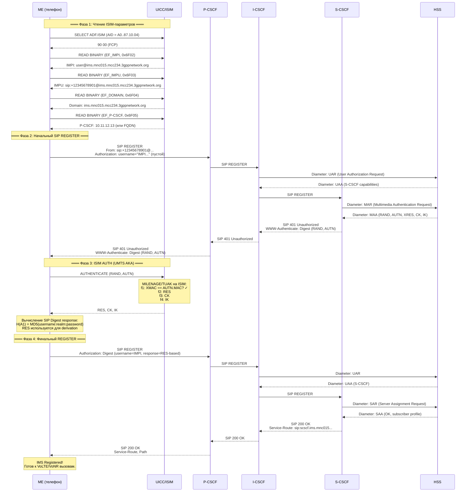
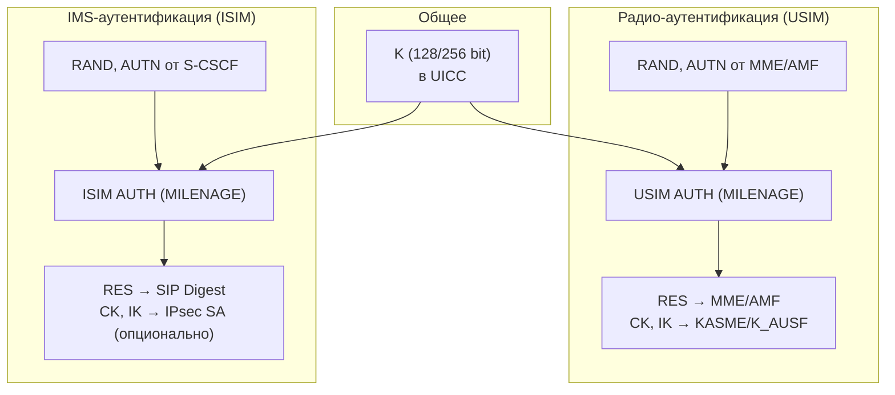
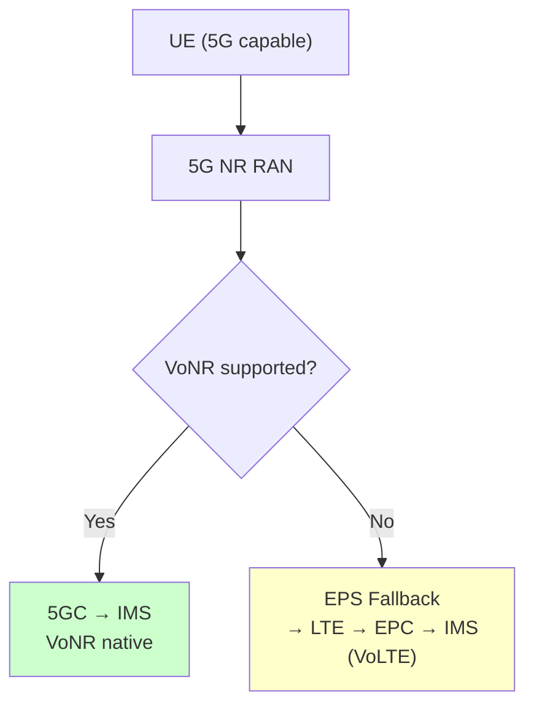

# SIM и IMS: VoLTE/VoNR через ISIM

> **Synthesis** — исчерпывающий обзор роли SIM-карты (UICC) в голосовых вызовах поверх IP: VoLTE (Voice over LTE) и VoNR (Voice over New Radio). Почему без SIM нет голоса в LTE/5G, как ISIM обеспечивает IMS-аутентификацию по UMTS AKA, и что меняется с переходом на eSIM.

---

## 1. Зачем SIM для VoLTE/VoNR

### 1.1 Постановка проблемы

В сетях GSM и UMTS голос передаётся через коммутацию каналов (circuit-switched, CS): MSC (Mobile Switching Centre) устанавливает выделенный канал, голос кодируется кодеком AMR и передаётся как битовый поток. Аутентификация здесь — стандартный GSM/UMTS AKA через USIM-приложение на UICC, и этого достаточно: сеть знает абонента, выделяет канал, вызов идёт.

LTE и 5G — сети исключительно пакетные (packet-switched only). CS-домена в них нет физически. Голос должен передаваться как VoIP-поток поверх IP-инфраструктуры. Но VoIP сам по себе не решает вопрос аутентификации абонента — нужен отдельный механизм, независимый от радио-аутентификации EPC/5GC.

Этим механизмом становится **IMS (IP Multimedia Subsystem)** — overlay-сеть, работающая поверх пакетной инфраструктуры и предоставляющая голосовые и мультимедийные услуги. IMS требует собственной аутентификации абонента, и вот здесь в игру вступает **ISIM-приложение** на UICC.

### 1.2 Эволюция голоса: от CS до VoNR

```
CS Voice (GSM/UMTS) → CSFB (LTE fallback) → VoLTE (IMS native) → VoNR (5G native)
```

| Поколение | Технология голоса | Сеть | Аутентификация голоса | Роль SIM |
|---|---|---|---|---|
| **2G (GSM)** | CS Voice (MSC) | GERAN + CS Core | GSM AKA (COMP128) | SIM: Ki → SRES + Kc |
| **3G (UMTS)** | CS Voice (MSC) | UTRAN + CS Core | UMTS AKA (MILENAGE) | USIM: K → RES + CK + IK |
| **CSFB (4G)** | CS Fallback — голос через 3G/2G CS | LTE + legacy CS | UMTS/GSM AKA (fallback) | USIM (как в UMTS) |
| **VoLTE (4G)** | IMS VoIP (AMR-WB) | LTE + EPC + IMS | IMS AKA (через ISIM) | ISIM + USIM |
| **VoNR (5G)** | IMS VoIP (EVS) | NR + 5GC + IMS | IMS AKA (через ISIM) | ISIM + USIM (DF_5GS) |

**Ключевой вывод:** начиная с VoLTE, SIM-карта участвует в голосовом вызове дважды:
1. **Радио-регистрация:** USIM → EPS AKA / 5G AKA → доступ к пакетной сети (EPC/5GC)
2. **IMS-регистрация:** ISIM → IMS AKA (UMTS AKA в SIP-контексте) → доступ к голосовым сервисам

Без ISIM (или его эмуляции через USIM) голос в LTE/5G невозможен — если сеть не поддерживает CSFB, телефон без ISIM не сможет совершать звонки.

> [!important] Без SIM = нет голоса
> IMS требует аутентификации абонента через UMTS AKA. Без UICC, предоставляющей ISIM (или USIM с IMS-ключом), SIP REGISTER не пройдёт — оператор не авторизует голосовой сервис. CSFB спасает только если доступна legacy CS-сеть и терминал поддерживает fallback.

### 1.3 Что такое ISIM и почему оно на UICC

ISIM (IMS Subscriber Identity Module) — приложение на UICC, определённое в 3GPP TS 31.103. Как и USIM, это ADF (Application Dedicated File) со своей файловой системой, командами и процедурами безопасности.

Причина размещения ISIM на UICC — безопасность. Долговременный секрет K (используемый в UMTS AKA для IMS) никогда не должен покидать защищённый чип. UICC с его аппаратной защитой от физического и логического доступа — единственное стандартизированное место для хранения этого ключа.

---

## 2. ISIM — приложение на UICC

### 2.1 Идентификация и адресация

ISIM регистрируется как ADF на UICC со своим AID:

```
ADF.ISIM
AID: A0 00 00 00 87 10 04 xx xx xx xx xx xx xx xx
     │  │  │  │  │  │
     │  │  │  │  │  └─ RID: 3GPP registered (87)
     │  │  │  │  └──── PIX: 10 = 3GPP application
     │  │  │  └─────── 00 = public
     │  │  └────────── 00 = no country
     │  └───────────── 00 = no registered provider
     └──────────────── A0 = international RID
```

Сравнение AID главных 3GPP-приложений:

| Приложение | AID (первые байты) | Стандарт |
|---|---|---|
| **USIM** | `A0 00 00 00 87 10 02` | TS 31.102 |
| **ISIM** | `A0 00 00 00 87 10 04` | TS 31.103 |
| **CSIM** | `A0 00 00 00 87 10 03` | TS 31.104 |

### 2.2 Файловая система ISIM

```
ADF.ISIM (AID: A0 00 00 00 87 10 04 ...)
│
├── EF_IMPI      (0x6F02) — IMS Private Identity
├── EF_IMPU      (0x6F03) — IMS Public Identity (SIP URI)
├── EF_DOMAIN    (0x6F04) — Home Network Domain
├── EF_P-CSCF    (0x6F05) — P-CSCF Address List
├── EF_AD        (0x6F06) — Administrative Data
├── EF_GBANL     (0x6F07) — GBA NAF List
├── EF_GBABP     (0x6F08) — GBA Bootstrapping Parameters
└── ... дополнительные EF для GBA, SMS over IP и т.д.
```

#### EF_IMPI — IMS Private Identity

Аналог IMSI, но для IMS-сети. Формат согласно RFC 2486 (Network Access Identifier, NAI):

```
Формат: username@ims.mnc<MNC>.mcc<MCC>.3gppnetwork.org

Пример: 234151000000001@ims.mnc015.mcc234.3gppnetwork.org
```

Где:
- `username` — уникальное имя абонента в IMS (может быть производным от IMSI)
- `mnc<MNC>` — код мобильной сети (2-3 цифры)
- `mcc<MCC>` — код страны
- `3gppnetwork.org` — стандартный 3GPP-домен для IMS

> [!note] IMPI vs IMSI
> IMPI — это NAI, а не числовой идентификатор. Однако username-часть часто совпадает с IMSI MSIN для удобства. Важно: IMPI используется только для аутентификации и никогда не показывается пользователю или вызываемому абоненту.

#### EF_IMPU — IMS Public Identity

Публичный идентификатор абонента в IMS. Это SIP URI или Tel URI, который видят другие абоненты при вызове:

```
Стандартный формат SIP URI:
sip:+12345678901@ims.mnc015.mcc234.3gppnetwork.org

Tel URI:
tel:+12345678901
```

EF_IMPU может содержать несколько записей (multiple IMPU per IMPI). Каждая запись имеет тип: SIP URI или Tel URI. Именно IMPU отображается на экране вызываемого абонента и используется для маршрутизации входящих вызовов.

#### EF_DOMAIN — Home Network Domain

Доменное имя домашней IMS-сети оператора. Используется в SIP-заголовках (например, `Route`, `Service-Route`) для маршрутизации сообщений к домашнему S-CSCF:

```
Пример: ims.mnc015.mcc234.3gppnetwork.org
```

#### EF_P-CSCF — P-CSCF Address List

Список IP-адресов или FQDN первого IMS-узла — Proxy-CSCF. Это точка входа в IMS для терминала. Может содержать:

- IPv4 адрес (4 байта)
- IPv6 адрес (16 байт)
- FQDN (переменная длина)

Если EF_P-CSCF пуст, терминал должен получить адрес P-CSCF через:
1. DHCP/PCO (Protocol Configuration Options) при установлении PDN-соединения
2. DNS SRV-запрос (`_sip._udp.ims.mnc<MNC>.mcc<MCC>.3gppnetwork.org`)

#### EF_AD — Administrative Data

Аналог EF_AD из USIM, но для ISIM-контекста. Содержит флаги, указывающие:

- Поддерживает ли ISIM emergency services через IMS
- Какие типы IMPU разрешены (SIP URI, Tel URI)
- Другие административные параметры

### 2.3 ISIM vs USIM: сравнительная таблица

| Свойство | USIM | ISIM |
|---|---|---|
| **Стандарт** | TS 31.102 | TS 31.103 |
| **AID** | `A0..87.10.02` | `A0..87.10.04` |
| **Главный ID** | IMSI (EF_IMSI) | IMPI (EF_IMPI) |
| **Публичный ID** | MSISDN (опционально) | IMPU — SIP URI / Tel URI |
| **Домен** | — | EF_DOMAIN |
| **Сетевой узел** | — | EF_P-CSCF |
| **Аутентификация** | GSM/UMTS/EPS/5G AKA | IMS AKA (UMTS AKA в SIP) |
| **Ключи** | K (EF_Keys, EF_5GAUTHKEYS) | K (тот же или отдельный) |
| **Emergency** | EF_ECC (CS emergency) | IMS Emergency (через EF_AD) |
| **Назначение** | Доступ к радио-сети | Доступ к IMS-сервисам |

> [!tip] Можно ли без ISIM?
> Теоретически — да. 3GPP допускает IMS-аутентификацию через USIM (без выделенного ISIM), если оператор разворачивает IMS с USIM-based authentication. В этом случае IMPI и IMPU генерируются динамически из IMSI: `IMPI = IMSI@ims.mnc<MNC>.mcc<MCC>.3gppnetwork.org`. На практике большинство операторов используют ISIM — это стандарт, обеспечивающий полный набор параметров и независимость IMS-профиля от USIM.

---

## 3. Процесс IMS-регистрации с ISIM

### 3.1 Полный sequence



### 3.2 Пошаговый разбор

**Фаза 1 — Чтение ISIM-параметров (ME → UICC):**

Терминал должен знать: (1) идентификатор для SIP-заголовков (IMPI, IMPU), (2) домашний домен IMS, (3) адрес P-CSCF для отправки SIP-сообщений. Всё это читается из ISIM через стандартные APDU-команды SELECT и READ BINARY.

Механизм получения P-CSCF имеет приоритет:
1. EF_P-CSCF на ISIM (статическая конфигурация)
2. PCO (Protocol Configuration Options) от P-GW/SMF при установлении PDN/PDU-сессии
3. DHCP
4. DNS SRV-запрос как fallback

**Фаза 2 — Начальный SIP REGISTER (ME → IMS):**

Терминал формирует SIP REGISTER с заголовками `From` (IMPU), `Authorization` (с username=IMPI, но без response — пустая авторизация). Этот REGISTER проходит цепочку P-CSCF → I-CSCF → S-CSCF, где S-CSCF запрашивает у HSS аутентификационные векторы (RAND, AUTN, XRES, CK, IK).

Сеть отвечает `401 Unauthorized` с параметрами UMTS AKA в заголовке `WWW-Authenticate` — это ключевой механизм RFC 3310 (HTTP Digest с AKA).

**Фаза 3 — ISIM AUTH (ME → UICC):**

Терминал извлекает RAND и AUTN из 401-ответа и отправляет ISIM-приложению команду AUTHENTICATE (INS=`0x88`). ISIM выполняет MILENAGE (или TUAK): проверяет AUTN (взаимная аутентификация — сеть аутентифицируется перед UICC!), вычисляет RES, CK, IK.

Это тот же алгоритм UMTS AKA, что и для USIM-доступа к сети. Разница в контексте: USIM AKA аутентифицирует доступ к радио-сети, ISIM AKA аутентифицирует доступ к IMS-сервисам. Оба используют один и тот же секрет K (хотя ключи могут различаться для USIM и ISIM — зависит от политики оператора).

**Фаза 4 — Финальный SIP REGISTER:**

Терминал использует RES для вычисления SIP Digest response (RFC 3310) и отправляет повторный REGISTER с полным заголовком `Authorization`. Сеть (S-CSCF) сверяет ответ с XRES. При совпадении — `200 OK`, абонент зарегистрирован в IMS и может совершать VoLTE/VoNR вызовы.

### 3.3 Таймеры и перерегистрация

IMS-регистрация имеет срок жизни (expires). Стандартное значение — 600 000 секунд (~7 дней), но на практике операторы используют 3600–7200 секунд (1–2 часа). Терминал должен выполнить re-REGISTER до истечения срока, иначе IMS-регистрация теряется и входящие вызовы не доставляются.

При перерегистрации процесс может быть сокращён: если у S-CSCF сохранён security context, повторная AKA не требуется — достаточно SIP Digest без нового RAND/AUTN.

---

## 4. Аутентификация IMS через ISIM

### 4.1 UMTS AKA в IMS-контексте (RFC 3310)

IMS заимствует механизм аутентификации у 3GPP, адаптируя его к HTTP Digest (RFC 2617/7616). RFC 3310 определяет, как UMTS AKA параметры (RAND, AUTN) передаются в SIP-заголовках, и как RES используется для Digest-ответа.

```
Классический SIP Digest:          IMS AKA (RFC 3310):
H(A1) = MD5(user:realm:pass)      H(A1) = f(RES, IK, CK)
  ↓                                ↓
response = MD5(H(A1):nonce:...)    response = MD5(H(A1):nonce:...)
```

**Параметры в заголовке WWW-Authenticate (401):**

| Параметр | Значение |
|---|---|
| `realm` | Домен оператора (`ims.mnc015.mcc234.3gppnetwork.org`) |
| `nonce` | RAND, закодированный в Base64 |
| `algorithm` | `AKAv1-MD5` или `AKAv2-SHA-256` |
| `autn` | AUTN, закодированный в Base64 |
| `qop` | `auth`, `auth-int` |

**AKAv1-MD5 vs AKAv2-SHA-256:**
- `AKAv1-MD5`: RFC 3310, использует MD5 для хеширования; RES до 128 бит
- `AKAv2-SHA-256`: RFC 4169 (устарел), RFC 7616 с обновлением — SHA-256; поддержка более длинных ключей

### 4.2 ISIM AUTH vs USIM AUTH — в чём разница

И ISIM, и USIM выполняют UMTS AKA. Алгоритм один и тот же. Разница — в контексте использования:



| Аспект | USIM AUTH | ISIM AUTH |
|---|---|---|
| **Протокол** | NAS (MM/GMM/EMM/5GMM) | SIP (RFC 3310) |
| **Кто запрашивает** | MME (4G), AMF (5G) | S-CSCF (через P-CSCF) |
| **Что получает UICC** | RAND + AUTN от MME/AMF | RAND + AUTN из SIP 401 |
| **Что возвращает UICC** | RES, CK, IK | RES, CK, IK (те же функции) |
| **Что с результатами** | RES → MME; CK,IK → KASME | RES → SIP Digest response |
| **Ключ K** | EF_Keys (USIM) | Тот же или отдельный K в ISIM |
| **Результат успеха** | Security Mode Complete | SIP 200 OK |
| **Дополнительно** | K_df (KASME → цепь ключей) | IPsec SA (опционально) |

> [!note] Один K или разные?
> Оператор может использовать один и тот же секрет K для USIM и ISIM, или разные. Техническая возможность есть в обоих вариантах. На практике большинство операторов используют один K — это упрощает логистику ключей и персонализацию UICC. Однако с точки зрения безопасности раздельные ключи предпочтительнее: компрометация одного не компрометирует другой.

### 4.3 IPsec-шифрование IMS-сигнализации

После успешной IMS-регистрации SIP-сообщения могут передаваться в открытом виде (UDP/TCP) или защищаться через IPsec ESP (Encapsulating Security Payload). Ключи для IPsec могут быть производными от CK и IK, полученных при ISIM AUTH. Это обеспечивает:

- **Конфиденциальность** SIP-сигнализации между UE и P-CSCF
- **Integrity** — защиту от подделки SIP-сообщений
- **Anti-replay** — через sequence numbers в IPsec

На практике многие операторы не используют IPsec для IMS (полагаясь на безопасность LTE/5G-радио), но спецификация этого требует.

---

## 5. VoLTE vs VoNR — что меняется в SIM

### 5.1 SIM та же самая

Фундаментальный тезис: **ISIM не зависит от Radio Access Technology (RAT)**. Одна и та же UICC с ISIM-приложением обеспечивает голос и в VoLTE (4G), и в VoNR (5G). ISIM — это IMS-уровень (прикладной), а VoLTE/VoNR — это транспорт (радио + core).

```
┌─────────────────────────────────────────────────────┐
│  Прикладной уровень: IMS (одинаков для 4G и 5G)     │
│  ┌───────────────────────────────────────────────┐  │
│  │  SIP (REGISTER, INVITE, BYE)                  │  │
│  │  ISIM: IMPI, IMPU, Domain, P-CSCF, AUTH      │  │
│  └───────────────────────────────────────────────┘  │
├─────────────────────────────────────────────────────┤
│  Транспортный уровень: зависит от RAT                │
│  ┌─────────────────┐  ┌─────────────────────────┐  │
│  │  4G: LTE + EPC  │  │  5G: NR + 5GC           │  │
│  │  PDN connection │  │  PDU Session             │  │
│  │  Default EPS    │  │  QoS Flows               │  │
│  │  bearer (QCI=1) │  │  5QI=1 (voice)           │  │
│  └─────────────────┘  └─────────────────────────┘  │
├─────────────────────────────────────────────────────┤
│  Физический уровень: UICC (одинаков для 4G и 5G)    │
│  ┌───────────────────────────────────────────────┐  │
│  │  ADF.USIM (radio auth) + ADF.ISIM (IMS auth) │  │
│  └───────────────────────────────────────────────┘  │
└─────────────────────────────────────────────────────┘
```

### 5.2 Что действительно меняется

| Аспект | VoLTE (4G) | VoNR (5G) |
|---|---|---|
| **RAN** | E-UTRAN (LTE) | NR (New Radio) |
| **Core** | EPC (MME, S-GW, P-GW) | 5GC (AMF, SMF, UPF) |
| **IMS** | Тот же IMS Core | Тот же IMS Core |
| **USIM** | EF_Keys (CK, IK), EF_EPSLOCI | DF_5GS: EF_5GAUTHKEYS, EF_5GS3GPPLOCI |
| **ISIM** | Без изменений | Без изменений |
| **P-CSCF Discovery** | Через PCO от P-GW + DHCP | Через PDU Session Establishment от SMF |
| **QoS** | QCI=1 (GBR, 50ms delay) | 5QI=1 (GBR, 50ms delay) — совместим |
| **Кодек** | AMR-WB (HD Voice) | EVS (Ultra HD / Fullband) |
| **Slicing** | Нет | ✅ Отдельный сетевой слайс для голоса |
| **Emergency** | eCall (CS-based) | IMS Emergency over 5G (TS 23.501) |

### 5.3 P-CSCF Discovery в 5G

В VoLTE адрес P-CSCF передаётся через PCO (Protocol Configuration Options) при установлении PDN-соединения. В 5G механизм аналогичен: P-CSCF может быть передан SMF при установлении PDU-сессии через расширенный PCO или через DHCP.

Приоритет получения P-CSCF в 5G:
1. **EF_P-CSCF на ISIM** (статический, всегда первый)
2. **PCO от SMF** (динамический, при PDU Session Establishment)
3. **DHCPv4/v6** (если PCO указывает DHCP)
4. **DNS SRV** (`_sip._udp.ims.mnc<MNC>.mcc<MCC>.3gppnetwork.org`)

Это обеспечивает гибкость: оператор может статически прописать адрес на UICC (для production) или раздавать динамически (для тестовых/лабораторных сред).

### 5.4 EPS Fallback vs VoNR

В переходный период 5G-развёртывания голос может идти двумя путями:



При EPS Fallback терминал переключается на LTE для осуществления вызова, но SIM-карта не переключается — та же ISIM-аутентификация, тот же IMPI/IMPU, тот же SIP REGISTER. С точки зрения UICC это просто VoLTE.

---

## 6. Emergency Services

### 6.1 Экстренные вызовы и SIM

Экстренные вызовы — особый случай: они должны работать даже без SIM-карты (limited service), без PIN-верификации, и даже при отсутствии IMS-регистрации. Это регулируется национальными законами (например, eCall в ЕС).

SIM-карта может помогать экстренным вызовам через несколько механизмов:

| Файл | Приложение | Содержит | Роль в emergency |
|---|---|---|---|
| **EF_ECC** (`0x6FB7`) | USIM | Список экстренных номеров (112, 911, ...) | Телефон читает до PIN-верификации; если номер совпадает — вызов идёт без аутентификации |
| **EF_ECC** (расширенный) | USIM | Категория emergency (police, fire, ambulance, ...) | Информирует сеть о типе emergency |
| **EF_AD (ISIM)** | ISIM | Флаг "IMS Emergency supported" | Указывает, что ISIM поддерживает emergency over IMS |
| **IMS Emergency** | IMS Core | Emergency SIP URI (`urn:service:sos`) | Альтернативный путь: SIP REGISTER с `sos` |

### 6.2 CS Emergency vs IMS Emergency

```
CS Emergency (2G/3G, CSFB):           IMS Emergency (VoLTE/VoNR):
────────────────────────────          ──────────────────────────
UE набирает 112                       UE набирает 112
→ сверка с EF_ECC                     → сверка с EF_ECC
→ CS Call Setup (SETUP)               → SIP REGISTER (urn:service:sos)
→ MSC маршрутизирует на PSAP          → E-CSCF → LRF → PSAP
→ Emergency Centre (PSAP)             → Emergency Centre (PSAP)

Плюсы: просто, legacy                Плюсы: location (GPS), multimedia
Минусы: только голос                 Минусы: требует IMS регистрации
```

### 6.3 eCall (европейский стандарт)

eCall — автоматическая система экстренного вызова в ЕС. При аварии автомобиль автоматически набирает 112 и передаёт MSD (Minimum Set of Data): GPS-координаты, VIN, время, число пассажиров. С апреля 2018 обязателен для всех новых автомобилей в ЕС.

SIM-карта в eCall-модуле содержит EF_ECC с номером 112. Вызов может идти как CS (GSM/UMTS), так и через IMS (VoLTE). Ключевое требование: eCall должен работать даже в роуминге и с ограниченным сервисом.

> [!note] Emergency без ISIM
> Даже если ISIM отсутствует или заблокирован, телефон может совершить экстренный вызов через IMS Emergency Registration (SIP REGISTER с `urn:service:sos`). Эта регистрация не требует стандартной IMS-аутентификации — сеть пропускает emergency запросы без проверки IMPI/IMPU.

---

## 7. ISIM и eSIM

### 7.1 ISIM в составе Profile Package

В eSIM-экосистеме ISIM — часть Profile Package (профиля оператора), загружаемого на eUICC. Профиль содержит:

```
Profile Package (GSMA SGP.22):
├── File System
│   ├── MF
│   ├── ADF.USIM
│   │   ├── EF_IMSI, EF_Keys, EF_UST, ...
│   │   └── DF_5GS
│   └── ADF.ISIM
│       ├── EF_IMPI, EF_IMPU, EF_DOMAIN, EF_P-CSCF, ...
│       └── EF_AD
├── Security Domains (ISD-P)
│   └── Keysets (K, OTA keys, ...)
└── MNO-SD (Operator's Security Domain)
```

ISIM здесь — просто ещё одно приложение в профиле, на равных с USIM. Процесс загрузки профиля через SM-DP+ и установки на eUICC включает ISIM в общем потоке: создание ADF.ISIM, инициализация EF, установка ключей.

### 7.2 Перенос ISIM между профилями

eUICC позволяет хранить несколько профилей (один активный, остальные inactive). Каждый профиль имеет собственный ADF.USIM и ADF.ISIM с уникальными IMPI, IMPU и K. При переключении профиля:

1. eUICC деактивирует текущий профиль (включая ISIM)
2. Активирует новый профиль (новый ISIM с новым K)
3. Терминал выполняет REFRESH (USIM + ISIM сброс)
4. ME заново читает ISIM-параметры
5. ME выполняет IMS-регистрацию с новым IMPI

С точки зрения IMS-сети — это новый абонент. Старый IMPI истекает по таймеру регистрации.

> [!warning] Ловушка eSIM + IMS
> При переключении профиля IMS-регистрация старого профиля не отменяется явно (нет SIP DEREGISTER). S-CSCF держит регистрацию до истечения expires-таймера. Это может привести к тому, что входящие вызовы на старый IMPU будут пытаться маршрутизироваться на неактивный профиль и теряться. Решение: при смене профиля LPA должен инициировать явный SIP DEREGISTER, или оператор должен использовать короткие expires-таймеры.

### 7.3 ISIM в eSIM: M2M vs Consumer

| Аспект | M2M eSIM (SGP.02) | Consumer eSIM (SGP.22) |
|---|---|---|
| **Загрузка ISIM** | Push от SM-DP через SM-SR | Pull пользователем через LPA |
| **Профили** | Один активный, удалённое переключение | Несколько, пользователь переключает в UI |
| **ISIM-параметры** | Фиксируются при персонализации SM-DP | Гибкая настройка (SM-DP+ шаблоны) |
| **Смена ISIM** | Через SM-SR команду | Через LPA UI |
| **IMS Emergency** | Обязательно (SGP.02 R.4+) | Обязательно (SGP.22 R.3+) |
| **Типичное применение** | Automotive eCall, Industrial IoT | Смартфоны, планшеты, умные часы |

---

## 8. Практическое: чтение ISIM через pySim

### 8.1 Подготовка

pySim — open-source инструмент (часть Osmocom) для чтения и программирования SIM-карт. Для доступа к ISIM требуется:

```bash
# Установка pySim
git clone https://gitea.osmocom.org/sim-card/pysim
cd pysim
pip install -r requirements.txt

# Запуск интерактивного shell с PC/SC reader
./pySim-shell.py -p 0
```

### 8.2 Базовые APDU-команды

После запуска pySim-shell предоставляет доступ ко всем приложениям на UICC. Вот последовательность для чтения ISIM:

```
# Шаг 1: Проверить, какие приложения есть на UICC
pySIM-shell (MF)> select_ais
# Покажет список AID: USIM, ISIM, ...

# Шаг 2: Выбрать ISIM
pySIM-shell (MF)> select_adf ISIM
# или явно по AID:
pySIM-shell (MF)> select_aid A0000000871004FFFFFFFF8907090000

# Шаг 3: Чтение ISIM-файлов
pySIM-shell (ADF.ISIM)> read_binary 0x6F02  # EF_IMPI
# → IMPI: 234151000000001@ims.mnc015.mcc234.3gppnetwork.org

pySIM-shell (ADF.ISIM)> read_binary 0x6F03  # EF_IMPU
# → IMPU: sip:+12345678901@ims.mnc015.mcc234.3gppnetwork.org

pySIM-shell (ADF.ISIM)> read_binary 0x6F04  # EF_DOMAIN
# → Domain: ims.mnc015.mcc234.3gppnetwork.org

pySIM-shell (ADF.ISIM)> read_binary 0x6F05  # EF_P-CSCF
# → P-CSCF: 10.11.12.13 (или FQDN)

pySIM-shell (ADF.ISIM)> read_binary 0x6F06  # EF_AD
# → Administrative Data
```

### 8.3 Ручные APDU через низкоуровневые команды

Если pySim-shell недоступен, те же операции можно выполнить через любой PC/SC tool (например, `opensc-tool`, `gp`):

```
# SELECT ISIM по AID
00 A4 04 04 0F A0 00 00 00 87 10 04 FF FF FF FF 89 07 09 00 00

# SELECT EF_IMPI (0x6F02)
00 A4 00 04 02 6F 02

# READ BINARY (все байты)
00 B0 00 00 FF

# SELECT EF_P-CSCF (0x6F05)
00 A4 00 04 02 6F 05

# READ BINARY
00 B0 00 00 FF
```

### 8.4 Диагностика IMS-регистрации

pySim также полезен для диагностики проблем с VoLTE/VoNR:

```bash
# Проверить, что ISIM присутствует
pySIM-shell (MF)> select_ais | grep -i ISIM

# Проверить целостность ISIM-файлов
pySIM-shell (ADF.ISIM)> verify_chv 1  # Разблокировать PIN1
pySIM-shell (ADF.ISIM)> read_binary 0x6F02  # IMPI — не пустой?
pySIM-shell (ADF.ISIM)> read_binary 0x6F05  # P-CSCF — валидный IP?

# Проверить USIM-статус (радио-доступ)
pySIM-shell (ADF.USIM)> read_binary 0x6FE3  # EF_EPSLOCI — LTE зарегистрирован?
pySIM-shell (ADF.USIM)> read_binary 0x6FF0  # EF_5GS3GPPLOCI — 5G зарегистрирован?
```

**Частые проблемы:**

| Симптом | ISIM-причина | Решение |
|---|---|---|
| "No service" в VoLTE | EF_P-CSCF пуст или неверен | Записать корректный IP/FQDN P-CSCF |
| "Registration failed" | IMPI не совпадает с HSS-записью | Проверить EF_IMPI, перезаписать |
| IMS emergency работает, VoLTE нет | ISIM AUTH отказ — неверный K | Переперсонализировать ISIM с правильным K |
| VoNR падает до VoLTE | EF_5GS3GPPLOCI пуст — нет 5G-регистрации | Проверить 5G-поддержку USIM (DF_5GS) |

### 8.5 Программный доступ через Python

pySim предоставляет Python API для автоматизированного тестирования:

```python
from pySim.transport import init_reader
from pySim.commands import SimCardCommands
from pySim.ts_31_103 import ADF_ISIM

# Инициализация reader
reader = init_reader(opts)  # opts от argparse
card = SimCardCommands(reader)

# SELECT ISIM
isim = ADF_ISIM()
card.select_adf(isim.aid)

# Чтение файлов
impi = card.read_binary('6f02')
impu = card.read_binary('6f03')
domain = card.read_binary('6f04')
pcscf = card.read_binary('6f05')

print(f"IMPI: {isim.decode_impi(impi)}")
print(f"IMPU: {isim.decode_impu(impu)}")
print(f"Domain: {isim.decode_domain(domain)}")
print(f"P-CSCF: {isim.decode_pcscf(pcscf)}")
```

---

## 9. Безопасность ISIM

### 9.1 Векторы атак

| Атака | ISIM-специфичная защита |
|---|---|
| **False P-CSCF** | Взаимная аутентификация (AUTN) — подставной IMS не пройдёт AKA |
| **SIP replay** | SQN в AUTN защищает от replay UMTS AKA; SIP nonce защищает SIP-уровень |
| **IMPI/IMPU перехват** | IPsec между UE и P-CSCF (опционально); шифрование на радио-уровне |
| **Кража K из ISIM** | Аппаратная защита UICC (secure element); K никогда не покидает чип |
| **DoD-атаки на IMS** | Ограничение попыток AUTHENTICATE (обычно после N неудач — блокировка USIM-сессии) |
| **Profile switching race** | eUICC обеспечивает атомарность переключения профилей; SCP03 защищает ISD-P |

### 9.2 ISIM и сетевая безопасность

ISIM участвует в двух независимых контурах безопасности:

```
Контур 1: Радио-доступ (USIM)
ME ←→ RAN (LTE/NR)
Защита: PDCP ciphering (AES, SNOW 3G, ZUC)
Ключи: K_RRCenc, K_RRCint, K_UPenc
Основа: USIM AKA (K → CK,IK → KASME/K_AUSF)

Контур 2: IMS-сервисы (ISIM)
ME ←→ P-CSCF (через IP)
Защита: (опционально) IPsec ESP
Ключи: CK, IK из ISIM AKA
Основа: ISIM AKA (тот же или отдельный K)
```

**Важно:** компрометация радио-контура не компрометирует IMS-контур автоматически (при раздельных K для USIM и ISIM). Это дополнительный уровень защиты, который операторы могут использовать для критичных сервисов (например, правительственная связь, VoLTE для банков).

---

## 10. Связи

### Связанные концепции
- IMS/VoLTE/VoNR архитектура: [[wiki/concepts/IMS_VoLTE]]
- USIM-приложение: [[wiki/concepts/USIM]]
- 5G Core: [[wiki/concepts/5G_Core]]
- Безопасность UICC: [[wiki/concepts/UICC_Security]]
- eSIM/eUICC: [[wiki/concepts/eSIM]]
- UICC общая архитектура: [[wiki/concepts/UICC]]
- Файловая система UICC: [[wiki/concepts/UICC_File_System]]

### Связанные synthesis
- Эволюция аутентификации (ISIM AUTH): [[wiki/syntheses/auth_evolution]]
- Экстренные номера (EF_ECC): [[wiki/syntheses/sim_files_emergency]]
- Эволюция eSIM: [[wiki/syntheses/esim_evolution]]
- Обзор файловой системы SIM: [[wiki/syntheses/sim_filesystem_overview]]

### Specifications
- ISIM: TS 31.103 (3GPP)
- USIM: TS 31.102 (3GPP)
- IMS AKA: RFC 3310 (HTTP Digest AKA)
- 5G Security: TS 33.501
- eSIM Consumer: GSMA SGP.22
- eSIM M2M: GSMA SGP.02
- IMS Emergency: TS 23.167
